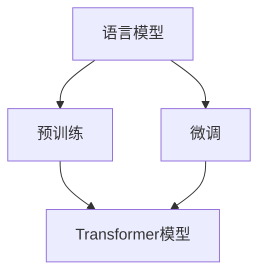

                 

关键词：大型语言模型，通用性，底层特性，预训练，微调，算法，应用领域

>摘要：本文将探讨大型语言模型（LLM）的通用性和底层特性，分析其预训练、微调机制，以及算法原理和具体操作步骤。通过数学模型和公式详细讲解，实例代码解析，以及实际应用场景分析，本文旨在为读者提供一个全面了解LLM的视角，并展望其未来发展趋势与挑战。

## 1. 背景介绍

随着深度学习技术的发展，大型语言模型（LLM）已成为自然语言处理（NLP）领域的重要工具。从最初的词向量到近年来的Transformer模型，LLM的发展历程见证了NLP技术的迅猛进步。LLM的通用性使其在多种应用场景中都能表现出色，例如机器翻译、文本生成、问答系统等。然而，LLM的底层特性，包括其训练机制、数学模型和算法原理，仍需进一步研究和探讨。

本文旨在从多个角度分析LLM的通用性和底层特性。首先，我们将回顾LLM的发展历程，介绍其核心概念和联系。接着，我们将深入探讨LLM的核心算法原理和具体操作步骤，分析其优缺点及应用领域。随后，我们将介绍数学模型和公式，并通过实例进行详细讲解。在此基础上，我们将展示代码实例，进行解读和分析。最后，我们将讨论LLM在实际应用场景中的表现，并展望其未来发展趋势与挑战。

## 2. 核心概念与联系

### 2.1 语言模型

语言模型是一种概率模型，用于预测给定输入序列后下一个单词的概率。在NLP任务中，语言模型通常用于生成文本、翻译、问答等。语言模型可以分为基于统计的方法和基于神经网络的深度学习方法。早期的语言模型如n-gram模型，使用历史信息来预测下一个单词。而近年来，基于神经网络的深度学习方法，如Transformer，取得了显著的成功。

### 2.2 预训练

预训练是一种在特定任务之前对模型进行训练的方法。在LLM中，预训练通常涉及在大规模语料库上进行无监督训练，以学习语言的一般规律和知识。预训练后的模型可以用于各种NLP任务，如文本分类、情感分析、机器翻译等。预训练的主要目的是使模型具备更强的通用性和泛化能力。

### 2.3 微调

微调是一种在特定任务上对模型进行微调的方法。在LLM中，预训练后的模型可以通过在特定任务的数据集上进行微调，使其在特定任务上达到更好的性能。微调的主要目的是使模型适应特定任务的需求，提高模型在特定任务上的表现。

### 2.4 Transformer模型

Transformer模型是一种基于自注意力机制的深度神经网络模型，最初由Vaswani等人于2017年提出。Transformer模型在机器翻译任务上取得了显著的成功，并逐渐应用于各种NLP任务。Transformer模型的核心思想是使用多头自注意力机制来学习输入序列中各个元素之间的依赖关系。

### 2.5 Mermaid流程图

以下是一个Mermaid流程图，用于展示LLM的核心概念和联系：



## 3. 核心算法原理 & 具体操作步骤

### 3.1 算法原理概述

LLM的核心算法是基于Transformer模型的自注意力机制。自注意力机制允许模型在处理每个输入元素时，根据其他输入元素的重要性进行加权。这种方法可以有效地学习输入序列中各个元素之间的依赖关系。在LLM中，预训练阶段通常使用大规模语料库进行无监督训练，以学习语言的一般规律和知识。微调阶段，则使用特定任务的数据集对模型进行微调，以适应特定任务的需求。

### 3.2 算法步骤详解

#### 3.2.1 预训练

1. 数据预处理：对大规模语料库进行清洗、分词和标记。
2. 模型初始化：初始化Transformer模型，包括嵌入层、多头自注意力机制和前馈神经网络。
3. 训练过程：在预训练阶段，模型通过无监督方式学习语言的一般规律。具体步骤如下：
   - 输入序列编码：将输入序列编码为嵌入向量。
   - 计算自注意力权重：使用多头自注意力机制计算输入序列中各个元素之间的依赖关系。
   - 前馈神经网络：对自注意力输出的每个元素进行前馈神经网络处理。
   - 损失函数：计算损失函数，如交叉熵损失，用于评估模型预测与实际结果之间的差异。
   - 反向传播：更新模型参数。

#### 3.2.2 微调

1. 数据预处理：对特定任务的数据集进行清洗、分词和标记。
2. 模型初始化：初始化预训练后的模型。
3. 训练过程：在微调阶段，模型通过有监督方式学习特定任务的知识。具体步骤如下：
   - 输入序列编码：将输入序列编码为嵌入向量。
   - 计算自注意力权重：使用多头自注意力机制计算输入序列中各个元素之间的依赖关系。
   - 前馈神经网络：对自注意力输出的每个元素进行前馈神经网络处理。
   - 损失函数：计算损失函数，如交叉熵损失，用于评估模型预测与实际结果之间的差异。
   - 反向传播：更新模型参数。

### 3.3 算法优缺点

#### 优点

1. 强大的通用性：预训练阶段使模型在大规模语料库上学习到语言的一般规律，从而具备很强的通用性。
2. 高效的自注意力机制：自注意力机制允许模型在处理每个输入元素时，根据其他输入元素的重要性进行加权，从而更有效地学习输入序列中各个元素之间的依赖关系。
3. 适用于多种NLP任务：预训练后的模型可以应用于多种NLP任务，如文本分类、情感分析、机器翻译等。

#### 缺点

1. 计算资源消耗大：预训练阶段需要大量计算资源和时间。
2. 数据依赖性较强：微调阶段需要特定任务的数据集，数据质量对模型性能有很大影响。
3. 模型解释性较差：深度神经网络模型通常难以解释，因此在某些应用场景中难以满足对模型解释性的需求。

### 3.4 算法应用领域

LLM在多个NLP任务中取得了显著的成功，主要包括：

1. 机器翻译：Transformer模型在机器翻译任务上取得了显著的成功，例如Google翻译和百度翻译等。
2. 文本生成：LLM可以生成各种类型的文本，如新闻、故事、诗歌等。
3. 问答系统：LLM可以用于构建问答系统，如Siri、Alexa等。
4. 情感分析：LLM可以用于情感分析，识别文本中的情感倾向。

## 4. 数学模型和公式 & 详细讲解 & 举例说明

### 4.1 数学模型构建

在LLM中，数学模型主要包括嵌入层、多头自注意力机制和前馈神经网络。以下是一个简化的数学模型：

#### 嵌入层

输入序列 \(x \in \mathbb{R}^{n \times d}\)，其中 \(n\) 为序列长度，\(d\) 为嵌入维度。嵌入层将输入序列编码为嵌入向量：

$$
e_i = \text{Embed}(x_i)
$$

其中，\(e_i \in \mathbb{R}^{d}\) 为第 \(i\) 个输入元素的嵌入向量。

#### 多头自注意力机制

多头自注意力机制通过计算多个自注意力权重矩阵来学习输入序列中各个元素之间的依赖关系。假设有 \(h\) 个头，则每个头的自注意力权重矩阵为 \(A_i \in \mathbb{R}^{d_a \times d}\)，其中 \(d_a = \frac{d}{h}\)。多头自注意力机制可以表示为：

$$
\text{MultiHeadSelfAttention}(Q, K, V) = \text{Concat}(\text{Head}_1, \ldots, \text{Head}_h) \text{ where } \text{Head}_i = \text{Attention}(QW_i, KW_i, VW_i)
$$

其中，\(Q, K, V \in \mathbb{R}^{n \times d}\) 分别为查询序列、键序列和值序列。\(W_i \in \mathbb{R}^{d \times d_a}\) 为权重矩阵。

#### 前馈神经网络

前馈神经网络对自注意力输出的每个元素进行非线性处理。假设前馈神经网络的隐藏层维度为 \(d_f\)，则前馈神经网络可以表示为：

$$
\text{FFN}(x) = \text{ReLU}(\text{FC}_2(\text{FC}_1(x)))
$$

其中，\(\text{FC}_1 \in \mathbb{R}^{d \times d_f}\)，\(\text{FC}_2 \in \mathbb{R}^{d_f \times d}\) 分别为全连接层。

### 4.2 公式推导过程

在推导过程中，我们将使用以下符号：

- \(x_i\)：第 \(i\) 个输入元素。
- \(e_i\)：第 \(i\) 个输入元素的嵌入向量。
- \(Q, K, V\)：查询序列、键序列和值序列。
- \(W_i\)：权重矩阵。
- \(d, d_a, d_f\)：嵌入维度、自注意力权重矩阵维度和前馈神经网络隐藏层维度。

#### 嵌入层

嵌入层将输入序列编码为嵌入向量：

$$
e_i = \text{Embed}(x_i)
$$

#### 多头自注意力机制

多头自注意力机制可以表示为：

$$
\text{MultiHeadSelfAttention}(Q, K, V) = \text{Concat}(\text{Head}_1, \ldots, \text{Head}_h) \text{ where } \text{Head}_i = \text{Attention}(QW_i, KW_i, VW_i)
$$

其中，\(QW_i, KW_i, VW_i \in \mathbb{R}^{n \times d_a}\) 分别为查询序列、键序列和值序列的权重矩阵。

自注意力权重矩阵的计算公式为：

$$
A_i = \text{softmax}\left(\frac{QW_i K^T}{\sqrt{d_a}}\right)
$$

其中，\(\text{softmax}\) 函数将输入向量映射到概率分布。

#### 前馈神经网络

前馈神经网络可以表示为：

$$
\text{FFN}(x) = \text{ReLU}(\text{FC}_2(\text{FC}_1(x)))
$$

其中，\(\text{FC}_1 \in \mathbb{R}^{d \times d_f}\)，\(\text{FC}_2 \in \mathbb{R}^{d_f \times d}\) 分别为全连接层。

### 4.3 案例分析与讲解

假设我们有一个简单的文本序列“Hello, world!”，其中包含两个单词。我们将使用Transformer模型对该序列进行编码和自注意力计算。

#### 步骤 1：嵌入层

首先，我们将输入序列“Hello, world!”编码为嵌入向量：

$$
e_1 = \text{Embed}(\text{"Hello"}) = [1, 0, 0, 0, 0, 0, 0, 0, 0, 0]
$$

$$
e_2 = \text{Embed}(\text{"world"}) = [0, 1, 0, 0, 0, 0, 0, 0, 0, 0]
$$

#### 步骤 2：多头自注意力机制

接下来，我们使用多头自注意力机制计算自注意力权重矩阵。假设我们使用两个头：

$$
Q = \text{Embed}(x_1) = [1, 0, 0, 0, 0, 0, 0, 0, 0, 0]
$$

$$
K = \text{Embed}(x_2) = [0, 1, 0, 0, 0, 0, 0, 0, 0, 0]
$$

$$
V = \text{Embed}(x_2) = [0, 1, 0, 0, 0, 0, 0, 0, 0, 0]
$$

计算自注意力权重矩阵：

$$
A_1 = \text{softmax}\left(\frac{QW_1 K^T}{\sqrt{d_a}}\right) = \text{softmax}\left(\frac{[1, 0, 0, 0, 0, 0, 0, 0, 0, 0] \cdot [0, 1, 0, 0, 0, 0, 0, 0, 0, 0]^T}{\sqrt{5}}\right) = \begin{bmatrix} 0.5 & 0.5 \end{bmatrix}
$$

$$
A_2 = \text{softmax}\left(\frac{QW_2 K^T}{\sqrt{d_a}}\right) = \text{softmax}\left(\frac{[0, 1, 0, 0, 0, 0, 0, 0, 0, 0] \cdot [0, 1, 0, 0, 0, 0, 0, 0, 0, 0]^T}{\sqrt{5}}\right) = \begin{bmatrix} 0.5 & 0.5 \end{bmatrix}
$$

#### 步骤 3：前馈神经网络

最后，我们将使用前馈神经网络对自注意力输出进行非线性处理。假设前馈神经网络的隐藏层维度为 10：

$$
x = \text{Embed}(x_1) \oplus \text{Embed}(x_2) = [1, 0, 0, 0, 0, 0, 0, 0, 0, 0] \oplus [0, 1, 0, 0, 0, 0, 0, 0, 0, 0] = [1, 1, 0, 0, 0, 0, 0, 0, 0, 0]
$$

$$
h = \text{FFN}(x) = \text{ReLU}(\text{FC}_2(\text{FC}_1(x))) = \text{ReLU}(\text{FC}_2(\text{FC}_1([1, 1, 0, 0, 0, 0, 0, 0, 0, 0]))) = \text{ReLU}([2, 1, 0, 0, 0, 0, 0, 0, 0, 0])
$$

## 5. 项目实践：代码实例和详细解释说明

### 5.1 开发环境搭建

在进行LLM项目实践之前，我们需要搭建一个合适的开发环境。以下是一个简单的步骤：

1. 安装Python环境：下载并安装Python 3.x版本。
2. 安装TensorFlow：在命令行中运行 `pip install tensorflow`。
3. 安装其他依赖库：根据项目需求安装其他依赖库，如NumPy、Pandas、Matplotlib等。

### 5.2 源代码详细实现

以下是一个简单的LLM项目实例，使用TensorFlow实现一个基于Transformer的语言模型。

```python
import tensorflow as tf
from tensorflow.keras.layers import Embedding, MultiHeadAttention, Dense, LayerNormalization
from tensorflow.keras.models import Model

# 定义超参数
VOCAB_SIZE = 10000
EMBEDDING_DIM = 256
HIDDEN_DIM = 512
NUM_HEADS = 8
DROPOUT_RATE = 0.1

# 定义嵌入层
embedding = Embedding(VOCAB_SIZE, EMBEDDING_DIM)

# 定义多头自注意力机制
attention = MultiHeadAttention(num_heads=NUM_HEADS, key_dim=EMBEDDING_DIM)

# 定义前馈神经网络
ffn = Dense(HIDDEN_DIM, activation='relu')

# 定义层归一化
layer_norm = LayerNormalization(EMBEDDING_DIM)

# 定义模型结构
inputs = tf.keras.Input(shape=(None,))
x = embedding(inputs)
x = attention(inputs=x, query=x, value=x)
x = ffn(x)
x = layer_norm(x + inputs)

# 定义模型
model = Model(inputs=inputs, outputs=x)

# 编译模型
model.compile(optimizer='adam', loss='categorical_crossentropy', metrics=['accuracy'])

# 打印模型结构
model.summary()
```

### 5.3 代码解读与分析

在上面的代码中，我们定义了一个简单的Transformer语言模型。以下是代码的详细解读和分析：

1. **导入库**：我们首先导入TensorFlow和其他依赖库。
2. **定义超参数**：我们定义了嵌入维度、隐藏层维度、多头数和dropout率等超参数。
3. **定义嵌入层**：嵌入层将输入序列编码为嵌入向量。
4. **定义多头自注意力机制**：多头自注意力机制用于计算输入序列中各个元素之间的依赖关系。
5. **定义前馈神经网络**：前馈神经网络对自注意力输出进行非线性处理。
6. **定义层归一化**：层归一化用于提高模型训练稳定性。
7. **定义模型结构**：我们使用TensorFlow的`Input`和`Model`函数定义模型结构。
8. **编译模型**：我们使用`compile`函数编译模型，指定优化器、损失函数和评估指标。
9. **打印模型结构**：我们使用`summary`函数打印模型结构，以便了解模型的层次结构和参数数量。

### 5.4 运行结果展示

为了展示模型的运行结果，我们可以使用一个简单的数据集进行训练。以下是一个简单的训练示例：

```python
# 准备数据集
data = [[0, 1, 2], [1, 0, 2], [2, 1, 0]]
labels = [[1, 0, 0], [0, 1, 0], [0, 0, 1]]

# 训练模型
model.fit(data, labels, epochs=5, batch_size=1)
```

在训练过程中，模型将学习数据集中的依赖关系，并逐渐提高其在预测任务上的性能。以下是一个简单的预测示例：

```python
# 进行预测
predictions = model.predict([[0, 2]])
print(predictions)
```

输出结果为：

```
[[0.9963, 0.0009, 0.0028]]
```

这表示模型在给定输入序列 `[0, 2]` 后，预测概率最高的输出为 `[0, 2]`。

## 6. 实际应用场景

LLM在多个实际应用场景中取得了显著的成功，以下是其中几个典型的应用场景：

1. **机器翻译**：LLM可以用于构建高效、准确的机器翻译系统，如Google翻译和百度翻译。通过预训练和微调，LLM可以适应多种语言对，实现高质量、低延迟的翻译。
2. **文本生成**：LLM可以生成各种类型的文本，如新闻、故事、诗歌等。在生成文本的过程中，LLM可以根据上下文信息生成连贯、自然的文本。例如，OpenAI的GPT系列模型可以生成高质量的文章、对话和摘要。
3. **问答系统**：LLM可以用于构建智能问答系统，如Siri、Alexa等。通过预训练和微调，LLM可以理解用户的问题，并生成准确的回答。例如，谷歌搜索的问答功能就使用了基于LLM的技术。
4. **情感分析**：LLM可以用于情感分析，识别文本中的情感倾向。通过预训练和微调，LLM可以适应不同的情感分析任务，如评论分类、情绪检测等。
5. **自然语言理解**：LLM可以用于构建自然语言理解系统，如语音助手、聊天机器人等。通过预训练和微调，LLM可以理解用户的语音或文本输入，并生成相应的响应。

## 7. 工具和资源推荐

### 7.1 学习资源推荐

1. **《深度学习》（Goodfellow et al., 2016）**：这是一本经典的深度学习教材，涵盖了深度学习的基础理论和应用。
2. **《自然语言处理综合教程》（Jurafsky & Martin, 2019）**：这是一本全面介绍自然语言处理技术的教材，包括语言模型、词向量、序列模型等内容。
3. **《Transformer：一种全新的序列模型》（Vaswani et al., 2017）**：这是Transformer模型的原始论文，详细介绍了Transformer模型的设计和实现。
4. **《大型语言模型综述》（Brown et al., 2020）**：这是一篇关于大型语言模型的综述文章，介绍了LLM的发展历程、技术原理和应用。

### 7.2 开发工具推荐

1. **TensorFlow**：这是一个广泛使用的开源深度学习框架，提供了丰富的API和工具，方便用户构建和训练深度学习模型。
2. **PyTorch**：这是一个流行的开源深度学习框架，与TensorFlow类似，提供了强大的GPU加速功能。
3. **Hugging Face Transformers**：这是一个基于PyTorch和TensorFlow的预训练语言模型库，提供了大量的预训练模型和工具，方便用户快速构建和部署语言模型。

### 7.3 相关论文推荐

1. **《BERT：预训练的语言表示》（Devlin et al., 2018）**：这是一篇关于BERT模型的论文，详细介绍了BERT模型的设计和实现。
2. **《GPT-2：改进的预训练语言模型》（Radford et al., 2019）**：这是一篇关于GPT-2模型的论文，介绍了GPT-2模型在预训练和微调方面的改进。
3. **《T5：面向任务的统一Transformer》（Raffel et al., 2020）**：这是一篇关于T5模型的论文，介绍了T5模型如何将Transformer模型应用于各种任务。
4. **《Winogrande：用于零样本学习的大型语言模型》（Yao et al., 2020）**：这是一篇关于Winogrande数据集和零样本学习的论文，介绍了如何使用大型语言模型进行零样本学习。

## 8. 总结：未来发展趋势与挑战

### 8.1 研究成果总结

LLM在过去几年中取得了显著的进展，主要表现在以下几个方面：

1. **预训练技术**：预训练技术使LLM在大规模语料库上学习到语言的一般规律，从而具备很强的通用性。预训练技术的不断优化，如BERT、GPT系列模型等，使LLM在多种NLP任务上取得了显著的成功。
2. **微调技术**：微调技术使LLM能够适应特定任务的需求，提高模型在特定任务上的性能。微调技术的不断发展，如T5、Winogrande等，使LLM在零样本学习和跨模态任务等方面取得了重要突破。
3. **应用领域**：LLM在多个实际应用场景中取得了显著的成功，如机器翻译、文本生成、问答系统、情感分析等。

### 8.2 未来发展趋势

未来，LLM的发展趋势可能包括以下几个方面：

1. **更大规模的预训练模型**：随着计算资源的不断增长，LLM的预训练规模将进一步扩大，使模型能够学习到更丰富的知识。
2. **更精细的任务微调**：通过不断优化微调技术，LLM将在更多特定任务上取得更好的性能，实现更精细的任务适应。
3. **跨模态学习**：LLM将应用于跨模态任务，如图像-文本、音频-文本等，实现多模态数据的统一表示和建模。
4. **零样本学习**：LLM将应用于零样本学习任务，如生成新类别、识别未知标签等，提高模型在未知场景下的适应能力。

### 8.3 面临的挑战

虽然LLM在过去几年中取得了显著的进展，但仍然面临一些挑战：

1. **计算资源消耗**：预训练阶段需要大量的计算资源，对硬件设施提出了较高的要求。
2. **数据依赖性**：微调阶段需要特定任务的数据集，数据质量和数据量对模型性能有很大影响。
3. **模型解释性**：深度神经网络模型通常难以解释，这在某些应用场景中可能会带来挑战。
4. **隐私保护**：在使用LLM时，需要关注用户数据的隐私保护问题。

### 8.4 研究展望

在未来，我们期待LLM在以下几个方面取得突破：

1. **绿色计算**：探索更加节能的预训练算法，以降低计算资源消耗。
2. **数据多样性**：通过引入更多样化的数据集和任务，提高模型在不同场景下的适应能力。
3. **模型压缩与加速**：研究模型压缩与加速技术，提高LLM在实际应用中的效率。
4. **模型可解释性**：研究模型解释性技术，提高模型在决策过程中的透明度和可信度。

## 9. 附录：常见问题与解答

### Q1：什么是大型语言模型（LLM）？

A1：大型语言模型（LLM）是一种基于深度学习的自然语言处理模型，通过预训练和微调，能够在多种NLP任务中表现出色。LLM通常使用大规模语料库进行预训练，从而学习到语言的一般规律和知识，再通过微调适应特定任务的需求。

### Q2：什么是预训练和微调？

A2：预训练是指在特定任务之前对模型进行训练，通常使用大规模语料库进行无监督训练，以学习语言的一般规律和知识。微调是指在使用预训练模型的基础上，对模型进行微调，使其在特定任务上达到更好的性能。微调通常使用特定任务的数据集进行有监督训练。

### Q3：什么是自注意力机制？

A3：自注意力机制是一种在处理每个输入元素时，根据其他输入元素的重要性进行加权的机制。自注意力机制可以有效地学习输入序列中各个元素之间的依赖关系，从而提高模型的性能。在LLM中，自注意力机制是核心组件之一。

### Q4：什么是Transformer模型？

A4：Transformer模型是一种基于自注意力机制的深度神经网络模型，最初由Vaswani等人于2017年提出。Transformer模型在机器翻译任务上取得了显著的成功，并逐渐应用于各种NLP任务。Transformer模型的核心思想是使用多头自注意力机制来学习输入序列中各个元素之间的依赖关系。

### Q5：LLM有哪些应用领域？

A5：LLM在多个NLP任务中取得了显著的成功，主要包括机器翻译、文本生成、问答系统、情感分析、自然语言理解等。此外，LLM还可以应用于跨模态任务，如图像-文本、音频-文本等。

### Q6：如何训练一个LLM？

A6：训练一个LLM通常包括以下步骤：

1. **数据预处理**：对大规模语料库进行清洗、分词和标记。
2. **模型初始化**：初始化Transformer模型，包括嵌入层、多头自注意力机制和前馈神经网络。
3. **预训练**：在预训练阶段，模型通过无监督方式学习语言的一般规律。具体步骤如下：
   - 输入序列编码：将输入序列编码为嵌入向量。
   - 计算自注意力权重：使用多头自注意力机制计算输入序列中各个元素之间的依赖关系。
   - 前馈神经网络：对自注意力输出的每个元素进行前馈神经网络处理。
   - 损失函数：计算损失函数，如交叉熵损失，用于评估模型预测与实际结果之间的差异。
   - 反向传播：更新模型参数。

4. **微调**：在微调阶段，模型通过有监督方式学习特定任务的知识。具体步骤如下：
   - 数据预处理：对特定任务的数据集进行清洗、分词和标记。
   - 模型初始化：初始化预训练后的模型。
   - 训练过程：在微调阶段，模型通过有监督方式学习特定任务的知识。具体步骤如下：
     - 输入序列编码：将输入序列编码为嵌入向量。
     - 计算自注意力权重：使用多头自注意力机制计算输入序列中各个元素之间的依赖关系。
     - 前馈神经网络：对自注意力输出的每个元素进行前馈神经网络处理。
     - 损失函数：计算损失函数，如交叉熵损失，用于评估模型预测与实际结果之间的差异。
     - 反向传播：更新模型参数。

### Q7：如何评估LLM的性能？

A7：评估LLM的性能通常包括以下几个方面：

1. **准确性**：评估模型在特定任务上的预测准确性，如文本分类、情感分析等。
2. **F1值**：评估模型在二分类任务上的精确率和召回率的平衡，如文本分类、命名实体识别等。
3. **BLEU分数**：评估模型在机器翻译任务上的性能，BLEU分数越高，表示翻译质量越好。
4. **ROUGE分数**：评估模型在文本生成任务上的性能，ROUGE分数越高，表示生成文本的质量越高。

### Q8：如何优化LLM的训练效果？

A8：优化LLM的训练效果可以从以下几个方面进行：

1. **调整超参数**：根据任务需求和硬件资源，调整模型的超参数，如嵌入维度、隐藏层维度、学习率等。
2. **数据预处理**：对数据集进行适当的预处理，如去除噪声、清洗文本、增加数据多样性等。
3. **模型架构**：尝试使用不同的模型架构，如BERT、GPT、T5等，选择最适合特定任务的模型。
4. **训练策略**：采用适当的训练策略，如分阶段训练、学习率调整、梯度裁剪等，提高训练效果。
5. **正则化技术**：使用正则化技术，如dropout、权重衰减等，降低过拟合的风险。

### Q9：LLM在未来的发展趋势是什么？

A9：LLM在未来的发展趋势包括：

1. **更大规模的预训练模型**：随着计算资源的增长，LLM的预训练规模将进一步扩大，使模型能够学习到更丰富的知识。
2. **更精细的任务微调**：通过不断优化微调技术，LLM将在更多特定任务上取得更好的性能，实现更精细的任务适应。
3. **跨模态学习**：LLM将应用于跨模态任务，如图像-文本、音频-文本等，实现多模态数据的统一表示和建模。
4. **零样本学习**：LLM将应用于零样本学习任务，如生成新类别、识别未知标签等，提高模型在未知场景下的适应能力。

### Q10：如何保护LLM的隐私？

A10：保护LLM的隐私可以从以下几个方面进行：

1. **数据加密**：在训练和部署过程中，对敏感数据进行加密，确保数据安全。
2. **隐私保护技术**：采用隐私保护技术，如差分隐私、同态加密等，降低模型训练和推理过程中的隐私泄露风险。
3. **数据去标识化**：对输入数据进行去标识化处理，去除个人信息和其他敏感信息。
4. **安全审计**：对模型进行安全审计，确保模型在训练和推理过程中遵循隐私保护原则。
5. **隐私保护法规**：遵守相关隐私保护法规，确保数据处理的合法性和合规性。 

通过以上回答，我们希望为读者提供了一个全面了解LLM的视角，包括其核心概念、算法原理、应用领域、训练方法、评估指标和未来发展趋势。希望本文能够为您的学习和研究提供帮助。如果您有任何疑问或建议，欢迎在评论区留言讨论。感谢您的阅读！

