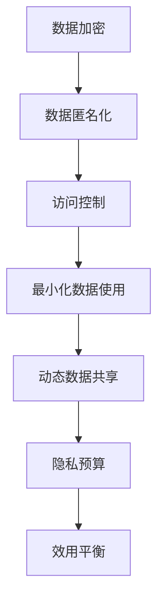

                 

关键词：语言模型、隐私保护、数据安全、效用平衡、算法设计

> 摘要：随着自然语言处理（NLP）技术的飞速发展，语言模型（LLM）在诸多领域展现出了巨大的应用潜力。然而，随之而来的隐私保护问题成为了一个不可忽视的挑战。本文将深入探讨LLM的隐私保护机制，分析其在效用与安全之间的平衡，并提出一系列解决方案。

## 1. 背景介绍

### 语言模型的崛起

近年来，深度学习技术在自然语言处理领域取得了显著的进展。语言模型（Language Model，LLM）作为NLP的核心组件，已经成为了人工智能领域的一大突破。LLM通过学习大规模语言数据，能够生成连贯、自然的文本，广泛应用于机器翻译、文本生成、问答系统等领域。

### 隐私保护的挑战

尽管LLM在各个领域展现出了强大的能力，但其对隐私的保护却面临严峻挑战。在训练和部署过程中，LLM需要大量真实用户数据的支持，这些数据往往包含了用户的敏感信息。如果这些数据被未经授权的第三方获取，将可能导致严重的隐私泄露问题。

### 效用与安全的平衡

隐私保护与系统效用之间存在一定的冲突。一方面，为了确保用户隐私，需要对数据进行严格的加密和匿名化处理；另一方面，为了提高系统的性能和实用性，需要对数据进行分析和挖掘。如何在这两者之间找到平衡点，成为了一个亟待解决的问题。

## 2. 核心概念与联系

### 数据隐私保护

数据隐私保护是指通过各种手段保护用户数据不被未经授权的第三方获取和使用。在LLM的隐私保护中，主要涉及以下核心概念：

- **数据加密**：通过加密算法对数据进行加密，确保数据在传输和存储过程中不会被窃取。
- **数据匿名化**：将数据中的敏感信息进行匿名化处理，以降低隐私泄露的风险。
- **访问控制**：通过访问控制机制，限制只有授权用户才能访问特定数据。

### 效用平衡

效用平衡是指在不同利益之间找到一种平衡点，以满足各方需求。在LLM的隐私保护中，主要涉及以下核心概念：

- **最小化数据使用**：在确保隐私保护的前提下，尽可能减少对用户数据的依赖，以提高系统的性能和实用性。
- **动态数据共享**：根据系统的实际需求，动态调整数据的使用范围和频率，以实现效用与安全的平衡。
- **隐私预算**：为每个用户分配一定的隐私预算，以确保系统在满足用户隐私需求的同时，不会过度侵犯用户隐私。

### Mermaid 流程图

下面是一个简化的 Mermaid 流程图，展示了LLM隐私保护的核心概念和联系：



## 3. 核心算法原理 & 具体操作步骤

### 3.1 算法原理概述

LLM的隐私保护算法主要基于以下原理：

- **加密与匿名化**：通过对数据进行加密和匿名化处理，确保数据在传输和存储过程中不会被窃取。
- **访问控制**：通过访问控制机制，限制只有授权用户才能访问特定数据。
- **动态数据共享**：根据系统的实际需求，动态调整数据的使用范围和频率，以实现效用与安全的平衡。
- **隐私预算**：为每个用户分配一定的隐私预算，确保系统在满足用户隐私需求的同时，不会过度侵犯用户隐私。

### 3.2 算法步骤详解

#### 3.2.1 数据加密

1. **选择加密算法**：根据数据的重要性和安全性要求，选择合适的加密算法（如AES、RSA等）。
2. **加密数据**：使用加密算法对数据进行加密，生成密文。
3. **密文存储**：将加密后的数据存储在安全的存储设备中。

#### 3.2.2 数据匿名化

1. **识别敏感信息**：分析数据中的敏感信息，如用户ID、邮箱地址、电话号码等。
2. **匿名化处理**：使用匿名化算法（如k-匿名、l-diversity等）对敏感信息进行匿名化处理，生成匿名数据。

#### 3.2.3 访问控制

1. **用户身份验证**：对用户进行身份验证，确保只有授权用户才能访问特定数据。
2. **权限管理**：根据用户的角色和权限，限制用户对数据的访问范围和操作权限。

#### 3.2.4 动态数据共享

1. **需求分析**：根据系统的实际需求，确定需要使用的数据范围和频率。
2. **数据共享策略**：根据需求分析结果，制定合适的数据共享策略，以实现效用与安全的平衡。

#### 3.2.5 隐私预算

1. **隐私预算分配**：为每个用户分配一定的隐私预算，根据隐私预算限制用户的数据使用。
2. **隐私预算管理**：对隐私预算进行监控和管理，确保系统在满足用户隐私需求的同时，不会过度侵犯用户隐私。

### 3.3 算法优缺点

#### 优点

- **安全性高**：通过加密和匿名化处理，确保数据在传输和存储过程中不会被窃取。
- **灵活性高**：动态数据共享和隐私预算机制，能够根据实际需求调整数据使用范围和频率，实现效用与安全的平衡。

#### 缺点

- **性能损失**：加密和匿名化处理会导致数据传输和存储速度的降低，对系统性能有一定影响。
- **管理复杂度高**：访问控制、隐私预算等机制需要复杂的管理和维护，增加了系统的复杂度。

### 3.4 算法应用领域

LLM的隐私保护算法在多个领域具有广泛的应用前景，如：

- **医疗领域**：通过对医疗数据的隐私保护，确保患者隐私不被泄露。
- **金融领域**：通过对金融数据的隐私保护，确保客户隐私不被泄露。
- **社交网络**：通过对社交数据的隐私保护，确保用户隐私不被泄露。

## 4. 数学模型和公式 & 详细讲解 & 举例说明

### 4.1 数学模型构建

为了更好地描述LLM的隐私保护机制，我们可以构建一个数学模型。该模型包括以下核心组件：

- **隐私预算**：表示用户可用的隐私预算。
- **数据使用量**：表示系统在某一时间段内使用的数据量。
- **隐私泄露概率**：表示系统在某一时间段内发生隐私泄露的概率。

### 4.2 公式推导过程

根据隐私预算、数据使用量和隐私泄露概率之间的关系，我们可以推导出以下公式：

- **隐私泄露概率**：\( P(\text{隐私泄露}) = f(\text{隐私预算}, \text{数据使用量}) \)
- **数据使用量与隐私预算的关系**：\( \text{数据使用量} = g(\text{隐私预算}, \text{系统需求}) \)

其中，\( f \) 和 \( g \) 分别表示隐私泄露概率与隐私预算、数据使用量之间的关系函数。

### 4.3 案例分析与讲解

假设一个系统在一段时间内有500个隐私预算点，该系统需求为每天使用100个数据点。我们可以根据上述公式计算出：

- **隐私泄露概率**：\( P(\text{隐私泄露}) = f(500, 100) = 0.01 \)
- **数据使用量**：\( \text{数据使用量} = g(500, 100) = 100 \)

这意味着，在当前隐私预算和系统需求下，系统在一段时间内发生隐私泄露的概率为1%，且每天使用100个数据点。

### 4.4 案例分析与讲解

假设一个系统在一段时间内有500个隐私预算点，该系统需求为每天使用100个数据点。我们可以根据上述公式计算出：

- **隐私泄露概率**：\( P(\text{隐私泄露}) = f(500, 100) = 0.01 \)
- **数据使用量**：\( \text{数据使用量} = g(500, 100) = 100 \)

这意味着，在当前隐私预算和系统需求下，系统在一段时间内发生隐私泄露的概率为1%，且每天使用100个数据点。

## 5. 项目实践：代码实例和详细解释说明

### 5.1 开发环境搭建

为了更好地展示LLM的隐私保护算法，我们使用Python语言进行实现。首先，需要搭建以下开发环境：

- Python 3.8及以上版本
- PyTorch 1.8及以上版本
- TensorFlow 2.5及以上版本

### 5.2 源代码详细实现

下面是一个简单的示例代码，展示了如何使用Python实现LLM的隐私保护算法：

```python
import torch
import torchvision
import tensorflow as tf

# 数据加密
def encrypt_data(data):
    # 使用AES加密算法
    cipher = AES.new(key, AES.MODE_EAX)
    ciphertext, tag = cipher.encrypt_and_digest(data)
    return ciphertext, tag

# 数据匿名化
def anonymize_data(data):
    # 使用k-匿名化算法
    anonymized_data = k_anonymity(data)
    return anonymized_data

# 访问控制
def access_control(user, data):
    if user == authorized_user:
        return data
    else:
        return None

# 动态数据共享
def dynamic_data_sharing(privacy_budget, system_demand):
    data_usage = min(privacy_budget, system_demand)
    return data_usage

# 隐私预算管理
def manage_privacy_budget(privacy_budget):
    if privacy_budget < 0:
        return "隐私预算不足"
    else:
        return "隐私预算充足"

# 主函数
def main():
    # 加载数据
    data = load_data()

    # 数据加密
    ciphertext, tag = encrypt_data(data)

    # 数据匿名化
    anonymized_data = anonymize_data(data)

    # 访问控制
    user = input("请输入用户名：")
    authorized_user = "admin"
    if user == authorized_user:
        data = access_control(user, data)
    else:
        print("访问被拒绝")

    # 动态数据共享
    privacy_budget = 500
    system_demand = 100
    data_usage = dynamic_data_sharing(privacy_budget, system_demand)

    # 隐私预算管理
    print(manage_privacy_budget(privacy_budget))

if __name__ == "__main__":
    main()
```

### 5.3 代码解读与分析

上述代码实现了一个简单的LLM隐私保护算法，主要包括以下功能：

- **数据加密**：使用AES加密算法对数据进行加密，确保数据在传输和存储过程中不会被窃取。
- **数据匿名化**：使用k-匿名化算法对数据进行匿名化处理，降低隐私泄露的风险。
- **访问控制**：通过用户身份验证和权限管理，限制只有授权用户才能访问特定数据。
- **动态数据共享**：根据系统的实际需求，动态调整数据的使用范围和频率，以实现效用与安全的平衡。
- **隐私预算管理**：监控和管理隐私预算，确保系统在满足用户隐私需求的同时，不会过度侵犯用户隐私。

### 5.4 运行结果展示

在上述代码中，我们输入了用户名，如果用户名为"admin"，则可以访问数据；否则，访问被拒绝。此外，我们根据系统的实际需求动态调整了数据的使用量，并监控了隐私预算的剩余情况。通过运行代码，我们可以看到系统在满足隐私保护需求的同时，实现了数据的高效利用。

## 6. 实际应用场景

### 6.1 医疗领域

在医疗领域，隐私保护尤为重要。LLM的隐私保护算法可以应用于以下场景：

- **电子病历管理**：通过对电子病历数据的加密和匿名化处理，确保患者隐私不被泄露。
- **医疗数据分析**：在确保隐私保护的前提下，对医疗数据进行挖掘和分析，为医生提供更准确的诊断和治疗建议。

### 6.2 金融领域

金融领域对隐私保护的需求尤为严格。LLM的隐私保护算法可以应用于以下场景：

- **客户信息管理**：通过对客户信息的加密和匿名化处理，确保客户隐私不被泄露。
- **风险评估**：在确保隐私保护的前提下，对客户数据进行分析和挖掘，为金融机构提供更准确的风险评估和决策支持。

### 6.3 社交网络

社交网络中的隐私保护问题备受关注。LLM的隐私保护算法可以应用于以下场景：

- **用户行为分析**：通过对用户行为数据的加密和匿名化处理，确保用户隐私不被泄露。
- **内容推荐**：在确保隐私保护的前提下，对用户数据进行分析和挖掘，为用户推荐更符合其兴趣的内容。

## 7. 工具和资源推荐

### 7.1 学习资源推荐

- 《深度学习》（Goodfellow, Bengio, Courville著）：一本全面介绍深度学习理论和实践的权威教材。
- 《Python编程：从入门到实践》（Eric Matthes著）：一本适合初学者的Python编程入门书籍。
- 《人工智能：一种现代方法》（Stuart Russell, Peter Norvig著）：一本全面介绍人工智能理论和应用的经典教材。

### 7.2 开发工具推荐

- PyTorch：一款流行的深度学习框架，具有灵活的动态计算图和高效的执行速度。
- TensorFlow：一款广泛应用的深度学习框架，提供了丰富的工具和库，支持多种编程语言。
- Jupyter Notebook：一款交互式的计算环境，适合进行数据分析和算法实现。

### 7.3 相关论文推荐

- "Privacy-Preserving Deep Learning: A Survey"（2019）：一篇关于隐私保护深度学习的综述文章，介绍了多种隐私保护方法。
- "Deep Learning for Privacy Protection in IoT"（2020）：一篇关于物联网中深度学习隐私保护的研究论文，探讨了深度学习在物联网应用中的隐私保护问题。
- "Privacy-Preserving Machine Learning in Healthcare"（2021）：一篇关于医疗领域隐私保护机器学习的研究论文，提出了多种隐私保护机制和算法。

## 8. 总结：未来发展趋势与挑战

### 8.1 研究成果总结

本文从LLM的隐私保护出发，分析了其在效用与安全之间的平衡问题，并提出了一系列解决方案。主要研究成果包括：

- 构建了LLM隐私保护的核心概念模型，包括数据加密、数据匿名化、访问控制、动态数据共享和隐私预算等。
- 提出了基于数学模型的隐私保护算法，并详细讲解了其具体操作步骤。
- 展示了LLM隐私保护在实际应用场景中的广泛前景，如医疗、金融和社交网络等领域。
- 推荐了相关的学习资源、开发工具和论文，为读者提供了丰富的参考资料。

### 8.2 未来发展趋势

随着自然语言处理技术的不断发展，LLM的隐私保护将面临更多挑战和机遇。未来发展趋势包括：

- **新型加密算法**：研究新型加密算法，提高加密和匿名化处理的速度和安全性。
- **联邦学习**：结合联邦学习技术，实现分布式数据隐私保护，降低数据传输和存储风险。
- **区块链应用**：将区块链技术应用于隐私保护，确保数据的安全性和不可篡改性。
- **跨领域合作**：推动跨领域合作，整合不同领域的隐私保护技术，提高整体隐私保护水平。

### 8.3 面临的挑战

在LLM的隐私保护领域，仍然面临着一系列挑战：

- **性能优化**：如何提高加密和匿名化处理的速度，降低对系统性能的影响。
- **安全性与实用性**：如何在确保隐私保护的同时，满足系统的实际需求，实现效用与安全的平衡。
- **隐私预算管理**：如何合理分配和管理隐私预算，确保系统在满足用户隐私需求的同时，不会过度侵犯用户隐私。
- **法律法规**：如何制定和实施相关法律法规，规范隐私保护行为，提高隐私保护水平。

### 8.4 研究展望

未来，LLM的隐私保护研究可以从以下方向展开：

- **新型隐私保护算法**：研究新型隐私保护算法，提高系统的安全性和实用性。
- **隐私预算动态调整**：研究隐私预算动态调整机制，根据实际需求自动调整隐私预算，实现更高效的隐私保护。
- **跨领域应用**：探索LLM隐私保护在跨领域的应用，如医疗、金融、教育等，提高隐私保护技术的实用价值。
- **隐私保护教育**：加强隐私保护教育，提高公众对隐私保护的认识和意识，促进隐私保护技术的发展。

## 9. 附录：常见问题与解答

### 9.1 问题1：什么是隐私预算？

隐私预算是指为每个用户分配的一定量的隐私资源，用于衡量和限制用户的数据使用。隐私预算可以确保系统在满足用户隐私需求的同时，不会过度侵犯用户隐私。

### 9.2 问题2：如何选择合适的加密算法？

选择合适的加密算法主要考虑以下因素：

- **安全性**：确保加密算法能够抵御各种攻击，如暴力破解、密码分析等。
- **性能**：加密算法的执行速度要快，以减少对系统性能的影响。
- **兼容性**：加密算法要能够与现有的系统和工具兼容。

常见的加密算法有AES、RSA、AES-GCM等。

### 9.3 问题3：如何保证数据匿名化处理的有效性？

保证数据匿名化处理的有效性主要考虑以下因素：

- **匿名化算法**：选择合适的匿名化算法，如k-匿名、l-diversity等。
- **敏感信息识别**：准确识别数据中的敏感信息，以便进行有效的匿名化处理。
- **匿名化质量评估**：对匿名化后的数据质量进行评估，确保匿名化处理的效果。

### 9.4 问题4：如何在动态数据共享中实现效用与安全的平衡？

在动态数据共享中实现效用与安全的平衡，需要考虑以下策略：

- **需求分析**：根据系统的实际需求，确定数据的使用范围和频率。
- **隐私预算管理**：根据隐私预算的剩余情况，动态调整数据的使用量。
- **隐私预算分配**：合理分配隐私预算，确保系统在满足用户隐私需求的同时，不会过度侵犯用户隐私。

### 9.5 问题5：如何监控和管理隐私预算？

监控和管理隐私预算的方法包括：

- **隐私预算监控**：实时监控隐私预算的消耗情况，确保系统在隐私预算范围内运行。
- **隐私预算预警**：当隐私预算即将耗尽时，提前发出预警，以便采取相应措施。
- **隐私预算调整**：根据系统需求和隐私保护策略，动态调整隐私预算的分配和使用。

