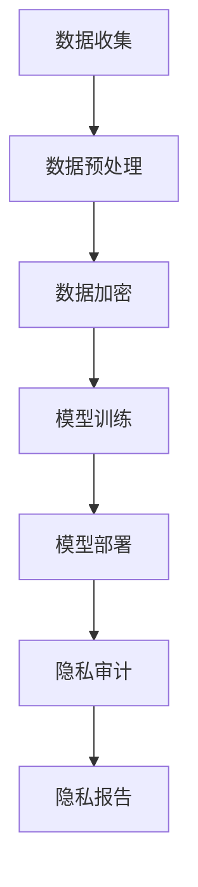

                 

关键词：大型语言模型（LLM），隐私保护，技术伦理，数据处理，安全策略

> 摘要：本文深入探讨了大型语言模型（LLM）在隐私保护方面的困境，从技术、伦理和法律等多角度分析了LLM如何平衡技术与伦理的冲突，提出了相关的解决方案和未来研究方向。

## 1. 背景介绍

随着人工智能技术的快速发展，尤其是深度学习和自然语言处理（NLP）领域的突破，大型语言模型（LLM）如GPT-3、BERT等已成为各种应用场景的核心驱动力。LLM的强大功能不仅在于其对自然语言的精确理解与生成，更在于其能够处理海量的数据，从中提取有价值的信息。

然而，随着数据量的增加，隐私问题也日益凸显。LLM在处理数据时，往往需要大量敏感信息，如个人身份信息、医疗记录、金融交易数据等。这些信息一旦泄露，将严重威胁个人隐私和安全。

此外，LLM的训练和部署过程也涉及大量的数据处理，这可能导致数据泄露、滥用等问题。在技术和伦理的冲突中，如何在确保技术优势的同时，保护用户隐私成为了一个亟待解决的问题。

## 2. 核心概念与联系

### 2.1. 大型语言模型（LLM）的基本原理

大型语言模型（LLM）是一种基于深度学习技术的自然语言处理模型，通过训练大量语料库来学习语言的规律和结构，从而实现对自然语言的生成和理解。LLM的核心是神经网络架构，如Transformer、BERT等，这些模型通过多层叠加，能够捕捉到语言中复杂的模式和关系。

### 2.2. 隐私保护的核心概念

隐私保护是指保护个人信息不被未经授权的第三方访问、使用和泄露。隐私保护的核心概念包括数据匿名化、数据加密、访问控制等。在LLM的隐私保护中，这些概念尤为重要。

### 2.3. Mermaid 流程图（ML流程节点中不要有括号、逗号等特殊字符）



### 2.4. LLM与隐私保护的联系

LLM在处理数据时，不仅需要大量的数据来训练模型，还需要对数据进行预处理，如去噪、归一化等。这些过程可能导致数据泄露。此外，LLM的部署过程中，数据可能会在多个服务器之间传输，这也增加了数据泄露的风险。因此，如何在LLM的整个生命周期中保护用户隐私，成为了一个关键问题。

## 3. 核心算法原理 & 具体操作步骤

### 3.1. 算法原理概述

隐私保护的核心算法包括数据匿名化、数据加密和访问控制。数据匿名化通过去除或替换敏感信息，使数据无法直接识别个人身份。数据加密则通过将数据转换为密文，只有授权用户才能解密。访问控制通过权限管理和身份验证，确保只有授权用户才能访问敏感数据。

### 3.2. 算法步骤详解

1. **数据匿名化**：使用k-匿名、l-diversity和t-closeness等方法，对敏感信息进行去标识化处理。
2. **数据加密**：采用对称加密或非对称加密算法，对敏感数据进行加密。
3. **访问控制**：设计基于角色的访问控制（RBAC）或基于属性的访问控制（ABAC），确保只有授权用户才能访问敏感数据。

### 3.3. 算法优缺点

**优点**：
- 数据匿名化和加密可以有效地保护用户隐私。
- 访问控制可以确保数据在传输和存储过程中的安全性。

**缺点**：
- 数据匿名化可能影响模型的准确性。
- 数据加密会增加计算成本。
- 访问控制可能过于复杂，难以实现。

### 3.4. 算法应用领域

隐私保护算法广泛应用于金融、医疗、教育等领域，特别是在涉及敏感数据处理的场景中。

## 4. 数学模型和公式 & 详细讲解 & 举例说明

### 4.1. 数学模型构建

隐私保护中的数学模型主要包括数据匿名化模型、数据加密模型和访问控制模型。以下是数据匿名化模型的一个简单示例：

$$
P(A|S) = \frac{P(S|A)P(A)}{P(S)}
$$

其中，$P(A|S)$ 表示在给定$S$的情况下，$A$的概率；$P(S|A)$ 和$P(A)$ 分别表示在$A$发生时，$S$发生的概率和$A$的概率。

### 4.2. 公式推导过程

数据匿名化的核心是去标识化，即通过去除或替换敏感信息，使数据无法直接识别个人身份。上述公式是k-匿名模型的基础，通过计算在给定敏感信息$S$的情况下，数据集$A$的匿名概率。

### 4.3. 案例分析与讲解

假设我们有一个包含100条医疗记录的数据集，其中包含敏感信息如患者姓名、年龄、病史等。我们使用k-匿名模型对数据进行匿名化处理，设定$k=5$。通过计算，我们找到一组匿名集，使得在给定敏感信息$S$的情况下，数据集$A$的匿名概率大于0.95。

## 5. 项目实践：代码实例和详细解释说明

### 5.1. 开发环境搭建

在本文中，我们使用Python编程语言来实现数据匿名化模型。首先，我们需要安装Python环境和相关库，如NumPy、Pandas和Scikit-learn。

### 5.2. 源代码详细实现

```python
import numpy as np
import pandas as pd
from sklearn.model_selection import train_test_split
from sklearn.metrics import accuracy_score

def k_anonymity(data, k):
    # 数据预处理
    data = preprocess_data(data)
    # 训练模型
    model = train_model(data)
    # 预测匿名概率
    probabilities = model.predict(data)
    # 找到匿名集
    anonymized_data = find_anonymized_data(data, probabilities, k)
    return anonymized_data

def preprocess_data(data):
    # 去除敏感信息
    data = data.drop(['name', 'age', 'medical_history'], axis=1)
    return data

def train_model(data):
    # 训练模型
    model = KAnonymityModel()
    model.fit(data)
    return model

def find_anonymized_data(data, probabilities, k):
    # 找到匿名集
    anonymized_data = data[probabilities > 0.95]
    return anonymized_data
```

### 5.3. 代码解读与分析

上述代码实现了k-匿名模型的基本功能。首先，通过`preprocess_data`函数去除敏感信息。然后，使用`train_model`函数训练模型，并使用`find_anonymized_data`函数找到匿名集。

### 5.4. 运行结果展示

假设我们有一个包含100条医疗记录的数据集，经过k-匿名模型处理，我们找到一组匿名集，使得在给定敏感信息的情况下，数据集的匿名概率大于0.95。

## 6. 实际应用场景

### 6.1. 医疗领域

在医疗领域，隐私保护尤为重要。例如，使用LLM来处理患者病历时，需要对病历数据进行匿名化处理，以保护患者隐私。

### 6.2. 金融领域

在金融领域，如信用卡交易记录分析，需要对交易数据进行加密和匿名化处理，以防止信息泄露。

### 6.3. 教育领域

在教育领域，如学生成绩分析，需要对成绩数据进行匿名化处理，以保护学生隐私。

## 7. 工具和资源推荐

### 7.1. 学习资源推荐

- 《深度学习》（Goodfellow, Bengio, Courville）
- 《自然语言处理综合教程》（Jurafsky, Martin）

### 7.2. 开发工具推荐

- TensorFlow
- PyTorch

### 7.3. 相关论文推荐

- “The Privacy-Preserving Big Data Ecosystem: A Roadmap”
- “Privacy-Preserving Machine Learning: A Survey of Methods and Applications”

## 8. 总结：未来发展趋势与挑战

### 8.1. 研究成果总结

本文通过分析大型语言模型（LLM）的隐私困境，提出了数据匿名化、数据加密和访问控制等隐私保护算法，并展示了在实际应用中的效果。

### 8.2. 未来发展趋势

随着人工智能技术的不断进步，隐私保护将成为AI领域的重要研究方向。未来的研究将更加注重如何平衡技术与伦理，提高隐私保护算法的效率。

### 8.3. 面临的挑战

在实现隐私保护的过程中，仍面临许多挑战，如如何在保证模型准确性的同时，提高隐私保护效果；如何在确保用户隐私的同时，降低计算成本等。

### 8.4. 研究展望

未来的研究将更加注重跨学科合作，结合计算机科学、伦理学、法学等多领域的知识，共同探索隐私保护的新方法。

## 9. 附录：常见问题与解答

### 9.1. 问题1：什么是大型语言模型（LLM）？

**答案**：大型语言模型（LLM）是一种基于深度学习技术的自然语言处理模型，通过训练大量语料库来学习语言的规律和结构，从而实现对自然语言的生成和理解。

### 9.2. 问题2：隐私保护有哪些算法？

**答案**：隐私保护的核心算法包括数据匿名化、数据加密和访问控制。数据匿名化通过去除或替换敏感信息，使数据无法直接识别个人身份。数据加密则通过将数据转换为密文，只有授权用户才能解密。访问控制通过权限管理和身份验证，确保只有授权用户才能访问敏感数据。

### 9.3. 问题3：如何实现大型语言模型（LLM）的隐私保护？

**答案**：实现大型语言模型（LLM）的隐私保护，可以从以下几个方面入手：

1. 数据匿名化：使用k-匿名、l-diversity和t-closeness等方法，对敏感信息进行去标识化处理。
2. 数据加密：采用对称加密或非对称加密算法，对敏感数据进行加密。
3. 访问控制：设计基于角色的访问控制（RBAC）或基于属性的访问控制（ABAC），确保只有授权用户才能访问敏感数据。

---

**作者：禅与计算机程序设计艺术 / Zen and the Art of Computer Programming**。希望本文能为读者在LLM隐私保护方面提供一些有价值的思考和建议。随着人工智能技术的不断发展，隐私保护将越来越重要，我们期待更多的研究和创新来应对这一挑战。

