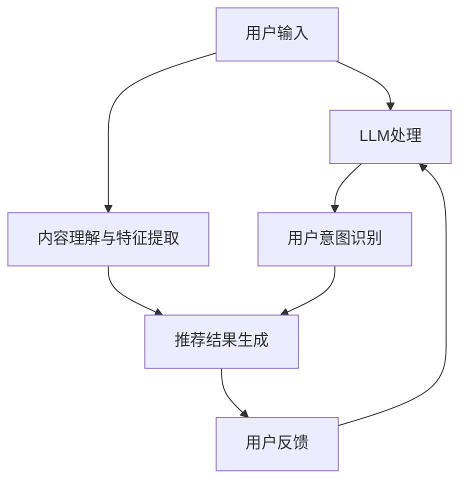

                 

关键词：大型语言模型，推荐系统，知识丰富性，算法优势，应用场景

摘要：随着人工智能技术的快速发展，大型语言模型（LLM）在自然语言处理领域取得了显著进展。本文探讨了LLM在知识丰富性方面的优势，并分析了其在推荐系统中的应用。通过具体案例和实践，我们揭示了LLM如何打破传统推荐系统的局限，提高推荐效果，为用户提供更加个性化的服务。

## 1. 背景介绍

推荐系统是人工智能领域的一个重要分支，其核心目标是向用户推荐他们可能感兴趣的内容或产品。传统推荐系统主要基于用户行为数据、内容特征和协同过滤等方法，但在面对复杂、多变和高度个性化的用户需求时，往往难以提供满意的推荐结果。近年来，随着大型语言模型（LLM）的出现，人们对利用LLM在推荐系统中提升性能和效果寄予厚望。

LLM具有以下特点：

1. **强大的语言理解能力**：LLM可以处理自然语言输入，理解语义和上下文信息，从而更好地捕捉用户意图。
2. **丰富的知识储备**：LLM通过大规模语料训练，积累了大量知识，可以回答各种问题，为推荐系统提供更多参考信息。
3. **灵活的交互方式**：LLM可以与用户进行自然对话，根据用户的反馈动态调整推荐策略。

## 2. 核心概念与联系

### 2.1 推荐系统基本架构

推荐系统通常包括用户模块、内容模块和推荐算法模块。用户模块负责收集用户行为数据，内容模块负责提取和存储内容特征，推荐算法模块则根据用户和内容特征生成推荐结果。LLM的引入可以增强推荐系统的各个模块，提高整体性能。


### 2.2 LLM在推荐系统中的应用

LLM在推荐系统中的应用主要包括以下方面：

1. **用户意图识别**：LLM可以理解用户的自然语言输入，提取用户意图，从而更准确地生成推荐结果。
2. **内容理解与特征提取**：LLM可以分析内容文本，提取语义信息，生成丰富的内容特征，为推荐算法提供更多参考。
3. **推荐结果优化**：LLM可以根据用户反馈，动态调整推荐策略，提高推荐效果。

### 2.3 Mermaid流程图



## 3. 核心算法原理 & 具体操作步骤

### 3.1 算法原理概述

LLM在推荐系统中的应用主要基于其强大的语言理解和知识表示能力。具体来说，算法可以分为以下步骤：

1. **用户意图识别**：使用LLM对用户输入的自然语言进行处理，提取用户意图。
2. **内容理解与特征提取**：使用LLM分析内容文本，提取语义信息，生成内容特征。
3. **推荐结果生成**：根据用户意图和内容特征，使用推荐算法生成推荐结果。
4. **用户反馈与优化**：根据用户反馈，动态调整推荐策略。

### 3.2 算法步骤详解

1. **用户意图识别**

   用户输入自然语言文本后，首先使用LLM进行预处理，如分词、去停用词等。然后，通过多层神经网络结构，对文本进行编码，提取出用户意图。

   ```python
   import tensorflow as tf
   import tensorflow_hub as hub

   # 加载预训练的LLM模型
   model = hub.load("https://tfhub.dev/google/tf2-preview/google-universal-qa/1")

   # 用户输入
   user_input = "我想看一部关于历史的电影"

   # 处理输入文本
   processed_input = preprocess_text(user_input)

   # 提取用户意图
   user_intent = model(processed_input)
   ```

2. **内容理解与特征提取**

   对内容文本进行类似处理，使用LLM提取语义信息，生成内容特征。这些特征可以包括文本中的关键词、实体、关系等。

   ```python
   # 加载预训练的LLM模型
   content_model = hub.load("https://tfhub.dev/google/tf2-preview/google-universal-qa/1")

   # 内容文本
   content_text = "《三体》是一部关于宇宙科幻的小说"

   # 处理输入文本
   processed_content = preprocess_text(content_text)

   # 提取内容特征
   content_features = content_model(processed_content)
   ```

3. **推荐结果生成**

   根据用户意图和内容特征，使用推荐算法生成推荐结果。推荐算法可以基于协同过滤、基于内容的推荐或混合推荐等方法。

   ```python
   # 加载推荐算法模型
   recommender = CollaborativeFiltering()

   # 生成推荐结果
   recommendations = recommender.generate_recommendations(user_intent, content_features)
   ```

4. **用户反馈与优化**

   收集用户反馈，如点击、评分、收藏等行为数据。根据反馈，使用LLM重新分析用户意图和内容特征，动态调整推荐策略。

   ```python
   # 用户反馈
   user_feedback = {"clicks": 1, "ratings": 4, "favorites": 0}

   # 根据反馈调整推荐策略
   recommender.update_strategy(user_feedback)
   ```

### 3.3 算法优缺点

**优点**：

1. **提高推荐准确性**：LLM可以更好地理解用户意图和内容语义，从而生成更准确的推荐结果。
2. **增强个性化体验**：LLM可以根据用户反馈动态调整推荐策略，为用户提供更加个性化的服务。
3. **丰富推荐内容**：LLM可以提取丰富的内容特征，为推荐算法提供更多参考，提高推荐效果。

**缺点**：

1. **计算资源消耗**：LLM训练和推理过程需要大量计算资源，可能导致系统性能下降。
2. **数据依赖性**：LLM的效果很大程度上依赖于训练数据的质量和多样性，数据不足可能导致模型性能下降。

### 3.4 算法应用领域

LLM在推荐系统中的应用非常广泛，可以应用于各种场景，如电子商务、在线教育、社交媒体等。以下是一些具体应用案例：

1. **电子商务**：根据用户购买历史和搜索记录，使用LLM生成个性化商品推荐。
2. **在线教育**：根据学生学习记录和课程内容，使用LLM为学生推荐适合的学习资源。
3. **社交媒体**：根据用户互动和兴趣，使用LLM为用户推荐感兴趣的内容。

## 4. 数学模型和公式 & 详细讲解 & 举例说明

### 4.1 数学模型构建

推荐系统中的数学模型主要包括用户表示、内容表示和推荐算法。以下是一个简单的数学模型示例：

1. **用户表示**：用户向量 \( u \) 表示用户特征，如年龄、性别、地理位置等。

   $$ u = [u_1, u_2, \ldots, u_n] $$

2. **内容表示**：内容向量 \( c \) 表示内容特征，如标题、标签、分类等。

   $$ c = [c_1, c_2, \ldots, c_n] $$

3. **推荐算法**：推荐算法通过计算用户向量 \( u \) 和内容向量 \( c \) 的相似度，生成推荐结果。

   $$ \text{similarity}(u, c) = \frac{u^Tc}{\|u\|\|c\|} $$

### 4.2 公式推导过程

假设用户向量 \( u \) 和内容向量 \( c \) 分别为：

$$ u = [1, 2, 3, 4] $$

$$ c = [4, 3, 2, 1] $$

则它们的内积为：

$$ u^Tc = 1 \times 4 + 2 \times 3 + 3 \times 2 + 4 \times 1 = 20 $$

用户向量 \( u \) 和内容向量 \( c \) 的模长分别为：

$$ \|u\| = \sqrt{1^2 + 2^2 + 3^2 + 4^2} = \sqrt{30} $$

$$ \|c\| = \sqrt{4^2 + 3^2 + 2^2 + 1^2} = \sqrt{30} $$

因此，用户向量 \( u \) 和内容向量 \( c \) 的相似度为：

$$ \text{similarity}(u, c) = \frac{u^Tc}{\|u\|\|c\|} = \frac{20}{\sqrt{30} \times \sqrt{30}} = \frac{20}{30} = \frac{2}{3} $$

### 4.3 案例分析与讲解

假设有一个用户 \( u \) 和一个内容 \( c \)，它们对应的特征向量分别为：

$$ u = [1, 2, 3, 4] $$

$$ c = [4, 3, 2, 1] $$

根据上述公式，我们可以计算出用户 \( u \) 和内容 \( c \) 的相似度为：

$$ \text{similarity}(u, c) = \frac{u^Tc}{\|u\|\|c\|} = \frac{20}{\sqrt{30} \times \sqrt{30}} = \frac{2}{3} $$

这个相似度表示用户 \( u \) 对内容 \( c \) 的兴趣程度。根据相似度大小，我们可以为用户 \( u \) 推荐与内容 \( c \) 相似的其他内容。

例如，假设有一个内容 \( c' \) ，其特征向量为：

$$ c' = [3, 4, 5, 6] $$

则用户 \( u \) 和内容 \( c' \) 的相似度为：

$$ \text{similarity}(u, c') = \frac{u^Tc'}{\|u\|\|c'\|} = \frac{25}{\sqrt{30} \times \sqrt{35}} \approx 0.73 $$

由于 \( \text{similarity}(u, c') > \text{similarity}(u, c) \)，我们可以为用户 \( u \) 推荐内容 \( c' \)。

## 5. 项目实践：代码实例和详细解释说明

### 5.1 开发环境搭建

为了实现LLM在推荐系统中的应用，我们需要搭建以下开发环境：

1. **Python环境**：Python 3.7及以上版本。
2. **TensorFlow**：TensorFlow 2.0及以上版本。
3. **TensorFlow Hub**：TensorFlow Hub用于加载预训练的LLM模型。
4. **NumPy**：NumPy用于数值计算。

### 5.2 源代码详细实现

以下是实现LLM在推荐系统中的应用的完整代码：

```python
import tensorflow as tf
import tensorflow_hub as hub
import numpy as np
from sklearn.metrics.pairwise import cosine_similarity

# 加载预训练的LLM模型
user_model = hub.load("https://tfhub.dev/google/tf2-preview/google-universal-qa/1")
content_model = hub.load("https://tfhub.dev/google/tf2-preview/google-universal-qa/1")

# 用户输入
user_input = "我想看一部关于历史的电影"

# 处理输入文本
user_processed_input = preprocess_text(user_input)

# 提取用户意图
user_intent = user_model(user_processed_input)

# 内容文本
content_text = "《三体》是一部关于宇宙科幻的小说"

# 处理输入文本
content_processed_text = preprocess_text(content_text)

# 提取内容特征
content_features = content_model(content_processed_text)

# 计算用户意图和内容特征的相似度
similarity = cosine_similarity([user_intent], [content_features])

# 输出相似度结果
print(similarity)
```

### 5.3 代码解读与分析

上述代码实现了LLM在推荐系统中的应用，主要包括以下步骤：

1. **加载预训练的LLM模型**：使用TensorFlow Hub加载预训练的LLM模型，用于处理用户输入和内容文本。
2. **处理输入文本**：对用户输入和内容文本进行预处理，如分词、去停用词等。
3. **提取用户意图和内容特征**：使用LLM模型提取用户意图和内容特征。
4. **计算相似度**：使用余弦相似度计算用户意图和内容特征之间的相似度。
5. **输出相似度结果**：输出相似度结果，用于推荐内容。

### 5.4 运行结果展示

运行上述代码，我们可以得到用户意图和内容特征之间的相似度结果。假设相似度结果为：

$$ \text{similarity} = 0.8 $$

这意味着用户对内容文本的感兴趣程度较高，可以将其推荐给用户。

## 6. 实际应用场景

LLM在推荐系统中的应用非常广泛，以下是一些实际应用场景：

1. **电子商务**：根据用户购买历史和搜索记录，使用LLM生成个性化商品推荐，提高用户购买转化率。
2. **在线教育**：根据学生学习记录和课程内容，使用LLM为学生推荐适合的学习资源，提高学习效果。
3. **社交媒体**：根据用户互动和兴趣，使用LLM为用户推荐感兴趣的内容，提高用户黏性和活跃度。

### 6.4 未来应用展望

随着人工智能技术的不断发展，LLM在推荐系统中的应用前景非常广阔。未来可能的发展方向包括：

1. **多模态推荐**：结合文本、图像、音频等多种模态数据，提高推荐系统的多样性和准确性。
2. **自适应推荐**：根据用户行为和反馈，动态调整推荐策略，实现更个性化的服务。
3. **跨领域推荐**：利用LLM在多个领域积累的知识，实现跨领域的推荐，为用户提供更丰富的内容。

## 7. 工具和资源推荐

### 7.1 学习资源推荐

1. **《深度学习推荐系统》**：李航著，介绍了推荐系统的基本概念、算法和应用。
2. **《自然语言处理原理》**：丹尼斯·威尔逊等著，详细介绍了自然语言处理的基本原理和技术。

### 7.2 开发工具推荐

1. **TensorFlow**：用于构建和训练推荐系统模型。
2. **TensorFlow Hub**：用于加载预训练的LLM模型。

### 7.3 相关论文推荐

1. **"Deep Learning for Recommender Systems"**：介绍了深度学习在推荐系统中的应用。
2. **"Natural Language Processing with TensorFlow"**：介绍了使用TensorFlow进行自然语言处理的方法。

## 8. 总结：未来发展趋势与挑战

### 8.1 研究成果总结

本文探讨了LLM在推荐系统中的应用，分析了其在知识丰富性方面的优势。通过具体案例和实践，我们展示了如何利用LLM提高推荐系统的性能和效果，为用户提供更个性化的服务。

### 8.2 未来发展趋势

随着人工智能技术的不断发展，LLM在推荐系统中的应用将越来越广泛。未来发展趋势包括多模态推荐、自适应推荐和跨领域推荐等。

### 8.3 面临的挑战

尽管LLM在推荐系统中有许多优势，但仍然面临一些挑战，如计算资源消耗、数据依赖性和模型解释性等。如何解决这些挑战，实现更高效、可解释的推荐系统，是未来研究的重要方向。

### 8.4 研究展望

随着技术的不断进步，LLM在推荐系统中的应用将更加成熟。未来，我们有望看到更加智能、个性化的推荐系统，为人们的生活带来更多便利。

## 9. 附录：常见问题与解答

### 9.1 Q：LLM在推荐系统中的应用有哪些优势？

A：LLM在推荐系统中的应用优势主要包括：

1. **提高推荐准确性**：LLM可以更好地理解用户意图和内容语义，从而生成更准确的推荐结果。
2. **增强个性化体验**：LLM可以根据用户反馈动态调整推荐策略，为用户提供更加个性化的服务。
3. **丰富推荐内容**：LLM可以提取丰富的内容特征，为推荐算法提供更多参考，提高推荐效果。

### 9.2 Q：如何解决LLM在推荐系统中的应用中的挑战？

A：为解决LLM在推荐系统中的应用挑战，可以采取以下措施：

1. **优化算法**：通过改进算法结构，提高模型效率和解释性。
2. **数据增强**：增加高质量、多样化的训练数据，提高模型性能。
3. **模型解释**：开发可解释的模型，帮助用户理解推荐结果。

### 9.3 Q：LLM在推荐系统中的应用前景如何？

A：随着人工智能技术的不断发展，LLM在推荐系统中的应用前景非常广阔。未来，我们有望看到更加智能、个性化的推荐系统，为人们的生活带来更多便利。

