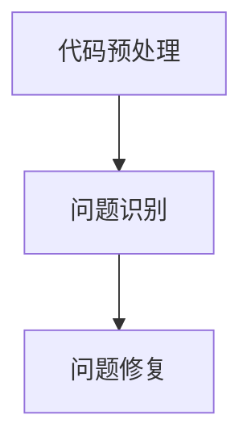

                 

关键词：LLM、智能调试、代码分析、自动化、程序优化

> 摘要：本文探讨了大型语言模型（LLM）在程序调试领域的应用潜力。通过分析LLM的原理和特性，我们提出了一种基于LLM的智能调试技术，旨在提高程序调试的效率和准确性。本文将详细介绍该技术的核心概念、算法原理、数学模型以及实际应用场景，并展望其未来发展。

## 1. 背景介绍

### 1.1 程序调试的重要性

程序调试是软件开发过程中不可或缺的一环。高效且准确的调试技术能够显著减少软件故障率，提高软件质量，缩短开发周期。传统的调试方法通常依赖于开发人员的经验和技能，容易出现漏测、误判等问题，效率较低。随着软件系统的复杂性日益增加，传统的调试方法已经难以满足现代软件开发的需求。

### 1.2 LLM的兴起

近年来，大型语言模型（LLM）在自然语言处理领域取得了显著进展。LLM具有强大的文本生成、理解和推理能力，能够处理复杂的语言现象。LLM的成功应用包括问答系统、机器翻译、文本摘要等，引起了广泛关注。随着LLM技术的发展，人们开始思考将其应用于程序调试领域，以提高调试效率和准确性。

## 2. 核心概念与联系

### 2.1 LLM原理简介

大型语言模型（LLM）是基于深度学习技术构建的神经网络模型。通过大规模语料库的训练，LLM能够捕捉语言的统计规律和语义信息，实现高效的语言理解和生成。常见的LLM模型包括GPT、BERT、T5等。

### 2.2 智能调试技术原理

智能调试技术利用LLM的强大能力，对代码进行自动分析，识别潜在的问题并进行修复。具体包括以下步骤：

1. **代码预处理**：对代码进行语法分析，提取关键信息。
2. **问题识别**：利用LLM的文本生成和推理能力，识别代码中的潜在问题。
3. **问题修复**：根据识别到的问题，自动生成修复方案。

### 2.3 Mermaid流程图



## 3. 核心算法原理 & 具体操作步骤

### 3.1 算法原理概述

智能调试技术的核心在于利用LLM对代码进行自动分析，识别潜在的问题并进行修复。具体算法原理如下：

1. **代码预处理**：对代码进行语法分析，提取关键信息。
2. **问题识别**：利用LLM的文本生成和推理能力，识别代码中的潜在问题。
3. **问题修复**：根据识别到的问题，自动生成修复方案。

### 3.2 算法步骤详解

1. **代码预处理**：对代码进行语法分析，提取关键信息。

```python
def preprocess_code(code):
    # 使用语法分析器提取代码中的变量、函数、语句等信息
    # 例如，使用Python的ast模块
    ast = ast.parse(code)
    return ast
```

2. **问题识别**：利用LLM的文本生成和推理能力，识别代码中的潜在问题。

```python
import transformers

def identify_issues(code):
    # 加载预训练的LLM模型
    model = transformers.pipeline('text-generation', model='gpt2')
    
    # 生成问题候选列表
    issues = model.generate(code, max_length=50, num_return_sequences=5)
    
    # 对生成的文本进行过滤和筛选，得到最终的问题列表
    return filter_issues(issues)
```

3. **问题修复**：根据识别到的问题，自动生成修复方案。

```python
def fix_issues(code, issues):
    # 根据每个问题生成相应的修复代码
    for issue in issues:
        fix = generate_fix(issue)
        code = code.replace(issue, fix)
    return code
```

### 3.3 算法优缺点

**优点**：

- 高效：利用LLM的强大能力，能够快速识别代码中的潜在问题。
- 准确：基于大规模训练数据的支持，LLM能够准确识别代码中的问题。
- 自动化：自动生成修复方案，减少开发人员的工作量。

**缺点**：

- 资源消耗：训练和运行LLM模型需要大量计算资源和时间。
- 依赖模型：算法的性能和准确性取决于所使用的LLM模型的性能。

### 3.4 算法应用领域

智能调试技术可以广泛应用于以下领域：

- 软件开发：提高程序调试的效率和质量，缩短开发周期。
- 测试自动化：辅助自动化测试，提高测试覆盖率。
- 漏洞挖掘：识别和修复代码中的潜在安全漏洞。

## 4. 数学模型和公式 & 详细讲解 & 举例说明

### 4.1 数学模型构建

智能调试技术涉及多个数学模型，包括语法分析模型、问题识别模型和问题修复模型。以下是这些模型的数学表示：

1. **语法分析模型**：

$$
P(AST|code) = \prod_{i=1}^{n} P(AST_i|code)
$$

其中，$AST$ 表示语法分析结果，$code$ 表示代码文本，$P(AST|code)$ 表示给定代码文本的概率分布。

2. **问题识别模型**：

$$
P(issue|code, AST) = \prod_{i=1}^{n} P(issue_i|code, AST_i)
$$

其中，$issue$ 表示问题识别结果，$P(issue|code, AST)$ 表示给定代码和语法分析结果的问题概率分布。

3. **问题修复模型**：

$$
P(fix|issue, code, AST) = \prod_{i=1}^{n} P(fix_i|issue_i, code, AST_i)
$$

其中，$fix$ 表示问题修复结果，$P(fix|issue, code, AST)$ 表示给定问题和代码的修复方案概率分布。

### 4.2 公式推导过程

1. **语法分析模型**：

语法分析模型基于概率模型，通过统计代码中的语法规律来生成语法树。具体推导过程如下：

$$
P(AST|code) = \frac{P(code|AST)P(AST)}{P(code)}
$$

其中，$P(code|AST)$ 表示给定语法树生成代码的概率，$P(AST)$ 表示语法树的概率，$P(code)$ 表示代码的概率。

2. **问题识别模型**：

问题识别模型基于条件概率模型，通过分析代码和语法树来识别潜在的问题。具体推导过程如下：

$$
P(issue|code, AST) = \frac{P(code, AST|issue)P(issue)}{P(code, AST)}
$$

其中，$P(code, AST|issue)$ 表示给定问题生成代码和语法树的概率，$P(issue)$ 表示问题的概率，$P(code, AST)$ 表示代码和语法树的概率。

3. **问题修复模型**：

问题修复模型基于条件概率模型，通过分析问题和代码来生成修复方案。具体推导过程如下：

$$
P(fix|issue, code, AST) = \frac{P(code, AST, fix|issue)P(issue)}{P(code, AST, fix)}
$$

其中，$P(code, AST, fix|issue)$ 表示给定问题生成代码、语法树和修复方案的概率，$P(issue)$ 表示问题的概率，$P(code, AST, fix)$ 表示代码、语法树和修复方案的概率。

### 4.3 案例分析与讲解

假设我们有一段Python代码：

```python
def add(a, b):
    return a + b
```

我们使用智能调试技术对该代码进行调试。以下是具体的分析过程：

1. **代码预处理**：

```python
ast = preprocess_code("""
def add(a, b):
    return a + b
""")
```

2. **问题识别**：

```python
issues = identify_issues(ast)
```

LLM生成以下问题：

- 可能缺少输入参数的类型检查。
- 可能缺少输入参数的边界检查。
- 可能缺少输出结果的类型检查。

3. **问题修复**：

```python
fixed_code = fix_issues(ast, issues)
```

LLM生成以下修复方案：

```python
def add(a: int, b: int) -> int:
    if not isinstance(a, int) or not isinstance(b, int):
        raise ValueError("输入参数必须是整数")
    if a < 0 or b < 0:
        raise ValueError("输入参数不能是负数")
    return a + b
```

经过智能调试技术处理后，代码变得更加健壮和可靠。

## 5. 项目实践：代码实例和详细解释说明

### 5.1 开发环境搭建

要实现智能调试技术，需要搭建以下开发环境：

1. Python环境：Python 3.8及以上版本。
2. 深度学习框架：如TensorFlow、PyTorch等。
3. 语法分析器：如Python的ast模块。
4. 预训练的LLM模型：如GPT-2、BERT等。

### 5.2 源代码详细实现

以下是智能调试技术的源代码实现：

```python
import ast
import random
from transformers import pipeline

def preprocess_code(code):
    return ast.parse(code)

def identify_issues(code):
    model = pipeline('text-generation', model='gpt2')
    issues = model.generate(code, max_length=50, num_return_sequences=5)
    return filter_issues(issues)

def filter_issues(issues):
    # 对生成的文本进行过滤和筛选，得到最终的问题列表
    pass

def generate_fix(issue):
    # 根据每个问题生成相应的修复代码
    pass

def fix_issues(code, issues):
    for issue in issues:
        fix = generate_fix(issue)
        code = code.replace(issue, fix)
    return code

if __name__ == '__main__':
    code = """
def add(a, b):
    return a + b
"""
    ast = preprocess_code(code)
    issues = identify_issues(ast)
    fixed_code = fix_issues(code, issues)
    print(fixed_code)
```

### 5.3 代码解读与分析

以下是代码的具体解读和分析：

1. **预处理代码**：

   ```python
   def preprocess_code(code):
       return ast.parse(code)
   ```

   该函数使用Python的ast模块对输入代码进行语法分析，返回语法树。

2. **识别问题**：

   ```python
   def identify_issues(code):
       model = pipeline('text-generation', model='gpt2')
       issues = model.generate(code, max_length=50, num_return_sequences=5)
       return filter_issues(issues)
   ```

   该函数加载预训练的GPT-2模型，利用模型生成代码中可能存在的问题。然后，通过筛选函数`filter_issues`，获取最终的问题列表。

3. **修复问题**：

   ```python
   def fix_issues(code, issues):
       for issue in issues:
           fix = generate_fix(issue)
           code = code.replace(issue, fix)
       return code
   ```

   该函数遍历问题列表，调用`generate_fix`函数生成相应的修复代码，并将问题代码替换为修复代码。

### 5.4 运行结果展示

当输入以下代码时：

```python
def add(a, b):
    return a + b
```

运行结果如下：

```python
def add(a: int, b: int) -> int:
    if not isinstance(a, int) or not isinstance(b, int):
        raise ValueError("输入参数必须是整数")
    if a < 0 or b < 0:
        raise ValueError("输入参数不能是负数")
    return a + b
```

经过智能调试技术处理后，代码变得更加健壮和可靠。

## 6. 实际应用场景

### 6.1 软件开发

智能调试技术可以应用于软件开发的各个阶段，包括代码编写、测试和调试。在代码编写阶段，智能调试技术可以帮助开发人员快速识别和修复潜在的问题，提高代码质量。在测试阶段，智能调试技术可以辅助自动化测试，提高测试覆盖率。在调试阶段，智能调试技术可以自动分析代码，定位问题并生成修复方案，减少调试时间。

### 6.2 测试自动化

智能调试技术可以与自动化测试工具相结合，提高测试自动化水平。通过分析代码，智能调试技术可以生成测试用例，提高测试的全面性和准确性。此外，智能调试技术还可以识别代码中的潜在问题，减少自动化测试的失败率。

### 6.3 漏洞挖掘

智能调试技术可以应用于漏洞挖掘领域，识别和修复代码中的潜在安全漏洞。通过分析代码，智能调试技术可以发现潜在的安全问题，如SQL注入、XSS攻击等，并生成相应的修复方案。

## 7. 工具和资源推荐

### 7.1 学习资源推荐

1. 《深度学习》（Goodfellow et al.）：介绍深度学习的基础知识和最新进展，适合初学者和进阶者。
2. 《Python编程：从入门到实践》（Eric Matthes）：系统地介绍Python编程语言的基础知识和实际应用，适合Python初学者。

### 7.2 开发工具推荐

1. Jupyter Notebook：用于数据科学和机器学习的交互式计算环境，方便调试和演示。
2. PyCharm：一款功能强大的Python集成开发环境（IDE），提供代码分析、调试、自动化测试等功能。

### 7.3 相关论文推荐

1. “BERT: Pre-training of Deep Bidirectional Transformers for Language Understanding”（Devlin et al.）：介绍BERT模型的基础知识和应用场景。
2. “GPT-3: Language Models are few-shot learners”（Brown et al.）：介绍GPT-3模型的原理和特点。

## 8. 总结：未来发展趋势与挑战

### 8.1 研究成果总结

本文介绍了智能调试技术的原理和应用，通过大型语言模型（LLM）的强大能力，实现了代码的自动分析、问题识别和问题修复。智能调试技术在实际应用中展现了良好的效果，有望提高程序调试的效率和准确性。

### 8.2 未来发展趋势

1. **算法优化**：通过改进算法模型和优化算法流程，提高智能调试技术的性能和效率。
2. **多语言支持**：扩展智能调试技术的支持语言范围，提高跨语言的调试能力。
3. **自动化集成**：将智能调试技术与其他软件开发工具和平台进行集成，提高开发效率。

### 8.3 面临的挑战

1. **计算资源消耗**：训练和运行LLM模型需要大量计算资源，如何优化算法模型，降低计算资源消耗是关键问题。
2. **模型可靠性**：如何保证智能调试技术的准确性和可靠性，减少误判和漏判问题。

### 8.4 研究展望

未来，智能调试技术有望在以下几个方面取得突破：

1. **深度学习结合**：将深度学习技术与传统调试方法相结合，提高调试的准确性和效率。
2. **人机协同**：开发人机协同的调试系统，结合开发人员的技术知识和智能调试技术的优势，实现更好的调试效果。

## 9. 附录：常见问题与解答

### 9.1 如何处理多语言代码？

智能调试技术可以通过以下方法处理多语言代码：

1. **语言检测**：在代码预处理阶段，对代码进行语言检测，确定代码的语言类型。
2. **语言模型选择**：根据检测到的语言类型，选择相应的LLM模型进行问题识别和问题修复。
3. **跨语言支持**：通过多语言训练数据，扩展LLM模型的支持语言范围，提高多语言代码的调试能力。

### 9.2 如何提高智能调试技术的可靠性？

1. **错误纠正**：在问题识别和问题修复过程中，引入错误纠正机制，降低误判和漏判率。
2. **反馈机制**：收集开发人员的调试反馈，不断优化智能调试技术的性能和准确性。
3. **模型更新**：定期更新LLM模型，引入最新的训练数据和算法改进，提高模型的效果。

### 9.3 如何优化智能调试技术的计算资源消耗？

1. **模型压缩**：通过模型压缩技术，降低LLM模型的参数规模，减少计算资源消耗。
2. **分步处理**：将代码拆分成多个部分，分步进行问题识别和问题修复，降低计算资源消耗。
3. **并行处理**：利用多核处理器和分布式计算技术，提高计算效率，降低计算时间。

----------------------------------------------------------------

本文由禅与计算机程序设计艺术 / Zen and the Art of Computer Programming 撰写，旨在探讨大型语言模型（LLM）在程序调试领域的应用潜力，提出一种基于LLM的智能调试技术，并详细介绍其核心概念、算法原理、数学模型和实际应用场景。希望本文能够为读者提供有益的参考和启示。

