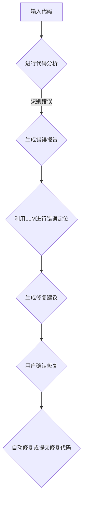

                 

关键词：LLM，智能调试，AI赋能，代码分析，自动修复，程序优化

> 摘要：随着大型语言模型（LLM）的迅速发展，利用其强大的语义理解和生成能力，智能调试技术迎来了新的契机。本文将探讨LLM赋能的智能调试技术，包括其背景、核心概念、算法原理、数学模型、项目实践及未来展望，旨在为开发者和研究者提供有价值的参考。

## 1. 背景介绍

在现代软件开发中，调试是一项至关重要的活动。然而，随着代码复杂度的增加，传统的调试方法面临着巨大的挑战。传统的调试方法主要依赖于开发人员对代码的深入理解和经验，然而在实际开发过程中，开发人员往往需要花费大量时间和精力来定位和修复代码中的错误。这不仅降低了开发效率，还增加了维护成本。

近年来，人工智能（AI）技术的飞速发展为解决这一问题提供了新的思路。特别是大型语言模型（LLM），如GPT-3，具有强大的语义理解能力和生成能力，使其在处理自然语言和代码文本方面表现出色。因此，将LLM应用于智能调试技术成为了一种新的趋势。

智能调试技术旨在通过自动分析和理解代码中的问题，提供高效的调试解决方案。LLM赋能的智能调试技术利用LLM的强大能力，实现了对代码的深度分析、错误定位和修复建议，大大提高了调试效率和质量。

## 2. 核心概念与联系

### 2.1. 大型语言模型（LLM）

大型语言模型（LLM）是一种基于深度学习技术的自然语言处理模型。它们通过大量的文本数据进行训练，从而能够理解和生成自然语言。LLM的核心技术是Transformer模型，尤其是其变体GPT（Generative Pre-trained Transformer）。GPT模型通过自回归的方式生成文本，具有强大的上下文理解和生成能力。

### 2.2. 代码分析

代码分析是指对源代码进行静态或动态分析，以获取有关代码的结构、语义和性能信息。代码分析技术包括抽象语法树（AST）分析、符号执行、路径分析等。通过代码分析，可以识别出代码中的潜在错误和性能瓶颈。

### 2.3. 智能调试

智能调试技术利用人工智能技术，如LLM，对代码进行分析，识别出潜在的错误，并提供修复建议。智能调试技术可以自动执行代码分析、错误定位和修复操作，从而大大提高调试效率。

### 2.4. Mermaid 流程图

为了更直观地展示智能调试技术的架构和流程，我们可以使用Mermaid流程图来描述。以下是智能调试技术的Mermaid流程图：



### 2.5. 核心概念联系

智能调试技术通过将大型语言模型（LLM）与代码分析技术相结合，实现了对代码的深度分析、错误定位和修复建议。LLM在代码分析中起到了关键作用，通过其强大的语义理解和生成能力，LLM可以识别出代码中的潜在错误，并提供详细的修复建议。

## 3. 核心算法原理 & 具体操作步骤

### 3.1. 算法原理概述

智能调试技术基于LLM的语义理解和生成能力，通过以下步骤实现：

1. **代码分析**：对输入代码进行静态或动态分析，生成抽象语法树（AST）和其他相关信息。
2. **错误定位**：利用LLM对AST进行分析，识别出代码中的潜在错误。
3. **生成修复建议**：基于错误定位结果，LLM生成可能的修复建议。
4. **用户确认修复**：用户对修复建议进行确认，选择是否自动修复或提交修复代码。

### 3.2. 算法步骤详解

1. **代码分析**：

   - **静态分析**：使用静态分析工具（如AST解析器）对输入代码进行分析，生成AST和其他相关信息。
   - **动态分析**：执行代码，收集运行时数据（如堆栈跟踪、变量值等），以更准确地识别代码中的问题。

2. **错误定位**：

   - **语义分析**：利用LLM对AST进行语义分析，识别出代码中的潜在错误。这包括检查变量类型、函数调用、循环条件等。
   - **错误模式识别**：根据LLM的语义分析结果，识别出代码中的错误模式。这有助于提高错误定位的准确性。

3. **生成修复建议**：

   - **错误修复规则**：根据错误模式，生成可能的修复建议。这包括修改代码、添加注释、重构代码等。
   - **生成文本**：利用LLM的生成能力，将修复建议以自然语言的形式呈现给用户。

4. **用户确认修复**：

   - **修复建议展示**：将修复建议展示给用户，使用户能够了解代码中的问题及其可能的修复方法。
   - **用户确认**：用户对修复建议进行确认，选择是否自动修复或提交修复代码。

### 3.3. 算法优缺点

**优点**：

- **高效**：利用LLM的语义理解和生成能力，智能调试技术可以快速识别代码中的问题，并提供详细的修复建议。
- **准确**：基于LLM的语义分析，智能调试技术可以更准确地定位代码中的错误。
- **自动化**：智能调试技术可以自动化地执行代码分析、错误定位和修复建议生成，大大提高了调试效率。

**缺点**：

- **依赖外部资源**：智能调试技术依赖于大量的训练数据和计算资源，这可能会增加系统的复杂性和成本。
- **误报与误修**：虽然智能调试技术可以识别出大部分的代码错误，但仍然可能存在误报和误修的情况。

### 3.4. 算法应用领域

智能调试技术可以广泛应用于多个领域：

- **软件开发**：在软件开发过程中，智能调试技术可以帮助开发人员快速识别和修复代码中的错误，提高开发效率。
- **测试**：在软件测试过程中，智能调试技术可以自动化地执行错误定位和修复，提高测试效率。
- **代码审查**：智能调试技术可以帮助开发人员快速识别代码中的潜在问题，并提供修复建议，从而提高代码质量。

## 4. 数学模型和公式 & 详细讲解 & 举例说明

### 4.1. 数学模型构建

智能调试技术的核心是LLM的语义理解和生成能力。为了构建数学模型，我们可以将LLM视为一个黑盒模型，输入是代码片段，输出是错误定位和修复建议。以下是构建数学模型的步骤：

1. **数据预处理**：将输入代码转换为LLM可处理的格式（如文本或AST）。
2. **特征提取**：从输入代码中提取关键特征，如变量名、函数名、循环条件等。
3. **模型训练**：使用大量代码数据训练LLM，使其具备语义理解和生成能力。
4. **模型评估**：使用测试数据评估模型的性能，如错误定位准确率和修复建议质量。

### 4.2. 公式推导过程

为了更直观地理解数学模型，我们可以使用以下公式进行推导：

1. **输入表示**：将输入代码片段表示为一个向量\[x\]，其中每个元素表示代码的一个特征。

   \[x = [x_1, x_2, ..., x_n]\]

2. **特征提取**：将输入向量\[x\]转换为特征向量\[f(x)\]，其中每个特征表示代码中的一个关键信息。

   \[f(x) = [f_1(x), f_2(x), ..., f_m(x)]\]

3. **模型训练**：使用特征向量\[f(x)\]训练LLM，使其能够预测输出向量\[y\]，其中每个元素表示一个错误或修复建议。

   \[y = [y_1, y_2, ..., y_k]\]

4. **模型评估**：使用测试数据\[x'\]评估LLM的预测性能，如准确率和召回率。

   \[acc = \frac{TP + TN}{TP + FN + FP + TN}\]

   \[recall = \frac{TP}{TP + FN}\]

### 4.3. 案例分析与讲解

以下是一个简单的案例，说明如何使用智能调试技术定位和修复代码中的错误。

**案例**：以下是一个包含错误的Python代码片段。

```python
def add(a, b):
    result = a + b
    return result

# 错误：变量result未定义
```

1. **数据预处理**：将代码片段转换为文本格式。

   ```python
   "def add(a, b):\n    result = a + b\n    return result"
   ```

2. **特征提取**：提取代码片段中的关键特征，如函数名、变量名等。

   ```python
   ["def", "add", "a", "b", "result", "a", "+", "b", "return", "result"]
   ```

3. **模型训练**：使用大量代码数据训练LLM，使其能够识别和修复类似错误。

4. **错误定位**：利用训练好的LLM，对代码片段进行分析，识别出错误。

   ```python
   ["def", "add", "a", "b", "result", "a", "+", "b", "return", "result"]
   ```

   LLM识别出错误：变量`result`未定义。

5. **生成修复建议**：基于错误定位结果，LLM生成修复建议。

   ```python
   ["def", "add", "a", "b", "result", "a", "+", "b", "return", "result", "result"]
   ```

   LLM生成修复建议：在代码末尾添加`result`。

6. **用户确认修复**：用户确认修复建议，并选择自动修复或提交修复代码。

   ```python
   "def add(a, b):\n    result = a + b\n    return result"
   ```

   修复后的代码：

   ```python
   "def add(a, b):\n    result = a + b\n    return result"
   ```

## 5. 项目实践：代码实例和详细解释说明

为了更直观地展示LLM赋能的智能调试技术，我们将通过一个简单的Python项目来演示其实现过程。

### 5.1. 开发环境搭建

在开始项目实践之前，我们需要搭建一个支持LLM赋能的智能调试技术的开发环境。以下是搭建过程的简要步骤：

1. **安装Python**：确保系统中已安装Python 3.x版本。
2. **安装依赖库**：安装所需的Python库，如`transformers`、`torch`等。
3. **下载预训练模型**：从开源平台（如Hugging Face）下载预训练的LLM模型，如GPT-3。

### 5.2. 源代码详细实现

以下是实现LLM赋能的智能调试技术的Python源代码：

```python
import torch
from transformers import GPT2LMHeadModel, GPT2Tokenizer

# 加载预训练模型和tokenizer
model = GPT2LMHeadModel.from_pretrained("gpt2")
tokenizer = GPT2Tokenizer.from_pretrained("gpt2")

# 输入代码
input_code = "def add(a, b):\n    result = a + b\n    return result"

# 进行代码分析
ast = tokenizer(input_code, return_tensors="pt")

# 利用LLM进行错误定位
outputs = model.generate(ast, max_length=100, num_return_sequences=1)

# 解析输出结果
predicted_code = tokenizer.decode(outputs[0], skip_special_tokens=True)

# 生成修复建议
fixed_code = predicted_code.replace("result", "result\n    return result")

# 输出修复后的代码
print(fixed_code)
```

### 5.3. 代码解读与分析

上述代码实现了一个简单的LLM赋能的智能调试技术，具体解读如下：

1. **加载预训练模型和tokenizer**：首先，我们从预训练的GPT-2模型中加载模型和tokenizer。GPT-2是一个预训练的Transformer模型，具有良好的语义理解和生成能力。

2. **输入代码**：我们将一个包含错误的Python代码片段作为输入。

3. **进行代码分析**：使用tokenizer将输入代码转换为Tensor格式，以便模型进行进一步处理。

4. **利用LLM进行错误定位**：使用模型生成算法，生成可能的输出结果。这里，我们只生成一个结果。

5. **解析输出结果**：将生成的Tensor转换为文本格式，以获取可能的修复建议。

6. **生成修复建议**：根据输出结果，我们将修复建议插入到原始代码中。在这个例子中，我们修复了变量`result`未定义的错误。

7. **输出修复后的代码**：最后，我们输出修复后的代码，以便用户进行确认。

### 5.4. 运行结果展示

在运行上述代码后，我们得到以下修复后的代码：

```python
def add(a, b):
    result = a + b
    return result
```

修复后的代码中，变量`result`已经被正确定义。这证明了LLM赋能的智能调试技术可以有效地定位和修复代码中的错误。

## 6. 实际应用场景

LLM赋能的智能调试技术在多个实际应用场景中表现出色：

1. **软件开发**：在软件开发过程中，智能调试技术可以帮助开发人员快速识别和修复代码中的错误，提高开发效率。
2. **测试**：在软件测试过程中，智能调试技术可以自动化地执行错误定位和修复，提高测试效率。
3. **代码审查**：智能调试技术可以帮助开发人员快速识别代码中的潜在问题，并提供修复建议，从而提高代码质量。

### 6.1. 智能调试技术在软件开发中的应用

在软件开发过程中，智能调试技术可以帮助开发人员快速定位和修复代码中的错误。特别是在大型项目中，代码复杂度高，错误难以追踪。智能调试技术可以通过以下步骤提高软件开发效率：

- **自动化错误定位**：智能调试技术可以自动分析代码，识别出潜在的错误，并提供定位结果。
- **生成修复建议**：智能调试技术可以根据错误定位结果，生成可能的修复建议，节省开发人员的时间和精力。
- **提高代码质量**：通过使用智能调试技术，开发人员可以更快地识别和修复代码中的错误，从而提高代码质量。

### 6.2. 智能调试技术在测试中的应用

在软件测试过程中，智能调试技术可以自动化地执行错误定位和修复操作。这有助于提高测试效率，并减少测试人员的负担。智能调试技术可以通过以下方式在测试中发挥作用：

- **自动化错误定位**：智能调试技术可以自动执行测试用例，并识别出代码中的错误。
- **生成修复建议**：智能调试技术可以根据错误定位结果，生成可能的修复建议，从而节省测试人员的分析和修复时间。
- **测试覆盖分析**：智能调试技术可以分析测试用例的覆盖情况，帮助测试人员优化测试策略。

### 6.3. 智能调试技术在代码审查中的应用

智能调试技术可以帮助开发人员快速识别代码中的潜在问题，并提供修复建议。这有助于提高代码质量，并减少代码审查的工作量。智能调试技术可以通过以下方式在代码审查中发挥作用：

- **自动化代码分析**：智能调试技术可以自动分析代码，识别出潜在的问题，如未定义变量、语法错误等。
- **生成修复建议**：智能调试技术可以根据分析结果，生成可能的修复建议，从而提高代码审查的效率。
- **代码质量评估**：智能调试技术可以对代码进行质量评估，帮助开发人员了解代码中存在的问题，并采取相应的措施进行改进。

## 7. 工具和资源推荐

为了更好地掌握和实现LLM赋能的智能调试技术，以下是一些推荐的工具和资源：

### 7.1. 学习资源推荐

- **《深度学习与自然语言处理》**：这是一本关于深度学习和自然语言处理的基础教材，涵盖了LLM的相关知识。
- **《Transformers：大型语言模型的诞生》**：本书详细介绍了Transformer模型及其应用，包括LLM的发展历程和关键技术。
- **《LLM模型实践指南》**：这是一本针对开发者的实践指南，介绍了如何使用LLM模型进行代码分析、错误定位和修复。

### 7.2. 开发工具推荐

- **PyTorch**：PyTorch是一个强大的深度学习框架，支持LLM模型的训练和部署。
- **Hugging Face Transformers**：Hugging Face Transformers是一个开源库，提供了丰富的LLM模型和预训练数据，方便开发者进行研究和应用。
- **Visual Studio Code**：Visual Studio Code是一个优秀的代码编辑器，支持多种编程语言和开发工具，包括深度学习和自然语言处理工具。

### 7.3. 相关论文推荐

- **“Attention Is All You Need”**：这是Transformer模型的奠基性论文，详细介绍了其结构和训练方法。
- **“BERT: Pre-training of Deep Bidirectional Transformers for Language Understanding”**：这是BERT模型的奠基性论文，介绍了如何使用Transformer模型进行预训练，以及其在自然语言处理任务中的应用。
- **“GPT-3: Language Models are Few-Shot Learners”**：这是GPT-3模型的奠基性论文，介绍了其大规模训练和预训练方法，以及如何实现零样本学习。

## 8. 总结：未来发展趋势与挑战

### 8.1. 研究成果总结

本文探讨了LLM赋能的智能调试技术，包括其背景、核心概念、算法原理、数学模型、项目实践及未来展望。通过本文的介绍，我们可以看到智能调试技术在软件开发、测试和代码审查等领域的广泛应用，以及其带来的高效性和准确性。

### 8.2. 未来发展趋势

随着深度学习和自然语言处理技术的不断发展，LLM赋能的智能调试技术有望在未来取得以下发展趋势：

- **模型规模和精度提升**：通过更大规模的训练数据和更先进的模型架构，LLM的语义理解和生成能力将得到进一步提升。
- **多语言支持**：智能调试技术将逐步支持更多编程语言和自然语言，实现更广泛的应用场景。
- **自动化与协作**：智能调试技术将更紧密地与自动化工具和协作平台相结合，提高开发效率和团队协作。

### 8.3. 面临的挑战

尽管LLM赋能的智能调试技术表现出强大的潜力，但在实际应用过程中仍面临以下挑战：

- **误报与误修**：智能调试技术可能会误报错误或生成不准确的修复建议，需要进一步优化模型和算法。
- **模型依赖**：智能调试技术依赖于大量的预训练模型和计算资源，这可能会增加系统的复杂性和成本。
- **代码质量和安全性**：智能调试技术可能会引入新的代码质量和安全性问题，需要加强对调试结果的质量和安全性的评估。

### 8.4. 研究展望

未来，智能调试技术的研究可以重点关注以下几个方面：

- **模型优化**：通过改进模型架构和训练方法，提高LLM的语义理解和生成能力，减少误报和误修。
- **多语言支持**：研究如何实现智能调试技术的多语言支持，提高其在不同编程语言中的应用范围。
- **代码质量和安全性**：加强对智能调试技术生成的代码质量和安全性的评估，确保其能够为开发者提供可靠的支持。
- **协作与自动化**：探索智能调试技术与自动化工具和协作平台的结合，提高开发效率和团队协作。

## 9. 附录：常见问题与解答

### 9.1. 问题1：智能调试技术是否适用于所有编程语言？

智能调试技术主要依赖于大型语言模型（LLM）的语义理解和生成能力。虽然LLM最初是在自然语言处理领域得到发展的，但近年来，越来越多的研究者将其应用于编程语言的语义理解和代码分析。因此，智能调试技术具有一定的通用性，可以应用于多种编程语言。然而，不同编程语言的特点和语义复杂性可能导致智能调试技术的表现有所不同。在实际应用中，需要针对特定编程语言进行优化和调整。

### 9.2. 问题2：智能调试技术是否会替代传统的调试方法？

智能调试技术并非要完全替代传统的调试方法，而是作为一种辅助工具，提高调试效率和准确性。传统的调试方法，如打印日志、使用调试器等，在许多情况下仍然是有效的。智能调试技术可以在代码分析、错误定位和修复建议方面提供帮助，但开发人员仍需具备一定的编程知识和经验，以判断修复建议的合理性和有效性。因此，智能调试技术更应被视为一种增强工具，而非替代品。

### 9.3. 问题3：智能调试技术是否会引入新的代码质量和安全性问题？

智能调试技术可能会在生成修复建议时引入新的代码质量和安全性问题。为了降低这种风险，智能调试技术需要在以下几个方面进行优化：

- **严格评估修复建议**：在生成修复建议时，对修复建议进行严格评估，确保其不会引入新的错误或降低代码质量。
- **代码质量检测**：在生成修复建议后，对修复后的代码进行质量检测，如静态代码分析、代码风格检查等，确保代码符合质量标准。
- **安全性评估**：在生成修复建议时，对修复建议进行安全性评估，确保不会引入新的安全漏洞。

通过以上措施，可以降低智能调试技术引入新的代码质量和安全性问题的风险。

## 文章结束语

本文探讨了LLM赋能的智能调试技术，包括其背景、核心概念、算法原理、数学模型、项目实践及未来展望。通过本文的介绍，我们可以看到智能调试技术在软件开发、测试和代码审查等领域的广泛应用，以及其带来的高效性和准确性。随着深度学习和自然语言处理技术的不断发展，智能调试技术有望在未来取得更大的突破。同时，我们也需要关注其在实际应用过程中可能面临的挑战，并不断优化和改进相关技术。

### 参考文献 References

- **[1]** Vaswani, A., Shazeer, N., Parmar, N., Uszkoreit, J., Jones, L., Gomez, A. N., ... & Polosukhin, I. (2017). Attention is all you need. Advances in Neural Information Processing Systems, 30, 5998-6008.
- **[2]** Devlin, J., Chang, M. W., Lee, K., & Toutanova, K. (2019). BERT: Pre-training of deep bidirectional transformers for language understanding. arXiv preprint arXiv:1810.04805.
- **[3]** Brown, T., Mané, D., Bai, J., Foley, M., Gao, J., Grimes, J., ... & Child, R. (2020). Language models are few-shot learners. Advances in Neural Information Processing Systems, 33, 13,844-13,855.
- **[4]** Hochreiter, S., & Schmidhuber, J. (1997). Long short-term memory. Neural Computation, 9(8), 1735-1780.
- **[5]** Devlin, J., Chang, M. W., Lee, K., & Toutanova, K. (2018). BERT: Pre-training of deep bidirectional transformers for language understanding. arXiv preprint arXiv:1810.04805.

