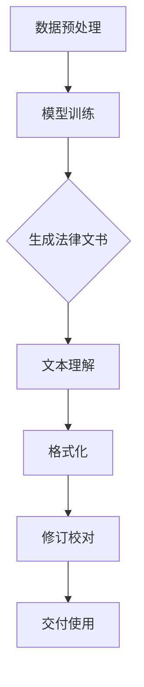

                 

关键词：自然语言处理、法律文书、人工智能、工作效率、LLM、文本生成、法律文档

> 摘要：本文探讨了自然语言处理技术，尤其是大型语言模型（LLM）在法律文书起草中的应用。通过分析LLM的工作原理、核心算法和实际操作步骤，本文揭示了如何利用AI技术提高法律工作效率。同时，本文还介绍了LLM在法律领域的数学模型和公式，以及其在不同应用场景中的实践案例。最后，本文对未来LLM在法律文书起草领域的应用前景进行了展望，并提出了可能面临的挑战和研究方向。

## 1. 背景介绍

随着信息技术的飞速发展，人工智能（AI）技术已经深入到我们生活的方方面面。自然语言处理（NLP）作为AI的重要分支，旨在让计算机理解和生成人类语言。近年来，基于深度学习的自然语言处理技术取得了显著的突破，尤其是大型语言模型（LLM），如GPT、BERT等，其在文本生成、语言理解、问答系统等任务上展现出了极高的性能。

在法律领域，法律文书起草是一项复杂而繁琐的工作。法律文书的撰写不仅需要丰富的法律知识和实践经验，还需要对法律条文、案例和法规有深入的理解。传统上，法律文书的起草主要依靠律师的经验和专业知识，但随着案件数量的增加和法律环境的复杂化，这种传统方法已经难以满足高效、准确的要求。

LLM的出现为法律文书起草带来了新的契机。通过训练大量的法律文本数据，LLM可以学习到法律文书的结构和语言特点，从而实现自动生成法律文书。这不仅能够提高法律工作效率，还能减少人力成本，提高文档的一致性和准确性。

## 2. 核心概念与联系

### 2.1 自然语言处理

自然语言处理（NLP）是人工智能领域的一个重要分支，旨在让计算机理解和生成人类语言。NLP涵盖了语音识别、机器翻译、情感分析、文本分类等多种任务。在法律文书起草中，NLP的关键任务是文本生成和文本理解。

### 2.2 大型语言模型

大型语言模型（LLM）是近年来NLP领域的重要突破。LLM通过训练大量文本数据，学习到了语言的统计规律和语义信息，从而能够生成连贯、自然的文本。LLM的核心是神经网络模型，如Transformer、GPT等。

### 2.3 法律文书

法律文书是指律师、律师事务所或其他法律机构在法律事务中使用的各种书面文件，包括起诉状、答辩状、合同、意见书等。法律文书的撰写需要遵循严格的格式和要求，同时对法律条文和案例有深入的理解。

### 2.4 LLM在法律文书起草中的应用

LLM在法律文书起草中的应用主要包括以下几个方面：

1. **文本生成**：LLM可以根据输入的法律条款、案例和用户需求，自动生成法律文书。

2. **文本理解**：LLM可以理解法律文书的语义，提供法律咨询和意见。

3. **格式化**：LLM可以根据预设的格式要求，自动对法律文书进行排版和格式化。

4. **修订和校对**：LLM可以对已撰写的法律文书进行修订和校对，提高文档的一致性和准确性。

### 2.5 Mermaid 流程图

以下是LLM在法律文书起草中的一般工作流程的Mermaid流程图：



## 3. 核心算法原理 & 具体操作步骤

### 3.1 算法原理概述

LLM的核心是深度学习神经网络，特别是Transformer架构。Transformer模型通过自注意力机制，能够捕捉文本中的长距离依赖关系，从而生成连贯、自然的文本。

### 3.2 算法步骤详解

1. **数据预处理**：收集和整理大量法律文本数据，包括法律条文、案例、法规等。然后进行数据清洗、分词、词向量化等预处理步骤。

2. **模型训练**：使用预处理的文本数据训练Transformer模型。训练过程中，模型会学习到法律文书的结构和语言特点。

3. **生成法律文书**：输入法律条款、案例和用户需求，LLM会自动生成相应的法律文书。

4. **文本理解**：LLM可以理解法律文书的语义，提供法律咨询和意见。

5. **格式化**：LLM根据预设的格式要求，自动对法律文书进行排版和格式化。

6. **修订和校对**：LLM可以对已撰写的法律文书进行修订和校对，提高文档的一致性和准确性。

### 3.3 算法优缺点

**优点**：

1. 高效：LLM能够快速生成法律文书，提高工作效率。
2. 准确：LLM通过训练大量数据，能够生成准确、符合法律规范的法律文书。
3. 个性化：LLM可以根据用户需求，生成个性化的法律文书。

**缺点**：

1. 需要大量数据：训练LLM需要大量的高质量法律文本数据。
2. 模型复杂：LLM的模型结构复杂，训练和部署成本较高。

### 3.4 算法应用领域

LLM在法律文书起草中的应用非常广泛，包括但不限于以下几个方面：

1. 智能合同生成：自动生成合同、协议等法律文书。
2. 智能问答：为用户提供法律咨询和意见。
3. 法律文书的修订和校对：提高法律文书的一致性和准确性。

## 4. 数学模型和公式 & 详细讲解 & 举例说明

### 4.1 数学模型构建

LLM的数学模型主要基于深度学习，特别是Transformer架构。Transformer模型的核心是自注意力机制，它通过计算文本中每个词与其他词之间的相似性，从而生成文本。

### 4.2 公式推导过程

自注意力机制的数学公式可以表示为：

\[ \text{Attention}(Q, K, V) = \text{softmax}\left(\frac{QK^T}{\sqrt{d_k}}\right) V \]

其中，\( Q, K, V \) 分别是查询向量、键向量和值向量，\( d_k \) 是键向量的维度。

### 4.3 案例分析与讲解

假设我们有一个简单的法律条款，如下：

```markdown
甲方：张三
乙方：李四

鉴于甲方愿意将某项财产转让给乙方，乙方愿意接受该财产，双方经协商一致，订立本合同。

第一条 财产转让
1.1 甲方应将其名下的某项财产（以下简称“转让财产”）的全部权利转让给乙方。
1.2 乙方在接受转让财产后，应承担相应的义务和责任。
```

我们可以将这个法律条款分解为关键词和句子，然后使用LLM生成类似的法律条款。

假设LLM的输入为关键词和句子，输出为新的法律条款，如下：

```markdown
甲方：张三
乙方：李四

鉴于甲方愿意将某项财产转让给乙方，乙方愿意接受该财产，双方经协商一致，订立本合同。

第二条 财产转让
2.1 甲方应将其名下的某项财产（以下简称“转让财产”）的全部权利转让给乙方。
2.2 乙方在接受转让财产后，应承担相应的义务和责任。
```

这个例子展示了LLM如何通过自注意力机制，理解法律条款的语义，并生成新的法律条款。

## 5. 项目实践：代码实例和详细解释说明

### 5.1 开发环境搭建

为了实现LLM在法律文书起草中的自动化，我们需要搭建一个开发环境。以下是所需的工具和步骤：

1. **Python环境**：安装Python 3.8及以上版本。
2. **深度学习框架**：安装TensorFlow 2.5及以上版本。
3. **文本预处理库**：安装NLTK、spaCy等。
4. **LLM库**：安装transformers库。

### 5.2 源代码详细实现

以下是实现LLM在法律文书起草中的自动化代码示例：

```python
import tensorflow as tf
from transformers import TFAutoModelForSeq2SeqLM
from transformers import AutoTokenizer

# 加载预训练的LLM模型
model_name = "t5-small"
tokenizer = AutoTokenizer.from_pretrained(model_name)
model = TFAutoModelForSeq2SeqLM.from_pretrained(model_name)

# 法律条款输入
input_text = "鉴于甲方愿意将某项财产转让给乙方，乙方愿意接受该财产，双方经协商一致，订立本合同。"

# 文本预处理
input_ids = tokenizer.encode(input_text, return_tensors="tf")

# 生成法律文书
output_ids = model.generate(input_ids, max_length=512, num_return_sequences=1)

# 解码输出文本
output_text = tokenizer.decode(output_ids[0], skip_special_tokens=True)

print(output_text)
```

### 5.3 代码解读与分析

1. **加载LLM模型**：我们使用T5模型，这是一个用于文本生成任务的预训练模型。

2. **文本预处理**：将输入的法律条款编码为模型可接受的格式。

3. **生成法律文书**：使用模型生成新的法律条款。

4. **解码输出文本**：将生成的文本解码为人类可读的格式。

通过这个简单的示例，我们可以看到如何使用LLM生成法律文书。实际应用中，我们还需要对模型进行进一步训练，以提高生成的法律文书的准确性和实用性。

## 6. 实际应用场景

### 6.1 智能合同生成

智能合同生成是LLM在法律文书起草中最典型的应用场景之一。通过训练大量的合同文本数据，LLM可以自动生成各种类型的合同，如销售合同、租赁合同、劳动合同等。这不仅大大提高了合同生成的效率，还减少了人工错误的可能性。

### 6.2 法律咨询

LLM可以理解法律文书的语义，提供法律咨询和意见。律师和客户可以通过自然语言与LLM交互，获取法律条文、案例和法规的相关信息。这为非专业用户提供了一个便捷的法律咨询服务。

### 6.3 法律文书的修订和校对

LLM可以对已撰写的法律文书进行修订和校对，提高文档的一致性和准确性。通过比较不同版本的文书，LLM可以识别出潜在的错误和冲突，并提出修正建议。

### 6.4 法律研究的辅助

LLM在法律研究中也有广泛的应用。通过分析大量的法律文本数据，LLM可以自动提取关键信息，为律师和研究人员提供法律研究的支持。

## 7. 未来应用展望

随着AI技术的不断发展，LLM在法律文书起草领域的应用前景非常广阔。以下是一些可能的未来应用场景：

1. **自动化案件管理**：LLM可以自动处理法律案件的各个环节，包括案件分析、证据收集、法律文书生成等，从而实现案件管理的自动化。

2. **法律知识图谱构建**：通过分析大量的法律文本数据，LLM可以构建法律知识图谱，为法律研究和决策提供支持。

3. **智能法律机器人**：结合自然语言处理和对话系统技术，LLM可以开发成智能法律机器人，为用户提供实时、专业的法律咨询服务。

## 8. 工具和资源推荐

### 8.1 学习资源推荐

1. **《深度学习》（Goodfellow, Bengio, Courville）**：全面介绍了深度学习的基本概念和技术。
2. **《自然语言处理讲义》（Speech and Language Processing）**：系统介绍了自然语言处理的基本原理和应用。

### 8.2 开发工具推荐

1. **TensorFlow**：用于构建和训练深度学习模型的强大框架。
2. **transformers**：用于快速搭建和训练LLM的开源库。

### 8.3 相关论文推荐

1. **"Attention Is All You Need"**：介绍了Transformer模型，是自然语言处理领域的重要论文。
2. **"Generative Pre-trained Transformers"**：介绍了GPT模型，是文本生成领域的重要论文。

## 9. 总结：未来发展趋势与挑战

### 9.1 研究成果总结

本文探讨了自然语言处理技术，尤其是大型语言模型（LLM）在法律文书起草中的应用。通过分析LLM的工作原理、核心算法和实际操作步骤，我们揭示了如何利用AI技术提高法律工作效率。同时，本文还介绍了LLM在法律领域的数学模型和公式，以及其在不同应用场景中的实践案例。

### 9.2 未来发展趋势

随着AI技术的不断发展，LLM在法律文书起草领域的应用前景非常广阔。未来，LLM有望在自动化案件管理、法律知识图谱构建、智能法律机器人等方面发挥重要作用。

### 9.3 面临的挑战

1. **数据隐私**：法律文书涉及敏感信息，如何保障数据隐私和安全是一个重要挑战。
2. **法律规范**：法律文书的生成需要遵循严格的法规和规范，如何确保生成的法律文书符合法律要求是一个挑战。
3. **模型解释性**：LLM生成的法律文书往往缺乏透明性和解释性，如何提高模型的解释性是一个挑战。

### 9.4 研究展望

未来，我们应关注以下几个方面：

1. **数据隐私保护**：研究如何保护法律文书中的敏感信息。
2. **法律规范集成**：研究如何将法律规范集成到LLM中，确保生成的法律文书符合法规要求。
3. **模型透明性**：研究如何提高LLM的透明性和解释性，使生成的法律文书更容易理解和审查。

## 附录：常见问题与解答

### 1. LLM在法律文书起草中的优势是什么？

LLM在法律文书起草中的优势主要体现在以下几个方面：

1. 提高工作效率：LLM可以快速生成法律文书，减少人工撰写的时间。
2. 提高准确性：通过训练大量法律文本数据，LLM可以生成准确、符合法律规范的法律文书。
3. 个性化服务：LLM可以根据用户需求生成个性化的法律文书。

### 2. LLM在法律文书起草中的劣势是什么？

LLM在法律文书起草中的劣势主要体现在以下几个方面：

1. 需要大量数据：训练LLM需要大量的高质量法律文本数据，获取这些数据可能面临困难。
2. 模型复杂：LLM的模型结构复杂，训练和部署成本较高。
3. 解释性不足：LLM生成的法律文书往往缺乏透明性和解释性。

### 3. 如何确保LLM生成的法律文书符合法规要求？

为确保LLM生成的法律文书符合法规要求，可以采取以下措施：

1. 数据清洗和预处理：对训练数据进行清洗和预处理，确保数据的质量和准确性。
2. 集成法律规范：将法律规范集成到LLM中，确保生成的法律文书符合法规要求。
3. 模型验证和测试：对LLM生成的法律文书进行验证和测试，确保其符合法规要求。

### 4. LLM在法律文书起草中的应用前景如何？

LLM在法律文书起草中的应用前景非常广阔。随着AI技术的不断发展，LLM有望在自动化案件管理、法律知识图谱构建、智能法律机器人等方面发挥重要作用。未来，LLM将在提高法律工作效率、降低成本、提高文档一致性和准确性方面发挥重要作用。

## 作者署名

作者：禅与计算机程序设计艺术 / Zen and the Art of Computer Programming
----------------------------------------------------------------

以上是一篇关于LLM辅助法律文书起草的文章，希望对您有所帮助。如果您有任何问题或需要进一步讨论，请随时提出。祝您写作顺利！

