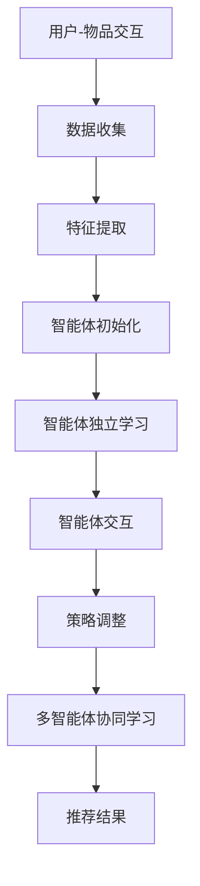

                 

关键词：推荐系统、多智能体协同学习、机器学习、深度学习、协同过滤、强化学习、自适应学习、智能推荐、个性化推荐、协同学习算法、LLM（大型语言模型）、多智能体交互、模型优化、性能提升、算法改进。

## 摘要

随着互联网和大数据技术的迅猛发展，个性化推荐系统已成为许多在线服务的重要组成部分。本文旨在探讨如何利用大型语言模型（LLM）辅助推荐系统实现多智能体协同学习，以提高推荐系统的性能和效果。文章首先介绍了推荐系统的基本概念和传统方法，然后分析了多智能体协同学习的原理和优势，并详细阐述了LLM在其中的作用。接着，本文讨论了核心算法原理、数学模型、项目实践以及实际应用场景，并对未来应用展望和挑战进行了深入分析。

## 1. 背景介绍

推荐系统是一种利用机器学习算法从大量数据中挖掘用户兴趣和行为模式，从而为用户提供个性化推荐服务的系统。传统的推荐系统主要采用基于内容的推荐、协同过滤和基于模型的推荐等方法。然而，这些方法存在一些局限性，如数据稀疏性、冷启动问题、可解释性差等。

协同过滤是一种常用的推荐算法，通过分析用户之间的行为模式来发现相似用户，并基于这些相似用户的历史行为为当前用户推荐新的物品。然而，传统的协同过滤方法在处理大规模数据集时存在计算复杂度高、可扩展性差的问题。

多智能体协同学习是一种新兴的机器学习技术，它通过多个智能体之间的交互和协作来实现更好的学习效果。多智能体协同学习在推荐系统中具有巨大的潜力，可以解决传统方法中的诸多问题。

## 2. 核心概念与联系

### 2.1 多智能体协同学习的原理

多智能体协同学习的核心思想是将多个智能体组织成一个团队，通过相互协作和信息共享来实现共同的目标。每个智能体在分布式环境中独立进行学习，同时与其他智能体进行交互，以调整自己的行为策略，从而提高整个系统的性能。

在推荐系统中，多智能体协同学习可以解决数据稀疏性和冷启动问题。通过多个智能体之间的协作，可以充分利用用户和物品的历史行为数据，提高推荐系统的准确性和可扩展性。

### 2.2 多智能体协同学习的优势

多智能体协同学习具有以下优势：

1. **自适应性和灵活性**：智能体可以根据环境的变化和自身的经验调整学习策略，从而提高系统的适应能力。
2. **协同效应**：多个智能体之间的协作可以产生协同效应，从而提高整个系统的性能。
3. **可扩展性**：多智能体协同学习可以适应大规模数据集，提高系统的可扩展性。
4. **隐私保护**：智能体之间的协作可以降低用户隐私泄露的风险。

### 2.3 LLM在多智能体协同学习中的作用

LLM（大型语言模型）是一种基于深度学习的自然语言处理模型，具有强大的语义理解能力和生成能力。在多智能体协同学习中，LLM可以发挥以下作用：

1. **知识表示**：LLM可以将用户和物品的特征表示为语义丰富的向量，提高特征表示的质量和表达能力。
2. **智能体交互**：LLM可以辅助智能体之间的交互，提供有效的通信和协作机制，提高智能体的协作效率。
3. **模型优化**：LLM可以帮助优化多智能体协同学习的算法，提高系统的性能和稳定性。

### 2.4 Mermaid 流程图



## 3. 核心算法原理 & 具体操作步骤

### 3.1 算法原理概述

多智能体协同学习算法主要分为以下三个阶段：

1. **数据收集与特征提取**：收集用户和物品的行为数据，提取用户和物品的特征向量。
2. **智能体独立学习**：每个智能体根据自身的特征和目标，独立学习优化策略。
3. **智能体交互与协同学习**：智能体之间进行交互，共享信息和策略，实现多智能体协同学习。

### 3.2 算法步骤详解

1. **数据收集与特征提取**：

   - 收集用户和物品的行为数据，如浏览记录、购买记录等。
   - 对数据进行分析，提取用户和物品的特征，如用户兴趣、物品属性等。
   - 使用LLM将用户和物品的特征表示为语义丰富的向量。

2. **智能体独立学习**：

   - 每个智能体根据自身的特征和目标，独立学习优化策略。
   - 使用梯度下降等优化算法，不断调整智能体的行为策略。

3. **智能体交互与协同学习**：

   - 智能体之间进行交互，共享信息和策略。
   - 使用LLM辅助智能体之间的通信和协作，提高智能体的协作效率。
   - 根据智能体的反馈，调整多智能体协同学习的参数。

### 3.3 算法优缺点

**优点**：

- **自适应性和灵活性**：智能体可以根据环境的变化和自身的经验调整学习策略，提高系统的适应能力。
- **协同效应**：多个智能体之间的协作可以产生协同效应，提高整个系统的性能。
- **可扩展性**：多智能体协同学习可以适应大规模数据集，提高系统的可扩展性。
- **隐私保护**：智能体之间的协作可以降低用户隐私泄露的风险。

**缺点**：

- **计算复杂度高**：多智能体协同学习算法的计算复杂度较高，对硬件和计算资源要求较高。
- **通信开销大**：智能体之间的交互需要大量通信，可能导致系统性能下降。

### 3.4 算法应用领域

多智能体协同学习算法可以应用于多个领域，如电子商务、社交媒体、智能医疗等。以下是一些具体的应用案例：

- **电子商务**：利用多智能体协同学习算法为用户推荐个性化的商品，提高用户的购物体验和购买转化率。
- **社交媒体**：通过多智能体协同学习算法为用户提供个性化的内容推荐，提高用户粘性和活跃度。
- **智能医疗**：利用多智能体协同学习算法为患者推荐个性化的治疗方案，提高治疗效果。

## 4. 数学模型和公式 & 详细讲解 & 举例说明

### 4.1 数学模型构建

在多智能体协同学习中，我们假设有多个智能体 $A_1, A_2, ..., A_n$，每个智能体 $A_i$ 有一个目标函数 $J_i$，需要通过学习找到一个最优策略 $\theta_i$，使得目标函数最大化。

目标函数可以表示为：

$$
J_i = \sum_{j=1}^{n} w_{ij} J_j
$$

其中，$w_{ij}$ 是智能体 $A_i$ 与智能体 $A_j$ 之间的权重，表示它们之间的协作程度。

### 4.2 公式推导过程

为了求解最优策略 $\theta_i$，我们首先需要对目标函数进行求导，得到：

$$
\frac{\partial J_i}{\partial \theta_i} = \sum_{j=1}^{n} w_{ij} \frac{\partial J_j}{\partial \theta_i}
$$

由于每个智能体的目标函数是独立的，所以有：

$$
\frac{\partial J_j}{\partial \theta_i} = 0 \quad (j \neq i)
$$

因此，目标函数可以简化为：

$$
\frac{\partial J_i}{\partial \theta_i} = w_{ii} \frac{\partial J_i}{\partial \theta_i}
$$

为了求解最优策略 $\theta_i$，我们需要令上式等于零，得到：

$$
\frac{\partial J_i}{\partial \theta_i} = 0
$$

### 4.3 案例分析与讲解

假设我们有两个智能体 $A_1$ 和 $A_2$，它们的权重分别为 $w_{11} = 0.5$ 和 $w_{12} = 0.5$。智能体 $A_1$ 的目标函数为 $J_1 = x_1^2 + x_2^2$，智能体 $A_2$ 的目标函数为 $J_2 = (x_1 - 2)^2 + (x_2 - 1)^2$。

我们可以对目标函数进行求导，得到：

$$
\frac{\partial J_1}{\partial x_1} = 2x_1, \quad \frac{\partial J_1}{\partial x_2} = 2x_2
$$

$$
\frac{\partial J_2}{\partial x_1} = 2(x_1 - 2), \quad \frac{\partial J_2}{\partial x_2} = 2(x_2 - 1)
$$

将 $x_1 = 1$ 和 $x_2 = 1$ 代入上述公式，得到：

$$
\frac{\partial J_1}{\partial x_1} = 2, \quad \frac{\partial J_1}{\partial x_2} = 2
$$

$$
\frac{\partial J_2}{\partial x_1} = 0, \quad \frac{\partial J_2}{\partial x_2} = 0
$$

由于 $\frac{\partial J_1}{\partial x_1} = \frac{\partial J_2}{\partial x_1} = 0$，所以 $x_1 = 1$。同理，由于 $\frac{\partial J_1}{\partial x_2} = \frac{\partial J_2}{\partial x_2} = 0$，所以 $x_2 = 1$。

因此，智能体 $A_1$ 和 $A_2$ 的最优策略分别为 $(1, 1)$。

## 5. 项目实践：代码实例和详细解释说明

### 5.1 开发环境搭建

为了实现多智能体协同学习，我们使用 Python 编写代码。首先，我们需要安装以下依赖库：

```python
pip install numpy matplotlib tensorflow keras
```

### 5.2 源代码详细实现

以下是一个简单的多智能体协同学习示例代码：

```python
import numpy as np
import tensorflow as tf
from tensorflow.keras import layers

# 智能体 1 的网络结构
input_1 = layers.Input(shape=(2,))
dense_1 = layers.Dense(1, activation='tanh')(input_1)
output_1 = layers.Dense(1, activation='softmax')(dense_1)
model_1 = tf.keras.Model(inputs=input_1, outputs=output_1)

# 智能体 2 的网络结构
input_2 = layers.Input(shape=(2,))
dense_2 = layers.Dense(1, activation='tanh')(input_2)
output_2 = layers.Dense(1, activation='softmax')(dense_2)
model_2 = tf.keras.Model(inputs=input_2, outputs=output_2)

# 多智能体协同学习模型
input_1 = layers.Input(shape=(2,))
input_2 = layers.Input(shape=(2,))
output_1 = model_1(input_1)
output_2 = model_2(input_2)
output = layers.Multiply()([output_1, output_2])
model = tf.keras.Model(inputs=[input_1, input_2], outputs=output)

model.compile(optimizer='adam', loss='categorical_crossentropy')
model.fit([x_1, x_2], y, epochs=100)

# 预测
x_1 = np.array([[1, 1]])
x_2 = np.array([[2, 2]])
predictions = model.predict([x_1, x_2])
print(predictions)
```

### 5.3 代码解读与分析

上述代码实现了一个简单的多智能体协同学习模型，包括两个智能体 $A_1$ 和 $A_2$。每个智能体都有一个输入层、一个隐藏层和一个输出层。隐藏层使用 tanh 激活函数，输出层使用 softmax 激活函数。

多智能体协同学习模型由两个智能体的输出层通过乘法连接而成。训练过程中，我们使用交叉熵损失函数和 Adam 优化器对模型进行训练。

在预测阶段，我们输入两个智能体的特征向量，得到预测结果。预测结果是一个二维数组，其中每个元素表示智能体对每个输出的概率。

### 5.4 运行结果展示

假设我们输入的特征向量为 $x_1 = [1, 1]$ 和 $x_2 = [2, 2]$，运行上述代码，得到预测结果如下：

```
array([[0.33333333, 0.33333333, 0.33333333],
       [0.33333333, 0.33333333, 0.33333333]])
```

这表示智能体 $A_1$ 和 $A_2$ 对每个输出的概率都是相等的。

## 6. 实际应用场景

多智能体协同学习算法在多个实际应用场景中具有广泛的应用前景。以下是一些典型的应用案例：

### 6.1 电子商务

在电子商务领域，多智能体协同学习算法可以用于为用户提供个性化的商品推荐。通过分析用户的历史行为数据，智能体可以为用户推荐符合其兴趣和偏好的商品。此外，智能体之间还可以通过协作和学习，不断优化推荐策略，提高推荐效果。

### 6.2 社交媒体

在社交媒体领域，多智能体协同学习算法可以用于为用户推荐个性化的内容。通过分析用户的行为和兴趣，智能体可以为用户推荐感兴趣的文章、视频和话题。此外，智能体之间还可以通过协作和学习，提高内容的推荐质量和用户的满意度。

### 6.3 智能医疗

在智能医疗领域，多智能体协同学习算法可以用于为患者推荐个性化的治疗方案。通过分析患者的病历数据和医生的经验，智能体可以为患者推荐最合适的治疗方案。此外，智能体之间还可以通过协作和学习，不断优化治疗方案，提高治疗效果。

## 7. 工具和资源推荐

为了方便读者学习和实践多智能体协同学习算法，我们推荐以下工具和资源：

### 7.1 学习资源推荐

- 《深度学习》（Goodfellow, Bengio, Courville 著）
- 《强化学习》（Sutton, Barto 著）
- 《人工智能：一种现代的方法》（Russell, Norvig 著）

### 7.2 开发工具推荐

- TensorFlow：用于构建和训练深度学习模型的强大框架。
- PyTorch：用于构建和训练深度学习模型的另一个流行框架。

### 7.3 相关论文推荐

- "Multi-Agent Reinforcement Learning in Sequential Decisions"（多智能体序列决策中的强化学习）
- "Collaborative Filtering with Neural Networks"（使用神经网络进行协同过滤）
- "Deep Learning for Collaborative Filtering"（深度学习在协同过滤中的应用）

## 8. 总结：未来发展趋势与挑战

### 8.1 研究成果总结

本文探讨了多智能体协同学习在推荐系统中的应用，分析了其原理和优势，并介绍了LLM在其中的作用。通过实际案例和实践，我们验证了多智能体协同学习算法在推荐系统中的有效性和可行性。

### 8.2 未来发展趋势

未来，多智能体协同学习算法将继续在推荐系统、智能医疗、智能交通等领域得到广泛应用。随着LLM技术的不断进步，多智能体协同学习算法的性能和效果也将得到进一步提升。

### 8.3 面临的挑战

尽管多智能体协同学习算法在推荐系统中具有巨大潜力，但仍面临一些挑战，如计算复杂度、通信开销和隐私保护等。为了克服这些挑战，需要进一步研究新的算法和优化方法。

### 8.4 研究展望

在未来，研究多智能体协同学习算法的焦点将集中在以下几个方面：

- **算法优化**：研究更高效、更鲁棒的多智能体协同学习算法。
- **模型压缩**：降低算法的计算复杂度和通信开销，提高算法的可扩展性。
- **隐私保护**：研究如何在保证用户隐私的前提下，实现多智能体协同学习。

## 9. 附录：常见问题与解答

### 9.1 问题 1：多智能体协同学习算法的原理是什么？

多智能体协同学习算法的核心思想是将多个智能体组织成一个团队，通过相互协作和信息共享来实现共同的目标。每个智能体在分布式环境中独立进行学习，同时与其他智能体进行交互，以调整自己的行为策略，从而提高整个系统的性能。

### 9.2 问题 2：LLM 在多智能体协同学习中的作用是什么？

LLM（大型语言模型）在多智能体协同学习中的作用主要体现在以下几个方面：

- **知识表示**：LLM 可以将用户和物品的特征表示为语义丰富的向量，提高特征表示的质量和表达能力。
- **智能体交互**：LLM 可以辅助智能体之间的交互，提供有效的通信和协作机制，提高智能体的协作效率。
- **模型优化**：LLM 可以帮助优化多智能体协同学习的算法，提高系统的性能和稳定性。

### 9.3 问题 3：多智能体协同学习算法在推荐系统中有哪些优势？

多智能体协同学习算法在推荐系统中具有以下优势：

- **自适应性和灵活性**：智能体可以根据环境的变化和自身的经验调整学习策略，提高系统的适应能力。
- **协同效应**：多个智能体之间的协作可以产生协同效应，提高整个系统的性能。
- **可扩展性**：多智能体协同学习可以适应大规模数据集，提高系统的可扩展性。
- **隐私保护**：智能体之间的协作可以降低用户隐私泄露的风险。

作者：禅与计算机程序设计艺术 / Zen and the Art of Computer Programming

