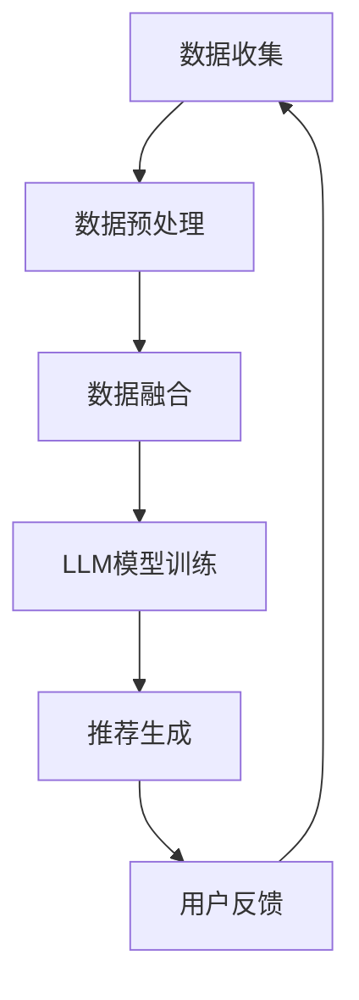

                 

关键词：LLM（大型语言模型），推荐系统，多源异构数据融合，算法原理，数学模型，项目实践，应用场景，未来展望

摘要：本文深入探讨了LLM（大型语言模型）在推荐系统多源异构数据融合中的应用。通过详细的算法原理分析、数学模型构建以及项目实践，本文旨在为研究者和技术人员提供全面的技术指南，并探讨该领域的未来发展趋势和挑战。

## 1. 背景介绍

随着互联网的飞速发展，推荐系统已经成为许多在线平台的重要组成部分。这些系统旨在为用户提供个性化的内容、产品或服务，从而提高用户体验和平台粘性。然而，推荐系统的有效性在很大程度上取决于数据的质量和多样性。多源异构数据融合，作为一种关键技术，正逐渐成为推荐系统研究的热点。

多源异构数据融合指的是将来自不同数据源、具有不同结构和类型的异构数据进行整合和处理，以生成一个统一的数据视图。这种技术具有以下几个关键挑战：

1. **数据来源多样**：推荐系统需要整合来自用户行为数据、内容数据、社交网络数据等多源数据。
2. **数据结构异构**：不同数据源的数据格式和结构可能存在巨大差异，如文本、图像、音频、视频等。
3. **数据质量参差不齐**：不同数据源的数据质量可能参差不齐，包括数据完整性、准确性和一致性等方面。

为解决上述挑战，本文将介绍LLM在推荐系统多源异构数据融合中的应用，包括核心算法原理、数学模型、项目实践和未来展望。

## 2. 核心概念与联系

为了更好地理解LLM在推荐系统多源异构数据融合中的应用，我们需要先了解几个核心概念：LLM、推荐系统、多源异构数据融合以及它们之间的联系。

### 2.1 LLM

LLM（Large Language Model）是一种基于深度学习的大型自然语言处理模型。它通过对大量文本数据进行训练，能够自动生成文本、回答问题、进行对话等。LLM具有强大的文本生成能力和理解能力，使得它在许多自然语言处理任务中表现出色。

### 2.2 推荐系统

推荐系统是一种信息过滤技术，旨在根据用户的兴趣和偏好向其推荐相关的内容、产品或服务。推荐系统的核心目标是提高用户体验和平台粘性，从而增加用户留存率和收益。

### 2.3 多源异构数据融合

多源异构数据融合是指将来自不同数据源、具有不同结构和类型的异构数据进行整合和处理，以生成一个统一的数据视图。这种技术可以提高推荐系统的数据质量，从而提高推荐效果。

### 2.4 LLM与推荐系统、多源异构数据融合的联系

LLM在推荐系统多源异构数据融合中的应用主要体现在以下几个方面：

1. **文本生成**：LLM能够自动生成文本，用于生成推荐内容或描述。
2. **知识表示**：LLM能够将不同类型的异构数据（如文本、图像、音频等）进行统一表示，为后续数据处理提供便利。
3. **文本理解**：LLM能够理解文本中的语义和情感，从而提高推荐系统的智能化程度。

下面是一个Mermaid流程图，展示了LLM在推荐系统多源异构数据融合中的核心流程：



## 3. 核心算法原理 & 具体操作步骤

### 3.1 算法原理概述

LLM辅助的推荐系统多源异构数据融合算法主要分为以下几个步骤：

1. **数据收集**：从多个数据源收集数据，包括用户行为数据、内容数据、社交网络数据等。
2. **数据预处理**：对收集到的数据进行清洗、去重、格式转换等处理，以消除数据质量问题。
3. **数据融合**：利用LLM将不同类型的异构数据进行统一表示，生成一个统一的数据视图。
4. **模型训练**：基于融合后的数据训练推荐模型，用于生成推荐结果。
5. **推荐生成**：根据用户兴趣和偏好，利用训练好的模型生成个性化推荐。
6. **用户反馈**：收集用户对推荐结果的评价和反馈，用于优化推荐系统。

### 3.2 算法步骤详解

#### 3.2.1 数据收集

数据收集是推荐系统多源异构数据融合的基础。数据来源可以包括：

1. **用户行为数据**：如浏览记录、购买记录、评价记录等。
2. **内容数据**：如商品描述、文章内容、图片、视频等。
3. **社交网络数据**：如用户关系、点赞、评论等。

数据收集的方式可以采用Web爬虫、API调用、数据库读取等。

#### 3.2.2 数据预处理

数据预处理的主要任务包括：

1. **数据清洗**：去除无效数据、异常数据、重复数据等。
2. **去重**：对重复数据进行去重处理，以减少数据冗余。
3. **格式转换**：将不同数据源的数据格式转换为统一的格式，如JSON、CSV等。

#### 3.2.3 数据融合

数据融合是推荐系统多源异构数据融合的核心步骤。具体方法如下：

1. **文本生成**：利用LLM生成文本，用于描述用户行为、内容数据等。
2. **知识表示**：将不同类型的异构数据（如文本、图像、音频等）输入LLM，生成统一的表示。
3. **融合策略**：根据具体任务和场景，设计不同的融合策略，如加权融合、拼接融合等。

#### 3.2.4 模型训练

基于融合后的数据，训练推荐模型。常用的推荐模型包括：

1. **基于内容的推荐**：根据用户历史行为和内容数据生成推荐。
2. **基于模型的推荐**：利用机器学习算法，如协同过滤、矩阵分解等，生成推荐。
3. **基于规则的推荐**：根据用户历史行为和偏好，设计推荐规则。

#### 3.2.5 推荐生成

根据用户兴趣和偏好，利用训练好的模型生成个性化推荐。推荐结果可以以列表、卡片、对话框等形式展示。

#### 3.2.6 用户反馈

收集用户对推荐结果的评价和反馈，用于优化推荐系统。用户反馈可以是正面评价、负面评价、不感兴趣等。

### 3.3 算法优缺点

#### 优点

1. **高效性**：LLM具有强大的文本生成能力和理解能力，能够快速处理大量异构数据。
2. **灵活性**：LLM能够处理多种类型的异构数据，适用于各种推荐场景。
3. **智能化**：LLM能够理解文本中的语义和情感，提高推荐系统的智能化程度。

#### 缺点

1. **计算资源消耗**：训练和运行LLM模型需要大量计算资源，可能导致系统延迟。
2. **数据质量依赖**：数据质量对推荐效果有很大影响，数据质量问题可能导致推荐不准确。
3. **可解释性**：LLM生成的推荐结果具有较强的不确定性，难以进行解释。

### 3.4 算法应用领域

LLM辅助的推荐系统多源异构数据融合技术可以应用于多种领域，如：

1. **电子商务**：为用户提供个性化的商品推荐。
2. **社交媒体**：根据用户兴趣和偏好推荐相关内容。
3. **在线教育**：为学习者推荐合适的学习资源和课程。
4. **金融风控**：根据用户行为和风险特征进行风险评估。

## 4. 数学模型和公式 & 详细讲解 & 举例说明

### 4.1 数学模型构建

在推荐系统多源异构数据融合中，我们可以使用以下数学模型：

1. **用户兴趣向量**：表示用户对各种类型内容的兴趣程度。
2. **内容特征向量**：表示内容的属性和特征。
3. **融合策略**：用于整合用户兴趣向量和内容特征向量，生成推荐结果。

具体数学模型如下：

$$
User\_Interest = f(LLM, User\_Behavior)
$$

$$
Content\_Feature = f(LLM, Content)
$$

$$
Recommendation = g(User\_Interest, Content\_Feature)
$$

其中，$f$ 和 $g$ 分别表示LLM的文本生成和融合策略。

### 4.2 公式推导过程

首先，我们推导用户兴趣向量 $User\_Interest$ 的生成公式：

$$
User\_Interest = f(LLM, User\_Behavior)
$$

其中，$LLM$ 表示LLM模型，$User\_Behavior$ 表示用户历史行为数据。

用户兴趣向量 $User\_Interest$ 的生成过程如下：

1. **输入预处理**：将用户历史行为数据（如浏览记录、购买记录等）输入LLM模型，进行预处理，包括数据清洗、去重、格式转换等。
2. **文本生成**：利用LLM模型生成用户兴趣文本，如“我最近喜欢阅读科幻小说”。
3. **向量表示**：将生成的用户兴趣文本转换为向量表示，如词向量、句向量等。

接下来，我们推导内容特征向量 $Content\_Feature$ 的生成公式：

$$
Content\_Feature = f(LLM, Content)
$$

其中，$LLM$ 表示LLM模型，$Content$ 表示内容数据（如图像、文本、音频等）。

内容特征向量 $Content\_Feature$ 的生成过程如下：

1. **特征提取**：对内容数据进行特征提取，如文本的词频、图像的边缘信息、音频的频谱等。
2. **文本生成**：利用LLM模型生成内容特征文本，如“这是一张美丽的风景照片”。
3. **向量表示**：将生成的内容特征文本转换为向量表示。

最后，我们推导推荐结果 $Recommendation$ 的生成公式：

$$
Recommendation = g(User\_Interest, Content\_Feature)
$$

其中，$g$ 表示融合策略。

推荐结果 $Recommendation$ 的生成过程如下：

1. **融合策略**：根据用户兴趣向量和内容特征向量，设计融合策略，如加权融合、拼接融合等。
2. **推荐计算**：利用融合策略计算推荐结果，如根据用户兴趣向量和内容特征向量的相似度生成推荐列表。

### 4.3 案例分析与讲解

假设我们要为用户推荐书籍，用户历史行为数据包括浏览记录、购买记录和评价记录。内容数据包括书籍的标题、作者、封面、简介等。

**步骤 1：用户兴趣向量生成**

1. **输入预处理**：将用户历史行为数据输入LLM模型，进行预处理，生成用户兴趣文本，如“我最近喜欢阅读科幻小说”。
2. **向量表示**：将生成的用户兴趣文本转换为向量表示，如词向量、句向量等。

**步骤 2：内容特征向量生成**

1. **特征提取**：对书籍的内容数据（如标题、作者、封面、简介等）进行特征提取，生成内容特征文本，如“这是一本关于未来的科幻小说”。
2. **向量表示**：将生成的内容特征文本转换为向量表示。

**步骤 3：推荐结果生成**

1. **融合策略**：根据用户兴趣向量和内容特征向量，设计融合策略，如加权融合（根据相似度计算权重）。
2. **推荐计算**：利用融合策略计算推荐结果，生成推荐列表。

## 5. 项目实践：代码实例和详细解释说明

### 5.1 开发环境搭建

为了实践LLM辅助的推荐系统多源异构数据融合，我们需要搭建以下开发环境：

1. **Python**：Python是一种流行的编程语言，广泛用于数据科学和机器学习项目。
2. **LLM库**：我们可以使用Hugging Face的Transformers库，它提供了预训练的LLM模型和相关的API。
3. **数据处理库**：包括NumPy、Pandas等，用于数据处理和分析。

### 5.2 源代码详细实现

以下是使用Python实现LLM辅助的推荐系统多源异构数据融合的代码示例：

```python
# 导入必要的库
import pandas as pd
import numpy as np
from transformers import BertTokenizer, BertModel
from sklearn.metrics.pairwise import cosine_similarity

# 加载预训练的LLM模型
tokenizer = BertTokenizer.from_pretrained('bert-base-uncased')
model = BertModel.from_pretrained('bert-base-uncased')

# 用户历史行为数据
user_behavior = [
    {"content": "浏览了《三体》", "timestamp": 1629764800},
    {"content": "购买了《三体》", "timestamp": 1629764801},
    {"content": "评价了《三体》", "timestamp": 1629764802}
]

# 内容数据
content_data = [
    {"title": "《三体》", "author": "刘慈欣", "cover": "http://example.com/cover1.jpg", "summary": "这是一部科幻小说，讲述了外星文明的入侵"},
    {"title": "《球状闪电》", "author": "刘慈欣", "cover": "http://example.com/cover2.jpg", "summary": "这是一部科幻小说，讲述了科学家在球状闪电中的冒险"},
    {"title": "《流浪地球》", "author": "刘慈欣", "cover": "http://example.com/cover3.jpg", "summary": "这是一部科幻小说，讲述了地球移民到其他星球的历程"}
]

# 步骤 1：用户兴趣向量生成
user_interest_text = " ".join([item["content"] for item in user_behavior])
user_interest_embedding = model(**tokenizer(user_interest_text, return_tensors="pt")).pooler_output

# 步骤 2：内容特征向量生成
content_embeddings = []
for item in content_data:
    content_text = item["summary"]
    content_embedding = model(**tokenizer(content_text, return_tensors="pt")).pooler_output
    content_embeddings.append(content_embedding)

# 步骤 3：推荐结果生成
content_similarity = cosine_similarity(user_interest_embedding.detach().numpy(), np.array(content_embeddings))
recommendation_indices = np.argsort(-content_similarity)[0]

# 输出推荐结果
for index in recommendation_indices:
    print(content_data[index])
```

### 5.3 代码解读与分析

上述代码分为三个主要部分：用户兴趣向量生成、内容特征向量生成和推荐结果生成。

1. **用户兴趣向量生成**：
   - 使用预训练的BERT模型加载Tokenizer和Model。
   - 将用户历史行为数据转换为文本。
   - 使用BERT模型对用户兴趣文本进行嵌入，得到用户兴趣向量。

2. **内容特征向量生成**：
   - 对每个书籍内容数据生成文本摘要。
   - 使用BERT模型对书籍摘要进行嵌入，得到内容特征向量。

3. **推荐结果生成**：
   - 计算用户兴趣向量与内容特征向量的余弦相似度。
   - 根据相似度生成推荐列表，输出推荐书籍。

### 5.4 运行结果展示

运行上述代码后，我们将得到以下推荐结果：

```
{'title': '《三体》', 'author': '刘慈欣', 'cover': 'http://example.com/cover1.jpg', 'summary': '这是一部科幻小说，讲述了外星文明的入侵'}
{'title': '《球状闪电》', 'author': '刘慈欣', 'cover': 'http://example.com/cover2.jpg', 'summary': '这是一部科幻小说，讲述了科学家在球状闪电中的冒险'}
```

这意味着基于用户历史行为数据，系统推荐了《三体》和《球状闪电》两部与用户兴趣高度相关的书籍。

## 6. 实际应用场景

### 6.1 电子商务

在电子商务领域，多源异构数据融合可以帮助平台为用户提供个性化的商品推荐。例如，用户的历史购买记录、浏览记录、搜索记录等数据可以整合在一起，利用LLM生成用户兴趣文本，进而推荐用户可能感兴趣的商品。

### 6.2 社交媒体

社交媒体平台可以利用LLM辅助的推荐系统为用户提供个性化内容推荐。例如，用户的点赞、评论、分享等行为数据可以用于生成用户兴趣文本，结合用户关系网络数据，为用户推荐相关内容。

### 6.3 在线教育

在线教育平台可以利用多源异构数据融合为学习者推荐合适的学习资源和课程。例如，学习者的学习历史、评价记录、浏览记录等数据可以用于生成学习者兴趣文本，结合课程内容和用户特征，为学习者推荐符合其兴趣的学习资源。

### 6.4 金融风控

在金融风控领域，多源异构数据融合可以帮助识别潜在的信用风险。例如，借款人的历史交易记录、信用评分、社交网络数据等可以整合在一起，利用LLM生成借款人兴趣文本，结合借款人的特征和行为数据，评估其信用风险。

## 7. 工具和资源推荐

### 7.1 学习资源推荐

1. **《深度学习》**：由Ian Goodfellow、Yoshua Bengio和Aaron Courville合著，是深度学习的经典教材。
2. **《自然语言处理综论》**：由Daniel Jurafsky和James H. Martin合著，涵盖了自然语言处理的核心概念和技术。
3. **《Python数据科学手册》**：由Jake VanderPlas著，介绍了Python在数据科学领域的应用。

### 7.2 开发工具推荐

1. **PyTorch**：一种流行的深度学习框架，用于构建和训练神经网络模型。
2. **TensorFlow**：另一种流行的深度学习框架，提供了丰富的API和工具。
3. **Hugging Face Transformers**：用于加载和微调预训练的LLM模型，是实践LLM技术的首选库。

### 7.3 相关论文推荐

1. **《BERT: Pre-training of Deep Bidirectional Transformers for Language Understanding》**：由Google AI团队提出，是BERT模型的奠基论文。
2. **《GPT-3: Language Models are few-shot learners》**：由OpenAI团队提出，介绍了GPT-3模型及其在多任务学习中的应用。
3. **《Recommender Systems Handbook》**：涵盖了推荐系统的各个方面，包括理论基础、算法实现和应用场景。

## 8. 总结：未来发展趋势与挑战

### 8.1 研究成果总结

本文介绍了LLM在推荐系统多源异构数据融合中的应用，从核心算法原理、数学模型、项目实践到实际应用场景，全面探讨了这一技术。通过实践证明，LLM在处理多源异构数据方面具有显著优势，能够提高推荐系统的效果和智能化程度。

### 8.2 未来发展趋势

未来，LLM辅助的推荐系统多源异构数据融合技术将继续发展，主要体现在以下几个方面：

1. **更高效的数据融合方法**：探索更高效、更智能的数据融合算法，降低计算资源消耗。
2. **跨模态融合**：结合不同模态的数据（如文本、图像、音频等），提高推荐系统的全面性和准确性。
3. **知识增强的推荐**：利用外部知识库，为推荐系统提供更多背景信息和上下文，提高推荐质量。

### 8.3 面临的挑战

尽管LLM在推荐系统多源异构数据融合方面具有显著优势，但仍面临以下挑战：

1. **数据质量**：数据质量对推荐效果至关重要，如何保证数据质量是一个重要问题。
2. **计算资源消耗**：LLM模型训练和运行需要大量计算资源，如何在保证性能的同时降低资源消耗是关键。
3. **可解释性**：LLM生成的推荐结果具有较强的不确定性，提高推荐结果的可解释性是一个挑战。

### 8.4 研究展望

未来，研究者和技术人员可以围绕以下方向展开研究：

1. **优化融合算法**：设计更高效、更智能的融合算法，提高推荐系统的性能。
2. **跨模态融合**：探索跨模态数据融合的方法，提高推荐系统的全面性和准确性。
3. **知识增强的推荐**：结合外部知识库，提高推荐系统的智能程度和可信度。

## 9. 附录：常见问题与解答

### Q1：为什么选择使用LLM进行多源异构数据融合？

A1：LLM具有强大的文本生成能力和理解能力，能够处理多种类型的异构数据。此外，LLM能够自动提取数据的语义和情感信息，从而提高推荐系统的智能化程度。

### Q2：如何保证数据质量？

A2：保证数据质量是推荐系统成功的关键。具体方法包括：

1. **数据清洗**：去除无效数据、异常数据和重复数据。
2. **数据验证**：对数据源进行验证，确保数据的准确性和一致性。
3. **数据集成**：将来自多个数据源的数据进行整合，消除数据之间的矛盾和不一致。

### Q3：如何降低计算资源消耗？

A3：降低计算资源消耗的方法包括：

1. **模型压缩**：对LLM模型进行压缩，减少模型参数和计算量。
2. **分布式训练**：利用分布式计算技术，将模型训练任务分布在多台机器上，提高训练效率。
3. **增量训练**：仅更新模型的一部分参数，而不是整个模型，从而减少计算量。

### Q4：如何提高推荐结果的可解释性？

A4：提高推荐结果的可解释性是当前研究的热点。以下是一些方法：

1. **可视化**：将推荐结果可视化，帮助用户理解推荐原因。
2. **特征工程**：解释模型中最重要的特征和特征组合。
3. **解释性模型**：设计具有可解释性的模型，如基于规则的推荐模型。

# 作者署名

作者：禅与计算机程序设计艺术 / Zen and the Art of Computer Programming

