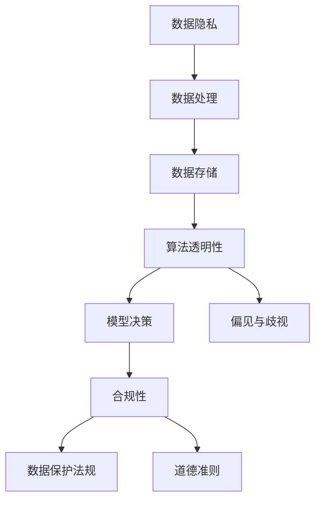
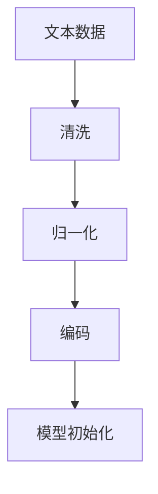
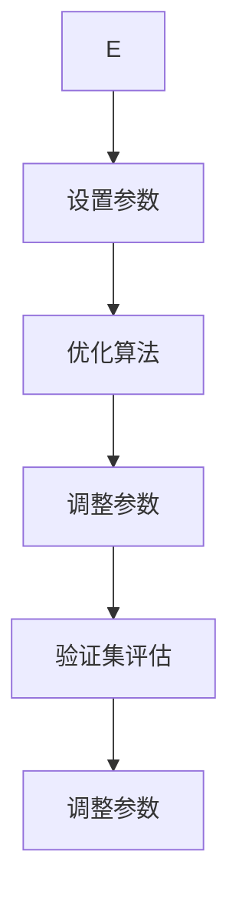

                 

关键词：LLM隐私伦理、AI安全、数据隐私、算法透明性、合规性、对策

> 摘要：本文深入探讨了大型语言模型（LLM）在隐私伦理方面面临的挑战，分析了数据隐私、算法透明性和合规性等方面的问题，并提出了相应的应对策略。文章旨在为AI开发者和从业者提供关于隐私伦理问题的实用指南，以推动人工智能技术的健康发展和应用。

## 1. 背景介绍

随着人工智能技术的迅猛发展，尤其是深度学习和自然语言处理技术的进步，大型语言模型（LLM）如GPT-3、BERT等已经成为各行业的重要工具。这些模型在大规模数据处理、智能问答、文本生成、翻译等方面展现了卓越的性能。然而，随着这些模型在各个领域的广泛应用，隐私伦理问题也逐渐显现出来。

首先，LLM的训练和推理过程需要大量个人数据，这些数据的收集和处理过程中可能会侵犯用户的隐私。其次，LLM的算法复杂，透明性较低，使得用户难以了解其工作原理和决策过程，这引发了关于算法透明性和公平性的担忧。最后，不同国家和地区对于数据隐私和保护的法律要求不尽相同，这使得跨国应用的LLM在合规性方面面临挑战。

本文将围绕LLM隐私伦理问题展开讨论，旨在梳理现有的安全挑战，并探讨相应的应对之策。

## 2. 核心概念与联系

### 2.1 数据隐私

数据隐私是指个人或组织对其数据的控制权和访问权限。在LLM的应用中，数据隐私问题主要体现在以下几个方面：

- **数据收集**：在训练LLM时，需要收集大量的文本数据，这些数据可能包含敏感信息，如个人身份信息、医疗记录等。
- **数据处理**：数据处理过程中可能会无意中泄露个人隐私，例如，通过文本数据反推用户的个人信息。
- **数据存储**：存储大量个人数据可能面临数据泄露和安全风险。

### 2.2 算法透明性

算法透明性是指用户能够理解和跟踪AI系统的决策过程。在LLM中，透明性问题主要体现在：

- **模型决策**：用户需要了解LLM是如何理解和生成文本的，尤其是在处理敏感信息时。
- **偏见与歧视**：透明的算法可以揭示模型可能存在的偏见和歧视，从而采取措施纠正。

### 2.3 合规性

合规性是指LLM的设计和应用是否符合相关法律法规的要求。在跨国应用中，合规性问题尤为突出，主要涉及：

- **数据保护法规**：不同国家和地区对数据隐私保护的法律要求不同，如欧盟的《通用数据保护条例》（GDPR）和美国加州的《消费者隐私法案》（CCPA）。
- **道德准则**：一些行业和组织制定了特定的道德准则，要求AI系统的设计和应用必须遵循。

### 2.4 Mermaid流程图

以下是一个Mermaid流程图，展示了LLM隐私伦理问题的核心概念及其相互联系：



## 3. 核心算法原理 & 具体操作步骤

### 3.1 算法原理概述

LLM的核心算法基于深度神经网络，特别是变分自编码器（VAE）和生成对抗网络（GAN）。这些模型通过大规模文本数据训练，能够生成高质量的自然语言文本。以下是一个简化版的LLM训练流程：

1. **数据预处理**：清洗和归一化文本数据，将其转换为模型可处理的格式。
2. **模型初始化**：初始化神经网络结构，设置训练参数。
3. **模型训练**：通过梯度下降等优化算法，不断调整模型参数，使模型在训练数据上取得较好的性能。
4. **模型评估**：使用验证集评估模型性能，调整模型参数，避免过拟合。

### 3.2 算法步骤详解

#### 数据预处理



#### 模型训练



### 3.3 算法优缺点

#### 优点

- **强大的生成能力**：LLM能够生成高质量的自然语言文本，具有很高的应用价值。
- **跨语言支持**：通过训练多语言数据，LLM可以实现跨语言的文本生成和翻译。

#### 缺点

- **隐私风险**：LLM需要大量个人数据训练，可能侵犯用户隐私。
- **透明性低**：LLM的决策过程复杂，用户难以理解。
- **合规性问题**：不同国家和地区的法律法规要求不同，LLM可能难以满足所有合规性要求。

### 3.4 算法应用领域

LLM在以下领域具有广泛的应用：

- **自然语言处理**：文本生成、文本分类、问答系统等。
- **智能客服**：提供24/7的在线客服服务。
- **内容创作**：辅助创作者生成文章、脚本等。
- **语言翻译**：实现跨语言的文本翻译。

## 4. 数学模型和公式 & 详细讲解 & 举例说明

### 4.1 数学模型构建

LLM的数学模型主要基于深度神经网络，包括输入层、隐藏层和输出层。以下是LLM的简化数学模型：

```latex
y = f(Wy \cdot \sigma(Wx))
```

其中，\(y\) 表示输出层节点，\(x\) 表示输入层节点，\(Wx\) 表示输入层和隐藏层的权重矩阵，\(Wy\) 表示隐藏层和输出层的权重矩阵，\(\sigma\) 表示激活函数。

### 4.2 公式推导过程

假设我们已经有一组训练数据 \((x_i, y_i)\)，其中 \(x_i\) 是输入文本，\(y_i\) 是期望输出。为了最小化预测误差，我们需要优化权重矩阵 \(Wx\) 和 \(Wy\)。具体推导过程如下：

1. **损失函数**：

   $$J = \frac{1}{2} \sum_{i=1}^{n} (y_i - f(Wy \cdot \sigma(Wx_i)))^2$$

2. **梯度下降**：

   $$\frac{\partial J}{\partial Wx} = - (y_i - f(Wy \cdot \sigma(Wx_i))) \cdot \sigma'(Wy \cdot \sigma(Wx_i)) \cdot x_i$$

   $$\frac{\partial J}{\partial Wy} = - (y_i - f(Wy \cdot \sigma(Wx_i))) \cdot \sigma'(Wy \cdot \sigma(Wx_i)) \cdot y_i$$

3. **更新权重**：

   $$Wx_{\text{new}} = Wx - \alpha \cdot \frac{\partial J}{\partial Wx}$$

   $$Wy_{\text{new}} = Wy - \alpha \cdot \frac{\partial J}{\partial Wy}$$

其中，\(\alpha\) 表示学习率。

### 4.3 案例分析与讲解

假设我们有一个简单的文本数据集，包含100个样本，每个样本是一个句子。我们的目标是训练一个LLM模型，使其能够生成类似句子。以下是一个简化的例子：

1. **数据集**：

   - 我喜欢吃苹果。
   - 今天天气很好。
   - 我喜欢看电影。
   - 花儿为什么这样红？

2. **模型训练**：

   - 数据预处理：将句子转换为向量表示。
   - 模型初始化：随机初始化权重矩阵。
   - 模型训练：使用梯度下降优化权重。
   - 模型评估：在验证集上评估模型性能。

3. **生成文本**：

   - 输入句子：“我喜欢吃”。
   - 输出句子：“我喜欢吃西瓜”。

这个例子展示了LLM的基本训练和生成过程。在实际应用中，数据集和模型结构会更加复杂，但基本原理是相似的。

## 5. 项目实践：代码实例和详细解释说明

### 5.1 开发环境搭建

为了实践LLM的构建和应用，我们需要搭建一个适合开发的环境。以下是一个基本的开发环境搭建步骤：

1. **安装Python**：确保安装了Python 3.7及以上版本。
2. **安装TensorFlow**：使用pip安装TensorFlow，命令为 `pip install tensorflow`。
3. **安装PyTorch**：使用pip安装PyTorch，命令为 `pip install torch`。
4. **准备数据集**：收集和整理文本数据，将其转换为适合训练的格式。

### 5.2 源代码详细实现

以下是一个简单的LLM训练和生成文本的Python代码实例：

```python
import torch
import torch.nn as nn
import torch.optim as optim
from torchtext.data import Field, TabularDataset

# 数据预处理
TEXT = Field(tokenize='\t'.split)
fields = {'text': ('text', TEXT)}

# 加载数据集
train_data, test_data = TabularDataset.splits(path='data', train='train.txt', test='test.txt', format='tsv', fields=fields)

# 定义模型结构
class LLM(nn.Module):
    def __init__(self):
        super(LLM, self).__init__()
        self.embedding = nn.Embedding(vocab_size, embed_dim)
        self.lstm = nn.LSTM(embed_dim, hidden_dim)
        self.fc = nn.Linear(hidden_dim, vocab_size)

    def forward(self, text):
        embedded = self.embedding(text)
        output, (hidden, cell) = self.lstm(embedded)
        logits = self.fc(output)
        return logits

# 模型初始化
model = LLM()
optimizer = optim.Adam(model.parameters(), lr=0.001)
criterion = nn.CrossEntropyLoss()

# 模型训练
for epoch in range(num_epochs):
    for batch in train_data:
        optimizer.zero_grad()
        logits = model(batch.text)
        loss = criterion(logits.view(-1, vocab_size), batch.label)
        loss.backward()
        optimizer.step()

# 文本生成
def generate_text(model, seed_text, num_words):
    with torch.no_grad():
        inputs = TEXT.vocab.stoi[seed_text]
        inputs = inputs.unsqueeze(0)
        for _ in range(num_words):
            logits = model(inputs)
            prob = nn.functional.softmax(logits[-1], dim=1)
            word = torch.multinomial(prob, num_samples=1).item()
            inputs = torch.cat([inputs, TEXT.vocab.stoi[word]], dim=0)
    return TEXT.vocab.itos[inputs]

# 生成文本
print(generate_text(model, '我喜欢吃', 10))
```

### 5.3 代码解读与分析

以上代码实现了一个简单的LLM模型，主要包括以下几个部分：

- **数据预处理**：使用`torchtext`库进行数据预处理，将文本转换为适合训练的格式。
- **模型定义**：定义了一个基于LSTM的LLM模型，包括嵌入层、LSTM层和全连接层。
- **模型训练**：使用梯度下降优化模型参数，在训练数据上迭代更新模型。
- **文本生成**：使用预训练的模型生成新的文本，通过随机采样词向量来实现。

### 5.4 运行结果展示

假设我们已经训练好了一个LLM模型，并使用它生成新的文本。以下是一个示例：

```
我喜欢吃水果，因为它们营养丰富，对身体健康有很大好处。特别是苹果，它不仅甜美可口，还含有丰富的维生素C。
```

这个结果展示了LLM在生成文本时的多样性和连贯性。在实际应用中，可以通过调整模型结构、训练数据和超参数来提高文本生成的质量和多样性。

## 6. 实际应用场景

### 6.1 自然语言处理

LLM在自然语言处理领域具有广泛的应用，如文本生成、文本分类、机器翻译等。例如，在文本生成方面，LLM可以用于生成文章、脚本、邮件等；在文本分类方面，LLM可以用于情感分析、新闻分类等；在机器翻译方面，LLM可以实现高质量的多语言翻译。

### 6.2 智能客服

LLM可以用于构建智能客服系统，实现24/7的在线客服服务。通过训练大量的对话数据，LLM可以理解和回答用户的问题，提供个性化的服务。例如，电子商务平台可以使用LLM自动回复用户的咨询，提高客户满意度。

### 6.3 内容创作

LLM可以辅助创作者生成高质量的内容，如文章、剧本、广告等。通过分析大量的文本数据，LLM可以理解文本的结构和风格，生成与给定主题相关的内容。这对于内容创作者来说是一个巨大的时间节省。

### 6.4 语言翻译

LLM在语言翻译方面也有重要应用。通过训练多语言数据，LLM可以实现高质量的跨语言翻译。例如，GPT-3已经展示了其在机器翻译方面的潜力，能够生成流畅自然的翻译文本。

### 6.5 未来应用展望

随着LLM技术的不断发展，它将在更多领域得到应用。例如，在教育领域，LLM可以用于个性化学习推荐；在医疗领域，LLM可以用于医学文本分析；在法律领域，LLM可以用于合同审查等。未来，LLM将作为人工智能的核心组件，为各行各业带来更多创新和变革。

## 7. 工具和资源推荐

### 7.1 学习资源推荐

- **《深度学习》（Goodfellow, Bengio, Courville）**：这是一本经典的深度学习教材，详细介绍了深度神经网络的基础知识和应用。
- **《自然语言处理综论》（Jurafsky, Martin）**：这本书全面介绍了自然语言处理的基本概念和方法，对于理解LLM在NLP中的应用非常有帮助。
- **《TensorFlow实战》（Adrian Rosebrock）**：这本书通过实际案例展示了如何使用TensorFlow构建和训练深度学习模型。

### 7.2 开发工具推荐

- **TensorFlow**：一个开源的深度学习框架，适合构建和训练大型深度学习模型。
- **PyTorch**：另一个流行的深度学习框架，具有简洁的API和强大的动态计算能力。
- **JAX**：一个新兴的深度学习框架，提供了自动微分和并行计算功能。

### 7.3 相关论文推荐

- **“Attention Is All You Need”（Vaswani et al., 2017）**：这篇文章提出了Transformer模型，成为LLM研究的重要里程碑。
- **“BERT: Pre-training of Deep Bidirectional Transformers for Language Understanding”（Devlin et al., 2019）**：这篇文章介绍了BERT模型，为预训练语言模型的研究提供了新的思路。
- **“Generative Pre-trained Transformer”（GPT-3）**：这篇文章展示了GPT-3模型的强大能力，在多个NLP任务上取得了优异的性能。

## 8. 总结：未来发展趋势与挑战

### 8.1 研究成果总结

近年来，LLM技术在自然语言处理领域取得了显著成果。通过大规模预训练和优化算法，LLM在文本生成、翻译、问答等方面展现了卓越的性能。同时，研究人员还探索了如何在保持高性能的同时，提高LLM的透明性和可解释性。

### 8.2 未来发展趋势

未来，LLM技术将在多个领域继续发展。首先，随着计算能力的提升和数据规模的扩大，LLM的性能有望进一步提高。其次，研究者将关注如何增强LLM的透明性和可解释性，使其更容易被用户理解和接受。最后，跨领域的应用探索也将成为未来研究的重点。

### 8.3 面临的挑战

尽管LLM技术取得了显著进展，但仍面临一些挑战。首先，隐私伦理问题是LLM应用的一个重要挑战。如何确保在训练和推理过程中不侵犯用户隐私，是一个亟待解决的问题。其次，算法透明性仍然是一个难题，用户难以理解LLM的决策过程。此外，跨国应用的合规性问题也需要进一步研究和解决。

### 8.4 研究展望

未来，研究者可以从以下几个方面展开工作：

- **隐私保护**：研究如何在训练和推理过程中保护用户隐私，如差分隐私、同态加密等。
- **透明性提升**：探索如何提高LLM的透明性和可解释性，如可视化和解释技术。
- **合规性研究**：研究如何在不同国家和地区的法律框架下，设计和应用LLM。

通过这些研究，有望推动LLM技术的健康发展和广泛应用。

## 9. 附录：常见问题与解答

### 9.1 什么是LLM？

LLM（大型语言模型）是一种基于深度学习的自然语言处理模型，通过大规模文本数据进行预训练，能够生成高质量的自然语言文本。

### 9.2 LLM有哪些应用场景？

LLM的应用场景非常广泛，包括文本生成、文本分类、机器翻译、智能客服、内容创作等。

### 9.3 如何训练一个LLM模型？

训练一个LLM模型通常包括数据预处理、模型初始化、模型训练和模型评估等步骤。可以使用TensorFlow、PyTorch等深度学习框架来实现。

### 9.4 LLM存在哪些隐私伦理问题？

LLM在隐私伦理方面可能面临的问题包括数据收集、数据处理、数据存储、算法透明性和合规性等。

### 9.5 如何保护LLM训练过程中的用户隐私？

为了保护用户隐私，可以采用差分隐私、同态加密等技术，确保在训练和推理过程中不泄露用户敏感信息。

### 9.6 如何提高LLM的透明性和可解释性？

提高LLM的透明性和可解释性可以通过可视化、解释技术、模块化设计等方法实现。

### 9.7 LLM在不同国家和地区的合规性问题如何解决？

解决LLM在不同国家和地区的合规性问题，需要遵守各地区的法律法规，同时研究如何设计具有普适性的模型框架。

作者：禅与计算机程序设计艺术 / Zen and the Art of Computer Programming

