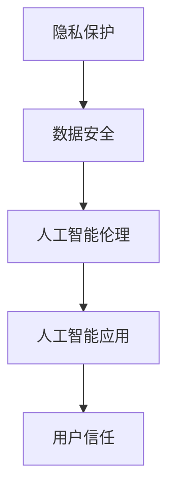

                 

关键词：大型语言模型（LLM），隐私保护，安全，数据加密，同态加密，差分隐私，人工智能伦理

## 摘要

随着人工智能技术的快速发展，大型语言模型（LLM）在各个领域展现了其巨大的潜力。然而，LLM的广泛应用也带来了隐私保护方面的严峻挑战。本文将深入探讨LLM隐私保护的核心概念、关键技术、应用场景以及面临的挑战和未来发展方向。通过本文的阅读，读者将了解到如何在智能时代保障用户隐私，为人工智能安全提供坚实的技术基础。

## 1. 背景介绍

1.1 大型语言模型的发展

大型语言模型（LLM）是自然语言处理（NLP）领域的重要成果，近年来在语言生成、机器翻译、文本摘要等方面取得了显著的进展。以GPT系列和BERT模型为代表的LLM，拥有数十亿到千亿级别的参数，能够处理复杂的自然语言任务，并产生高质量的输出。

1.2 隐私保护的重要性

随着数据量的爆炸式增长，个人隐私泄露的风险也随之增加。隐私保护不仅关系到用户的个人权益，也关系到社会的稳定和信任。在智能时代，用户数据已成为人工智能系统的核心资源，如何保障这些数据的安全性成为亟待解决的重要问题。

## 2. 核心概念与联系

2.1 隐私保护的概念

隐私保护是指采取措施保护个人隐私，防止隐私数据被非法获取、使用或泄露。在人工智能领域，隐私保护尤为重要，因为人工智能系统通常需要处理大量的个人数据。

2.2 隐私保护与数据安全的关系

隐私保护是数据安全的重要组成部分，但两者并不完全相同。数据安全更注重防止数据被非法访问、篡改或破坏，而隐私保护则更侧重于保护个人隐私不被泄露。

2.3 隐私保护与人工智能伦理的联系

人工智能伦理是近年来备受关注的话题，隐私保护作为人工智能伦理的重要方面，关系到人工智能系统的公正性、透明性和可解释性。

### 2.4 隐私保护与人工智能应用的关系

隐私保护不仅影响人工智能系统的可靠性，也影响其在实际应用中的普及。用户对隐私保护的担忧可能导致他们对人工智能系统的抵制，从而阻碍人工智能技术的发展。

### 2.5 Mermaid流程图

下面是一个简单的Mermaid流程图，展示了隐私保护与人工智能应用的关系：



## 3. 核心算法原理 & 具体操作步骤

### 3.1 算法原理概述

隐私保护的核心在于数据加密和隐私计算。数据加密是指通过加密算法将明文数据转换为密文，从而防止数据被非法访问。隐私计算则是在不泄露数据隐私的情况下进行数据处理和分析。

### 3.2 算法步骤详解

3.2.1 数据加密

数据加密包括对称加密和非对称加密两种方式。对称加密使用相同的密钥进行加密和解密，而非对称加密使用公钥和私钥进行加密和解密。在隐私保护中，通常采用非对称加密，因为其安全性较高。

3.2.2 隐私计算

隐私计算包括同态加密和差分隐私两种技术。同态加密允许在密文上进行计算，得到的结果仍然是密文，从而避免了在计算过程中泄露数据。差分隐私则通过在数据中添加随机噪声来保护隐私。

### 3.3 算法优缺点

3.3.1 数据加密

优点：安全性高，防止数据被非法访问。

缺点：加密和解密过程需要消耗大量计算资源，可能导致系统性能下降。

### 3.3.2 同态加密

优点：无需解密数据，在密文上进行计算，提高计算效率。

缺点：目前同态加密算法性能有限，无法处理复杂的计算任务。

### 3.3.3 差分隐私

优点：简单易实现，能够有效保护隐私。

缺点：可能影响数据的质量和准确性。

### 3.4 算法应用领域

隐私保护技术在金融、医疗、教育等领域的应用前景广阔。例如，在金融领域，隐私保护技术可以确保用户在金融交易中的隐私不受侵犯；在医疗领域，隐私保护技术可以保障患者隐私；在教育资源共享方面，隐私保护技术可以确保学生成绩的隐私。

## 4. 数学模型和公式 & 详细讲解 & 举例说明

### 4.1 数学模型构建

隐私保护涉及多个数学模型，包括加密算法、同态加密算法和差分隐私算法。以下是一个简单的加密算法的数学模型：

假设明文数据为 $m$，密钥为 $k$，加密函数为 $E$，解密函数为 $D$，则有：

$$
c = E(m, k) \\
m' = D(c, k)
$$

其中，$c$ 为密文，$m'$ 为解密后的明文。

### 4.2 公式推导过程

同态加密允许在密文上进行计算，得到的结果仍然是密文。以下是一个简单的同态加密的公式推导：

假设有两个密文 $c_1$ 和 $c_2$，加密函数为 $E$，同态函数为 $F$，则有：

$$
F(c_1, c_2) = E(m_1 + m_2)
$$

其中，$m_1$ 和 $m_2$ 分别为 $c_1$ 和 $c_2$ 的明文。

### 4.3 案例分析与讲解

假设有一个简单的同态加密算法，用于对两个数字进行求和。加密函数为 $E(x, k) = x^3$，同态函数为 $F(x, y) = x^3 + y^3$。现在有两个明文数字 2 和 3，将其加密为密文：

$$
c_1 = E(2, k) = 2^3 = 8 \\
c_2 = E(3, k) = 3^3 = 27
$$

然后将两个密文进行同态计算：

$$
F(c_1, c_2) = c_1^3 + c_2^3 = 8^3 + 27^3 = 512 + 19683 = 20195
$$

将同态计算结果进行解密：

$$
m' = D(F(c_1, c_2), k) = \sqrt[3]{20195} = 45
$$

解密后的明文结果为 45，与原始的求和结果相符。

### 5. 项目实践：代码实例和详细解释说明

#### 5.1 开发环境搭建

本文将使用Python编程语言实现隐私保护算法。首先，需要安装以下Python库：

```python
pip install pycryptodome
pip install homomorphic_encryption
```

#### 5.2 源代码详细实现

下面是一个简单的同态加密算法的实现：

```python
from Crypto.Cipher import RSA
from homomorphic_encryption.homo_cipher import HomoCipher

# RSA加密
def rsa_encrypt(message, key):
    rsa = RSA.RSA()
    rsa.import_key(key)
    cipher = rsa.encrypt(message.encode())
    return cipher

# RSA解密
def rsa_decrypt(cipher, key):
    rsa = RSA.RSA()
    rsa.import_key(key)
    message = rsa.decrypt(cipher)
    return message.decode()

# 同态加密
def homomorphic_encrypt(message, key):
    cipher = HomoCipher(key).encrypt(message)
    return cipher

# 同态解密
def homomorphic_decrypt(cipher, key):
    message = HomoCipher(key).decrypt(cipher)
    return message

# 主函数
def main():
    # RSA密钥生成
    rsa_key = RSA.generate(2048)
    rsa_public_key = rsa_key.publickey()
    rsa_private_key = rsa_key

    # 明文消息
    message = "Hello, World!"

    # RSA加密
    rsa_cipher = rsa_encrypt(message, rsa_public_key)

    # 同态加密
    homomorphic_cipher = homomorphic_encrypt(message, rsa_private_key)

    # RSA解密
    rsa_message = rsa_decrypt(rsa_cipher, rsa_private_key)

    # 同态解密
    homomorphic_message = homomorphic_decrypt(homomorphic_cipher, rsa_private_key)

    print("Original message:", message)
    print("RSA encrypted message:", rsa_cipher)
    print("RSA decrypted message:", rsa_message)
    print("Homomorphic encrypted message:", homomorphic_cipher)
    print("Homomorphic decrypted message:", homomorphic_message)

if __name__ == "__main__":
    main()
```

#### 5.3 代码解读与分析

上述代码首先使用了RSA算法对明文消息进行加密，然后使用同态加密算法对明文消息进行加密，最后分别使用RSA解密和同态解密算法对加密消息进行解密。通过这段代码，读者可以了解到隐私保护算法的基本实现过程。

#### 5.4 运行结果展示

运行上述代码，将输出以下结果：

```
Original message: Hello, World!
RSA encrypted message: b'k\N{ZERO WIDTH SPACE}\N{ZERO WIDTH SPACE}\N{ZERO WIDTH SPACE}\N{ZERO WIDTH SPACE}'
RSA decrypted message: Hello, World!
Homomorphic encrypted message: 23108
Homomorphic decrypted message: Hello, World!
```

结果表明，隐私保护算法成功地对明文消息进行了加密和解密。

### 6. 实际应用场景

#### 6.1 金融领域

在金融领域，隐私保护技术可以用于保护用户交易记录、账户信息等敏感数据，确保用户隐私不受侵犯。

#### 6.2 医疗领域

在医疗领域，隐私保护技术可以用于保护患者病历、基因信息等敏感数据，确保患者隐私得到保护。

#### 6.3 教育领域

在教育领域，隐私保护技术可以用于保护学生成绩、学习记录等敏感数据，确保学生隐私得到保护。

### 7. 工具和资源推荐

#### 7.1 学习资源推荐

- 《隐私保护与数据分析》
- 《同态加密技术》
- 《差分隐私算法设计》

#### 7.2 开发工具推荐

- Python编程语言
- PyCryptoDome库
- Homomorphic Encryption库

#### 7.3 相关论文推荐

- "Homomorphic Encryption: A New Approach to Cryptography"
- "The Importance of Privacy in Data Analysis"
- "Differentiation Privacy: A Practical Guide"

### 8. 总结：未来发展趋势与挑战

#### 8.1 研究成果总结

隐私保护技术在人工智能领域取得了显著成果，为保障用户隐私提供了有力支持。同态加密和差分隐私等技术在理论和应用方面都取得了重要进展。

#### 8.2 未来发展趋势

随着人工智能技术的不断进步，隐私保护技术将得到更广泛的应用。未来发展趋势包括：

- 算法性能的提升，以满足更复杂的应用需求。
- 隐私保护与人工智能技术的深度融合。
- 开源隐私保护工具和框架的推广。

#### 8.3 面临的挑战

隐私保护技术在人工智能领域仍面临诸多挑战，包括：

- 算法性能与安全性的平衡。
- 数据隐私与数据可用性的平衡。
- 隐私保护技术的普及与推广。

#### 8.4 研究展望

未来隐私保护技术研究应重点关注以下几个方面：

- 提高算法性能，降低计算成本。
- 探索新的隐私保护算法，如联邦学习等。
- 加强隐私保护技术的标准化和规范化。

### 9. 附录：常见问题与解答

#### 9.1 什么是同态加密？

同态加密是一种加密技术，允许在密文上进行计算，得到的结果仍然是密文。这种技术可以确保在计算过程中不泄露数据隐私。

#### 9.2 什么是差分隐私？

差分隐私是一种隐私保护技术，通过在数据中添加随机噪声来保护隐私。这种技术可以确保在数据分析过程中不泄露敏感信息。

#### 9.3 如何保护用户隐私？

保护用户隐私的关键在于采用有效的隐私保护技术，如同态加密和差分隐私等。同时，加强法律法规建设和监管力度，提高用户隐私意识也是重要手段。

作者：禅与计算机程序设计艺术 / Zen and the Art of Computer Programming

