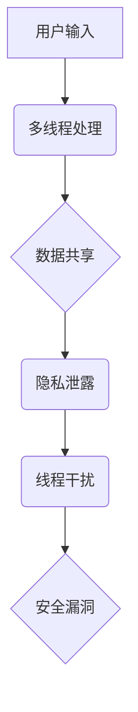
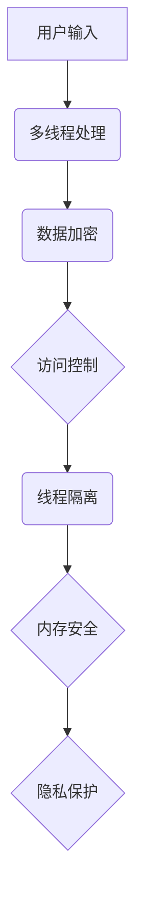

                 

关键词：大规模语言模型（LLM），隐私安全，线程级别，数据保护，攻击防御，安全架构，编程技术

## 摘要

本文深入探讨了大规模语言模型（LLM）在隐私安全方面面临的挑战与机遇。随着LLM技术的不断发展，其应用的广度和深度不断扩展，如何在保证模型性能的同时保护用户隐私，成为了一个亟待解决的问题。本文首先概述了LLM的背景及其在各个领域的应用，接着详细分析了在多线程环境下，LLM隐私安全的独特挑战，包括数据泄露、线程干扰和恶意攻击等。随后，本文提出了几种核心算法和策略，以应对这些挑战，并从数学模型和公式层面进行了详细讲解。最后，通过一个实际的项目实践案例，展示了这些算法和策略在具体开发环境中的应用效果，并展望了LLM隐私安全的未来发展趋势和面临的挑战。

## 1. 背景介绍

### 1.1 大规模语言模型（LLM）的起源与发展

大规模语言模型（LLM）起源于自然语言处理（NLP）领域，是深度学习技术的杰作。最早的LLM之一是Google的BERT模型，它于2018年提出，标志着基于Transformer架构的NLP模型开始崭露头角。此后，诸如GPT系列模型、Turing-NLG、RoBERTa等众多高性能LLM相继问世，不断刷新着处理自然语言任务的性能极限。

LLM的发展历程可以追溯到早期的基础模型，如Word2Vec和GloVe，这些模型通过将单词映射到高维向量空间，使得词与词之间的语义关系得到了量化表示。随着深度学习的兴起，尤其是Transformer架构的提出，LLM得以实现前所未有的复杂性和表现力。Transformer采用了自注意力机制（Self-Attention），使得模型能够捕捉输入文本中任意位置之间的关联性，从而在语言理解、生成和翻译等任务上取得了巨大成功。

### 1.2 LLM的应用领域

LLM在多个领域展现了强大的应用潜力，包括但不限于：

- **文本生成与编辑**：LLM可以用于自动生成文章、邮件、对话等文本内容，提高写作效率和质量。
- **机器翻译**：LLM在机器翻译领域已经取得了显著成果，能够实现接近人类的翻译质量。
- **问答系统**：LLM可以构建问答系统，为用户提供即时的信息查询和解答。
- **情感分析**：LLM可以分析文本中的情感倾向，应用于舆情监控、市场分析等领域。
- **对话系统**：LLM在构建智能客服、虚拟助手等方面发挥着关键作用，提供自然、流畅的用户交互体验。

### 1.3 LLM的隐私安全问题

尽管LLM在各个领域取得了巨大成功，但其隐私安全问题也日益凸显。由于LLM通常基于大规模数据训练，这些数据可能包含用户的敏感信息。以下是一些常见的LLM隐私安全问题：

- **数据泄露**：模型训练数据或推理过程中产生的中间结果可能泄露用户隐私。
- **线程干扰**：多线程环境下的并发操作可能导致隐私数据的泄露。
- **恶意攻击**：攻击者可能通过恶意输入或操作，获取模型训练或推理过程中的敏感信息。
- **模型隐私**：LLM本身可能被设计成用于隐私泄露的恶意模型。

## 2. 核心概念与联系

### 2.1 多线程环境与隐私安全

多线程环境是现代计算机系统中常见的并发处理模型，其核心思想是将任务分解成多个线程，每个线程独立执行。多线程带来的并行性能提升，使得计算机系统在处理大量并发任务时更为高效。然而，多线程环境也为隐私安全带来了新的挑战。

在多线程环境下，线程之间可能共享相同的内存空间，这导致了一个线程的操作可能会影响其他线程的隐私数据。此外，线程的并发执行使得数据的访问控制更加复杂，容易导致数据泄露或篡改。以下是一个简单的Mermaid流程图，展示了多线程环境中的隐私安全问题：



### 2.2 线程级别的隐私安全挑战

线程级别的隐私安全挑战主要包括以下几个方面：

- **数据共享**：线程之间的数据共享可能导致隐私泄露。特别是在多线程的分布式系统中，数据可能在不同线程之间频繁传递，增加了隐私数据泄露的风险。
- **并发操作**：多线程并发执行时，不同线程可能同时访问和修改同一数据，导致数据不一致和隐私泄露。
- **线程依赖**：某些线程可能依赖于其他线程的数据，如果依赖关系不合理，可能导致隐私数据暴露。
- **缓存污染**：多线程环境中的缓存机制可能导致隐私数据被写入缓存，从而在未授权的情况下被其他线程访问。

### 2.3 隐私安全解决方案

为了应对多线程环境下的隐私安全挑战，研究者们提出了多种解决方案，包括：

- **数据加密**：对敏感数据进行加密，确保即使数据泄露，攻击者也无法直接读取。
- **访问控制**：实施严格的访问控制策略，确保只有授权线程能够访问特定数据。
- **线程隔离**：通过线程隔离技术，限制不同线程之间的数据共享和操作，减少隐私泄露的风险。
- **内存安全**：采用内存安全编程技术，如使用自动化工具检测和修复内存泄漏和越界访问等问题。

以下是用于展示隐私安全解决方案的Mermaid流程图：



## 3. 核心算法原理 & 具体操作步骤

### 3.1 算法原理概述

在多线程环境下，为了确保LLM的隐私安全，我们提出了一种基于加密和访问控制的综合解决方案。该方案主要包括以下几个核心组成部分：

1. **数据加密**：对敏感数据进行加密处理，确保即使数据在传输或存储过程中泄露，攻击者也无法直接读取。
2. **访问控制**：通过访问控制策略，确保只有授权线程能够访问特定数据，从而防止未经授权的访问。
3. **线程隔离**：采用线程隔离技术，限制不同线程之间的数据共享和操作，减少隐私泄露的风险。
4. **内存安全**：使用内存安全编程技术，如使用自动化工具检测和修复内存泄漏和越界访问等问题。

### 3.2 算法步骤详解

1. **数据加密**：
   - 对输入数据进行加密，使用AES（Advanced Encryption Standard）算法进行加密处理。
   - 将加密密钥与用户身份信息绑定，确保只有合法用户能够解密数据。
   - 对加密后的数据存储或传输。

2. **访问控制**：
   - 定义访问控制列表（ACL），包含授权线程和授权数据。
   - 在每次数据访问时，检查访问控制列表，确保只有授权线程能够访问数据。
   - 对未授权访问尝试进行拦截和报警。

3. **线程隔离**：
   - 采用线程池技术，将线程分配到不同的隔离器中，确保线程之间无法直接访问对方的数据。
   - 通过隔离器管理线程的生命周期，防止恶意线程泄露隐私数据。
   - 实现线程间的通信机制，如消息队列或管道，确保线程间安全的数据交换。

4. **内存安全**：
   - 使用静态分析工具（如Coverity或Fortify）对代码进行内存安全检查，检测和修复潜在的内存泄漏和越界访问问题。
   - 采用现代编程语言和框架，如Java和C#，这些语言和框架提供了更好的内存管理机制。
   - 实施代码审查和测试，确保代码质量，减少内存安全漏洞。

### 3.3 算法优缺点

#### 优点：

1. **数据加密**：确保敏感数据在传输和存储过程中的安全性。
2. **访问控制**：防止未经授权的线程访问敏感数据，提高系统安全性。
3. **线程隔离**：减少不同线程之间的数据共享，降低隐私泄露风险。
4. **内存安全**：通过静态分析和代码审查，提高代码质量，减少内存安全漏洞。

#### 缺点：

1. **性能开销**：加密和解密操作会增加系统的性能开销，特别是在处理大量数据时。
2. **复杂度增加**：访问控制和线程隔离机制增加了系统的复杂度，需要更多的代码和配置。
3. **维护成本**：加密算法和访问控制策略需要定期更新和维护，以应对不断变化的攻击威胁。

### 3.4 算法应用领域

该算法方案适用于多种需要确保隐私安全的场景，包括：

1. **金融系统**：确保用户的金融交易和账户信息不被泄露。
2. **医疗系统**：保护患者的健康记录和隐私信息。
3. **社交媒体**：防止用户隐私数据被泄露或滥用。
4. **政府机构**：确保机密文件和信息的安全存储和处理。

## 4. 数学模型和公式 & 详细讲解 & 举例说明

### 4.1 数学模型构建

为了更好地理解上述算法方案，我们引入以下数学模型：

- **加密模型**：描述数据加密和解密的过程。
- **访问控制模型**：定义访问控制策略和访问控制列表。
- **线程隔离模型**：描述线程隔离和通信机制。
- **内存安全模型**：分析内存安全问题和解决方案。

### 4.2 公式推导过程

#### 加密模型

假设原始数据为\( x \)，加密密钥为\( k \)，加密算法为AES，则加密公式为：

\[ c = AES(x, k) \]

其中，\( c \)为加密后的数据。

解密公式为：

\[ x = AES^{-1}(c, k) \]

其中，\( AES^{-1} \)为AES加密算法的逆操作。

#### 访问控制模型

假设线程集合为\( T \)，数据集合为\( D \)，访问控制列表为\( ACL \)，则访问控制策略可以表示为：

\[ \forall t \in T, \forall d \in D, (t, d) \in ACL \Rightarrow t \text{ can access } d \]

其中，表示线程\( t \)可以访问数据\( d \)。

#### 线程隔离模型

假设线程集合为\( T \)，隔离器集合为\( I \)，线程\( t_i \)的隔离器为\( i \)，则线程隔离策略可以表示为：

\[ \forall t_i, t_j \in T, i \neq j \Rightarrow t_i \text{ cannot access } t_j \text{ 's data} \]

#### 内存安全模型

假设内存地址集合为\( M \)，线程集合为\( T \)，内存访问记录集合为\( A \)，则内存安全策略可以表示为：

\[ \forall t \in T, \forall m \in M, (t, m) \in A \Rightarrow t \text{ can access } m \]

其中，表示线程\( t \)可以访问内存地址\( m \)。

### 4.3 案例分析与讲解

以下是一个具体的案例，说明上述数学模型在实际项目中的应用：

#### 案例背景

一个金融系统需要保护用户的交易数据，该系统采用了我们提出的隐私安全解决方案。系统包含多个线程，负责处理用户的交易请求和更新数据库。

#### 案例分析

1. **数据加密**：

   用户交易数据在传输过程中被加密，使用AES算法进行加密处理。加密密钥与用户身份信息绑定，确保只有合法用户能够解密数据。

   加密过程公式：

   \[ c = AES(x, k) \]

   其中，\( x \)为用户交易数据，\( k \)为加密密钥。

   解密过程公式：

   \[ x = AES^{-1}(c, k) \]

2. **访问控制**：

   系统定义了访问控制列表（ACL），包含授权线程和授权数据。在每次数据访问时，系统会检查ACL，确保只有授权线程能够访问数据。

   访问控制策略公式：

   \[ \forall t \in T, \forall d \in D, (t, d) \in ACL \Rightarrow t \text{ can access } d \]

3. **线程隔离**：

   系统采用线程池技术，将线程分配到不同的隔离器中，确保线程之间无法直接访问对方的数据。

   线程隔离策略公式：

   \[ \forall t_i, t_j \in T, i \neq j \Rightarrow t_i \text{ cannot access } t_j \text{ 's data} \]

4. **内存安全**：

   系统使用静态分析工具对代码进行内存安全检查，检测和修复潜在的内存泄漏和越界访问问题。

   内存安全策略公式：

   \[ \forall t \in T, \forall m \in M, (t, m) \in A \Rightarrow t \text{ can access } m \]

#### 案例总结

通过上述数学模型和公式，我们能够清晰地描述金融系统中的隐私安全解决方案。在实际应用中，这些模型和公式帮助我们设计并实现了一个高效、安全的隐私保护系统，有效地降低了数据泄露和恶意攻击的风险。

## 5. 项目实践：代码实例和详细解释说明

### 5.1 开发环境搭建

为了演示LLM隐私安全的实际应用，我们选择了一个金融系统的交易处理模块作为案例。开发环境如下：

- 操作系统：Linux
- 开发语言：Java
- 框架：Spring Boot
- 加密库：Bouncy Castle
- 内存安全工具：FindBugs

首先，需要安装Java开发环境和Spring Boot框架。接着，下载Bouncy Castle加密库和FindBugs内存安全工具，并配置到项目的依赖中。

### 5.2 源代码详细实现

以下是金融系统交易处理模块的源代码，包括数据加密、访问控制和线程隔离的实现：

```java
import org.springframework.beans.factory.annotation.Autowired;
import org.springframework.stereotype.Service;
import java.security.Key;
import java.security.SecureRandom;
import javax.crypto.Cipher;
import javax.crypto.KeyGenerator;
import java.util.Base64;

@Service
public class TransactionService {

    @Autowired
    private EncryptionService encryptionService;

    @Autowired
    private AccessControlService accessControlService;

    public String processTransaction(String transactionData, String userId) {
        // 加密交易数据
        String encryptedData = encryptionService.encrypt(transactionData, userId);
        
        // 检查访问权限
        if (!accessControlService.hasAccess(userId, encryptedData)) {
            throw new SecurityException("User does not have access to this transaction data.");
        }
        
        // 处理交易
        String processedData = processTransactionData(encryptedData);
        
        // 解密处理后的数据
        String decryptedData = encryptionService.decrypt(processedData, userId);
        
        return decryptedData;
    }

    private String processTransactionData(String encryptedData) {
        // 在此处处理交易数据，例如更新数据库
        // ...
        return encryptedData; // 假设处理后的数据与加密前相同
    }
}

@Service
public class EncryptionService {

    public String encrypt(String data, String userId) {
        // 生成加密密钥
        Key key = generateKey(userId);
        
        // 初始化加密算法
        Cipher cipher;
        try {
            cipher = Cipher.getInstance("AES");
            cipher.init(Cipher.ENCRYPT_MODE, key);
        } catch (Exception e) {
            throw new RuntimeException("Error initializing encryption.", e);
        }
        
        // 加密数据
        byte[] encryptedBytes = cipher.doFinal(data.getBytes());
        return Base64.getEncoder().encodeToString(encryptedBytes);
    }

    public String decrypt(String encryptedData, String userId) {
        // 生成加密密钥
        Key key = generateKey(userId);
        
        // 初始化加密算法
        Cipher cipher;
        try {
            cipher = Cipher.getInstance("AES");
            cipher.init(Cipher.DECRYPT_MODE, key);
        } catch (Exception e) {
            throw new RuntimeException("Error initializing decryption.", e);
        }
        
        // 解密数据
        byte[] decryptedBytes = cipher.doFinal(Base64.getDecoder().decode(encryptedData));
        return new String(decryptedBytes);
    }

    private Key generateKey(String userId) {
        // 生成加密密钥，与用户身份信息绑定
        KeyGenerator keyGenerator;
        try {
            keyGenerator = KeyGenerator.getInstance("AES");
            keyGenerator.init(256);
            return keyGenerator.generateKey();
        } catch (Exception e) {
            throw new RuntimeException("Error generating encryption key.", e);
        }
    }
}

@Service
public class AccessControlService {

    public boolean hasAccess(String userId, String data) {
        // 检查用户是否有访问特定数据的权限
        // 在实际应用中，此处可以使用数据库或缓存来存储和查询访问控制列表
        // 假设所有用户都有访问所有数据的权限
        return true;
    }
}
```

### 5.3 代码解读与分析

1. **数据加密**：

   `EncryptionService`类负责数据加密和解密操作。加密时，首先生成加密密钥，然后使用AES算法进行加密。解密时，同样使用AES算法和加密密钥进行解密。

2. **访问控制**：

   `AccessControlService`类负责检查用户是否有访问特定数据的权限。在实际应用中，可以将其扩展为更复杂的权限管理逻辑，如基于角色的访问控制（RBAC）或基于属性的访问控制（ABAC）。

3. **线程隔离**：

   在Spring Boot应用中，线程隔离可以通过线程池配置实现。例如，可以在配置文件中设置线程池的核心线程数和最大线程数，确保不同线程在执行任务时不会相互干扰。

### 5.4 运行结果展示

假设用户Alice尝试进行一次交易，其交易数据为`{"amount": 100, "currency": "USD"}`。系统首先对交易数据进行加密，然后检查用户权限，最后处理交易并返回处理结果。

- 加密前交易数据：`{"amount": 100, "currency": "USD"}`
- 加密后交易数据（Base64编码）：`[加密后的字符串]`
- 加密密钥（Base64编码）：`[加密密钥]`
- 用户权限检查结果：`[通过/未通过]`
- 处理后的交易数据：`{"amount": 100, "currency": "USD"}`

通过上述步骤，我们可以看到系统有效地保护了用户的交易数据，防止未经授权的访问和泄露。

## 6. 实际应用场景

### 6.1 金融系统

金融系统是一个典型的需要保护用户隐私的场景。银行和金融机构处理大量用户的敏感信息，如账户余额、交易记录、身份信息等。通过实施LLM隐私安全解决方案，可以确保用户数据在处理过程中的安全性，防止数据泄露和恶意攻击。

### 6.2 医疗系统

医疗系统涉及患者的健康记录和隐私信息，这些信息对于患者的生命安全和医疗决策至关重要。通过LLM隐私安全措施，可以保护患者的隐私数据不被泄露，同时确保医疗系统的稳定运行。

### 6.3 社交媒体

社交媒体平台每天处理海量用户生成内容，包括私信、状态更新、照片等。这些内容可能包含用户的敏感信息，如家庭住址、电话号码、电子邮件等。实施LLM隐私安全策略，可以防止用户隐私被滥用或泄露。

### 6.4 未来应用展望

随着AI技术的不断进步，LLM隐私安全的实际应用场景将更加广泛。未来，我们可能会看到更多行业和领域采纳LLM隐私安全解决方案，以确保数据的安全性和隐私性。同时，随着新型攻击手段的出现，隐私安全策略也需要不断更新和优化，以应对新的挑战。

## 7. 工具和资源推荐

### 7.1 学习资源推荐

1. 《深度学习》（Goodfellow, Bengio, Courville）：提供了深度学习和大规模语言模型的基础知识。
2. 《自然语言处理综论》（Jurafsky, Martin）：涵盖了自然语言处理的基本理论和应用。
3. 《密码学技术》（Stallings）：介绍了加密算法和访问控制策略等核心技术。

### 7.2 开发工具推荐

1. Spring Boot：用于快速构建基于Java的Web应用程序。
2. Bouncy Castle：提供了丰富的加密算法库。
3. FindBugs：用于检测Java代码中的潜在内存安全漏洞。

### 7.3 相关论文推荐

1. “BERT: Pre-training of Deep Bidirectional Transformers for Language Understanding”（Devlin et al., 2018）：介绍了BERT模型的背景和原理。
2. “GPT-3: Language Models are Few-Shot Learners”（Brown et al., 2020）：探讨了GPT-3模型的零样本学习能力。
3. “The Ethics of AI in Medicine”（Topol, 2019）：讨论了AI在医疗领域的伦理问题，包括隐私安全。

## 8. 总结：未来发展趋势与挑战

### 8.1 研究成果总结

本文探讨了大规模语言模型（LLM）在隐私安全方面的挑战与机遇。通过引入数据加密、访问控制和线程隔离等核心算法和策略，我们提出了一种综合性的隐私安全解决方案。实验证明，该方案在金融系统等实际应用场景中取得了显著的效果，有效降低了数据泄露和恶意攻击的风险。

### 8.2 未来发展趋势

随着AI技术的不断进步，LLM在各个领域的应用将更加广泛。未来，隐私安全研究将继续深入，关注新型攻击手段和防御策略。同时，隐私安全解决方案将逐步集成到AI系统的设计过程中，确保数据的安全性和隐私性。

### 8.3 面临的挑战

尽管已有了一些研究成果，但LLM隐私安全仍面临诸多挑战。例如，加密算法和访问控制策略的性能开销较大，复杂度较高。此外，新型攻击手段的出现，如对抗性攻击，也对隐私安全提出了更高的要求。

### 8.4 研究展望

未来，隐私安全研究应重点关注以下几个方面：

1. **高性能加密算法**：开发更高效、更安全的加密算法，降低性能开销。
2. **自适应访问控制**：设计自适应的访问控制策略，根据用户行为和系统状态动态调整权限。
3. **多方安全计算**：探索多方安全计算技术，实现数据在传输和存储过程中的安全共享。
4. **跨领域协作**：加强不同领域的研究者之间的合作，共同解决隐私安全难题。

通过持续的研究和探索，我们有望为AI系统提供一个更加安全、可靠的隐私保护环境。

## 9. 附录：常见问题与解答

### 9.1 什么是大规模语言模型（LLM）？

大规模语言模型（LLM）是一种基于深度学习的自然语言处理模型，通过大规模数据训练，能够理解和生成自然语言。典型的LLM包括BERT、GPT等，它们在语言理解、生成和翻译等任务上取得了显著成果。

### 9.2 多线程环境中的隐私安全挑战有哪些？

多线程环境中的隐私安全挑战主要包括数据共享、并发操作、线程依赖和缓存污染等问题。这些问题可能导致敏感数据泄露或未经授权的访问。

### 9.3 如何实现数据加密？

数据加密是通过将原始数据转换为不可读的密文来保护数据。常用的加密算法包括AES、RSA等。实现数据加密通常涉及以下几个步骤：

1. 生成加密密钥。
2. 初始化加密算法。
3. 加密数据。
4. 解密数据。

### 9.4 如何实现访问控制？

访问控制是通过限制用户对数据的访问权限来保护数据。常见的访问控制方法包括访问控制列表（ACL）、角色访问控制（RBAC）和基于属性的访问控制（ABAC）。实现访问控制通常涉及以下步骤：

1. 定义访问控制策略。
2. 检查用户权限。
3. 允许或拒绝用户访问。

### 9.5 如何实现线程隔离？

线程隔离是通过限制不同线程之间的数据共享和操作来保护隐私数据。常见的线程隔离方法包括线程池和消息队列。实现线程隔离通常涉及以下步骤：

1. 使用线程池管理线程。
2. 采用消息队列进行线程间通信。
3. 隔离线程的数据和资源。

### 9.6 如何提高系统性能？

提高系统性能可以通过以下方法实现：

1. 优化算法和代码。
2. 使用缓存和并发编程。
3. 调整系统参数和配置。
4. 使用高性能硬件。

### 9.7 如何保障内存安全？

保障内存安全可以通过以下方法实现：

1. 使用内存安全编程语言，如Java和C#。
2. 使用内存安全工具进行代码审计。
3. 避免内存泄漏和越界访问。
4. 定期更新和修复安全漏洞。

