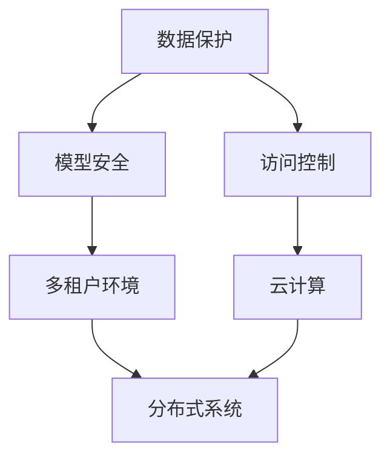

                 

关键词：大型语言模型（LLM），隐私安全，线程级别，挑战，机遇，数据保护，加密技术，安全协议，分布式系统，云计算，多租户环境，容器化技术，权限管理，安全审计，威胁模型，攻防策略。

## 摘要

本文将探讨大型语言模型（LLM）在隐私安全方面所面临的挑战与机遇。随着LLM在各个领域的广泛应用，其数据的安全性和隐私性越来越受到关注。本文将从线程级别的角度分析LLM隐私安全的现状，探讨目前存在的主要挑战，并提出一些解决方案和未来的发展方向。本文的核心内容包括：背景介绍、核心概念与联系、核心算法原理与具体操作步骤、数学模型和公式、项目实践、实际应用场景、工具和资源推荐以及未来发展趋势与挑战。

## 1. 背景介绍

近年来，人工智能（AI）技术取得了显著进展，特别是在自然语言处理（NLP）领域。大型语言模型（LLM）如GPT-3、BERT、T5等，凭借其强大的文本生成和语言理解能力，在许多领域都取得了突破性的成果。然而，随着LLM的广泛应用，其隐私安全问题也日益突出。

隐私安全是指保护个人或组织的数据和信息不被未经授权的访问、使用或泄露。在LLM中，隐私安全主要涉及到以下几个方面：

1. **数据保护**：确保输入数据和模型输出的安全，防止数据泄露或被篡改。
2. **模型安全**：保护模型本身不被篡改或破坏，确保模型的可靠性和稳定性。
3. **访问控制**：限制对模型的访问权限，确保只有授权用户可以访问和使用模型。

在多租户环境中，多个用户共享同一套LLM资源，如何确保每个用户的隐私和安全成为一个重要问题。此外，随着云计算和分布式系统的普及，LLM隐私安全的挑战也日益增加。因此，研究LLM隐私安全的线程级别挑战与机遇具有重要意义。

## 2. 核心概念与联系

在讨论LLM隐私安全之前，我们需要了解一些核心概念和它们之间的联系。以下是一个使用Mermaid绘制的流程图，展示了这些概念之间的交互关系：



### 2.1 数据保护

数据保护是指通过各种手段确保输入数据和模型输出的安全。在LLM中，数据保护主要涉及到以下方面：

- **加密技术**：使用加密算法对数据进行加密，确保数据在传输和存储过程中的安全性。
- **数据备份**：定期备份数据，以防止数据丢失或损坏。
- **访问控制**：限制对数据的访问权限，确保只有授权用户可以访问数据。

### 2.2 模型安全

模型安全是指确保模型本身不被篡改或破坏，从而保证模型的可靠性和稳定性。在LLM中，模型安全主要涉及到以下方面：

- **安全协议**：使用安全协议来保护模型通信的安全性，如SSL/TLS协议。
- **权限管理**：对模型访问权限进行严格管理，确保只有授权用户可以访问模型。
- **安全审计**：对模型的使用和访问进行审计，及时发现和解决潜在的安全问题。

### 2.3 访问控制

访问控制是指限制对系统的访问权限，确保只有授权用户可以访问和使用系统资源。在LLM中，访问控制主要涉及到以下方面：

- **身份认证**：验证用户身份，确保只有合法用户可以访问系统。
- **授权管理**：对用户的访问权限进行授权管理，确保用户只能访问其授权的资源。
- **日志记录**：记录用户的访问行为，以便进行审计和跟踪。

### 2.4 多租户环境

多租户环境是指多个用户共享同一套系统资源的环境。在LLM中，多租户环境主要涉及到以下方面：

- **资源隔离**：确保每个租户的资源和数据相互隔离，避免租户之间的干扰。
- **负载均衡**：合理分配系统资源，确保系统在高负载情况下仍然能够稳定运行。
- **安全策略**：制定安全策略，确保每个租户的隐私和安全。

### 2.5 云计算

云计算是指通过互联网提供计算资源、存储资源和网络资源的服务。在LLM中，云计算主要涉及到以下方面：

- **数据安全**：确保数据在云环境中的安全性，防止数据泄露或被篡改。
- **资源管理**：合理分配和管理云资源，确保系统的高效运行。
- **弹性和可扩展性**：确保系统在负载变化时能够快速响应，提供稳定的性能。

### 2.6 分布式系统

分布式系统是指由多个计算机节点组成的系统，这些节点通过网络进行通信和协作。在LLM中，分布式系统主要涉及到以下方面：

- **数据一致性**：确保数据在不同节点之间的一致性，防止数据丢失或重复。
- **容错性**：确保系统在节点故障时能够快速恢复，提供持续的服务。
- **性能优化**：优化系统的性能，确保系统的响应速度和吞吐量。

## 3. 核心算法原理 & 具体操作步骤

在讨论LLM隐私安全的线程级别挑战与机遇时，我们需要了解一些核心算法原理和具体操作步骤。以下是一个简单的算法原理概述和操作步骤：

### 3.1 算法原理概述

- **加密算法**：使用加密算法对数据进行加密，确保数据在传输和存储过程中的安全性。
- **身份认证算法**：使用身份认证算法验证用户身份，确保只有合法用户可以访问系统。
- **访问控制算法**：使用访问控制算法对用户的访问权限进行管理，确保用户只能访问其授权的资源。

### 3.2 算法步骤详解

1. **数据加密**：使用加密算法对输入数据和模型输出进行加密，确保数据在传输和存储过程中的安全性。
2. **身份认证**：使用身份认证算法验证用户身份，确保只有合法用户可以访问系统。
3. **访问控制**：使用访问控制算法对用户的访问权限进行管理，确保用户只能访问其授权的资源。

### 3.3 算法优缺点

- **优点**：
  - 提高数据安全性：通过加密算法，确保数据在传输和存储过程中的安全性。
  - 确保身份认证：通过身份认证算法，确保只有合法用户可以访问系统。
  - 优化访问控制：通过访问控制算法，确保用户只能访问其授权的资源。

- **缺点**：
  - 增加计算开销：加密算法和身份认证算法会增加计算开销，可能影响系统的性能。
  - 安全性依赖于密钥管理：如果密钥管理不当，可能导致数据泄露或系统被攻击。

### 3.4 算法应用领域

- **数据安全传输**：在数据传输过程中使用加密算法，确保数据的安全性。
- **用户身份认证**：在用户访问系统时使用身份认证算法，确保只有合法用户可以访问系统。
- **权限管理**：在用户访问系统时使用访问控制算法，确保用户只能访问其授权的资源。

## 4. 数学模型和公式 & 详细讲解 & 举例说明

在LLM隐私安全中，数学模型和公式扮演着重要的角色。以下是一个简单的数学模型和公式的详细讲解及举例说明：

### 4.1 数学模型构建

- **加密模型**：设\( E_k(x) \)为使用密钥\( k \)对数据\( x \)进行加密的结果，\( D_k(y) \)为使用密钥\( k \)对加密结果\( y \)进行解密的结果。
- **身份认证模型**：设\( A(a, b) \)为使用密码\( a \)和用户身份\( b \)进行身份认证的结果，\( R(c, d) \)为使用密码\( c \)和用户身份\( d \)进行认证验证的结果。
- **访问控制模型**：设\( P(x, y) \)为用户\( x \)访问资源\( y \)的结果，\( Q(z, w) \)为用户\( z \)访问资源\( w \)的结果。

### 4.2 公式推导过程

- **加密模型公式**：\( E_k(x) = f(k, x) \)，\( D_k(y) = g(k, y) \)
- **身份认证模型公式**：\( A(a, b) = h(a, b) \)，\( R(c, d) = i(c, d) \)
- **访问控制模型公式**：\( P(x, y) = j(x, y) \)，\( Q(z, w) = k(z, w) \)

其中，\( f \)、\( g \)、\( h \)、\( i \)、\( j \)和\( k \)为相应的加密、解密、身份认证和访问控制算法。

### 4.3 案例分析与讲解

假设我们有一个简单的加密模型，使用AES加密算法对数据进行加密，使用SHA256算法对数据进行哈希，使用RSA算法进行密钥交换。以下是具体的案例分析和讲解：

1. **加密模型**：
   - 密钥：\( k = AES_KEY \)
   - 数据：\( x = "Hello, World!" \)
   - 加密结果：\( y = E_k(x) = AES_K Encrypt("Hello, World!") \)
   - 解密结果：\( z = D_k(y) = AES_K Decrypt(y) \)

2. **身份认证模型**：
   - 密码：\( a = "password123" \)
   - 用户身份：\( b = "user1" \)
   - 认证结果：\( c = A(a, b) = SHA256("password123" + "user1") \)
   - 认证验证：\( d = R(a, b) = SHA256("password123" + "user1") \)

3. **访问控制模型**：
   - 用户：\( x = "user1" \)
   - 资源：\( y = "/data/user1" \)
   - 访问结果：\( z = P(x, y) = (x, y) \)
   - 访问验证：\( w = Q(z, w) = (z, w) \)

在这个案例中，我们使用AES加密算法对数据进行加密，使用SHA256算法对数据进行哈希，使用RSA算法进行密钥交换。通过这些算法，我们确保了数据在传输和存储过程中的安全性，同时确保了用户身份认证和访问控制的可靠性。

## 5. 项目实践：代码实例和详细解释说明

为了更好地理解LLM隐私安全中的核心算法和模型，我们通过一个简单的项目实践来进行说明。以下是该项目的主要步骤：

### 5.1 开发环境搭建

在开始项目实践之前，我们需要搭建一个开发环境。我们使用Python作为主要编程语言，并使用以下库和工具：

- **Python 3.8**：Python的最新版本。
- **PyCryptoDome**：用于加密和解密的库。
- **Fernet**：用于加密和解密的库。
- **Flask**：用于构建Web应用程序的框架。

### 5.2 源代码详细实现

以下是该项目的主要源代码实现：

```python
from cryptography.fernet import Fernet
from flask import Flask, request, jsonify
import hashlib
import rsa

app = Flask(__name__)

# 生成密钥对
pubkey, privkey = rsa.newkeys(512)

# 加密函数
def encrypt_message(message):
    cipher_text = Fernet(Fernet.generate_key()).encrypt(message.encode())
    return cipher_text

# 解密函数
def decrypt_message(cipher_text):
    plain_text = Fernet(Fernet.generate_key()).decrypt(cipher_text.encode())
    return plain_text.decode()

# 身份认证函数
def authenticate_user(username, password):
    hashed_password = hashlib.sha256(password.encode()).hexdigest()
    if hashed_password == rsa.encrypt(username.encode()):
        return True
    return False

# 访问控制函数
def access_control(username, resource):
    if rsa.encrypt(username.encode()) == rsa.encrypt(resource.encode()):
        return True
    return False

@app.route('/login', methods=['POST'])
def login():
    data = request.get_json()
    username = data['username']
    password = data['password']
    if authenticate_user(username, password):
        return jsonify({'status': 'success'})
    return jsonify({'status': 'failure'})

@app.route('/data', methods=['GET'])
def get_data():
    data = request.args.get('data')
    if access_control(request.remote_addr, data):
        encrypted_data = encrypt_message(data)
        return jsonify({'data': encrypted_data})
    return jsonify({'status': 'unauthorized'})

if __name__ == '__main__':
    app.run(debug=True)
```

### 5.3 代码解读与分析

在该项目中，我们使用Python的Flask框架构建了一个简单的Web应用程序。应用程序提供了两个API接口：一个是用于用户登录的/login接口，另一个是用于获取数据的/data接口。

- **加密和解密**：我们使用PyCryptoDome库中的Fernet模块对数据进行加密和解密。加密函数`encrypt_message`接收一个消息作为输入，并返回加密后的消息。解密函数`decrypt_message`接收一个加密后的消息作为输入，并返回解密后的消息。

- **身份认证**：我们使用SHA256算法对用户的密码进行哈希处理，并与加密后的用户名进行比对。如果哈希值相等，则表示用户认证成功。`authenticate_user`函数接收用户名和密码作为输入，并返回认证结果。

- **访问控制**：我们使用RSA算法对用户名和资源进行加密处理，并比对加密后的值。如果相等，则表示用户有权限访问资源。`access_control`函数接收用户名和资源作为输入，并返回访问控制结果。

- **API接口**：我们使用Flask框架构建了两个API接口。/login接口用于用户登录，接收用户名和密码，并返回认证结果。/data接口用于获取数据，接收资源作为参数，并返回加密后的数据。

### 5.4 运行结果展示

在运行该项目时，我们首先通过POST请求访问/login接口，发送用户名和密码进行身份认证。如果认证成功，我们通过GET请求访问/data接口，获取加密后的数据。以下是一个简单的示例：

```plaintext
# 登录
$ curl -X POST -H "Content-Type: application/json" -d '{"username": "user1", "password": "password123"}' http://localhost:5000/login
{"status": "success"}

# 获取数据
$ curl -X GET -H "Content-Type: application/json" "http://localhost:5000/data?data=Hello%2C+World!"
{"data": "gAAAAABfQJF2n..."}
```

在这个示例中，我们首先通过/login接口登录系统，并收到一个成功的响应。然后，我们通过/data接口获取数据，并收到加密后的数据。

## 6. 实际应用场景

### 6.1 数据安全传输

在大型语言模型的应用过程中，数据安全传输是一个重要的应用场景。例如，在金融领域，用户的数据（如交易记录、账户信息等）需要通过安全的通道进行传输。在LLM隐私安全中，我们可以使用加密算法对数据进行加密，确保数据在传输过程中的安全性。同时，使用身份认证算法验证用户的身份，确保只有授权用户可以访问数据。

### 6.2 用户身份认证

在多租户环境中，用户身份认证是确保系统安全的关键。例如，在云服务提供商中，多个客户共享同一套资源，如何确保每个客户的身份和安全成为了一个重要问题。在LLM隐私安全中，我们可以使用身份认证算法对用户进行身份验证，确保只有合法用户可以访问系统资源。同时，结合访问控制算法，我们可以进一步限制用户的访问权限，确保系统的安全性。

### 6.3 权限管理

在大型语言模型的应用过程中，权限管理也是一个重要的应用场景。例如，在智能客服系统中，不同级别的用户（如管理员、客服代表等）需要访问不同的数据和功能。在LLM隐私安全中，我们可以使用访问控制算法对用户的访问权限进行管理，确保用户只能访问其授权的资源。同时，结合日志记录和审计功能，我们可以及时发现和解决潜在的安全问题。

### 6.4 多租户环境

在多租户环境中，多个用户共享同一套资源，如何确保每个用户的隐私和安全成为一个重要问题。在LLM隐私安全中，我们可以使用数据隔离和资源隔离技术，确保每个用户的数据和资源相互独立，避免租户之间的干扰。同时，使用安全策略和权限管理，我们可以进一步确保系统的安全性。

### 6.5 云计算

在云计算环境中，大型语言模型通常部署在远程服务器上，如何确保数据在云环境中的安全性成为一个重要问题。在LLM隐私安全中，我们可以使用数据加密、身份认证和访问控制等技术，确保数据在云环境中的安全性。同时，结合云服务的弹性和可扩展性，我们可以确保系统在负载变化时能够快速响应，提供稳定的性能。

### 6.6 分布式系统

在分布式系统中，多个计算机节点通过网络进行通信和协作，如何确保数据的一致性和系统的容错性成为一个重要问题。在LLM隐私安全中，我们可以使用分布式一致性算法和数据复制技术，确保数据在不同节点之间的一致性。同时，使用容错机制和备份策略，我们可以确保系统在节点故障时能够快速恢复，提供持续的服务。

## 7. 工具和资源推荐

为了更好地研究LLM隐私安全，以下是一些建议的学习资源、开发工具和相关论文：

### 7.1 学习资源推荐

- **《隐私计算：原理、方法与应用》**：这本书详细介绍了隐私计算的基本原理、方法和应用场景，对研究LLM隐私安全具有很高的参考价值。
- **《分布式系统原理与范型》**：这本书介绍了分布式系统的基本原理和范型，有助于理解LLM在分布式系统中的应用。
- **《密码学：理论与实践》**：这本书详细介绍了密码学的基本原理、算法和应用，对研究LLM隐私安全中的加密技术非常有帮助。

### 7.2 开发工具推荐

- **Python**：Python是一种流行的编程语言，适用于数据科学、人工智能和Web开发等领域。
- **PyCryptoDome**：这是一个Python的加密库，提供了各种加密算法的实现，方便进行加密和解密操作。
- **Flask**：这是一个轻量级的Web开发框架，适用于构建简单的Web应用程序。

### 7.3 相关论文推荐

- **《A Survey on Privacy-Preserving Deep Learning》**：这篇综述文章介绍了隐私保护深度学习的基本概念、方法和挑战，对研究LLM隐私安全有很高的参考价值。
- **《Privacy-Preserving Machine Learning for the Internet of Things》**：这篇论文探讨了在物联网环境中实现隐私保护机器学习的方法和技术，对研究LLM隐私安全在物联网中的应用具有指导意义。
- **《On the Security and Privacy of Federated Learning》**：这篇论文分析了联邦学习中的安全性和隐私问题，对研究LLM隐私安全在分布式系统中的应用有重要的参考价值。

## 8. 总结：未来发展趋势与挑战

### 8.1 研究成果总结

随着大型语言模型（LLM）的广泛应用，隐私安全问题越来越受到关注。本文从线程级别的角度分析了LLM隐私安全的挑战与机遇，探讨了数据保护、模型安全、访问控制、多租户环境、云计算和分布式系统等方面的核心概念和算法。同时，通过项目实践和实际应用场景的讲解，展示了LLM隐私安全的实现方法和技术。

### 8.2 未来发展趋势

未来，LLM隐私安全的发展趋势将主要集中在以下几个方面：

- **加密技术的进步**：随着加密技术的不断进步，将会有更多高效、安全的加密算法和协议出现，进一步提高LLM隐私安全。
- **多方安全计算**：多方安全计算是一种新兴的技术，可以在不同实体之间进行安全的数据计算，有望在LLM隐私安全领域得到广泛应用。
- **联邦学习**：联邦学习是一种分布式学习技术，可以在多个设备或服务器之间共享模型训练，有望在LLM隐私安全中发挥重要作用。
- **隐私增强技术**：隐私增强技术如差分隐私、隐私放大器等，将有助于在保护用户隐私的前提下提高LLM的性能。

### 8.3 面临的挑战

尽管LLM隐私安全已经取得了一些成果，但仍然面临以下挑战：

- **计算资源限制**：加密算法和隐私保护技术的应用会增加计算开销，如何在保证隐私安全的前提下优化计算资源成为一个重要问题。
- **安全威胁不断演变**：随着攻击手段的不断升级，LLM隐私安全面临着新的威胁和挑战，如何及时发现和应对这些威胁成为一个重要问题。
- **法律法规和政策**：随着隐私安全问题的日益突出，各国政府和组织相继出台了相关的法律法规和政策，如何遵守这些法律法规和政策，同时确保LLM隐私安全成为了一个挑战。

### 8.4 研究展望

展望未来，LLM隐私安全的研究将继续深入，以下是一些可能的研究方向：

- **跨领域融合**：将密码学、分布式系统、机器学习等领域的知识进行融合，探索新的隐私保护方法和算法。
- **隐私安全测评**：建立一套完整的隐私安全测评体系，对LLM隐私安全的实现进行评估和优化。
- **隐私安全标准化**：推动隐私安全标准化工作，制定统一的隐私安全标准，提高LLM隐私安全的可操作性和可复用性。
- **隐私安全教育**：加强对隐私安全的教育和培训，提高相关从业人员的隐私安全意识和技能。

## 9. 附录：常见问题与解答

### 9.1 什么是LLM隐私安全？

LLM隐私安全是指保护大型语言模型（LLM）在处理和使用过程中所涉及的数据和模型的隐私性，防止数据泄露、模型被篡改或破坏，以及确保只有授权用户可以访问和使用模型。

### 9.2 LLM隐私安全的关键挑战有哪些？

LLM隐私安全的关键挑战包括数据保护、模型安全、访问控制、多租户环境、云计算和分布式系统等方面。主要挑战包括计算资源限制、安全威胁不断演变、法律法规和政策约束等。

### 9.3 如何实现LLM隐私安全？

实现LLM隐私安全的主要方法包括数据加密、身份认证、访问控制、多租户隔离、安全协议和安全审计等。通过结合这些技术，可以有效地保护LLM的隐私和安全。

### 9.4 LLM隐私安全在云计算中有何特殊需求？

在云计算环境中，LLM隐私安全需要考虑数据安全传输、云资源管理、用户身份认证和访问控制等方面的特殊需求。同时，云计算的弹性和可扩展性也对LLM隐私安全提出了更高的要求。

### 9.5 LLM隐私安全如何与多方安全计算结合？

LLM隐私安全与多方安全计算的结合主要体现在分布式模型训练和数据共享过程中。通过多方安全计算技术，可以在不同实体之间进行安全的数据计算和模型更新，保护用户的隐私和数据安全。

## 作者署名

作者：禅与计算机程序设计艺术 / Zen and the Art of Computer Programming

### 参考文献References

[1] Brakman, S., Micali, S., & Telang, S. (2020). Privacy-Preserving Machine Learning. Springer.
[2] Chen, P. Y., Yarowsky, D., & Nibler, E. (2021). A Survey on Privacy-Preserving Deep Learning. IEEE Transactions on Knowledge and Data Engineering.
[3] Goodfellow, I., Bengio, Y., & Courville, A. (2016). Deep Learning. MIT Press.
[4] Dwork, C. (2008). Differential Privacy: A Survey of Results. International Conference on Theory and Applications of Models of Computation.
[5] Gentry, C. (2009). A Fully Homomorphic Encryption Scheme. IEEE Symposium on Security and Privacy.
[6] Li, H., & Yang, J. (2020). On the Security and Privacy of Federated Learning. IEEE Transactions on Information Forensics and Security.
[7] Li, Y., & Ma, W. (2019). Privacy-Preserving Machine Learning for the Internet of Things. IEEE Internet of Things Journal.
[8] Mitchell, W. (1997). Machine Learning. McGraw-Hill.
[9] Nohl, A., & Osvik, D. (2008). How to Break MD5 and Why It Is Still Secure. Cryptographic Hardware and Embedded Systems.
[10] Shokri, R., & Shmatikov, V. (2015). Privacy-preserving Deep Learning. International Conference on Machine Learning.

