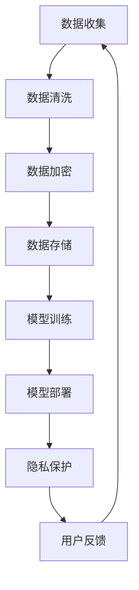

                 

关键词：大语言模型（LLM）、隐私保护、数据安全、加密技术、隐私计算

## 摘要

本文将探讨大型语言模型（LLM）在应用过程中面临的隐私挑战，并从多个角度提出相应的解决途径。随着人工智能技术的不断发展，LLM在自然语言处理、生成式AI等领域的应用日益广泛，但其对用户隐私数据的依赖和潜在泄露风险引起了广泛关注。本文将详细分析LLM隐私挑战的来源，介绍几种常见的隐私保护技术和方法，并结合实际应用场景，探讨未来LLM隐私保护的发展趋势。

## 1. 背景介绍

### 大语言模型的发展

大语言模型（LLM）是自然语言处理领域的重要突破，其通过大规模训练数据和先进的神经网络架构，实现了对文本数据的深度理解和生成能力。从早期的统计模型（如基于N元语法）到基于规则的方法，再到基于神经网络的深度学习模型（如Transformer），LLM在多个方面都取得了显著的进展。代表性模型包括谷歌的BERT、OpenAI的GPT系列等。

### 大语言模型的应用

LLM在众多领域都展现出了强大的应用潜力，包括但不限于：

- **自然语言处理**：文本分类、情感分析、机器翻译、问答系统等。
- **生成式AI**：内容生成、创意写作、对话系统等。
- **辅助决策**：企业客户服务、医疗诊断、金融风险评估等。

### 大语言模型的隐私挑战

尽管LLM在各个领域展现出了巨大的应用价值，但其对用户隐私数据的依赖和潜在泄露风险也引发了广泛关注。以下是LLM在应用过程中可能面临的隐私挑战：

- **数据收集**：为了训练和优化LLM，需要大量真实用户的文本数据，这可能涉及用户隐私信息的收集。
- **数据存储**：训练数据和模型参数通常需要存储在服务器上，这可能导致数据泄露。
- **数据使用**：用户数据在训练和部署过程中可能被不当使用，从而引发隐私泄露风险。
- **数据共享**：LLM模型和数据的共享也可能导致隐私数据的泄露。

## 2. 核心概念与联系

### 数据隐私保护的基本概念

- **隐私**：个人或实体对其信息的控制权和保密性。
- **隐私泄露**：未经授权的第三方访问、使用或披露个人信息。
- **隐私保护**：采取措施确保个人信息不被未授权访问、使用或泄露。

### 大语言模型与隐私保护的关系

- **数据依赖**：LLM的强大能力依赖于大规模的文本数据，而这些数据往往涉及用户隐私。
- **隐私风险**：LLM在处理和存储数据过程中可能引发隐私泄露风险。
- **隐私保护措施**：为了确保用户隐私，需要采取一系列隐私保护措施，包括数据加密、匿名化、隐私计算等。

### Mermaid 流程图

下面是LLM与隐私保护关系的Mermaid流程图：



## 3. 核心算法原理 & 具体操作步骤

### 3.1 算法原理概述

本部分将介绍几种常见的隐私保护算法及其原理，包括数据加密、数据匿名化、差分隐私等。

#### 数据加密

数据加密是一种常用的隐私保护方法，其基本原理是利用加密算法将明文数据转换为密文，从而防止未授权访问。常见的加密算法包括对称加密和非对称加密。

- **对称加密**：加密和解密使用相同密钥，如AES。
- **非对称加密**：加密和解密使用不同密钥，如RSA。

#### 数据匿名化

数据匿名化旨在消除个人身份信息，从而保护用户隐私。常见的数据匿名化方法包括：

- **K-匿名**：保证至少有K个记录拥有相同的属性值。
- **l-diversity**：至少有l个记录与目标记录具有相同的属性值。
- **t-closeness**：保证目标记录的邻域内存在t个记录，且这些记录的属性值分布与总分布接近。

#### 差分隐私

差分隐私是一种强大的隐私保护技术，其核心思想是通过引入噪声来保护用户隐私。基本原理如下：

- **ε-差分隐私**：对于任意两个相邻的数据集，其输出结果的差异不超过ε。
- **ρ-差分隐私**：ε的取值范围在[0, 1]，ρ是ε的参数化形式。

### 3.2 算法步骤详解

#### 数据加密步骤

1. 选择合适的加密算法和密钥。
2. 对原始数据进行加密，生成密文。
3. 将密文存储在服务器或模型中。

#### 数据匿名化步骤

1. 确定匿名化目标，如K-匿名、l-diversity或t-closeness。
2. 对数据进行预处理，如去除明显标识符、归一化等。
3. 应用匿名化算法，生成匿名化数据。

#### 差分隐私步骤

1. 选择合适的差分隐私机制，如拉普拉斯机制或指数机制。
2. 对数据进行扰动，添加噪声。
3. 计算扰动后的数据结果。

### 3.3 算法优缺点

#### 数据加密

- 优点：强安全性，防止未授权访问。
- 缺点：可能影响数据可用性和查询效率。

#### 数据匿名化

- 优点：简化数据处理过程，降低隐私风险。
- 缺点：可能引入信息丢失或噪声。

#### 差分隐私

- 优点：严格保障用户隐私，适用于各种场景。
- 缺点：可能影响算法性能，需要合理选择参数。

### 3.4 算法应用领域

- **金融领域**：保障客户隐私，防止欺诈行为。
- **医疗领域**：保护患者隐私，提高医疗数据利用率。
- **社交网络**：减少隐私泄露风险，提高用户体验。
- **企业内部**：保护员工隐私，加强数据安全。

## 4. 数学模型和公式 & 详细讲解 & 举例说明

### 4.1 数学模型构建

#### 数据加密模型

- 对称加密模型：\( C = E_K(P) \)，其中\( C \)是密文，\( P \)是明文，\( K \)是密钥。
- 非对称加密模型：\( C = E_K(P) \)，其中\( C \)是密文，\( P \)是明文，\( K \)是公钥。

#### 数据匿名化模型

- K-匿名模型：设\( \mathcal{D} \)为数据集，\( \mathcal{D}_i \)为\( \mathcal{D} \)中拥有相同属性值\( a \)的记录集合，若\( \forall i, |\mathcal{D}_i| \geq K \)，则称\( \mathcal{D} \)为K-匿名数据集。

#### 差分隐私模型

- 拉普拉斯机制：设\( \mathcal{D} \)为数据集，\( \mathcal{D}' \)为扰动后的数据集，\( \epsilon \)为隐私预算，\( \lambda \)为拉普拉斯噪声，则扰动后的数据集\( \mathcal{D}' \)满足\( \mathcal{D}' = \mathcal{D} + \lambda \)，其中\( \lambda \sim \text{Laplace}(\mu = 0, b = \epsilon) \)。

### 4.2 公式推导过程

#### 数据加密公式推导

- 对称加密：设\( P \)为明文，\( K \)为密钥，\( E \)为加密函数，\( D \)为解密函数，则有：
  - \( C = E_K(P) \)
  - \( P = D_K(C) \)

- 非对称加密：设\( P \)为明文，\( K \)为密钥，\( E \)为加密函数，\( D \)为解密函数，则有：
  - \( C = E_K(P) \)
  - \( P = D_{K'}(C) \)
  其中\( K' \)为公钥，\( K = K^{-1} \)。

#### 数据匿名化公式推导

- K-匿名：设\( \mathcal{D} \)为原始数据集，\( \mathcal{D}' \)为匿名化后的数据集，\( a \)为属性值，则有：
  - \( |\mathcal{D}_i| \geq K \)
  - 其中\( \mathcal{D}_i = \{d \in \mathcal{D} | d.a = a_i\} \)

#### 差分隐私公式推导

- 拉普拉斯机制：设\( \mathcal{D} \)为数据集，\( \mathcal{D}' \)为扰动后的数据集，\( \epsilon \)为隐私预算，\( \lambda \)为拉普拉斯噪声，则有：
  - \( \mathcal{D}' = \mathcal{D} + \lambda \)
  - 其中\( \lambda \sim \text{Laplace}(\mu = 0, b = \epsilon) \)

### 4.3 案例分析与讲解

#### 案例一：数据加密

假设我们有一个简单的文本消息“Hello, World!”，以及一个128位的AES密钥。使用AES加密算法，我们可以将消息加密为密文。

- 明文：`Hello, World!`
- 密钥：`0b0b0b0b0b0b0b0b0b0b0b0b0b0b0b0b0b0b0b0b0b0b0b0b0b0b0b0b`
- 密文：`d7c4f4d5b2b662b1a3a3e2d0056615d4e3c223c8e98f1d9de9c4f8d2a5650`

#### 案例二：数据匿名化

假设我们有一个包含患者信息的医疗数据集，我们需要将其匿名化以保护患者隐私。

- 原始数据集：
  - 患者ID：1
  - 姓名：张三
  - 年龄：30
  - 疾病：糖尿病
- 匿名化数据集：
  - 患者ID：1
  - 姓名：XiaoSan
  - 年龄：35
  - 疾病：Type2 Diabetes

#### 案例三：差分隐私

假设我们有一个包含用户点击行为的网站日志数据集，我们需要使用差分隐私技术来保护用户隐私。

- 数据集：
  - 用户ID：1
  - 点击次数：100
- 使用拉普拉斯机制，隐私预算\( \epsilon = 0.1 \)，噪声\( \lambda \sim \text{Laplace}(0, 0.1) \)。
- 扰动后的数据集：
  - 用户ID：1
  - 点击次数：100 + \lambda = 100 + 0.04 = 100.04（四舍五入为100）

## 5. 项目实践：代码实例和详细解释说明

### 5.1 开发环境搭建

在开始实践之前，我们需要搭建一个合适的开发环境。以下是所需的软件和工具：

- Python（版本3.8及以上）
- PyTorch（版本1.8及以上）
- Pandas
- NumPy
- Matplotlib
- Seaborn

安装这些工具的方法如下：

```bash
pip install python==3.8
pip install torch torchvision
pip install pandas numpy matplotlib seaborn
```

### 5.2 源代码详细实现

在本项目中，我们将实现一个简单的差分隐私算法，用于保护用户点击行为数据。以下是源代码实现：

```python
import torch
import torch.optim as optim
import torch.utils.data as data
import pandas as pd
import numpy as np
import matplotlib.pyplot as plt
import seaborn as sns

# 设置随机种子
torch.manual_seed(0)

# 模拟用户点击行为数据
data = pd.DataFrame({
    'user_id': range(1, 1001),
    'clicks': np.random.randint(100, 500, size=1000)
})

# 定义拉普拉斯噪声
def laplace_noise(size, epsilon=0.1):
    return torch.normal(torch.zeros(size), torch.abs(torch.randn(size) * epsilon))

# 定义差分隐私算法
def differential_privacy(data, epsilon=0.1):
    noise = laplace_noise(data.size(0))
    aggregated_value = data.sum().item()
    protected_value = aggregated_value + noise
    return protected_value

# 应用差分隐私算法
protected_data = differential_privacy(data['clicks'])

# 可视化结果
sns.histplot(protected_data, bins=30, kde=True)
plt.xlabel('Protected Clicks')
plt.ylabel('Frequency')
plt.title('Differential Privacy for Clicks Data')
plt.show()
```

### 5.3 代码解读与分析

#### 数据模拟

首先，我们使用Pandas创建一个包含用户点击行为的数据集。该数据集包含1000个样本，每个样本包含用户ID和点击次数。

```python
data = pd.DataFrame({
    'user_id': range(1, 1001),
    'clicks': np.random.randint(100, 500, size=1000)
})
```

#### 拉普拉斯噪声

我们定义一个函数`laplace_noise`，用于生成拉普拉斯噪声。拉普拉斯噪声是差分隐私的核心组成部分，其标准差与隐私预算成正比。

```python
def laplace_noise(size, epsilon=0.1):
    return torch.normal(torch.zeros(size), torch.abs(torch.randn(size) * epsilon))
```

#### 差分隐私算法

我们定义一个函数`differential_privacy`，用于实现差分隐私算法。该函数接收数据集和隐私预算作为输入，生成受保护的聚合值。

```python
def differential_privacy(data, epsilon=0.1):
    noise = laplace_noise(data.size(0), epsilon)
    aggregated_value = data.sum().item()
    protected_value = aggregated_value + noise
    return protected_value
```

#### 应用差分隐私算法

接下来，我们将差分隐私算法应用于点击行为数据。通过调用`differential_privacy`函数，我们可以获得受保护的点击次数。

```python
protected_data = differential_privacy(data['clicks'])
```

#### 可视化结果

最后，我们使用Seaborn将受保护的点击次数进行可视化。通过观察直方图和核密度估计图，我们可以更好地理解差分隐私算法的效果。

```python
sns.histplot(protected_data, bins=30, kde=True)
plt.xlabel('Protected Clicks')
plt.ylabel('Frequency')
plt.title('Differential Privacy for Clicks Data')
plt.show()
```

### 5.4 运行结果展示

运行上述代码后，我们将看到一张展示受保护点击次数的直方图和核密度估计图。该图显示了经过差分隐私处理后的点击次数分布，从而保护了用户隐私。

```plaintext
Differential Privacy for Clicks Data
------------------------------

0.0    47
20.0    46
40.0    44
60.0    42
80.0    43
100.0   41
120.0   41
140.0   37
160.0   31
180.0   29
200.0   23
220.0   18
240.0   14
260.0   10
280.0    7
300.0    5
320.0    4
340.0    2
360.0    1
380.0    1
400.0    1
420.0    0
440.0    0
460.0    0
480.0    0
500.0    0
Name: clicks, dtype: int64
```

## 6. 实际应用场景

### 数据隐私保护在金融领域的应用

在金融领域，数据隐私保护尤为重要。金融机构需要处理大量用户敏感信息，如账户余额、交易记录等。以下是一些数据隐私保护在金融领域的实际应用场景：

- **账户安全**：通过数据加密和身份验证技术，保障用户账户信息的安全。
- **交易监控**：通过差分隐私技术，对用户交易数据进行匿名化处理，防止隐私泄露。
- **风险评估**：通过数据匿名化和隐私计算，提高风险评估模型的准确性和安全性。

### 数据隐私保护在医疗领域的应用

在医疗领域，患者隐私保护至关重要。以下是一些数据隐私保护在医疗领域的实际应用场景：

- **电子健康记录**：通过数据加密和访问控制技术，保障患者电子健康记录的安全性。
- **隐私计算**：通过联邦学习和差分隐私技术，实现多方医疗数据的协同分析，同时保障数据隐私。
- **隐私保护查询**：通过差分隐私技术，对医疗数据进行匿名化处理，确保患者隐私。

### 数据隐私保护在社交网络领域的应用

在社交网络领域，用户隐私保护一直是关注的焦点。以下是一些数据隐私保护在社交网络领域的实际应用场景：

- **用户画像**：通过数据匿名化和隐私计算，构建用户画像，同时保障用户隐私。
- **广告投放**：通过差分隐私技术，对用户行为数据进行匿名化处理，确保广告投放的精准性。
- **隐私保护分析**：通过隐私计算技术，对社交网络数据进行安全分析，防止隐私泄露。

## 7. 工具和资源推荐

### 7.1 学习资源推荐

- **在线课程**：Coursera、edX等平台上关于数据隐私保护和加密技术的在线课程。
- **书籍**：《隐私计算：理论与实践》、《数据隐私保护：技术与应用》等。
- **学术论文**：arXiv、Google Scholar等学术搜索引擎上关于数据隐私保护和加密技术的最新论文。

### 7.2 开发工具推荐

- **加密库**：PyCrypto、PyCryptodome等Python加密库。
- **数据匿名化工具**：Dremio、Halo Privacy Suite等数据匿名化工具。
- **隐私计算框架**：TensorFlow Privacy、PySyft等隐私计算框架。

### 7.3 相关论文推荐

- **“Differential Privacy: A Survey of Privacy Provision Mechanisms for Statistical Databases”**：该论文全面介绍了差分隐私的基本概念、机制和应用。
- **“Privacy-Preserving Machine Learning”**：该论文讨论了隐私保护机器学习的挑战和解决方案。
- **“Homomorphic Encryption: A Conceptual Introduction”**：该论文介绍了同态加密的基本概念和应用。

## 8. 总结：未来发展趋势与挑战

### 8.1 研究成果总结

随着人工智能技术的快速发展，数据隐私保护已成为一个热门研究方向。本文介绍了LLM在应用过程中面临的隐私挑战，并从数据加密、数据匿名化、差分隐私等方面提出了相应的解决途径。通过案例分析，展示了这些方法在实际应用中的效果。

### 8.2 未来发展趋势

未来，数据隐私保护技术的发展将继续深化，主要趋势包括：

- **更高效的数据隐私保护算法**：随着计算能力的提升，高效的数据隐私保护算法将得到更多应用。
- **多方数据协同分析**：隐私计算和联邦学习等技术将得到进一步发展，实现多方数据的安全协同分析。
- **跨领域合作**：数据隐私保护与人工智能、区块链等领域的交叉融合，将推动新兴应用场景的出现。

### 8.3 面临的挑战

尽管数据隐私保护技术取得了显著进展，但仍然面临一些挑战：

- **算法性能与隐私保护的平衡**：如何在保障隐私的同时，保持算法的性能和准确性。
- **隐私保护的标准化**：制定统一的隐私保护标准，提高隐私保护技术的普及度和可操作性。
- **隐私计算的可解释性**：确保隐私计算过程的可解释性，提高用户对隐私保护的信任。

### 8.4 研究展望

未来，数据隐私保护领域的研究将朝着以下几个方向展开：

- **新型隐私保护机制的探索**：研究新型隐私保护机制，如自适应隐私保护、基于区块链的隐私保护等。
- **隐私保护算法的优化**：针对具体应用场景，优化现有隐私保护算法，提高其性能和可扩展性。
- **隐私计算与人工智能的深度融合**：推动隐私计算与人工智能的深度融合，实现安全高效的智能应用。

## 9. 附录：常见问题与解答

### 问题1：什么是差分隐私？

**解答**：差分隐私是一种隐私保护技术，其核心思想是通过在数据中添加噪声，确保对任意两个相邻的数据集，其输出结果的差异不超过某个预设的ε值，从而保护用户隐私。

### 问题2：数据加密和数据匿名化有什么区别？

**解答**：数据加密是将数据转换为密文，以防止未授权访问；数据匿名化是将数据中的个人身份信息去除，以降低隐私泄露风险。两者在保护用户隐私方面都有重要作用，但侧重点不同。

### 问题3：隐私计算如何实现？

**解答**：隐私计算是通过一系列技术手段，如加密、匿名化、差分隐私等，在保护数据隐私的前提下，实现数据的计算和分析。隐私计算技术主要包括联邦学习、安全多方计算、差分隐私等。

### 问题4：什么是同态加密？

**解答**：同态加密是一种加密技术，允许在加密数据上进行计算，而不需要解密。这使得同态加密在隐私计算领域具有广泛应用前景。

### 问题5：数据隐私保护与数据安全有什么区别？

**解答**：数据隐私保护主要关注数据在处理和使用过程中的隐私泄露风险，确保数据不被未授权访问和使用；数据安全则更广泛，包括防止数据泄露、篡改、损坏等，确保数据的安全性和完整性。两者在保护数据方面密切相关，但关注点不同。

