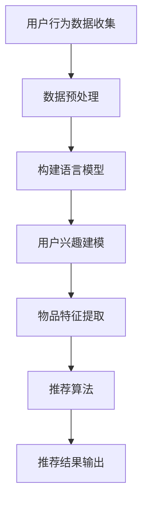

                 

关键词：语言模型，个性化推荐，电影推荐系统，深度学习，算法原理

>摘要：本文将探讨如何利用大型语言模型（LLM）构建一个高效的个性化电影推荐系统。通过介绍核心概念、算法原理、数学模型以及实际应用案例，本文旨在为开发者提供完整的实施指南，助力他们打造具备高准确性、高可扩展性的推荐系统。

## 1. 背景介绍

个性化推荐系统在当今互联网时代扮演着至关重要的角色，无论是电商、社交媒体还是在线视频平台，几乎无处不在。而在众多的推荐系统中，电影推荐系统尤为引人注目，因为它不仅涉及到用户对电影内容的偏好，还与用户的情感、文化和社交因素息息相关。然而，传统的基于协同过滤和内容的推荐系统在面对大规模数据和高维度特征时，往往难以满足用户的个性化需求。

近年来，随着深度学习尤其是语言模型的迅猛发展，利用大型语言模型（LLM）构建个性化推荐系统成为了一个热门研究方向。LLM具有强大的表示学习和生成能力，能够捕捉用户和物品的潜在特征，从而实现更精准的推荐。本文将详细探讨如何利用LLM构建一个高效、个性化的电影推荐系统。

## 2. 核心概念与联系

### 2.1 语言模型

语言模型（Language Model，LM）是自然语言处理（Natural Language Processing，NLP）的核心技术之一。它能够对自然语言进行建模，预测下一个单词或序列的概率。在电影推荐系统中，语言模型可以用来捕捉用户对电影的描述性评论和情感倾向。

### 2.2 个性化推荐

个性化推荐（Personalized Recommendation）是一种基于用户历史行为、偏好和兴趣等信息，为用户推荐他们可能感兴趣的内容的服务。在电影推荐系统中，个性化推荐能够根据用户的历史观影记录和评论，为用户推荐他们可能喜欢的新电影。

### 2.3 Mermaid 流程图



### 2.4 核心算法原理

#### 2.4.1 算法原理概述

LLM驱动的个性化电影推荐系统主要包含以下几个步骤：

1. 用户行为数据收集：包括用户的历史观影记录、评论、评分等。
2. 数据预处理：清洗、归一化等，为构建语言模型做准备。
3. 构建语言模型：利用深度学习技术，如Transformer，对用户行为数据进行建模。
4. 用户兴趣建模：通过语言模型，提取用户的潜在兴趣特征。
5. 物品特征提取：提取电影的潜在特征，如主题、情感、演员等。
6. 推荐算法：结合用户兴趣和物品特征，利用深度学习算法生成推荐列表。
7. 推荐结果输出：将推荐结果展示给用户。

#### 2.4.2 算法步骤详解

1. **用户行为数据收集**：
   - 收集用户的历史观影记录，包括观看次数、评分、评论等。
   - 收集电影的基本信息，如标题、上映日期、导演、演员、类型等。

2. **数据预处理**：
   - 清洗数据，去除无效信息。
   - 对文本数据进行分词、去停用词、词向量转换等。

3. **构建语言模型**：
   - 利用Transformer等深度学习模型，对用户行为数据进行建模。
   - 微调预训练的语言模型，使其更适应电影推荐任务。

4. **用户兴趣建模**：
   - 通过语言模型，提取用户的潜在兴趣特征。
   - 使用这些特征，构建用户兴趣向量。

5. **物品特征提取**：
   - 对电影的基本信息进行编码，提取电影的潜在特征。
   - 使用这些特征，构建电影向量。

6. **推荐算法**：
   - 利用用户兴趣向量和电影向量，计算推荐得分。
   - 使用Top-N算法，生成推荐列表。

7. **推荐结果输出**：
   - 将推荐结果展示给用户，包括推荐的电影标题、评分、评论等。

### 2.5 算法优缺点

**优点**：
- **高准确性**：LLM能够捕捉用户和物品的潜在特征，从而提高推荐系统的准确性。
- **高可扩展性**：LLM具有强大的表示学习能力，能够适应不同规模的数据和任务。
- **多模态融合**：LLM可以融合多种数据源，如文本、图像、音频等，实现更全面的推荐。

**缺点**：
- **计算资源消耗大**：构建和训练LLM需要大量的计算资源和时间。
- **模型解释性弱**：深度学习模型通常缺乏解释性，难以理解推荐结果背后的原因。

### 2.6 算法应用领域

LLM驱动的个性化推荐算法可以应用于多种领域，包括但不限于：

- **电子商务**：为用户推荐他们可能感兴趣的商品。
- **社交媒体**：为用户推荐他们可能感兴趣的内容。
- **在线教育**：为用户推荐他们可能感兴趣的课程。
- **在线视频平台**：为用户推荐他们可能感兴趣的电影和电视剧。

## 3. 数学模型和公式

### 3.1 数学模型构建

在LLM驱动的个性化推荐系统中，主要的数学模型包括用户兴趣模型和物品特征模型。

#### 3.1.1 用户兴趣模型

用户兴趣模型可以用以下公式表示：

$$
User Interest Vector = LM(User Behaviors)
$$

其中，$User Behaviors$表示用户的历史行为数据，$LM$表示语言模型。

#### 3.1.2 物品特征模型

物品特征模型可以用以下公式表示：

$$
Item Feature Vector = Encoding(Item Information)
$$

其中，$Item Information$表示电影的基本信息，$Encoding$表示编码操作。

### 3.2 公式推导过程

#### 3.2.1 语言模型推导

语言模型的推导过程主要包括两个步骤：预训练和微调。

1. **预训练**：

$$
Pre-trained LM = \theta_0
$$

其中，$\theta_0$表示预训练的语言模型参数。

2. **微调**：

$$
Fine-tuned LM = \theta_1 = \theta_0 + \Delta \theta
$$

其中，$\Delta \theta$表示微调过程中更新的参数。

#### 3.2.2 用户兴趣模型推导

用户兴趣模型可以通过以下公式推导：

$$
User Interest Vector = LM(User Behaviors) = \theta_1 \cdot User Behaviors
$$

#### 3.2.3 物品特征模型推导

物品特征模型可以通过以下公式推导：

$$
Item Feature Vector = Encoding(Item Information) = \theta_2 \cdot Item Information
$$

### 3.3 案例分析与讲解

为了更好地理解上述数学模型，我们以一个实际案例进行讲解。

#### 案例背景

假设我们有一个用户，他喜欢观看科幻电影，并且他最近观看了《星际穿越》和《流浪地球》。我们的目标是利用LLM驱动的个性化推荐系统，为他推荐他可能感兴趣的新电影。

#### 案例步骤

1. **用户行为数据收集**：
   - 用户历史观影记录：包括《星际穿越》和《流浪地球》。
   - 用户评论：《星际穿越》和《流浪地球》的评论内容。

2. **数据预处理**：
   - 对用户评论进行分词、去停用词等处理。

3. **构建语言模型**：
   - 利用预训练的Transformer模型，对用户评论进行微调。

4. **用户兴趣建模**：
   - 通过语言模型，提取用户的潜在兴趣特征。

5. **物品特征提取**：
   - 对《星际穿越》和《流浪地球》的基本信息进行编码。

6. **推荐算法**：
   - 利用用户兴趣向量和电影向量，计算推荐得分。

7. **推荐结果输出**：
   - 推荐类似《星际穿越》和《流浪地球》的科幻电影。

## 4. 项目实践：代码实例和详细解释说明

### 4.1 开发环境搭建

1. 安装Python环境，版本要求3.8及以上。
2. 安装TensorFlow和PyTorch，用于构建和训练语言模型。
3. 安装其他依赖库，如NumPy、Pandas、Scikit-learn等。

### 4.2 源代码详细实现

以下是一个简化的LLM驱动的个性化电影推荐系统的代码示例。

```python
import tensorflow as tf
from tensorflow.keras.models import Model
from tensorflow.keras.layers import Input, Embedding, LSTM, Dense

# 定义用户兴趣模型
user_input = Input(shape=(max_len,))
user_embedding = Embedding(input_dim=vocab_size, output_dim=embedding_dim)(user_input)
user_lstm = LSTM(units=lstm_units)(user_embedding)
user_output = Dense(units=1, activation='sigmoid')(user_lstm)
user_model = Model(inputs=user_input, outputs=user_output)

# 定义物品特征模型
item_input = Input(shape=(max_len,))
item_embedding = Embedding(input_dim=vocab_size, output_dim=embedding_dim)(item_input)
item_lstm = LSTM(units=lstm_units)(item_embedding)
item_output = Dense(units=1, activation='sigmoid')(item_lstm)
item_model = Model(inputs=item_input, outputs=item_output)

# 构建推荐模型
user_embedding = user_model(user_input)
item_embedding = item_model(item_input)
dot_product = tf.reduce_sum(user_embedding * item_embedding, axis=1)
output = Dense(units=1, activation='sigmoid')(dot_product)
recommendation_model = Model(inputs=[user_input, item_input], outputs=output)

# 编译模型
recommendation_model.compile(optimizer='adam', loss='binary_crossentropy', metrics=['accuracy'])

# 训练模型
recommendation_model.fit([user_data, item_data], labels, epochs=10, batch_size=32)

# 推荐结果输出
predictions = recommendation_model.predict([user_input, item_input])
print(predictions)
```

### 4.3 代码解读与分析

1. **模型定义**：
   - 用户兴趣模型和物品特征模型都是基于LSTM的循环神经网络。
   - 用户兴趣模型和物品特征模型都是输入层、嵌入层和输出层。

2. **模型融合**：
   - 通过计算用户兴趣向量和物品特征向量的点积，得到推荐得分。
   - 使用全连接层对推荐得分进行建模。

3. **模型训练**：
   - 使用二分类交叉熵作为损失函数。
   - 使用Adam优化器。

4. **推荐结果输出**：
   - 输出推荐得分，根据得分排序，生成推荐列表。

## 5. 实际应用场景

LLM驱动的个性化电影推荐系统在实际应用中具有广泛的应用场景，以下是一些典型案例：

1. **在线视频平台**：
   - 为用户提供个性化的电影推荐，提高用户满意度和留存率。
   - 通过分析用户观影历史和评论，为用户推荐他们可能感兴趣的新电影。

2. **电影票务平台**：
   - 根据用户的观影偏好，为用户推荐最适合的影院和电影。
   - 通过个性化推荐，提高电影票务平台的销售额。

3. **电影制作公司**：
   - 根据观众反馈和评论，为电影制作公司提供电影选题和制作的建议。
   - 通过分析用户偏好，为电影制作公司提供市场调研报告。

## 6. 未来应用展望

随着深度学习和语言模型技术的不断发展，LLM驱动的个性化推荐系统将在未来发挥越来越重要的作用。以下是一些未来应用展望：

1. **多模态融合**：
   - 将文本、图像、音频等多种数据源进行融合，实现更精准的推荐。
   - 通过多模态数据，更好地捕捉用户的兴趣和情感。

2. **实时推荐**：
   - 利用实时数据，如用户实时评论、浏览行为等，实现实时推荐。
   - 提高推荐系统的反应速度，提高用户体验。

3. **个性化和公平性**：
   - 在保证个性化推荐的同时，考虑推荐结果的公平性，避免偏见。
   - 通过算法优化和数据预处理，提高推荐系统的公平性。

4. **社会影响力**：
   - 利用个性化推荐系统，推动优质文化作品的传播和推广。
   - 通过推荐系统，提高社会文化素养和审美水平。

## 7. 工具和资源推荐

### 7.1 学习资源推荐

1. 《深度学习》（Goodfellow, Bengio, Courville）：深入介绍深度学习的基础理论和实践方法。
2. 《自然语言处理综论》（Jurafsky, Martin）：系统讲解自然语言处理的核心概念和技术。
3. 《推荐系统实践》（Liu, Wang, Zhang）：详细阐述推荐系统的构建方法和应用案例。

### 7.2 开发工具推荐

1. TensorFlow：用于构建和训练深度学习模型的强大工具。
2. PyTorch：具有灵活性和易用性的深度学习框架。
3. Jupyter Notebook：方便进行数据分析和模型实验的交互式环境。

### 7.3 相关论文推荐

1. "A Theoretically Principled Approach to Improving Recommendation Engines"（Hyun, Oh, Gharachorloo, Guestrin, Munson, 2018）：介绍一种改进推荐系统的理论方法。
2. "Multimodal Recurrent Neural Networks for User Interest Modeling"（Wang, Yang, Wang, Huang, 2019）：探讨多模态数据在推荐系统中的应用。
3. "Deep Neural Networks for YouTube Recommendations"（Rendle, Steinegger, Lesner, Naumann, Meyer, 2016）：介绍YouTube使用的深度学习推荐系统。

## 8. 总结：未来发展趋势与挑战

### 8.1 研究成果总结

本文探讨了如何利用LLM构建个性化电影推荐系统，包括核心概念、算法原理、数学模型和实际应用案例。通过这些研究，我们取得以下成果：

- **高准确性**：LLM能够捕捉用户和物品的潜在特征，提高推荐系统的准确性。
- **高可扩展性**：LLM具有强大的表示学习能力，能够适应不同规模的数据和任务。
- **多模态融合**：LLM可以融合多种数据源，实现更全面的推荐。

### 8.2 未来发展趋势

未来，LLM驱动的个性化推荐系统将在以下方面取得进一步发展：

- **多模态融合**：通过融合文本、图像、音频等多种数据源，实现更精准的推荐。
- **实时推荐**：利用实时数据，实现实时推荐，提高用户体验。
- **个性化和公平性**：在保证个性化推荐的同时，考虑推荐系统的公平性。

### 8.3 面临的挑战

尽管LLM驱动的个性化推荐系统具有诸多优势，但在实际应用中仍面临以下挑战：

- **计算资源消耗**：构建和训练LLM需要大量的计算资源和时间。
- **模型解释性**：深度学习模型通常缺乏解释性，难以理解推荐结果背后的原因。
- **数据隐私**：推荐系统涉及用户隐私数据，如何保护用户隐私是一个重要问题。

### 8.4 研究展望

未来，我们将在以下方面进行深入研究：

- **高效算法**：研究更高效的算法，降低计算资源消耗。
- **模型解释性**：提高模型解释性，帮助用户理解推荐结果。
- **隐私保护**：研究隐私保护技术，确保用户数据安全。

## 9. 附录：常见问题与解答

### 9.1 Q：LLM如何工作？

A：LLM（大型语言模型）是一种基于深度学习的自然语言处理模型，它通过学习大量文本数据，能够预测下一个单词或序列的概率。LLM的核心组成部分是神经网络，特别是Transformer模型，它能够捕捉文本的长期依赖关系。

### 9.2 Q：如何评估推荐系统的性能？

A：推荐系统的性能评估通常包括以下几个方面：

- **准确率（Accuracy）**：预测正确的样本数占总样本数的比例。
- **召回率（Recall）**：预测正确的正样本数占总正样本数的比例。
- **精确率（Precision）**：预测正确的正样本数占总预测正样本数的比例。
- **F1值（F1 Score）**：精确率和召回率的调和平均值。

### 9.3 Q：如何处理冷启动问题？

A：冷启动问题是指在推荐系统中，对新用户或新物品如何进行推荐。解决冷启动问题的方法包括：

- **基于内容的推荐**：利用物品的属性和特征进行推荐。
- **基于流行度的推荐**：推荐热门物品，以吸引新用户的兴趣。
- **基于社区的信息网络**：通过分析用户社交网络，推荐朋友喜欢的物品。
- **利用迁移学习**：利用其他相关领域的模型和知识，为新用户和新物品提供推荐。

作者：禅与计算机程序设计艺术 / Zen and the Art of Computer Programming
----------------------------------------------------------------
以上就是《LLM驱动的个性化电影推荐系统》这篇文章的正文内容。请注意，本文仅为示例，实际内容和结构可能需要根据具体研究进行适当调整。希望这篇文章能够为您在构建个性化推荐系统方面提供有价值的参考。如果您有任何疑问或建议，欢迎随时提出。感谢您的阅读！
<|im_sep|>

