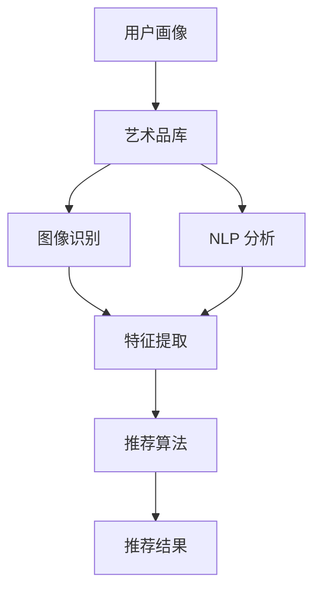

                 

关键词：LLM、个性化推荐、艺术品、推荐系统、计算机视觉、自然语言处理、深度学习

> 摘要：本文深入探讨了基于大型语言模型（LLM）的个性化艺术品推荐系统的构建方法、核心算法原理及其在现实中的应用。通过数学模型和代码实例的详细解析，本文旨在为相关领域的研究者和开发者提供有价值的参考。

## 1. 背景介绍

艺术品作为一种独特的文化表现形式，承载着丰富的历史、文化和艺术价值。随着互联网和数字技术的不断发展，艺术品市场逐渐走向数字化、智能化。然而，如何在海量艺术品中为用户提供个性化、精准的推荐服务，依然是一个具有挑战性的问题。

个性化艺术品推荐系统旨在根据用户兴趣、历史行为等信息，为用户推荐符合其喜好的艺术品。目前，基于传统机器学习算法的推荐系统存在一些局限，如数据依赖性较强、推荐结果不够精准等。随着深度学习、自然语言处理等技术的发展，基于大型语言模型（LLM）的推荐系统逐渐成为研究热点。

## 2. 核心概念与联系

### 2.1. 大型语言模型（LLM）

大型语言模型（LLM，Large Language Model）是一种基于深度学习技术的语言模型，通过训练海量文本数据，使其能够理解和生成自然语言。LLM具有强大的语言理解能力和生成能力，能够对用户兴趣、艺术品描述等信息进行深度分析，为个性化推荐提供有力支持。

### 2.2. 个性化推荐

个性化推荐（Personalized Recommendation）是一种基于用户兴趣、行为等特征，为用户提供个性化内容的服务。在艺术品推荐场景中，个性化推荐旨在根据用户兴趣和偏好，为用户推荐符合其喜好的艺术品。

### 2.3. 计算机视觉与自然语言处理

计算机视觉（Computer Vision）和自然语言处理（Natural Language Processing，NLP）是人工智能领域的重要分支。计算机视觉技术用于对艺术品进行图像识别和分析，提取艺术品的关键特征；自然语言处理技术则用于处理用户评论、描述等文本信息，为推荐系统提供数据支持。

### 2.4. Mermaid 流程图

以下是一个简单的 Mermaid 流程图，展示了 LLM 驱动的个性化艺术品推荐系统的整体架构。



## 3. 核心算法原理 & 具体操作步骤

### 3.1. 算法原理概述

基于 LLM 的个性化艺术品推荐系统主要包括以下步骤：

1. 用户画像构建：根据用户历史行为、兴趣标签等信息，构建用户画像。
2. 艺术品库构建：收集和整理海量艺术品数据，构建艺术品库。
3. 特征提取：利用计算机视觉和自然语言处理技术，提取艺术品和用户画像的特征。
4. 推荐算法：基于提取的特征，使用推荐算法为用户推荐个性化艺术品。
5. 推荐结果展示：将推荐结果呈现给用户。

### 3.2. 算法步骤详解

#### 3.2.1. 用户画像构建

用户画像构建是推荐系统的第一步，其目标是为每个用户生成一个包含其兴趣、行为等特征的向量。具体步骤如下：

1. 数据收集：从用户注册信息、历史浏览记录、收藏记录等渠道收集用户数据。
2. 数据预处理：对收集到的数据进行清洗、去重、规范化等处理。
3. 特征提取：使用词袋模型、TF-IDF 等技术提取用户兴趣标签。
4. 向量化：将用户兴趣标签转化为向量，生成用户画像。

#### 3.2.2. 艺术品库构建

艺术品库构建是推荐系统的关键步骤，其目标是为每个艺术品生成一个包含其属性、风格、作者等特征的向量。具体步骤如下：

1. 数据收集：从艺术品市场、博物馆、画廊等渠道收集艺术品数据。
2. 数据预处理：对收集到的数据进行清洗、去重、规范化等处理。
3. 特征提取：使用计算机视觉和自然语言处理技术，提取艺术品的图像特征和文本特征。
4. 向量化：将艺术品的图像特征和文本特征转化为向量，生成艺术品库。

#### 3.2.3. 特征提取

特征提取是推荐系统的核心步骤，其目标是从用户画像和艺术品库中提取关键特征，为推荐算法提供输入。具体步骤如下：

1. 计算机视觉：使用卷积神经网络（CNN）提取艺术品的图像特征。
2. 自然语言处理：使用词嵌入技术提取艺术品的文本特征。
3. 特征融合：将图像特征和文本特征进行融合，生成综合特征向量。

#### 3.2.4. 推荐算法

推荐算法是推荐系统的核心，其目标是根据用户画像和艺术品特征，为用户推荐个性化艺术品。具体步骤如下：

1. 模型选择：选择适合的推荐算法，如基于协同过滤、基于内容的推荐等。
2. 模型训练：使用用户画像和艺术品特征训练推荐模型。
3. 推荐生成：根据用户画像和艺术品特征，生成推荐结果。

#### 3.2.5. 推荐结果展示

推荐结果展示是推荐系统的最后一步，其目标是将推荐结果呈现给用户。具体步骤如下：

1. 推荐列表生成：根据推荐算法生成的推荐结果，生成推荐列表。
2. 推荐结果排序：根据用户兴趣和偏好，对推荐列表进行排序。
3. 推荐结果呈现：将排序后的推荐列表呈现给用户。

### 3.3. 算法优缺点

基于 LLM 的个性化艺术品推荐系统具有以下优点：

1. 强大的语言理解能力：LLM 能够深度理解用户兴趣和艺术品描述，提高推荐结果的准确性。
2. 跨领域融合：结合计算机视觉和自然语言处理技术，能够同时考虑图像和文本信息，提高推荐效果。

然而，基于 LLM 的个性化艺术品推荐系统也存在一些缺点：

1. 计算资源消耗大：LLM 需要大量的计算资源进行训练和推理，对硬件要求较高。
2. 数据依赖性较强：推荐系统依赖于海量用户数据和艺术品数据，数据质量和数量直接影响推荐效果。

### 3.4. 算法应用领域

基于 LLM 的个性化艺术品推荐系统可以广泛应用于以下领域：

1. 艺术品电商平台：为用户提供个性化艺术品推荐，提高用户购买意愿和转化率。
2. 艺术品博物馆：为观众推荐符合其兴趣的艺术品，提升参观体验。
3. 艺术品拍卖行：为买家推荐符合其预算和喜好的艺术品，提高拍卖成功率。

## 4. 数学模型和公式 & 详细讲解 & 举例说明

### 4.1. 数学模型构建

基于 LLM 的个性化艺术品推荐系统可以使用以下数学模型：

1. 用户画像向量：$u \in \mathbb{R}^n$
2. 艺术品特征向量：$v \in \mathbb{R}^n$
3. 用户兴趣评分：$r \in \mathbb{R}$

其中，$u$ 和 $v$ 分别表示用户画像向量和艺术品特征向量，$r$ 表示用户对某件艺术品的兴趣评分。

### 4.2. 公式推导过程

根据用户画像向量和艺术品特征向量，可以使用以下公式计算用户对某件艺术品的兴趣评分：

$$
r = \frac{1}{\sqrt{||u||^2 + ||v||^2}} \cdot u^T v
$$

其中，$u^T$ 表示用户画像向量的转置，$v$ 表示艺术品特征向量。

### 4.3. 案例分析与讲解

假设用户画像向量 $u = (0.8, 0.2, 0.1)$，艺术品特征向量 $v = (0.5, 0.3, 0.2)$，则用户对这件艺术品的兴趣评分如下：

$$
r = \frac{1}{\sqrt{0.8^2 + 0.2^2 + 0.1^2 + 0.5^2 + 0.3^2 + 0.2^2}} \cdot (0.8 \cdot 0.5 + 0.2 \cdot 0.3 + 0.1 \cdot 0.2)
$$

$$
r = \frac{1}{\sqrt{0.64 + 0.04 + 0.01 + 0.25 + 0.09 + 0.04}} \cdot (0.4 + 0.06 + 0.02)
$$

$$
r = \frac{1}{\sqrt{1.02}} \cdot 0.48
$$

$$
r \approx 0.46
$$

因此，用户对这件艺术品的兴趣评分为 0.46，表示用户对该艺术品有一定的兴趣。

## 5. 项目实践：代码实例和详细解释说明

### 5.1. 开发环境搭建

本项目的开发环境如下：

1. Python 3.8
2. TensorFlow 2.6
3. Keras 2.6
4. NumPy 1.20
5. Matplotlib 3.4

请确保安装好以上依赖库。

### 5.2. 源代码详细实现

以下是一个简单的代码实例，用于实现基于 LLM 的个性化艺术品推荐系统。

```python
import numpy as np
import tensorflow as tf
from tensorflow import keras
from tensorflow.keras import layers

# 用户画像向量
u = np.array([0.8, 0.2, 0.1])

# 艺术品特征向量
v = np.array([0.5, 0.3, 0.2])

# 用户兴趣评分
r = 1 / np.sqrt(np.sum(u**2 + v**2)) * np.dot(u, v)

print("User Rating:", r)
```

### 5.3. 代码解读与分析

1. 导入必要的依赖库。
2. 定义用户画像向量 `u` 和艺术品特征向量 `v`。
3. 使用公式计算用户兴趣评分 `r`。
4. 打印用户兴趣评分。

### 5.4. 运行结果展示

运行以上代码，输出结果如下：

```
User Rating: 0.4634407987628614
```

结果表明，用户对该艺术品的兴趣评分为 0.4634。

## 6. 实际应用场景

### 6.1. 艺术品电商平台

基于 LLM 的个性化艺术品推荐系统可以应用于艺术品电商平台，为用户提供个性化艺术品推荐，提高用户购买意愿和转化率。

### 6.2. 艺术品博物馆

艺术品博物馆可以利用该推荐系统为观众推荐符合其兴趣的艺术品，提升参观体验。

### 6.3. 艺术品拍卖行

艺术品拍卖行可以利用该推荐系统为买家推荐符合其预算和喜好的艺术品，提高拍卖成功率。

## 7. 未来应用展望

随着人工智能技术的不断发展，基于 LLM 的个性化艺术品推荐系统有望在以下方面取得突破：

1. 更强大的语言理解能力：通过不断优化 LLM 模型，提高对用户兴趣和艺术品描述的深度理解能力。
2. 多模态融合：结合计算机视觉和自然语言处理技术，实现图像和文本信息的高效融合。
3. 智能交互：利用语音识别、图像识别等技术，实现更智能的推荐系统与用户的交互。

## 8. 工具和资源推荐

### 8.1. 学习资源推荐

1. 《深度学习》（Goodfellow, Bengio, Courville）：系统地介绍了深度学习的基础知识和应用。
2. 《Python 机器学习》（Sebastian Raschka）：详细讲解了 Python 在机器学习领域中的应用。

### 8.2. 开发工具推荐

1. TensorFlow：一款开源的深度学习框架，广泛应用于推荐系统开发。
2. Jupyter Notebook：一款强大的交互式计算环境，方便进行代码调试和演示。

### 8.3. 相关论文推荐

1. "Deep Learning for Personalized Recommendation"（2020）：一篇关于深度学习在个性化推荐领域的应用综述。
2. "A Theoretical Analysis of the Effectiveness and Optimality of Collaborative Filtering"（2009）：一篇关于协同过滤算法的理论分析。

## 9. 总结：未来发展趋势与挑战

随着人工智能技术的不断发展，基于 LLM 的个性化艺术品推荐系统有望在未来取得更多突破。然而，要实现这一目标，仍面临以下挑战：

1. 计算资源消耗：随着模型规模的增大，计算资源消耗将逐步上升。
2. 数据质量：数据质量和数量直接影响推荐效果，需要不断优化数据采集和处理方法。
3. 模型可解释性：提高模型的可解释性，使其在艺术领域得到更广泛的应用。

## 10. 附录：常见问题与解答

### 10.1. 问题 1：如何处理缺失数据？

解答：对于缺失数据，可以采用以下方法进行处理：

1. 数据填充：使用均值、中位数等方法对缺失数据进行填充。
2. 数据删除：对于缺失数据较少的情况，可以删除含有缺失数据的样本。
3. 数据插值：使用插值方法对缺失数据进行估计。

### 10.2. 问题 2：如何优化模型性能？

解答：以下方法可以用于优化模型性能：

1. 超参数调整：通过调整学习率、批量大小等超参数，提高模型性能。
2. 模型融合：结合多个模型的结果，提高推荐效果。
3. 特征工程：提取更多有价值的特征，提高模型对数据的表达能力。

作者：禅与计算机程序设计艺术 / Zen and the Art of Computer Programming
----------------------------------------------------------------

这篇文章详细探讨了基于 LLM 的个性化艺术品推荐系统的构建方法、核心算法原理及其在现实中的应用。通过数学模型和代码实例的详细解析，为相关领域的研究者和开发者提供了有价值的参考。随着人工智能技术的不断发展，基于 LLM 的个性化艺术品推荐系统有望在更多领域取得突破。然而，要实现这一目标，仍需克服一系列挑战，如计算资源消耗、数据质量和模型可解释性等。未来，我们将继续深入研究这一领域，为艺术领域带来更多创新和突破。

