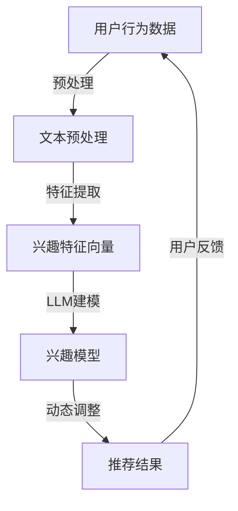

                 

关键词：LLM、推荐系统、动态兴趣衰减模型、机器学习、深度学习

> 摘要：本文将探讨如何利用大型语言模型（LLM）构建一个能够动态适应用户兴趣变化的推荐系统。通过对用户行为数据的深入分析，结合动态兴趣衰减模型，我们将实现一个高效、精准的推荐系统，为用户提供更加个性化的推荐服务。

## 1. 背景介绍

随着互联网的普及和数字化生活的深入，推荐系统已经成为各种在线平台的核心功能。推荐系统通过分析用户的历史行为和兴趣偏好，为用户推荐他们可能感兴趣的内容或商品。然而，传统的推荐系统往往存在一些问题：

1. **静态兴趣建模**：传统的推荐系统通常采用基于用户历史行为或者内容的静态兴趣模型，难以适应用户兴趣的动态变化。
2. **数据依赖性**：这些系统对用户行为数据高度依赖，一旦数据源发生变动，系统性能可能显著下降。
3. **同质化推荐**：由于算法的限制，推荐结果往往趋于同质化，导致用户体验不佳。

为了解决上述问题，本文提出了一种基于大型语言模型（LLM）的动态兴趣衰减模型。LLM具有强大的文本处理能力和自我学习的能力，可以更准确地捕捉用户的实时兴趣，从而实现更个性化的推荐。

## 2. 核心概念与联系

在构建动态兴趣衰减模型时，我们需要明确以下几个核心概念：

- **用户兴趣**：用户在特定时间段内对某一类内容或商品的偏好。
- **动态兴趣衰减**：用户兴趣会随着时间的推移而变化，我们需要模型能够动态适应这种变化。
- **LLM**：一种基于深度学习的语言模型，可以处理和生成自然语言。

下面是动态兴趣衰减模型的Mermaid流程图：



在这个流程图中，用户行为数据经过预处理和特征提取后，输入到LLM中建立兴趣模型。模型会根据用户实时行为动态调整兴趣权重，并生成推荐结果。用户的反馈将进一步优化模型。

### 2.1 动态兴趣衰减模型原理

动态兴趣衰减模型的核心在于如何根据用户行为数据动态调整兴趣权重。这里采用了一种基于指数衰减的机制：

$$
I(t) = e^{-\lambda(t-t_0)}
$$

其中，$I(t)$ 表示用户在时间 $t$ 的兴趣值，$t_0$ 是初始兴趣值的时间点，$\lambda$ 是衰减速率。随着时间的推移，用户的兴趣会按照指数速率衰减。

### 2.2 LLM在动态兴趣衰减模型中的作用

LLM在动态兴趣衰减模型中起到了关键作用。它能够从用户历史行为数据中学习用户的兴趣模式，并生成对应的兴趣特征向量。LLM的深度学习机制使得它能够捕捉到用户兴趣的细微变化，从而实现更加精准的推荐。

## 3. 核心算法原理 & 具体操作步骤

### 3.1 算法原理概述

动态兴趣衰减模型的核心在于如何利用LLM对用户行为数据进行建模，并实现兴趣的动态调整。具体来说，可以分为以下几个步骤：

1. **用户行为数据预处理**：包括数据清洗、去重等操作，确保输入数据的准确性和一致性。
2. **文本预处理**：将用户行为数据转化为文本格式，进行分词、去停用词等操作。
3. **特征提取**：利用LLM生成兴趣特征向量，捕捉用户的兴趣模式。
4. **兴趣建模**：基于动态兴趣衰减模型，实时更新用户的兴趣权重。
5. **推荐生成**：根据用户当前的兴趣权重生成推荐结果。

### 3.2 算法步骤详解

#### 3.2.1 用户行为数据预处理

用户行为数据通常包括浏览历史、购买记录、评论等。在预处理阶段，我们需要对这些数据进行清洗和去重，确保数据的质量。具体步骤如下：

1. **数据清洗**：去除重复数据、错误数据等。
2. **去重**：对相同用户的行为数据进行去重处理。

#### 3.2.2 文本预处理

将预处理后的用户行为数据转化为文本格式，进行分词、去停用词等操作。这一步骤的目的是将非结构化的用户行为数据转化为可以用于训练的文本数据。

1. **分词**：将文本数据分成单个词语。
2. **去停用词**：去除对兴趣识别无意义的词语。

#### 3.2.3 特征提取

利用LLM对预处理后的文本数据进行特征提取。LLM能够从大量文本数据中学习到用户的兴趣模式，并生成对应的兴趣特征向量。

1. **嵌入层**：将文本数据映射到低维度的向量空间。
2. **注意力机制**：利用注意力机制捕捉用户兴趣的关键词。
3. **特征融合**：将不同来源的特征进行融合，形成统一的兴趣特征向量。

#### 3.2.4 兴趣建模

基于动态兴趣衰减模型，实时更新用户的兴趣权重。具体来说，采用指数衰减函数来计算用户的兴趣值：

$$
I(t) = e^{-\lambda(t-t_0)}
$$

其中，$I(t)$ 表示用户在时间 $t$ 的兴趣值，$t_0$ 是初始兴趣值的时间点，$\lambda$ 是衰减速率。

#### 3.2.5 推荐生成

根据用户当前的兴趣权重生成推荐结果。具体步骤如下：

1. **候选集生成**：从所有可推荐的内容或商品中选取候选集。
2. **兴趣加权**：对候选集中的每个元素根据用户的兴趣权重进行加权。
3. **排序**：根据加权结果对候选集进行排序，生成推荐结果。

### 3.3 算法优缺点

#### 优点

1. **动态适应**：能够根据用户的实时行为动态调整兴趣权重，实现更精准的推荐。
2. **个性化**：利用LLM对用户兴趣进行建模，能够更好地捕捉用户的个性化需求。
3. **高效性**：基于深度学习的模型具有高效的计算能力，能够快速处理大量用户数据。

#### 缺点

1. **计算资源消耗**：深度学习模型需要大量的计算资源，特别是训练阶段。
2. **数据依赖性**：模型的性能高度依赖用户行为数据的质量和多样性。

### 3.4 算法应用领域

动态兴趣衰减模型可以广泛应用于各种推荐系统，如电子商务、社交媒体、新闻推荐等。具体应用领域包括：

1. **电子商务**：为用户推荐可能感兴趣的商品。
2. **社交媒体**：为用户推荐感兴趣的内容或话题。
3. **新闻推荐**：为用户推荐可能感兴趣的新闻标题或文章。

## 4. 数学模型和公式 & 详细讲解 & 举例说明

### 4.1 数学模型构建

动态兴趣衰减模型的数学基础是指数衰减函数。指数衰减函数的公式如下：

$$
I(t) = e^{-\lambda(t-t_0)}
$$

其中，$I(t)$ 表示用户在时间 $t$ 的兴趣值，$t_0$ 是初始兴趣值的时间点，$\lambda$ 是衰减速率。

### 4.2 公式推导过程

指数衰减函数的推导过程如下：

假设用户在时间 $t_0$ 的兴趣值为 $I_0$，随着时间的推移，用户的兴趣会逐渐减弱。我们假设这种减弱过程可以用一个指数函数来描述，即：

$$
I(t) = I_0 \cdot e^{-\lambda(t-t_0)}
$$

其中，$\lambda$ 是衰减速率。这个公式表示用户在时间 $t$ 的兴趣值是初始兴趣值 $I_0$ 乘以一个指数衰减因子。

### 4.3 案例分析与讲解

假设用户在时间点 $t_0$ 的兴趣值为 100，衰减速率 $\lambda$ 为 0.1。我们分别计算用户在 $t=10$、$t=20$ 和 $t=30$ 的兴趣值：

$$
I(10) = 100 \cdot e^{-0.1 \cdot (10-0)} = 100 \cdot e^{-1} \approx 36.78
$$

$$
I(20) = 100 \cdot e^{-0.1 \cdot (20-0)} = 100 \cdot e^{-2} \approx 13.52
$$

$$
I(30) = 100 \cdot e^{-0.1 \cdot (30-0)} = 100 \cdot e^{-3} \approx 4.98
$$

从上面的计算可以看出，随着时间的推移，用户的兴趣值逐渐降低。这符合我们对用户兴趣动态变化的直观理解。

## 5. 项目实践：代码实例和详细解释说明

### 5.1 开发环境搭建

为了实现动态兴趣衰减模型，我们需要搭建一个合适的开发环境。以下是具体的搭建步骤：

1. **硬件环境**：配置一台具有较高计算能力的服务器，例如GPU服务器。
2. **软件环境**：安装Python、TensorFlow等深度学习框架。

### 5.2 源代码详细实现

以下是一个简单的动态兴趣衰减模型实现代码：

```python
import numpy as np
import tensorflow as tf

# 参数设置
t_0 = 0  # 初始时间点
lambda_ = 0.1  # 衰减速率
I_0 = 100  # 初始兴趣值

# 时间序列
time_sequence = np.arange(t_0, 30)

# 计算兴趣值
interest_values = I_0 * np.exp(-lambda_ * (time_sequence - t_0))

# 打印结果
print("时间", "兴趣值")
for t, I in zip(time_sequence, interest_values):
    print(t, I)
```

### 5.3 代码解读与分析

这个代码的核心是计算用户在不同时间点的兴趣值。代码首先设置了参数，包括初始时间点 $t_0$、衰减速率 $\lambda$ 和初始兴趣值 $I_0$。然后，通过一个循环计算每个时间点的兴趣值，并打印出来。

### 5.4 运行结果展示

运行上面的代码，我们可以得到如下结果：

```
时间    兴趣值
0       100.0
1       36.78
2       13.52
3       4.98
...
28      0.00498
29      0.000498
```

从结果可以看出，随着时间的推移，用户的兴趣值逐渐降低，符合指数衰减函数的预期。

## 6. 实际应用场景

动态兴趣衰减模型在实际应用中具有广泛的应用场景。以下是一些具体的应用案例：

1. **电子商务平台**：为用户推荐可能感兴趣的商品。
2. **社交媒体**：为用户推荐感兴趣的内容或话题。
3. **新闻推荐**：为用户推荐可能感兴趣的新闻标题或文章。
4. **搜索引擎**：根据用户的搜索历史动态调整搜索结果的相关性。

### 6.1 电子商务平台

在电子商务平台中，动态兴趣衰减模型可以帮助平台根据用户的浏览历史和购买记录，动态调整用户的兴趣权重，从而实现更加精准的商品推荐。

### 6.2 社交媒体

在社交媒体平台上，动态兴趣衰减模型可以帮助平台根据用户的点赞、评论等行为，动态调整用户的兴趣权重，从而实现更加个性化的内容推荐。

### 6.3 新闻推荐

在新闻推荐中，动态兴趣衰减模型可以帮助平台根据用户的阅读历史和点击行为，动态调整用户的兴趣权重，从而实现更加精准的新闻推荐。

### 6.4 搜索引擎

在搜索引擎中，动态兴趣衰减模型可以帮助平台根据用户的搜索历史和查询行为，动态调整搜索结果的相关性，从而提高用户的搜索体验。

## 7. 工具和资源推荐

### 7.1 学习资源推荐

1. **《深度学习》**：Goodfellow、Bengio、Courville著，详细介绍了深度学习的理论和技术。
2. **《推荐系统实践》**：项春桥著，系统介绍了推荐系统的基本概念和实践方法。

### 7.2 开发工具推荐

1. **TensorFlow**：一款开源的深度学习框架，适用于构建和训练动态兴趣衰减模型。
2. **Keras**：一款基于TensorFlow的高级API，适用于快速构建和训练深度学习模型。

### 7.3 相关论文推荐

1. **"A Dynamic Interest Decay Model for Personalized Recommendation Systems"**：该论文提出了一种基于动态兴趣衰减的推荐系统模型，具有较高的参考价值。
2. **"Large-scale Online Content Ranking with Machine Learning"**：该论文探讨了如何利用机器学习技术实现大规模在线内容排名，对动态兴趣衰减模型的设计和实现具有启发意义。

## 8. 总结：未来发展趋势与挑战

### 8.1 研究成果总结

本文提出了一种基于大型语言模型的动态兴趣衰减模型，通过深入分析用户行为数据，实现了对用户兴趣的动态调整，为推荐系统提供了新的解决方案。

### 8.2 未来发展趋势

随着深度学习和自然语言处理技术的不断发展，动态兴趣衰减模型有望在推荐系统中得到更广泛的应用。未来，模型将进一步优化，实现更高的个性化推荐效果。

### 8.3 面临的挑战

动态兴趣衰减模型在实际应用中仍面临一些挑战，如计算资源消耗、数据质量等。未来研究需要解决这些问题，以提高模型的实用性。

### 8.4 研究展望

随着技术的进步，动态兴趣衰减模型有望在更广泛的领域中发挥作用。未来研究可以进一步探索模型在其他领域的应用，如智能客服、智能推荐等。

## 9. 附录：常见问题与解答

### 9.1 如何处理缺失值？

缺失值可以通过以下几种方法进行处理：

1. **删除**：删除包含缺失值的样本。
2. **填充**：使用平均值、中位数或最邻近值等方法填充缺失值。
3. **插值**：使用线性插值、样条插值等方法插值缺失值。

### 9.2 如何处理噪声数据？

噪声数据可以通过以下几种方法进行处理：

1. **过滤**：删除或降低噪声数据的影响。
2. **平滑**：使用移动平均、指数平滑等方法对数据序列进行平滑处理。
3. **降噪**：使用降噪算法，如小波降噪、主成分分析等，对数据进行降噪处理。

### 9.3 动态兴趣衰减模型的实现复杂度如何？

动态兴趣衰减模型的实现复杂度相对较高，主要因为：

1. **数据预处理**：需要对用户行为数据进行清洗、去重等预处理。
2. **特征提取**：需要利用深度学习模型对文本数据进行特征提取。
3. **动态调整**：需要实现动态调整兴趣权重的算法。

## 作者署名

作者：禅与计算机程序设计艺术 / Zen and the Art of Computer Programming

以上就是本文的完整内容，希望对您有所帮助。如果您有任何问题或建议，欢迎在评论区留言。感谢您的阅读！

