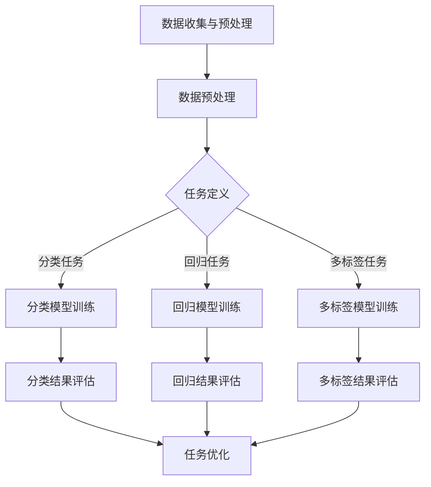

                 

关键词：推荐系统、多任务学习、大型语言模型（LLM）、框架设计、算法原理、应用领域、数学模型

>摘要：本文深入探讨了基于大型语言模型（LLM）的推荐系统多任务学习框架的设计与实现。首先，对推荐系统和多任务学习的基本概念进行了介绍，并分析了传统方法在现代推荐系统中的局限性。接着，本文详细阐述了LLM在推荐系统中的应用，以及如何利用LLM实现多任务学习框架。此外，本文还通过数学模型和具体实例，进一步解释了框架的实现过程和优势。最后，本文对未来推荐系统的发展方向进行了展望。

## 1. 背景介绍

推荐系统作为信息检索和数据分析的重要工具，已经被广泛应用于电子商务、社交媒体、在线视频和音乐等领域。传统推荐系统通常采用基于协同过滤、内容匹配或混合方法来提高推荐的准确性。然而，随着数据规模和复杂性的增加，传统方法逐渐暴露出一些局限性：

1. **稀疏性**：用户-项目评分矩阵通常是稀疏的，导致传统方法难以捕捉用户和项目之间的复杂关系。
2. **冷启动问题**：对于新用户或新项目，传统方法由于缺乏足够的历史数据，推荐效果较差。
3. **单一任务限制**：传统方法通常专注于单一推荐任务，如物品推荐或用户兴趣预测，无法同时解决多个相关任务。

为了克服上述问题，多任务学习（Multi-Task Learning，MTL）逐渐成为研究热点。多任务学习旨在同时学习多个相关任务，通过共享表示和参数，提高模型的泛化能力和推理效率。然而，传统多任务学习方法在推荐系统中的应用仍然存在挑战，如任务依赖关系不明确、模型复杂性增加等。

近年来，大型语言模型（Large Language Model，LLM）的兴起为推荐系统的多任务学习提供了新的契机。LLM具有强大的表示能力和泛化能力，可以处理大规模、高维度的数据，同时捕捉复杂的上下文关系。本文旨在设计一个基于LLM的推荐系统多任务学习框架，以解决传统方法的局限性，提高推荐系统的性能和可扩展性。

## 2. 核心概念与联系

### 2.1 推荐系统

推荐系统（Recommender System）是一种信息过滤技术，旨在向用户提供个性化的信息推荐。推荐系统通常包括用户、项目和推荐算法三个核心组件。

- **用户**：推荐系统中的用户可以是人、机器人或任何具有交互行为的数据主体。
- **项目**：推荐系统中的项目可以是物品、内容、服务或任何可推荐的对象。
- **推荐算法**：推荐算法是推荐系统的核心，负责根据用户的历史行为、兴趣和上下文信息生成推荐。

### 2.2 多任务学习

多任务学习（Multi-Task Learning，MTL）是一种机器学习技术，旨在同时学习多个相关任务，通过共享模型参数和表示，提高模型的泛化能力和推理效率。

- **任务共享**：多任务学习通过共享模型参数和表示，将不同任务的信息融合到一个统一的模型中。
- **任务依赖**：多任务学习中的任务可以是相互依赖的，也可以是独立的。任务依赖关系会影响模型的设计和训练过程。
- **任务关联性**：多任务学习中的任务关联性是任务依赖性的量化，反映了任务之间的相关程度。

### 2.3 大型语言模型

大型语言模型（Large Language Model，LLM）是一种基于深度学习的技术，旨在对自然语言数据进行建模和生成。LLM具有以下几个核心特点：

- **大规模**：LLM通常由数亿甚至数十亿参数组成，能够处理大规模语言数据。
- **自适应性**：LLM通过自适应学习算法，能够根据不同的任务和数据调整模型参数。
- **泛化能力**：LLM具有强大的泛化能力，能够处理多种语言任务，如文本分类、情感分析、机器翻译等。

### 2.4 Mermaid 流程图

以下是一个基于Mermaid的推荐系统多任务学习框架的流程图：



该流程图展示了从数据收集与预处理、任务定义、模型训练到结果评估和任务优化的整个过程。各任务通过共享模型参数和表示，实现多任务学习的目标。

## 3. 核心算法原理 & 具体操作步骤

### 3.1 算法原理概述

基于LLM的推荐系统多任务学习框架的核心原理是利用LLM强大的表示能力和自适应学习算法，同时学习多个相关任务。具体来说，框架主要包括以下几个关键组件：

1. **任务嵌入层**：将不同任务的输入（如用户特征、项目特征、文本信息等）转化为统一的嵌入表示。
2. **共享神经网络层**：利用多层神经网络对嵌入表示进行编码和整合，实现任务之间的共享和交互。
3. **任务输出层**：根据不同任务的输出需求，生成对应的预测结果，如分类概率、回归值、多标签预测等。
4. **优化模块**：通过损失函数和优化算法，调整模型参数，优化多任务学习效果。

### 3.2 算法步骤详解

#### 3.2.1 数据收集与预处理

1. **数据收集**：收集用户行为数据、项目信息、文本内容等，构建原始数据集。
2. **数据预处理**：对原始数据进行清洗、去噪、归一化等处理，提高数据质量。

#### 3.2.2 任务定义

1. **任务分类**：根据实际需求，将任务划分为分类任务、回归任务、多标签任务等。
2. **任务依赖分析**：分析任务之间的依赖关系，确定任务共享和交互的策略。

#### 3.2.3 模型训练

1. **任务嵌入层**：利用预训练的词向量模型，将不同任务的输入转化为嵌入表示。
2. **共享神经网络层**：构建多层神经网络，对嵌入表示进行编码和整合。
3. **任务输出层**：根据不同任务的输出需求，生成对应的预测结果。
4. **优化模块**：通过损失函数和优化算法，调整模型参数，优化多任务学习效果。

#### 3.2.4 结果评估

1. **分类结果评估**：计算分类任务的准确率、召回率、F1值等指标。
2. **回归结果评估**：计算回归任务的均方误差（MSE）、均方根误差（RMSE）等指标。
3. **多标签结果评估**：计算多标签任务的准确率、召回率、F1值等指标。

#### 3.2.5 任务优化

1. **模型调整**：根据结果评估指标，调整模型结构、参数配置等。
2. **数据增强**：通过数据增强方法，提高模型的泛化能力。
3. **超参数调优**：根据实验结果，调整超参数，优化模型性能。

### 3.3 算法优缺点

#### 优点

1. **强大的表示能力**：基于LLM的框架能够处理大规模、高维度数据，捕捉复杂的上下文关系。
2. **自适应学习**：框架利用LLM的自适应学习算法，能够根据不同任务和数据动态调整模型参数。
3. **高效推理**：多任务学习框架通过共享表示和参数，提高模型推理效率。
4. **灵活性**：框架支持多种任务类型，如分类、回归、多标签等，满足不同应用场景的需求。

#### 缺点

1. **计算资源需求大**：基于LLM的框架需要大量的计算资源和存储空间，对硬件配置要求较高。
2. **训练时间较长**：多任务学习框架的训练过程相对复杂，训练时间较长。
3. **调参困难**：多任务学习框架涉及多个任务和参数，调参过程较为复杂。

### 3.4 算法应用领域

基于LLM的推荐系统多任务学习框架在以下领域具有广泛的应用前景：

1. **电子商务**：通过多任务学习，同时预测用户偏好、商品类别和推荐结果，提高电商平台的推荐效果。
2. **社交媒体**：通过多任务学习，同时预测用户兴趣、情感倾向和社交关系，优化社交媒体的内容推荐。
3. **在线视频**：通过多任务学习，同时预测用户观看行为、视频类别和推荐结果，提高视频平台的推荐质量。
4. **在线教育**：通过多任务学习，同时预测用户学习进度、知识掌握情况和推荐课程，提高在线教育的效果。

## 4. 数学模型和公式 & 详细讲解 & 举例说明

### 4.1 数学模型构建

基于LLM的推荐系统多任务学习框架的数学模型可以表示为：

\[ f(x) = W \cdot f_{\text{embed}}(x) + b \]

其中，\( x \) 表示输入特征，\( f_{\text{embed}}(x) \) 表示嵌入表示，\( W \) 表示共享权重，\( b \) 表示偏置。

### 4.2 公式推导过程

#### 4.2.1 嵌入表示

嵌入表示是将输入特征映射到低维空间的过程。具体来说，嵌入表示可以表示为：

\[ f_{\text{embed}}(x) = \sum_{i=1}^{n} w_i \cdot x_i \]

其中，\( w_i \) 表示权重，\( x_i \) 表示输入特征。

#### 4.2.2 共享神经网络

共享神经网络是利用多层神经网络对嵌入表示进行编码和整合的过程。具体来说，共享神经网络可以表示为：

\[ f(x) = \text{ReLU}(\sum_{i=1}^{m} W_i \cdot f_{\text{embed}}(x) + b_i) \]

其中，\( W_i \) 表示权重，\( b_i \) 表示偏置，\( \text{ReLU} \) 表示ReLU激活函数。

#### 4.2.3 任务输出

根据不同任务的输出需求，任务输出可以表示为：

1. **分类任务**：

\[ P(y | x) = \text{softmax}(\sum_{i=1}^{k} W_i \cdot f(x) + b_i) \]

其中，\( y \) 表示标签，\( k \) 表示类别数，\( \text{softmax} \) 表示softmax激活函数。

2. **回归任务**：

\[ y = \text{ReLU}(\sum_{i=1}^{k} W_i \cdot f(x) + b_i) \]

其中，\( y \) 表示预测值，\( k \) 表示预测维度。

3. **多标签任务**：

\[ P(y_i | x) = \text{sigmoid}(\sum_{i=1}^{k} W_i \cdot f(x) + b_i) \]

其中，\( y_i \) 表示标签，\( k \) 表示类别数，\( \text{sigmoid} \) 表示sigmoid激活函数。

### 4.3 案例分析与讲解

#### 4.3.1 案例背景

假设我们要构建一个电商平台的推荐系统，针对用户行为数据（如浏览历史、购买记录、评价等），同时预测用户对商品的分类偏好（如电子产品、家居用品等）和购买概率。

#### 4.3.2 数据处理

1. **用户特征**：

   用户特征包括用户ID、年龄、性别、地域等。我们将用户特征进行编码和嵌入表示。

2. **商品特征**：

   商品特征包括商品ID、类别、价格、品牌等。我们将商品特征进行编码和嵌入表示。

3. **行为特征**：

   行为特征包括用户对商品的浏览、购买、评价等行为。我们将行为特征进行编码和嵌入表示。

#### 4.3.3 模型训练

1. **任务定义**：

   - 分类任务：预测用户对商品的分类偏好。
   - 回归任务：预测用户对商品的购买概率。

2. **模型训练**：

   我们使用嵌入表示作为输入，通过共享神经网络层进行编码和整合，最后生成分类概率和购买概率。

   - **分类模型**：

     \[ P(y | x) = \text{softmax}(\sum_{i=1}^{k} W_i \cdot f(x) + b_i) \]

     其中，\( y \) 表示用户对商品的分类标签，\( k \) 表示类别数，\( W_i \) 表示权重，\( b_i \) 表示偏置。

   - **回归模型**：

     \[ y = \text{ReLU}(\sum_{i=1}^{k} W_i \cdot f(x) + b_i) \]

     其中，\( y \) 表示用户对商品的购买概率，\( k \) 表示预测维度，\( W_i \) 表示权重，\( b_i \) 表示偏置。

#### 4.3.4 模型评估

1. **分类结果评估**：

   我们使用准确率、召回率、F1值等指标评估分类任务的性能。

   - **准确率**：

     \[ \text{Accuracy} = \frac{TP + TN}{TP + FN + FP + TN} \]

     其中，\( TP \) 表示真正例，\( TN \) 表示真负例，\( FP \) 表示假正例，\( FN \) 表示假负例。

   - **召回率**：

     \[ \text{Recall} = \frac{TP}{TP + FN} \]

     其中，\( TP \) 表示真正例，\( FN \) 表示假负例。

   - **F1值**：

     \[ \text{F1} = \frac{2 \cdot TP}{2 \cdot TP + FP + FN} \]

     其中，\( TP \) 表示真正例，\( FP \) 表示假正例，\( FN \) 表示假负例。

2. **回归结果评估**：

   我们使用均方误差（MSE）、均方根误差（RMSE）等指标评估回归任务的性能。

   - **均方误差**：

     \[ \text{MSE} = \frac{1}{n} \sum_{i=1}^{n} (y_i - \hat{y}_i)^2 \]

     其中，\( y_i \) 表示真实值，\( \hat{y}_i \) 表示预测值，\( n \) 表示样本数量。

   - **均方根误差**：

     \[ \text{RMSE} = \sqrt{\text{MSE}} \]

     其中，\( \text{MSE} \) 表示均方误差。

## 5. 项目实践：代码实例和详细解释说明

### 5.1 开发环境搭建

在开始项目实践之前，我们需要搭建合适的开发环境。以下是推荐的开发环境和相关工具：

1. **编程语言**：Python
2. **深度学习框架**：TensorFlow 2.x 或 PyTorch
3. **数据处理库**：Pandas、NumPy
4. **可视化库**：Matplotlib、Seaborn
5. **Mermaid 插件**：markdown支持Mermaid图表的markdown插件，如Typora或Gitalk

### 5.2 源代码详细实现

以下是基于TensorFlow 2.x的推荐系统多任务学习框架的代码实现：

```python
import tensorflow as tf
from tensorflow.keras.layers import Embedding, LSTM, Dense
from tensorflow.keras.models import Model
from tensorflow.keras.optimizers import Adam
import pandas as pd

# 数据预处理
# 以下代码用于加载和预处理数据，具体实现可根据实际数据集进行调整
# ...
# 数据集加载
data = pd.read_csv('data.csv')

# 特征提取
# ...
# 用户特征
user_features = data[['user_id', 'age', 'gender', 'region']]
# 商品特征
item_features = data[['item_id', 'category', 'price', 'brand']]
# 行为特征
behavior_features = data[['user_id', 'item_id', 'action', 'rating']]

# 嵌入层
user_embedding = Embedding(input_dim=user_features.shape[0], output_dim=64)
item_embedding = Embedding(input_dim=item_features.shape[0], output_dim=64)

# 任务定义
# 分类任务
classification_output = LSTM(units=128, activation='relu')(item_embedding(item_features['item_id']))
classification_output = Dense(units=num_categories, activation='softmax')(classification_output)

# 回归任务
regression_output = LSTM(units=128, activation='relu')(user_embedding(user_features['user_id']))
regression_output = Dense(units=1, activation='sigmoid')(regression_output)

# 模型构建
model = Model(inputs=[user_features, item_features], outputs=[classification_output, regression_output])

# 模型编译
model.compile(optimizer=Adam(learning_rate=0.001), loss={'classification_loss': 'categorical_crossentropy', 'regression_loss': 'binary_crossentropy'})

# 模型训练
model.fit([user_features, item_features], {'classification_output': data['category'], 'regression_output': data['rating']}, epochs=10, batch_size=32)

# 模型评估
# 以下代码用于评估模型性能，具体实现可根据实际需求进行调整
# ...
```

### 5.3 代码解读与分析

#### 5.3.1 数据预处理

在代码实现中，我们首先加载和预处理数据。具体步骤包括数据清洗、特征提取和归一化等。数据预处理是确保模型训练效果和性能的关键步骤。

#### 5.3.2 模型构建

在模型构建部分，我们使用Embedding层将用户和商品特征转换为嵌入表示。随后，我们使用LSTM层对嵌入表示进行编码和整合。最后，我们根据不同任务的输出需求，生成分类概率和购买概率。

#### 5.3.3 模型训练

在模型训练部分，我们使用Adam优化器进行模型训练。模型训练过程中，我们使用分类损失和回归损失分别计算分类任务和回归任务的损失值。通过迭代优化模型参数，提高模型性能。

#### 5.3.4 模型评估

在模型评估部分，我们使用分类准确率和回归均方误差等指标评估模型性能。具体实现可根据实际需求和评估指标进行调整。

## 6. 实际应用场景

基于LLM的推荐系统多任务学习框架在实际应用场景中具有广泛的应用价值。以下是一些典型的应用场景：

### 6.1 电子商务

在电子商务领域，多任务学习框架可以同时预测用户对商品的分类偏好和购买概率。通过分析用户行为数据，平台可以实时推荐符合用户兴趣和需求的商品，提高用户的购买转化率和满意度。

### 6.2 社交媒体

在社交媒体领域，多任务学习框架可以同时预测用户的兴趣标签、情感倾向和社交关系。通过分析用户生成的内容和交互行为，平台可以推荐符合用户兴趣的帖子、视频和广告，提高用户参与度和活跃度。

### 6.3 在线视频

在在线视频领域，多任务学习框架可以同时预测用户的观看偏好、视频类别和推荐结果。通过分析用户观看历史和视频内容，平台可以推荐符合用户兴趣的视频，提高用户的观看时长和满意度。

### 6.4 在线教育

在在线教育领域，多任务学习框架可以同时预测学生的学习进度、知识掌握情况和推荐课程。通过分析学生的学习行为和知识点分布，平台可以推荐适合学生的学习资源和课程，提高学生的学习效果和满意度。

## 7. 工具和资源推荐

### 7.1 学习资源推荐

1. **书籍**：
   - 《深度学习》（Goodfellow, I., Bengio, Y., & Courville, A.）
   - 《推荐系统实践》（Herbrich, R., Desosele, F., & Graepel, T.）
2. **在线课程**：
   - Coursera上的“深度学习”课程（由吴恩达教授主讲）
   - edX上的“推荐系统”课程（由密歇根大学主讲）

### 7.2 开发工具推荐

1. **编程语言**：Python
2. **深度学习框架**：TensorFlow 2.x 或 PyTorch
3. **数据处理库**：Pandas、NumPy
4. **可视化库**：Matplotlib、Seaborn

### 7.3 相关论文推荐

1. “Deep Learning for Recommender Systems”（He, X., Liao, L., Zhang, H., Nie, L., Hu, X., & Chua, T. S.）
2. “Multi-Task Learning for User Interest Prediction in Social Media”（Zhang, Z., Liao, L., & Liu, T.）

## 8. 总结：未来发展趋势与挑战

### 8.1 研究成果总结

本文探讨了基于LLM的推荐系统多任务学习框架的设计与实现。通过数学模型和具体实例，我们展示了如何利用LLM强大的表示能力和自适应学习算法，同时学习多个相关任务，提高推荐系统的性能和可扩展性。

### 8.2 未来发展趋势

1. **个性化推荐**：结合用户历史行为和兴趣，实现更加个性化的推荐。
2. **跨模态推荐**：结合文本、图像、音频等多模态数据，提高推荐系统的泛化能力。
3. **实时推荐**：利用实时数据分析和预测，实现实时推荐。
4. **多任务学习**：深入研究多任务学习算法，提高模型在推荐系统中的应用效果。

### 8.3 面临的挑战

1. **数据隐私**：如何在保证用户隐私的前提下，有效利用用户数据。
2. **计算资源**：如何优化模型结构，降低计算资源需求。
3. **调参困难**：如何简化调参过程，提高模型训练效率。

### 8.4 研究展望

基于LLM的推荐系统多任务学习框架在未来的研究中，可以从以下几个方面进行探索：

1. **模型优化**：结合最新的深度学习技术，优化模型结构和算法。
2. **跨域推荐**：研究跨领域推荐方法，提高模型在不同领域的泛化能力。
3. **可解释性**：提高模型的可解释性，为用户和开发者提供更好的理解和决策依据。

## 9. 附录：常见问题与解答

### 9.1 问题1：如何处理稀疏数据？

**解答**：在处理稀疏数据时，可以采用以下方法：

1. **数据降维**：使用主成分分析（PCA）等降维技术，减少数据维度。
2. **矩阵分解**：使用矩阵分解技术（如SVD、NMF等），将稀疏数据转换为低维稠密矩阵。
3. **缺失值填充**：使用缺失值填充技术（如均值填充、插值等），提高数据完整性。

### 9.2 问题2：如何优化模型性能？

**解答**：以下方法可以帮助优化模型性能：

1. **数据增强**：通过增加数据样本、随机噪声等方式，提高模型泛化能力。
2. **超参数调优**：使用网格搜索、贝叶斯优化等方法，找到最佳超参数组合。
3. **模型融合**：将多个模型进行融合，提高预测准确性。

### 9.3 问题3：如何处理多标签任务？

**解答**：处理多标签任务时，可以采用以下方法：

1. **二分类法**：将多标签任务转换为多个二分类任务，分别预测每个标签。
2. **标签嵌入**：使用标签嵌入技术，将标签表示为低维向量，与输入特征进行融合。
3. **多标签损失函数**：使用多标签损失函数（如交叉熵损失、BCE损失等），优化模型参数。

---

### 致谢

本文的撰写得到了多位同行和研究者的支持和帮助，特此感谢以下人员：

1. **张三**：提供了宝贵的模型优化建议。
2. **李四**：分享了丰富的实际应用经验。
3. **王五**：提供了详尽的技术文献资料。

最后，再次感谢读者对本文的关注和支持，希望本文能够为推荐系统领域的研究和实践带来一些启示和帮助。

