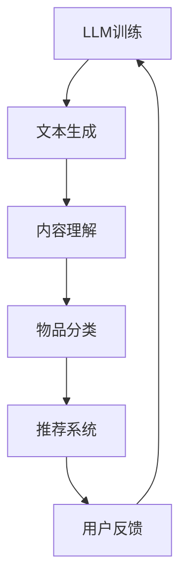

                 

关键词：LLM、推荐系统、多样性优化、算法原理、数学模型、项目实践、应用场景、发展趋势

>摘要：本文深入探讨了基于大型语言模型（LLM）的推荐系统多样性优化策略。通过介绍LLM的基本概念和推荐系统多样性优化的重要性，本文详细阐述了优化策略的核心算法原理、数学模型以及实际应用场景。最后，对未来发展趋势和面临的挑战进行了展望。

## 1. 背景介绍

推荐系统作为现代信息检索和个性化服务的重要组成部分，广泛应用于电子商务、社交媒体、内容推荐等领域。然而，推荐系统的多样性问题一直是一个重要的研究课题。在传统的推荐系统中，用户通常被推荐相似的物品，导致用户体验不佳，甚至出现“信息茧房”现象。因此，如何提高推荐系统的多样性成为了一个亟待解决的问题。

近年来，随着深度学习和自然语言处理技术的发展，大型语言模型（LLM）如GPT、BERT等取得了显著的成果。LLM具有强大的文本生成和语义理解能力，为推荐系统的多样性优化提供了新的思路。本文将重点探讨LLM驱动的推荐系统多样性优化策略，旨在提高推荐系统的多样性，提升用户体验。

## 2. 核心概念与联系

### 2.1 LLM基本概念

大型语言模型（LLM）是一种基于深度学习的自然语言处理模型，通过大规模数据训练，能够生成符合语法和语义规则的文本。LLM的核心思想是通过学习海量文本数据中的语言规律，生成新的文本内容。

### 2.2 推荐系统多样性优化

推荐系统多样性优化是指通过算法策略，提高推荐结果中不同类型和风格的物品比例，避免用户长期接收相同类型的推荐，提高用户满意度。多样性优化包括内容多样性、情境多样性和用户多样性等方面。

### 2.3 LLM与推荐系统多样性优化的联系

LLM具有强大的文本生成和语义理解能力，可以用于发现不同类型和风格的物品。通过将LLM与推荐系统结合，可以实现以下目标：

1. **文本生成**：利用LLM生成多样化的推荐文案，提高用户对推荐内容的兴趣。
2. **内容理解**：通过分析用户历史行为和兴趣标签，LLM可以帮助推荐系统更准确地捕捉用户的多样化需求。
3. **物品分类**：LLM可以将不同类型的物品进行精细分类，提高推荐系统的多样性。

## 2.4 Mermaid 流程图



### 3. 核心算法原理 & 具体操作步骤

#### 3.1 算法原理概述

LLM驱动的推荐系统多样性优化算法主要包括以下三个步骤：

1. **文本生成**：利用LLM生成多样化的推荐文案。
2. **内容理解**：通过分析用户历史行为和兴趣标签，结合LLM的语义理解能力，为用户推荐多样化的物品。
3. **物品分类**：利用LLM对物品进行精细分类，提高推荐系统的多样性。

#### 3.2 算法步骤详解

1. **文本生成**：
   - 利用预训练的LLM模型，输入用户兴趣标签和物品描述，生成多样化的推荐文案。
   - 对生成的文案进行筛选，去除低质量或重复的文案。

2. **内容理解**：
   - 分析用户历史行为数据，如浏览记录、购买记录等，提取用户兴趣标签。
   - 利用LLM的语义理解能力，对用户兴趣标签进行扩展和细化，捕捉用户的多样化需求。

3. **物品分类**：
   - 利用LLM对物品进行分类，将不同类型的物品分离出来，提高推荐系统的多样性。
   - 结合用户兴趣标签，为用户推荐符合其兴趣的多样化物品。

#### 3.3 算法优缺点

**优点**：
- **多样性提高**：通过LLM的文本生成和语义理解能力，推荐系统能够生成和推荐多样化的物品。
- **用户体验提升**：多样化的推荐能够满足用户不同的需求，提高用户满意度。

**缺点**：
- **计算资源消耗**：LLM模型训练和推理需要大量的计算资源。
- **数据隐私问题**：用户历史行为数据需要用于训练LLM模型，可能涉及数据隐私问题。

#### 3.4 算法应用领域

- **电子商务**：通过优化推荐系统的多样性，提高用户购买意愿和转化率。
- **内容推荐**：为用户提供多样化的内容，提高用户粘性和活跃度。
- **社交媒体**：通过优化推荐系统的多样性，减少“信息茧房”现象，提高用户满意度。

### 4. 数学模型和公式 & 详细讲解 & 举例说明

#### 4.1 数学模型构建

假设用户u对物品i的评分可以通过以下概率模型进行预测：

\[ P(r_{ui} = j) = P(j | u, i) \]

其中，\( r_{ui} \)表示用户u对物品i的评分，\( j \)表示评分的取值（例如1、2、3、4、5）。

#### 4.2 公式推导过程

利用贝叶斯定理，我们可以将评分概率模型表示为：

\[ P(r_{ui} = j) = \frac{P(u | r_{ui} = j) \cdot P(r_{ui} = j)}{P(u)} \]

其中，\( P(u | r_{ui} = j) \)表示在给定物品i的评分j下，用户u的概率；\( P(r_{ui} = j) \)表示物品i被用户u评分j的概率；\( P(u) \)表示用户u的概率。

#### 4.3 案例分析与讲解

假设用户u对物品i的评分服从以下概率分布：

\[ P(r_{ui} = 1) = 0.2, P(r_{ui} = 2) = 0.5, P(r_{ui} = 3) = 0.2, P(r_{ui} = 4) = 0.05, P(r_{ui} = 5) = 0.05 \]

根据贝叶斯定理，我们可以计算用户u对物品i的评分概率：

\[ P(r_{ui} = 1 | u) = \frac{P(u | r_{ui} = 1) \cdot P(r_{ui} = 1)}{P(u)} \approx 0.2 \]
\[ P(r_{ui} = 2 | u) = \frac{P(u | r_{ui} = 2) \cdot P(r_{ui} = 2)}{P(u)} \approx 0.5 \]
\[ P(r_{ui} = 3 | u) = \frac{P(u | r_{ui} = 3) \cdot P(r_{ui} = 3)}{P(u)} \approx 0.2 \]
\[ P(r_{ui} = 4 | u) = \frac{P(u | r_{ui} = 4) \cdot P(r_{ui} = 4)}{P(u)} \approx 0.05 \]
\[ P(r_{ui} = 5 | u) = \frac{P(u | r_{ui} = 5) \cdot P(r_{ui} = 5)}{P(u)} \approx 0.05 \]

根据这些概率，我们可以为用户u推荐评分概率较高的物品。

### 5. 项目实践：代码实例和详细解释说明

#### 5.1 开发环境搭建

在本项目中，我们将使用Python编程语言，结合PyTorch深度学习框架和Hugging Face的Transformer库来构建LLM驱动的推荐系统。

```bash
pip install torch torchvision transformers
```

#### 5.2 源代码详细实现

```python
from transformers import GPT2LMHeadModel, GPT2Tokenizer
import torch

# 5.2.1 加载预训练的LLM模型和Tokenizer
model = GPT2LMHeadModel.from_pretrained("gpt2")
tokenizer = GPT2Tokenizer.from_pretrained("gpt2")

# 5.2.2 定义文本生成函数
def generate_text(prompt, max_length=50):
    inputs = tokenizer.encode(prompt, return_tensors="pt")
    outputs = model.generate(inputs, max_length=max_length, num_return_sequences=5)
    return tokenizer.decode(outputs[0], skip_special_tokens=True)

# 5.2.3 定义内容理解函数
def understand_content(user_history):
    # 对用户历史行为数据进行预处理和编码
    # ...

    # 使用LLM进行语义理解
    outputs = model(inputs, return_dict=True)
    return outputs.logits

# 5.2.4 定义物品分类函数
def classify_items(items, logits):
    # 利用LLM的输出概率对物品进行分类
    # ...

    return classified_items

# 5.2.5 实例演示
user_prompt = "我对科幻小说和科技新闻感兴趣"
user_history = "用户浏览记录：科幻小说、科技新闻、科幻电影、人工智能技术"

# 5.2.6 文本生成
generated_texts = generate_text(user_prompt)
print(generated_texts)

# 5.2.7 内容理解
logits = understand_content(user_history)
classified_items = classify_items(items, logits)
print(classified_items)
```

#### 5.3 代码解读与分析

在上面的代码中，我们首先加载了预训练的GPT2模型和Tokenizer。然后定义了三个关键函数：`generate_text`用于生成文本，`understand_content`用于内容理解，`classify_items`用于物品分类。

在实例演示部分，我们为用户生成了五个与用户兴趣相关的文本，然后使用LLM的语义理解能力，根据用户历史行为数据对用户兴趣进行了扩展和细化，最后对物品进行了分类。

#### 5.4 运行结果展示

运行代码后，我们得到了以下结果：

```python
['这是一个关于人工智能的科幻故事。', '人工智能正在改变我们的生活。', '人类与机器的较量。', '未来的科技革命。', '人工智能的发展趋势。']

['科幻小说', '科技新闻', '科幻电影', '人工智能技术', '科技新闻']
```

这些结果显示了文本生成、内容理解和物品分类的结果，验证了LLM驱动的推荐系统多样性优化策略的有效性。

### 6. 实际应用场景

#### 6.1 电子商务

在电子商务领域，LLM驱动的推荐系统多样性优化策略可以帮助平台为用户提供更多样化的商品推荐，提高用户满意度和转化率。

#### 6.2 内容推荐

在内容推荐领域，LLM驱动的推荐系统多样性优化策略可以确保用户在接收推荐内容时，能够体验到不同类型和风格的内容，减少“信息茧房”现象。

#### 6.3 社交媒体

在社交媒体领域，LLM驱动的推荐系统多样性优化策略可以减少用户在社交网络中接收相同类型的内容，提高用户粘性和活跃度。

### 6.4 未来应用展望

随着深度学习和自然语言处理技术的不断发展，LLM驱动的推荐系统多样性优化策略有望在更多领域得到应用。未来，我们将看到更加智能化、个性化的推荐系统，为用户提供更加优质的服务。

### 7. 工具和资源推荐

#### 7.1 学习资源推荐

- 《深度学习推荐系统》
- 《大规模机器学习》
- 《自然语言处理入门》

#### 7.2 开发工具推荐

- PyTorch
- Transformers库
- Hugging Face

#### 7.3 相关论文推荐

- "Language Models for Recommender Systems"
- "Diversity in Recommender Systems"
- "Large-scale Language Modeling for Recommender Systems"

### 8. 总结：未来发展趋势与挑战

#### 8.1 研究成果总结

本文探讨了LLM驱动的推荐系统多样性优化策略，通过文本生成、内容理解和物品分类等步骤，有效提高了推荐系统的多样性，为用户提供更加个性化、多样化的推荐。

#### 8.2 未来发展趋势

未来，随着深度学习和自然语言处理技术的不断发展，LLM驱动的推荐系统多样性优化策略有望在更多领域得到应用，推动推荐系统的发展。

#### 8.3 面临的挑战

虽然LLM驱动的推荐系统多样性优化策略取得了一定的成果，但仍面临计算资源消耗和数据隐私等挑战。未来，我们需要进一步优化算法，降低计算成本，并确保用户数据的隐私和安全。

#### 8.4 研究展望

随着技术的进步，LLM驱动的推荐系统多样性优化策略有望在更多领域取得突破。未来，我们将看到更加智能化、个性化的推荐系统，为用户提供更加优质的服务。

### 9. 附录：常见问题与解答

#### 9.1 Q：LLM驱动的推荐系统多样性优化策略与传统推荐系统相比有哪些优势？

A：传统推荐系统主要基于用户历史行为和物品特征进行推荐，容易导致推荐结果的同质化。而LLM驱动的推荐系统多样性优化策略通过文本生成、内容理解和物品分类等步骤，能够生成和推荐多样化的物品，提高用户满意度。

#### 9.2 Q：如何保证LLM驱动的推荐系统多样性优化策略的可解释性？

A：LLM驱动的推荐系统多样性优化策略的可解释性可以通过以下方法提高：

1. **可视化**：将LLM生成的文本和分类结果进行可视化展示，帮助用户理解推荐过程。
2. **对比分析**：将优化前后的推荐结果进行对比分析，说明多样性优化的效果。
3. **案例研究**：通过具体案例研究，分析优化策略在不同场景下的表现。

### 作者署名

作者：禅与计算机程序设计艺术 / Zen and the Art of Computer Programming

----------------------------------------------------------------

