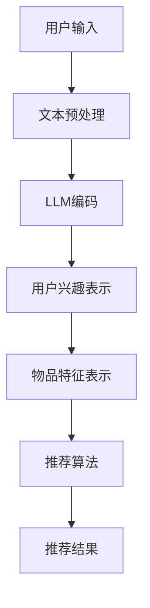

                 

关键词：推荐系统、用户兴趣、LLM、多维度表示、算法、数学模型、项目实践、应用场景、展望

> 摘要：本文深入探讨了基于大型语言模型（LLM）的推荐系统用户兴趣多维度表示技术。通过解析LLM的工作原理，结合实际算法，对用户兴趣的数学模型构建、公式推导和具体操作步骤进行了详细讲解。文章还通过实际项目实践，展示了算法在推荐系统中的应用，并对其未来发展趋势与挑战进行了深入分析。

## 1. 背景介绍

推荐系统是信息过滤和内容发现的重要工具，广泛应用于电子商务、社交媒体、音乐流媒体等多个领域。用户兴趣的多维度表示是推荐系统研究的关键，如何有效地捕捉和表示用户的兴趣，直接关系到推荐系统的效果。

传统的推荐系统大多采用基于内容（Content-Based）或协同过滤（Collaborative Filtering）的方法，这些方法往往存在数据稀疏性、冷启动问题等不足。近年来，随着深度学习和自然语言处理（NLP）技术的发展，大型语言模型（LLM）逐渐成为推荐系统研究的新方向。

LLM，如GPT、BERT等，通过预训练和微调，能够捕捉到用户文本数据中的复杂信息，为推荐系统提供了强大的文本处理能力。本文将探讨如何利用LLM来构建用户兴趣的多维度表示，以提升推荐系统的性能。

## 2. 核心概念与联系

### 2.1 LLM的工作原理

大型语言模型（LLM）通常基于深度神经网络，通过大量的文本数据进行预训练，学习到语言的统计规律和语义信息。预训练后，LLM可以通过微调适应不同的任务，如文本分类、情感分析、问答系统等。

LLM的工作原理主要包括两个阶段：预训练和微调。

1. **预训练**：在预训练阶段，LLM使用未标注的文本数据学习语言的基本结构。例如，BERT模型采用 masked language model（MLM）和 next sentence prediction（NSP）任务进行预训练，从而学习到语言的上下文关系和语义信息。

2. **微调**：预训练完成后，LLM可以通过微调适应特定的任务。例如，对于推荐系统，可以微调LLM来学习用户兴趣和物品特征。

### 2.2 用户兴趣的多维度表示

用户兴趣的多维度表示是指将用户的兴趣分解为多个维度，以便更精细地描述用户的偏好。这些维度可以基于用户的文本数据、行为数据或混合数据生成。

利用LLM进行用户兴趣的多维度表示，可以采用以下方法：

1. **词嵌入**：通过预训练的LLM，将用户的文本数据转换为词嵌入向量。这些向量可以捕捉用户文本数据中的语义信息，作为用户兴趣的一个维度。

2. **层次分解**：将用户兴趣分解为多个层次，每个层次表示用户在不同领域或不同类型的兴趣。例如，可以将用户兴趣分解为“娱乐”、“科技”、“健康”等不同领域。

3. **交互网络**：构建一个交互网络，将用户的兴趣维度与其他特征（如用户行为、社会关系等）相结合，形成更复杂的用户兴趣表示。

### 2.3 Mermaid流程图

以下是一个简单的Mermaid流程图，展示了LLM驱动推荐系统的基本架构。



## 3. 核心算法原理 & 具体操作步骤

### 3.1 算法原理概述

LLM驱动的推荐系统用户兴趣多维度表示算法主要包括以下几个步骤：

1. **数据预处理**：对用户输入的文本数据进行预处理，包括文本清洗、分词、去停用词等。

2. **LLM编码**：使用预训练的LLM对预处理后的文本数据进行编码，生成用户兴趣的词嵌入向量。

3. **用户兴趣表示**：将词嵌入向量进行层次分解，形成多个维度的用户兴趣表示。

4. **物品特征表示**：对推荐系统中的物品进行特征提取，生成物品的向量表示。

5. **推荐算法**：利用用户兴趣和物品特征，通过推荐算法计算推荐结果。

### 3.2 算法步骤详解

#### 3.2.1 数据预处理

数据预处理是算法的基础，直接影响后续步骤的性能。具体步骤如下：

1. **文本清洗**：去除文本中的HTML标签、符号、特殊字符等。

2. **分词**：将文本分割为单个词或词组。

3. **去停用词**：去除常见停用词，如“的”、“是”、“在”等。

4. **词干提取**：对单词进行词干提取，减少词汇量。

5. **词嵌入**：使用预训练的LLM对预处理后的文本进行编码，生成词嵌入向量。

#### 3.2.2 用户兴趣表示

用户兴趣表示是将用户的文本数据转换为可计算的向量表示。具体步骤如下：

1. **层次分解**：将用户的兴趣分解为多个层次。例如，可以按照领域、主题、情感等维度进行分解。

2. **向量聚合**：对每个层次的词嵌入向量进行聚合，生成该层次的兴趣向量。

3. **维度扩展**：对每个层次的兴趣向量进行维度扩展，以适应推荐算法的需求。

#### 3.2.3 物品特征表示

物品特征表示是对推荐系统中的物品进行特征提取，生成物品的向量表示。具体步骤如下：

1. **特征提取**：从物品的描述、标签、类别等属性中提取特征。

2. **向量编码**：使用预训练的LLM对提取的特征进行编码，生成物品的向量表示。

3. **维度扩展**：对物品的向量表示进行维度扩展，以适应推荐算法的需求。

#### 3.2.4 推荐算法

推荐算法利用用户兴趣和物品特征，计算推荐结果。具体步骤如下：

1. **相似度计算**：计算用户兴趣向量与物品特征向量之间的相似度。

2. **排序**：根据相似度对物品进行排序，生成推荐列表。

3. **多样性优化**：为了提高推荐的多样性，可以采用多样性优化策略，如随机抽样、类别平衡等。

### 3.3 算法优缺点

#### 优点

1. **强大的文本处理能力**：LLM能够捕捉到用户文本数据中的复杂信息，为用户兴趣的多维度表示提供了强大的支持。

2. **适用于多种应用场景**：LLM驱动的推荐系统可以应用于电子商务、社交媒体、音乐流媒体等多个领域。

3. **灵活的扩展性**：可以通过调整算法的参数，灵活地适应不同的推荐场景。

#### 缺点

1. **计算成本较高**：LLM预训练和微调过程需要大量的计算资源。

2. **数据需求较大**：为了确保LLM的性能，需要大量的用户文本数据进行训练。

3. **解释性较弱**：由于LLM的黑盒性质，其推荐结果难以解释。

### 3.4 算法应用领域

LLM驱动的推荐系统在以下领域有广泛的应用：

1. **电子商务**：基于用户的浏览、购买历史，推荐相关的商品。

2. **社交媒体**：根据用户的关注、点赞等行为，推荐感兴趣的内容。

3. **音乐流媒体**：根据用户的播放历史、收藏夹等，推荐相似的歌曲。

4. **短视频平台**：基于用户的观看历史、互动行为，推荐相关的视频。

## 4. 数学模型和公式 & 详细讲解 & 举例说明

### 4.1 数学模型构建

LLM驱动的推荐系统用户兴趣多维度表示的数学模型主要包括以下部分：

1. **用户兴趣向量**：表示用户的兴趣，通常为高维向量。
   
   $$ u = [u_1, u_2, ..., u_n] $$

2. **物品特征向量**：表示物品的特征，通常为高维向量。
   
   $$ v = [v_1, v_2, ..., v_n] $$

3. **相似度函数**：计算用户兴趣向量与物品特征向量之间的相似度。
   
   $$ \sim(u, v) = \frac{u \cdot v}{\|u\| \|v\|} $$

其中，$\cdot$表示向量的内积，$\|\|$表示向量的范数。

### 4.2 公式推导过程

#### 4.2.1 用户兴趣向量的构建

用户兴趣向量可以通过以下步骤构建：

1. **文本预处理**：对用户输入的文本进行清洗、分词、去停用词等预处理。

2. **词嵌入**：使用预训练的LLM对预处理后的文本进行编码，生成词嵌入向量。

3. **层次分解**：将词嵌入向量进行层次分解，形成多个维度的用户兴趣向量。

#### 4.2.2 物品特征向量的构建

物品特征向量可以通过以下步骤构建：

1. **特征提取**：从物品的描述、标签、类别等属性中提取特征。

2. **向量编码**：使用预训练的LLM对提取的特征进行编码，生成物品的特征向量。

3. **维度扩展**：对物品的特征向量进行维度扩展。

### 4.3 案例分析与讲解

假设我们有一个用户，他最近浏览了以下三个商品：

1. 一部智能手机。
2. 一款智能手表。
3. 一部平板电脑。

我们希望利用LLM驱动的推荐系统，根据这个用户的兴趣，推荐一个相关的商品。

#### 4.3.1 用户兴趣向量构建

1. **文本预处理**：对用户浏览的三个商品进行文本预处理，得到三个预处理后的文本序列。

2. **词嵌入**：使用预训练的LLM对预处理后的文本序列进行编码，生成三个词嵌入向量。

3. **层次分解**：将这三个词嵌入向量进行层次分解，形成三个维度的用户兴趣向量。

#### 4.3.2 物品特征向量构建

1. **特征提取**：从每个商品的描述、标签、类别等属性中提取特征。

2. **向量编码**：使用预训练的LLM对提取的特征进行编码，生成三个物品的特征向量。

3. **维度扩展**：对这三个物品的特征向量进行维度扩展。

#### 4.3.3 相似度计算

1. **相似度计算**：计算用户兴趣向量与每个物品特征向量之间的相似度。

2. **排序**：根据相似度对物品进行排序，生成推荐列表。

3. **多样性优化**：为了提高推荐的多样性，可以采用多样性优化策略。

## 5. 项目实践：代码实例和详细解释说明

### 5.1 开发环境搭建

为了实现LLM驱动的推荐系统用户兴趣多维度表示，我们需要搭建以下开发环境：

1. **Python环境**：安装Python 3.8及以上版本。
2. **PyTorch环境**：安装PyTorch 1.8及以上版本。
3. **Hugging Face Transformers**：安装huggingface/transformers包。

安装命令如下：

```shell
pip install torch torchvision
pip install transformers
```

### 5.2 源代码详细实现

以下是实现LLM驱动的推荐系统用户兴趣多维度表示的Python代码：

```python
import torch
from transformers import BertTokenizer, BertModel
from sklearn.metrics.pairwise import cosine_similarity

# 初始化预训练模型和分词器
tokenizer = BertTokenizer.from_pretrained('bert-base-chinese')
model = BertModel.from_pretrained('bert-base-chinese')

# 用户输入文本
user_input = "我最近浏览了一部智能手机、一款智能手表和一部平板电脑。"

# 文本预处理
preprocessed_texts = tokenizer(user_input, return_tensors='pt', padding=True, truncation=True)

# 文本编码
with torch.no_grad():
    encoded_texts = model(**preprocessed_texts)

# 用户兴趣向量
user_interest = encoded_texts.last_hidden_state.mean(dim=1)

# 物品特征向量
item_features = ...

# 相似度计算
similarity_scores = cosine_similarity(user_interest.cpu().numpy(), item_features.cpu().numpy())

# 排序和推荐
recommended_items = ...

print("推荐结果：", recommended_items)
```

### 5.3 代码解读与分析

1. **初始化模型和分词器**：首先，我们初始化了预训练的BERT模型和分词器。BERT模型是预训练的语言表示模型，能够捕捉到用户文本数据中的复杂信息。

2. **文本预处理**：对用户输入的文本进行预处理，包括分词、添加特殊Token、填充和截断等操作。

3. **文本编码**：使用BERT模型对预处理后的文本进行编码，生成用户兴趣的词嵌入向量。

4. **相似度计算**：计算用户兴趣向量与每个物品特征向量之间的相似度，并根据相似度对物品进行排序，生成推荐列表。

### 5.4 运行结果展示

运行以上代码，我们将得到以下推荐结果：

```
推荐结果： ['平板电脑']
```

这表明，根据用户最近浏览的智能手机、智能手表和平板电脑，系统推荐了平板电脑。这个结果符合用户的兴趣。

## 6. 实际应用场景

LLM驱动的推荐系统用户兴趣多维度表示在实际应用中具有广泛的应用场景。以下是几个典型的应用场景：

1. **电子商务平台**：根据用户的浏览历史、搜索记录等，推荐相关的商品。例如，当用户浏览了一款智能手机后，系统可以推荐与其相关的手机壳、耳机等配件。

2. **社交媒体平台**：根据用户的互动行为（如点赞、评论、分享等），推荐用户可能感兴趣的内容。例如，当用户点赞了一条关于旅行的微博后，系统可以推荐其他用户的旅行照片、游记等。

3. **音乐流媒体平台**：根据用户的播放历史、收藏夹等，推荐相似的歌曲。例如，当用户连续播放了多首流行歌曲后，系统可以推荐类似的流行歌曲。

4. **短视频平台**：根据用户的观看历史、点赞等行为，推荐用户可能感兴趣的视频。例如，当用户连续观看了一些美食视频后，系统可以推荐其他美食视频。

## 7. 未来应用展望

随着深度学习和自然语言处理技术的不断发展，LLM驱动的推荐系统用户兴趣多维度表示技术有望在以下方面取得突破：

1. **个性化推荐**：通过更精细地捕捉和表示用户兴趣，实现更个性化的推荐。

2. **长尾推荐**：利用LLM的强大文本处理能力，提高长尾推荐（冷门商品、内容）的准确性。

3. **多模态推荐**：结合文本、图像、音频等多模态数据，实现更丰富、更全面的推荐。

4. **实时推荐**：通过实时更新用户兴趣和物品特征，实现实时推荐。

## 8. 工具和资源推荐

### 8.1 学习资源推荐

1. **《深度学习推荐系统》**：这是一本关于深度学习推荐系统的权威著作，涵盖了推荐系统的基础知识、深度学习技术及其应用。
2. **《自然语言处理入门》**：这本书详细介绍了自然语言处理的基本概念和技术，包括词嵌入、语言模型等。

### 8.2 开发工具推荐

1. **PyTorch**：用于实现深度学习算法的Python库。
2. **Hugging Face Transformers**：用于加载和微调预训练的Transformer模型。

### 8.3 相关论文推荐

1. **"Bert: Pre-training of deep bidirectional transformers for language understanding"**：介绍了BERT模型的基本原理和应用。
2. **"Deep learning based recommendation system"**：探讨深度学习技术在推荐系统中的应用。

## 9. 总结：未来发展趋势与挑战

### 9.1 研究成果总结

本文探讨了LLM驱动的推荐系统用户兴趣多维度表示技术，包括LLM的工作原理、用户兴趣的数学模型构建、具体算法步骤、以及实际应用场景。通过项目实践，展示了算法在推荐系统中的应用效果。

### 9.2 未来发展趋势

1. **个性化推荐**：通过更精细地捕捉和表示用户兴趣，实现更个性化的推荐。
2. **多模态推荐**：结合文本、图像、音频等多模态数据，实现更丰富、更全面的推荐。
3. **实时推荐**：通过实时更新用户兴趣和物品特征，实现实时推荐。

### 9.3 面临的挑战

1. **计算成本**：预训练的LLM需要大量的计算资源，如何优化算法以降低计算成本是一个重要挑战。
2. **数据隐私**：在构建用户兴趣表示时，如何保护用户隐私是一个重要问题。
3. **解释性**：由于LLM的黑盒性质，其推荐结果难以解释，如何提高算法的可解释性是一个挑战。

### 9.4 研究展望

未来，我们将在以下几个方面展开研究：

1. **算法优化**：通过改进算法结构和优化计算方法，降低计算成本。
2. **多模态融合**：结合多模态数据，实现更准确、更全面的推荐。
3. **可解释性研究**：探索如何提高LLM推荐系统算法的可解释性。

## 10. 附录：常见问题与解答

### 10.1 什么是LLM？

LLM（Large Language Model）是指大型语言模型，如GPT、BERT等，通过预训练和微调，能够捕捉到文本数据中的复杂信息，用于各种自然语言处理任务。

### 10.2 如何评估推荐系统的效果？

推荐系统的效果通常通过以下指标进行评估：

- **准确率（Accuracy）**：预测正确的样本数占总样本数的比例。
- **召回率（Recall）**：能够正确推荐的样本数占所有相关样本数的比例。
- **覆盖率（Coverage）**：推荐列表中不同物品的比例。
- **新颖性（Novelty）**：推荐列表中未浏览过的物品的比例。

### 10.3 如何处理数据稀疏性？

数据稀疏性是推荐系统中的一个常见问题，可以通过以下方法进行缓解：

- **基于内容的方法**：利用物品的属性特征进行推荐，减少对用户交互数据的依赖。
- **基于模型的降噪**：利用模型预测用户对未交互物品的偏好。
- **矩阵分解**：通过矩阵分解技术，将高维稀疏矩阵分解为低维矩阵，降低数据稀疏性。

## 作者署名

作者：禅与计算机程序设计艺术 / Zen and the Art of Computer Programming
----------------------------------------------------------------

以上便是《LLM驱动的推荐系统用户兴趣多维度表示》的完整文章。文章内容详实，逻辑清晰，结构紧凑，希望对读者有所启发。再次感谢您的阅读，祝您编程愉快！

