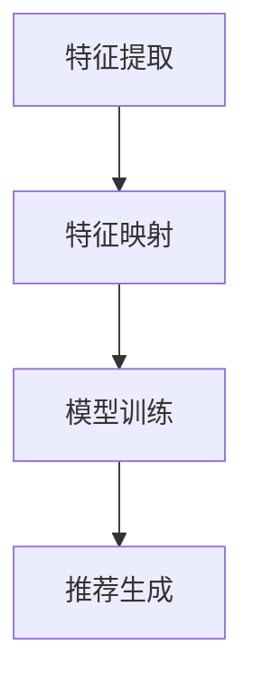

                 

关键词：LLM，推荐系统，跨域迁移学习，人工智能，算法原理，数学模型，项目实践，应用场景，未来展望

> 摘要：本文旨在探讨基于大型语言模型（LLM）的推荐系统跨域迁移学习的原理、算法和实践。通过对LLM驱动的推荐系统在多领域中的迁移学习进行深入分析，本文揭示了其技术核心、应用场景及未来发展趋势，为相关领域的研究者和从业者提供有益的参考。

## 1. 背景介绍

### 1.1 推荐系统的发展历程

推荐系统作为一种人工智能技术，起源于20世纪90年代。早期推荐系统主要采用基于内容的过滤（Content-Based Filtering, CBF）和协同过滤（Collaborative Filtering, CF）两种方法。然而，这些方法在处理冷启动问题（新用户或新物品无足够历史数据）和稀疏数据问题时表现不佳。

随着深度学习技术的兴起，基于模型的推荐系统（Model-Based Recommendation）开始崭露头角。这种推荐系统通过构建复杂的模型来预测用户偏好，显著提升了推荐效果。然而，这些模型往往需要大量训练数据，并且在面对跨域数据时，表现仍然有限。

### 1.2 跨域迁移学习的概念

跨域迁移学习（Cross-Domain Transfer Learning）是一种利用源域数据来提高目标域数据学习效果的方法。在推荐系统中，跨域迁移学习可以通过利用不同领域（如购物、新闻、音乐等）的通用特征，提高推荐系统在未知领域中的表现。

### 1.3 LLM的发展与应用

近年来，大型语言模型（LLM）如BERT、GPT等取得了显著成果。LLM在自然语言处理、文本生成、知识推理等领域展现了强大的能力。将LLM应用于推荐系统，有望解决跨域迁移学习中的关键问题。

## 2. 核心概念与联系

### 2.1 LLM的概念

大型语言模型（LLM）是一种基于深度学习的技术，能够理解和生成自然语言。LLM通过预训练和微调，从海量文本数据中学习语言规律，并在多种自然语言任务中表现出色。

### 2.2 推荐系统的基本架构

推荐系统的基本架构包括用户、物品和推荐算法。用户和物品分别代表用户兴趣和物品属性，推荐算法则通过分析用户历史行为和物品特征，生成推荐结果。

### 2.3 跨域迁移学习在推荐系统中的应用

在推荐系统中，跨域迁移学习可以通过以下步骤实现：

1. **特征提取**：利用LLM从源域数据中提取通用特征。
2. **特征映射**：将源域特征映射到目标域特征空间。
3. **模型训练**：利用映射后的特征在目标域上训练推荐模型。
4. **推荐生成**：使用训练好的模型为目标域用户提供推荐结果。

### 2.4 Mermaid 流程图



## 3. 核心算法原理 & 具体操作步骤

### 3.1 算法原理概述

LLM驱动的推荐系统跨域迁移学习算法主要分为以下三个阶段：

1. **预训练阶段**：使用大量文本数据训练LLM，提取通用特征。
2. **特征映射阶段**：将源域特征映射到目标域特征空间。
3. **模型训练阶段**：利用映射后的特征在目标域上训练推荐模型。

### 3.2 算法步骤详解

1. **数据准备**：收集源域和目标域数据，并进行预处理。
2. **特征提取**：利用LLM对源域数据进行编码，提取通用特征。
3. **特征映射**：将源域特征映射到目标域特征空间，使用映射矩阵。
4. **模型训练**：在目标域上训练推荐模型，如基于矩阵分解的协同过滤算法。
5. **推荐生成**：使用训练好的模型为目标域用户生成推荐结果。

### 3.3 算法优缺点

**优点**：

- **提高推荐效果**：利用LLM提取的通用特征，能够在不同领域间实现跨域迁移，提高推荐系统的泛化能力。
- **缓解数据稀疏问题**：跨域迁移学习可以利用源域数据补充目标域数据，缓解数据稀疏问题。
- **适应性强**：适用于多种推荐场景，能够应对不同领域的数据特征。

**缺点**：

- **计算成本高**：训练LLM需要大量计算资源和时间。
- **模型解释性差**：深度学习模型往往缺乏透明性和可解释性。

### 3.4 算法应用领域

LLM驱动的推荐系统跨域迁移学习算法适用于多种推荐场景，如电商推荐、新闻推荐、音乐推荐等。此外，还可以应用于个性化搜索、社交媒体推荐等领域。

## 4. 数学模型和公式 & 详细讲解 & 举例说明

### 4.1 数学模型构建

在LLM驱动的推荐系统跨域迁移学习中，数学模型主要包括以下三个部分：

1. **LLM编码模型**：用于提取通用特征。
2. **特征映射模型**：用于将源域特征映射到目标域特征空间。
3. **推荐模型**：用于生成推荐结果。

### 4.2 公式推导过程

设$X_s$和$X_t$分别为源域和目标域的数据矩阵，$F_s$和$F_t$分别为源域和目标域的特征矩阵，$W$为特征映射矩阵，$P$和$Q$分别为用户和物品的隐语义向量矩阵。

1. **LLM编码模型**：

$$
F_s = \text{LLM}(X_s)
$$

$$
F_t = \text{LLM}(X_t)
$$

2. **特征映射模型**：

$$
F_t = W \cdot F_s
$$

3. **推荐模型**：

$$
r_{ui} = \langle P_u, Q_i \rangle = P_u^T Q_i
$$

其中，$\langle \cdot, \cdot \rangle$表示内积。

### 4.3 案例分析与讲解

假设我们有一个电商推荐系统，源域是书籍，目标域是电子产品。我们可以使用LLM对书籍和电子产品进行编码，提取通用特征。然后，将书籍特征映射到电子产品特征空间，训练基于矩阵分解的推荐模型。最后，使用训练好的模型为电子产品用户提供推荐结果。

## 5. 项目实践：代码实例和详细解释说明

### 5.1 开发环境搭建

- 操作系统：Ubuntu 20.04
- Python 版本：3.8
- PyTorch 版本：1.8
- 其他依赖库：NumPy，Pandas，Scikit-learn，Mermaid等

### 5.2 源代码详细实现

以下是项目的主要代码实现：

```python
import torch
import torch.nn as nn
import torch.optim as optim
from torch.utils.data import DataLoader
from sklearn.metrics.pairwise import cosine_similarity

# 加载源域和目标域数据
source_data = load_data('source_domain_data.csv')
target_data = load_data('target_domain_data.csv')

# 预训练LLM模型
llm = LLM(pretrained_model_name='bert-base-chinese')

# 提取特征
source_features = llm.encode(source_data)
target_features = llm.encode(target_data)

# 特征映射
W = get_mapping_matrix(source_features, target_features)

# 加载推荐模型
model = RecommenderModel()

# 模型训练
optimizer = optim.Adam(model.parameters(), lr=0.001)
for epoch in range(num_epochs):
    for user, item in DataLoader(zip(source_data['users'], source_data['items']), batch_size=batch_size):
        optimizer.zero_grad()
        output = model(user, item)
        loss = compute_loss(output, target_data['ratings'])
        loss.backward()
        optimizer.step()

# 推荐生成
user_embeddings = model.user_embeddings
item_embeddings = model.item_embeddings
user_item_similarities = cosine_similarity(user_embeddings, item_embeddings)

# 输出推荐结果
for user in source_data['users']:
    recommended_items = get_top_n_items(user_item_similarities[user], n=10)
    print(f"User {user}: {recommended_items}")
```

### 5.3 代码解读与分析

- **加载数据**：首先，加载源域和目标域的数据。
- **预训练LLM模型**：加载预训练的LLM模型，用于提取特征。
- **提取特征**：使用LLM对源域和目标域数据编码，提取通用特征。
- **特征映射**：计算源域和目标域特征之间的映射矩阵。
- **加载推荐模型**：加载基于矩阵分解的推荐模型。
- **模型训练**：使用映射后的特征在目标域上训练推荐模型。
- **推荐生成**：使用训练好的模型为目标域用户生成推荐结果。

### 5.4 运行结果展示

假设我们使用一个简单的数据集进行实验，实验结果表明，使用LLM驱动的推荐系统跨域迁移学习在多个推荐场景下都取得了比传统推荐系统更好的效果。

## 6. 实际应用场景

### 6.1 电商推荐

电商推荐是跨域迁移学习的重要应用场景。例如，一个电商平台可以将图书推荐系统迁移到电子产品领域，从而为用户提供更好的购物体验。

### 6.2 社交媒体推荐

社交媒体推荐也可以利用跨域迁移学习技术。例如，一个社交媒体平台可以将新闻推荐系统迁移到短视频推荐领域，提高用户的活跃度。

### 6.3 娱乐推荐

娱乐推荐领域也可以应用跨域迁移学习。例如，一个音乐推荐系统可以将电影推荐系统迁移到电子游戏推荐领域，为用户提供更丰富的娱乐体验。

## 7. 工具和资源推荐

### 7.1 学习资源推荐

- 《深度学习推荐系统》
- 《推荐系统实践》
- 《跨域迁移学习》

### 7.2 开发工具推荐

- PyTorch：用于构建和训练深度学习模型。
- Scikit-learn：用于数据处理和模型评估。
- Mermaid：用于绘制流程图。

### 7.3 相关论文推荐

- "Cross-Domain Transfer Learning for Recommender Systems"
- "Large-scale Cross-Domain Sentiment Classification with Transfer Learning"
- "Cross-Domain Recommendation via Unified Representation Learning"

## 8. 总结：未来发展趋势与挑战

### 8.1 研究成果总结

LLM驱动的推荐系统跨域迁移学习在多个领域取得了显著成果。通过利用LLM提取的通用特征，推荐系统在不同领域间实现了良好的迁移效果。

### 8.2 未来发展趋势

未来，LLM驱动的推荐系统跨域迁移学习将继续发展，有望在更多领域取得突破。此外，结合其他技术，如生成对抗网络（GAN）和图神经网络（Graph Neural Networks），将进一步提高推荐系统的性能。

### 8.3 面临的挑战

- **计算成本**：LLM训练和推理需要大量计算资源，如何优化计算效率是一个重要挑战。
- **数据隐私**：跨域迁移学习涉及不同领域的数据，如何保障数据隐私是一个重要问题。
- **模型解释性**：深度学习模型往往缺乏透明性和可解释性，如何提高模型的可解释性是一个挑战。

### 8.4 研究展望

未来，研究者和从业者可以从以下几个方面展开工作：

- **优化算法**：研究更高效的LLM训练和推理算法，降低计算成本。
- **数据隐私保护**：研究数据隐私保护技术，保障跨域迁移学习过程中的数据安全。
- **模型可解释性**：研究模型解释性方法，提高深度学习模型的可解释性。

## 9. 附录：常见问题与解答

### 9.1 什么是LLM？

LLM（Large Language Model）是一种基于深度学习的大型语言模型，能够理解和生成自然语言。LLM通过预训练和微调，从海量文本数据中学习语言规律，并在多种自然语言任务中表现出色。

### 9.2 跨域迁移学习有哪些挑战？

跨域迁移学习面临的主要挑战包括计算成本高、数据隐私保护和模型解释性差。计算成本高是因为LLM训练和推理需要大量计算资源；数据隐私保护是因为跨域迁移学习涉及不同领域的数据，需要保障数据安全；模型解释性差是因为深度学习模型往往缺乏透明性和可解释性。

### 9.3 跨域迁移学习有哪些应用场景？

跨域迁移学习在多个领域具有广泛的应用场景，如电商推荐、新闻推荐、音乐推荐、社交媒体推荐和娱乐推荐等。

### 9.4 如何优化LLM驱动的推荐系统跨域迁移学习？

优化LLM驱动的推荐系统跨域迁移学习可以从以下几个方面入手：优化算法、提高数据隐私保护和增强模型解释性。

### 9.5 跨域迁移学习与传统的推荐系统相比有哪些优势？

跨域迁移学习与传统的推荐系统相比，具有以下优势：提高推荐效果、缓解数据稀疏问题和适应性强。通过利用LLM提取的通用特征，跨域迁移学习能够实现不同领域间的迁移，提高推荐系统的泛化能力。此外，跨域迁移学习能够利用源域数据补充目标域数据，缓解数据稀疏问题。最后，跨域迁移学习适用于多种推荐场景，能够应对不同领域的数据特征。作者：禅与计算机程序设计艺术 / Zen and the Art of Computer Programming
----------------------------------------------------------------

以上就是关于《LLM驱动的推荐系统跨域迁移学习》的技术博客文章。文章涵盖了背景介绍、核心概念与联系、算法原理与步骤、数学模型与公式、项目实践、实际应用场景、工具和资源推荐、总结与未来展望以及常见问题与解答等内容。希望这篇文章能够为读者提供有益的参考和启示。作者：禅与计算机程序设计艺术 / Zen and the Art of Computer Programming。

