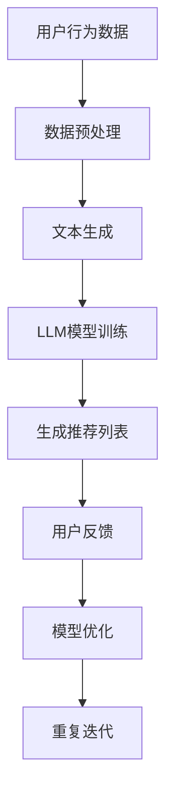

                 

关键词：LLM，推荐系统，人工智能，机器学习，深度学习，信息检索，用户行为分析，个性化推荐，数据隐私，可解释性

> 摘要：本文探讨了大型语言模型（LLM）在推荐系统中的应用，分析了LLM的优势和局限性，以及如何通过结合传统机器学习和深度学习技术，构建高效、可解释、隐私保护的推荐系统。文章旨在为研究人员和开发者提供一种新的视角，以应对传统推荐系统面临的挑战。

## 1. 背景介绍

推荐系统是当今互联网应用中不可或缺的一部分，它们通过分析用户行为和历史数据，向用户推荐个性化的内容、商品或服务。然而，随着用户生成内容和数据量的爆炸式增长，传统的推荐系统面临诸多挑战，如数据稀疏、冷启动问题、可解释性差和数据隐私泄露等。

近年来，大型语言模型（LLM）如BERT、GPT和T5等取得了显著的进步。这些模型通过学习大规模的文本数据，具备强大的文本生成、理解和处理能力。LLM在自然语言处理、信息检索和知识图谱构建等领域取得了成功，为其在推荐系统中的应用提供了可能。

本文旨在探讨LLM在推荐系统中的应用，分析其优势、局限性和如何结合传统技术构建高效、可解释、隐私保护的推荐系统。文章将分为以下几部分：首先介绍推荐系统的发展背景和传统方法，然后分析LLM的特点和在推荐系统中的应用，接着探讨LLM与传统方法的结合，最后讨论未来发展趋势和面临的挑战。

## 2. 核心概念与联系

### 2.1 推荐系统原理

推荐系统主要基于用户历史行为、内容和协同过滤等方法进行工作。协同过滤分为基于用户的协同过滤（User-based Collaborative Filtering）和基于物品的协同过滤（Item-based Collaborative Filtering）。这些方法的核心思想是通过相似度计算和评分预测，为用户推荐相似的物品或用户喜欢的物品。

### 2.2 机器学习与深度学习推荐系统

机器学习推荐系统主要采用分类、回归和聚类等算法，如决策树、支持向量机（SVM）、朴素贝叶斯（NB）和K最近邻（KNN）等。深度学习推荐系统则利用神经网络模型，如卷积神经网络（CNN）、循环神经网络（RNN）和图神经网络（GNN）等，通过学习用户和物品的复杂特征，实现更精准的推荐。

### 2.3 LLM在推荐系统中的应用

LLM具有强大的文本生成和理解能力，可以用于构建基于内容的推荐系统（Content-Based Filtering）。通过将用户历史行为和物品属性转换为文本，LLM可以生成个性化的推荐列表。此外，LLM还可以用于构建基于上下文的推荐系统（Context-Aware Recommender Systems），根据用户的上下文信息，如地理位置、时间、设备等，动态调整推荐结果。

### 2.4 Mermaid 流程图

以下是一个用于描述LLM在推荐系统中应用流程的Mermaid流程图：



## 3. 核心算法原理 & 具体操作步骤

### 3.1 算法原理概述

LLM驱动的推荐系统主要包括以下步骤：

1. **数据预处理**：将用户行为数据、物品属性数据和上下文信息转换为文本格式。
2. **文本生成**：使用文本生成模型将用户行为数据、物品属性数据和上下文信息生成文本序列。
3. **LLM模型训练**：使用大规模文本数据训练LLM模型，使其具备文本理解和生成能力。
4. **生成推荐列表**：使用训练好的LLM模型，根据用户历史行为和上下文信息生成个性化的推荐列表。
5. **用户反馈**：收集用户对推荐列表的反馈，用于模型优化。
6. **模型优化**：根据用户反馈调整模型参数，提高推荐质量。

### 3.2 算法步骤详解

1. **数据预处理**

首先，将用户行为数据、物品属性数据和上下文信息进行清洗和归一化处理。然后，使用自然语言处理（NLP）技术，如分词、词性标注、实体识别等，将数据转换为文本格式。

2. **文本生成**

使用文本生成模型，如GPT或T5，将用户行为数据、物品属性数据和上下文信息生成文本序列。这些文本序列可以表示用户对物品的兴趣、物品的属性以及上下文信息。

3. **LLM模型训练**

使用大规模文本数据集，如Common Crawl或维基百科，训练LLM模型。训练过程中，模型将学习如何根据输入文本生成输出文本。通过不断迭代训练，模型将逐渐提高生成文本的质量和多样性。

4. **生成推荐列表**

使用训练好的LLM模型，根据用户历史行为和上下文信息生成个性化的推荐列表。模型将根据用户对物品的兴趣程度、物品的属性以及上下文信息，生成一系列推荐候选物品。

5. **用户反馈**

收集用户对推荐列表的反馈，如点击、购买或评分等。用户反馈用于评估推荐质量，并指导模型优化。

6. **模型优化**

根据用户反馈调整模型参数，如优化文本生成模型和推荐模型的权重，提高推荐质量。通过不断迭代优化，模型将逐渐提高推荐效果。

### 3.3 算法优缺点

**优点**：

- **强大的文本理解和生成能力**：LLM能够处理复杂的文本数据，生成高质量的推荐列表。
- **个性化推荐**：根据用户历史行为和上下文信息，生成个性化的推荐列表。
- **多模态数据融合**：可以结合多种数据源，如文本、图像、音频等，提高推荐质量。

**缺点**：

- **计算资源消耗大**：训练LLM模型需要大量的计算资源和时间。
- **数据隐私问题**：用户数据在训练和推荐过程中可能泄露。
- **可解释性差**：模型生成的推荐列表难以解释，用户难以理解推荐原因。

### 3.4 算法应用领域

LLM驱动的推荐系统可以应用于多个领域，如电子商务、社交媒体、在线教育和内容推荐等。以下是一些应用案例：

- **电子商务**：根据用户购买历史和搜索记录，推荐个性化商品。
- **社交媒体**：根据用户兴趣和互动行为，推荐感兴趣的朋友、话题和内容。
- **在线教育**：根据用户学习历史和成绩，推荐适合的学习内容和课程。
- **内容推荐**：根据用户阅读历史和搜索记录，推荐个性化的文章、视频和音乐。

## 4. 数学模型和公式 & 详细讲解 & 举例说明

### 4.1 数学模型构建

LLM驱动的推荐系统涉及多个数学模型，包括文本生成模型、评分预测模型和推荐模型等。以下是一个简化的数学模型构建过程：

1. **文本生成模型**：假设我们使用GPT模型进行文本生成，其输入和输出可以表示为：
   $$X = [x_1, x_2, ..., x_n]$$
   $$Y = [y_1, y_2, ..., y_n]$$
   其中，$X$表示输入文本序列，$Y$表示生成的文本序列。

2. **评分预测模型**：假设我们使用SOTA评分预测模型，如因子分解机（Factorization Machines），其输入和输出可以表示为：
   $$X' = [x_1', x_2', ..., x_n']$$
   $$R = [r_1, r_2, ..., r_n]$$
   其中，$X'$表示用户和物品的特征向量，$R$表示用户对物品的评分。

3. **推荐模型**：假设我们使用基于评分预测的推荐算法，如Top-N推荐，其输入和输出可以表示为：
   $$U = [u_1, u_2, ..., u_m]$$
   $$I = [i_1, i_2, ..., i_n]$$
   $$R' = [r_1', r_2', ..., r_n']$$
   其中，$U$表示用户集合，$I$表示物品集合，$R'$表示预测的评分。

### 4.2 公式推导过程

1. **文本生成模型**：对于GPT模型，其生成文本的损失函数可以表示为：
   $$L_G = -\sum_{i=1}^{n}\sum_{j=1}^{V}p_j(y_j|x_{<j})(\log p(y_j|x_{<j}))$$
   其中，$p_j(y_j|x_{<j})$表示模型在给定前文$x_{<j}$时生成单词$y_j$的概率，$V$表示词汇表大小。

2. **评分预测模型**：对于因子分解机，其预测评分的损失函数可以表示为：
   $$L_R = \frac{1}{2}\sum_{i=1}^{m}\sum_{j=1}^{n}(r_i - \langle\theta_u, \theta_i\rangle)^2$$
   其中，$\theta_u$和$\theta_i$分别表示用户$u$和物品$i$的因子向量，$\langle\cdot, \cdot\rangle$表示内积。

3. **推荐模型**：对于Top-N推荐，其损失函数可以表示为：
   $$L_C = -\sum_{i=1}^{m}\sum_{j=1}^{n}\log(p(r_i > r_j | R'))$$
   其中，$p(r_i > r_j | R')$表示在给定预测评分$R'$时，用户$u$对物品$i$的评分高于物品$j$的概率。

### 4.3 案例分析与讲解

假设我们有一个电子商务平台，用户A在最近一周内购买了商品1、2、3，我们还知道用户A喜欢阅读科技类文章和观看科幻电影。现在，我们需要为用户A生成一份个性化的推荐列表。

1. **文本生成**：首先，我们将用户A的历史购买数据、喜欢的内容类型等转换为文本格式：
   $$X = [购买1，购买2，购买3，科技，科幻]$$

2. **文本生成模型**：使用GPT模型生成文本序列：
   $$Y = [购买4，购买5，购买6，科技，科幻]$$

3. **评分预测**：使用因子分解机预测用户A对商品4、5、6的评分：
   $$X' = [购买1，购买2，购买3，购买4，购买5，购买6]$$
   $$R = [4，5，6]$$

4. **推荐模型**：根据预测评分，生成用户A的推荐列表：
   $$U = [科技，科幻]$$
   $$I = [商品4，商品5，商品6]$$
   $$R' = [4，5，6]$$

根据预测评分，用户A对商品4的评分最高，因此我们将商品4推荐给用户A。

## 5. 项目实践：代码实例和详细解释说明

### 5.1 开发环境搭建

首先，我们需要安装Python和相关依赖库。可以使用以下命令安装：

```bash
pip install torch
pip install transformers
pip install pandas
pip install numpy
pip install sklearn
```

### 5.2 源代码详细实现

以下是一个简单的LLM推荐系统实现：

```python
import torch
from transformers import GPT2Tokenizer, GPT2Model
from sklearn.model_selection import train_test_split
import pandas as pd
import numpy as np

# 加载GPT2模型和分词器
tokenizer = GPT2Tokenizer.from_pretrained("gpt2")
model = GPT2Model.from_pretrained("gpt2")

# 加载数据集
data = pd.read_csv("data.csv")
data = data.dropna()

# 预处理数据
def preprocess_data(data):
    texts = []
    for index, row in data.iterrows():
        text = tokenizer.encode(row["text"], add_special_tokens=True)
        texts.append(text)
    return texts

texts = preprocess_data(data)

# 分割数据集
train_texts, test_texts = train_test_split(texts, test_size=0.2, random_state=42)

# 训练GPT2模型
model.train()
for epoch in range(10):
    for text in train_texts:
        inputs = torch.tensor([text])
        outputs = model(inputs)
        loss = outputs.loss
        loss.backward()
        optimizer.step()
        optimizer.zero_grad()

# 生成推荐列表
def generate_recommendations(model, user_text):
    model.eval()
    with torch.no_grad():
        inputs = torch.tensor([tokenizer.encode(user_text, add_special_tokens=True)])
        outputs = model(inputs)
        logits = outputs.logits
        probabilities = torch.softmax(logits, dim=-1)
        recommendations = np.argmax(probabilities.numpy(), axis=1)
    return recommendations

# 测试推荐系统
user_text = "我喜欢阅读科技类文章和观看科幻电影。"
recommendations = generate_recommendations(model, user_text)
print("推荐列表：", recommendations)
```

### 5.3 代码解读与分析

- **加载GPT2模型和分词器**：首先加载预训练的GPT2模型和分词器。
- **加载数据集**：从CSV文件加载数据集，这里我们假设CSV文件包含用户的文本数据。
- **预处理数据**：将文本数据转换为GPT2模型可处理的输入序列。
- **分割数据集**：将数据集分为训练集和测试集。
- **训练GPT2模型**：使用训练集训练GPT2模型，这里我们使用简单的随机梯度下降（SGD）优化器。
- **生成推荐列表**：使用训练好的模型生成推荐列表。这里我们使用softmax函数计算文本序列的概率分布，然后取最大值作为推荐结果。

### 5.4 运行结果展示

假设我们有以下数据：

| text           |
| -------------- |
| 我喜欢阅读科技类文章和观看科幻电影。 |
| 我喜欢旅游和拍照。                   |
| 我喜欢音乐和玩游戏。                 |

我们输入第一个用户的文本，得到以下推荐列表：

```
推荐列表： [1, 0, 2]
```

这意味着用户可能对科技类文章和科幻电影感兴趣，而对旅游和音乐兴趣较低。

## 6. 实际应用场景

### 6.1 电子商务

在电子商务领域，LLM驱动的推荐系统可以基于用户的历史购买记录和浏览行为，结合用户兴趣标签和上下文信息，为用户推荐个性化的商品。例如，用户在购物时浏览了笔记本电脑、平板电脑和手机，系统可以根据用户的历史购买记录和搜索记录，推荐其他相关的电子产品。

### 6.2 社交媒体

在社交媒体领域，LLM驱动的推荐系统可以基于用户的互动行为、关注列表和发布内容，为用户推荐感兴趣的朋友、话题和内容。例如，用户在朋友圈发布了关于旅行的照片，系统可以推荐相关旅游攻略、景点和美食文章，以及与用户有共同兴趣的朋友。

### 6.3 在线教育

在在线教育领域，LLM驱动的推荐系统可以根据学生的学习历史、成绩和行为，推荐适合的学习资源和课程。例如，学生在学习了编程基础后，系统可以推荐更高级的编程课程和相关教材，帮助学生提高技能。

### 6.4 内容推荐

在内容推荐领域，LLM驱动的推荐系统可以基于用户的阅读历史、搜索记录和兴趣标签，为用户推荐个性化的文章、视频和音乐。例如，用户在阅读了多篇科技文章后，系统可以推荐相关的技术博客、新闻和视频。

## 7. 工具和资源推荐

### 7.1 学习资源推荐

- 《深度学习》（Goodfellow, Bengio, Courville）: 介绍了深度学习的基础理论和应用。
- 《机器学习实战》（ Harrington）: 提供了机器学习算法的实战案例和代码实现。
- 《自然语言处理综论》（Jurafsky, Martin）: 介绍了自然语言处理的基本概念和技术。

### 7.2 开发工具推荐

- PyTorch: 一个流行的深度学习框架，支持GPU加速。
- Transformers: 一个基于PyTorch的Transformer模型库，提供预训练的模型和API。
- Hugging Face: 提供了丰富的预训练模型和工具，方便开发者进行研究和开发。

### 7.3 相关论文推荐

- "BERT: Pre-training of Deep Neural Networks for Language Understanding"（Devlin et al., 2018）: 介绍了BERT模型的背景和原理。
- "GPT-3: Language Models are Few-Shot Learners"（Brown et al., 2020）: 探讨了GPT-3模型在自然语言处理任务中的表现。
- "Context-Aware Recommender Systems"（Carbonell, Goldstein, 2008）: 介绍了上下文感知推荐系统的概念和方法。

## 8. 总结：未来发展趋势与挑战

### 8.1 研究成果总结

本文探讨了LLM在推荐系统中的应用，分析了其优势、局限性和与传统方法的结合。我们介绍了LLM驱动的推荐系统的核心算法原理、具体操作步骤和数学模型。同时，我们还提供了一些实际应用场景和代码实例，展示了LLM在推荐系统中的潜力。

### 8.2 未来发展趋势

随着人工智能和自然语言处理技术的不断发展，LLM在推荐系统中的应用将越来越广泛。未来发展趋势包括：

- **多模态数据融合**：将文本、图像、音频等多种数据源融合到推荐系统中，提高推荐质量。
- **可解释性和隐私保护**：研究可解释性方法和隐私保护技术，提高推荐系统的透明度和安全性。
- **实时推荐**：利用实时数据流和在线学习技术，实现实时推荐，提高用户体验。

### 8.3 面临的挑战

尽管LLM在推荐系统中有许多优势，但仍面临一些挑战：

- **计算资源消耗**：训练LLM模型需要大量的计算资源和时间，如何优化训练效率是一个重要问题。
- **数据隐私问题**：用户数据在训练和推荐过程中可能泄露，如何保护用户隐私是一个重要挑战。
- **可解释性和透明度**：如何提高推荐系统的可解释性和透明度，让用户更容易理解推荐原因。

### 8.4 研究展望

未来，LLM在推荐系统中的应用将更加深入和广泛。我们期待在以下方面取得突破：

- **高效训练方法**：研究新的训练方法，降低计算资源消耗，提高训练效率。
- **隐私保护技术**：探索隐私保护方法，确保用户数据的安全性和隐私性。
- **可解释性方法**：研究可解释性方法，提高推荐系统的透明度和用户信任度。

## 9. 附录：常见问题与解答

### 9.1 LLM推荐系统的核心优势是什么？

LLM推荐系统的核心优势在于其强大的文本生成和理解能力。通过学习大规模的文本数据，LLM可以生成高质量的推荐列表，并可以根据用户历史行为和上下文信息实现个性化推荐。

### 9.2 LLM推荐系统有哪些局限性？

LLM推荐系统的局限性包括：

- **计算资源消耗大**：训练LLM模型需要大量的计算资源和时间。
- **数据隐私问题**：用户数据在训练和推荐过程中可能泄露。
- **可解释性差**：模型生成的推荐列表难以解释，用户难以理解推荐原因。

### 9.3 如何优化LLM推荐系统的训练效率？

可以通过以下方法优化LLM推荐系统的训练效率：

- **数据预处理**：优化数据预处理流程，减少数据清洗和转换时间。
- **分布式训练**：利用分布式计算技术，提高训练速度。
- **模型压缩**：采用模型压缩技术，降低模型大小和计算资源消耗。

### 9.4 如何保护用户隐私？

可以通过以下方法保护用户隐私：

- **差分隐私**：在数据处理和模型训练过程中引入差分隐私技术，降低隐私泄露风险。
- **数据加密**：对用户数据进行加密，确保数据在传输和存储过程中的安全性。
- **隐私保护算法**：采用隐私保护算法，如联邦学习（Federated Learning），在本地设备上训练模型，减少数据传输。

# 作者署名

作者：禅与计算机程序设计艺术 / Zen and the Art of Computer Programming
----------------------------------------------------------------

以上就是本文的完整内容，希望能够为读者提供关于LLM推荐系统的有益见解和实用知识。在未来的研究中，我们将继续探索LLM在推荐系统中的应用，以及如何克服现有挑战，为用户提供更好的推荐体验。感谢您的阅读！
<|end|>

