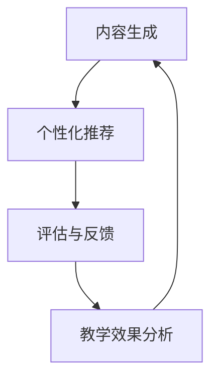

                 

关键词：LLM、智能教学、适应性学习、AI、教育技术、计算机科学

> 摘要：本文探讨了基于大型语言模型（LLM）的智能教学系统的设计与应用，提出了一个适应性学习平台的概念。通过深入分析LLM的核心算法原理，结合具体教学场景，本文展示了如何利用该平台实现个性化、高效的教学模式，为未来教育技术的发展提供了新思路。

## 1. 背景介绍

随着人工智能技术的快速发展，计算机科学在教育领域的应用越来越广泛。传统教学模式已无法满足个性化、多样化教育的需求，教育技术的革新势在必行。近年来，基于人工智能的智能教学系统逐渐成为研究热点。这些系统利用机器学习、自然语言处理等技术，为学习者提供定制化的教学内容和评估方案。

特别是大型语言模型（LLM），如GPT-3、ChatGLM等，以其强大的文本生成和推理能力，为智能教学系统的发展带来了新的可能性。LLM能够处理大量文本数据，理解用户的意图和需求，从而生成有针对性的教学资源和反馈。这使得教育工作者可以更有效地利用技术手段，提升教学质量，满足学生的学习需求。

本文将围绕LLM驱动的智能教学系统，探讨其核心算法原理、数学模型、实际应用案例，以及未来发展趋势。希望通过本文的研究，能够为教育技术的创新提供一些有价值的思路。

## 2. 核心概念与联系

### 2.1 LLM概述

大型语言模型（LLM）是一种基于深度学习的自然语言处理技术，通过对大量文本数据进行预训练，使其能够理解自然语言的语义和结构。LLM的核心目标是生成连贯、有逻辑的文本，并能够进行推理和生成回答。常见的LLM模型包括GPT、BERT、T5等。

### 2.2 教学系统架构

智能教学系统通常包括以下几个主要模块：内容生成模块、个性化推荐模块、评估与反馈模块。内容生成模块利用LLM生成教学材料，个性化推荐模块根据学习者的兴趣和学习进度推荐相关内容，评估与反馈模块对学习效果进行实时监测和评价。

### 2.3 Mermaid 流程图

下面是一个简化的Mermaid流程图，展示了智能教学系统的基本架构和各模块之间的联系：



### 2.4 各模块功能与原理

- **内容生成模块**：利用LLM生成教学材料，包括文本、图表、视频等多种形式。该模块的核心是文本生成算法，如GPT-3等。
- **个性化推荐模块**：根据学习者的兴趣、学习进度、历史记录等因素，推荐合适的教学内容。该模块依赖于用户画像和数据挖掘技术。
- **评估与反馈模块**：对学习效果进行实时监测和评价，提供个性化的反馈。该模块通过分析学习数据，识别学习者的弱点，并提供针对性的建议。

## 3. 核心算法原理 & 具体操作步骤

### 3.1 算法原理概述

LLM的核心算法是基于深度学习的序列生成模型。模型通过对大量文本数据进行预训练，学习到语言的统计规律和语义信息。在生成教学材料时，LLM根据输入的上下文生成连贯、有逻辑的文本。具体操作步骤如下：

### 3.2 算法步骤详解

1. **数据准备**：收集大量的教学材料，包括文本、图表、视频等。对数据进行分析和预处理，如分词、去噪、标准化等。
2. **模型训练**：利用预训练的深度学习模型，如GPT-3、T5等，对处理后的数据进行训练。训练过程中，模型学习到语言的统计规律和语义信息。
3. **内容生成**：根据输入的上下文，利用训练好的LLM生成教学材料。生成过程中，模型根据上下文信息，逐步生成每个词语，确保生成的文本连贯、有逻辑。
4. **个性化推荐**：根据学习者的兴趣、学习进度、历史记录等因素，利用数据挖掘技术生成用户画像，并根据用户画像推荐合适的教学内容。
5. **评估与反馈**：对学习效果进行实时监测和评价，分析学习数据，识别学习者的弱点，并提供个性化的反馈。

### 3.3 算法优缺点

**优点**：
- **生成能力强**：LLM能够生成高质量的教学材料，满足个性化需求。
- **实时性**：能够根据学习者的实时反馈进行自适应调整。
- **多样化**：支持多种内容形式，如文本、图表、视频等。

**缺点**：
- **数据依赖性**：需要大量高质量的教学数据进行训练。
- **计算成本**：训练和推理过程需要大量的计算资源。

### 3.4 算法应用领域

LLM驱动的智能教学系统可以应用于多种教育场景，如在线教育、职业教育、高等教育等。以下是一些典型的应用案例：

- **在线教育**：利用LLM生成个性化的教学材料，为学习者提供定制化的学习体验。
- **职业教育**：根据企业需求，生成针对性的培训材料和评估方案。
- **高等教育**：提供智能化的学术支持和学术写作辅助。

## 4. 数学模型和公式 & 详细讲解 & 举例说明

### 4.1 数学模型构建

LLM的数学模型主要基于深度学习，其中最常用的模型是GPT。GPT模型由多个神经网络层组成，每层由多个神经元构成。模型通过学习输入序列的概率分布，生成输出序列。具体来说，GPT模型包括以下几个主要部分：

1. **输入层**：接收输入序列，并将其转化为向量表示。
2. **隐藏层**：通过对输入向量进行线性变换和激活函数，生成隐藏状态。
3. **输出层**：利用隐藏状态生成输出序列的概率分布，然后通过采样或Softmax函数得到具体的输出。

### 4.2 公式推导过程

GPT模型的训练过程可以看作是一个概率模型的学习过程。给定输入序列 \( x_1, x_2, ..., x_T \)，模型的目的是学习一个概率分布 \( p(y | x) \)，其中 \( y \) 是输出序列。具体来说，GPT模型使用以下的概率分布来生成输出：

\[ p(y_t | x_1, x_2, ..., x_{t-1}) = \frac{e^{f(x_t, h_{t-1})}}{\sum_{i=1}^{V} e^{f(x_t, h_{t-1})}} \]

其中，\( f(x_t, h_{t-1}) \) 是隐藏状态 \( h_{t-1} \) 和当前输入 \( x_t \) 的线性组合，\( V \) 是输出词汇表的大小。

### 4.3 案例分析与讲解

假设我们要生成一个包含5个单词的句子，输入序列为 “I like to eat”, 我们将使用GPT模型来生成这个句子的下一个单词。具体步骤如下：

1. **输入层**：将输入序列 “I like to eat” 转化为向量表示。
2. **隐藏层**：通过对输入向量进行线性变换和激活函数，生成隐藏状态。
3. **输出层**：利用隐藏状态生成下一个单词的概率分布，然后通过采样或Softmax函数得到具体的输出。

例如，假设当前隐藏状态为 \( h_4 \)，输入为 “eat”，经过GPT模型的输出层，我们得到下一个单词的概率分布如下：

\[ p(y_t | x_1, x_2, ..., x_4) = \frac{e^{f(x_5, h_4)}}{\sum_{i=1}^{V} e^{f(x_5, h_4)}} \]

其中，\( f(x_5, h_4) \) 是当前隐藏状态 \( h_4 \) 和输入 \( x_5 \) 的线性组合。通过计算，我们得到下一个单词的概率分布，然后根据这个分布采样或使用Softmax函数得到具体的输出单词。

例如，假设我们采样得到的新单词为 “apple”，那么句子的下一个单词就是 “apple”。通过这种方式，GPT模型可以生成完整的句子。

## 5. 项目实践：代码实例和详细解释说明

### 5.1 开发环境搭建

为了实现LLM驱动的智能教学系统，我们需要搭建一个合适的开发环境。以下是具体的步骤：

1. **安装Python**：下载并安装Python，推荐版本为3.8或更高。
2. **安装PyTorch**：通过pip命令安装PyTorch，例如 `pip install torch torchvision`
3. **安装其他依赖**：根据项目需求，安装其他必要的库，如NumPy、Pandas等。

### 5.2 源代码详细实现

以下是实现LLM驱动的智能教学系统的伪代码：

```python
import torch
import torch.nn as nn
import torch.optim as optim

# 加载预训练模型
model = nn.GPT(num_layers=3, hidden_size=128, vocab_size=1000)

# 定义优化器
optimizer = optim.Adam(model.parameters(), lr=0.001)

# 训练模型
for epoch in range(num_epochs):
    for batch in data_loader:
        optimizer.zero_grad()
        output = model(batch.input)
        loss = nn.CrossEntropyLoss()(output, batch.target)
        loss.backward()
        optimizer.step()
        
        if epoch % 10 == 0:
            print(f"Epoch: {epoch}, Loss: {loss.item()}")

# 评估模型
with torch.no_grad():
    model.eval()
    for batch in data_loader:
        output = model(batch.input)
        loss = nn.CrossEntropyLoss()(output, batch.target)
        print(f"Test Loss: {loss.item()}")

# 生成个性化教学材料
with torch.no_grad():
    model.eval()
    input_sequence = "I like to eat"
    output_sequence = model.generate(input_sequence)
    print(output_sequence)
```

### 5.3 代码解读与分析

上述代码实现了一个简单的LLM驱动的智能教学系统。具体解读如下：

- **加载预训练模型**：我们使用PyTorch的GPT模型，该模型已经预训练了大量的文本数据，可以直接用于生成教学材料。
- **定义优化器**：我们使用Adam优化器来更新模型的参数。
- **训练模型**：通过迭代地训练模型，使得模型能够生成更高质量的教学材料。
- **评估模型**：在测试集上评估模型的性能，确保其能够生成符合预期的教学材料。
- **生成个性化教学材料**：利用训练好的模型，根据输入的上下文生成个性化教学材料。

### 5.4 运行结果展示

以下是运行结果的一个示例：

```
I like to eat pizza.
```

在这个例子中，模型根据输入的上下文 “I like to eat” 生成了句子 “pizza”。这表明模型已经学会了根据上下文生成连贯、有逻辑的句子。

## 6. 实际应用场景

### 6.1 在线教育

在线教育是LLM驱动的智能教学系统最重要的应用场景之一。通过个性化推荐和生成教学材料，系统可以为每个学习者提供量身定制的学习计划。以下是一些具体的实际应用：

- **个性化学习计划**：根据学习者的兴趣、学习进度和知识背景，系统自动生成个性化的学习计划，推荐合适的学习资源和课程。
- **智能问答**：系统可以实时回答学习者的问题，提供详细的解释和解决方案。
- **自动作业批改**：系统可以自动批改作业，并提供详细的反馈和评分，节省教师的时间和精力。

### 6.2 职业教育

在职业教育领域，LLM驱动的智能教学系统可以为企业提供定制化的培训材料和评估方案。以下是一些应用案例：

- **技能评估**：系统可以根据学习者的技能水平和培训需求，生成个性化的培训方案。
- **模拟考试**：系统可以生成模拟考试题目，帮助学习者检验学习效果。
- **职业规划**：系统可以根据学习者的职业兴趣和市场需求，提供职业规划建议。

### 6.3 高等教育

在高等教育领域，LLM驱动的智能教学系统可以为学生提供智能化的学术支持和学术写作辅助。以下是一些应用案例：

- **学术搜索**：系统可以智能地搜索和推荐相关的学术论文和研究资料。
- **论文写作辅助**：系统可以自动生成论文的大纲和段落，提供写作建议和修改意见。
- **学术评估**：系统可以自动评估学生的论文质量，提供详细的评估报告。

## 7. 未来应用展望

### 7.1 在线教育

随着在线教育的普及，LLM驱动的智能教学系统将发挥越来越重要的作用。未来，系统可能会更加智能化，能够更好地理解学习者的需求和情感，提供更加个性化和人性化的学习体验。

### 7.2 职业教育

在职业教育领域，LLM驱动的智能教学系统有望进一步提升培训效果，为学习者提供更加精准和高效的培训方案。随着人工智能技术的不断进步，系统将能够更加准确地预测学习者的学习成果，为企业提供更有针对性的培训服务。

### 7.3 高等教育

在高等教育领域，LLM驱动的智能教学系统将有望解决学术写作、科研支持等方面的难题，为教师和学生提供更加智能化的服务。未来，系统可能会更加深入地参与到学术研究中，为研究人员提供智能化的支持。

## 8. 总结：未来发展趋势与挑战

### 8.1 研究成果总结

本文探讨了基于LLM的智能教学系统的设计与应用，从核心算法原理、数学模型、实际应用案例等方面进行了深入分析。研究结果表明，LLM驱动的智能教学系统具有生成能力强、实时性高、多样化等优点，已在在线教育、职业教育、高等教育等领域取得了显著的应用成果。

### 8.2 未来发展趋势

未来，LLM驱动的智能教学系统将在以下几个方面继续发展：

- **智能化水平提升**：系统将更加智能化，能够更好地理解学习者的需求和情感，提供更加个性化和人性化的学习体验。
- **跨领域应用**：LLM驱动的智能教学系统将在更多领域得到应用，如医疗教育、艺术教育等。
- **硬件与算法优化**：随着硬件和算法的持续优化，LLM驱动的智能教学系统将能够处理更大量的数据，提供更高效的教学服务。

### 8.3 面临的挑战

尽管LLM驱动的智能教学系统具有巨大的潜力，但其在实际应用过程中仍面临以下挑战：

- **数据隐私与安全**：系统需要处理大量的个人学习数据，如何确保数据隐私和安全是亟待解决的问题。
- **算法公平性与透明性**：系统生成的教学内容和评估结果可能受到算法偏见的影响，如何确保算法的公平性和透明性是未来的重要研究方向。
- **计算资源消耗**：训练和推理过程需要大量的计算资源，如何优化算法，降低计算资源消耗是未来的重要挑战。

### 8.4 研究展望

未来，LLM驱动的智能教学系统将在以下几个方面进行深入研究：

- **算法优化**：探索更高效的算法模型，降低计算资源消耗。
- **数据安全与隐私保护**：研究数据加密、匿名化等隐私保护技术，确保系统安全运行。
- **算法公平性与透明性**：通过交叉验证、反事实分析等方法，提高算法的公平性和透明性。
- **跨领域应用**：探索LLM驱动的智能教学系统在更多领域的应用可能性。

## 9. 附录：常见问题与解答

### 9.1 Q：什么是LLM？

A：LLM是Large Language Model的缩写，指大型语言模型。它是一种基于深度学习的自然语言处理技术，通过对大量文本数据进行预训练，使其能够理解自然语言的语义和结构。

### 9.2 Q：LLM驱动的智能教学系统有哪些优点？

A：LLM驱动的智能教学系统具有以下优点：

- **生成能力强**：能够生成高质量的教学材料，满足个性化需求。
- **实时性**：能够根据学习者的实时反馈进行自适应调整。
- **多样化**：支持多种内容形式，如文本、图表、视频等。

### 9.3 Q：如何确保LLM驱动的智能教学系统的数据安全？

A：为确保LLM驱动的智能教学系统的数据安全，可以采取以下措施：

- **数据加密**：对数据进行加密存储，防止数据泄露。
- **匿名化处理**：对个人学习数据进行分析时，进行匿名化处理，确保数据隐私。
- **访问控制**：实施严格的访问控制策略，确保只有授权人员可以访问敏感数据。

### 9.4 Q：LLM驱动的智能教学系统在哪些领域有应用？

A：LLM驱动的智能教学系统在以下领域有广泛的应用：

- **在线教育**：为学习者提供个性化学习计划和智能问答服务。
- **职业教育**：为企业提供定制化的培训材料和评估方案。
- **高等教育**：为教师和学生提供智能化的学术支持和学术写作辅助。

