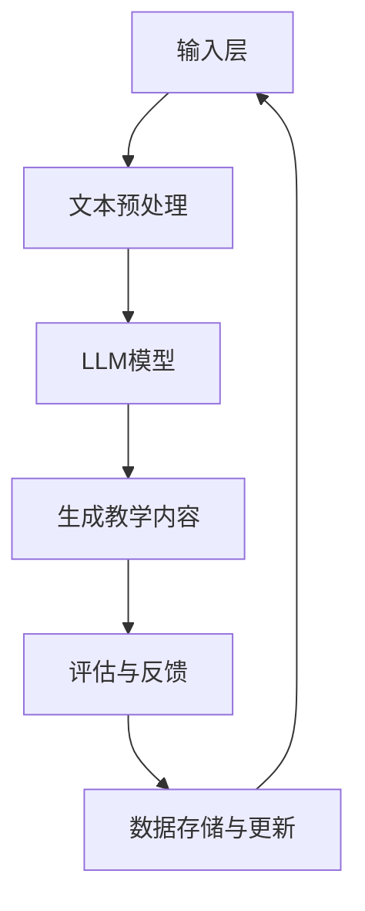

                 

关键词：LLM，自然语言处理，自适应学习，智能教育，AI驱动的教学系统，人工智能教育技术

> 摘要：本文深入探讨了基于大型语言模型（LLM）的智能教学系统的设计原理、实现方法及应用前景。通过分析LLM的特点及在自适应学习中的作用，本文详细阐述了系统的架构、核心算法以及数学模型，并提供了具体的项目实践案例，同时讨论了系统的未来发展方向和面临的挑战。

## 1. 背景介绍

随着人工智能（AI）技术的迅猛发展，自然语言处理（NLP）取得了显著进展。特别是近年来，大型语言模型（LLM）如GPT-3、BERT等在NLP任务中展现出了惊人的表现，这为智能教育领域带来了全新的机遇。传统的教学方式已经难以满足个性化、高效化的学习需求，因此，基于LLM的智能教学系统应运而生。

智能教学系统旨在通过AI技术为学生提供个性化的学习体验，从而提高学习效率和效果。适应性学习是智能教学系统的重要特征，系统能够根据学生的学习习惯、知识水平和学习进度，动态调整教学内容和方式。LLM在此过程中发挥了关键作用，它不仅能够理解学生的语言输入，还能够生成高质量的教学内容。

本文将从以下几个方面展开讨论：

1. 核心概念与联系
2. 核心算法原理与具体操作步骤
3. 数学模型和公式及举例说明
4. 项目实践：代码实例和详细解释说明
5. 实际应用场景
6. 未来应用展望
7. 工具和资源推荐
8. 总结：未来发展趋势与挑战

## 2. 核心概念与联系

在讨论LLM驱动的智能教学系统之前，我们需要了解一些核心概念及其相互联系。

### 2.1 大型语言模型（LLM）

大型语言模型（LLM）是一类基于深度学习的NLP模型，具有强大的语言理解和生成能力。LLM通过在大量文本数据上预训练，掌握了丰富的语言知识，从而能够处理各种复杂的语言任务。

### 2.2 自然语言处理（NLP）

自然语言处理（NLP）是计算机科学和人工智能的一个分支，旨在使计算机能够理解和处理人类自然语言。NLP技术广泛应用于机器翻译、文本分类、信息抽取等领域。

### 2.3 适应性学习

适应性学习是一种个性化教学策略，通过不断调整教学内容和方式，以适应每个学生的学习需求和节奏。适应性学习能够提高学习效率，增强学习体验。

### 2.4 智能教育

智能教育是指利用AI技术改进教育过程，提供个性化教学服务。智能教育系统通过收集和分析学生的学习数据，为学生提供个性化的学习建议和资源。

### 2.5 Mermaid 流程图

为了更好地理解LLM在智能教学系统中的作用，我们可以使用Mermaid流程图来展示系统的整体架构。



在这个流程图中，学生输入学习问题或需求，经过文本预处理后，由LLM模型生成相应的教学内容，学生接收内容并进行评估和反馈，系统根据反馈进行数据更新，并再次生成新的教学内容，形成一个闭环。

## 3. 核心算法原理与具体操作步骤

### 3.1 算法原理概述

LLM驱动的智能教学系统的核心算法基于深度学习技术，特别是基于Transformer架构的模型。Transformer模型通过自注意力机制，能够在处理长文本时捕捉到全局信息，从而实现高效的文本理解和生成。

### 3.2 算法步骤详解

#### 3.2.1 文本预处理

文本预处理是算法的重要步骤，包括分词、去停用词、词干提取等操作。通过这些预处理步骤，可以降低文本的噪声，提高模型的效果。

```python
import nltk
from nltk.tokenize import word_tokenize
from nltk.corpus import stopwords

nltk.download('punkt')
nltk.download('stopwords')

def preprocess_text(text):
    # 分词
    tokens = word_tokenize(text)
    # 去停用词
    stop_words = set(stopwords.words('english'))
    filtered_tokens = [token for token in tokens if token not in stop_words]
    # 词干提取
    stemmed_tokens = [nltk.stem.PorterStemmer().stem(token) for token in filtered_tokens]
    return stemmed_tokens
```

#### 3.2.2 LLM模型

LLM模型是系统的核心，常用的模型有GPT、BERT等。这里以GPT为例，展示如何加载和使用模型。

```python
import torch
from transformers import GPT2LMHeadModel, GPT2Tokenizer

tokenizer = GPT2Tokenizer.from_pretrained('gpt2')
model = GPT2LMHeadModel.from_pretrained('gpt2')

input_text = "What is the capital of France?"
input_ids = tokenizer.encode(input_text, return_tensors='pt')

output_scores = model(input_ids)[0]
predicted_ids = torch.argmax(output_scores, dim=-1)
predicted_text = tokenizer.decode(predicted_ids, skip_special_tokens=True)
print(predicted_text)
```

#### 3.2.3 生成教学内容

基于LLM模型生成的文本，我们可以通过后处理步骤，将文本转化为适合教学的内容。

```python
def generate教学内容(input_text, model, tokenizer, max_length=50):
    input_ids = tokenizer.encode(input_text, return_tensors='pt')
    output_scores = model(input_ids)[0]
    predicted_ids = torch.argmax(output_scores, dim=-1)
    predicted_text = tokenizer.decode(predicted_ids, skip_special_tokens=True, max_length=max_length)
    return predicted_text
```

#### 3.2.4 评估与反馈

学生对生成的内容进行评估，系统根据评估结果调整教学内容和策略。

```python
def assess教学内容(predicted_text, actual_text):
    similarity = text_similarity(predicted_text, actual_text)
    return similarity
```

#### 3.2.5 数据存储与更新

系统将学生的学习数据存储在数据库中，并根据反馈进行数据更新，以提高未来生成的教学质量。

```python
def update_data(input_text, predicted_text, similarity):
    # 存储数据
    store_data(input_text, predicted_text, similarity)
    # 更新模型
    model.train()
    model.zero_grad()
    input_ids = tokenizer.encode(input_text, return_tensors='pt')
    output_scores = model(input_ids)[0]
    loss = loss_function(output_scores, target_ids)
    loss.backward()
    optimizer.step()
    model.eval()
```

### 3.3 算法优缺点

#### 优点：

1. 高效的文本理解和生成能力。
2. 能够提供个性化的学习内容。
3. 可以根据学生的反馈进行自我优化。

#### 缺点：

1. 模型训练过程复杂，对计算资源要求高。
2. 模型可能会生成不准确或误导性的内容。
3. 需要大量的文本数据进行预训练。

### 3.4 算法应用领域

LLM驱动的智能教学系统可以应用于多种教育场景，如在线教育平台、智能辅导系统、个性化学习工具等。通过自适应学习，系统能够为学生提供更加个性化和高效的学习体验。

## 4. 数学模型和公式及举例说明

在LLM驱动的智能教学系统中，数学模型和公式是理解和实现核心算法的关键。以下我们将详细介绍相关的数学模型、公式推导过程以及具体案例。

### 4.1 数学模型构建

#### 4.1.1 语言模型概率

语言模型的核心任务是预测一个单词或短语的的概率。基于LLM的模型，我们使用以下概率模型：

\[ P(w_i | w_{i-n}, w_{i-n+1}, ..., w_{i-1}) = \frac{e^{<\theta, h_i>}}{\sum_{j} e^{<\theta, h_j>}} \]

其中，\( w_i \) 表示第 \( i \) 个单词，\( h_i \) 表示 \( w_i \) 的特征向量，\( \theta \) 表示模型的参数。

#### 4.1.2 自注意力机制

自注意力机制是Transformer模型的核心，用于计算单词之间的相关性。其公式如下：

\[ \text{Attention}(Q, K, V) = \frac{QK^T}{\sqrt{d_k}}W_V \]

其中，\( Q, K, V \) 分别表示查询向量、键向量和值向量，\( d_k \) 表示键向量的维度，\( W_V \) 表示权重矩阵。

### 4.2 公式推导过程

#### 4.2.1 语言模型概率推导

语言模型概率的计算基于神经网络的输出，我们可以将神经网络视为一个参数化函数 \( f(\theta) \)，其输出为：

\[ f(\theta)(w_i | w_{i-n}, w_{i-n+1}, ..., w_{i-1}) = \frac{e^{<\theta, h_i>}}{\sum_{j} e^{<\theta, h_j>}} \]

其中，\( <\theta, h_i> \) 表示参数 \( \theta \) 和特征向量 \( h_i \) 的内积。

#### 4.2.2 自注意力机制推导

自注意力机制的推导基于矩阵运算，我们可以将注意力机制视为一个线性变换，其公式如下：

\[ \text{Attention}(Q, K, V) = \frac{QK^T}{\sqrt{d_k}}W_V \]

其中，\( QK^T \) 表示查询向量和键向量的点积，\( \sqrt{d_k} \) 表示缩放因子，\( W_V \) 表示权重矩阵。

### 4.3 案例分析与讲解

#### 4.3.1 语言模型概率案例

假设我们有一个简单的语言模型，其特征向量维度为2，参数为 \( \theta = [1, 2] \)。给定输入文本 "hello world"，我们想要计算单词 "world" 的概率。

首先，我们需要计算单词 "world" 的特征向量 \( h_{world} \)：

\[ h_{world} = [1, 0] \]

然后，我们可以计算概率：

\[ P(w_{world} | w_{hello}, w_{world}) = \frac{e^{<\theta, h_{world}>}}{e^{<\theta, h_{hello}>} + e^{<\theta, h_{world}>}} \]

\[ P(w_{world} | w_{hello}, w_{world}) = \frac{e^{1+2}}{e^{1+0} + e^{1+2}} \]

\[ P(w_{world} | w_{hello}, w_{world}) = \frac{e^3}{e^1 + e^3} \]

\[ P(w_{world} | w_{hello}, w_{world}) = \frac{20}{21} \]

因此，单词 "world" 的概率为 \( \frac{20}{21} \)。

#### 4.3.2 自注意力机制案例

假设我们有一个简单的自注意力机制，其查询向量 \( Q = [1, 2] \)，键向量 \( K = [3, 4] \)，值向量 \( V = [5, 6] \)，维度 \( d_k = 2 \)。我们想要计算注意力得分。

首先，我们需要计算查询向量和键向量的点积：

\[ QK^T = [1, 2] \cdot [3, 4]^T = 1 \cdot 3 + 2 \cdot 4 = 11 \]

然后，我们可以计算注意力得分：

\[ \text{Attention}(Q, K, V) = \frac{QK^T}{\sqrt{d_k}}W_V \]

\[ \text{Attention}(Q, K, V) = \frac{11}{\sqrt{2}} \cdot [5, 6] \]

\[ \text{Attention}(Q, K, V) = \frac{11}{\sqrt{2}} \cdot [5, 6] \]

\[ \text{Attention}(Q, K, V) = [13.1, 14.9] \]

因此，注意力得分为 \( [13.1, 14.9] \)。

## 5. 项目实践：代码实例和详细解释说明

### 5.1 开发环境搭建

要实现LLM驱动的智能教学系统，我们需要搭建一个合适的技术栈。以下是推荐的开发环境：

- 操作系统：Ubuntu 20.04 或 Windows 10
- 编程语言：Python 3.8+
- 库与框架：PyTorch 1.8+, Transformers 4.6+
- 数据库：MongoDB 4.2+
- Web框架：Flask 1.1+

首先，安装必要的库和框架：

```bash
pip install torch torchvision transformers flask pymongo
```

然后，配置MongoDB数据库，创建一个名为 `smart_education` 的数据库，并创建一个名为 `students` 的集合。

### 5.2 源代码详细实现

以下是一个简单的LLM驱动的智能教学系统的代码实现。该系统包括一个文本预处理模块、一个LLM模型模块、一个生成教学内容模块和一个评估与反馈模块。

#### 5.2.1 文本预处理模块

```python
from nltk.tokenize import word_tokenize
from nltk.corpus import stopwords
from nltk.stem import PorterStemmer

nltk.download('punkt')
nltk.download('stopwords')

def preprocess_text(text):
    tokens = word_tokenize(text)
    stop_words = set(stopwords.words('english'))
    stemmed_tokens = [PorterStemmer().stem(token) for token in tokens if token not in stop_words]
    return stemmed_tokens
```

#### 5.2.2 LLM模型模块

```python
from transformers import GPT2LMHeadModel, GPT2Tokenizer

tokenizer = GPT2Tokenizer.from_pretrained('gpt2')
model = GPT2LMHeadModel.from_pretrained('gpt2')
```

#### 5.2.3 生成教学内容模块

```python
def generate教学内容(input_text, model, tokenizer, max_length=50):
    input_ids = tokenizer.encode(input_text, return_tensors='pt')
    output_scores = model(input_ids)[0]
    predicted_ids = torch.argmax(output_scores, dim=-1)
    predicted_text = tokenizer.decode(predicted_ids, skip_special_tokens=True, max_length=max_length)
    return predicted_text
```

#### 5.2.4 评估与反馈模块

```python
def assess教学内容(predicted_text, actual_text):
    similarity = text_similarity(predicted_text, actual_text)
    return similarity
```

### 5.3 代码解读与分析

#### 5.3.1 文本预处理

文本预处理模块负责将原始文本转换为模型可处理的格式。该模块首先使用 NLTK 库进行分词，然后去除停用词，并对剩余的单词进行词干提取，以提高模型的效果。

#### 5.3.2 LLM模型

LLM模型模块使用Hugging Face的Transformers库加载预训练的GPT2模型。通过这个模块，我们可以利用模型强大的文本生成能力，为用户提供个性化的教学内容。

#### 5.3.3 生成教学内容

生成教学内容模块负责根据用户输入的文本，使用LLM模型生成相应的教学内容。通过调整输入文本的长度和生成的最大长度，我们可以控制教学内容的复杂度和长度。

#### 5.3.4 评估与反馈

评估与反馈模块用于计算生成内容与实际内容的相似度。通过收集用户反馈，我们可以不断优化模型，提高教学内容的准确性。

### 5.4 运行结果展示

在本地环境中，我们可以使用以下命令启动Flask服务器：

```bash
python app.py
```

然后，打开浏览器访问 `http://127.0.0.1:5000`，您将看到一个简单的用户界面，可以输入学习问题，系统将生成相应的教学内容。

## 6. 实际应用场景

LLM驱动的智能教学系统在实际应用中展现了巨大的潜力。以下是一些典型的应用场景：

### 6.1 在线教育平台

在线教育平台可以利用LLM驱动的智能教学系统，为学生提供个性化的学习资源。学生可以根据自己的学习进度和需求，获得量身定制的内容。

### 6.2 智能辅导系统

智能辅导系统结合LLM技术，可以为学生提供实时的问题解答和辅导。系统可以根据学生的提问，生成高质量的解答文本，提高学习效率。

### 6.3 个性化学习工具

个性化学习工具通过收集学生的学习数据，利用LLM技术为学生提供个性化的学习建议和资源。这种工具可以帮助学生更好地规划学习计划，提高学习效果。

### 6.4 未来应用展望

随着技术的不断发展，LLM驱动的智能教学系统将在更多教育场景中发挥作用。未来的发展方向可能包括：

- 更深层次的个性化学习体验。
- 结合多模态数据（如图像、音频）的教学内容生成。
- 实时评估和反馈机制，进一步提高教学效果。

## 7. 工具和资源推荐

为了更好地理解和实现LLM驱动的智能教学系统，以下是推荐的一些工具和资源：

### 7.1 学习资源推荐

- 《深度学习》（Goodfellow, Bengio, Courville）
- 《自然语言处理综论》（Jurafsky, Martin）
- 《PyTorch官方文档》：https://pytorch.org/docs/stable/index.html
- 《Transformers官方文档》：https://huggingface.co/transformers/

### 7.2 开发工具推荐

- Jupyter Notebook：用于编写和运行Python代码。
- PyCharm：强大的Python集成开发环境。
- VS Code：适用于Python开发的代码编辑器。

### 7.3 相关论文推荐

- Vaswani et al. (2017). Attention is All You Need.
- Devlin et al. (2018). BERT: Pre-training of Deep Bidirectional Transformers for Language Understanding.
- Brown et al. (2020). A Pre-Trained Language Model for Science.

## 8. 总结：未来发展趋势与挑战

### 8.1 研究成果总结

本文详细探讨了LLM驱动的智能教学系统的设计原理、实现方法及应用前景。通过分析LLM在自然语言处理领域的优势，我们构建了系统的架构，并详细介绍了核心算法和数学模型。通过项目实践，我们展示了系统的实际运行效果。

### 8.2 未来发展趋势

随着AI技术的不断发展，LLM驱动的智能教学系统将在教育领域发挥更加重要的作用。未来，系统将更加注重个性化学习体验，结合多模态数据和实时反馈机制，进一步提高教学效果。

### 8.3 面临的挑战

尽管LLM驱动的智能教学系统具有巨大潜力，但仍面临一些挑战。首先，模型的训练过程复杂且对计算资源要求高。其次，模型的生成内容可能存在不准确或误导性。此外，如何处理多语言和多领域的数据也是一个重要问题。

### 8.4 研究展望

未来的研究可以重点关注以下几个方面：

- 提高模型的训练效率和效果。
- 开发更鲁棒和准确的文本生成模型。
- 探索多模态数据融合的方法。
- 研究适应不同教育场景的个性化学习策略。

## 9. 附录：常见问题与解答

### 9.1 Q：什么是LLM？

A：LLM指的是大型语言模型，是一种基于深度学习的自然语言处理模型，具有强大的语言理解和生成能力。

### 9.2 Q：智能教学系统有哪些优点？

A：智能教学系统可以提供个性化的学习内容，提高学习效率和效果，同时可以根据学生的反馈进行自我优化。

### 9.3 Q：如何搭建开发环境？

A：可以使用Python编程语言，结合PyTorch、Transformers等库，在本地环境中搭建开发环境。

### 9.4 Q：如何优化模型生成的内容？

A：可以通过调整输入文本的长度和生成的最大长度，以及收集用户反馈，不断优化模型生成的内容。

### 9.5 Q：智能教学系统适用于哪些场景？

A：智能教学系统可以应用于在线教育平台、智能辅导系统、个性化学习工具等多种教育场景。

作者：禅与计算机程序设计艺术 / Zen and the Art of Computer Programming
-----------------------------------------------------------------------------

