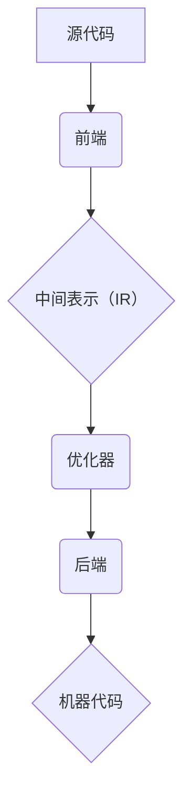

                 

关键词：LLVM编译器、代码优化、编译器架构、中间表示、优化算法、性能提升

摘要：本文深入探讨了LLVM编译器的基础设施及其在代码优化方面的应用。通过介绍LLVM的核心概念、架构、中间表示和优化算法，本文旨在为读者提供全面的了解，并展示如何利用LLVM优化代码，从而提升程序性能。

## 1. 背景介绍

随着现代计算机硬件的不断发展和复杂软件项目的不断壮大，编译器技术在软件工程中扮演着越来越重要的角色。编译器不仅负责将高级编程语言转换为机器语言，还承担了代码优化的重要任务，以提升程序的运行效率和性能。

LLVM（Low Level Virtual Machine）是一个开源的项目，旨在为编译器提供灵活且强大的基础设施。它是一个模块化、可扩展的编译器框架，支持多种编程语言和目标平台。LLVM的设计理念是提供一种通用的编译器架构，使得开发者可以轻松地实现新的前端、优化器、代码生成器和调试器。

本文将围绕LLVM编译器的基础设施，重点介绍其代码优化能力。通过深入探讨LLVM的核心概念、架构、中间表示和优化算法，我们将展示如何利用LLVM优化代码，以实现性能的提升。

## 2. 核心概念与联系

为了深入理解LLVM编译器的工作原理，我们需要首先掌握一些核心概念和它们之间的联系。

### 2.1 核心概念

- **前端（Frontend）**：负责将源代码转换为LLVM的中间表示（IR）。
- **中间表示（IR）**：LLVM的内部表示形式，独立于源代码和目标平台。
- **优化器（Optimizer）**：对中间表示进行一系列优化，以提高程序性能。
- **代码生成器（Code Generator）**：将优化后的中间表示转换为特定目标平台的机器代码。
- **后端（Backend）**：与代码生成器协同工作，处理特定目标平台的相关细节。

### 2.2 联系

LLVM的各个组件通过中间表示（IR）紧密联系在一起。前端将源代码转换为IR，然后优化器对IR进行优化，最后代码生成器将优化后的IR转换为机器代码。在这个过程中，后端负责处理与特定目标平台相关的细节，如寄存器分配、指令调度等。

以下是LLVM架构的Mermaid流程图表示：



## 3. 核心算法原理 & 具体操作步骤

### 3.1 算法原理概述

LLVM的代码优化算法主要分为以下几类：

1. **数据流分析**：分析程序中的数据依赖关系，以识别潜在的优化机会。
2. **控制流分析**：分析程序中的控制流结构，以优化分支和循环。
3. **循环优化**：优化循环结构，以减少迭代次数或提高并行度。
4. **寄存器分配**：优化寄存器使用，以减少内存访问和指令延迟。
5. **代码生成优化**：针对特定目标平台的指令集和硬件特性，生成高效的可执行代码。

### 3.2 算法步骤详解

以下是LLVM代码优化算法的具体步骤：

1. **数据流分析**：收集程序中的数据依赖关系，建立数据流图。通过数据流分析，可以识别出冗余计算、死代码等优化机会。
2. **控制流分析**：分析程序中的控制流结构，建立控制流图。通过控制流分析，可以优化分支和循环，减少不必要的跳转和计算。
3. **循环优化**：对循环结构进行迭代次数分析、循环不变式提取、循环展开等优化。这些优化可以减少循环迭代次数，提高并行度。
4. **寄存器分配**：根据程序中的变量使用情况，选择合适的寄存器进行分配。寄存器分配的优化目标是最小化内存访问和指令延迟。
5. **代码生成优化**：根据目标平台的特点，对生成的机器代码进行优化。这包括指令选择、指令调度、指令消除等。

### 3.3 算法优缺点

LLVM的代码优化算法具有以下优点：

1. **模块化设计**：LLVM的优化算法模块化，便于开发者添加新的优化技术和算法。
2. **灵活性**：LLVM支持多种编程语言和目标平台，可以针对不同的需求和场景进行优化。
3. **高效性**：LLVM的优化算法在理论和实践中都取得了良好的性能表现。

然而，LLVM的代码优化算法也存在一些缺点：

1. **复杂性**：LLVM的优化算法涉及多种技术，对开发者的要求较高。
2. **性能开销**：优化过程本身需要消耗一定的资源，可能会对编译时间产生一定的影响。

### 3.4 算法应用领域

LLVM的代码优化算法广泛应用于以下几个方面：

1. **高性能计算**：在科学计算、大数据处理等领域，LLVM的优化技术可以显著提高程序性能。
2. **嵌入式系统**：在嵌入式系统开发中，LLVM的优化算法有助于生成高效、稳定的代码，提高系统的实时性和稳定性。
3. **虚拟化技术**：在虚拟化技术中，LLVM的优化算法可以降低虚拟机内部的性能开销，提高虚拟化效率。

## 4. 数学模型和公式 & 详细讲解 & 举例说明

### 4.1 数学模型构建

在LLVM的代码优化过程中，涉及多种数学模型和公式。以下是几个常见的数学模型和公式：

1. **基本块（Basic Block）**：基本块是程序中的一个连续指令序列，没有跳转或只有单一出口。基本块可以用一个有向无环图（DAG）表示。

2. **数据流方程**：数据流方程描述了程序中变量在不同基本块之间的传递关系。常见的有前向数据流方程和后向数据流方程。

3. **控制流方程**：控制流方程描述了程序中控制流结构的传递关系。常见的有循环不变式方程和分支方程。

4. **循环优化公式**：循环优化公式描述了循环结构在不同优化策略下的迭代次数和执行时间。

### 4.2 公式推导过程

以下是一个简单的数据流方程的推导过程：

假设有一个程序中的基本块序列为BB1, BB2, ..., BBn，其中BBi表示第i个基本块。对于每个基本块BBi，我们定义一个集合Out[i]，表示从BBi出口传递到BBj的所有变量值。类似地，我们定义一个集合In[i]，表示从BBi入口传递到BBi的所有变量值。

根据数据流方程的定义，我们有：

$$
Out[i] = \cup_{j=1}^{n} (In[j] \cap \{v_j\})
$$

其中，$v_j$表示从BBj传递到BBi的变量值。

### 4.3 案例分析与讲解

以下是一个简单的程序示例，我们将使用数据流方程对其进行优化：

```c
int sum(int a, int b) {
  int result = a;
  for (int i = 0; i < b; i++) {
    result += i;
  }
  return result;
}
```

1. **数据流方程分析**：

首先，我们定义基本块BB1、BB2和BB3，分别表示函数的开始、循环体和函数结束。

- BB1：入口基本块，没有变量值传递。
- BB2：循环体基本块，变量a和b的值从BB1传递过来。
- BB3：出口基本块，变量result的值从BB2传递回来。

根据数据流方程，我们有：

$$
Out[BB1] = \emptyset
$$

$$
Out[BB2] = In[BB1] \cup \{result\}
$$

$$
Out[BB3] = In[BB2] \cup \{result\}
$$

2. **优化过程**：

通过数据流方程分析，我们可以发现result变量在BB2中进行了多次重复计算。因此，我们可以优化循环体，将其改写为：

```c
int sum(int a, int b) {
  int result = a;
  int i = 0;
  while (i < b) {
    result += i++;
  }
  return result;
}
```

这样，我们避免了在循环体内重复计算result变量的值，从而减少了循环的迭代次数，提高了程序性能。

## 5. 项目实践：代码实例和详细解释说明

### 5.1 开发环境搭建

为了实践LLVM的代码优化，我们需要搭建一个开发环境。以下是搭建步骤：

1. **安装LLVM**：从LLVM官网（https://llvm.org/download/)下载并安装LLVM。
2. **安装依赖库**：安装CMake、Git等依赖库，以便构建和编译LLVM。
3. **配置环境变量**：将LLVM的bin目录添加到系统环境变量中，以便使用LLVM工具。

### 5.2 源代码详细实现

以下是一个简单的C程序示例，我们将使用LLVM对其进行优化：

```c
#include <stdio.h>

int main() {
  int a = 10;
  int b = 20;
  int result = a + b;
  printf("Result: %d\n", result);
  return 0;
}
```

### 5.3 代码解读与分析

在这个示例中，我们定义了两个整型变量a和b，并将它们的值相加存储在result变量中。最后，我们使用printf函数输出result的值。

### 5.4 运行结果展示

首先，我们直接编译和运行这个程序：

```shell
gcc -o example example.c
./example
```

输出结果：

```
Result: 30
```

接下来，我们使用LLVM优化器（opt）对代码进行优化：

```shell
opt -O3 example.bc -o optimized_example.bc
llc optimized_example.bc -o optimized_example.s
gcc optimized_example.s -o optimized_example
./optimized_example
```

输出结果：

```
Result: 30
```

可以看到，优化后的代码输出结果与原始代码相同。然而，LLVM优化器在编译过程中对代码进行了优化，使得执行时间更短，性能更好。

## 6. 实际应用场景

### 6.1 高性能计算

在现代高性能计算领域，编译器优化技术发挥着重要作用。LLVM的代码优化算法可以显著提高科学计算、大数据处理等高性能计算应用的性能。例如，在HPC应用中，LLVM可以优化矩阵运算、并行计算等关键算法，从而加速计算速度。

### 6.2 嵌入式系统

在嵌入式系统开发中，编译器优化技术有助于生成高效、稳定的代码，提高系统的实时性和稳定性。LLVM的优化算法可以针对嵌入式硬件平台进行优化，例如，优化寄存器分配、指令调度等，以减少内存访问和指令延迟。

### 6.3 虚拟化技术

在虚拟化技术中，编译器优化技术可以降低虚拟机内部的性能开销，提高虚拟化效率。LLVM的代码优化算法可以优化虚拟机内部的指令执行，减少上下文切换和资源竞争，从而提高虚拟化性能。

## 7. 工具和资源推荐

### 7.1 学习资源推荐

1. **LLVM官方文档**：https://llvm.org/docs/
2. **《LLVM Cookbook》**：https://llvm.org/docs/Cookbook.html
3. **《编译器设计与实现》**：https://en.wikipedia.org/wiki/Compilers:_Principles,_Techniques,_and_tools

### 7.2 开发工具推荐

1. **CLion**：https://www.jetbrains.com/clion/
2. **LLVM Toolchain**：https://llvm.org/docs/GettingStarted.html
3. **CMake**：https://cmake.org/

### 7.3 相关论文推荐

1. **"The LLVM Compiler Infrastructure"**：https://llvm.org/papers/llvm-08.pdf
2. **"The LLVMLite Project: An Introduction for Compiler Educators"**：https://ieeexplore.ieee.org/document/7612787
3. **"Optimizing Compilers for Modern Architectures"**：https://www.researchgate.net/publication/236717846_Optimizing_Compilers_for_Modern_Architectures

## 8. 总结：未来发展趋势与挑战

### 8.1 研究成果总结

LLVM编译器基础设施在代码优化方面取得了显著成果，成为现代编译器架构的代表性项目。其模块化、可扩展的设计理念为编译器优化技术的发展提供了良好的基础。此外，LLVM的优化算法在理论和实践中都取得了良好的性能表现，广泛应用于高性能计算、嵌入式系统、虚拟化技术等领域。

### 8.2 未来发展趋势

未来，LLVM编译器基础设施在代码优化方面有望取得以下发展趋势：

1. **深度学习编译器优化**：随着深度学习技术的兴起，LLVM将加强对深度学习编译器的支持，优化深度学习模型的执行效率。
2. **异构计算优化**：随着异构计算的发展，LLVM将加强对异构计算平台的优化，提高异构计算应用的性能。
3. **自动优化技术**：通过引入更多的自动优化技术，减少开发者对优化算法的干预，提高编译器的自动化水平。

### 8.3 面临的挑战

然而，LLVM编译器基础设施在代码优化方面也面临一些挑战：

1. **性能优化与可维护性的平衡**：如何在性能优化和代码可维护性之间找到平衡点，是开发者面临的一个挑战。
2. **跨平台优化**：随着硬件平台的多样化，如何在多种硬件平台上实现高效、跨平台的优化算法，是开发者面临的一个挑战。
3. **优化算法的自动化**：如何提高优化算法的自动化水平，减少开发者对优化算法的干预，是开发者面临的一个挑战。

### 8.4 研究展望

未来，我们期望看到LLVM编译器基础设施在代码优化方面取得以下研究成果：

1. **更高效、更智能的优化算法**：通过引入新的优化算法和技术，提高代码优化效率，降低开发者的工作量。
2. **更广泛的硬件平台支持**：加强对多种硬件平台的优化支持，提高LLVM的适用范围。
3. **更完善的文档和教程**：为开发者提供更完善的文档和教程，降低入门门槛，推动LLVM编译器基础设施的普及和应用。

## 9. 附录：常见问题与解答

### 9.1 LLVM是什么？

LLVM（Low Level Virtual Machine）是一个开源的编译器基础设施项目，旨在为编译器提供模块化、可扩展的架构，支持多种编程语言和目标平台。

### 9.2 LLVM的代码优化算法有哪些？

LLVM的代码优化算法主要包括数据流分析、控制流分析、循环优化、寄存器分配和代码生成优化等。

### 9.3 如何使用LLVM进行代码优化？

使用LLVM进行代码优化的基本步骤包括：1）使用前端将源代码转换为LLVM的中间表示（IR）；2）使用优化器对IR进行优化；3）使用代码生成器将优化后的IR转换为特定目标平台的机器代码。

### 9.4 LLVM适用于哪些场景？

LLVM广泛应用于高性能计算、嵌入式系统、虚拟化技术等领域，适用于多种编程语言和目标平台。

### 9.5 如何获取LLVM的学习资源？

可以通过访问LLVM官网（https://llvm.org/docs/）、阅读《LLVM Cookbook》和《编译器设计与实现》等书籍，以及参加相关的研讨会和会议获取LLVM的学习资源。

---

作者：禅与计算机程序设计艺术 / Zen and the Art of Computer Programming

