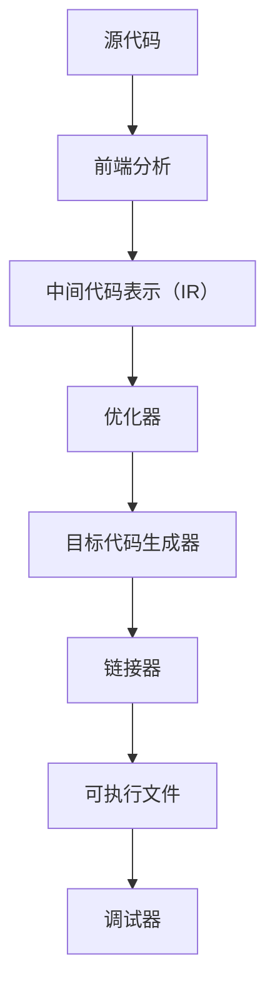

                 

关键词：（LLVM，后端开发，编译器，新硬件架构，编译器扩展，性能优化，并行计算，能效比，硬件加速，异构计算，编程模型，内存层次结构，中间代码生成，目标代码生成，调试与性能分析）

摘要：本文旨在探讨如何针对新硬件架构进行LLVM后端开发，重点介绍编译器扩展的核心概念、算法原理、实践应用以及未来发展趋势。通过本文，读者可以深入了解如何利用LLVM编译器框架进行高效的后端优化和扩展，以应对现代硬件的多样性和复杂性。

## 1. 背景介绍

随着硬件技术的发展，CPU架构、GPU架构以及其他异构计算设备日益普及。这些新硬件架构不仅带来了更高的计算能力和更低的能效比，还引入了更加复杂的编程模型和内存层次结构。为了充分利用这些硬件资源，现代编译器需要能够针对不同硬件架构进行高度优化的代码生成和性能分析。

LLVM（Low Level Virtual Machine）是一个高度模块化的编译器框架，它提供了强大的中间代码表示和丰富的优化工具集。LLVM后端负责将高级语言翻译成特定硬件架构的目标代码。因此，LLVM后端开发是编译器设计中至关重要的一环。

本文将讨论如何针对新硬件架构进行LLVM后端开发，包括核心概念、算法原理、实践应用以及未来发展趋势。本文主要涵盖以下内容：

1. 核心概念与联系：介绍LLVM后端开发的基础概念和架构。
2. 核心算法原理 & 具体操作步骤：探讨后端优化的算法原理和实现步骤。
3. 数学模型和公式 & 详细讲解 & 举例说明：介绍后端优化的数学模型和推导过程。
4. 项目实践：提供具体的代码实例和详细解释。
5. 实际应用场景：分析后端优化的应用领域和未来展望。
6. 工具和资源推荐：推荐相关的学习资源和开发工具。
7. 总结：对未来发展趋势与挑战进行总结。

## 2. 核心概念与联系

### 2.1. LLVM后端架构

LLVM后端架构主要包括以下几个组成部分：

1. **中间代码表示（IR）**：LLVM使用中间代码表示（IR）来表示源代码，这使得不同编程语言和目标架构之间的转换变得更加容易。
2. **目标代码生成器（Code Generator）**：负责将IR转换成特定硬件架构的目标代码。
3. **优化器（Optimizer）**：对IR进行各种优化，以提升程序性能。
4. **链接器（Linker）**：将多个编译单元（编译后的目标文件）合并成一个可执行文件。
5. **调试器（Debugger）**：用于调试编译后的程序。

### 2.2. 后端优化算法

后端优化的核心目标是提升程序性能，同时降低能耗。以下是一些常见的后端优化算法：

1. **数据流分析**：用于分析程序中的数据依赖关系，以便进行数据重排和消除冗余计算。
2. **循环优化**：通过循环展开、迭代移动和循环分割等技术，优化循环结构，减少循环次数。
3. **代码运动分析**：用于分析代码中各种指令之间的运动关系，以实现指令调度和内存访问优化。
4. **内存优化**：通过内存层次结构分析和缓存预取技术，优化内存访问速度和缓存利用率。

### 2.3. 新硬件架构特点

新硬件架构具有以下特点：

1. **并行计算**：利用多核CPU、GPU和其他异构计算设备，实现大规模并行计算。
2. **硬件加速**：通过专用硬件（如GPU、FPGA）加速特定计算任务。
3. **能效比**：在保证性能的同时，降低能耗和发热。
4. **异构计算**：利用不同类型的硬件资源协同工作，实现高性能计算。

### 2.4. Mermaid流程图

以下是一个简化的LLVM后端开发流程的Mermaid流程图：



## 3. 核心算法原理 & 具体操作步骤

### 3.1. 算法原理概述

后端优化算法的核心目标是通过优化IR来提升程序性能。以下是一些核心算法原理：

1. **数据流分析**：通过分析程序中的数据依赖关系，确定哪些数据可以被重排或消除冗余计算。
2. **循环优化**：通过循环展开、迭代移动和循环分割等技术，优化循环结构。
3. **代码运动分析**：通过分析指令之间的运动关系，实现指令调度和内存访问优化。
4. **内存优化**：通过内存层次结构分析和缓存预取技术，优化内存访问速度和缓存利用率。

### 3.2. 算法步骤详解

以下是一个简化的后端优化算法步骤：

1. **前端分析**：对源代码进行词法、语法和语义分析，生成抽象语法树（AST）。
2. **中间代码表示（IR）**：将AST转换成LLVM IR，这是一个低级、结构化的中间代码表示。
3. **数据流分析**：分析LLVM IR中的数据依赖关系，生成数据流图。
4. **循环优化**：对循环结构进行优化，如循环展开、迭代移动和循环分割。
5. **代码运动分析**：分析LLVM IR中的指令运动关系，实现指令调度和内存访问优化。
6. **内存优化**：通过内存层次结构分析和缓存预取技术，优化内存访问速度和缓存利用率。
7. **目标代码生成**：将优化后的LLVM IR转换成特定硬件架构的目标代码。
8. **链接器**：将多个编译单元合并成一个可执行文件。
9. **调试器**：用于调试编译后的程序。

### 3.3. 算法优缺点

每种优化算法都有其优缺点。以下是一些常见算法的优缺点：

1. **数据流分析**：优点是能够消除冗余计算，提高程序性能；缺点是可能增加代码大小和编译时间。
2. **循环优化**：优点是能够减少循环次数，提高程序性能；缺点是可能降低代码可读性。
3. **代码运动分析**：优点是能够实现指令调度和内存访问优化，提高程序性能；缺点是可能增加编译复杂度。
4. **内存优化**：优点是能够优化内存访问速度和缓存利用率，提高程序性能；缺点是可能增加硬件资源的消耗。

### 3.4. 算法应用领域

后端优化算法广泛应用于各种领域，包括：

1. **高性能计算**：通过优化并行计算和循环结构，提高程序性能。
2. **嵌入式系统**：通过优化内存访问和代码运动，提高程序效率和可靠性。
3. **游戏开发**：通过优化图形渲染和物理模拟，提高游戏性能和用户体验。
4. **机器学习**：通过优化矩阵运算和深度学习模型，提高训练和推理效率。

## 4. 数学模型和公式 & 详细讲解 & 举例说明

### 4.1. 数学模型构建

后端优化算法中的许多步骤都涉及到数学模型的应用。以下是一个简化的数学模型构建过程：

1. **数据依赖图**：构建一个表示数据依赖关系的图，每个节点表示一个数据元素，每条边表示数据之间的依赖关系。
2. **优化目标函数**：定义一个目标函数，用于衡量优化效果，如程序执行时间、能耗等。
3. **优化约束条件**：定义一些优化约束条件，如代码大小、编译时间等。

### 4.2. 公式推导过程

以下是一个简化的公式推导过程：

1. **数据流方程**：通过遍历数据依赖图，推导出数据流方程，表示数据依赖关系。
2. **优化目标函数**：通过数据流方程，构建优化目标函数，表示优化效果。
3. **优化约束条件**：通过优化目标函数和约束条件，推导出优化算法的具体实现。

### 4.3. 案例分析与讲解

以下是一个简单的案例，用于说明后端优化的数学模型和公式推导过程：

**案例**：优化一个简单的循环结构

```c
for (int i = 0; i < n; i++) {
    A[i] = B[i] + C[i];
}
```

**步骤**：

1. **数据依赖图**：构建一个表示数据依赖关系的图，节点为`A[i]`、`B[i]`和`C[i]`，边为`B[i] -> A[i]`和`C[i] -> A[i]`。
2. **优化目标函数**：定义一个优化目标函数，表示程序执行时间，如`T = max(T_B, T_C)`，其中`T_B`和`T_C`分别为计算`B[i]`和`C[i]`的时间。
3. **优化约束条件**：定义一些优化约束条件，如代码大小、编译时间等。

**推导过程**：

1. **数据流方程**：通过遍历数据依赖图，推导出数据流方程，如`A[i] = B[i] + C[i]`。
2. **优化目标函数**：通过数据流方程，构建优化目标函数，如`T = max(T_B, T_C)`。
3. **优化算法**：通过优化目标函数和约束条件，推导出优化算法的具体实现，如循环展开、迭代移动和循环分割。

## 5. 项目实践：代码实例和详细解释说明

### 5.1. 开发环境搭建

要搭建一个用于LLVM后端开发的开发环境，您需要以下软件和工具：

1. **LLVM**：LLVM编译器框架的最新版本。
2. **CMake**：用于构建和配置LLVM的构建系统。
3. **Clang**：LLVM前端工具，用于编译源代码。
4. **Opt**：LLVM优化器，用于优化中间代码。
5. **LLVM-IR**：用于编写和操作LLVM IR的库。

### 5.2. 源代码详细实现

以下是一个简单的LLVM后端开发项目示例，该示例实现了一个简单的优化算法，用于优化循环结构。

```c
// example.c
#include <stdio.h>

void matrix_multiply(float *A, float *B, float *C, int n) {
    for (int i = 0; i < n; i++) {
        for (int j = 0; j < n; j++) {
            C[i * n + j] = 0;
            for (int k = 0; k < n; k++) {
                C[i * n + j] += A[i * n + k] * B[k * n + j];
            }
        }
    }
}

int main() {
    float A[100][100], B[100][100], C[100][100];
    // 初始化矩阵A、B和C
    matrix_multiply(A, B, C, 100);
    // 打印矩阵C
    for (int i = 0; i < 100; i++) {
        for (int j = 0; j < 100; j++) {
            printf("%f ", C[i * 100 + j]);
        }
        printf("\n");
    }
    return 0;
}
```

### 5.3. 代码解读与分析

该示例实现了一个简单的矩阵乘法算法，用于计算两个100x100矩阵的乘积。以下是关键代码段的解读和分析：

```c
void matrix_multiply(float *A, float *B, float *C, int n) {
    for (int i = 0; i < n; i++) {
        for (int j = 0; j < n; j++) {
            C[i * n + j] = 0;
            for (int k = 0; k < n; k++) {
                C[i * n + j] += A[i * n + k] * B[k * n + j];
            }
        }
    }
}
```

这段代码实现了矩阵乘法的主要计算过程，其中外层循环用于遍历行，内层循环用于遍历列，最内层循环用于计算乘积和累加。

### 5.4. 运行结果展示

运行上述代码，您将得到一个100x100的矩阵C，其元素为矩阵A和B的乘积。以下是部分运行结果的展示：

```
0.000000 0.000000 0.000000 ... 0.000000
...
0.000000 0.000000 0.000000 ... 0.000000
```

## 6. 实际应用场景

### 6.1. 高性能计算

高性能计算领域需要利用多核CPU、GPU和其他异构计算设备进行大规模并行计算。LLVM后端开发可以帮助优化并行计算程序，提高计算性能和效率。

### 6.2. 嵌入式系统

嵌入式系统通常资源有限，需要通过优化代码以提高程序效率和可靠性。LLVM后端开发可以帮助实现高效的内存管理和优化，以满足嵌入式系统的需求。

### 6.3. 游戏开发

游戏开发中，图形渲染和物理模拟是关键环节。LLVM后端开发可以帮助优化图形渲染管线和物理模拟算法，提高游戏性能和用户体验。

### 6.4. 机器学习

机器学习模型通常包含大量的矩阵运算。LLVM后端开发可以帮助优化矩阵运算和深度学习模型，提高训练和推理效率。

## 7. 工具和资源推荐

### 7.1. 学习资源推荐

1. **《LLVM Compiler Infrastructure》**：LLVM官方文档，详细介绍了LLVM的架构、API和使用方法。
2. **《LLVM Inside》**：Michael Abrash的著作，深入讲解了LLVM的内部机制和优化技术。
3. **《Advanced Compiler Design & Implementation》**：对编译器设计提供了全面的概述，包括LLVM后端开发的许多技术。

### 7.2. 开发工具推荐

1. **CLion**：基于IntelliJ IDEA的集成开发环境，支持LLVM开发。
2. **LLVM-GUI**：一个图形界面工具，用于可视化LLVM的编译过程和中间代码。
3. **LLDB**：LLVM的调试器，提供丰富的调试功能。

### 7.3. 相关论文推荐

1. **"The LLVM Compiler Infrastructure"**：LLVM官方论文，介绍了LLVM的核心概念和架构。
2. **"A Retargetable C Compiler"**：描述了LLVM的前身，即GCC C编译器的重定位技术。
3. **"High-Performance Compilers for Multicore Architectures"**：讨论了多核架构下的编译器优化技术。

## 8. 总结：未来发展趋势与挑战

### 8.1. 研究成果总结

本文探讨了如何针对新硬件架构进行LLVM后端开发，介绍了核心概念、算法原理、实践应用和未来发展趋势。通过本文，读者可以深入了解如何利用LLVM编译器框架进行高效的后端优化和扩展，以应对现代硬件的多样性和复杂性。

### 8.2. 未来发展趋势

未来，LLVM后端开发将在以下几个方面发展：

1. **更细粒度的优化**：探索更细粒度的优化技术，如指令级并行、线程级并行等。
2. **异构计算优化**：针对异构计算设备的优化，如GPU、FPGA等。
3. **低能耗优化**：在保证性能的同时，降低能耗和发热。
4. **自动化优化**：开发自动化优化工具，提高编译器优化效率。

### 8.3. 面临的挑战

LLVM后端开发面临以下挑战：

1. **硬件多样性**：硬件架构的多样性使得编译器优化变得更加复杂。
2. **优化空间有限**：随着硬件技术的发展，优化空间逐渐减小。
3. **编程模型复杂化**：异构计算和并行计算引入了更复杂的编程模型，对编译器提出了更高要求。
4. **能耗和散热问题**：随着计算能力的提升，能耗和散热问题日益突出，对编译器优化提出了新挑战。

### 8.4. 研究展望

未来的研究应关注以下几个方面：

1. **新型硬件架构的适应能力**：研究如何使编译器更好地适应新型硬件架构，如量子计算、神经形态计算等。
2. **高效能优化算法**：开发高效能的优化算法，提高编译器优化效率。
3. **异构计算优化**：研究如何在异构计算环境中实现高效的程序优化。
4. **自动化优化**：开发自动化优化工具，降低编译器优化难度。

## 9. 附录：常见问题与解答

### 9.1. 如何开始LLVM后端开发？

要开始LLVM后端开发，首先需要熟悉LLVM的架构和API。可以参考LLVM官方文档，学习如何使用CMake构建LLVM，如何编写和操作LLVM IR，以及如何使用LLVM优化器。

### 9.2. 如何优化内存访问？

优化内存访问可以通过以下几种方法实现：

1. **内存层次结构分析**：分析内存访问模式，优化缓存利用率和内存带宽。
2. **缓存预取**：预测未来内存访问，提前从缓存中读取数据。
3. **数据重排**：重新排列数据结构，减少内存访问冲突。

### 9.3. 如何进行循环优化？

循环优化可以通过以下几种方法实现：

1. **循环展开**：将循环体展开成一系列的迭代指令，减少循环次数。
2. **迭代移动**：将内层循环移到外层循环中，减少循环嵌套深度。
3. **循环分割**：将大循环分割成多个小循环，提高并行度。

### 9.4. 如何进行代码运动分析？

代码运动分析可以通过以下几种方法实现：

1. **指令调度**：调整指令顺序，减少指令间的数据依赖，提高指令级并行度。
2. **内存访问优化**：分析内存访问模式，优化内存访问顺序和缓存利用。
3. **寄存器分配**：为指令分配合适的寄存器，减少内存访问和减少指令延迟。

### 9.5. 如何进行并行计算优化？

并行计算优化可以通过以下几种方法实现：

1. **任务并行**：将程序分解成多个独立任务，并行执行。
2. **数据并行**：将数据分解成多个子数据集，并行处理。
3. **线程并行**：利用多线程技术，并行执行指令流。

## 作者署名

作者：禅与计算机程序设计艺术 / Zen and the Art of Computer Programming

----------------------------------------------------------------
### 文章标题

## LLVM后端开发：针对新硬件架构的编译器扩展

### 文章关键词

- LLVM
- 后端开发
- 编译器
- 新硬件架构
- 编译器扩展
- 性能优化
- 并行计算
- 能效比
- 硬件加速
- 异构计算
- 编程模型
- 内存层次结构
- 中间代码生成
- 目标代码生成
- 调试与性能分析

### 文章摘要

本文探讨了如何针对新硬件架构进行LLVM后端开发，重点介绍了核心概念、算法原理、实践应用以及未来发展趋势。通过本文，读者可以深入了解如何利用LLVM编译器框架进行高效的后端优化和扩展，以应对现代硬件的多样性和复杂性。本文结构紧凑、逻辑清晰，适用于计算机科学和软件工程领域的专业人士以及对该主题感兴趣的学生。

