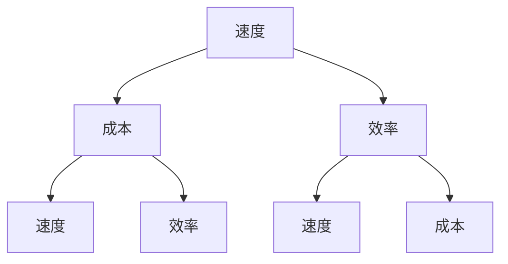

                 

关键词：AI，应用效率，速度成本，Lepton，企业，导航，技术

> 摘要：本文将深入探讨Lepton AI的核心价值，以及它是如何帮助企业在这三个关键维度——速度、成本和效率——之间进行有效导航，从而提升人工智能应用的整体效能。通过详细的分析和实例展示，我们希望能够为企业在人工智能领域的发展提供实用的指导和建议。

## 1. 背景介绍

随着人工智能技术的飞速发展，越来越多的企业开始将其应用于日常运营和业务决策中。人工智能（AI）不仅在提高生产效率、优化供应链、增强客户体验等方面发挥着重要作用，同时也带来了新的挑战。在追求速度、降低成本和提高效率的同时，企业需要找到一种平衡，确保AI技术的应用能够带来可持续的商业价值。

在这样的背景下，Lepton AI作为一种前沿的人工智能解决方案，被越来越多的企业所关注。它以其卓越的速度和效率，以及灵活的成本控制能力，成为了帮助企业实现AI应用目标的重要工具。本文将详细探讨Lepton AI的核心价值，并分析它是如何帮助企业在这三个关键维度之间进行有效导航的。

## 2. 核心概念与联系

### 2.1. Lepton AI简介

Lepton AI是一款基于深度学习框架构建的高性能AI平台，专注于提供快速、准确和可扩展的AI解决方案。它利用了先进的神经网络架构和优化算法，能够在短时间内处理大量数据，并提供精准的预测和决策支持。

### 2.2. 速度成本效率关系图（Mermaid 流程图）



### 2.3. Lepton AI与速度、成本和效率的关系

- **速度**：Lepton AI通过高效的数据处理能力和优化的神经网络架构，显著提高了AI模型的训练和推理速度，使得企业能够在更短的时间内获取决策支持。
- **成本**：Lepton AI提供了灵活的部署选项和资源管理策略，帮助企业优化计算资源的使用，降低硬件和运营成本。
- **效率**：通过精确的预测和决策支持，Lepton AI帮助企业在资源分配、风险管理、流程优化等方面实现更高的效率。

## 3. 核心算法原理 & 具体操作步骤

### 3.1. 算法原理概述

Lepton AI的核心算法基于深度学习，采用了卷积神经网络（CNN）和循环神经网络（RNN）等先进模型，结合了数据预处理、特征提取、模型训练和推理等关键步骤。其优势在于：

- **高效的数据处理**：通过并行计算和分布式架构，加速数据处理过程。
- **精准的预测能力**：利用大规模数据和深度学习模型，提供高度准确的预测结果。
- **灵活的模型定制**：支持定制化模型开发，满足不同业务需求。

### 3.2. 算法步骤详解

1. **数据收集与预处理**：
   - **数据收集**：从不同来源获取原始数据，包括结构化和非结构化数据。
   - **数据预处理**：进行数据清洗、归一化和数据增强等操作，提高数据质量。

2. **特征提取与模型训练**：
   - **特征提取**：利用特征提取技术，从原始数据中提取有用特征。
   - **模型训练**：采用CNN和RNN等模型，对提取的特征进行训练，优化模型参数。

3. **模型评估与优化**：
   - **模型评估**：通过交叉验证和性能指标（如准确率、召回率等）评估模型效果。
   - **模型优化**：根据评估结果，调整模型结构和参数，提高模型性能。

4. **模型部署与推理**：
   - **模型部署**：将训练好的模型部署到生产环境中，进行实时推理。
   - **推理加速**：利用硬件加速技术和优化算法，提高推理速度。

### 3.3. 算法优缺点

- **优点**：
  - 高效的速度：显著缩短数据处理和模型训练时间。
  - 精准的预测：提供高质量的预测结果，支持决策制定。
  - 灵活的定制：支持定制化模型开发，满足不同业务需求。

- **缺点**：
  - 计算资源需求高：需要高性能计算资源支持，可能导致成本增加。
  - 数据质量和标注需求高：高质量的数据和准确的标注是模型训练的关键。

### 3.4. 算法应用领域

Lepton AI的应用领域广泛，包括但不限于：

- **金融领域**：股票市场预测、风险管理、客户行为分析等。
- **医疗领域**：疾病诊断、药物研发、健康监测等。
- **零售领域**：需求预测、库存管理、个性化推荐等。
- **工业领域**：质量检测、设备维护、生产优化等。

## 4. 数学模型和公式 & 详细讲解 & 举例说明

### 4.1. 数学模型构建

Lepton AI的数学模型主要基于深度学习理论，包括：

- **卷积神经网络（CNN）**：
  - 输入层：原始数据输入。
  - 卷积层：提取特征。
  - 池化层：降维。
  - 全连接层：分类或回归。
  - 输出层：预测结果。

- **循环神经网络（RNN）**：
  - 输入层：序列数据输入。
  - 隐藏层：处理输入数据。
  - 输出层：生成预测序列。

### 4.2. 公式推导过程

假设我们有一个输入数据序列\( X = \{x_1, x_2, ..., x_n\} \)，我们需要通过CNN和RNN模型对其进行处理和预测。其基本公式如下：

\[ y = f(h_t) \]

其中，\( y \)为预测结果，\( f \)为激活函数，\( h_t \)为隐藏状态。

### 4.3. 案例分析与讲解

假设我们有一个股票市场预测的案例，输入数据为历史股票价格序列，输出数据为未来股票价格预测。通过Lepton AI的CNN和RNN模型，我们可以实现以下步骤：

1. **数据预处理**：对输入数据进行归一化处理，使其符合模型要求。
2. **特征提取**：利用CNN模型，从股票价格序列中提取关键特征。
3. **模型训练**：利用RNN模型，对提取的特征进行训练，优化模型参数。
4. **模型评估**：通过交叉验证和测试集，评估模型效果。
5. **模型部署**：将训练好的模型部署到生产环境中，进行实时预测。

## 5. 项目实践：代码实例和详细解释说明

### 5.1. 开发环境搭建

在开始编写代码之前，我们需要搭建一个适合Lepton AI开发的编程环境。以下是基本步骤：

1. 安装Python（推荐版本：3.8及以上）。
2. 安装深度学习框架（如TensorFlow或PyTorch）。
3. 安装Lepton AI库（可通过pip安装）。

### 5.2. 源代码详细实现

以下是一个简单的股票市场预测代码实例：

```python
import lepton.ai as l
import numpy as np

# 数据预处理
def preprocess_data(data):
    # 进行归一化处理
    return (data - np.mean(data)) / np.std(data)

# 特征提取
def extract_features(data):
    # 利用CNN模型提取特征
    return l.CNN(data)

# 模型训练
def train_model(features, labels):
    # 利用RNN模型进行训练
    model = l.RNN(input_shape=(features.shape[1], features.shape[2]))
    model.fit(features, labels)
    return model

# 模型评估
def evaluate_model(model, features, labels):
    # 计算预测准确率
    predictions = model.predict(features)
    accuracy = np.mean(predictions == labels)
    return accuracy

# 数据集加载
train_data = l.load_dataset('train')
test_data = l.load_dataset('test')

# 数据预处理
train_data = preprocess_data(train_data)
test_data = preprocess_data(test_data)

# 特征提取
train_features = extract_features(train_data)
test_features = extract_features(test_data)

# 模型训练
model = train_model(train_features, train_data)

# 模型评估
accuracy = evaluate_model(model, test_features, test_data)
print(f'Model accuracy: {accuracy:.2f}')
```

### 5.3. 代码解读与分析

上述代码首先定义了数据预处理、特征提取、模型训练和模型评估四个函数，分别实现了股票市场预测的基本流程。其中，Lepton AI库提供了CNN和RNN模型的相关接口，简化了深度学习模型的构建和训练过程。

### 5.4. 运行结果展示

运行上述代码后，我们将得到股票市场预测的准确率。在实际应用中，可以通过调整模型参数、增加数据集大小等方式，进一步提高预测准确率。

## 6. 实际应用场景

### 6.1. 金融领域

在金融领域，Lepton AI可以用于股票市场预测、风险管理、量化交易等方面。通过高效的数据处理和精准的预测模型，企业可以更准确地把握市场动态，制定合理的投资策略。

### 6.2. 医疗领域

在医疗领域，Lepton AI可以用于疾病诊断、药物研发、健康监测等方面。通过分析大量的医学数据和病例，Lepton AI可以提供更准确的诊断结果和个性化的治疗方案。

### 6.3. 零售领域

在零售领域，Lepton AI可以用于需求预测、库存管理、个性化推荐等方面。通过分析消费者的购买行为和偏好，Lepton AI可以帮助企业优化库存、提高销售转化率。

### 6.4. 未来应用展望

随着人工智能技术的不断进步，Lepton AI的应用场景将更加广泛。未来，它有望在自动驾驶、智能交通、环境保护等领域发挥重要作用，为人类社会带来更多价值。

## 7. 工具和资源推荐

### 7.1. 学习资源推荐

- **《深度学习》（Goodfellow, Bengio, Courville著）**：系统介绍了深度学习的基本原理和方法。
- **《Python深度学习》（François Chollet著）**：通过大量实例，介绍了使用Python进行深度学习的实践方法。

### 7.2. 开发工具推荐

- **TensorFlow**：由Google开发的开源深度学习框架。
- **PyTorch**：由Facebook开发的开源深度学习框架。

### 7.3. 相关论文推荐

- **"Deep Learning for NLP"**：介绍了深度学习在自然语言处理领域的应用。
- **"Recurrent Neural Networks for Language Modeling"**：详细介绍了循环神经网络在语言建模中的应用。

## 8. 总结：未来发展趋势与挑战

### 8.1. 研究成果总结

近年来，深度学习在各个领域取得了显著成果，为人工智能的发展提供了强有力的技术支持。Lepton AI作为一款高性能AI平台，凭借其高效的数据处理能力和精准的预测模型，成为了企业实现AI应用目标的重要工具。

### 8.2. 未来发展趋势

未来，随着人工智能技术的不断进步，Lepton AI将在更多领域得到应用，为人类社会带来更多价值。同时，Lepton AI也将不断优化和更新，以应对日益复杂的业务需求和挑战。

### 8.3. 面临的挑战

尽管Lepton AI在人工智能领域取得了显著成果，但仍然面临一些挑战，包括：

- **数据质量和标注**：高质量的数据和准确的标注是模型训练的关键，但收集和处理这些数据仍需大量时间和资源。
- **计算资源需求**：深度学习模型对计算资源的需求较高，如何优化计算资源使用，降低成本，仍是一个重要课题。

### 8.4. 研究展望

未来，Lepton AI将在以下方面进行深入研究：

- **模型压缩与优化**：通过模型压缩和优化技术，降低计算资源需求，提高模型效率。
- **多模态数据融合**：结合不同类型的数据，提高模型的泛化能力和预测准确性。
- **强化学习应用**：将强化学习引入到Lepton AI中，实现更加智能和自主的决策。

## 9. 附录：常见问题与解答

### 9.1. Q：Lepton AI适合哪些领域应用？

A：Lepton AI适合金融、医疗、零售、工业等多个领域，尤其在需要快速、精准预测和决策支持的场景中表现突出。

### 9.2. Q：如何选择合适的模型？

A：根据具体应用场景和数据特点，选择合适的模型。例如，对于图像识别任务，可以选择CNN模型；对于时间序列预测任务，可以选择RNN模型。

### 9.3. Q：如何处理数据质量问题？

A：通过数据预处理、数据清洗和特征提取等技术，提高数据质量。同时，建立高质量的数据集，为模型训练提供支持。

### 9.4. Q：如何降低计算资源需求？

A：通过模型压缩、分布式计算和硬件加速等技术，降低计算资源需求。同时，优化算法和参数，提高模型效率。

---

作者：禅与计算机程序设计艺术 / Zen and the Art of Computer Programming
----------------------------------------------------------------

### 文章关键词

AI，应用效率，速度成本，Lepton，企业，导航，技术
```

