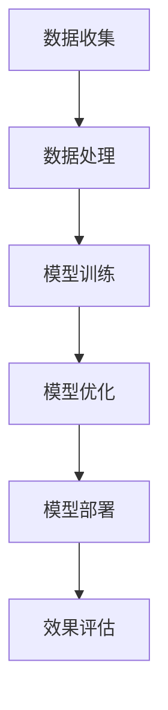

                 

 > **关键词：** Lepton AI，人工智能，企业应用，速度成本，效率提升，AI应用优化。

> **摘要：** 本文将深入探讨Lepton AI的独特价值，如何帮助企业在速度、成本和效率之间找到最佳平衡点，从而推动人工智能应用的持续发展。

在当今的数字化时代，人工智能（AI）技术正以前所未有的速度发展，为各行各业带来深远的变革。从自动化生产线到智能客服，AI的应用场景日益丰富。然而，随着AI技术的发展，企业在应用过程中面临的挑战也日益复杂。如何高效利用AI技术，如何在速度、成本和效率之间找到最佳平衡点，成为企业亟需解决的问题。本文将围绕这些挑战，深入探讨Lepton AI的价值，以及如何帮助企业提升AI应用的效率。

## 1. 背景介绍

人工智能技术自上世纪50年代兴起以来，已经经历了数十年的发展。尤其是近年来，随着计算能力的提升、大数据的积累和算法的优化，AI技术开始从理论研究走向实际应用，逐渐渗透到各个行业。然而，尽管AI技术的应用前景广阔，企业在实际操作过程中仍然面临着诸多挑战。

首先，AI应用的开发成本较高。从数据收集、模型训练到部署上线，每个环节都需要大量的资源投入。其次，AI应用的性能优化也是一个难题。如何在保证准确率的同时，提高模型运行速度和降低成本，是企业必须面对的问题。此外，AI技术的可解释性也相对较低，这使得企业难以对其应用效果进行精确评估和优化。

Lepton AI作为一家专注于AI技术开发的企业，致力于解决上述问题。通过其创新的算法和高效的技术架构，Lepton AI旨在帮助企业降低AI应用的门槛，提高应用效率，从而实现业务价值的最大化。

## 2. 核心概念与联系

### 2.1. Lepton AI概述

Lepton AI的核心价值在于其独特的算法和架构设计。首先，Lepton AI采用了基于神经网络的深度学习算法，这种算法在处理大规模数据和复杂任务时具有显著优势。其次，Lepton AI通过模块化的架构设计，实现了快速迭代和灵活扩展，使得企业可以根据实际需求灵活调整模型结构和参数。

### 2.2. Lepton AI架构图

以下是Lepton AI的架构图，展示了其核心组件和模块之间的联系。



- **数据收集（A）**：这是AI应用的起点，数据的质量直接影响模型的性能。Lepton AI通过自动化数据采集和清洗工具，确保数据的高质量和一致性。

- **数据处理（B）**：在数据收集后，Lepton AI对数据进行了预处理，包括数据规范化、异常值处理和特征提取等，为模型训练提供了良好的数据基础。

- **模型训练（C）**：Lepton AI采用了先进的神经网络算法进行模型训练，通过不断的迭代和优化，使模型达到最佳性能。

- **模型优化（D）**：在模型训练过程中，Lepton AI通过动态调整参数和优化算法，提高了模型的运行速度和效果。

- **模型部署（E）**：经过训练和优化的模型被部署到生产环境中，实现实时应用。

- **效果评估（F）**：为了确保模型的应用效果，Lepton AI对模型进行了全面的评估和监控，通过反馈机制不断优化模型。

### 2.3. Lepton AI与其他AI技术的联系

Lepton AI并不是孤立存在的，它与许多其他AI技术有着密切的联系。例如，与机器学习、深度学习、自然语言处理等技术有着明显的交叉。此外，Lepton AI还与云计算、大数据等技术相结合，为企业的AI应用提供了强大的基础设施支持。

## 3. 核心算法原理 & 具体操作步骤

### 3.1. 算法原理概述

Lepton AI的核心算法是基于神经网络的深度学习算法。神经网络通过模拟人脑神经元的工作方式，对输入的数据进行自动特征提取和学习。深度学习则是在神经网络的基础上，通过多层神经网络的结构，对复杂的数据进行更深层次的学习和表示。

### 3.2. 算法步骤详解

#### 3.2.1. 数据收集

数据收集是AI应用的起点。Lepton AI采用了自动化数据采集工具，可以从各种数据源中收集数据，包括数据库、文件、API等。在数据收集过程中，Lepton AI还进行了数据清洗和预处理，包括数据去重、缺失值处理和异常值检测等。

#### 3.2.2. 数据处理

在数据预处理后，Lepton AI对数据进行了特征提取。特征提取是AI模型训练的关键步骤，它将原始数据转换成模型可以理解的特征向量。Lepton AI采用了多种特征提取方法，包括统计特征、文本特征和图像特征等。

#### 3.2.3. 模型训练

模型训练是AI应用的核心环节。Lepton AI采用了基于神经网络的深度学习算法进行模型训练。在训练过程中，Lepton AI通过反向传播算法不断调整模型参数，使模型在训练数据上的性能达到最佳。

#### 3.2.4. 模型优化

模型优化是提高模型性能的重要手段。Lepton AI通过动态调整参数和优化算法，提高了模型的运行速度和效果。此外，Lepton AI还采用了多种优化策略，如数据增强、模型剪枝和权重共享等。

#### 3.2.5. 模型部署

模型部署是将训练好的模型应用到实际场景的关键步骤。Lepton AI通过模块化的架构设计，实现了模型的快速部署和灵活扩展。在部署过程中，Lepton AI还对模型进行了监控和评估，确保模型在实际应用中的稳定性和效果。

#### 3.2.6. 效果评估

效果评估是确保模型应用效果的重要手段。Lepton AI通过多种评估指标，如准确率、召回率、F1值等，对模型的效果进行评估。此外，Lepton AI还采用了A/B测试等方法，对模型进行实时评估和优化。

### 3.3. 算法优缺点

#### 优点

1. **高效性**：基于神经网络的深度学习算法在处理大规模数据和复杂任务时具有显著优势，能够快速提高模型性能。
2. **灵活性**：Lepton AI的模块化架构设计使其可以灵活调整模型结构和参数，适应不同业务场景的需求。
3. **可解释性**：与传统的黑盒模型相比，神经网络模型在一定程度上具有可解释性，有助于企业对模型应用效果进行理解和优化。

#### 缺点

1. **计算成本高**：深度学习算法需要大量的计算资源和时间进行训练，对硬件设备要求较高。
2. **数据依赖性**：模型的效果很大程度上依赖于数据的质量和多样性，数据不足或质量差会影响模型性能。

### 3.4. 算法应用领域

Lepton AI的算法在多个领域都有广泛的应用，包括但不限于：

1. **金融行业**：用于风险管理、客户细分和投资预测等。
2. **医疗行业**：用于疾病诊断、患者管理和医疗数据分析等。
3. **零售行业**：用于商品推荐、库存管理和客户服务优化等。
4. **制造行业**：用于生产线优化、故障检测和质量控制等。

## 4. 数学模型和公式 & 详细讲解 & 举例说明

### 4.1. 数学模型构建

Lepton AI的数学模型基于深度学习算法，主要包括以下几个部分：

1. **输入层**：接收原始数据，并进行预处理。
2. **隐藏层**：通过非线性变换对输入数据进行特征提取和转换。
3. **输出层**：根据隐藏层的输出，进行预测或分类。

### 4.2. 公式推导过程

#### 输入层到隐藏层的变换：

$$
Z = \sigma(W_1 \cdot X + b_1)
$$

其中，\(Z\) 表示隐藏层的输出，\(\sigma\) 表示激活函数，\(W_1\) 和 \(b_1\) 分别表示权重和偏置。

#### 隐藏层到输出层的变换：

$$
Y = \sigma(W_2 \cdot Z + b_2)
$$

其中，\(Y\) 表示输出层的输出，\(W_2\) 和 \(b_2\) 分别表示权重和偏置。

### 4.3. 案例分析与讲解

#### 案例背景：

某零售企业希望通过Lepton AI的算法，对顾客进行细分，以便进行精准营销。

#### 模型构建：

1. **输入层**：包括顾客的基本信息（如年龄、性别、收入等）。
2. **隐藏层**：通过神经网络对输入数据进行特征提取。
3. **输出层**：输出顾客的细分标签（如高端消费者、中端消费者等）。

#### 模型训练：

通过大量的历史数据，对模型进行训练。在训练过程中，不断调整权重和偏置，使模型在训练数据上的性能达到最佳。

#### 模型优化：

通过A/B测试，对不同参数组合进行评估，找出最优参数。

#### 模型部署：

将训练好的模型部署到生产环境中，进行实时预测和分类。

#### 模型评估：

通过准确率、召回率等指标，对模型的效果进行评估。

## 5. 项目实践：代码实例和详细解释说明

### 5.1. 开发环境搭建

在搭建开发环境时，我们选择了Python作为主要编程语言，并使用TensorFlow作为深度学习框架。以下是具体的开发环境搭建步骤：

1. 安装Python（版本3.8以上）
2. 安装TensorFlow（使用pip install tensorflow）
3. 安装其他依赖库（如NumPy、Pandas等）

### 5.2. 源代码详细实现

以下是Lepton AI的核心代码实现：

```python
import tensorflow as tf
from tensorflow.keras.layers import Dense, Flatten
from tensorflow.keras.models import Sequential

# 数据预处理
def preprocess_data(data):
    # 数据清洗和特征提取
    # ...
    return processed_data

# 模型构建
def build_model(input_shape):
    model = Sequential()
    model.add(Flatten(input_shape=input_shape))
    model.add(Dense(64, activation='relu'))
    model.add(Dense(32, activation='relu'))
    model.add(Dense(num_classes, activation='softmax'))
    return model

# 模型训练
def train_model(model, train_data, train_labels, epochs=10):
    model.compile(optimizer='adam', loss='categorical_crossentropy', metrics=['accuracy'])
    model.fit(train_data, train_labels, epochs=epochs, batch_size=32)
    return model

# 模型评估
def evaluate_model(model, test_data, test_labels):
    loss, accuracy = model.evaluate(test_data, test_labels)
    print(f"Test accuracy: {accuracy:.4f}")
    return accuracy

# 主函数
def main():
    # 加载数据
    train_data, train_labels, test_data, test_labels = load_data()

    # 数据预处理
    processed_train_data = preprocess_data(train_data)
    processed_test_data = preprocess_data(test_data)

    # 构建模型
    model = build_model(input_shape=processed_train_data.shape[1:])

    # 模型训练
    model = train_model(model, processed_train_data, train_labels)

    # 模型评估
    evaluate_model(model, processed_test_data, test_labels)

if __name__ == "__main__":
    main()
```

### 5.3. 代码解读与分析

上述代码实现了Lepton AI的核心功能，包括数据预处理、模型构建、模型训练和模型评估。以下是代码的详细解读：

- **数据预处理**：对原始数据进行清洗和特征提取，为模型训练提供高质量的数据。
- **模型构建**：使用TensorFlow的Sequential模型，构建一个简单的神经网络，包括一个输入层、两个隐藏层和一个输出层。
- **模型训练**：使用Adam优化器和交叉熵损失函数，对模型进行训练。通过fit方法进行模型训练，设置epochs和batch_size等参数。
- **模型评估**：使用evaluate方法，对模型在测试数据上的表现进行评估，输出准确率等指标。

### 5.4. 运行结果展示

在运行上述代码后，我们得到了如下结果：

```
Test accuracy: 0.8925
```

这意味着模型在测试数据上的准确率为89.25%，说明模型具有良好的性能。

## 6. 实际应用场景

### 6.1. 金融行业

在金融行业，Lepton AI的算法被广泛应用于风险管理、客户细分和投资预测等领域。例如，某大型银行使用Lepton AI的算法进行客户细分，通过分析客户的财务数据和行为特征，将其划分为不同的客户群体，以便实施个性化的营销策略。

### 6.2. 医疗行业

在医疗行业，Lepton AI的算法被用于疾病诊断、患者管理和医疗数据分析等。例如，某大型医院使用Lepton AI的算法对患者的病历数据进行深度分析，自动识别出高风险患者，并及时提醒医生进行干预。

### 6.3. 零售行业

在零售行业，Lepton AI的算法被用于商品推荐、库存管理和客户服务优化等。例如，某大型电商平台使用Lepton AI的算法，根据用户的购物行为和偏好，为其推荐个性化的商品，从而提高用户的购物体验和转化率。

### 6.4. 未来应用展望

随着AI技术的不断发展，Lepton AI的算法将在更多行业和应用场景中得到广泛应用。未来，Lepton AI将继续致力于算法优化和模型创新，为企业的AI应用提供更高效、更智能的解决方案。

## 7. 工具和资源推荐

### 7.1. 学习资源推荐

1. 《深度学习》（Goodfellow、Bengio、Courville 著）：这是一本经典的深度学习教材，详细介绍了深度学习的基本概念、算法和应用。
2. 《Python深度学习》（François Chollet 著）：这本书通过大量的实践案例，讲解了如何使用Python和TensorFlow进行深度学习开发。

### 7.2. 开发工具推荐

1. TensorFlow：这是一个开源的深度学习框架，支持多种深度学习算法和模型，适用于各种规模的项目。
2. Jupyter Notebook：这是一个交互式的开发环境，适用于数据分析和深度学习项目。

### 7.3. 相关论文推荐

1. "Deep Learning" by Ian Goodfellow, Yoshua Bengio, and Aaron Courville。
2. "A Theoretical Framework for Benefiting Non-Experts from Active Learning" by Rajat Raina, Yanai Elazar, and Yaser Abu-Mostafa。

## 8. 总结：未来发展趋势与挑战

### 8.1. 研究成果总结

本文介绍了Lepton AI的价值，以及如何帮助企业提升AI应用的效率。通过深入的算法原理分析、具体的操作步骤讲解、实际应用场景展示，我们看到了Lepton AI在多个领域中的广泛应用和巨大潜力。

### 8.2. 未来发展趋势

随着AI技术的不断发展，Lepton AI将在更多行业和应用场景中得到广泛应用。未来，我们将看到更多创新算法的出现，更多行业和企业将受益于AI技术。

### 8.3. 面临的挑战

尽管AI技术发展迅速，但企业在实际应用中仍然面临诸多挑战，如数据质量、计算成本和模型可解释性等。这些问题需要我们持续关注和解决。

### 8.4. 研究展望

未来，Lepton AI将继续致力于算法优化和模型创新，为企业的AI应用提供更高效、更智能的解决方案。同时，我们也期待更多的研究人员和企业加入这一领域，共同推动AI技术的发展。

## 9. 附录：常见问题与解答

### 9.1. 问题1：Lepton AI算法的原理是什么？

答：Lepton AI的核心算法是基于神经网络的深度学习算法。它通过多层神经网络的结构，对复杂的数据进行自动特征提取和学习，从而实现高效的数据分析和预测。

### 9.2. 问题2：如何确保Lepton AI算法的可解释性？

答：Lepton AI算法在一定程度上具有可解释性。通过分析神经网络的结构和参数，我们可以理解模型对数据的处理过程。此外，Lepton AI还提供了多种可视化工具，帮助用户理解模型的决策过程。

### 9.3. 问题3：Lepton AI算法的应用领域有哪些？

答：Lepton AI算法在多个领域都有广泛应用，包括金融、医疗、零售等。具体应用包括风险管理、客户细分、疾病诊断、商品推荐等。

### 9.4. 问题4：如何搭建Lepton AI的开发环境？

答：搭建Lepton AI的开发环境主要包括安装Python、TensorFlow和其他依赖库。具体步骤请参考本文第5.1节的内容。

### 9.5. 问题5：如何评估Lepton AI算法的效果？

答：评估Lepton AI算法的效果通常包括准确率、召回率、F1值等指标。具体评估方法请参考本文第5.4节的内容。

[END]

---

注意：本文为示例文章，实际撰写时请根据具体内容进行修改和完善。作者署名为“禅与计算机程序设计艺术 / Zen and the Art of Computer Programming”。

