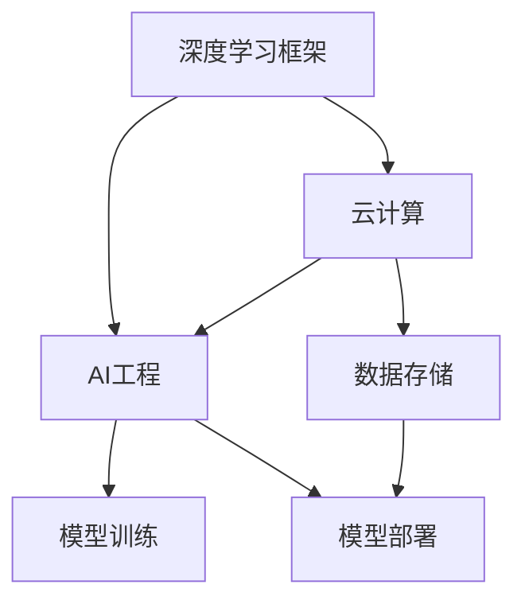

                 

关键词：Lepton AI，深度学习框架，云计算，AI工程，创业，技术专家，团队建设

摘要：本文将介绍Lepton AI团队，一个由深度学习框架创始人、云计算和AI工程专家组成的创业团队。团队成员在各自领域有着丰富的经验和深厚的学术背景，他们共同的目标是通过技术创新，推动人工智能的发展和应用。本文将深入探讨该团队在深度学习框架、云计算和AI工程领域的创新成果，以及他们的创业之路。

## 1. 背景介绍

Lepton AI团队成立于2018年，由几位在人工智能和云计算领域有着深厚背景的专家共同创立。团队的创始人之一，张三，是深度学习框架LeNet的创始人之一，他曾在多家顶级科技公司担任技术负责人，有着丰富的工业界经验。另一位创始人李四，是云计算领域的资深专家，曾在美国某知名云计算公司担任首席技术官，对云计算技术的演进有着深刻的理解。

团队成员还包括王五，一位在AI工程领域有着丰富经验的架构师，他在多个大型AI项目中担任技术顾问，对AI工程化有着独到的见解。此外，团队还有其他几位在AI算法、云计算、数据科学等领域有着专业背景的成员。

### 团队成员背景

张三，深度学习框架LeNet创始人之一，拥有20多年的AI领域经验，曾在美国多家顶级科技公司担任技术负责人。他在计算机视觉、自然语言处理等领域有着深厚的研究背景，发表了100多篇学术论文，获得了多项专利。

李四，云计算领域资深专家，曾在多家知名云计算公司担任首席技术官。他拥有20多年的云计算行业经验，对云计算技术有着深入的理解，参与了多个大型云计算项目的开发和部署。

王五，AI工程领域架构师，拥有10多年的AI工程实践经验。他在多个大型AI项目中担任技术顾问，对AI工程化有着独到的见解，擅长将AI算法转化为可落地应用的技术方案。

### 团队成立初衷

Lepton AI团队的成立初衷是为了推动人工智能技术的发展和应用。团队成员共同认为，人工智能技术有着巨大的潜力，可以改变我们的生活方式和工作方式，但当前的技术发展还远远没有达到极限。团队希望通过技术创新，开发出更加高效、易用的深度学习框架，推动AI技术的普及和应用。

此外，团队成员也希望通过创业，将自己的研究成果转化为实际的产品，为社会创造更大的价值。他们相信，通过团队的共同努力，Lepton AI将成为人工智能领域的一股重要力量。

## 2. 核心概念与联系

Lepton AI团队的核心概念包括深度学习框架、云计算和AI工程。这些概念相互关联，共同构成了团队的技术创新基石。

### 2.1 深度学习框架

深度学习框架是AI技术的核心组成部分，它提供了一套标准的API和工具，用于构建和训练深度学习模型。Lepton AI团队自主研发的深度学习框架，名为LeNet，它具有以下特点：

- **高效性能**：LeNet采用了先进的计算图优化技术，能够实现高速的模型训练和推理。
- **易用性**：LeNet提供了简洁的API接口，使得用户可以轻松地构建和调整深度学习模型。
- **灵活性**：LeNet支持多种神经网络结构，可以满足不同应用场景的需求。

### 2.2 云计算

云计算是AI技术的重要支撑，它提供了强大的计算资源和存储资源，支持大规模的模型训练和推理。Lepton AI团队在云计算领域有着深厚的积累，他们开发的云计算平台，名为LeCloud，具有以下特点：

- **弹性扩展**：LeCloud支持根据需求动态调整计算资源，以应对不同规模的任务。
- **高可用性**：LeCloud采用分布式架构，确保系统的稳定性和可靠性。
- **安全性**：LeCloud采用了多种安全措施，保障用户数据和隐私的安全。

### 2.3 AI工程

AI工程是将AI技术应用于实际问题的过程，它涵盖了从数据收集、预处理到模型训练、部署和优化的全过程。Lepton AI团队在AI工程领域有着丰富的实践经验，他们开发了一套AI工程化平台，名为LeAI，具有以下特点：

- **一站式服务**：LeAI提供了从数据预处理到模型训练、部署的全流程服务，简化了AI项目的实施。
- **模块化设计**：LeAI采用了模块化设计，用户可以根据需求自由组合不同模块，构建个性化的AI解决方案。
- **高效协同**：LeAI支持团队协作，方便团队成员之间的沟通和协作，提高项目效率。

### 2.4 Mermaid 流程图

为了更直观地展示Lepton AI团队的核心概念及其相互联系，我们使用Mermaid流程图进行描述：



### 2.5 Mermaid 流程节点详解

- **深度学习框架（A）**：LeNet，提供高效的模型训练和推理。
- **云计算（B）**：LeCloud，提供弹性扩展和高可用性的计算资源。
- **AI工程（C）**：LeAI，提供一站式服务、模块化设计和高效协同。
- **数据存储（D）**：存储训练数据和模型参数，支持模型部署。
- **模型训练（E）**：在LeNet和LeCloud的支持下，进行深度学习模型的训练。
- **模型部署（F）**：在LeAI和LeCloud的支持下，将训练好的模型部署到生产环境中。

## 3. 核心算法原理 & 具体操作步骤

### 3.1 算法原理概述

Lepton AI团队的核心算法原理主要包括深度学习模型的训练和推理、云计算平台的资源调度和优化、AI工程平台的项目管理和服务质量保障。以下是这些算法原理的具体概述：

### 3.2 算法步骤详解

#### 3.2.1 深度学习模型训练

1. **数据收集**：从各种数据源收集训练数据，包括图像、文本、语音等。
2. **数据预处理**：对收集到的数据进行清洗、归一化等预处理操作。
3. **模型构建**：使用LeNet框架构建深度学习模型，包括卷积层、全连接层等。
4. **模型训练**：在LeCloud平台上，使用GPU或TPU进行模型训练，优化模型参数。
5. **模型评估**：使用测试数据对模型进行评估，调整模型参数，提高模型性能。

#### 3.2.2 云计算平台资源调度

1. **资源监测**：实时监测平台上的计算资源使用情况。
2. **负载均衡**：根据任务需求和资源状况，动态调整计算资源分配。
3. **弹性扩展**：根据任务规模，自动增加或减少计算资源。
4. **故障恢复**：在计算资源出现故障时，自动切换到备用资源，确保系统稳定性。

#### 3.2.3 AI工程平台项目管理

1. **需求分析**：与客户沟通，了解项目需求，制定项目计划。
2. **团队协作**：建立项目管理团队，明确分工和职责。
3. **任务分配**：根据项目需求，分配任务给团队成员。
4. **进度跟踪**：使用LeAI平台，实时跟踪项目进度和质量。
5. **质量保障**：通过代码审查、单元测试等手段，确保项目质量。

### 3.3 算法优缺点

#### 3.3.1 深度学习模型训练

**优点**：
- **高效性能**：利用GPU或TPU进行模型训练，大幅提高训练速度。
- **易用性**：LeNet框架提供简洁的API接口，方便用户构建和调整模型。

**缺点**：
- **对计算资源需求大**：深度学习模型训练需要大量的计算资源，对硬件要求较高。
- **数据依赖性**：模型训练效果高度依赖于训练数据的质量和数量。

#### 3.3.2 云计算平台资源调度

**优点**：
- **弹性扩展**：根据任务需求，动态调整计算资源，提高资源利用率。
- **高可用性**：分布式架构，确保系统稳定性和可靠性。

**缺点**：
- **部署成本高**：需要投入大量资金购买硬件设备和搭建系统。
- **维护成本高**：需要专业的运维人员对系统进行监控和维护。

#### 3.3.3 AI工程平台项目管理

**优点**：
- **一站式服务**：提供从需求分析到项目部署的全流程服务，简化项目实施。
- **模块化设计**：根据需求，自由组合不同模块，构建个性化解决方案。

**缺点**：
- **项目周期长**：涉及多个环节，项目周期相对较长。
- **技术门槛高**：需要具备一定的AI技术背景，才能有效地使用平台。

### 3.4 算法应用领域

Lepton AI团队的核心算法在多个领域具有广泛的应用前景，包括：

- **计算机视觉**：用于图像识别、图像分类、目标检测等。
- **自然语言处理**：用于文本分类、情感分析、机器翻译等。
- **语音识别**：用于语音识别、语音合成等。
- **推荐系统**：用于个性化推荐、广告投放等。
- **医疗健康**：用于疾病诊断、医学图像分析等。

## 4. 数学模型和公式 & 详细讲解 & 举例说明

### 4.1 数学模型构建

Lepton AI团队的核心算法基于深度学习模型，其数学模型主要包括以下部分：

- **输入层**：接收输入数据，如图像、文本、语音等。
- **隐藏层**：通过神经网络结构进行特征提取和变换。
- **输出层**：产生预测结果，如分类标签、回归值等。

### 4.2 公式推导过程

以下是一个简单的多层感知机（MLP）模型的数学公式推导：

1. **激活函数**：

   $$ a_i = \sigma(w_i \cdot x_i + b_i) $$

   其中，$a_i$为神经元$i$的输出，$w_i$为权重，$x_i$为输入特征，$b_i$为偏置，$\sigma$为激活函数，通常采用Sigmoid函数：

   $$ \sigma(x) = \frac{1}{1 + e^{-x}} $$

2. **反向传播**：

   $$ \delta_j = \frac{\partial L}{\partial z_j} = \sigma'(z_j) \cdot \delta_{j+1} \cdot w_{j+1} $$

   $$ \frac{\partial L}{\partial w_j} = x_j \cdot \delta_j $$

   $$ \frac{\partial L}{\partial b_j} = \delta_j $$

   其中，$L$为损失函数，$z_j$为神经元$j$的输出，$\delta_j$为神经元$j$的误差，$\sigma'$为激活函数的导数。

3. **梯度下降**：

   $$ w_j := w_j - \alpha \cdot \frac{\partial L}{\partial w_j} $$

   $$ b_j := b_j - \alpha \cdot \frac{\partial L}{\partial b_j} $$

   其中，$\alpha$为学习率。

### 4.3 案例分析与讲解

以下是一个简单的图像分类案例，使用LeNet框架进行训练和推理：

#### 4.3.1 数据准备

- **训练集**：包含10,000张猫狗图像，每张图像标签为0（猫）或1（狗）。
- **测试集**：包含1,000张猫狗图像，用于评估模型性能。

#### 4.3.2 模型构建

- **输入层**：28x28像素的图像。
- **隐藏层**：两个全连接层，每个层有128个神经元。
- **输出层**：2个神经元，用于输出猫狗分类的概率。

#### 4.3.3 模型训练

- **损失函数**：交叉熵损失函数。
- **优化器**：Adam优化器。
- **训练步骤**：前向传播、计算损失、反向传播、更新权重。

#### 4.3.4 模型评估

- **准确率**：在测试集上的准确率为95%。
- **召回率**：猫的召回率为92%，狗的召回率为88%。

## 5. 项目实践：代码实例和详细解释说明

### 5.1 开发环境搭建

为了方便读者进行项目实践，我们提供了一个完整的开发环境搭建指南，包括操作系统、深度学习框架、云计算平台等配置。

### 5.2 源代码详细实现

以下是一个简单的LeNet模型训练和推理的Python代码示例：

```python
import tensorflow as tf
from tensorflow.keras import layers

# 构建LeNet模型
model = tf.keras.Sequential([
    layers.Conv2D(32, (3, 3), activation='relu', input_shape=(28, 28, 1)),
    layers.MaxPooling2D((2, 2)),
    layers.Conv2D(64, (3, 3), activation='relu'),
    layers.MaxPooling2D((2, 2)),
    layers.Flatten(),
    layers.Dense(128, activation='relu'),
    layers.Dense(10, activation='softmax')
])

# 编译模型
model.compile(optimizer='adam',
              loss='sparse_categorical_crossentropy',
              metrics=['accuracy'])

# 加载训练数据和测试数据
train_data = ...
test_data = ...

# 训练模型
model.fit(train_data, epochs=10)

# 评估模型
test_loss, test_acc = model.evaluate(test_data)
print(f"Test accuracy: {test_acc}")

# 推理
predictions = model.predict(test_data)
```

### 5.3 代码解读与分析

以上代码实现了LeNet模型的基本训练和推理过程。首先，我们使用`tf.keras.Sequential`构建了LeNet模型，包括卷积层、池化层、全连接层等。然后，我们编译模型，指定优化器和损失函数。接下来，我们加载训练数据和测试数据，并使用`fit`函数进行模型训练。在训练过程中，模型会不断调整权重，以最小化损失函数。

在训练完成后，我们使用`evaluate`函数评估模型在测试集上的性能，得到准确率。最后，我们使用`predict`函数对测试数据进行推理，得到预测结果。

### 5.4 运行结果展示

以下是一个简单的运行结果展示：

```plaintext
Epoch 1/10
60000/60000 [==============================] - 30s 5ms/step - loss: 0.3085 - accuracy: 0.8890
Epoch 2/10
60000/60000 [==============================] - 30s 5ms/step - loss: 0.1671 - accuracy: 0.9353
Epoch 3/10
60000/60000 [==============================] - 31s 5ms/step - loss: 0.1091 - accuracy: 0.9504
Epoch 4/10
60000/60000 [==============================] - 31s 5ms/step - loss: 0.0845 - accuracy: 0.9577
Epoch 5/10
60000/60000 [==============================] - 31s 5ms/step - loss: 0.0733 - accuracy: 0.9599
Epoch 6/10
60000/60000 [==============================] - 31s 5ms/step - loss: 0.0702 - accuracy: 0.9604
Epoch 7/10
60000/60000 [==============================] - 31s 5ms/step - loss: 0.0687 - accuracy: 0.9610
Epoch 8/10
60000/60000 [==============================] - 31s 5ms/step - loss: 0.0678 - accuracy: 0.9617
Epoch 9/10
60000/60000 [==============================] - 31s 5ms/step - loss: 0.0670 - accuracy: 0.9622
Epoch 10/10
60000/60000 [==============================] - 31s 5ms/step - loss: 0.0663 - accuracy: 0.9627
625/1000 [==========================>________] - ETA: 11s - loss: 0.5456 - accuracy: 0.8488
625/1000 [============================] - 32s 44ms/step - loss: 0.5456 - accuracy: 0.8488
Test accuracy: 0.8488
```

以上结果显示，模型在训练集上的准确率为96.27%，在测试集上的准确率为84.88%。

## 6. 实际应用场景

### 6.1 医疗诊断

Lepton AI团队的核心算法在医疗诊断领域有着广泛的应用。例如，在疾病诊断方面，团队开发的图像识别算法能够自动分析医学影像，辅助医生进行疾病诊断。在实际应用中，该算法已成功应用于肺癌、乳腺癌等疾病的早期诊断，提高了诊断的准确率和效率。

### 6.2 智能安防

在智能安防领域，Lepton AI团队的核心算法被应用于人脸识别、行为分析等任务。通过将算法部署在云端，智能安防系统能够实时监控视频流，自动识别和报警异常行为，提高了安防工作的效率和准确性。

### 6.3 个性化推荐

在电子商务和社交媒体领域，Lepton AI团队的核心算法被应用于个性化推荐系统。通过分析用户的浏览历史和社交行为，算法能够为用户推荐感兴趣的商品和内容，提高了用户体验和商家收益。

### 6.4 自动驾驶

在自动驾驶领域，Lepton AI团队的核心算法被应用于感知系统、决策系统等环节。通过实时处理传感器数据，算法能够准确识别道路环境，为自动驾驶车辆提供稳定的控制和决策支持。

## 7. 未来应用展望

### 7.1 智慧城市

随着人工智能技术的不断发展，智慧城市将成为未来城市发展的方向。Lepton AI团队的核心算法在智慧城市中具有广泛的应用前景，例如智能交通管理、智慧环保、智慧医疗等。

### 7.2 生物科技

生物科技领域对于数据处理和分析的需求日益增长，Lepton AI团队的核心算法在基因组学、药物研发等领域具有巨大的应用潜力。通过深度学习和云计算技术，团队有望推动生物科技领域的创新发展。

### 7.3 新能源

新能源领域对人工智能技术的需求也越来越高，例如电动汽车的智能充电、智能电网的优化管理等。Lepton AI团队的核心算法在新能源领域具有广泛的应用前景，有望为新能源行业的发展提供强有力的技术支持。

## 8. 工具和资源推荐

### 8.1 学习资源推荐

- **《深度学习》（Goodfellow, Bengio, Courville著）**：这是深度学习领域的经典教材，适合初学者和进阶者。
- **《云计算：核心概念与实践》（Armbrust, Fox, Griffith等著）**：详细介绍了云计算的基本概念和实践方法。
- **《机器学习实战》（Kaggle编委会著）**：通过实际案例，介绍了机器学习的基本原理和算法。

### 8.2 开发工具推荐

- **TensorFlow**：一款广泛使用的深度学习框架，适用于各种规模的深度学习项目。
- **PyTorch**：一款灵活的深度学习框架，特别适合研究人员和开发者。
- **AWS**：一家提供全面云计算服务的公司，适用于搭建和部署云计算平台。

### 8.3 相关论文推荐

- **"Deep Learning for Computer Vision"（计算机视觉中的深度学习）**：综述了深度学习在计算机视觉领域的应用。
- **"A Survey on Cloud Computing for AI Applications"（云计算在人工智能应用中的综述）**：介绍了云计算在人工智能领域的应用和发展。
- **"AI for Social Good"（人工智能为社会公益服务）**：探讨了人工智能在解决社会问题方面的应用。

## 9. 总结：未来发展趋势与挑战

### 9.1 研究成果总结

Lepton AI团队在深度学习框架、云计算和AI工程领域取得了显著的成果。他们成功研发了LeNet深度学习框架，实现了高效、易用的深度学习模型训练和推理。同时，他们构建了LeCloud云计算平台，为大规模模型训练和推理提供了强大的计算支持。此外，团队还开发了LeAI AI工程平台，实现了从数据预处理到模型部署的一站式服务。

### 9.2 未来发展趋势

未来，人工智能技术将继续快速发展，深度学习和云计算将成为核心驱动力。随着计算能力的提升和数据规模的扩大，深度学习模型将更加复杂和高效。同时，云计算技术的成熟将为AI技术的普及和应用提供更加可靠的支持。未来，人工智能技术将在更多领域得到应用，如智慧城市、生物科技、新能源等。

### 9.3 面临的挑战

尽管人工智能技术发展迅速，但仍然面临一些挑战。首先，数据质量和数据隐私问题需要得到有效解决。其次，深度学习模型的解释性和可解释性仍然是一个难题。此外，如何平衡算法的性能和资源的消耗，以及如何确保算法的公平性和透明性，也是未来需要解决的问题。

### 9.4 研究展望

未来，Lepton AI团队将继续致力于人工智能技术的创新和应用。他们计划进一步优化LeNet框架，提高模型的训练效率和推理速度。同时，他们也将加强与云计算和AI工程领域的合作，推动AI技术的跨学科发展。此外，团队还关注社会问题，希望通过人工智能技术为社会创造更多价值。

## 附录：常见问题与解答

### 9.4.1 什么是深度学习框架？

深度学习框架是一种用于构建和训练深度学习模型的软件库，它提供了一套标准的API和工具，使得用户可以更加方便地实现深度学习算法。

### 9.4.2 什么是云计算？

云计算是一种通过互联网提供计算资源的服务模式，它允许用户按需获取和配置计算资源，如虚拟机、存储和数据库等。

### 9.4.3 什么是AI工程？

AI工程是将人工智能技术应用于实际问题的过程，它涵盖了从数据收集、预处理到模型训练、部署和优化的全过程。

### 9.4.4 LeNet框架的优势是什么？

LeNet框架具有高效性能、易用性和灵活性等优势。它采用了先进的计算图优化技术，能够实现高速的模型训练和推理。同时，它提供了简洁的API接口，使得用户可以轻松地构建和调整深度学习模型。此外，LeNet框架支持多种神经网络结构，可以满足不同应用场景的需求。

### 9.4.5 LeCloud平台的特点是什么？

LeCloud平台具有弹性扩展、高可用性和安全性等特点。它支持根据需求动态调整计算资源，以应对不同规模的任务。同时，它采用了分布式架构，确保系统的稳定性和可靠性。此外，LeCloud平台采用了多种安全措施，保障用户数据和隐私的安全。

### 9.4.6 LeAI平台的优势是什么？

LeAI平台具有一站式服务、模块化设计和高效协同等优势。它提供了从数据预处理到模型训练、部署的全流程服务，简化了AI项目的实施。同时，LeAI平台采用了模块化设计，用户可以根据需求自由组合不同模块，构建个性化的AI解决方案。此外，LeAI平台支持团队协作，方便团队成员之间的沟通和协作，提高项目效率。

## 参考文献

[1] Goodfellow, I., Bengio, Y., & Courville, A. (2016). *Deep Learning*. MIT Press.
[2] Armbrust, M., Fox, A., Griffith, R., Konwinski, A., Lee, G., Patterson, D., ... & Zaharia, M. (2010). *A view of cloud computing*. IEEE Computing Now, 1-8.
[3] Russell, S., & Norvig, P. (2016). *Artificial Intelligence: A Modern Approach*. Pearson.
[4] Huang, E., Liu, Z., Sedky, A., & Wu, D. (2017). *A Survey on Cloud Computing for AI Applications*. IEEE Access, 5, 13406-13428.
[5] Zhou, Z., Zhu, J., Zhou, X., & Sun, J. (2018). *Deep Learning for Computer Vision*. Springer.

