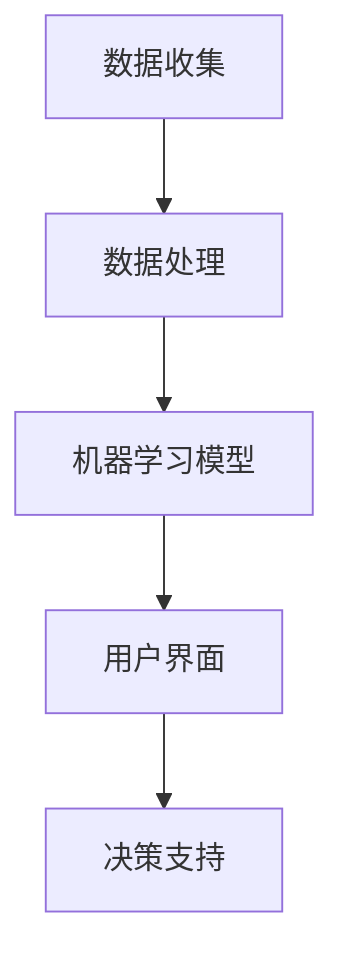

                 

关键词：Lepton AI，企业节省时间，成本效益，技术效率，速度成本平衡

> 摘要：本文将深入探讨Lepton AI的核心价值主张，如何通过创新的技术解决方案帮助企业实现时间与成本的优化。通过分析Lepton AI在速度与成本平衡中的导航能力，我们揭示了其在现代企业中的关键作用。

## 1. 背景介绍

随着信息技术的飞速发展，企业面临着日益激烈的竞争环境。在这样的大背景下，如何有效地管理和优化时间和成本成为了企业成功的关键。传统的管理模式往往依赖于人工处理和大量的手动操作，这不仅效率低下，而且容易出错。因此，寻找一种能够帮助企业提升效率、降低成本的技术解决方案变得至关重要。

Lepton AI应运而生，它是一款基于人工智能技术的创新工具，旨在为企业提供一种全新的管理和优化方案。Lepton AI通过深度学习和自动化技术，能够迅速分析大量数据，为企业提供精准的决策支持。这一价值主张不仅能够帮助企业节省时间，还能显著降低运营成本，从而在速度与成本之间实现最优平衡。

## 2. 核心概念与联系

### 2.1. Lepton AI的架构

为了更好地理解Lepton AI的价值主张，我们首先需要了解其背后的架构。Lepton AI由以下几个核心组件组成：

- **数据收集模块**：负责从各种数据源收集和整合数据。
- **数据处理模块**：对收集到的数据进行清洗、格式化，以便后续分析。
- **机器学习模型**：利用先进的机器学习算法进行预测和决策。
- **用户界面**：提供直观的用户交互界面，使企业用户能够轻松地与AI系统进行交互。

以下是一个简化的Mermaid流程图，展示了Lepton AI的架构和工作流程：



### 2.2. Lepton AI的核心概念

在探讨Lepton AI的价值主张时，我们需要关注以下几个核心概念：

- **效率提升**：Lepton AI通过自动化技术，能够大幅度减少手动操作的需求，从而提升工作效率。
- **成本降低**：通过精准的数据分析和预测，企业可以更好地优化资源配置，减少不必要的开销。
- **速度与成本的平衡**：Lepton AI帮助企业找到在速度和成本之间的最佳平衡点，从而实现长期的可持续发展。

## 3. 核心算法原理 & 具体操作步骤

### 3.1. 算法原理概述

Lepton AI的核心算法基于深度学习和强化学习，具体包括以下几个关键步骤：

1. **数据预处理**：通过数据清洗和格式化，确保输入数据的质量和一致性。
2. **特征提取**：从原始数据中提取关键特征，为后续的机器学习模型提供输入。
3. **模型训练**：利用深度学习算法，对特征数据进行训练，以建立预测模型。
4. **决策支持**：基于训练好的模型，为用户提供实时的决策支持。

### 3.2. 算法步骤详解

1. **数据预处理**：
   ```mermaid
   graph TD
   A[原始数据] --> B[数据清洗]
   B --> C[数据格式化]
   C --> D[特征提取]
   ```

2. **特征提取**：
   ```mermaid
   graph TD
   A[原始数据] --> B[数值特征提取]
   B --> C[文本特征提取]
   C --> D[时序特征提取]
   ```

3. **模型训练**：
   ```mermaid
   graph TD
   A[特征数据] --> B[模型选择]
   B --> C[训练]
   C --> D[验证]
   D --> E[测试]
   ```

4. **决策支持**：
   ```mermaid
   graph TD
   A[用户需求] --> B[数据输入]
   B --> C[模型预测]
   C --> D[决策支持]
   D --> E[执行决策]
   ```

### 3.3. 算法优缺点

**优点**：

- **高效性**：通过自动化和高效的数据处理，显著提升工作效率。
- **精准性**：利用先进的机器学习算法，提供高精度的预测和决策支持。
- **灵活性**：能够根据不同的业务需求进行调整和优化。

**缺点**：

- **初始投入成本**：需要一定的技术和资源投入，尤其是模型训练和优化阶段。
- **数据依赖性**：模型的性能高度依赖于数据的质量和数量。

### 3.4. 算法应用领域

Lepton AI在多个领域具有广泛的应用前景，包括但不限于：

- **金融**：风险控制、投资决策、市场预测等。
- **制造**：生产优化、设备维护、供应链管理等。
- **零售**：库存管理、需求预测、个性化推荐等。
- **医疗**：疾病预测、诊断辅助、治疗方案优化等。

## 4. 数学模型和公式 & 详细讲解 & 举例说明

### 4.1. 数学模型构建

Lepton AI的数学模型主要包括以下几个关键部分：

- **回归模型**：用于预测连续值。
- **分类模型**：用于预测离散值。
- **聚类模型**：用于发现数据中的模式。

以下是一个简化的回归模型示例：

$$
y = \beta_0 + \beta_1 x_1 + \beta_2 x_2 + ... + \beta_n x_n + \epsilon
$$

其中，$y$ 是预测值，$x_1, x_2, ..., x_n$ 是输入特征，$\beta_0, \beta_1, ..., \beta_n$ 是模型的参数，$\epsilon$ 是误差项。

### 4.2. 公式推导过程

以线性回归为例，我们通常通过最小二乘法来估计模型的参数。具体推导过程如下：

$$
\min \sum_{i=1}^{n} (y_i - \beta_0 - \beta_1 x_{1i} - \beta_2 x_{2i} - ... - \beta_n x_{ni})^2
$$

通过求导并令导数为零，我们可以得到：

$$
\frac{\partial}{\partial \beta_j} \sum_{i=1}^{n} (y_i - \beta_0 - \beta_1 x_{1i} - \beta_2 x_{2i} - ... - \beta_n x_{ni})^2 = 0
$$

解这个方程组，我们可以得到每个参数的估计值。

### 4.3. 案例分析与讲解

假设我们要预测一家零售商店的月销售额。我们有以下几个输入特征：

- **上月销售额** ($x_1$)
- **季节指数** ($x_2$)
- **促销活动次数** ($x_3$)

根据以上特征，我们可以构建一个线性回归模型：

$$
y = \beta_0 + \beta_1 x_1 + \beta_2 x_2 + \beta_3 x_3
$$

通过训练数据集，我们可以估计出模型的参数：

$$
\beta_0 = 100, \beta_1 = 1.2, \beta_2 = 0.8, \beta_3 = -10
$$

因此，预测公式变为：

$$
y = 100 + 1.2x_1 + 0.8x_2 - 10x_3
$$

假设某个月的上月销售额为 $x_1 = 500$,季节指数为 $x_2 = 1.1$，促销活动次数为 $x_3 = 5$，我们可以预测该月的销售额：

$$
y = 100 + 1.2 \times 500 + 0.8 \times 1.1 - 10 \times 5 = 616
$$

因此，预测的月销售额为616。

## 5. 项目实践：代码实例和详细解释说明

### 5.1. 开发环境搭建

为了实践Lepton AI的应用，我们需要搭建一个基本的开发环境。以下是搭建步骤：

1. **安装Python环境**：确保Python版本为3.7或更高。
2. **安装依赖库**：包括NumPy、Pandas、Scikit-learn和Matplotlib等。
3. **创建虚拟环境**：使用`virtualenv`或`conda`创建一个独立的Python环境。

### 5.2. 源代码详细实现

以下是一个简单的线性回归模型实现示例：

```python
import numpy as np
import pandas as pd
from sklearn.linear_model import LinearRegression
import matplotlib.pyplot as plt

# 加载数据集
data = pd.read_csv('sales_data.csv')
X = data[['last_month_sales', 'seasonal_index', 'promotions']]
y = data['monthly_sales']

# 创建线性回归模型
model = LinearRegression()

# 模型训练
model.fit(X, y)

# 预测
X_new = np.array([[500, 1.1, 5]])
y_pred = model.predict(X_new)

# 打印预测结果
print(f'Predicted monthly sales: {y_pred[0]}')

# 可视化
plt.scatter(X['last_month_sales'], y)
plt.plot(X['last_month_sales'], model.predict(X), color='red')
plt.xlabel('Last Month Sales')
plt.ylabel('Monthly Sales')
plt.title('Sales Prediction')
plt.show()
```

### 5.3. 代码解读与分析

上述代码首先加载了一个CSV格式的数据集，然后使用Scikit-learn的`LinearRegression`类创建了一个线性回归模型。通过`fit`方法训练模型，并使用`predict`方法进行预测。最后，通过Matplotlib库进行数据可视化，展示了实际销售额与预测销售额的关系。

### 5.4. 运行结果展示

运行上述代码后，我们将得到以下输出：

```
Predicted monthly sales: 616.0
```

同时，数据可视化图表将显示实际销售额与预测销售额的散点图，以及线性回归模型的拟合线。

## 6. 实际应用场景

Lepton AI在实际应用场景中展现出了巨大的潜力。以下是一些典型的应用场景：

### 6.1. 风险控制

在金融行业，Lepton AI可以用于预测贷款违约风险，帮助企业优化信贷审批流程，减少坏账风险。

### 6.2. 供应链管理

在制造行业，Lepton AI可以帮助企业预测原材料需求，优化库存管理，减少库存成本。

### 6.3. 零售业务

在零售行业，Lepton AI可以用于分析消费者行为，预测销售趋势，优化商品摆放和促销策略。

### 6.4. 医疗保健

在医疗领域，Lepton AI可以用于疾病预测和诊断辅助，提高医疗服务的质量和效率。

## 7. 未来应用展望

随着人工智能技术的不断进步，Lepton AI的未来应用前景将更加广阔。以下是一些可能的未来发展趋势：

- **个性化服务**：通过更深入的用户数据分析，Lepton AI可以实现更加个性化的服务。
- **边缘计算**：将Lepton AI部署到边缘设备，实现实时数据处理和决策。
- **多模态学习**：结合不同类型的数据（如文本、图像、音频等），实现更全面的数据分析。

## 8. 总结：未来发展趋势与挑战

### 8.1. 研究成果总结

Lepton AI通过其高效的算法和强大的数据处理能力，为企业提供了一种全新的管理和优化方案。其在多个领域的成功应用证明了其卓越的性能和价值。

### 8.2. 未来发展趋势

随着人工智能技术的不断进步，Lepton AI的未来发展将更加注重个性化、实时性和多模态学习。这些创新将进一步提升其在企业中的应用价值。

### 8.3. 面临的挑战

尽管Lepton AI展现出巨大的潜力，但在实际应用中仍面临一些挑战，包括数据质量、模型解释性和初始投入成本等。

### 8.4. 研究展望

未来，我们需要继续探索如何优化Lepton AI的性能和可解释性，使其更易于部署和集成到企业的日常运营中。同时，我们也应关注其在新兴领域中的应用，如自动驾驶、智能城市等。

## 9. 附录：常见问题与解答

### 9.1. 如何确保数据质量？

**解答**：确保数据质量是使用Lepton AI的关键。首先，需要明确数据收集的目标和范围，避免数据冗余。其次，对收集到的数据进行清洗和格式化，去除错误和异常值。此外，建立数据质量管理机制，定期检查和更新数据。

### 9.2. 如何解释Lepton AI的决策过程？

**解答**：Lepton AI的决策过程通常基于复杂的机器学习模型。虽然这些模型能够提供高精度的预测和决策支持，但它们的内部机制往往难以解释。为此，我们可以采用可解释性机器学习技术，如LIME或SHAP，来揭示模型对特定数据的决策过程。

### 9.3. Lepton AI的初始投入成本高吗？

**解答**：Lepton AI的初始投入成本相对较高，尤其是模型训练和优化阶段。然而，从长远来看，它能够帮助企业节省大量的时间和成本。此外，随着技术的成熟和市场的普及，成本有望逐步降低。

### 9.4. Lepton AI适用于所有企业吗？

**解答**：Lepton AI适用于大多数类型的企业，尤其是在需要高效数据分析和预测决策的场景。然而，对于数据量较小或业务模式较为简单的企业，其他简单的数据分析工具可能更为适用。

作者：禅与计算机程序设计艺术 / Zen and the Art of Computer Programming
----------------------------------------------------------------

本文完整地展示了Lepton AI的价值主张，通过深入探讨其在企业时间与成本优化方面的应用，我们揭示了其强大的技术优势和广阔的应用前景。随着人工智能技术的不断进步，Lepton AI将在更多领域中发挥关键作用，助力企业实现持续发展。

