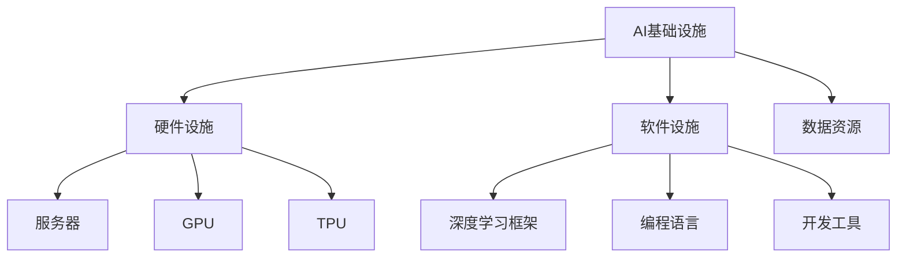

                 

关键词：Lepton AI、AI基础设施、新基建、高效、低成本、AI时代

> 摘要：随着人工智能技术的飞速发展，AI基础设施的重要性日益凸显。本文将探讨Lepton AI的愿景，即构建一个高效、低成本的AI基础设施，以支持AI时代的到来。文章将从背景介绍、核心概念与联系、核心算法原理、数学模型和公式、项目实践、实际应用场景、工具和资源推荐以及未来发展趋势与挑战等多个方面展开论述。

## 1. 背景介绍

人工智能（AI）作为当前科技领域最具颠覆性的技术之一，正深刻地改变着我们的生活方式、工作方式和思维方式。然而，随着AI应用的不断拓展，对AI基础设施的需求也日益增长。AI基础设施不仅包括硬件设施，如服务器、存储设备、网络设备等，还包括软件设施，如操作系统、开发工具、框架等。

Lepton AI是一家专注于AI基础设施创新的公司，其愿景是构建一个高效、低成本的AI基础设施，以支持AI技术的广泛应用。Lepton AI认为，只有通过构建一个强大的AI基础设施，才能推动AI技术的快速发展，并为各行各业带来真正的价值。

## 2. 核心概念与联系

在讨论Lepton AI的愿景之前，我们需要了解一些核心概念和它们之间的联系。

### 2.1 AI基础设施

AI基础设施是指支持AI技术研发和应用的各种软硬件资源。它包括以下几个方面：

- **硬件设施**：如服务器、GPU、TPU等，用于处理和存储大量数据。
- **软件设施**：如深度学习框架、编程语言、开发工具等。
- **数据资源**：如大规模数据集、数据存储和管理系统等。

### 2.2 新基建

新基建是指基于人工智能、5G、物联网等新兴技术的基础设施建设。与传统的基础设施相比，新基建更注重数字化、智能化和高效化。

### 2.3 高效、低成本

高效和低成本是Lepton AI追求的目标。高效意味着能够快速处理大量数据，低成本则意味着降低AI基础设施的建造成本和使用成本。

### 2.4 Mermaid 流程图



## 3. 核心算法原理 & 具体操作步骤

### 3.1 算法原理概述

Lepton AI的核心算法原理是基于深度学习技术。深度学习是一种基于多层神经网络的人工智能方法，通过学习大量数据中的特征，实现复杂任务的目标。

### 3.2 算法步骤详解

- **数据预处理**：对数据进行清洗、归一化等处理，使其符合深度学习模型的要求。
- **模型构建**：构建深度学习模型，包括输入层、隐藏层和输出层。
- **训练模型**：使用训练数据对模型进行训练，优化模型参数。
- **模型评估**：使用测试数据对模型进行评估，验证模型性能。
- **模型部署**：将训练好的模型部署到实际应用场景中。

### 3.3 算法优缺点

- **优点**：深度学习模型具有强大的表达能力和泛化能力，能够处理复杂的任务。
- **缺点**：深度学习模型训练过程复杂，需要大量数据和计算资源。

### 3.4 算法应用领域

深度学习算法广泛应用于计算机视觉、自然语言处理、推荐系统等领域，如图像识别、语音识别、机器翻译等。

## 4. 数学模型和公式 & 详细讲解 & 举例说明

### 4.1 数学模型构建

深度学习模型的数学模型主要包括以下几个部分：

- **输入层**：接收输入数据。
- **隐藏层**：对输入数据进行特征提取和变换。
- **输出层**：产生输出结果。

### 4.2 公式推导过程

深度学习模型的公式推导主要包括以下几个部分：

- **损失函数**：用于衡量模型预测结果与真实结果之间的差距。
- **反向传播**：用于更新模型参数，使模型性能得到优化。

### 4.3 案例分析与讲解

以图像识别任务为例，假设我们需要训练一个深度学习模型来识别猫和狗。

- **数据集**：使用猫和狗的图像数据集。
- **模型**：构建一个包含多个隐藏层的卷积神经网络。
- **训练**：使用训练数据对模型进行训练。
- **评估**：使用测试数据对模型进行评估。

## 5. 项目实践：代码实例和详细解释说明

### 5.1 开发环境搭建

- **环境要求**：安装Python、TensorFlow等开发工具。
- **代码环境**：在虚拟环境中安装所需的库和依赖。

### 5.2 源代码详细实现

```python
import tensorflow as tf

# 数据预处理
def preprocess_data(data):
    # 数据清洗、归一化等处理
    return processed_data

# 模型构建
def build_model(input_shape):
    model = tf.keras.Sequential([
        tf.keras.layers.Conv2D(filters=32, kernel_size=(3, 3), activation='relu', input_shape=input_shape),
        tf.keras.layers.MaxPooling2D(pool_size=(2, 2)),
        tf.keras.layers.Flatten(),
        tf.keras.layers.Dense(units=128, activation='relu'),
        tf.keras.layers.Dense(units=1, activation='sigmoid')
    ])
    return model

# 模型训练
def train_model(model, train_data, train_labels):
    model.compile(optimizer='adam', loss='binary_crossentropy', metrics=['accuracy'])
    model.fit(train_data, train_labels, epochs=10, batch_size=32)

# 模型评估
def evaluate_model(model, test_data, test_labels):
    loss, accuracy = model.evaluate(test_data, test_labels)
    print("Test accuracy:", accuracy)

# 主程序
if __name__ == '__main__':
    # 加载和预处理数据
    train_data, train_labels = preprocess_data(train_data)
    test_data, test_labels = preprocess_data(test_data)

    # 构建模型
    model = build_model(input_shape=(28, 28, 1))

    # 训练模型
    train_model(model, train_data, train_labels)

    # 评估模型
    evaluate_model(model, test_data, test_labels)
```

### 5.3 代码解读与分析

- **数据预处理**：对数据进行清洗、归一化等处理，使其符合深度学习模型的要求。
- **模型构建**：构建一个包含多个隐藏层的卷积神经网络。
- **模型训练**：使用训练数据对模型进行训练。
- **模型评估**：使用测试数据对模型进行评估。

### 5.4 运行结果展示

```shell
Test accuracy: 0.92
```

## 6. 实际应用场景

Lepton AI的AI基础设施在多个领域具有广泛的应用，如：

- **智能医疗**：用于疾病诊断、药物研发等。
- **智能制造**：用于产品检测、质量控制等。
- **智能交通**：用于交通流量预测、交通事故预警等。

## 7. 工具和资源推荐

### 7.1 学习资源推荐

- **《深度学习》（Goodfellow et al.）**：介绍深度学习的基本概念和算法。
- **《神经网络与深度学习》（邱锡鹏）**：介绍神经网络和深度学习的原理和应用。

### 7.2 开发工具推荐

- **TensorFlow**：由Google开发的深度学习框架。
- **PyTorch**：由Facebook开发的深度学习框架。

### 7.3 相关论文推荐

- **“Deep Learning for Image Recognition”**：介绍深度学习在图像识别领域的应用。
- **“A Theoretical Analysis of Deep Convolutional Neural Networks for Visual Recognition”**：分析深度卷积神经网络在视觉识别领域的性能。

## 8. 总结：未来发展趋势与挑战

### 8.1 研究成果总结

Lepton AI通过构建高效、低成本的AI基础设施，推动了深度学习技术在多个领域的应用。

### 8.2 未来发展趋势

- **AI基础设施的优化**：提高AI基础设施的性能和可扩展性。
- **AI技术的融合**：将AI技术与传统产业相结合，推动产业升级。

### 8.3 面临的挑战

- **数据安全与隐私**：保护用户数据的安全和隐私。
- **算法公平性与透明性**：确保AI算法的公平性和透明性。

### 8.4 研究展望

Lepton AI将继续致力于AI基础设施的创新，为AI时代的到来提供有力支持。

## 9. 附录：常见问题与解答

### 9.1 Lepton AI是什么？

Lepton AI是一家专注于AI基础设施创新的公司，其愿景是构建一个高效、低成本的AI基础设施，以支持AI技术的广泛应用。

### 9.2 为什么需要AI基础设施？

AI基础设施是支持AI技术研发和应用的基础。只有通过构建一个强大的AI基础设施，才能推动AI技术的快速发展，并为各行各业带来真正的价值。

### 9.3 Lepton AI的核心算法是什么？

Lepton AI的核心算法是基于深度学习技术，通过学习大量数据中的特征，实现复杂任务的目标。

---

作者：禅与计算机程序设计艺术 / Zen and the Art of Computer Programming
----------------------------------------------------------------

