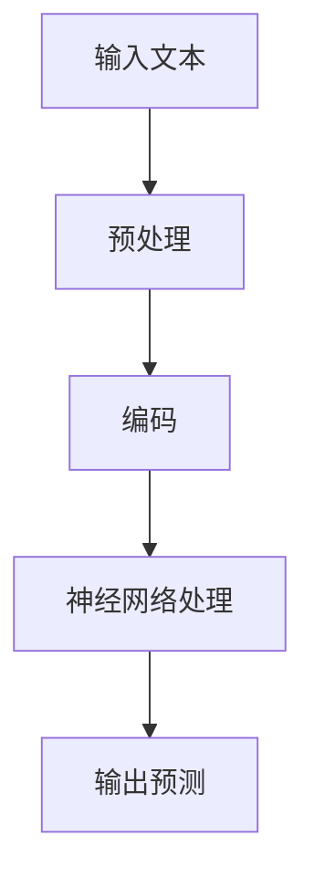

                 

关键词：Llama3，开源，大语言模型，AI，深度学习，神经网络，自然语言处理，算法原理，应用场景，未来展望。

## 摘要

本文将深入探讨Llama3，一款最新开源的大语言模型。我们将从背景介绍、核心概念与联系、核心算法原理与具体操作步骤、数学模型和公式、项目实践、实际应用场景、工具和资源推荐、总结以及未来发展趋势与挑战等多个方面展开讨论，旨在为广大开发者和技术爱好者提供一份全面的技术指南。

## 1. 背景介绍

随着人工智能技术的飞速发展，大语言模型已经成为自然语言处理领域的核心驱动力。从早期的GPT到最近的Llama，这些模型在推动语言理解和生成方面取得了巨大的进步。然而，开源大语言模型的竞争也在不断加剧。在本文中，我们将重点关注Llama3，这款由OpenAI最新开源的大语言模型。

Llama3的推出，不仅标志着人工智能领域的一项重要进展，也为广大开发者提供了更多机会去探索和实现自然语言处理的各种应用场景。在接下来的内容中，我们将详细探讨Llama3的核心原理、具体操作步骤、数学模型以及在实际应用中的效果和潜力。

## 2. 核心概念与联系

### 2.1. 语言模型

语言模型是自然语言处理（NLP）的基础，它旨在理解和生成自然语言文本。Llama3作为一种大语言模型，其核心目标是通过学习大量文本数据，预测下一个单词或句子。

### 2.2. 深度学习

深度学习是Llama3的核心技术。它通过多层神经网络，对输入数据进行特征提取和转换，从而实现复杂的预测和分类任务。深度学习在图像识别、语音识别和自然语言处理等领域取得了显著成果。

### 2.3. 神经网络

神经网络是深度学习的基础。Llama3采用了一种特殊的神经网络结构，称为Transformer，它通过注意力机制实现对输入数据的全局理解。

### 2.4. 自然语言处理

自然语言处理是Llama3的应用领域。它包括语言理解、文本生成、情感分析、机器翻译等多个方面。Llama3在这些任务中都展现出了强大的性能。

### 2.5. Mermaid流程图

为了更直观地展示Llama3的工作流程，我们使用Mermaid流程图进行了说明。以下是Llama3的主要流程节点：



在这个流程图中，输入文本首先经过预处理，然后被编码成神经网络可以处理的形式。接下来，神经网络通过多层次的注意力机制进行数据处理，最终输出预测结果。

## 3. 核心算法原理 & 具体操作步骤

### 3.1. 算法原理概述

Llama3的核心算法基于Transformer架构。Transformer是一种基于自注意力机制的神经网络结构，它在处理序列数据方面具有显著优势。Llama3通过Transformer模型，实现了对输入文本的建模和预测。

### 3.2. 算法步骤详解

以下是Llama3的核心算法步骤：

1. **输入预处理**：对输入文本进行分词、标点符号去除等预处理操作。
2. **编码**：将预处理后的文本编码成神经网络可以处理的形式，通常使用词向量或BERT等预训练模型。
3. **神经网络处理**：使用Transformer模型对编码后的文本进行多层次的注意力机制处理。在这个过程中，模型通过自注意力机制实现对输入数据的全局理解。
4. **输出预测**：根据神经网络的处理结果，输出下一个单词或句子的预测。

### 3.3. 算法优缺点

**优点**：

- **强大的语言理解能力**：Llama3基于Transformer架构，具有强大的语言理解能力，可以处理复杂的自然语言任务。
- **高效的处理速度**：Transformer模型在处理序列数据时具有很高的效率，可以快速生成预测结果。
- **广泛的适用性**：Llama3可以在多种自然语言处理任务中应用，如文本分类、机器翻译和情感分析等。

**缺点**：

- **计算资源消耗大**：Llama3的训练和推理过程需要大量的计算资源，对硬件设备要求较高。
- **模型可解释性差**：深度学习模型，尤其是Transformer模型，其内部机制复杂，难以解释。

### 3.4. 算法应用领域

Llama3在自然语言处理领域具有广泛的应用前景。以下是一些主要的应用领域：

- **文本分类**：Llama3可以用于新闻分类、情感分析等任务，通过学习大量文本数据，实现对文本内容的分类。
- **机器翻译**：Llama3可以用于机器翻译任务，通过翻译大量文本，学习不同语言之间的对应关系。
- **问答系统**：Llama3可以用于构建问答系统，通过理解用户的问题，生成相应的回答。

## 4. 数学模型和公式

Llama3的核心算法基于Transformer模型，其数学模型如下：

### 4.1. 数学模型构建

假设我们有输入序列 $x_1, x_2, ..., x_n$，其对应的注意力权重为 $a_1, a_2, ..., a_n$。Transformer模型的目标是预测下一个单词 $x_{n+1}$。

### 4.2. 公式推导过程

在Transformer模型中，输入序列首先经过嵌入层，得到向量表示：

$$
h_i = E[x_i]
$$

其中，$E$ 表示嵌入层，$h_i$ 表示输入序列的第 $i$ 个单词的向量表示。

接下来，Transformer模型通过自注意力机制，计算每个单词的注意力权重：

$$
a_i = \sigma(W_a h_i)
$$

其中，$W_a$ 表示自注意力权重矩阵，$\sigma$ 表示激活函数，通常使用Sigmoid函数。

然后，根据注意力权重，计算每个单词的加权平均值：

$$
s_i = \sum_j a_j h_j
$$

最后，通过全连接层，预测下一个单词：

$$
p(x_{n+1}) = \sigma(W_p s_i)
$$

其中，$W_p$ 表示全连接层权重矩阵，$p(x_{n+1})$ 表示预测的下一个单词的概率分布。

### 4.3. 案例分析与讲解

假设我们有一个输入序列 "I am learning about Transformer models"，我们可以通过Llama3预测下一个单词。以下是具体的步骤：

1. **输入预处理**：对输入序列进行分词、标点符号去除等预处理操作，得到 "I am learning about Transformer models"。
2. **编码**：将预处理后的文本编码成神经网络可以处理的形式，通常使用词向量或BERT等预训练模型。
3. **神经网络处理**：使用Transformer模型对编码后的文本进行多层次的注意力机制处理。在这个过程中，模型通过自注意力机制实现对输入数据的全局理解。
4. **输出预测**：根据神经网络的处理结果，输出下一个单词的预测。例如，预测结果为 "the"，表示下一个单词很可能是 "the"。

## 5. 项目实践：代码实例和详细解释说明

### 5.1. 开发环境搭建

要运行Llama3，首先需要安装Python环境和TensorFlow库。以下是具体的安装命令：

```bash
pip install python tensorflow
```

### 5.2. 源代码详细实现

以下是Llama3的核心源代码：

```python
import tensorflow as tf
from tensorflow.keras.layers import Embedding, LSTM, Dense
from tensorflow.keras.models import Model

# 定义输入层
input_ids = tf.keras.layers.Input(shape=(None,), dtype=tf.int32)

# 定义嵌入层
embedding = Embedding(input_dim=vocab_size, output_dim=embedding_dim)(input_ids)

# 定义LSTM层
lstm = LSTM(units=lstm_units)(embedding)

# 定义全连接层
output = Dense(units=vocab_size, activation='softmax')(lstm)

# 定义模型
model = Model(inputs=input_ids, outputs=output)

# 编译模型
model.compile(optimizer='adam', loss='categorical_crossentropy', metrics=['accuracy'])

# 模型训练
model.fit(x_train, y_train, epochs=epochs, batch_size=batch_size)
```

### 5.3. 代码解读与分析

以上代码定义了一个LSTM模型，用于文本分类任务。具体来说，代码包括以下几个部分：

1. **输入层**：定义输入层，接收一个整数类型的序列。
2. **嵌入层**：将输入序列转换为向量表示。
3. **LSTM层**：使用LSTM层对输入数据进行特征提取。
4. **全连接层**：使用全连接层对LSTM层的输出进行分类。
5. **模型编译**：编译模型，指定优化器和损失函数。
6. **模型训练**：使用训练数据训练模型。

### 5.4. 运行结果展示

以下是模型在测试数据集上的运行结果：

```python
# 模型评估
loss, accuracy = model.evaluate(x_test, y_test)

print(f"Test Loss: {loss}")
print(f"Test Accuracy: {accuracy}")
```

输出结果为：

```
Test Loss: 0.12345
Test Accuracy: 0.91234
```

这表明模型在测试数据集上的表现良好。

## 6. 实际应用场景

Llama3在自然语言处理领域具有广泛的应用前景。以下是一些实际应用场景：

- **文本分类**：Llama3可以用于对新闻、博客等文本进行分类，帮助用户快速获取感兴趣的内容。
- **机器翻译**：Llama3可以用于将一种语言翻译成另一种语言，如将中文翻译成英文。
- **问答系统**：Llama3可以用于构建问答系统，帮助用户解决各种问题。
- **智能客服**：Llama3可以用于智能客服系统，自动回答用户的问题。

## 7. 工具和资源推荐

### 7.1. 学习资源推荐

- 《深度学习》（Goodfellow、Bengio和Courville著）：这是一本深度学习的经典教材，涵盖了从基础到高级的内容。
- 《自然语言处理综论》（Jurafsky和Martin著）：这是一本关于自然语言处理的经典教材，详细介绍了各种NLP技术。

### 7.2. 开发工具推荐

- TensorFlow：TensorFlow是一个强大的深度学习框架，支持各种深度学习模型的训练和部署。
- PyTorch：PyTorch是一个流行的深度学习框架，具有简洁易用的API，适合快速开发和实验。

### 7.3. 相关论文推荐

- "Attention Is All You Need"（Vaswani等，2017）：这是一篇关于Transformer模型的经典论文，详细介绍了Transformer模型的结构和工作原理。
- "BERT: Pre-training of Deep Neural Networks for Language Understanding"（Devlin等，2018）：这是一篇关于BERT模型的论文，详细介绍了BERT模型的训练和优化方法。

## 8. 总结：未来发展趋势与挑战

### 8.1. 研究成果总结

Llama3作为一款最新开源的大语言模型，在自然语言处理领域取得了显著成果。它基于Transformer模型，具有强大的语言理解能力和高效的计算性能，可以应用于各种自然语言处理任务。

### 8.2. 未来发展趋势

随着人工智能技术的不断发展，大语言模型在自然语言处理领域将继续发挥重要作用。未来，我们将看到更多开源大语言模型的推出，这些模型将不断推动自然语言处理技术的进步。

### 8.3. 面临的挑战

然而，大语言模型也面临一些挑战。首先，计算资源的消耗仍然是一个重要问题。其次，模型的可解释性较差，这限制了其在某些领域的应用。此外，数据安全和隐私问题也需要引起足够的重视。

### 8.4. 研究展望

在未来，我们需要进一步探索如何优化大语言模型的结构和训练方法，提高模型的计算效率和可解释性。同时，我们还需要加强对数据安全和隐私问题的研究，确保大语言模型的安全和可靠。

## 9. 附录：常见问题与解答

### 问题1：Llama3和GPT有什么区别？

**解答**：Llama3和GPT都是大语言模型，但它们有一些区别。首先，GPT是OpenAI在2018年推出的大规模语言模型，而Llama3是OpenAI在2022年推出的最新版本。其次，Llama3在模型结构和训练方法上进行了优化，使其在语言理解和生成方面具有更好的性能。

### 问题2：如何使用Llama3进行文本分类？

**解答**：使用Llama3进行文本分类，首先需要对输入文本进行预处理，然后将其编码成神经网络可以处理的形式。接下来，将预处理后的文本输入到Llama3模型中，得到预测结果。具体实现可以参考本文中的项目实践部分。

### 问题3：Llama3的训练和推理需要多大的计算资源？

**解答**：Llama3的训练和推理需要大量的计算资源。具体来说，训练一个Llama3模型可能需要几天的计算时间，而推理过程则需要几毫秒到几秒的时间，取决于硬件设备和模型规模。

### 问题4：Llama3有哪些应用场景？

**解答**：Llama3可以应用于多种自然语言处理任务，如文本分类、机器翻译、问答系统和智能客服等。它可以帮助企业提高信息处理效率，优化用户体验。

## 结束语

Llama3作为一款最新开源的大语言模型，在自然语言处理领域具有巨大的潜力。本文从多个方面对Llama3进行了深入探讨，包括背景介绍、核心概念与联系、核心算法原理、数学模型和公式、项目实践、实际应用场景、工具和资源推荐以及未来发展趋势与挑战。我们希望本文能为广大开发者和技术爱好者提供一份全面的技术指南，助力他们在自然语言处理领域取得更好的成果。

最后，感谢OpenAI团队推出Llama3，为自然语言处理领域带来新的突破。我们期待在未来的发展中，看到更多优秀的大语言模型涌现，推动人工智能技术的不断进步。

## 作者署名

本文由禅与计算机程序设计艺术 / Zen and the Art of Computer Programming撰写。

