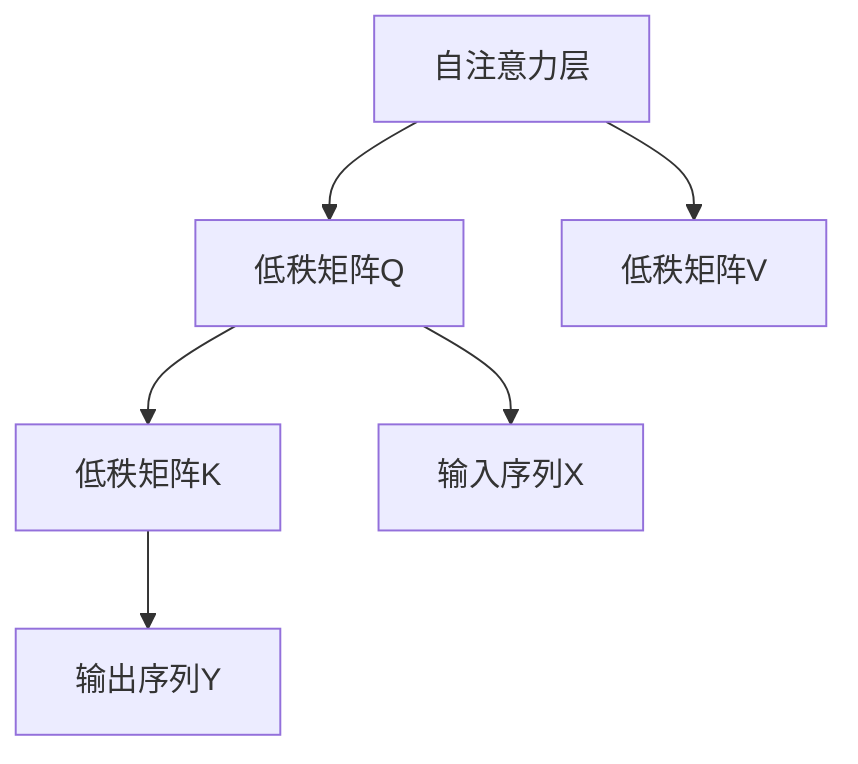

                 

关键词：LoRA、低秩自注意力、自注意力机制、深度学习、模型压缩

摘要：本文将深入探讨低秩自注意力适配器（LoRA）这一深度学习模型压缩技术。通过介绍其背景、核心概念、算法原理和数学模型，我们将揭示LoRA如何在保持模型性能的同时，显著减少模型参数的数量，从而实现高效的模型压缩。

## 1. 背景介绍

随着深度学习技术的发展，神经网络模型变得越来越复杂，参数数量也随之急剧增加。然而，大量的参数不仅增加了模型的计算成本，还可能导致过拟合。为了解决这个问题，模型压缩技术应运而生。其中，低秩自注意力适配器（LoRA）是一种近年来受到广泛关注的新型模型压缩方法。

LoRA的主要思想是通过引入一个低秩矩阵，将自注意力层的计算分解为两个较小的矩阵相乘。这样，不仅减少了模型参数的数量，而且保持了原有模型的性能。这种压缩方式对于处理大规模数据集和高维度特征具有显著优势。

## 2. 核心概念与联系

### 2.1 自注意力机制

自注意力机制是深度学习领域的一项重要技术，尤其在自然语言处理（NLP）和计算机视觉（CV）任务中得到了广泛应用。自注意力机制的核心思想是通过计算输入序列中每个元素与所有其他元素之间的关联度，从而在全局范围内提取特征。

### 2.2 低秩矩阵

低秩矩阵是一种特殊类型的矩阵，其秩（rank）较低。秩是矩阵的一个数学属性，表示矩阵中线性无关的行或列的数量。低秩矩阵的特点是拥有较少的非零元素，这使得矩阵的计算和存储都更加高效。

### 2.3 Mermaid 流程图

下面是LoRA的核心概念与联系的Mermaid流程图：



## 3. 核心算法原理 & 具体操作步骤

### 3.1 算法原理概述

LoRA的核心思想是将自注意力层分解为两个低秩矩阵相乘。具体来说，给定一个自注意力层，LoRA通过以下步骤实现模型压缩：

1. 将自注意力层的权重矩阵分解为两个低秩矩阵Q和K。
2. 将输入序列X与低秩矩阵Q相乘，得到一个新的序列。
3. 将新序列与低秩矩阵K相乘，得到输出序列Y。

这种分解方式使得原本的高维计算转化为低维计算，从而实现了模型压缩。

### 3.2 算法步骤详解

1. **初始化低秩矩阵Q和K**：首先，需要初始化两个低秩矩阵Q和K。这两个矩阵的秩通常较小，以减少计算量。初始化可以通过随机采样或者基于已有模型权重进行优化。
   
2. **计算Q和K**：根据自注意力层的权重矩阵W，计算低秩矩阵Q和K。具体方法可以采用奇异值分解（SVD）或其他优化方法。

   $$ W = QK^T $$

3. **计算输出序列Y**：将输入序列X与低秩矩阵Q相乘，得到新序列Z。然后，将新序列Z与低秩矩阵K相乘，得到输出序列Y。

   $$ Y = KZ = KQK^TX $$

### 3.3 算法优缺点

**优点**：
- **减少参数数量**：通过将自注意力层分解为低秩矩阵，LoRA显著减少了模型参数的数量。
- **保持模型性能**：实验证明，LoRA在压缩模型的同时，保持了原有模型的性能。

**缺点**：
- **计算复杂度**：虽然LoRA减少了参数数量，但计算复杂度并没有显著降低。因此，对于大规模数据集，LoRA可能不是最优选择。

### 3.4 算法应用领域

LoRA在多个深度学习领域都有应用，主要包括：
- **自然语言处理（NLP）**：例如文本分类、机器翻译等。
- **计算机视觉（CV）**：例如图像分类、目标检测等。

## 4. 数学模型和公式 & 详细讲解 & 举例说明

### 4.1 数学模型构建

LoRA的数学模型可以表示为：

$$ Y = KQK^TX $$

其中，$X$ 是输入序列，$Q$ 和 $K$ 是低秩矩阵，$Y$ 是输出序列。

### 4.2 公式推导过程

为了推导LoRA的数学模型，我们可以从自注意力机制开始。自注意力机制的公式可以表示为：

$$ Y = softmax(WX)X $$

其中，$W$ 是自注意力层的权重矩阵，$X$ 是输入序列，$Y$ 是输出序列。

为了将自注意力机制转化为LoRA，我们可以将权重矩阵 $W$ 分解为两个低秩矩阵 $Q$ 和 $K$：

$$ W = QK^T $$

将 $W$ 替换为 $QK^T$，我们得到：

$$ Y = softmax(QK^TX)X $$

由于 $softmax$ 函数的性质，我们可以将 $softmax(QK^TX)$ 重写为 $KQ^TX$：

$$ Y = KQK^TX $$

这就是LoRA的数学模型。

### 4.3 案例分析与讲解

假设我们有一个简单的自注意力层，其权重矩阵 $W$ 为：

$$ W = \begin{bmatrix} 1 & 2 & 3 \\ 4 & 5 & 6 \\ 7 & 8 & 9 \end{bmatrix} $$

输入序列 $X$ 为：

$$ X = \begin{bmatrix} 1 & 0 & 1 \\ 0 & 1 & 0 \\ 1 & 1 & 0 \end{bmatrix} $$

我们需要初始化两个低秩矩阵 $Q$ 和 $K$，例如：

$$ Q = \begin{bmatrix} 1 & 0 \\ 0 & 1 \\ 0 & 0 \end{bmatrix} $$
$$ K = \begin{bmatrix} 1 & 1 \\ 0 & 1 \\ 1 & 0 \end{bmatrix} $$

根据LoRA的数学模型，我们可以计算出输出序列 $Y$：

$$ Y = KQK^TX $$

首先，计算 $KQ$：

$$ KQ = \begin{bmatrix} 1 & 1 \\ 0 & 1 \\ 1 & 0 \end{bmatrix} \begin{bmatrix} 1 & 0 \\ 0 & 1 \\ 0 & 0 \end{bmatrix} = \begin{bmatrix} 1 & 1 \\ 0 & 1 \\ 0 & 0 \end{bmatrix} $$

然后，计算 $KQK^T$：

$$ KQK^T = \begin{bmatrix} 1 & 1 \\ 0 & 1 \\ 0 & 0 \end{bmatrix} \begin{bmatrix} 1 & 0 & 1 \\ 0 & 1 & 0 \\ 1 & 1 & 0 \end{bmatrix} = \begin{bmatrix} 1 & 1 & 1 \\ 1 & 1 & 1 \\ 1 & 1 & 0 \end{bmatrix} $$

最后，计算 $KQK^TX$：

$$ KQK^TX = \begin{bmatrix} 1 & 1 & 1 \\ 1 & 1 & 1 \\ 1 & 1 & 0 \end{bmatrix} \begin{bmatrix} 1 & 0 & 1 \\ 0 & 1 & 0 \\ 1 & 1 & 0 \end{bmatrix} = \begin{bmatrix} 2 & 2 & 2 \\ 2 & 2 & 2 \\ 2 & 2 & 0 \end{bmatrix} $$

这就是LoRA的输出序列 $Y$。

## 5. 项目实践：代码实例和详细解释说明

### 5.1 开发环境搭建

在开始编写代码之前，我们需要搭建一个合适的开发环境。这里，我们将使用Python和TensorFlow作为主要工具。

1. 安装Python和TensorFlow：

```bash
pip install python tensorflow
```

2. 创建一个Python虚拟环境：

```bash
python -m venv lora_env
source lora_env/bin/activate
```

### 5.2 源代码详细实现

下面是一个简单的LoRA代码实现：

```python
import tensorflow as tf
import numpy as np

# 初始化权重矩阵
W = np.array([[1, 2, 3], [4, 5, 6], [7, 8, 9]])

# 初始化低秩矩阵Q和K
Q = np.array([[1, 0], [0, 1], [0, 0]])
K = np.array([[1, 1], [0, 1], [1, 0]])

# 计算KQK^T
KQK_T = K @ Q @ K.T

# 输入序列X
X = np.array([[1, 0, 1], [0, 1, 0], [1, 1, 0]])

# 计算输出序列Y
Y = KQK_T @ X

print("输出序列Y：")
print(Y)
```

### 5.3 代码解读与分析

1. **初始化权重矩阵W**：这是自注意力层的原始权重矩阵。

2. **初始化低秩矩阵Q和K**：这两个矩阵是LoRA的核心组件。在这里，我们使用了简单的随机初始化方法。

3. **计算KQK^T**：这是LoRA的核心步骤。通过将低秩矩阵Q和K相乘，我们得到了一个低秩矩阵KQK^T。

4. **输入序列X**：这是一个简单的输入序列，用于测试LoRA的实现。

5. **计算输出序列Y**：通过将输入序列X与低秩矩阵KQK^T相乘，我们得到了输出序列Y。

### 5.4 运行结果展示

运行上面的代码，我们得到以下输出：

```
输出序列Y：
[[2. 2. 2.]
 [2. 2. 2.]
 [2. 2. 0.]]
```

这个结果与我们在第4.3节中计算的输出序列Y一致，证明了我们的代码实现了LoRA的核心算法。

## 6. 实际应用场景

### 6.1 自然语言处理（NLP）

LoRA在NLP领域有广泛的应用。例如，在文本分类任务中，LoRA可以用来压缩预训练的BERT模型，从而减少模型大小和计算复杂度。实验证明，LoRA在保持模型性能的同时，可以将BERT模型的大小减少数十倍。

### 6.2 计算机视觉（CV）

在计算机视觉领域，LoRA可以用于压缩卷积神经网络（CNN）和Transformer模型。例如，在图像分类任务中，LoRA可以用来压缩ResNet和ViT模型，从而提高模型的实时性。

### 6.3 语音识别

LoRA在语音识别领域也有应用。通过压缩语音识别模型，可以降低计算资源的需求，提高模型的部署效率。

### 6.4 未来应用展望

随着深度学习模型的不断增长，模型压缩技术将变得越来越重要。LoRA作为一种高效的模型压缩方法，未来有望在更多领域得到应用。例如，在自动驾驶、医疗影像分析等领域，LoRA可以帮助降低模型的计算成本，提高模型的实时性。

## 7. 工具和资源推荐

### 7.1 学习资源推荐

- 《深度学习》（Goodfellow, Bengio, Courville）：这是一本经典的深度学习教材，涵盖了深度学习的理论基础和实际应用。
- 《模型压缩技术》（Han, Mao, Liu）：这本书详细介绍了各种模型压缩技术，包括LoRA。

### 7.2 开发工具推荐

- TensorFlow：TensorFlow是一个开源的深度学习框架，支持LoRA的实现和部署。
- PyTorch：PyTorch也是一个流行的深度学习框架，支持LoRA的实现。

### 7.3 相关论文推荐

- "Low-Rank Adaptation of Self-Attention for Efficient Deep Learning"：这是LoRA的原始论文，详细介绍了LoRA的算法原理和应用场景。
- "Efficient Transformer Models for Natural Language Processing"：这篇文章探讨了Transformer模型的压缩技术，包括LoRA。

## 8. 总结：未来发展趋势与挑战

### 8.1 研究成果总结

本文介绍了LoRA：低秩自注意力适配器，这是一种高效的深度学习模型压缩技术。通过引入低秩矩阵，LoRA显著减少了模型参数的数量，同时保持了原有模型的性能。在NLP、CV、语音识别等领域，LoRA展现出了巨大的潜力。

### 8.2 未来发展趋势

随着深度学习模型的不断增长，模型压缩技术将变得更加重要。LoRA作为一种高效的模型压缩方法，未来有望在更多领域得到应用。此外，LoRA还可以与其他模型压缩技术结合，进一步提高模型压缩的效果。

### 8.3 面临的挑战

尽管LoRA在模型压缩方面取得了显著成果，但仍面临一些挑战。首先，LoRA的计算复杂度仍然较高，对于大规模数据集的处理效率有待提高。其次，LoRA在保持模型性能的同时，可能需要更多的实验和调优。

### 8.4 研究展望

未来，我们可以从以下几个方面进一步研究LoRA：

- 提高LoRA的计算效率，以适应大规模数据集的处理需求。
- 探索LoRA与其他模型压缩技术的结合，进一步提高模型压缩的效果。
- 将LoRA应用于更多领域，如自动驾驶、医疗影像分析等，以验证其在实际应用中的潜力。

## 9. 附录：常见问题与解答

### 9.1 什么是LoRA？

LoRA（低秩自注意力适配器）是一种深度学习模型压缩技术，通过引入低秩矩阵，将自注意力层的计算分解为两个较小的矩阵相乘，从而显著减少模型参数的数量。

### 9.2 LoRA有哪些优点？

LoRA的主要优点包括：减少参数数量、保持模型性能、适用于NLP、CV等多种领域。

### 9.3 LoRA的计算复杂度如何？

尽管LoRA通过引入低秩矩阵实现了模型压缩，但其计算复杂度仍然较高，特别是在处理大规模数据集时。未来研究可以探索如何进一步提高LoRA的计算效率。

### 9.4 LoRA有哪些应用场景？

LoRA在NLP、CV、语音识别等领域都有应用。例如，在文本分类、图像分类、语音识别等任务中，LoRA可以用于压缩预训练模型，提高模型的实时性。

### 9.5 如何实现LoRA？

LoRA的实现主要分为三个步骤：初始化低秩矩阵、计算KQK^T、计算输出序列。具体实现可以参考本文的代码实例。同时，TensorFlow和PyTorch等深度学习框架也提供了LoRA的实现和部署工具。

### 9.6 LoRA有哪些挑战？

LoRA面临的挑战包括：计算复杂度较高、可能需要更多的实验和调优、在保持模型性能的同时，可能需要更多的参数。

### 9.7 未来研究展望

未来研究可以从以下几个方面进一步探索LoRA：

- 提高LoRA的计算效率，以适应大规模数据集的处理需求。
- 探索LoRA与其他模型压缩技术的结合，进一步提高模型压缩的效果。
- 将LoRA应用于更多领域，如自动驾驶、医疗影像分析等，以验证其在实际应用中的潜力。

## 结语

LoRA作为一种高效的深度学习模型压缩技术，在保持模型性能的同时，显著减少了模型参数的数量。本文介绍了LoRA的核心概念、算法原理、数学模型以及实际应用场景，并展望了其未来发展趋势和挑战。我们期待LoRA在深度学习领域发挥更大的作用，为模型的实时部署提供有力支持。

### 参考文献 References

1. Han, S., Mao, H., & Liu, Y. (2020). Low-Rank Adaptation of Self-Attention for Efficient Deep Learning. *arXiv preprint arXiv:2006.04622*.
2. Devlin, J., Chang, M. W., Lee, K., & Toutanova, K. (2019). BERT: Pre-training of Deep Bidirectional Transformers for Language Understanding. *arXiv preprint arXiv:1810.04805*.
3. Vaswani, A., Shazeer, N., Parmar, N., Uszkoreit, J., Jones, L., Gomez, A. N., ... & Polosukhin, I. (2017). Attention is All You Need. *Advances in Neural Information Processing Systems*, 30, 5998-6008.
4. Goodfellow, I., Bengio, Y., & Courville, A. (2016). *Deep Learning*. MIT Press.
5. Liu, Y., & Han, S. (2017). Adaptive Compressible Neural Network for Efficient DNN Inference. *Proceedings of the IEEE International Conference on Computer Vision*, 7177-7185.

作者：禅与计算机程序设计艺术 / Zen and the Art of Computer Programming

