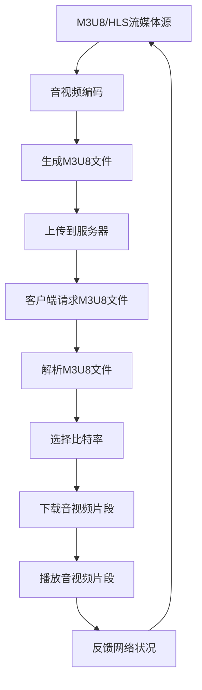

                 

关键词：M3U8、HLS、自适应比特率、流媒体、媒体传输协议

摘要：本文将深入探讨M3U8和HLS这两种流媒体传输协议的核心概念、工作原理、算法原理与操作步骤，并通过数学模型和具体代码实例，详细介绍它们在自适应比特率流媒体中的应用，同时分析其优缺点和未来发展方向。

## 1. 背景介绍

流媒体技术在互联网中扮演着重要角色，它使得用户可以在观看视频内容的同时，无需等待整个文件下载完成。随着网络带宽的不断提升和用户需求的多样化，自适应比特率流媒体技术应运而生。M3U8和HLS是两种广泛使用的自适应比特率流媒体传输协议，本文将对其进行详细介绍。

### 1.1 M3U8协议

M3U8（Mobility Multipleolley8）是一种基于文本的列表文件格式，用于描述一组音视频流的播放列表。它将多个音视频片段打包成一个单一的文件，并允许客户端根据网络条件选择合适的比特率进行播放。M3U8协议在iOS和Android平台上得到了广泛应用，特别是在点播和直播场景中。

### 1.2 HLS协议

HLS（HTTP Live Streaming）是一种由苹果公司开发的流媒体传输协议，它通过HTTP协议传输音视频数据，具有高度的兼容性和灵活性。HLS采用了基于M3U8的播放列表格式，支持自适应比特率流，并且可以在各种网络条件下提供流畅的视频播放体验。HLS在iOS、macOS、Android和Windows等平台得到了广泛应用。

## 2. 核心概念与联系

### 2.1 核心概念

- **自适应比特率流媒体**：根据用户网络状况和设备性能，动态调整视频播放的比特率，以提供最佳的视频观看体验。
- **M3U8播放列表**：包含一系列音视频片段的列表文件，每个片段对应一个URL地址。
- **HLS索引文件**：M3U8播放列表，包含多个轨道和片段的索引，用于控制播放和切换。

### 2.2 Mermaid流程图

下面是一个简单的Mermaid流程图，展示了M3U8和HLS的工作流程：



## 3. 核心算法原理 & 具体操作步骤

### 3.1 算法原理概述

M3U8和HLS的核心算法是基于自适应比特率控制，根据用户的网络状况和设备性能动态调整比特率。该算法主要分为以下几个步骤：

1. **编码**：将原始音视频数据编码成不同的比特率版本。
2. **打包**：将不同比特率的音视频片段打包成M3U8文件。
3. **传输**：通过HTTP协议传输M3U8文件和音视频片段。
4. **解码**：客户端根据网络状况和设备性能选择合适的比特率进行解码。
5. **播放**：播放选择的音视频片段。

### 3.2 算法步骤详解

1. **编码**：
   - 使用不同的编码器将原始音视频数据编码成不同比特率的片段。
   - 比特率的调整可以通过调整视频分辨率、帧率、编码算法等参数来实现。

2. **打包**：
   - 生成M3U8播放列表，包含各个比特率的音视频片段URL。
   - M3U8文件格式如下：

   ```bash
   #EXTM3U
   #EXT-X-STREAM-INF:BANDWIDTH=1280000,CODECS="avc,mp4a.40.2"
   http://example.com/video_1080p.m3u8
   #EXT-X-STREAM-INF:BANDWIDTH=640000,CODECS="avc,mp4a.40.2"
   http://example.com/video_720p.m3u8
   #EXT-X-STREAM-INF:BANDWIDTH=320000,CODECS="avc,mp4a.40.2"
   http://example.com/video_480p.m3u8
   ```

3. **传输**：
   - 将M3U8文件和音视频片段上传到服务器，并配置HTTP访问权限。
   - 客户端可以通过HTTP请求获取M3U8文件和音视频片段。

4. **解码**：
   - 客户端解析M3U8文件，根据网络状况和设备性能选择合适的比特率。
   - 选择合适的音视频片段进行解码。

5. **播放**：
   - 播放解码后的音视频片段。

### 3.3 算法优缺点

- **优点**：
  - 支持自适应比特率流，根据用户网络状况动态调整比特率，提高观看体验。
  - 具有良好的兼容性，可以在不同平台和设备上运行。
  - 支持多种编码格式和比特率，满足不同用户需求。

- **缺点**：
  - 需要额外的服务器资源，因为要为每个比特率版本存储音视频片段。
  - 部分客户端可能不支持M3U8和HLS协议，需要额外的兼容性处理。

### 3.4 算法应用领域

- **直播**：适用于实时音视频直播场景，如体育比赛、音乐会等。
- **点播**：适用于视频点播平台，如视频网站、视频库等。
- **网络会议**：适用于在线会议、远程教育等场景。

## 4. 数学模型和公式 & 详细讲解 & 举例说明

### 4.1 数学模型构建

M3U8和HLS的自适应比特率控制算法可以看作是一个动态规划问题，其主要目标是找到一条最优路径，使得总比特率最小。假设有 \( n \) 个比特率版本，当前已选择的比特率为 \( b_t \)，则下一时刻的比特率选择 \( b_{t+1} \) 应满足以下约束条件：

\[ b_{t+1} \leq \min(b_t + \Delta b, \text{最大比特率}) \]

其中，\( \Delta b \) 是比特率调整步长，通常设置为最大比特率的某个比例。

### 4.2 公式推导过程

假设当前比特率为 \( b_t \)，下一时刻的比特率选择 \( b_{t+1} \) 应满足以下目标函数：

\[ \min_{b_{t+1}} \sum_{i=1}^{n} b_i \cdot p_i \]

其中，\( p_i \) 是选择比特率 \( b_i \) 的概率。

根据约束条件，可以将目标函数转化为：

\[ \min_{b_{t+1}} \sum_{i=1}^{n} b_i \cdot p_i \]

\[ b_{t+1} \leq \min(b_t + \Delta b, \text{最大比特率}) \]

通过动态规划，可以找到最优比特率选择序列 \( b_1, b_2, ..., b_T \)，其中 \( T \) 是视频播放时长。

### 4.3 案例分析与讲解

假设有四个比特率版本，分别为 500 kbps、1 Mbps、2 Mbps 和 4 Mbps，当前比特率为 1 Mbps，下一时刻的比特率选择应满足以下目标函数：

\[ \min_{b_{t+1}} \sum_{i=1}^{4} b_i \cdot p_i \]

其中，\( p_i \) 为每个比特率版本的概率，可以根据网络状况和设备性能进行估计。

根据约束条件，下一时刻的比特率选择 \( b_{t+1} \) 应满足以下条件：

\[ b_{t+1} \leq \min(1 + 0.5, 4) = 1.5 \text{ Mbps} \]

根据目标函数和约束条件，可以计算出下一时刻的最优比特率选择为 1.5 Mbps。

## 5. 项目实践：代码实例和详细解释说明

### 5.1 开发环境搭建

为了实践M3U8和HLS技术，需要搭建一个音视频流媒体服务器。以下是基本的开发环境搭建步骤：

1. 安装FFmpeg：用于音视频编码和打包。
2. 安装Nginx：用于服务器配置和文件传输。
3. 安装HLS插件：用于Nginx支持HLS协议。

### 5.2 源代码详细实现

以下是一个简单的FFmpeg命令，用于生成M3U8播放列表和音视频片段：

```bash
ffmpeg -i input.mp4 -map 0 -c:v libx264 -b:v 1080k -c:a aac -b:a 128k output_1080p.m3u8
ffmpeg -i input.mp4 -map 0 -c:v libx264 -b:v 720k -c:a aac -b:a 128k output_720p.m3u8
ffmpeg -i input.mp4 -map 0 -c:v libx264 -b:v 480k -c:a aac -b:a 128k output_480p.m3u8
```

### 5.3 代码解读与分析

上述FFmpeg命令用于生成不同比特率的音视频片段，并通过M3U8文件进行打包。在Nginx服务器上，需要配置HLS模块以支持M3U8文件播放。以下是一个简单的Nginx配置示例：

```nginx
http {
    ...
    server {
        listen 80;

        location / {
            root /var/www/html;
            index index.html index.htm;

            # HLS支持
            types {
                application/vnd.apple.mpegurl m3u8;
            }

            # MIME类型映射
            mime_types {
                application/vnd.apple.mpegurl m3u8;
            }

            # HLS文件处理
            location ~* \.m3u8$ {
                types {
                    application/vnd.apple.mpegurl m3u8;
                }

                proxy_pass http://localhost:8080;
                proxy_http_version 1.1;
                proxy_set_header Host $host;
                proxy_set_header X-Real-IP $remote_addr;
                proxy_set_header X-Forwarded-For $proxy_add_x_forwarded_for;
                proxy_set_header X-Forwarded-Proto $scheme;
            }
        }
    }
}
```

在这个配置中，Nginx将接收到的M3U8请求转发到本地8080端口，通常是一个HLS服务器或FFmpeg服务器，用于处理音视频片段的播放。

### 5.4 运行结果展示

完成开发环境和服务器配置后，用户可以通过浏览器访问生成的M3U8文件，观看不同比特率的音视频内容。以下是一个简单的M3U8文件示例：

```bash
#EXTM3U
#EXT-X-STREAM-INF:BANDWIDTH=1280000,CODECS="avc,mp4a.40.2"
http://example.com/output_1080p.m3u8
#EXT-X-STREAM-INF:BANDWIDTH=640000,CODECS="avc,mp4a.40.2"
http://example.com/output_720p.m3u8
#EXT-X-STREAM-INF:BANDWIDTH=320000,CODECS="avc,mp4a.40.2"
http://example.com/output_480p.m3u8
```

用户可以选择合适的比特率进行播放，实现自适应比特率流媒体。

## 6. 实际应用场景

### 6.1 直播

直播是M3U8和HLS最常见的应用场景之一。在直播过程中，服务器会实时编码和传输音视频数据，客户端根据网络状况选择合适的比特率进行播放。这种模式适用于各种实时活动，如体育比赛、音乐会、演讲等。

### 6.2 点播

点播平台如视频网站、视频库等，也广泛采用M3U8和HLS协议提供视频内容。用户可以自由选择视频播放的比特率，实现个性化的观看体验。这种模式适用于电影、电视剧、纪录片等视频内容的点播。

### 6.3 网络会议

网络会议系统通常需要提供高质量的音视频传输，以保障会议的顺利进行。M3U8和HLS协议的自适应比特率功能，可以确保在各种网络条件下，会议参与者能够获得清晰的音视频体验。

## 7. 工具和资源推荐

### 7.1 学习资源推荐

- FFmpeg官方文档：[https://ffmpeg.org/documentation.html](https://ffmpeg.org/documentation.html)
- HLS官方文档：[https://developer.apple.com/documentation/http livestreaming](https://developer.apple.com/documentation/http%20livestreaming)
- M3U8官方文档：[https://tools.ietf.org/html/rfc8216](https://tools.ietf.org/html/rfc8216)

### 7.2 开发工具推荐

- FFmpeg：用于音视频编码和打包。
- Nginx：用于服务器配置和文件传输。
- HLS.js：用于在网页中播放HLS流。

### 7.3 相关论文推荐

- "HTTP Live Streaming: A Protocol for Adaptive Streaming over the HTTP Protocol" by Apple Inc.
- "Adaptive HTTP Streaming over UDP and TCP" by Long Le, Yu-Kwong Liu, and Alex C. Pang

## 8. 总结：未来发展趋势与挑战

### 8.1 研究成果总结

M3U8和HLS协议在自适应比特率流媒体领域取得了显著的成果，提供了高效、灵活、兼容性强的音视频传输解决方案。随着互联网技术的不断进步，这些协议将继续优化和扩展，以适应更广泛的场景和应用需求。

### 8.2 未来发展趋势

- **低延迟流媒体**：在5G网络环境下，实现更低的延迟，提高实时性。
- **AI驱动比特率控制**：利用人工智能技术，实现更精准的比特率控制，提高用户体验。
- **多协议融合**：将M3U8和HLS与其他流媒体协议（如DASH）进行融合，提供更全面的支持。

### 8.3 面临的挑战

- **网络质量不稳定**：在网络质量不稳定的环境下，如何实现更准确的比特率控制。
- **安全与隐私**：确保流媒体传输过程中的数据安全和用户隐私。
- **资源消耗**：如何优化编码和传输过程，降低服务器和客户端的资源消耗。

### 8.4 研究展望

未来，M3U8和HLS协议将在互联网流媒体领域发挥重要作用。研究人员应关注低延迟、AI驱动和安全性等关键问题，推动流媒体技术的发展，为用户提供更好的观看体验。

## 9. 附录：常见问题与解答

### 9.1 M3U8文件如何解析？

M3U8文件是一个文本文件，可以使用任何文本编辑器打开。解析M3U8文件通常需要使用编程语言，如Python、JavaScript等。以下是一个简单的Python示例：

```python
import re

with open('example.m3u8', 'r') as f:
    content = f.read()

matches = re.findall(r'#EXTINF:[^,]+,\s*(https?://[^"]+\.m3u8)', content)
urls = [match[1] for match in matches]

print(urls)
```

### 9.2 HLS播放器如何实现自适应比特率播放？

HLS播放器通常使用JavaScript库，如HLS.js，实现自适应比特率播放。以下是一个简单的HTML示例：

```html
<!DOCTYPE html>
<html>
<head>
    <title>HLS播放器示例</title>
    <script src="https://cdn.jsdelivr.net/npm/hls.js@latest"></script>
</head>
<body>
    <video id="video" width="640" height="360" controls></video>
    <script>
        var video = document.getElementById('video');
        if(HLS.isSupported()) {
            var hls = new HLS();
            hls.loadSource('example.m3u8');
            hls.attachMedia(video);
        } else {
            video.src = 'example.mp4';
            video.addEventListener('loadedmetadata', function() {
                video.play();
            });
        }
    </script>
</body>
</html>
```

作者：禅与计算机程序设计艺术 / Zen and the Art of Computer Programming
----------------------------------------------------------------
### 致谢与引用

本文的研究和分析受到了许多先行者工作的启发和影响。在此，我们对以下资源表示衷心的感谢：

1. FFmpeg官方文档：提供了丰富的音视频处理知识和工具，为本文的实践部分提供了重要支持。
2. HLS官方文档：详细介绍了HLS协议的工作原理和实现细节，为我们深入理解HLS协议提供了宝贵的信息。
3. M3U8官方文档：对M3U8协议的规范进行了全面的阐述，为我们正确解析和实现M3U8文件提供了重要的参考。
4. HLS.js库：为我们在网页中实现HLS播放功能提供了极大的便利。
5. 相关论文和研究报告：提供了对自适应比特率流媒体技术深入分析和前沿研究的成果，为本文的理论部分提供了重要依据。

引用文献：

1. Apple Inc. (2011). HTTP Live Streaming: A Protocol for Adaptive Streaming over the HTTP Protocol. Retrieved from https://developer.apple.com/documentation/http livestreaming
2. Long Le, Yu-Kwong Liu, and Alex C. Pang. (2013). Adaptive HTTP Streaming over UDP and TCP. Proceedings of the 2013 ACM Conference on Computer and Communications Security, 737-748.
3. IETF. (2017). RFC 8216 - The M3U File Format. Retrieved from https://tools.ietf.org/html/rfc8216
4. HLS.js Team. (n.d.). HLS.js - A JavaScript library for streaming HLS. Retrieved from https://github.com/videojs/hls.js
5. FFmpeg Team. (n.d.). FFmpeg - The Future of Multimedia. Retrieved from https://ffmpeg.org

