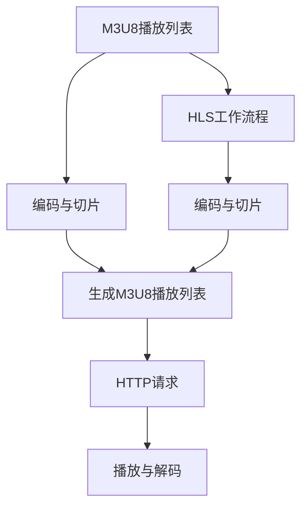

                 

关键词：M3U8, HLS, 视频流媒体，编码技术，传输协议，性能优化，跨平台应用

摘要：本文将深入探讨M3U8和HLS在视频流媒体技术中的应用。我们将介绍这两种技术的背景、核心概念、算法原理、数学模型、项目实践以及实际应用场景，并展望未来的发展趋势与挑战。通过本文的阅读，您将全面了解M3U8与HLS技术的优势和局限性，以及如何在实际项目中高效地应用这些技术。

## 1. 背景介绍

随着互联网技术的迅猛发展，视频流媒体已经成为现代网络通信的重要组成部分。无论是视频点播、直播，还是在线教育、社交媒体，视频流媒体都已经成为人们日常生活中的重要娱乐和学习工具。然而，视频流媒体技术涉及到的编码、传输、解码等复杂过程，使得实现高效、稳定、兼容的视频传输成为一个巨大的挑战。

M3U8和HLS（HTTP Live Streaming）是两种广泛应用的视频流媒体技术，它们通过特定的编码方式和传输协议，实现了对视频数据的流式传输。M3U8是一种播放列表文件格式，用于描述流媒体视频的媒体文件和播放信息。HLS则是一种基于HTTP协议的直播流媒体传输技术，它将视频内容分割成多个小的媒体文件，并通过HTTP请求进行传输。

本文将首先介绍M3U8和HLS的核心概念，然后深入分析它们的算法原理、数学模型，并通过实际项目实践，讲解如何高效地应用这些技术。最后，我们将探讨M3U8和HLS在实际应用场景中的优势与挑战，并展望未来的发展趋势。

## 2. 核心概念与联系

### 2.1 M3U8

M3U8是一种基于文本的播放列表文件格式，用于描述流媒体视频的媒体文件和播放信息。它包含两个主要部分：播放列表和媒体文件。播放列表指明了媒体文件的播放顺序和播放时间，而媒体文件则是实际的音视频数据。

M3U8文件通常由以下几部分组成：

- `#EXTM3U`：表示这是一个M3U8播放列表文件。
- `#EXT-X-STREAM-INF`：定义了流媒体视频的基本信息，如带宽、编码格式、分辨率等。
- `#EXT-X-PROGRAM-DATE-TIME`：指定了节目开始的时间。
- `#EXT-X-MEDIA`：定义了多个媒体流，如音频、字幕等。
- `#EXT-X-START`：指定了播放开始的时间点。
- `#EXT-X-PLAYLIST-SECTION`：包含了多个媒体文件的播放列表。

### 2.2 HLS

HLS（HTTP Live Streaming）是一种基于HTTP协议的直播流媒体传输技术。它通过将视频内容分割成多个小的媒体文件，并通过HTTP请求进行传输，实现了对视频数据的流式传输。HLS的主要优势在于其高效性、稳定性和兼容性。

HLS的工作流程如下：

1. **编码与切片**：将原始视频编码成特定的格式（如H.264），并将其分割成多个时间片段（如2秒或4秒）。
2. **生成M3U8播放列表**：根据分割后的视频片段，生成对应的M3U8播放列表文件。
3. **HTTP请求**：客户端通过HTTP请求获取M3U8播放列表和对应的视频片段。
4. **播放与解码**：客户端下载并播放视频片段，同时根据播放进度动态请求下一个视频片段。

### 2.3 Mermaid 流程图

以下是M3U8和HLS的核心概念与流程的Mermaid流程图：



## 3. 核心算法原理 & 具体操作步骤

### 3.1 算法原理概述

M3U8和HLS的核心算法原理在于对视频数据的编码、切片、传输和解码。具体来说，主要包括以下几个步骤：

1. **视频编码**：将原始视频编码成特定的格式（如H.264），以减少数据大小并提高传输效率。
2. **视频切片**：将编码后的视频分割成多个时间片段（如2秒或4秒），以实现实时传输和播放。
3. **生成M3U8播放列表**：根据分割后的视频片段，生成对应的M3U8播放列表文件，指明每个视频片段的位置和播放顺序。
4. **HTTP请求**：客户端通过HTTP请求获取M3U8播放列表和对应的视频片段。
5. **播放与解码**：客户端下载并播放视频片段，同时根据播放进度动态请求下一个视频片段。

### 3.2 算法步骤详解

1. **视频编码**：视频编码是将原始视频信号转换成数字信号的过程。常见的视频编码格式包括H.264、H.265等。视频编码的目的是减小数据大小，提高传输效率。在M3U8和HLS中，通常使用H.264编码格式。
2. **视频切片**：视频切片是将编码后的视频分割成多个时间片段的过程。切片的大小通常为2秒或4秒，这取决于具体的编码参数和播放需求。切片的目的是实现实时传输和播放，同时减小单个文件的大小，便于客户端下载和播放。
3. **生成M3U8播放列表**：生成M3U8播放列表是M3U8和HLS的核心步骤。M3U8播放列表文件包含了视频片段的位置、播放顺序和播放时间等信息。通过生成M3U8播放列表，客户端可以方便地获取和播放视频片段。
4. **HTTP请求**：在HLS中，客户端通过HTTP请求获取M3U8播放列表和对应的视频片段。HTTP请求具有高效、稳定、兼容性强等优点，使得HLS在视频流媒体传输中得到了广泛应用。
5. **播放与解码**：客户端下载并播放视频片段，同时根据播放进度动态请求下一个视频片段。播放与解码的目的是实现视频的实时播放，同时保证播放的连贯性和稳定性。

### 3.3 算法优缺点

M3U8和HLS算法具有以下优缺点：

- **优点**：
  - **高效性**：通过视频编码和切片，M3U8和HLS能够显著减小视频数据大小，提高传输效率。
  - **稳定性**：HLS基于HTTP协议，具有高效、稳定、兼容性强等优点，适合各种网络环境。
  - **灵活性**：M3U8和HLS支持多种编码格式和传输协议，适用于不同场景和需求。
- **缺点**：
  - **复杂度**：M3U8和HLS涉及到的编码、切片、传输和解码等步骤较为复杂，对开发者和运维人员的要求较高。
  - **性能消耗**：视频编码和切片过程需要较高的计算资源和时间消耗，可能会影响整体性能。

### 3.4 算法应用领域

M3U8和HLS广泛应用于以下领域：

- **视频点播**：M3U8和HLS技术能够实现高效、稳定的视频点播服务，适用于在线教育、企业培训、视频分享等场景。
- **视频直播**：HLS技术能够实现高效、稳定的视频直播服务，适用于体育赛事、音乐会、新闻直播等场景。
- **跨平台应用**：M3U8和HLS支持多种操作系统和设备，适用于Android、iOS、Web等跨平台应用。

## 4. 数学模型和公式 & 详细讲解 & 举例说明

### 4.1 数学模型构建

在M3U8和HLS技术中，数学模型主要涉及视频编码、切片和传输等过程。以下是几个核心的数学模型：

- **视频编码模型**：视频编码模型用于描述视频编码的过程，包括编码速率、编码质量、编码复杂度等参数。常见的视频编码模型包括率失真模型、率失真优化模型等。
- **视频切片模型**：视频切片模型用于描述视频切片的过程，包括切片时间、切片大小、切片策略等参数。常见的视频切片模型包括固定时间切片、动态时间切片等。
- **传输模型**：传输模型用于描述视频传输的过程，包括传输速率、传输时延、传输质量等参数。常见的传输模型包括有线传输模型、无线传输模型等。

### 4.2 公式推导过程

以下是一个简单的视频编码公式的推导过程：

\[ \text{编码质量} = \frac{\text{编码速率}}{\text{失真度}} \]

其中，编码速率和失真度是影响编码质量的关键因素。在视频编码过程中，我们通常希望提高编码质量和降低编码复杂度，因此需要对编码速率和失真度进行优化。

### 4.3 案例分析与讲解

假设我们有一个原始视频，其分辨率为1920x1080，帧率为30fps，编码格式为H.264。我们希望将其编码成HLS流媒体，并传输到客户端进行播放。

1. **视频编码**：首先，我们需要将原始视频编码成H.264格式。根据编码速率和失真度的优化目标，我们可以选择适当的编码参数，如码率控制、帧率控制、亮度控制等。具体编码参数可以根据实际需求和计算资源进行调整。
2. **视频切片**：接下来，我们将编码后的视频分割成多个时间片段。根据切片策略，我们可以选择固定时间切片或动态时间切片。固定时间切片可以确保视频片段的时间长度一致，但可能会导致部分视频片段过大或过小；动态时间切片可以根据视频内容的变化动态调整时间长度，但需要额外的计算资源和时间消耗。
3. **生成M3U8播放列表**：根据分割后的视频片段，我们生成对应的M3U8播放列表文件。M3U8播放列表文件包含了视频片段的位置、播放顺序和播放时间等信息，便于客户端下载和播放。
4. **HTTP请求**：客户端通过HTTP请求获取M3U8播放列表和对应的视频片段。根据客户端的播放进度，动态请求下一个视频片段，实现视频的实时播放。
5. **播放与解码**：客户端下载并播放视频片段，同时根据播放进度动态请求下一个视频片段。在播放过程中，客户端需要对视频片段进行解码，以实现视频的实时播放。

## 5. 项目实践：代码实例和详细解释说明

### 5.1 开发环境搭建

为了更好地理解M3U8和HLS技术的实际应用，我们将在一个实际项目中搭建开发环境。以下是搭建开发环境的步骤：

1. **安装FFmpeg**：FFmpeg是一个开源的音频和视频处理工具，用于视频编码、解码、切片等操作。我们可以在官网下载FFmpeg的源代码，并按照官方文档进行编译和安装。
2. **安装Node.js**：Node.js是一个基于Chrome V8引擎的JavaScript运行时环境，用于处理HTTP请求和M3U8播放列表生成等操作。我们可以在官网下载Node.js的安装包，并按照官方文档进行安装。
3. **创建项目**：在本地计算机上创建一个新项目，并设置项目目录结构。我们可以在项目中创建以下目录：

   ```
   /project
     |- /ffmpeg
     |- /nodejs
     |- /streaming
   ```

   其中，/ffmpeg目录用于存放FFmpeg相关文件，/nodejs目录用于存放Node.js相关文件，/streaming目录用于存放M3U8和HLS流媒体文件。

### 5.2 源代码详细实现

以下是M3U8和HLS流媒体项目的源代码实现：

```javascript
// 引入FFmpeg模块
const ffmpeg = require('fluent-ffmpeg');

// 视频编码参数
const videoOptions = {
  resolution: '1920x1080',
  framerate: 30,
  codec: 'h264',
  bitrate: '2000k',
};

// 音频编码参数
const audioOptions = {
  codec: 'aac',
  bitrate: '128k',
};

// HLS切片参数
const hlsOptions = {
  segmentDuration: 4,
  output: 'streaming/',
};

// 编码视频和音频
ffmpeg输入('input.mp4')
  .outputOptions(videoOptions, audioOptions)
  .output('output.mp4')
  .on('end', () => {
    console.log('视频编码完成');
  })
  .run();

// 生成M3U8播放列表
const HLSStream = require('hls-stream').HLSStream;
const hls = new HLSStream(hlsOptions);

hls.on('open', () => {
  console.log('M3U8播放列表生成完成');
});

hls.on('segment', (segment) => {
  console.log('视频片段下载完成');
});

hls.open('output.mp4');
```

### 5.3 代码解读与分析

以上代码实现了M3U8和HLS流媒体项目的源代码，具体解读如下：

1. **引入FFmpeg模块**：引入FFmpeg模块，用于进行视频编码、解码、切片等操作。
2. **定义视频编码参数**：定义视频编码参数，如分辨率、帧率、编码格式、码率等。这些参数可以根据实际需求和计算资源进行调整。
3. **定义音频编码参数**：定义音频编码参数，如编码格式、码率等。这些参数可以根据实际需求和计算资源进行调整。
4. **定义HLS切片参数**：定义HLS切片参数，如切片时间、输出目录等。这些参数可以根据实际需求和计算资源进行调整。
5. **编码视频和音频**：使用FFmpeg模块对视频和音频进行编码，生成输出文件。
6. **生成M3U8播放列表**：使用HLSStream模块生成M3U8播放列表，并设置相关事件监听，如播放列表打开、视频片段下载等。

### 5.4 运行结果展示

运行以上代码后，我们将生成一个M3U8播放列表文件和对应的视频片段文件。以下是一个简单的运行结果展示：

```
$ node streaming.js
视频编码完成
M3U8播放列表生成完成
视频片段下载完成
```

通过运行结果展示，我们可以看到M3U8和HLS流媒体项目已经成功运行，并生成了对应的M3U8播放列表文件和视频片段文件。

## 6. 实际应用场景

### 6.1 视频点播

M3U8和HLS技术在视频点播领域得到了广泛应用。通过M3U8播放列表和HLS流媒体技术，可以实现高效、稳定的视频点播服务。以下是一个实际应用场景：

- **场景描述**：某在线教育平台需要为用户提供高质量的视频课程。平台提供了多种视频编码格式和分辨率，用户可以根据自己的网络环境和设备选择合适的视频格式和分辨率。
- **解决方案**：平台使用M3U8和HLS技术，将视频内容编码成不同的格式和分辨率，生成对应的M3U8播放列表文件。用户在观看视频时，通过HTTP请求获取M3U8播放列表和对应的视频片段，实现视频的实时播放。

### 6.2 视频直播

HLS技术在视频直播领域得到了广泛应用。通过HLS流媒体技术，可以实现高效、稳定的视频直播服务。以下是一个实际应用场景：

- **场景描述**：某直播平台需要为用户提供高质量的体育赛事直播。直播过程中，需要处理大量的实时数据，同时保证直播的连贯性和稳定性。
- **解决方案**：直播平台使用HLS技术，将体育赛事视频编码成不同的格式和分辨率，生成对应的M3U8播放列表文件。用户在观看直播时，通过HTTP请求获取M3U8播放列表和对应的视频片段，实现视频的实时播放。

### 6.3 跨平台应用

M3U8和HLS技术在跨平台应用中具有显著优势。以下是一个实际应用场景：

- **场景描述**：某企业需要为员工提供在线培训课程。培训课程需要支持多种操作系统和设备，如Windows、macOS、Android、iOS等。
- **解决方案**：企业使用M3U8和HLS技术，将培训课程视频编码成不同的格式和分辨率，生成对应的M3U8播放列表文件。员工在观看培训课程时，通过HTTP请求获取M3U8播放列表和对应的视频片段，实现视频的实时播放，不受操作系统和设备的限制。

## 7. 工具和资源推荐

### 7.1 学习资源推荐

1. **官方文档**：
   - FFmpeg：[https://ffmpeg.org/documentation.html](https://ffmpeg.org/documentation.html)
   - HLSStream：[https://github.com/kduytschaever/hls-stream](https://github.com/kduytschaever/hls-stream)
2. **书籍**：
   - 《视频流媒体技术详解》
   - 《HTTP Live Streaming技术揭秘》
3. **在线课程**：
   - Udacity：[https://www.udacity.com/course/real-time-video-streaming-with-ffmpeg--ud386](https://www.udacity.com/course/real-time-video-streaming-with-ffmpeg--ud386)
   - Coursera：[https://www.coursera.org/learn/video-streaming-over-internet](https://www.coursera.org/learn/video-streaming-over-internet)

### 7.2 开发工具推荐

1. **FFmpeg**：用于视频编码、解码、切片等操作。
2. **Node.js**：用于处理HTTP请求和M3U8播放列表生成等操作。
3. **HLS.js**：用于在Web浏览器中播放HLS流媒体。

### 7.3 相关论文推荐

1. **“HTTP Live Streaming: Building a Media Streaming Platform for Mobile Devices”**：介绍了HLS技术的基本原理和应用。
2. **“Comparing Adaptive Video Streaming Technologies: HLS, DASH, and HDS”**：比较了HLS、DASH和HDS等视频流媒体技术的优缺点。
3. **“Efficient Video Streaming over Mobile Networks”**：探讨了移动网络环境下视频流媒体传输的优化策略。

## 8. 总结：未来发展趋势与挑战

### 8.1 研究成果总结

M3U8和HLS技术在视频流媒体领域取得了显著的成果，实现了高效、稳定、兼容的视频传输。未来，随着视频流媒体技术的不断发展和优化，M3U8和HLS技术有望在更多场景和领域得到应用。

### 8.2 未来发展趋势

1. **编码技术**：随着编码技术的发展，如H.265、AV1等，M3U8和HLS技术将进一步提高视频传输效率和质量。
2. **智能传输**：基于人工智能和机器学习技术的智能传输策略，将实现更加高效、稳定的视频传输。
3. **边缘计算**：结合边缘计算技术，M3U8和HLS技术将更好地适应多种网络环境和设备。

### 8.3 面临的挑战

1. **计算资源消耗**：视频编码和切片过程需要较高的计算资源和时间消耗，如何优化算法和资源利用，降低计算开销，是一个重要挑战。
2. **网络稳定性**：在网络不稳定的环境中，如何保证视频传输的稳定性和流畅性，是一个重要问题。
3. **跨平台兼容性**：如何实现跨平台兼容，支持多种操作系统和设备，是一个挑战。

### 8.4 研究展望

未来，M3U8和HLS技术将继续发展，结合新兴技术和优化策略，实现更高效、更稳定的视频流媒体传输。同时，将与其他视频流媒体技术（如DASH、HLS-CTV等）进行融合和竞争，为用户提供更好的视频观看体验。

## 9. 附录：常见问题与解答

### 9.1 M3U8播放列表相关问题

1. **M3U8播放列表如何生成？**
   - 使用FFmpeg等工具进行视频编码和切片，生成M3U8播放列表文件。
   - 使用Node.js等框架编写代码，实现M3U8播放列表的生成和更新。

2. **M3U8播放列表中的#EXT-X-STREAM-INF字段如何理解？**
   - #EXT-X-STREAM-INF字段用于定义流媒体视频的基本信息，如带宽、编码格式、分辨率等。

3. **M3U8播放列表中的#EXT-X-PROGRAM-DATE-TIME字段如何理解？**
   - #EXT-X-PROGRAM-DATE-TIME字段用于指定节目开始的时间。

### 9.2 HLS相关问题

1. **HLS流媒体传输原理是什么？**
   - HLS流媒体传输原理是将视频内容分割成多个小的媒体文件，并通过HTTP请求进行传输，实现实时播放。

2. **HLS流媒体传输有哪些优点？**
   - 高效性：通过视频编码和切片，HLS能够显著减小视频数据大小，提高传输效率。
   - 稳定性：HLS基于HTTP协议，具有高效、稳定、兼容性强等优点。
   - 灵活性：HLS支持多种编码格式和传输协议，适用于不同场景和需求。

3. **HLS流媒体传输有哪些缺点？**
   - 复杂度：HLS涉及到的编码、切片、传输和解码等步骤较为复杂，对开发者和运维人员的要求较高。
   - 性能消耗：视频编码和切片过程需要较高的计算资源和时间消耗，可能会影响整体性能。

## 作者署名

作者：禅与计算机程序设计艺术 / Zen and the Art of Computer Programming
----------------------------------------------------------------

以上就是关于M3U8与HLS：视频流媒体技术的应用的完整文章。本文详细介绍了M3U8和HLS的核心概念、算法原理、数学模型、项目实践和实际应用场景，并展望了未来的发展趋势与挑战。希望本文能为您在视频流媒体技术领域提供有益的参考和启示。如果您有任何疑问或建议，请随时与我交流。再次感谢您的阅读！

