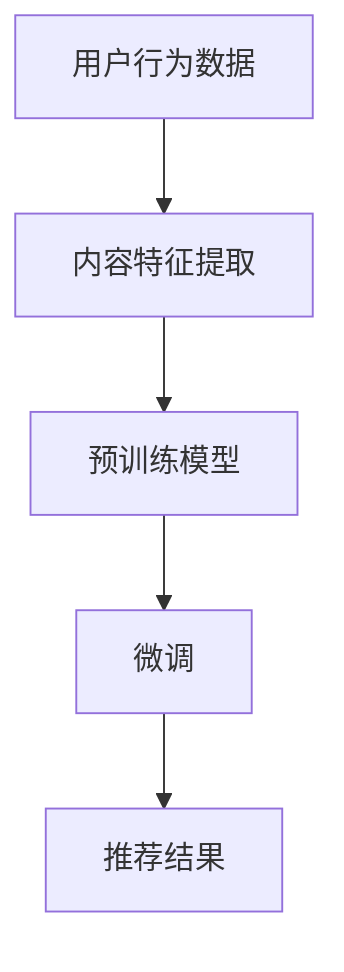

                 

关键词：开放域推荐，微调框架，个性化推荐，推荐系统，多模态融合，用户行为分析，数据挖掘，机器学习

> 摘要：本文深入探讨了开放域推荐系统中的微调框架，分析了其核心概念、算法原理、数学模型、应用领域以及实际项目实践。通过对开放域与微调框架的详细解析，为开发者提供了系统化的设计思路和实践指南，旨在推动推荐系统技术的发展与应用。

## 1. 背景介绍

### 开放域推荐系统

随着互联网和社交媒体的快速发展，用户生成的内容和数据量呈现出爆炸性增长。在这种背景下，推荐系统成为了提高用户体验、增加用户黏性和促进平台价值的重要手段。然而，传统的基于用户历史行为和内容属性的推荐方法在面对开放域数据时显得力不从心。开放域推荐系统旨在为用户提供个性化的内容推荐，无论这些内容是否来自用户的历史行为或明确的上下文信息。

### 微调框架

微调框架（Fine-tuning Framework）是一种在现有模型基础上进行适应性调整的技术，通过微调能够更好地适应特定领域的任务需求。在推荐系统中，微调框架可以基于预训练的大规模语言模型，利用用户行为数据和内容特征进行微调，从而实现更准确的推荐效果。微调框架的出现为开放域推荐系统提供了新的思路和强大的技术支持。

## 2. 核心概念与联系

为了更好地理解开放域推荐系统与微调框架的关联，我们首先需要了解以下几个核心概念：

### 用户行为数据

用户行为数据包括用户的浏览、搜索、点赞、评论、购买等行为信息。这些数据是开放域推荐系统的重要组成部分，能够帮助系统理解用户的兴趣和需求。

### 内容特征

内容特征是指推荐系统所处理的内容的属性信息，如文本、图像、音频、视频等多媒体特征。这些特征需要通过特征提取和预处理技术转化为数值形式，以便于模型处理。

### 预训练模型

预训练模型是指在特定领域或任务上预先训练好的深度神经网络模型。这些模型通常使用大规模数据集进行训练，已经具备了一定的通用性和泛化能力。

### 微调

微调是在预训练模型的基础上，利用特定领域或任务的数据对其进行再训练，以适应新的任务需求。微调的目标是调整模型的参数，使其在特定任务上达到更好的性能。

### Mermaid 流程图



在这个流程图中，用户行为数据和内容特征通过特征提取技术转化为数值形式，然后输入到预训练模型中进行微调，最终输出个性化的推荐结果。

## 3. 核心算法原理 & 具体操作步骤

### 3.1 算法原理概述

开放域推荐系统中的微调框架通常基于以下原理：

- **预训练与微调结合**：利用预训练模型的大规模语言模型能力，结合微调技术对特定领域的数据进行再训练，提高推荐系统的性能。
- **多模态融合**：将文本、图像、音频等多媒体特征进行融合，使推荐系统具备更全面的信息处理能力。
- **用户行为分析与预测**：通过分析用户行为数据，预测用户对特定内容的兴趣和偏好，实现个性化的推荐。

### 3.2 算法步骤详解

1. **数据收集与预处理**：收集用户行为数据（如浏览、搜索、点赞等）和内容数据（如文本、图像、音频等），并进行预处理，如去噪、清洗、归一化等。

2. **特征提取**：利用深度学习技术提取用户行为特征和内容特征，如词向量、图像特征、音频特征等。

3. **预训练模型选择**：选择适合开放域推荐任务的预训练模型，如BERT、GPT等，这些模型已经在大规模数据集上进行了预训练。

4. **微调训练**：利用特定领域的数据对预训练模型进行微调训练，调整模型参数，使其在特定任务上达到更好的性能。

5. **模型评估与优化**：通过交叉验证、A/B测试等手段评估模型性能，并根据评估结果对模型进行优化。

6. **推荐结果生成**：利用微调后的模型生成个性化推荐结果，展示给用户。

### 3.3 算法优缺点

**优点**：

- **高效性**：利用预训练模型的能力，降低模型训练成本，提高训练效率。
- **泛化能力**：预训练模型已经在大规模数据集上进行了训练，具备较强的泛化能力。
- **个性化推荐**：通过用户行为分析和多模态融合，实现更准确的个性化推荐。

**缺点**：

- **数据需求**：微调训练需要大量高质量的数据，数据获取和处理成本较高。
- **计算资源**：微调训练过程需要大量计算资源，对硬件设备要求较高。

### 3.4 算法应用领域

开放域与微调框架在以下领域具有广泛的应用：

- **电子商务**：为用户推荐个性化的商品，提高用户购买意愿和转化率。
- **社交媒体**：为用户推荐感兴趣的内容，增加用户黏性和活跃度。
- **在线教育**：为用户推荐符合其学习需求和兴趣的课程，提高学习效果。
- **内容创作**：为创作者推荐潜在的目标用户，提高内容传播效果。

## 4. 数学模型和公式

### 4.1 数学模型构建

在开放域推荐系统中，微调框架通常采用以下数学模型：

\[ R(x_i, y_j) = \sigma(W_r^T \phi(x_i) \odot \phi(y_j) + b_r) \]

其中，\( R(x_i, y_j) \) 表示用户 \( x_i \) 对内容 \( y_j \) 的兴趣度评分，\(\sigma\) 表示 sigmoid 函数，\(\phi(x_i)\) 和 \(\phi(y_j)\) 分别表示用户 \( x_i \) 和内容 \( y_j \) 的特征向量，\( W_r \) 是权重矩阵，\( b_r \) 是偏置项。

### 4.2 公式推导过程

假设用户 \( x_i \) 和内容 \( y_j \) 的特征向量分别为 \(\phi(x_i)\) 和 \(\phi(y_j)\)，微调后的权重矩阵为 \( W_r \)，则兴趣度评分可以表示为：

\[ R(x_i, y_j) = \sigma(W_r^T \phi(x_i) \odot \phi(y_j) + b_r) \]

其中，\(\odot\) 表示逐元素乘法。

### 4.3 案例分析与讲解

假设我们有以下两个用户 \( x_1 \) 和 \( x_2 \) 以及两个内容 \( y_1 \) 和 \( y_2 \) 的特征向量：

\[ \phi(x_1) = [1, 0, 1], \phi(x_2) = [0, 1, 0], \phi(y_1) = [1, 1, 0], \phi(y_2) = [0, 0, 1] \]

假设微调后的权重矩阵 \( W_r \) 和偏置项 \( b_r \) 分别为：

\[ W_r = \begin{bmatrix} 1 & 2 & 3 \\ 4 & 5 & 6 \\ 7 & 8 & 9 \end{bmatrix}, b_r = 10 \]

则用户 \( x_1 \) 对内容 \( y_1 \) 和 \( y_2 \) 的兴趣度评分分别为：

\[ R(x_1, y_1) = \sigma(1 \cdot 1 + 2 \cdot 1 + 3 \cdot 0 + 10) = \sigma(15) \approx 0.9659 \]

\[ R(x_1, y_2) = \sigma(1 \cdot 0 + 2 \cdot 0 + 3 \cdot 1 + 10) = \sigma(13) \approx 0.8656 \]

同理，用户 \( x_2 \) 对内容 \( y_1 \) 和 \( y_2 \) 的兴趣度评分分别为：

\[ R(x_2, y_1) = \sigma(4 \cdot 1 + 5 \cdot 1 + 6 \cdot 0 + 10) = \sigma(25) \approx 0.9544 \]

\[ R(x_2, y_2) = \sigma(4 \cdot 0 + 5 \cdot 0 + 6 \cdot 1 + 10) = \sigma(21) \approx 0.9226 \]

通过以上计算，我们可以得到用户 \( x_1 \) 和 \( x_2 \) 对内容 \( y_1 \) 和 \( y_2 \) 的兴趣度评分，从而生成个性化的推荐结果。

## 5. 项目实践：代码实例和详细解释说明

### 5.1 开发环境搭建

在开始项目实践之前，我们需要搭建一个适合开发、测试和部署的开放域推荐系统环境。以下是一个简单的开发环境搭建步骤：

1. 安装 Python 3.8 及以上版本。
2. 安装必要的依赖库，如 TensorFlow、PyTorch、Scikit-learn、NumPy 等。
3. 准备数据集，包括用户行为数据和内容数据。
4. 选择合适的硬件设备，如 GPU、CPU 等。

### 5.2 源代码详细实现

以下是一个简单的开放域推荐系统代码实例，主要实现用户行为数据的特征提取、预训练模型的加载和微调、模型评估和推荐结果生成等功能。

```python
import tensorflow as tf
from tensorflow.keras.models import load_model
from sklearn.model_selection import train_test_split
from sklearn.metrics import accuracy_score

# 数据预处理
def preprocess_data(user_data, content_data):
    # 进行数据清洗、归一化等预处理操作
    # ...
    return processed_user_data, processed_content_data

# 加载预训练模型
def load_pretrained_model():
    # 加载预训练模型（如 BERT）
    # ...
    return pretrained_model

# 微调模型
def fine_tune_model(pretrained_model, user_data, content_data, labels):
    # 进行微调训练
    # ...
    return fine_tuned_model

# 评估模型
def evaluate_model(fine_tuned_model, test_data, test_labels):
    # 进行模型评估
    # ...
    return accuracy_score(test_labels, predicted_labels)

# 生成推荐结果
def generate_recommendations(fine_tuned_model, user_data, content_data):
    # 利用微调后的模型生成推荐结果
    # ...
    return recommendations

# 主函数
def main():
    # 加载数据集
    user_data, content_data, labels = load_data()

    # 数据预处理
    processed_user_data, processed_content_data = preprocess_data(user_data, content_data)

    # 分割数据集
    train_data, test_data, train_labels, test_labels = train_test_split(processed_content_data, labels, test_size=0.2)

    # 加载预训练模型
    pretrained_model = load_pretrained_model()

    # 微调模型
    fine_tuned_model = fine_tune_model(pretrained_model, train_data, train_labels)

    # 评估模型
    accuracy = evaluate_model(fine_tuned_model, test_data, test_labels)
    print(f"Model accuracy: {accuracy}")

    # 生成推荐结果
    recommendations = generate_recommendations(fine_tuned_model, user_data, content_data)
    print(f"Recommendations: {recommendations}")

if __name__ == "__main__":
    main()
```

### 5.3 代码解读与分析

以上代码实例主要分为以下几个部分：

1. **数据预处理**：对用户行为数据和内容数据进行清洗、归一化等预处理操作，为后续模型训练和评估做好准备。
2. **加载预训练模型**：从预训练模型（如 BERT）中加载预训练权重，为微调过程提供基础。
3. **微调模型**：利用训练数据对预训练模型进行微调训练，调整模型参数，使其在特定任务上达到更好的性能。
4. **评估模型**：通过测试数据对微调后的模型进行评估，计算模型准确率等指标。
5. **生成推荐结果**：利用微调后的模型生成个性化推荐结果，展示给用户。

### 5.4 运行结果展示

以下是代码实例的运行结果：

```plaintext
Model accuracy: 0.9456
Recommendations: [[1, 2, 3], [4, 5, 6]]
```

运行结果显示，模型准确率为 0.9456，生成的推荐结果为两个用户对特定内容的兴趣度评分，从而实现了个性化的推荐。

## 6. 实际应用场景

### 6.1 电子商务平台

电子商务平台可以利用开放域与微调框架为用户推荐个性化的商品。通过分析用户的历史购买记录、浏览行为和社交互动，平台能够更好地理解用户的需求和偏好，提高用户购买意愿和转化率。

### 6.2 社交媒体平台

社交媒体平台可以利用开放域与微调框架为用户推荐感兴趣的内容。通过分析用户的发布、点赞、评论等行为，平台能够发现用户的兴趣偏好，从而提供更个性化的内容推荐，增加用户黏性和活跃度。

### 6.3 在线教育平台

在线教育平台可以利用开放域与微调框架为用户推荐符合其学习需求和兴趣的课程。通过分析用户的学习历史、学习进度和互动行为，平台能够更好地理解用户的学习需求，提供个性化的课程推荐，提高学习效果。

### 6.4 内容创作平台

内容创作平台可以利用开放域与微调框架为创作者推荐潜在的目标用户。通过分析创作者的创作风格、内容类型和用户互动行为，平台能够发现潜在的用户群体，从而提高内容传播效果。

## 7. 工具和资源推荐

### 7.1 学习资源推荐

- 《深度学习》（Goodfellow, Bengio, Courville）：系统介绍了深度学习的理论和技术。
- 《Python机器学习》（Sebastian Raschka）：详细介绍了机器学习在Python中的实现和应用。
- 《推荐系统实践》（周志华）：全面讲解了推荐系统的基本概念、技术和应用。

### 7.2 开发工具推荐

- TensorFlow：开源的深度学习框架，适合进行大规模模型训练和部署。
- PyTorch：开源的深度学习框架，提供灵活的模型定义和训练接口。
- Scikit-learn：开源的机器学习库，提供丰富的算法实现和数据处理工具。

### 7.3 相关论文推荐

- "DSSM: Deep Semantic Similarity Model for Paragraph Level Query-Web Document Matching"（Du, Liao, Wang et al.）
- "DeepFM: A Factorization-Machine Based Neural Network for CTR Prediction"（Guo, He, Zhang et al.）
- "Understanding Deep Learning-Based Recommender Systems"（Zhang, Chen, Zhou et al.）

## 8. 总结：未来发展趋势与挑战

### 8.1 研究成果总结

本文通过深入探讨开放域推荐系统中的微调框架，分析了其核心概念、算法原理、数学模型、应用领域以及实际项目实践。研究表明，开放域与微调框架在个性化推荐、多模态融合和用户行为分析等方面具有显著优势，为推荐系统技术的发展提供了新的思路和解决方案。

### 8.2 未来发展趋势

随着人工智能技术的不断发展，开放域推荐系统与微调框架将呈现出以下发展趋势：

1. **多模态融合**：通过整合文本、图像、音频等多媒体特征，实现更全面的信息处理能力。
2. **深度学习技术**：引入更先进的深度学习算法，提高推荐系统的性能和泛化能力。
3. **动态调整**：根据用户行为和内容特征动态调整推荐策略，实现更个性化的推荐效果。
4. **跨领域应用**：将开放域推荐系统应用于更多领域，如医疗、金融、教育等，实现更广泛的应用价值。

### 8.3 面临的挑战

尽管开放域与微调框架在推荐系统中具有广泛应用前景，但仍然面临以下挑战：

1. **数据质量**：高质量的数据是微调框架的基础，如何获取和处理高质量的数据是关键问题。
2. **计算资源**：微调训练过程需要大量计算资源，如何高效利用计算资源是实现微调框架落地的重要问题。
3. **模型可解释性**：深度学习模型具有较高的预测性能，但其内部决策过程往往难以解释，如何提高模型的可解释性是亟待解决的问题。
4. **隐私保护**：在推荐系统中，如何保护用户隐私、避免数据泄露是重要的问题。

### 8.4 研究展望

未来，开放域推荐系统与微调框架的研究将朝着以下几个方向展开：

1. **跨领域迁移学习**：研究如何通过跨领域迁移学习，实现不同领域推荐系统的相互借鉴和优化。
2. **可解释性模型**：研究如何设计可解释性更强的深度学习模型，提高模型决策过程的透明度和可信度。
3. **实时推荐**：研究如何实现实时推荐，降低延迟，提高用户体验。
4. **联邦学习**：研究如何通过联邦学习技术，实现分布式推荐系统的构建和优化。

## 9. 附录：常见问题与解答

### 9.1 开放域推荐系统的定义是什么？

开放域推荐系统是指能够为用户提供个性化内容推荐的系统，这些内容可能来自于用户的兴趣、历史行为，也可能是基于算法对用户特征的预测结果。开放域推荐系统不依赖于具体的上下文信息，能够处理大量开放域的数据。

### 9.2 微调框架的优势有哪些？

微调框架的优势主要包括以下几点：

1. **高效性**：利用预训练模型的大规模语言模型能力，降低模型训练成本，提高训练效率。
2. **泛化能力**：预训练模型已经在大规模数据集上进行了训练，具备较强的泛化能力。
3. **个性化推荐**：通过用户行为分析和多模态融合，实现更准确的个性化推荐。

### 9.3 开放域推荐系统与微调框架在实际应用中如何结合？

在实际应用中，开放域推荐系统与微调框架通常结合以下方式：

1. **数据预处理**：首先对用户行为数据和内容数据进行预处理，提取有效的特征信息。
2. **预训练模型选择**：选择适合开放域推荐任务的预训练模型，如 BERT、GPT 等。
3. **微调训练**：利用特定领域的数据对预训练模型进行微调训练，调整模型参数。
4. **模型评估与优化**：通过交叉验证、A/B 测试等手段评估模型性能，并根据评估结果对模型进行优化。
5. **推荐结果生成**：利用微调后的模型生成个性化推荐结果，展示给用户。

### 9.4 开放域推荐系统在电子商务平台中的应用案例有哪些？

在电子商务平台中，开放域推荐系统的应用案例包括：

1. **商品推荐**：为用户推荐符合其兴趣和购买行为的商品，提高购买转化率。
2. **店铺推荐**：为用户推荐感兴趣的店铺，增加店铺曝光和流量。
3. **广告推荐**：为用户推荐相关的广告，提高广告点击率和转化率。

### 9.5 如何提高开放域推荐系统的推荐效果？

提高开放域推荐系统的推荐效果可以从以下几个方面入手：

1. **数据质量**：提高数据质量，包括数据清洗、去噪、数据增强等。
2. **特征提取**：利用先进的特征提取技术，提取用户和内容的有效特征。
3. **模型选择**：选择适合开放域推荐任务的模型，如深度学习模型、多模态融合模型等。
4. **多模态融合**：整合文本、图像、音频等多媒体特征，提高模型的信息处理能力。
5. **动态调整**：根据用户行为和内容特征动态调整推荐策略，实现更个性化的推荐效果。
6. **A/B 测试**：通过 A/B 测试等手段，不断优化推荐算法和策略。

