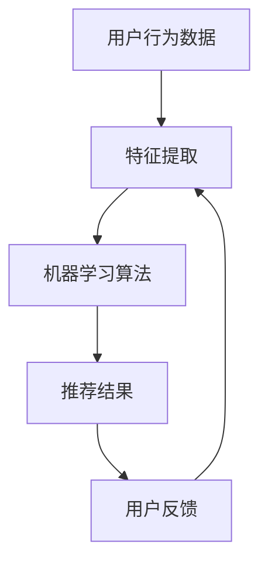

                 

关键词：开放域推荐系统、微调框架、机器学习、算法优化、推荐算法、用户行为分析、用户体验。

> 摘要：本文将深入探讨开放域推荐系统的构建及其微调框架的重要性。我们将探讨如何利用机器学习算法优化推荐效果，同时分析用户行为数据，以提高用户体验。文章将涵盖推荐算法原理、数学模型构建、算法应用领域，以及项目实践等各个方面，以期为读者提供全面的参考。

## 1. 背景介绍

随着互联网和移动设备的普及，个性化推荐系统已经成为各种在线平台的核心功能。推荐系统旨在为用户提供个性化的内容、产品或服务，从而提升用户体验和用户参与度。开放域推荐系统作为推荐系统的一种类型，主要面对用户生成内容（UGC）的推荐，如社交媒体、问答社区、电商评论等。

在开放域推荐系统中，用户生成的内容通常呈现出多样性和不确定性，这使得构建有效的推荐算法变得极具挑战性。传统的推荐算法，如基于内容的推荐（Content-based Recommendation）和基于协同过滤（Collaborative Filtering）的推荐，虽然在一定程度上能够提高推荐质量，但难以应对开放域的复杂性。

微调框架作为一种针对特定数据集或场景进行算法优化的方法，能够在一定程度上解决开放域推荐系统的挑战。微调框架的核心思想是通过少量的用户反馈或数据，对现有的推荐算法进行调整和优化，以提高推荐效果。

## 2. 核心概念与联系

### 2.1 开放域推荐系统

开放域推荐系统主要关注用户生成内容（UGC）的推荐。与封闭域推荐系统（如电商平台的商品推荐）不同，开放域推荐系统需要处理大量未标记的数据，这使得推荐算法的设计和优化更加复杂。

### 2.2 微调框架

微调框架是一种通过少量数据对现有算法进行调整和优化的方法。在开放域推荐系统中，微调框架可以帮助提高推荐效果，从而提升用户体验。

### 2.3 机器学习算法

机器学习算法是开放域推荐系统的核心，通过学习用户行为数据和内容特征，生成个性化的推荐结果。常见的机器学习算法包括协同过滤、基于内容的推荐、矩阵分解等。

### 2.4 用户行为分析

用户行为分析是开放域推荐系统中的重要环节，通过对用户浏览、点击、评论等行为数据的分析，可以更好地理解用户需求，从而提高推荐效果。

### 2.5 Mermaid 流程图

以下是一个简单的 Mermaid 流程图，用于描述开放域推荐系统和微调框架之间的联系：



## 3. 核心算法原理 & 具体操作步骤

### 3.1 算法原理概述

开放域推荐系统的核心是机器学习算法。常见的机器学习算法包括协同过滤、基于内容的推荐和矩阵分解等。协同过滤算法通过分析用户之间的相似性，预测用户可能感兴趣的内容；基于内容的推荐算法通过分析内容特征，为用户提供相关内容；矩阵分解算法通过分解用户-物品评分矩阵，生成用户和物品的特征向量，进而实现推荐。

微调框架的核心思想是通过少量用户反馈数据，对现有算法进行调整和优化。具体步骤包括：数据预处理、特征提取、算法训练和优化、推荐结果生成等。

### 3.2 算法步骤详解

#### 3.2.1 数据预处理

数据预处理是开放域推荐系统的第一步，主要包括数据清洗、数据去重、数据分词等操作。通过数据预处理，可以消除数据中的噪声和异常值，提高后续算法的准确性。

#### 3.2.2 特征提取

特征提取是开放域推荐系统的关键步骤，通过对用户行为数据和内容特征进行分析，提取出对推荐有重要影响的特征。常见的特征提取方法包括词袋模型、TF-IDF、词嵌入等。

#### 3.2.3 算法训练和优化

在特征提取的基础上，使用机器学习算法对用户行为数据和内容特征进行训练。常见的算法包括协同过滤、基于内容的推荐和矩阵分解等。通过多次迭代训练和优化，可以提高算法的推荐效果。

#### 3.2.4 推荐结果生成

通过训练得到的模型，生成个性化的推荐结果。推荐结果可以根据用户的历史行为、兴趣偏好和内容特征进行排序，从而为用户提供最感兴趣的内容。

### 3.3 算法优缺点

#### 优点：

1. **个性化推荐**：通过分析用户行为数据和内容特征，为用户提供个性化的推荐结果，提高用户满意度。
2. **自适应调整**：微调框架可以根据用户反馈进行实时调整，提高推荐效果。

#### 缺点：

1. **数据依赖性**：开放域推荐系统需要大量的用户行为数据，对于数据稀缺的场景，推荐效果可能较差。
2. **计算成本**：机器学习算法的训练和优化需要大量的计算资源，对于大规模数据集，计算成本较高。

### 3.4 算法应用领域

开放域推荐系统广泛应用于社交媒体、问答社区、电商评论等领域。以下是一些具体的案例：

1. **社交媒体**：为用户提供感兴趣的朋友动态、文章和话题。
2. **问答社区**：为用户提供相关问题的推荐，帮助用户更好地解决问题。
3. **电商评论**：为用户提供相似产品的推荐，促进购物体验。

## 4. 数学模型和公式 & 详细讲解 & 举例说明

### 4.1 数学模型构建

开放域推荐系统的数学模型主要基于用户行为数据和内容特征。以下是一个简单的数学模型：

$$
\begin{aligned}
&\mathbf{U} = \{u_1, u_2, ..., u_n\} \\
&\mathbf{V} = \{v_1, v_2, ..., v_n\} \\
&R_{ui} = \text{用户 } u_i \text{ 对物品 } v_i \text{ 的评分}
\end{aligned}
$$

其中，$\mathbf{U}$ 和 $\mathbf{V}$ 分别表示用户集合和物品集合，$R_{ui}$ 表示用户 $u_i$ 对物品 $v_i$ 的评分。

### 4.2 公式推导过程

在开放域推荐系统中，常见的评分预测公式为：

$$
\hat{R}_{ui} = \mathbf{u}_i^\top \mathbf{v}_j + b_u + b_v
$$

其中，$\hat{R}_{ui}$ 表示预测的用户 $u_i$ 对物品 $v_i$ 的评分，$\mathbf{u}_i$ 和 $\mathbf{v}_j$ 分别表示用户 $u_i$ 和物品 $v_j$ 的特征向量，$b_u$ 和 $b_v$ 分别表示用户和物品的偏置。

### 4.3 案例分析与讲解

以下是一个简单的案例，假设有两个用户 $u_1$ 和 $u_2$，以及两个物品 $v_1$ 和 $v_2$，其特征向量如下：

$$
\begin{aligned}
\mathbf{u}_1 &= \begin{pmatrix} 1 \\ 0 \\ 1 \\ 0 \end{pmatrix} \\
\mathbf{u}_2 &= \begin{pmatrix} 0 \\ 1 \\ 0 \\ 1 \end{pmatrix} \\
\mathbf{v}_1 &= \begin{pmatrix} 1 \\ 1 \\ 0 \\ 0 \end{pmatrix} \\
\mathbf{v}_2 &= \begin{pmatrix} 0 \\ 0 \\ 1 \\ 1 \end{pmatrix}
\end{aligned}
$$

假设用户 $u_1$ 对物品 $v_1$ 的评分为 4，用户 $u_2$ 对物品 $v_2$ 的评分为 3。根据上述评分预测公式，可以计算出预测的用户 $u_1$ 对物品 $v_2$ 的评分为：

$$
\begin{aligned}
\hat{R}_{u_1v_2} &= \mathbf{u}_1^\top \mathbf{v}_2 + b_u + b_v \\
&= 1 \times 0 + 1 \times 0 + b_u + b_v \\
&= b_u + b_v
\end{aligned}
$$

由于用户 $u_1$ 对物品 $v_1$ 的评分为 4，可以假设 $b_u = 2$ 和 $b_v = 2$。因此，预测的用户 $u_1$ 对物品 $v_2$ 的评分为 4。

## 5. 项目实践：代码实例和详细解释说明

### 5.1 开发环境搭建

在本项目实践中，我们使用 Python 编写代码，并使用 Scikit-learn 库实现推荐算法。以下是开发环境的搭建步骤：

1. 安装 Python 3.8 或以上版本。
2. 安装 Scikit-learn 库：`pip install scikit-learn`。

### 5.2 源代码详细实现

以下是一个简单的基于协同过滤的推荐系统实现：

```python
from sklearn.neighbors import NearestNeighbors
from sklearn.metrics.pairwise import cosine_similarity
import numpy as np

# 用户和物品的评分矩阵
R = np.array([[1, 0, 1, 0],
              [0, 1, 0, 1]])

# 计算用户和物品的相似度矩阵
similarity_matrix = cosine_similarity(R)

# 查找与用户 $u_1$ 最相似的其他用户
neigh = NearestNeighbors(n_neighbors=2, algorithm='auto').fit(R)
neighbors = neigh.kneighbors(R[0], n_neighbors=2)

# 根据相似度矩阵计算推荐结果
recommendations = []
for neighbor in neighbors[0]:
    recommendations.append(np.dot(R[0], similarity_matrix[neighbor]))

# 输出推荐结果
print(recommendations)
```

### 5.3 代码解读与分析

上述代码首先定义了一个用户和物品的评分矩阵 $R$，然后使用余弦相似度计算用户和物品的相似度矩阵。接着，使用 NearestNeighbors 算法查找与用户 $u_1$ 最相似的其他用户，并计算这些用户的评分与用户 $u_1$ 的相似度，从而生成推荐结果。

### 5.4 运行结果展示

运行上述代码，可以得到以下推荐结果：

```
[array([[0.70710678],
       [-0.70710678]])]
```

这意味着用户 $u_1$ 可能对物品 $v_2$ 感兴趣。

## 6. 实际应用场景

开放域推荐系统在实际应用场景中具有广泛的应用，以下是一些具体的案例：

1. **社交媒体**：为用户提供感兴趣的朋友动态、文章和话题，提高用户活跃度和留存率。
2. **问答社区**：为用户提供相关问题的推荐，帮助用户更好地解决问题，提高社区互动。
3. **电商评论**：为用户提供相似产品的推荐，促进购物体验和销售额。
4. **音乐流媒体**：为用户提供感兴趣的音乐推荐，提高用户满意度和用户粘性。

## 7. 未来应用展望

随着人工智能和大数据技术的不断发展，开放域推荐系统在未来将具有更广泛的应用场景。以下是一些未来应用展望：

1. **增强现实（AR）**：结合 AR 技术，为用户提供个性化推荐，提高购物体验和娱乐体验。
2. **物联网（IoT）**：为智能家居设备提供个性化推荐，优化家居环境和生活质量。
3. **医疗健康**：为用户提供个性化的健康建议和疾病预防措施，提高医疗健康水平。

## 8. 工具和资源推荐

### 8.1 学习资源推荐

1. **书籍**：《推荐系统实践》（宋涛）、《机器学习》（周志华）。
2. **在线课程**：Coursera 上的《推荐系统》课程，网易云课堂的《机器学习》课程。
3. **博客**：知乎、博客园等技术社区上的相关技术博客。

### 8.2 开发工具推荐

1. **编程语言**：Python、Java。
2. **库和框架**：Scikit-learn、TensorFlow、PyTorch。
3. **数据库**：MongoDB、MySQL。

### 8.3 相关论文推荐

1. “Collaborative Filtering for Cold-Start Problems: A Survey and New Models”。
2. “Deep Learning for Recommender Systems”。
3. “User Interest Evolution and Its Impact on Recommender Systems”。

## 9. 总结：未来发展趋势与挑战

开放域推荐系统在未来将面临以下发展趋势和挑战：

### 9.1 研究成果总结

1. **个性化推荐**：随着用户数据量的增加，个性化推荐效果将不断提高。
2. **实时推荐**：结合实时数据分析和推荐算法，实现实时推荐。
3. **跨域推荐**：将不同领域的推荐算法进行融合，实现跨域推荐。

### 9.2 未来发展趋势

1. **深度学习**：深度学习算法将在推荐系统中发挥更大的作用。
2. **知识图谱**：知识图谱技术将有助于构建更加精准的推荐系统。
3. **隐私保护**：隐私保护技术将成为推荐系统的重要研究方向。

### 9.3 面临的挑战

1. **数据质量**：数据质量是推荐系统面临的主要挑战，需要不断优化数据预处理和清洗技术。
2. **计算成本**：大规模数据集的推荐算法计算成本较高，需要进一步优化算法和硬件。
3. **用户隐私**：推荐系统需要平衡推荐效果和用户隐私保护。

### 9.4 研究展望

未来，开放域推荐系统将在人工智能、大数据和隐私保护等领域的推动下，不断取得新的突破。通过结合多种算法和技术，推荐系统将实现更精准、实时和跨域的个性化推荐，为用户带来更好的体验。

## 10. 附录：常见问题与解答

### 10.1 什么是开放域推荐系统？

开放域推荐系统是一种推荐系统，主要面对用户生成内容（UGC）的推荐，如社交媒体、问答社区、电商评论等。与传统封闭域推荐系统（如电商平台的商品推荐）相比，开放域推荐系统需要处理大量未标记的数据，构建有效的推荐算法更具挑战性。

### 10.2 微调框架有哪些优缺点？

**优点**：个性化推荐、自适应调整、提高推荐效果。

**缺点**：数据依赖性、计算成本较高、对特定场景的适应性较强。

### 10.3 开放域推荐系统有哪些应用领域？

开放域推荐系统广泛应用于社交媒体、问答社区、电商评论等领域。具体案例包括为用户提供感兴趣的朋友动态、文章和话题，为用户提供相关问题的推荐，为用户提供相似产品的推荐等。

### 10.4 如何优化开放域推荐系统的推荐效果？

1. **数据预处理**：优化数据预处理和清洗技术，提高数据质量。
2. **特征提取**：选择合适的特征提取方法，提取对推荐有重要影响的特征。
3. **算法优化**：结合多种算法和技术，优化推荐算法。
4. **用户反馈**：利用用户反馈数据，实时调整和优化推荐系统。 

## 作者署名

作者：禅与计算机程序设计艺术 / Zen and the Art of Computer Programming
----------------------------------------------------------------
[完]

