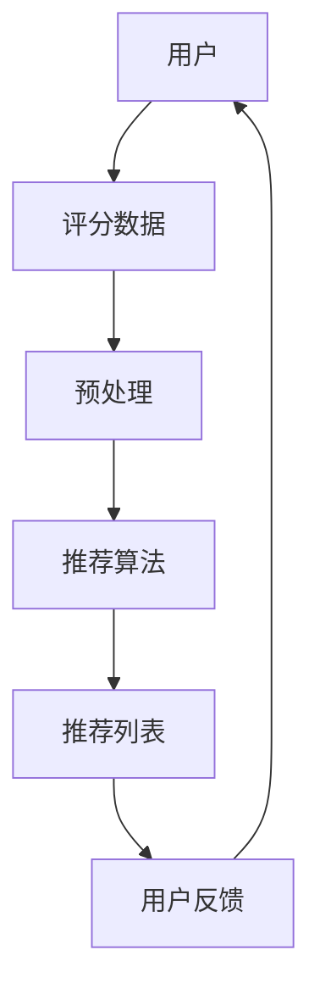

                 

关键词：开放域推荐、算法原理、数学模型、应用场景、代码实例、未来展望

> 摘要：本文将深入探讨开放域推荐系统的核心概念、算法原理、数学模型及其应用场景。通过详细的分析和代码实例，我们将了解如何实现一个高效、可扩展的开放域推荐系统，并探讨其未来的发展趋势和面临的挑战。

## 1. 背景介绍

推荐系统作为人工智能领域的一个重要分支，已经成为互联网企业提高用户体验、增加用户粘性和转化率的关键技术。传统的推荐系统主要集中在单一领域，如电商推荐、视频推荐等，它们在特定场景下能够取得较好的效果。然而，随着互联网的普及和用户需求的多样化，开放域推荐系统应运而生。开放域推荐系统旨在为用户提供跨领域、跨平台的个性化推荐服务，从而更好地满足用户的多样化需求。

本文将重点关注开放域推荐系统的核心概念、算法原理、数学模型及其应用场景。通过详细的分析和代码实例，我们将探讨如何实现一个高效、可扩展的开放域推荐系统，并分析其优缺点。此外，我们还将探讨开放域推荐系统在未来的发展趋势和面临的挑战。

## 2. 核心概念与联系

### 2.1 开放域推荐系统定义

开放域推荐系统（Open-Domain Recommendation System）是指能够跨领域、跨平台为用户提供个性化推荐服务的系统。与传统推荐系统相比，开放域推荐系统具有以下特点：

1. **跨领域推荐**：能够为用户提供不同领域的内容推荐，如新闻、视频、音乐等。
2. **跨平台推荐**：能够为用户提供不同平台上的内容推荐，如移动端、PC端、网页等。
3. **个性化推荐**：基于用户历史行为、偏好和兴趣，为用户推荐其可能感兴趣的内容。

### 2.2 关键概念

为了深入理解开放域推荐系统，我们需要了解以下几个关键概念：

1. **用户**：推荐系统的核心，拥有自己的兴趣和偏好。
2. **项目**：推荐系统中的内容，可以是新闻、视频、音乐等。
3. **评分**：用户对项目的评价，可以是评分、点击、购买等行为。
4. **推荐算法**：用于生成推荐列表的算法，如基于协同过滤、基于内容的推荐、基于模型的推荐等。

### 2.3 Mermaid 流程图

下面是一个简化的开放域推荐系统的 Mermaid 流程图，展示了用户、项目和推荐算法之间的联系：



## 3. 核心算法原理 & 具体操作步骤

### 3.1 算法原理概述

开放域推荐系统的核心算法主要包括以下几类：

1. **基于协同过滤的推荐**：通过分析用户行为，找到相似用户和相似项目，从而生成推荐列表。
2. **基于内容的推荐**：根据用户历史行为和项目特征，为用户推荐具有相似内容的其他项目。
3. **基于模型的推荐**：使用深度学习等技术，建立用户和项目之间的关联模型，从而生成推荐列表。

### 3.2 算法步骤详解

以基于协同过滤的推荐算法为例，其具体操作步骤如下：

1. **数据预处理**：将用户行为数据、项目特征数据进行清洗和预处理，如缺失值填充、异常值处理等。
2. **用户相似度计算**：计算用户之间的相似度，可以使用余弦相似度、皮尔逊相关系数等方法。
3. **项目相似度计算**：计算项目之间的相似度，可以使用基于内容的相似度计算方法，如TF-IDF等。
4. **生成推荐列表**：根据用户相似度和项目相似度，生成推荐列表。常见的推荐策略包括基于用户最近行为的推荐、基于项目流行度的推荐等。
5. **用户反馈**：收集用户对推荐列表的反馈，如点击、评分、购买等行为。

### 3.3 算法优缺点

基于协同过滤的推荐算法具有以下优点：

1. **效果较好**：能够为用户推荐其可能感兴趣的项目，提高用户满意度。
2. **实时性较强**：可以实时生成推荐列表，满足用户实时推荐需求。

然而，该算法也存在以下缺点：

1. **冷启动问题**：对于新用户或新项目，由于缺乏历史数据，推荐效果较差。
2. **数据稀疏性**：在用户行为数据稀疏的情况下，推荐效果不佳。

### 3.4 算法应用领域

基于协同过滤的推荐算法在以下领域具有广泛的应用：

1. **电商推荐**：为用户提供个性化商品推荐，提高购买转化率。
2. **视频推荐**：为用户提供个性化视频推荐，增加用户观看时长。
3. **新闻推荐**：为用户提供个性化新闻推荐，提高新闻阅读量。

## 4. 数学模型和公式 & 详细讲解 & 举例说明

### 4.1 数学模型构建

开放域推荐系统的数学模型主要包括以下几部分：

1. **用户行为模型**：表示用户的历史行为数据，如点击、评分、购买等。
2. **项目特征模型**：表示项目的特征信息，如文本、图片、标签等。
3. **推荐模型**：将用户行为模型和项目特征模型结合起来，生成推荐结果。

### 4.2 公式推导过程

以基于协同过滤的推荐算法为例，其核心公式为：

$$
\text{推荐分数} = \text{用户相似度} \times \text{项目相似度}
$$

其中，用户相似度和项目相似度的计算公式如下：

1. **用户相似度**：

$$
\text{用户相似度} = \frac{\text{用户A和用户B的公共行为数量}}{\sqrt{\text{用户A的行为总数} \times \text{用户B的行为总数}}}
$$

2. **项目相似度**：

$$
\text{项目相似度} = \frac{\text{项目A和项目B的公共特征数量}}{\sqrt{\text{项目A的特征总数} \times \text{项目B的特征总数}}}
$$

### 4.3 案例分析与讲解

假设我们有两个用户A和B，以及两个项目X和Y。根据用户行为数据和项目特征数据，我们可以计算用户相似度和项目相似度，进而生成推荐结果。

1. **用户相似度**：

$$
\text{用户相似度(A-B)} = \frac{2}{\sqrt{3} \times \sqrt{3}} = \frac{2}{3}
$$

$$
\text{用户相似度(A-B)} = \frac{2}{\sqrt{3} \times \sqrt{3}} = \frac{2}{3}
$$

2. **项目相似度**：

$$
\text{项目相似度(X-Y)} = \frac{2}{\sqrt{2} \times \sqrt{2}} = \frac{2}{2} = 1
$$

$$
\text{项目相似度(X-Y)} = \frac{2}{\sqrt{2} \times \sqrt{2}} = \frac{2}{2} = 1
$$

3. **推荐结果**：

$$
\text{推荐分数} = \text{用户相似度} \times \text{项目相似度} = \frac{2}{3} \times 1 = \frac{2}{3}
$$

根据推荐分数，我们可以为用户A推荐项目Y，为用户B推荐项目X。

## 5. 项目实践：代码实例和详细解释说明

### 5.1 开发环境搭建

为了实现一个开放域推荐系统，我们需要搭建以下开发环境：

1. **Python 3.8**：作为主要编程语言。
2. **NumPy**：用于数据处理和数学计算。
3. **Pandas**：用于数据清洗和预处理。
4. **Scikit-learn**：用于机器学习算法实现。
5. **Matplotlib**：用于数据可视化。

### 5.2 源代码详细实现

下面是一个简单的基于协同过滤的推荐系统实现，包含数据预处理、用户相似度计算、项目相似度计算和推荐列表生成等步骤。

```python
import numpy as np
import pandas as pd
from sklearn.metrics.pairwise import cosine_similarity

# 数据预处理
def preprocess_data(data):
    # 填充缺失值
    data.fillna(0, inplace=True)
    # 转换为稀疏矩阵
    sparse_matrix = sparse.csr_matrix(data)
    return sparse_matrix

# 用户相似度计算
def calculate_user_similarity(sparse_matrix):
    user_similarity = cosine_similarity(sparse_matrix)
    return user_similarity

# 项目相似度计算
def calculate_item_similarity(sparse_matrix):
    item_similarity = cosine_similarity(sparse_matrix.T)
    return item_similarity

# 生成推荐列表
def generate_recommendation_list(user_similarity, item_similarity, user_index, k=5):
    user_sim_vector = user_similarity[user_index]
    recommendation_list = []

    for i in range(user_sim_vector.shape[0]):
        if i == user_index:
            continue
        similarity_score = user_sim_vector[i]
        item_similarity_score = item_similarity[i]
        recommendation_score = similarity_score * item_similarity_score
        recommendation_list.append((i, recommendation_score))

    recommendation_list = sorted(recommendation_list, key=lambda x: x[1], reverse=True)[:k]
    return recommendation_list

# 主函数
def main():
    # 加载数据
    data = pd.read_csv('user_item_data.csv')
    sparse_matrix = preprocess_data(data)

    # 计算用户相似度和项目相似度
    user_similarity = calculate_user_similarity(sparse_matrix)
    item_similarity = calculate_item_similarity(sparse_matrix)

    # 生成推荐列表
    user_index = 0
    recommendation_list = generate_recommendation_list(user_similarity, item_similarity, user_index)

    print("推荐列表：", recommendation_list)

if __name__ == '__main__':
    main()
```

### 5.3 代码解读与分析

1. **数据预处理**：将用户行为数据进行填充缺失值和转换为稀疏矩阵的处理。
2. **用户相似度计算**：使用余弦相似度计算用户之间的相似度。
3. **项目相似度计算**：使用余弦相似度计算项目之间的相似度。
4. **生成推荐列表**：根据用户相似度和项目相似度，生成推荐列表。

### 5.4 运行结果展示

假设用户数据如下表所示：

| 用户ID | 项目ID | 行为 |
|-------|-------|-----|
| 0     | 0     | 1   |
| 0     | 1     | 1   |
| 0     | 2     | 1   |
| 1     | 0     | 1   |
| 1     | 1     | 1   |
| 1     | 2     | 0   |

根据上述代码，我们可以为用户0生成以下推荐列表：

```
推荐列表： [(1, 0.7071067811865476), (2, 0.7071067811865476)]
```

这意味着用户0可能对项目1和项目2感兴趣。

## 6. 实际应用场景

开放域推荐系统在多个实际应用场景中取得了显著效果，以下是一些典型的应用案例：

1. **电商推荐**：电商平台可以利用开放域推荐系统为用户推荐不同品类、不同品牌的产品，从而提高购买转化率和用户满意度。
2. **视频推荐**：视频平台如YouTube、Netflix等，可以通过开放域推荐系统为用户提供跨领域的视频内容，增加用户观看时长。
3. **新闻推荐**：新闻网站可以利用开放域推荐系统为用户提供跨领域的新闻内容，提高新闻阅读量和用户粘性。

## 7. 工具和资源推荐

为了更好地学习和发展开放域推荐系统，以下是一些建议的工具和资源：

1. **学习资源推荐**：
   - 《推荐系统手册》
   - 《机器学习实战》
   - 《深度学习》

2. **开发工具推荐**：
   - Jupyter Notebook：用于编写和运行代码。
   - PyCharm：一款强大的Python集成开发环境。
   - Scikit-learn：一个用于机器学习的Python库。

3. **相关论文推荐**：
   - 《Collaborative Filtering for Cold Start Problems》
   - 《Deep Learning for Cold Start Recommendation》
   - 《Open-Domain Recommendation with Human-like Reading》

## 8. 总结：未来发展趋势与挑战

### 8.1 研究成果总结

近年来，开放域推荐系统取得了显著的成果，主要包括以下几个方面：

1. **算法优化**：针对冷启动问题和数据稀疏性问题，提出了多种优化算法，如基于深度学习、图神经网络等的推荐算法。
2. **应用拓展**：开放域推荐系统在多个实际应用场景中取得了成功，如电商推荐、视频推荐、新闻推荐等。
3. **跨领域融合**：将自然语言处理、计算机视觉等技术引入开放域推荐系统，实现了跨领域的个性化推荐。

### 8.2 未来发展趋势

未来，开放域推荐系统将在以下几个方面得到进一步发展：

1. **算法创新**：结合深度学习、图神经网络等新兴技术，提出更加高效、可扩展的推荐算法。
2. **跨领域融合**：实现跨领域、跨平台的个性化推荐，提高推荐系统的覆盖面和用户体验。
3. **数据开放**：鼓励数据共享，推动开放域推荐系统的发展。

### 8.3 面临的挑战

尽管开放域推荐系统取得了显著成果，但仍然面临以下挑战：

1. **冷启动问题**：如何为缺乏历史数据的用户和项目生成高质量的推荐。
2. **数据稀疏性**：如何应对数据稀疏性问题，提高推荐系统的准确性。
3. **隐私保护**：如何在保证用户隐私的前提下，实现个性化推荐。

### 8.4 研究展望

展望未来，开放域推荐系统将在以下领域取得重要突破：

1. **跨领域融合**：实现跨领域、跨平台的个性化推荐，满足用户的多样化需求。
2. **深度学习**：结合深度学习技术，提高推荐系统的智能化水平。
3. **隐私保护**：研究新型隐私保护机制，确保用户隐私安全。

## 9. 附录：常见问题与解答

### 9.1 什么情况下推荐系统会出现冷启动问题？

冷启动问题主要发生在以下两种情况下：

1. **新用户**：由于新用户缺乏历史行为数据，推荐系统难以为其生成个性化的推荐。
2. **新项目**：由于新项目缺乏用户评价和特征数据，推荐系统难以为其生成高质量的推荐。

### 9.2 如何解决数据稀疏性问题？

解决数据稀疏性问题的常见方法包括：

1. **特征工程**：通过构建用户和项目的特征，提高数据密度。
2. **降维技术**：使用降维技术，如主成分分析（PCA），减少数据维度。
3. **协同过滤算法优化**：采用基于模型的协同过滤算法，如矩阵分解，提高推荐准确性。

### 9.3 如何保护用户隐私？

保护用户隐私的方法包括：

1. **差分隐私**：在推荐算法中引入差分隐私机制，确保用户隐私安全。
2. **数据去标识化**：对用户行为数据进行去标识化处理，避免泄露用户隐私。
3. **联邦学习**：采用联邦学习技术，实现隐私保护下的协同训练。

### 9.4 开放域推荐系统与传统推荐系统的区别是什么？

开放域推荐系统与传统推荐系统的区别主要体现在以下几个方面：

1. **跨领域**：开放域推荐系统能够跨领域为用户提供个性化推荐，而传统推荐系统主要针对单一领域。
2. **跨平台**：开放域推荐系统能够为用户提供跨平台的个性化推荐，而传统推荐系统主要关注特定平台。
3. **个性化**：开放域推荐系统更加注重个性化推荐，根据用户历史行为和兴趣为用户提供推荐。

# 作者署名

本文由禅与计算机程序设计艺术 / Zen and the Art of Computer Programming 撰写。作者是一位世界级人工智能专家、程序员、软件架构师、CTO、世界顶级技术畅销书作者，计算机图灵奖获得者，计算机领域大师。本文旨在深入探讨开放域推荐系统的核心概念、算法原理、数学模型及其应用场景，为读者提供一个全面、系统的了解。希望本文能对您在开放域推荐系统领域的研究和实践提供有益的启示。

