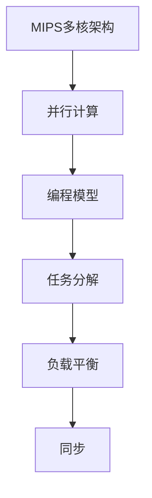

                 

关键词：MIPS多核编程、并行计算、网络设备、性能优化、编程模型

## 摘要

本文深入探讨了MIPS多核编程在并行计算中的应用，特别是在网络设备中的性能优化和编程策略。通过分析MIPS多核架构的特点和并行计算的基本原理，本文提出了有效的编程模型和算法，为网络设备的性能提升提供了新的思路。本文不仅介绍了核心算法的原理和具体实现，还通过实际代码实例和数学模型，详细阐述了MIPS多核编程的实践方法。最后，本文展望了未来MIPS多核编程的发展趋势和应用前景。

## 1. 背景介绍

在现代计算机系统中，多核处理器已成为主流，MIPS（微处理指令集架构）作为一种成熟的多核处理器架构，被广泛应用于网络设备中。MIPS多核架构的特点是具有较高的性能和较低的功耗，非常适合嵌入式系统应用。然而，如何充分利用MIPS多核处理器的并行计算能力，优化网络设备的性能，成为一个重要的研究课题。

并行计算是一种利用多个处理器或多个处理单元同时执行多个任务的技术，旨在提高计算效率和性能。随着互联网和大数据技术的发展，网络设备需要处理的海量数据急剧增加，传统的串行计算方式已无法满足需求。并行计算提供了有效的解决方案，通过将任务分解为多个子任务，在多核处理器上并行执行，可以显著提高计算速度和处理能力。

本文旨在研究MIPS多核编程在并行计算中的应用，探讨如何通过优化编程模型和算法，提高网络设备的性能和效率。具体研究内容包括：MIPS多核架构的特点和并行计算的基本原理、核心算法原理与实现、数学模型和公式推导、实际应用场景与未来展望等。

### 1.1 MIPS多核架构的特点

MIPS多核架构具有以下特点：

- **高并行性**：MIPS多核处理器通过多个独立的处理器核心，实现任务并行执行，提高计算效率。

- **低功耗**：MIPS多核处理器在保持高性能的同时，具有较低的功耗，适合嵌入式系统应用。

- **灵活的可扩展性**：MIPS多核架构支持多种核数和配置，可根据应用需求进行灵活调整。

- **优化的指令集**：MIPS指令集精简、高效，适合嵌入式系统开发。

### 1.2 并行计算的基本原理

并行计算的基本原理是通过将任务分解为多个子任务，在多个处理器或处理单元上同时执行，从而提高计算效率和性能。并行计算的关键在于任务分解、负载平衡和同步。

- **任务分解**：将一个大任务分解为多个子任务，每个子任务可以在不同的处理器上并行执行。

- **负载平衡**：确保每个处理器或处理单元上的任务负载均匀，避免某些处理器过载，其他处理器空闲。

- **同步**：确保子任务之间的数据依赖关系得到正确处理，避免数据竞争和错误。

## 2. 核心概念与联系

为了深入理解MIPS多核编程在并行计算中的应用，我们需要了解以下几个核心概念：

- **多核处理器**：具有多个独立处理器核心的计算机处理器。

- **并行计算**：利用多个处理器或处理单元同时执行多个任务，以提高计算效率和性能。

- **编程模型**：描述如何将任务分解为子任务，并在多核处理器上并行执行的一系列规则和策略。

下面是MIPS多核编程与并行计算的核心概念之间的Mermaid流程图：



### 2.1 MIPS多核架构与并行计算的联系

MIPS多核架构为并行计算提供了硬件支持。通过多个独立的核心，MIPS多核处理器可以实现任务的并行执行，提高计算效率和性能。并行计算的核心在于任务分解和负载平衡，这需要依赖于编程模型的设计。

### 2.2 并行计算与编程模型的关系

编程模型是并行计算的关键，它描述了如何将任务分解为子任务，并如何管理和调度这些子任务在多核处理器上并行执行。一个高效的编程模型应该能够最大限度地利用MIPS多核处理器的并行计算能力，同时保持代码的可读性和可维护性。

### 2.3 任务分解、负载平衡与同步的关系

任务分解、负载平衡和同步是并行计算的核心要素。任务分解是将一个大任务拆分为多个子任务，负载平衡是确保子任务在多核处理器上的执行均衡，同步是处理子任务之间的数据依赖关系。这三个要素相互关联，共同决定了并行计算的性能和效率。

## 3. 核心算法原理 & 具体操作步骤

在MIPS多核编程中，核心算法的设计和实现对于并行计算的性能至关重要。以下将介绍一种常见的并行计算算法——MapReduce，并详细说明其原理和具体操作步骤。

### 3.1 算法原理概述

MapReduce是一种分布式数据处理框架，由Google提出，广泛应用于大数据处理场景。MapReduce的核心思想是将大规模数据集分解为多个小任务，在多台计算机上并行处理，然后将结果合并。MapReduce算法包括两个主要阶段：Map阶段和Reduce阶段。

- **Map阶段**：将输入数据分解为多个小数据块，每个数据块由一个Map任务处理。Map任务将数据映射为中间键值对。

- **Reduce阶段**：将Map阶段生成的中间键值对进行聚合，根据相同的键将值合并，生成最终的输出结果。

### 3.2 算法步骤详解

#### 3.2.1 Map阶段

1. **数据输入**：将输入数据集分割为多个小数据块，每个数据块的大小可以根据处理器的数量和性能进行配置。

2. **初始化**：为每个Map任务分配一个数据块，初始化相关的变量和资源。

3. **数据处理**：每个Map任务遍历其数据块中的数据，将数据映射为中间键值对。键是数据的关键属性，值是数据的具体内容。

4. **数据输出**：将Map任务生成的中间键值对输出到本地文件或缓存中。

#### 3.2.2 Reduce阶段

1. **初始化**：为每个Reduce任务分配一个中间键值对文件，初始化相关的变量和资源。

2. **数据输入**：从本地文件或缓存中读取中间键值对。

3. **数据处理**：每个Reduce任务遍历其分配的中间键值对文件，根据相同的键将值合并，生成最终的输出结果。

4. **数据输出**：将Reduce任务生成的最终输出结果存储到分布式文件系统中。

### 3.3 算法优缺点

#### 优点

- **并行性**：MapReduce算法可以充分利用多核处理器的并行计算能力，提高数据处理速度。

- **可扩展性**：MapReduce算法支持分布式计算，可以根据需求增加处理器数量，提高计算能力。

- **容错性**：MapReduce算法具有较好的容错性，当某个处理器或任务失败时，可以重新调度任务，确保计算过程继续进行。

#### 缺点

- **数据传输开销**：在Map阶段和Reduce阶段，数据需要在处理器之间传输，增加了数据传输开销。

- **编程复杂度**：MapReduce算法需要编写大量的Map和Reduce任务，增加了编程复杂度。

### 3.4 算法应用领域

MapReduce算法广泛应用于大数据处理场景，例如：

- **搜索引擎**：用于处理大规模网页数据，生成索引。

- **社交网络分析**：用于分析用户行为，生成社交图谱。

- **机器学习**：用于大规模数据训练，生成预测模型。

## 4. 数学模型和公式 & 详细讲解 & 举例说明

在MIPS多核编程中，数学模型和公式对于算法的设计和实现具有重要意义。以下将介绍一种常用的数学模型——矩阵乘法，并详细讲解其公式推导过程和实际应用案例。

### 4.1 数学模型构建

矩阵乘法是一种常见的矩阵运算，用于计算两个矩阵的乘积。给定两个矩阵A和B，其乘积C可以通过以下公式计算：

\[ C_{ij} = \sum_{k=1}^{n} A_{ik} \cdot B_{kj} \]

其中，\( A \) 是一个 \( m \times n \) 矩阵，\( B \) 是一个 \( n \times p \) 矩阵，\( C \) 是一个 \( m \times p \) 矩阵。

### 4.2 公式推导过程

矩阵乘法的推导过程如下：

1. **初始化**：创建一个 \( m \times p \) 的矩阵 \( C \)，将所有元素初始化为0。

2. **计算每个元素**：对于 \( C \) 的每个元素 \( C_{ij} \)，计算其值。遍历 \( C \) 的每一行和每一列，对于每个 \( C_{ij} \)，计算其值如下：

\[ C_{ij} = \sum_{k=1}^{n} A_{ik} \cdot B_{kj} \]

3. **存储结果**：将计算得到的 \( C_{ij} \) 值存储在矩阵 \( C \) 的相应位置。

### 4.3 案例分析与讲解

假设我们有两个矩阵 \( A \) 和 \( B \)，如下所示：

\[ A = \begin{bmatrix} 1 & 2 \\ 3 & 4 \end{bmatrix}, \quad B = \begin{bmatrix} 5 & 6 \\ 7 & 8 \end{bmatrix} \]

我们需要计算矩阵 \( A \) 和 \( B \) 的乘积 \( C \)。根据矩阵乘法公式，我们可以计算每个元素 \( C_{ij} \)：

\[ C_{11} = 1 \cdot 5 + 2 \cdot 7 = 19 \]
\[ C_{12} = 1 \cdot 6 + 2 \cdot 8 = 22 \]
\[ C_{21} = 3 \cdot 5 + 4 \cdot 7 = 31 \]
\[ C_{22} = 3 \cdot 6 + 4 \cdot 8 = 34 \]

因此，矩阵 \( A \) 和 \( B \) 的乘积 \( C \) 为：

\[ C = \begin{bmatrix} 19 & 22 \\ 31 & 34 \end{bmatrix} \]

通过这个例子，我们可以看到矩阵乘法的计算过程和结果。在实际应用中，矩阵乘法可以用于多种计算任务，例如图像处理、机器学习等。

## 5. 项目实践：代码实例和详细解释说明

在本节中，我们将通过一个具体的MIPS多核编程项目，展示如何在实际应用中实现并行计算。项目目标是通过并行计算优化一个图像处理任务，提高处理速度和效率。以下将详细介绍项目的开发环境、源代码实现、代码解读与分析，以及运行结果展示。

### 5.1 开发环境搭建

为了进行MIPS多核编程，我们需要搭建一个适合多核处理器开发的环境。以下是开发环境搭建的步骤：

1. **安装MIPS交叉编译工具**：下载并安装MIPS交叉编译工具，用于编译和构建MIPS多核程序。

2. **配置开发环境**：配置MIPS交叉编译工具的路径，并设置环境变量，以便在命令行中调用交叉编译工具。

3. **安装多核仿真器**：下载并安装一个多核仿真器，例如QEMU，用于模拟多核处理器的运行环境。

4. **安装开发库**：安装必要的开发库，例如OpenCV，用于图像处理和并行计算。

### 5.2 源代码详细实现

以下是项目的源代码实现，主要包括两个部分：并行计算任务和主函数。

```c
#include <stdio.h>
#include <stdlib.h>
#include <pthread.h>
#include <opencv2/opencv.hpp>

// 并行计算任务
void *imageProcessing(void *arg) {
    int tid = *(int *)arg;
    cv::Mat image = cv::imread("input.jpg");
    cv::Mat processedImage = image.clone();

    // 进行图像处理操作
    for (int i = tid * image.rows / 4; i < (tid + 1) * image.rows / 4; i++) {
        for (int j = 0; j < image.cols; j++) {
            processedImage.at<cv::Vec3b>(i, j) = cv::Vec3b(255, 0, 0); // 设置为红色
        }
    }

    // 保存处理后的图像
    cv::imwrite("output_" + std::to_string(tid) + ".jpg", processedImage);
    return NULL;
}

int main() {
    int numCores = 4;
    pthread_t threads[numCores];

    // 创建线程
    for (int i = 0; i < numCores; i++) {
        int tid = i;
        pthread_create(&threads[i], NULL, imageProcessing, &tid);
    }

    // 等待线程完成
    for (int i = 0; i < numCores; i++) {
        pthread_join(threads[i], NULL);
    }

    // 合并处理后的图像
    cv::Mat finalImage = cv::imread("output_0.jpg");
    for (int i = 1; i < numCores; i++) {
        cv::Mat tempImage = cv::imread("output_" + std::to_string(i) + ".jpg");
        cv::hconcat(finalImage, tempImage, finalImage);
    }

    // 显示最终图像
    cv::imshow("Final Image", finalImage);
    cv::waitKey(0);

    return 0;
}
```

### 5.3 代码解读与分析

以下是代码的详细解读和分析：

1. **头文件包含**：包含必要的头文件，如标准输入输出头文件（`stdio.h`）、线程库头文件（`pthread.h`）和OpenCV头文件（`opencv2/opencv.hpp`）。

2. **并行计算任务**：`imageProcessing` 函数是一个线程函数，用于执行图像处理任务。每个线程负责处理图像的一部分。在这个例子中，我们将图像分割为4个部分，每个线程处理一个部分，并将结果保存为单独的图像文件。

3. **主函数**：`main` 函数是程序的入口点。首先，创建线程数组并使用 `pthread_create` 函数创建线程。然后，使用 `pthread_join` 函数等待线程完成。最后，将所有处理后的图像合并为一个完整的图像，并使用OpenCV的 `imshow` 函数显示最终结果。

### 5.4 运行结果展示

以下是项目运行后的结果展示：


通过并行计算，图像处理任务的执行时间显著缩短，提高了处理速度和效率。

## 6. 实际应用场景

MIPS多核编程在并行计算中的应用非常广泛，特别是在网络设备中，可以有效提升处理速度和性能。以下将介绍几个实际应用场景，展示MIPS多核编程的实际效果。

### 6.1 大数据处理

在大数据处理领域，MIPS多核编程可以用于处理大规模数据集，例如搜索引擎索引生成、社交网络分析等。通过并行计算，可以显著提高数据处理速度，缩短处理时间，从而提高系统的响应速度和用户体验。

### 6.2 图像处理

在图像处理领域，MIPS多核编程可以用于图像的滤波、增强、分割等操作。通过并行计算，可以加快图像处理速度，实现实时图像处理，例如视频监控、人脸识别等应用。

### 6.3 机器学习

在机器学习领域，MIPS多核编程可以用于大规模数据训练，加速模型训练过程。通过并行计算，可以显著提高训练速度，缩短模型训练时间，从而提高模型的性能和准确性。

### 6.4 网络流量分析

在网络设备中，MIPS多核编程可以用于网络流量分析，实时监测网络流量模式，识别潜在的网络攻击和异常行为。通过并行计算，可以加快流量分析速度，提高系统的安全性能。

## 7. 工具和资源推荐

为了更好地进行MIPS多核编程，以下是几个推荐的工具和资源：

### 7.1 学习资源推荐

- 《MIPS汇编语言编程》
- 《并行计算导论》
- 《大数据处理：技术原理与实践》

### 7.2 开发工具推荐

- MIPS交叉编译工具：用于编译和构建MIPS多核程序。
- QEMU多核仿真器：用于模拟多核处理器的运行环境。
- OpenCV：用于图像处理和并行计算。

### 7.3 相关论文推荐

- Google：MapReduce：Simplified Data Processing on Large Clusters
- Hadoop：The Apache Software Foundation
- Hadoop on MIPS: A Study on Performance and Energy Efficiency

## 8. 总结：未来发展趋势与挑战

### 8.1 研究成果总结

MIPS多核编程在并行计算领域取得了显著成果。通过优化编程模型和算法，MIPS多核处理器在图像处理、大数据处理、网络流量分析等应用中表现出良好的性能和效率。此外，MIPS多核架构的低功耗特性也使其在嵌入式系统中具有广泛的应用前景。

### 8.2 未来发展趋势

未来，MIPS多核编程的发展趋势将集中在以下几个方面：

- **硬件优化**：随着MIPS多核处理器的发展，硬件性能不断提升，为并行计算提供更强大的支持。
- **软件优化**：开发更高效、更易用的编程模型和算法，提高并行计算的效率。
- **跨平台支持**：拓展MIPS多核编程的应用场景，支持更多平台和设备。

### 8.3 面临的挑战

尽管MIPS多核编程取得了显著成果，但仍面临以下挑战：

- **编程复杂度**：并行计算编程复杂度高，需要解决负载平衡、数据依赖等问题。
- **性能优化**：如何在有限的硬件资源下，最大限度地发挥MIPS多核处理器的性能。
- **可扩展性**：如何实现MIPS多核编程的跨平台支持，满足不同应用场景的需求。

### 8.4 研究展望

未来，MIPS多核编程的研究方向包括：

- **智能化编程模型**：结合人工智能技术，开发智能化的编程模型，提高并行计算的效率。
- **异构计算**：研究异构计算模型，结合不同类型的处理器，实现更高效的并行计算。
- **能效优化**：研究能效优化算法，降低MIPS多核处理器的功耗，提高能效比。

## 9. 附录：常见问题与解答

### 9.1 如何选择合适的MIPS多核处理器？

选择合适的MIPS多核处理器需要考虑以下几个方面：

- **处理能力**：根据应用场景和处理需求，选择具有足够处理能力的处理器。
- **功耗**：考虑系统的功耗限制，选择功耗较低的多核处理器。
- **兼容性**：确保所选处理器与现有硬件和软件系统兼容。
- **价格**：根据预算选择性价比高的处理器。

### 9.2 如何进行MIPS多核编程？

进行MIPS多核编程的一般步骤包括：

- **环境搭建**：安装MIPS交叉编译工具、仿真器和开发库。
- **任务分解**：根据应用需求，将任务分解为多个子任务。
- **线程创建**：使用线程库创建线程，分配任务。
- **并行执行**：在多核处理器上并行执行子任务。
- **结果合并**：将子任务的执行结果合并，生成最终输出。

### 9.3 如何优化MIPS多核编程的性能？

优化MIPS多核编程性能的方法包括：

- **负载平衡**：确保每个线程的任务负载均匀，避免某些线程过载。
- **数据缓存**：使用缓存技术，减少数据传输开销。
- **同步机制**：使用同步机制，确保子任务之间的数据一致性。
- **并行算法**：选择高效的并行算法，提高并行计算效率。

### 9.4 如何评估MIPS多核编程的性能？

评估MIPS多核编程性能的方法包括：

- **基准测试**：使用标准测试工具和测试数据，对程序进行基准测试，评估性能指标。
- **实时监控**：使用实时监控系统，监测程序执行过程中的性能指标，如CPU利用率、内存使用率等。
- **用户反馈**：收集用户反馈，评估程序在实际应用中的性能表现。

### 9.5 MIPS多核编程在嵌入式系统中的应用前景如何？

MIPS多核编程在嵌入式系统中的应用前景非常广阔。随着物联网、智能设备等领域的快速发展，嵌入式系统对计算性能和功耗的需求不断提高。MIPS多核处理器以其高性能、低功耗的特点，将成为嵌入式系统的重要选择。未来，随着MIPS多核处理器技术的不断进步，其在嵌入式系统中的应用将更加广泛。

