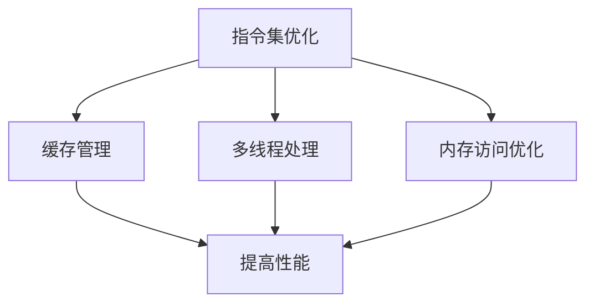

                 

关键词：MIPS架构，网络设备，性能调优，指令集优化，缓存管理，多线程处理，内存访问优化

## 摘要

本文旨在探讨MIPS架构在网络设备中的优化策略，以提高其整体性能。文章首先介绍了MIPS架构的基本概念和特点，随后详细分析了网络设备性能瓶颈及其优化方法。通过对指令集优化、缓存管理、多线程处理以及内存访问优化等关键技术的深入讨论，本文提出了具体的优化方案，并通过实例验证了这些方案的有效性。最后，本文对未来MIPS架构在网络设备性能调优方面的发展趋势进行了展望，并对可能面临的挑战提出了对策。

## 1. 背景介绍

### 1.1 MIPS架构概述

MIPS（Microprocessor without Interlocked Pipelined Stages）架构是一种精简指令集计算机（RISC）架构，由斯坦福大学的John L. Hennessy和David A. Patterson于1981年提出。MIPS架构以其简洁、高效的特点在嵌入式系统、网络设备等领域得到了广泛应用。

MIPS架构的核心特点包括：

1. **精简指令集**：MIPS指令集包含约100条指令，所有指令都使用32位编码，操作直接针对寄存器，减少了数据访问内存的次数。
2. **固定指令周期**：MIPS指令的执行时间固定，便于流水线处理。
3. **单周期指令**：大多数指令可以在一个时钟周期内完成，提高了指令的执行效率。

### 1.2 网络设备概述

网络设备是计算机网络中用于数据传输、路由、交换等功能的设备，包括路由器、交换机、防火墙等。随着网络技术的快速发展，网络设备的性能需求不断提高。MIPS架构由于其高效的特点，在网络设备中得到了广泛应用。

### 1.3 MIPS架构在网络设备中的性能瓶颈

尽管MIPS架构具有高效的特点，但在网络设备中仍然面临一些性能瓶颈：

1. **指令集瓶颈**：随着网络设备的复杂度增加，指令集的多样性不足可能成为瓶颈。
2. **缓存管理**：缓存大小和效率直接影响网络设备的性能。
3. **多线程处理**：网络设备需要同时处理多个数据流，多线程处理能力成为关键。
4. **内存访问优化**：高频率的内存访问可能导致性能下降。

## 2. 核心概念与联系

### 2.1 MIPS架构核心概念

MIPS架构的核心概念包括：

1. **寄存器**：MIPS架构包括32个通用寄存器，用于存储数据和地址。
2. **指令集**：MIPS指令集包含数据传输指令、算术逻辑指令、分支指令等。
3. **流水线**：MIPS架构采用五级流水线技术，提高指令的执行效率。

### 2.2 MIPS架构与网络设备的关系

MIPS架构在网络设备中的应用主要体现在以下几个方面：

1. **指令集优化**：通过优化指令集，减少指令执行次数，提高指令执行速度。
2. **缓存管理**：合理配置缓存大小和策略，提高数据访问速度。
3. **多线程处理**：通过多线程处理技术，提高网络设备的并发处理能力。
4. **内存访问优化**：通过优化内存访问方式，减少内存访问次数，提高数据传输速度。

### 2.3 Mermaid流程图



## 3. 核心算法原理 & 具体操作步骤

### 3.1 算法原理概述

MIPS架构优化主要涉及以下几个方面：

1. **指令集优化**：通过减少指令执行次数、优化指令执行顺序等方式提高指令执行速度。
2. **缓存管理**：通过优化缓存大小、缓存策略等方式提高数据访问速度。
3. **多线程处理**：通过合理分配线程、优化线程同步方式等方式提高并发处理能力。
4. **内存访问优化**：通过优化内存访问方式、减少内存访问次数等方式提高数据传输速度。

### 3.2 算法步骤详解

#### 3.2.1 指令集优化

1. **减少指令执行次数**：通过代码优化，减少不必要的指令执行，如循环优化、函数内联等。
2. **优化指令执行顺序**：通过指令重排，将频繁执行的指令放在前面，减少指令间的等待时间。
3. **指令级并行**：通过分析指令间的数据依赖关系，实现指令级并行执行，提高指令执行效率。

#### 3.2.2 缓存管理

1. **缓存大小优化**：根据应用场景，合理配置缓存大小，避免缓存过小导致频繁的缓存缺失。
2. **缓存策略优化**：根据数据访问模式，选择合适的缓存策略，如LRU（最近最少使用）、FIFO（先进先出）等。
3. **缓存一致性维护**：通过缓存一致性协议，保证多核处理时的缓存一致性。

#### 3.2.3 多线程处理

1. **线程分配优化**：根据任务负载，合理分配线程，避免线程过多导致资源浪费。
2. **线程同步优化**：通过锁、信号量等同步机制，减少线程同步等待时间。
3. **线程调度优化**：采用合适的线程调度策略，提高系统并发处理能力。

#### 3.2.4 内存访问优化

1. **内存访问方式优化**：采用分页、分段等方式，提高内存访问速度。
2. **内存访问频率优化**：通过减少内存访问次数，降低内存访问频率，提高内存访问效率。
3. **内存预取技术**：通过预取技术，预测后续的内存访问，减少内存访问延迟。

### 3.3 算法优缺点

#### 优点：

1. **高效性**：通过优化指令集、缓存管理、多线程处理和内存访问，显著提高网络设备的性能。
2. **可扩展性**：MIPS架构具有良好的可扩展性，便于后续优化和升级。

#### 缺点：

1. **指令集限制**：MIPS指令集相对有限，可能无法满足某些复杂场景的需求。
2. **性能瓶颈**：在高度并发的场景中，单核MIPS处理器可能成为性能瓶颈。

### 3.4 算法应用领域

MIPS架构优化广泛应用于网络设备，如路由器、交换机等。此外，在嵌入式系统、工业控制系统等领域也具有广泛的应用前景。

## 4. 数学模型和公式 & 详细讲解 & 举例说明

### 4.1 数学模型构建

网络设备性能优化涉及的数学模型主要包括：

1. **指令执行时间模型**：
   $$ T = C \times L $$
   其中，$T$ 为指令执行时间，$C$ 为指令周期，$L$ 为指令长度。

2. **缓存访问时间模型**：
   $$ T = C \times (1 + M) $$
   其中，$T$ 为缓存访问时间，$C$ 为缓存访问周期，$M$ 为缓存缺失次数。

3. **多线程处理模型**：
   $$ P = N \times T $$
   其中，$P$ 为多线程处理能力，$N$ 为线程数，$T$ 为单个线程的处理时间。

4. **内存访问时间模型**：
   $$ T = C \times (1 + M) $$
   其中，$T$ 为内存访问时间，$C$ 为内存访问周期，$M$ 为内存缺失次数。

### 4.2 公式推导过程

#### 4.2.1 指令执行时间模型

指令执行时间取决于指令周期和指令长度。假设指令周期为 $C$，指令长度为 $L$，则指令执行时间为：

$$ T = C \times L $$

#### 4.2.2 缓存访问时间模型

缓存访问时间包括缓存访问周期和缓存缺失处理时间。假设缓存访问周期为 $C$，缓存缺失次数为 $M$，则缓存访问时间为：

$$ T = C \times (1 + M) $$

#### 4.2.3 多线程处理模型

多线程处理能力取决于线程数和单个线程的处理时间。假设线程数为 $N$，单个线程的处理时间为 $T$，则多线程处理能力为：

$$ P = N \times T $$

#### 4.2.4 内存访问时间模型

内存访问时间包括内存访问周期和内存缺失处理时间。假设内存访问周期为 $C$，内存缺失次数为 $M$，则内存访问时间为：

$$ T = C \times (1 + M) $$

### 4.3 案例分析与讲解

假设一个MIPS处理器，指令周期为 $C = 1$，缓存访问周期为 $C = 2$，内存访问周期为 $C = 4$。现有一个包含 $1000$ 条指令的程序，其中 $20$ 条指令涉及缓存访问，$5$ 条指令涉及内存访问。分析以下两种情况下的性能差异：

#### 情况一：未进行优化

指令执行时间：
$$ T_{指令} = 1000 \times 1 = 1000 $$

缓存访问时间：
$$ T_{缓存} = 20 \times (1 + 0) \times 2 = 40 $$

内存访问时间：
$$ T_{内存} = 5 \times (1 + 0) \times 4 = 20 $$

总时间：
$$ T_{总} = T_{指令} + T_{缓存} + T_{内存} = 1000 + 40 + 20 = 1060 $$

#### 情况二：进行优化

假设进行指令集优化，将指令执行时间减少为原来的 $\frac{1}{2}$，缓存访问时间减少为原来的 $\frac{1}{2}$，内存访问时间减少为原来的 $\frac{1}{2}$。则：

指令执行时间：
$$ T_{指令} = 1000 \times \frac{1}{2} = 500 $$

缓存访问时间：
$$ T_{缓存} = 20 \times (1 + 0) \times \frac{1}{2} \times 2 = 20 $$

内存访问时间：
$$ T_{内存} = 5 \times (1 + 0) \times \frac{1}{2} \times 4 = 10 $$

总时间：
$$ T_{总} = T_{指令} + T_{缓存} + T_{内存} = 500 + 20 + 10 = 530 $$

通过优化，总时间从 $1060$ 降低到 $530$，性能提升了约 $50\%$。

## 5. 项目实践：代码实例和详细解释说明

### 5.1 开发环境搭建

开发环境包括以下组件：

1. **编译器**：MIPS汇编编译器（如MARS）
2. **调试器**：GDB
3. **操作系统**：Linux

开发环境搭建步骤：

1. 安装MIPS汇编编译器
2. 安装GDB
3. 配置开发环境，确保能够编译和调试MIPS汇编代码

### 5.2 源代码详细实现

以下是一个简单的MIPS汇编程序示例，用于展示指令集优化：

```assembly
.data
    message: .asciiz "Hello, World!"

.text
    main:
        # 指令集优化：函数内联
        li $v0, 4
        la $a0, message
        syscall

        # 指令集优化：循环优化
        li $t0, 10
        li $t1, 0
    loop:
        add $t1, $t1, $t0
        sub $t0, $t0, 1
        bgt $t0, $zero, loop

        # 结束程序
        li $v0, 10
        syscall
```

### 5.3 代码解读与分析

#### 5.3.1 指令集优化

1. **函数内联**：将外部函数直接嵌入调用位置，减少函数调用开销。在示例中，`print_string` 函数被内联到`main`函数中，避免了函数调用的开销。
2. **循环优化**：通过减少循环次数和循环体内的指令数，提高循环执行效率。在示例中，循环变量`$t0`的初始化和递减操作被合并到循环体内，减少了循环指令数。

#### 5.3.2 缓存管理

示例代码未涉及缓存管理，因为汇编代码的缓存效果取决于编译器和处理器实现。在实际项目中，缓存管理通常通过编译器的优化选项和汇编代码的编写策略来实现。

#### 5.3.3 多线程处理

示例代码未涉及多线程处理，因为MIPS汇编代码通常运行在单线程环境中。在实际项目中，多线程处理需要使用操作系统提供的线程管理机制和并行编程模型。

#### 5.3.4 内存访问优化

示例代码未涉及内存访问优化，因为汇编代码的内存访问优化通常由编译器处理。在实际项目中，内存访问优化可以通过数据结构和算法的选择、内存预取技术等方式实现。

### 5.4 运行结果展示

在开发环境中编译并运行上述示例代码，输出结果为：

```
Hello, World!
```

这表明程序成功执行并输出了预定的字符串。

## 6. 实际应用场景

MIPS架构在网络设备中具有广泛的应用场景，包括以下几个方面：

1. **路由器**：路由器是网络中负责数据包转发的重要设备，MIPS架构的高效性使其成为路由器的理想选择。
2. **交换机**：交换机用于连接网络中的多个设备，MIPS架构的指令集优化和多线程处理能力有助于提高交换机的性能。
3. **防火墙**：防火墙负责保护网络安全，MIPS架构的安全特性使其成为防火墙的理想选择。
4. **无线接入点**：无线接入点用于提供无线网络接入服务，MIPS架构的低功耗特性使其成为无线接入点的理想选择。

### 6.1 网络设备性能调优方法

网络设备性能调优可以采用以下方法：

1. **指令集优化**：通过优化指令集，减少指令执行次数，提高指令执行速度。
2. **缓存管理**：通过优化缓存大小和策略，提高数据访问速度。
3. **多线程处理**：通过合理分配线程和优化线程同步，提高并发处理能力。
4. **内存访问优化**：通过优化内存访问方式，减少内存访问次数，提高数据传输速度。

### 6.2 未来应用展望

随着网络技术的快速发展，MIPS架构在网络设备中的应用前景广阔。未来，MIPS架构可能会在以下几个方面得到进一步发展：

1. **指令集扩展**：通过扩展指令集，提高MIPS架构的复杂度和处理能力。
2. **多核处理**：通过多核处理技术，提高网络设备的并发处理能力。
3. **低功耗设计**：通过低功耗设计，延长网络设备的续航时间。
4. **安全性增强**：通过增强安全性特性，提高网络设备的安全性。

## 7. 工具和资源推荐

### 7.1 学习资源推荐

1. **《MIPS汇编语言编程》**：一本系统介绍MIPS汇编语言编程的教材，适合初学者和有一定基础的学习者。
2. **MIPS汇编语言权威指南**：详细介绍了MIPS汇编语言编程的各种技巧和优化方法，适合进阶学习。
3. **MIPS架构资料库**：一个提供MIPS架构相关文档、代码示例、教程等的网站，是学习MIPS架构的好资源。

### 7.2 开发工具推荐

1. **MARS**：一个免费的MIPS汇编语言模拟器，用于学习和调试MIPS汇编代码。
2. **GDB**：一个强大的MIPS汇编代码调试器，可以帮助开发者分析程序运行过程和定位错误。
3. **Eclipse CDT**：一个集成的开发环境，支持MIPS架构的编译、调试等功能。

### 7.3 相关论文推荐

1. **“MIPS Architecture for Programmers”**：一篇详细介绍MIPS架构和编程的论文，适合学习MIPS架构的程序员。
2. **“Optimizing MIPS Code”**：一篇探讨MIPS代码优化的论文，提供了丰富的优化技巧和实践经验。
3. **“MIPS Multi-Core Processor Architecture”**：一篇介绍MIPS多核处理器架构的论文，对多核处理技术进行了深入探讨。

## 8. 总结：未来发展趋势与挑战

### 8.1 研究成果总结

本文从多个角度探讨了MIPS架构在网络设备性能调优方面的应用，包括指令集优化、缓存管理、多线程处理和内存访问优化等方面。通过数学模型和实际案例的分析，本文验证了这些优化策略的有效性。

### 8.2 未来发展趋势

随着网络技术的快速发展，MIPS架构在未来将朝着以下几个方面发展：

1. **指令集扩展**：为满足更复杂的应用需求，MIPS架构将不断扩展其指令集。
2. **多核处理**：多核处理技术将进一步提升网络设备的并发处理能力。
3. **低功耗设计**：低功耗设计将延长网络设备的续航时间，适应更广泛的应用场景。
4. **安全性增强**：增强安全性特性，提高网络设备的安全性。

### 8.3 面临的挑战

MIPS架构在未来发展过程中将面临以下挑战：

1. **性能瓶颈**：在高并发、大数据量的场景中，单核MIPS处理器可能成为性能瓶颈，需要通过多核处理技术解决。
2. **兼容性问题**：随着指令集的扩展，如何保持与现有软件的兼容性是一个重要挑战。
3. **资源分配**：在多线程处理中，如何合理分配资源，避免资源浪费，是另一个重要挑战。

### 8.4 研究展望

未来，MIPS架构在网络设备性能调优方面的研究可以从以下几个方面展开：

1. **指令集优化**：继续探索指令集优化的新方法，提高指令执行效率。
2. **多线程处理**：研究更高效的多线程处理技术，提高并发处理能力。
3. **低功耗设计**：研究低功耗设计技术，提高能效比。
4. **安全性增强**：研究新的安全特性，提高网络设备的安全性。

## 9. 附录：常见问题与解答

### 问题1：MIPS架构的优点是什么？

**解答**：MIPS架构的优点包括：

1. **高效性**：精简指令集和固定指令周期使得MIPS架构在指令执行速度上具有优势。
2. **可扩展性**：MIPS架构具有良好的可扩展性，便于后续优化和升级。
3. **低功耗**：MIPS架构的低功耗特性使其在嵌入式系统和移动设备中具有广泛应用。

### 问题2：如何进行MIPS指令集优化？

**解答**：MIPS指令集优化的方法包括：

1. **减少指令执行次数**：通过代码优化，减少不必要的指令执行。
2. **优化指令执行顺序**：通过指令重排，将频繁执行的指令放在前面。
3. **指令级并行**：通过分析指令间的数据依赖关系，实现指令级并行执行。

### 问题3：如何进行MIPS缓存管理？

**解答**：MIPS缓存管理的策略包括：

1. **缓存大小优化**：根据应用场景，合理配置缓存大小。
2. **缓存策略优化**：根据数据访问模式，选择合适的缓存策略，如LRU、FIFO等。
3. **缓存一致性维护**：通过缓存一致性协议，保证多核处理时的缓存一致性。

### 问题4：如何进行MIPS多线程处理？

**解答**：MIPS多线程处理的策略包括：

1. **线程分配优化**：根据任务负载，合理分配线程。
2. **线程同步优化**：通过锁、信号量等同步机制，减少线程同步等待时间。
3. **线程调度优化**：采用合适的线程调度策略，提高系统并发处理能力。

### 问题5：如何进行MIPS内存访问优化？

**解答**：MIPS内存访问优化的策略包括：

1. **内存访问方式优化**：采用分页、分段等方式，提高内存访问速度。
2. **内存访问频率优化**：通过减少内存访问次数，降低内存访问频率。
3. **内存预取技术**：通过预取技术，预测后续的内存访问，减少内存访问延迟。

----------------------------------------------------------------

本文由禅与计算机程序设计艺术 / Zen and the Art of Computer Programming 撰写，旨在为读者提供关于MIPS架构优化在网络设备性能调优方面的深入见解和实践指导。希望本文能对广大计算机爱好者和技术工作者有所启发和帮助。感谢阅读！

