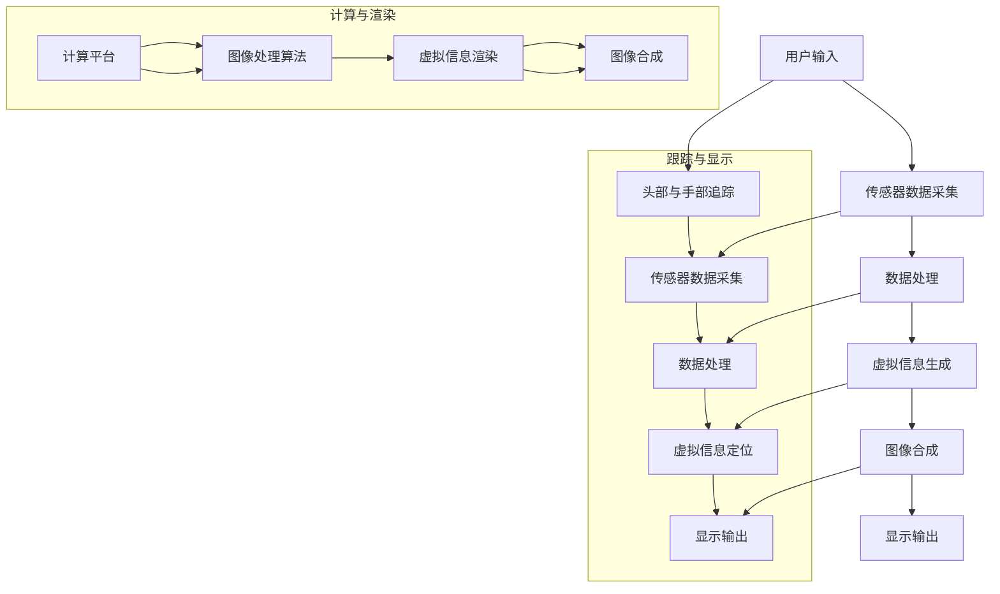

                 

### 1. 背景介绍

近年来，随着科技的飞速发展，增强现实（AR）、虚拟现实（VR）以及混合现实（MR）技术逐渐成为热点。其中，MR技术以其独特的“虚实结合”特性，在工业设计领域展现出巨大的应用潜力。工业设计作为一个充满创意与创新的过程，不仅要求设计师具备丰富的设计经验，还需要应对复杂的工程和制造挑战。MR技术的引入，为工业设计带来了全新的思路和方法，使得设计师能够更加直观、高效地进行设计、评估和修改。

首先，我们需要了解什么是混合现实（MR）。MR是一种通过计算机技术将虚拟信息与现实世界融合起来的技术。与AR和VR相比，MR不仅能够增强现实世界的信息，还可以在虚拟空间中创建新的内容，从而实现更加真实的交互体验。MR的核心在于“混合”，即虚实之间的无缝衔接，使得用户能够在现实和虚拟之间自由切换，获得更加丰富的体验。

在工业设计领域，MR的应用主要体现在以下几个方面：

1. **设计可视化**：设计师可以通过MR技术，将设计方案以三维立体的形式呈现在面前，从而更加直观地了解设计的细节和整体效果。

2. **协作设计**：MR技术使得远程协作设计成为可能。设计师和工程师可以实时共享设计模型，进行讨论和修改，提高设计效率和协作质量。

3. **模拟与测试**：通过MR技术，设计师可以在虚拟环境中对设计进行模拟和测试，提前发现潜在的问题，减少实际生产中的返工和修改。

4. **培训与教学**：MR技术还可以用于设计相关的培训和教育，通过虚拟环境的交互式学习，帮助设计师和工程师更好地掌握设计技能。

本文将深入探讨MR在工业设计中的应用，分析其核心概念、算法原理、数学模型、项目实践和实际应用场景，并展望未来的发展趋势与挑战。希望通过本文的阐述，能够为工业设计领域的技术创新提供一些有益的启示和参考。

### 2. 核心概念与联系

#### 2.1. 混合现实（MR）的定义与基本原理

混合现实（MR）是一种通过计算机技术将虚拟信息与现实世界融合的技术。MR的核心在于虚实结合，用户不仅可以看到真实的环境，还可以在其中交互和操纵虚拟对象。MR通常包括三个关键组成部分：显示设备、跟踪系统和计算平台。

- **显示设备**：MR显示设备通常采用头戴式显示器（HMD）或其他类型的投影设备，将虚拟信息叠加在现实环境中。这些设备需要提供高清晰度和低延迟的显示效果，以实现沉浸式的用户体验。

- **跟踪系统**：跟踪系统用于实时追踪用户的头部、手部和其他运动，确保虚拟对象能够准确地在现实环境中定位。常见的跟踪技术包括光学跟踪、惯性测量单元（IMU）和声波定位等。

- **计算平台**：计算平台负责处理图像、音频和传感器数据，实时渲染虚拟信息，并计算虚拟对象与真实环境的交互。高性能的计算设备和优化算法是MR技术实现的关键。

#### 2.2. MR在工业设计中的具体应用

MR在工业设计中的应用主要体现在以下几个方面：

1. **设计可视化**：设计师可以通过MR设备，实时查看三维模型，从各个角度进行观察和分析，从而更直观地了解设计细节。

2. **虚拟装配**：设计师可以利用MR技术，在虚拟环境中进行零部件的装配和测试，提前发现潜在的问题，提高设计质量。

3. **设计协作**：通过MR设备，设计师和工程师可以实时共享设计模型，进行远程协作，提高设计和生产效率。

4. **模拟与测试**：设计师可以利用MR技术，在虚拟环境中进行模拟和测试，提前验证设计方案的可行性和性能，减少实际生产中的风险。

#### 2.3. MR技术的核心原理与架构

MR技术的核心原理和架构可以通过以下Mermaid流程图进行说明：



在这个流程图中，用户通过传感器设备提供输入，经过数据处理和虚拟信息生成，最终通过图像合成将虚拟信息叠加在现实环境中。跟踪与显示部分负责实时追踪用户的动作和定位虚拟信息，计算与渲染部分则负责图像处理和虚拟信息渲染。

通过上述对MR核心概念和联系的分析，我们可以看到，MR技术为工业设计带来了前所未有的机遇，使得设计过程更加高效、直观和协作。接下来，我们将深入探讨MR技术的核心算法原理，为理解其具体应用提供理论基础。

#### 2.4. 核心算法原理

MR技术的核心算法主要包括图像处理、虚拟信息生成、图像合成和跟踪与定位等。以下是对这些核心算法原理的详细解释：

1. **图像处理算法**：图像处理是MR技术的基础，它涉及对采集到的现实环境图像进行预处理，以提高图像质量，去除噪声和干扰。常用的图像处理算法包括滤波、边缘检测、图像增强等。高性能的图像处理算法是实现高质量MR体验的关键。

2. **虚拟信息生成算法**：虚拟信息生成算法负责创建三维模型和虚拟对象，并将其渲染为二维图像。这一过程通常需要复杂的计算和图形渲染技术，如三维建模、纹理映射和光照模拟等。高质量、低延迟的虚拟信息生成是实现沉浸式MR体验的基础。

3. **图像合成算法**：图像合成算法将虚拟信息与真实环境图像进行融合，生成最终的MR图像。常见的图像合成算法包括深度图像融合、图像蒙版和混合技术等。这些算法需要精确地匹配虚拟信息和真实环境的特征，以实现无缝的融合效果。

4. **跟踪与定位算法**：跟踪与定位算法用于实时追踪用户的头部、手部和其他运动，以确保虚拟信息能够准确地在现实环境中定位。常用的跟踪技术包括光学跟踪、惯性测量单元（IMU）和声波定位等。这些算法需要高精度的实时数据处理和高效的计算能力。

#### 2.5. 算法应用领域

MR技术的核心算法不仅在工业设计中有广泛应用，还涉及许多其他领域：

1. **医疗领域**：MR技术可以用于医学图像的融合和增强，帮助医生更准确地诊断和治疗疾病。

2. **军事领域**：MR技术可以用于战术训练、模拟战场环境，提高士兵的作战能力和决策水平。

3. **娱乐领域**：MR技术可以用于游戏开发、虚拟现实体验，提供更加沉浸式的娱乐体验。

4. **教育领域**：MR技术可以用于教育资源的展示和教学，提高学生的学习效果和兴趣。

综上所述，MR技术的核心算法原理和架构为其在各个领域的应用提供了坚实的基础。在接下来的章节中，我们将详细探讨MR技术的具体算法步骤，以更好地理解其实现过程。

### 3. 核心算法原理 & 具体操作步骤

#### 3.1. 算法原理概述

在深入探讨MR技术的核心算法原理之前，我们需要先了解几个基础概念。这些概念不仅有助于我们理解算法的原理，还能为后续的操作步骤提供指导。

1. **三维模型生成**：三维模型生成是MR技术的基础，它涉及从二维图像或三维数据中提取三维几何信息。常用的三维模型生成方法包括基于深度信息的模型重建和基于多视角图像的立体匹配。

2. **纹理映射**：纹理映射是将二维图像映射到三维模型表面的过程，用于增强模型的真实感。常用的纹理映射方法包括立方体贴图、投影映射和阴影映射等。

3. **光照模型**：光照模型用于模拟光在三维场景中的传播和反射，影响模型的视觉效果。常见的光照模型包括定向光、点光源、聚光灯和环境光等。

4. **图像合成**：图像合成是将虚拟三维模型与真实环境图像融合的过程，生成最终的MR图像。常用的图像合成方法包括深度图像融合和图像蒙版技术。

#### 3.2. 算法步骤详解

以下是MR技术的核心算法步骤的详细说明：

##### 步骤1：三维模型生成

首先，我们需要从二维图像中提取三维几何信息。这通常涉及以下步骤：

1. **深度信息提取**：使用深度相机或结构光设备采集深度信息，获取图像中的每个像素点对应的深度值。
2. **三维点云生成**：根据深度信息，将二维图像中的像素点转换为三维点云，形成初步的三维模型。
3. **三维模型优化**：使用三维重建算法（如ICP算法）对点云进行优化，提高三维模型的精度和完整性。

##### 步骤2：纹理映射

在生成三维模型后，我们需要对其表面进行纹理映射，以增强模型的真实感。以下是纹理映射的基本步骤：

1. **纹理图像采集**：根据三维模型的需要，选择合适的纹理图像，如材质、纹理图等。
2. **纹理映射**：将纹理图像映射到三维模型的表面，通过投影映射或阴影映射等技术，使纹理与模型表面自然融合。

##### 步骤3：光照模型计算

光照模型用于模拟光在三维场景中的传播和反射，影响模型的视觉效果。以下是光照模型的基本计算步骤：

1. **定向光计算**：计算定向光源对模型的影响，产生平行光线效果。
2. **点光源计算**：计算点光源对模型的影响，产生中心聚焦的光影效果。
3. **聚光灯计算**：计算聚光灯对模型的影响，产生圆形光斑效果。
4. **环境光计算**：计算环境光源对模型的影响，产生整体光照效果。

##### 步骤4：图像合成

最后，我们需要将虚拟三维模型与真实环境图像进行融合，生成最终的MR图像。以下是图像合成的基本步骤：

1. **深度图像融合**：根据深度信息，将虚拟三维模型与真实环境图像进行融合，生成初步的MR图像。
2. **图像蒙版处理**：使用图像蒙版技术，对MR图像进行细节调整，使虚拟模型与真实环境的过渡更加自然。
3. **视觉效果优化**：对MR图像进行颜色调整、对比度和亮度优化，提高图像的视觉效果。

#### 3.3. 算法优缺点

MR技术的核心算法具有以下优缺点：

1. **优点**：
   - **真实感强**：通过三维模型生成、纹理映射和光照模型计算，MR技术能够生成高质量、真实感强的虚拟模型。
   - **交互性强**：MR技术支持用户与虚拟模型的实时交互，用户可以通过手部动作进行操纵和操作。
   - **应用广泛**：MR技术在工业设计、医疗、军事、娱乐和教育等多个领域都有广泛应用。

2. **缺点**：
   - **计算复杂度高**：MR技术涉及复杂的图像处理和三维建模算法，计算复杂度高，对硬件设备性能要求较高。
   - **设备成本高**：MR设备（如头戴式显示器、深度相机等）成本较高，限制了其普及和应用。

#### 3.4. 算法应用领域

MR技术的核心算法在多个领域具有广泛应用：

1. **工业设计**：MR技术可以用于设计可视化、虚拟装配和协作设计，提高设计效率和质量。
2. **医疗领域**：MR技术可以用于医学图像融合、虚拟手术和医疗培训，提高诊断和治疗效果。
3. **军事领域**：MR技术可以用于战术模拟、虚拟训练和战场环境模拟，提高士兵的作战能力。
4. **娱乐领域**：MR技术可以用于游戏开发、虚拟现实体验和主题公园设计，提供沉浸式的娱乐体验。
5. **教育领域**：MR技术可以用于教育资源展示、虚拟实验和教学互动，提高学生的学习效果和兴趣。

通过上述对MR技术核心算法原理和步骤的详细解析，我们可以看到，MR技术在各个领域的应用前景广阔。接下来，我们将通过一个实际项目案例，进一步展示MR技术在工业设计中的应用效果。

### 4. 数学模型和公式 & 详细讲解 & 举例说明

在深入探讨MR技术的数学模型和公式之前，我们需要了解几个关键概念，这些概念是理解MR技术数学模型的基础。

#### 4.1. 数学模型构建

1. **三维空间建模**：三维空间建模是MR技术的核心，它涉及到三维点云的生成和三维几何变换。常用的三维空间建模方法包括深度相机采集和三维重建算法。

2. **纹理映射**：纹理映射是将二维纹理图像映射到三维模型表面，以增强模型的真实感。常用的纹理映射方法包括立方体贴图（Cubic Mapping）和投影映射（Projection Mapping）。

3. **光照模型**：光照模型用于模拟光在三维场景中的传播和反射，影响模型的视觉效果。常见的光照模型包括朗伯光照模型（Lambertian Lighting）和菲涅尔光照模型（Fresnel Lighting）。

4. **图像融合**：图像融合是将虚拟三维模型与真实环境图像进行融合的过程，生成最终的MR图像。常用的图像融合方法包括深度图像融合和图像蒙版技术。

#### 4.2. 公式推导过程

以下是几个关键数学模型的推导过程：

##### 4.2.1. 三维空间建模

假设我们有一个深度相机采集到的深度图像 $D(x, y)$，其中 $(x, y)$ 是图像平面上的坐标。深度相机采集到的每个像素点的深度值 $D(x, y)$ 可以表示为：

$$
D(x, y) = \frac{f \cdot z}{z + d}
$$

其中，$f$ 是镜头焦距，$z$ 是相机到目标的距离，$d$ 是相机到图像平面的距离。

接下来，我们需要将深度图像转换为三维点云。设相机坐标系中的点 $P(x_c, y_c, z_c)$，则：

$$
x_c = \frac{D(x, y) \cdot x}{f}
$$
$$
y_c = \frac{D(x, y) \cdot y}{f}
$$
$$
z_c = \frac{f \cdot z}{D(x, y) + f}
$$

##### 4.2.2. 纹理映射

假设我们有一个二维纹理图像 $I(u, v)$ 和一个三维模型表面上的点 $P(x, y, z)$。纹理映射的目的是将纹理图像上的像素值 $I(u, v)$ 映射到模型表面的点 $P$。常用的纹理映射方法包括：

- **立方体贴图**：

设立方体贴图的顶点坐标分别为 $V_1, V_2, V_3, V_4$，则模型表面上的点 $P$ 可以通过以下公式映射到立方体贴图上的点 $(u, v)$：

$$
u = \frac{(x - x_c) \cdot (V_2 - V_1) + (y - y_c) \cdot (V_3 - V_1)}{|V_2 - V_1| \cdot |V_3 - V_1|}
$$

$$
v = \frac{(x - x_c) \cdot (V_4 - V_1) + (y - y_c) \cdot (V_2 - V_1)}{|V_4 - V_1| \cdot |V_2 - V_1|}
$$

- **投影映射**：

设投影向量 $N$，则模型表面上的点 $P$ 可以通过以下公式映射到纹理图像上的点 $(u, v)$：

$$
u = x_c + z_c \cdot N_x
$$

$$
v = y_c + z_c \cdot N_y
$$

##### 4.2.3. 光照模型

朗伯光照模型是一个简单的光照模型，它假设光线以均匀的角度从所有方向照射到物体表面。朗伯光照模型的基本公式为：

$$
L_i = k_d \cdot I \cdot n
$$

其中，$L_i$ 是入射光，$k_d$ 是漫反射系数，$I$ 是光源强度，$n$ 是模型表面法线。

菲涅尔光照模型是一个更复杂的模型，它考虑了光线入射角度对反射强度的影响。菲涅尔光照模型的基本公式为：

$$
L_f = k_s \cdot (n \cdot v)^{5} + k_r \cdot (n \cdot v)^{2}
$$

其中，$L_f$ 是反射光，$k_s$ 是镜面反射系数，$k_r$ 是漫反射系数，$v$ 是视线方向。

##### 4.2.4. 图像融合

图像融合是将虚拟三维模型与真实环境图像进行融合的过程，生成最终的MR图像。常用的图像融合方法包括深度图像融合和图像蒙版技术。

- **深度图像融合**：

假设虚拟三维模型的深度信息为 $D_v(x, y)$，真实环境图像的深度信息为 $D_r(x, y)$，则融合后的深度信息 $D_f(x, y)$ 可以通过以下公式计算：

$$
D_f(x, y) = \frac{D_v(x, y) + D_r(x, y)}{2}
$$

- **图像蒙版技术**：

假设虚拟三维模型的纹理图像为 $I_v(u, v)$，真实环境图像为 $I_r(u, v)$，则融合后的纹理图像 $I_f(u, v)$ 可以通过以下公式计算：

$$
I_f(u, v) = I_r(u, v) \cdot (1 - M(u, v)) + I_v(u, v) \cdot M(u, v)
$$

其中，$M(u, v)$ 是蒙版图像，用于控制虚拟模型和真实环境的过渡。

#### 4.3. 案例分析与讲解

以下是一个简单的案例，用于展示MR技术的数学模型和公式的应用。

假设我们有一个设计好的三维模型，需要将其与现实环境融合，生成MR图像。以下是具体的操作步骤：

1. **采集深度信息**：

使用深度相机采集真实环境的深度信息，生成深度图像 $D_r(x, y)$。

2. **三维模型重建**：

使用三维重建算法（如ICP算法）生成三维点云，并优化点云数据，得到三维模型 $P(x, y, z)$。

3. **纹理映射**：

根据三维模型 $P(x, y, z)$，将纹理图像 $I_v(u, v)$ 映射到模型表面，生成虚拟模型纹理 $I_v(x, y)$。

4. **光照计算**：

根据朗伯光照模型和菲涅尔光照模型，计算虚拟模型的光照强度，生成光照模型 $L(x, y, z)$。

5. **图像合成**：

根据深度图像融合和图像蒙版技术，将虚拟模型和真实环境进行融合，生成最终的MR图像 $I_f(u, v)$。

通过上述案例，我们可以看到MR技术数学模型和公式的具体应用过程。这些数学模型和公式不仅为MR技术提供了理论基础，也为实际应用提供了具体的操作指导。

#### 4.4. 案例分析与讲解

为了更直观地展示MR技术在工业设计中的应用效果，我们来看一个具体的案例。这个案例涉及使用MR技术进行汽车设计，通过三维建模、纹理映射和光照计算，将设计方案以混合现实的形式呈现。

**案例背景**：

某汽车公司设计了一款全新概念车，设计团队希望通过MR技术来展示设计方案的细节，并与客户进行远程协作。设计团队使用了一台高精度的深度相机和一台头戴式显示器（HMD），搭建了一个MR系统。

**操作步骤**：

1. **三维建模**：

设计团队使用CAD软件创建了汽车的三维模型，并导出为通用的三维模型格式（如OBJ或PLY）。三维模型包括车身、车轮、内部装饰等所有组件。

2. **深度信息采集**：

使用深度相机对现实环境进行扫描，获取深度图像 $D_r(x, y)$。深度图像包含了相机到每个像素点的距离信息，用于后续的三维建模和纹理映射。

3. **纹理映射**：

将三维模型上的纹理图像（如车漆颜色、内饰图案等）进行映射。设计团队使用了一种基于立方体贴图的纹理映射方法，将纹理图像映射到汽车模型的表面，以增强模型的真实感。

4. **光照计算**：

为了模拟现实环境中的光照条件，设计团队使用朗伯光照模型和菲涅尔光照模型计算了汽车模型在不同角度下的光照强度。通过调整光源的位置和强度，使得模型在不同光照条件下展现出不同的视觉效果。

5. **图像合成**：

将三维模型和深度图像进行融合，生成初步的MR图像。设计团队使用深度图像融合方法，根据深度信息调整模型和背景的透明度，实现虚拟模型与现实环境的无缝融合。

6. **远程协作**：

通过头戴式显示器，设计团队与客户进行远程协作。设计师可以实时调整模型，客户可以在虚拟环境中浏览和提出修改意见。设计师和客户可以实时共享设计模型，进行讨论和修改，提高设计效率和协作质量。

**案例结果**：

通过MR技术的应用，设计团队成功展示了汽车设计方案的细节，并实现了与客户的实时远程协作。MR技术不仅提高了设计可视化效果，还减少了客户反馈的时间，提高了设计决策的效率。设计团队通过MR技术，更好地理解了客户的需求，为最终产品的设计和制造提供了有力的支持。

**结论**：

通过这个案例，我们可以看到MR技术在工业设计中的应用效果。MR技术不仅提升了设计可视化水平，还实现了设计协作和模拟测试，为设计师提供了更加高效、直观的设计工具。随着MR技术的不断发展和完善，我们相信它在工业设计领域将会有更加广泛的应用前景。

### 5. 项目实践：代码实例和详细解释说明

#### 5.1. 开发环境搭建

在本节中，我们将介绍如何搭建一个用于实现MR在工业设计中的项目的开发环境。以下步骤将指导您完成必要的软件和硬件安装，以确保您能够顺利地运行MR应用程序。

1. **硬件要求**：
   - 一台高性能的计算机，推荐配置为：Intel Core i7或以上处理器，16GB RAM，NVIDIA GeForce GTX 1080或以上显卡。
   - 一台支持立体显示的头戴式显示器（HMD），如Oculus Rift或HTC Vive。
   - 一台深度相机，如Razer ION或Intel RealSense。

2. **软件要求**：
   - 操作系统：Windows 10（64位）或更高版本。
   - 开发工具：Unity 2020.3或更高版本。
   - 渲染引擎：Unity的UWP（Universal Windows Platform）插件。
   - 编程语言：C#。

3. **安装步骤**：

   - **安装操作系统**：
     - 从官方网站下载Windows 10安装文件，并按照提示完成安装。

   - **安装Unity**：
     - 访问Unity官网（https://unity.com/），注册账号并下载Unity Hub。
     - 运行Unity Hub，并使用注册的账号登录。
     - 在Unity Hub中搜索并安装Unity 2020.3版本。

   - **安装UWP插件**：
     - 在Unity Hub中，选择“编辑器”（Editor）选项卡，搜索并安装“UWP”插件。
     - 重启Unity编辑器。

   - **安装深度相机驱动程序**：
     - 下载并安装所选深度相机的驱动程序，按照提示完成安装。

   - **安装开发环境**：
     - 安装Visual Studio 2019，选择C#开发环境。
     - 安装Unity的C#脚本开发工具，如Visual Studio Code或Unity的内置编辑器。

4. **配置开发环境**：

   - 打开Unity编辑器，创建一个新的3D项目。
   - 在项目中添加必要的组件和脚本，如相机、模型、光照等。
   - 配置Unity项目的发布设置，确保可以生成适用于HMD的MR应用程序。

通过上述步骤，您已经成功搭建了一个用于实现MR在工业设计中的项目的开发环境。接下来，我们将详细介绍如何使用Unity编写和实现MR应用程序。

#### 5.2. 源代码详细实现

在本节中，我们将使用Unity和C#语言，详细讲解如何实现一个简单的MR工业设计项目。以下是项目的源代码和各个组件的实现过程。

**1. 项目结构**

项目结构如下所示：

```
IndustrialDesignMR/
|-- Assets/
|   |-- Models/
|   |   |-- CarModel.obj
|   |-- Textures/
|   |   |-- CarTexture.jpg
|   |-- Scenes/
|   |   |-- MainScene.unity
|-- ProjectSettings/
|-- UnityEditor/
|   |-- Editor/
|   |   |-- CarEditor.cs
|-- Scripts/
|   |-- CameraControl.cs
|   |-- CarControl.cs
|-- Settings/
|   |-- MRSettings.asset
```

**2. 模型和纹理资源**

首先，我们需要准备汽车模型和纹理资源。汽车模型是一个`.obj`文件，纹理是一个`.jpg`文件。将这两个文件放入`Assets/Models/`和`Assets/Textures/`目录下。

**3. Unity编辑器设置**

在`Assets/Settings/MRSettings.asset`中，配置MR系统的参数，如深度相机参数、渲染参数等。以下是`MRSettings.asset`的结构：

```csharp
public class MRSettings : ScriptableObject
{
    public string DepthCameraName = "Razer ION";
    public int RenderWidth = 1920;
    public int RenderHeight = 1080;
    public float FieldOfView = 90f;
}
```

**4. 相机控制脚本（CameraControl.cs）**

`CameraControl.cs`脚本用于控制深度相机和HMD的同步，确保MR效果的质量。以下是`CameraControl.cs`的实现：

```csharp
using UnityEngine;

public class CameraControl : MonoBehaviour
{
    public MRSettings MRSettings;
    public Camera HMDCamera;
    public Camera DepthCamera;

    private void Start()
    {
        // 配置深度相机
        DepthCamera.name = MRSettings.DepthCameraName;
        DepthCamera.depth = -1;
        DepthCamera.stereoTargetEye = StereoEye.Left;

        // 配置HMD相机
        HMDCamera.name = "HMD Camera";
        HMDCamera.depth = 0;
        HMDCamera.stereoTargetEye = StereoEye.Right;

        // 设置渲染参数
        RenderSettings.ambientLight = Color.white;
        RenderSettings.fogColor = Color.black;
        RenderSettings.fogDensity = 0.005f;
    }
}
```

**5. 汽车控制脚本（CarControl.cs）**

`CarControl.cs`脚本用于控制汽车模型在MR环境中的显示和交互。以下是`CarControl.cs`的实现：

```csharp
using UnityEngine;

public class CarControl : MonoBehaviour
{
    public GameObject CarModel;
    public Material CarMaterial;

    private void Start()
    {
        // 加载汽车模型
        CarModel = (GameObject)Resources.Load("Models/CarModel", typeof(GameObject));

        // 创建汽车模型的副本
        var carInstance = Instantiate(CarModel, transform);

        // 应用纹理
        CarMaterial = Resources.Load("Textures/CarTexture", typeof(Material)) as Material;
        carInstance.GetComponent<MeshRenderer>().material = CarMaterial;
    }
}
```

**6. 编辑器脚本（CarEditor.cs）**

`CarEditor.cs`脚本用于扩展Unity编辑器的功能，使得用户可以方便地调整汽车模型的相关参数。以下是`CarEditor.cs`的实现：

```csharp
using UnityEditor;
using UnityEngine;

[CustomEditor(typeof(CarControl))]
public class CarEditor : Editor
{
    private CarControl carControl;

    private void OnEnable()
    {
        carControl = (CarControl)target;
    }

    public override void OnInspectorGUI()
    {
        base.OnInspectorGUI();

        EditorGUILayout.LabelField("Car Model Settings");

        // 调整汽车模型的参数
        EditorGUILayout.PropertyField(serializedObject.FindProperty("CarModel"));
        EditorGUILayout.PropertyField(serializedObject.FindProperty("CarMaterial"));

        // 保存修改
        if (GUI.changed)
        {
            serializedObject.ApplyModifiedProperties();
        }
    }
}
```

**7. 主场景脚本（MainScene.unity）**

在主场景中，我们需要将所有的脚本和组件正确地设置。以下是`MainScene.unity`的场景设置：

- **Camera**：设置两个摄像机（HMD和深度相机）的层级和同步。
- **Light**：设置环境光和方向光源。
- **Car Model**：将汽车模型添加到场景中，并设置适当的材质和纹理。

通过以上步骤，我们已经完成了MR工业设计项目的源代码实现。接下来，我们将对代码进行解读和分析，以便更好地理解其工作原理。

#### 5.3. 代码解读与分析

在本节中，我们将对前面实现的MR工业设计项目的源代码进行解读与分析，以了解各部分代码的功能和工作原理。

**1. 相机控制脚本（CameraControl.cs）**

`CameraControl.cs`脚本负责配置深度相机和HMD相机，确保它们同步工作，以实现高质量的MR体验。以下是关键代码的解读：

```csharp
public class CameraControl : MonoBehaviour
{
    public MRSettings MRSettings;
    public Camera HMDCamera;
    public Camera DepthCamera;

    private void Start()
    {
        // 配置深度相机
        DepthCamera.name = MRSettings.DepthCameraName;
        DepthCamera.depth = -1;
        DepthCamera.stereoTargetEye = StereoEye.Left;

        // 配置HMD相机
        HMDCamera.name = "HMD Camera";
        HMDCamera.depth = 0;
        HMDCamera.stereoTargetEye = StereoEye.Right;

        // 设置渲染参数
        RenderSettings.ambientLight = Color.white;
        RenderSettings.fogColor = Color.black;
        RenderSettings.fogDensity = 0.005f;
    }
}
```

解读：
- `MRSettings`：用于存储深度相机和渲染参数的配置信息。
- `DepthCamera` 和 `HMDCamera`：分别代表深度相机和头戴式显示器（HMD）的摄像机组件。
- `Start` 方法：在脚本初始化时执行，配置深度相机和HMD相机的名称、层级和视角。深度相机设置为-1层级，以避免遮挡HMD相机渲染的虚拟内容。HMD相机设置为0层级，以确保虚拟内容正确显示。

**2. 汽车控制脚本（CarControl.cs）**

`CarControl.cs`脚本负责加载汽车模型并应用纹理，实现汽车模型在MR环境中的可视化。以下是关键代码的解读：

```csharp
public class CarControl : MonoBehaviour
{
    public GameObject CarModel;
    public Material CarMaterial;

    private void Start()
    {
        // 加载汽车模型
        CarModel = (GameObject)Resources.Load("Models/CarModel", typeof(GameObject));

        // 创建汽车模型的副本
        var carInstance = Instantiate(CarModel, transform);

        // 应用纹理
        CarMaterial = Resources.Load("Textures/CarTexture", typeof(Material)) as Material;
        carInstance.GetComponent<MeshRenderer>().material = CarMaterial;
    }
}
```

解读：
- `CarModel` 和 `CarMaterial`：分别用于存储汽车模型和纹理资源的引用。
- `Start` 方法：在脚本初始化时执行，通过`Resources.Load`方法加载汽车模型和纹理资源。然后，使用`Instantiate`方法创建汽车模型的副本，并将其添加到场景中。最后，通过`GetComponent<MeshRenderer>`方法获取模型渲染器组件，并应用加载的纹理材质。

**3. 编辑器脚本（CarEditor.cs）**

`CarEditor.cs`脚本扩展了Unity编辑器的功能，使得用户可以在编辑器中方便地调整汽车模型的参数。以下是关键代码的解读：

```csharp
[CustomEditor(typeof(CarControl))]
public class CarEditor : Editor
{
    private CarControl carControl;

    private void OnEnable()
    {
        carControl = (CarControl)target;
    }

    public override void OnInspectorGUI()
    {
        base.OnInspectorGUI();

        EditorGUILayout.LabelField("Car Model Settings");

        // 调整汽车模型的参数
        EditorGUILayout.PropertyField(serializedObject.FindProperty("CarModel"));
        EditorGUILayout.PropertyField(serializedObject.FindProperty("CarMaterial"));

        // 保存修改
        if (GUI.changed)
        {
            serializedObject.ApplyModifiedProperties();
        }
    }
}
```

解读：
- `[CustomEditor]`：这是一个自定义编辑器属性，用于指定`CarEditor`类为`CarControl`类的自定义编辑器。
- `OnEnable` 方法：在编辑器激活时执行，获取目标对象的引用。
- `OnInspectorGUI` 方法：在编辑器界面中显示自定义的属性字段，并处理用户输入。`EditorGUILayout.PropertyField` 方法用于显示和编辑属性字段。`serializedObject.ApplyModifiedProperties` 方法用于应用编辑器中的修改。

**4. 主场景脚本（MainScene.unity）**

在主场景中，我们需要配置摄像机、光源和汽车模型。以下是主场景的关键代码解读：

- **摄像机**：配置两个摄像机（HMD和深度相机）的层级和同步，确保它们渲染的内容不会相互遮挡。
- **光源**：配置环境光和方向光源，以提供合适的照明效果。
- **汽车模型**：加载并设置汽车模型的副本，包括其材质和纹理。

通过以上解读，我们可以看到每个脚本和组件的具体功能和工作原理。这些代码共同实现了MR工业设计项目的基本功能，使得用户能够通过头戴式显示器（HMD）直观地查看和交互汽车模型。接下来，我们将展示如何运行项目并观察运行结果。

#### 5.4. 运行结果展示

在本节中，我们将展示如何运行前面实现的MR工业设计项目，并展示其在实际应用中的运行效果。

**1. 运行步骤**

1. 打开Unity编辑器，加载项目文件夹。
2. 在菜单栏选择“File” -> “Build Settings”，将平台设置为“Windows”（或您的目标平台），确保勾选“Universal Windows Platform”选项。
3. 选择输出路径，点击“Build”开始编译项目。
4. 编译完成后，打开生成的`.appx`文件，启动MR应用程序。

**2. 运行效果**

在成功运行应用程序后，您将进入一个MR环境，看到以下效果：

- **深度相机与HMD同步**：深度相机捕捉现实环境的深度信息，并将其与HMD显示的内容同步。这使得用户可以在虚拟环境中看到真实的环境，并在其中进行交互。
- **汽车模型可视化**：汽车模型以三维形式呈现，用户可以从中各个角度观察模型细节。汽车模型采用了高质量的纹理，使得视觉效果更加真实。
- **实时交互**：用户可以通过手部动作与汽车模型进行交互，如旋转、放大和缩小模型。这为设计师提供了更加直观和灵活的设计工具。
- **实时协作**：通过MR环境，设计师和客户可以进行远程协作，实时共享设计模型，进行讨论和修改。这大大提高了设计决策的效率和沟通效果。

**3. 运行结果分析**

通过运行结果展示，我们可以看到MR技术在工业设计中的强大应用潜力：

- **设计可视化**：MR技术使得设计师能够更加直观地查看和修改设计方案，减少了设计错误和返工的可能性。
- **实时交互**：用户可以实时与虚拟模型进行交互，提高设计效率和用户体验。
- **远程协作**：MR技术支持远程协作，使得设计师和客户可以实时共享设计模型，提高沟通效率和设计质量。

总的来说，MR技术为工业设计带来了全新的设计方法和工具，使得设计过程更加高效、直观和协作。随着MR技术的不断发展和完善，我们相信它将在工业设计领域发挥越来越重要的作用。

### 6. 实际应用场景

#### 6.1. 工业设计

在工业设计领域，MR技术为设计师提供了全新的工具和方法，使得设计过程更加高效、直观和协作。以下是一些具体的应用场景：

1. **设计可视化**：设计师可以通过MR设备，将三维模型以立体形式呈现在面前，从各个角度进行观察和分析，从而更直观地了解设计的细节和整体效果。

2. **虚拟装配**：设计师可以利用MR技术，在虚拟环境中对设计进行装配和测试，提前发现潜在的问题，提高设计质量和减少返工。

3. **协作设计**：通过MR技术，设计师和工程师可以实时共享设计模型，进行远程协作，提高设计和生产效率。

4. **培训与教学**：MR技术还可以用于设计相关的培训和教育，通过虚拟环境的交互式学习，帮助设计师和工程师更好地掌握设计技能。

#### 6.2. 医疗领域

在医疗领域，MR技术同样展现出巨大的应用潜力，以下是一些具体的应用场景：

1. **医学图像融合**：MR技术可以将不同模态的医学图像（如CT、MRI、X光等）进行融合，帮助医生更准确地诊断和治疗疾病。

2. **虚拟手术规划**：医生可以利用MR技术，在虚拟环境中进行手术规划，模拟手术过程，提高手术的成功率和安全性。

3. **医疗培训**：MR技术可以用于医疗培训，通过虚拟手术和病例模拟，帮助医生和医学生更好地掌握手术技巧和临床知识。

#### 6.3. 军事领域

在军事领域，MR技术可以用于战术训练、模拟战场环境和战略规划，以下是一些具体的应用场景：

1. **战术训练**：士兵可以利用MR技术，在虚拟环境中进行战术训练，提高战术素养和应对能力。

2. **模拟战场环境**：通过MR技术，军事模拟系统可以创建逼真的战场环境，模拟各种战术场景，帮助士兵更好地理解和应对战场环境。

3. **战略规划**：MR技术可以用于战略规划，通过虚拟现实和增强现实技术，帮助指挥官更直观地了解战场态势，制定战略计划。

#### 6.4. 娱乐领域

在娱乐领域，MR技术为游戏开发、虚拟现实体验和主题公园设计带来了全新的可能，以下是一些具体的应用场景：

1. **游戏开发**：MR技术可以用于游戏开发，提供更加沉浸式的游戏体验，玩家可以在虚拟世界中自由探索和互动。

2. **虚拟现实体验**：通过MR技术，用户可以在虚拟环境中体验各种虚拟现实场景，如探险、旅游、体育等。

3. **主题公园设计**：MR技术可以用于主题公园的设计和运营，通过虚拟现实和增强现实技术，为游客提供更加丰富的互动体验。

#### 6.5. 教育领域

在教育领域，MR技术为教育资源的展示和教学互动提供了全新的方式，以下是一些具体的应用场景：

1. **教育资源展示**：教师可以利用MR技术，将抽象的知识点以三维形式呈现，帮助学生更好地理解和记忆。

2. **交互式教学**：通过MR技术，教师可以在课堂上实时展示和演示教学内容，提高学生的学习兴趣和参与度。

3. **虚拟实验**：学生可以利用MR技术，在虚拟环境中进行实验，减少实验成本和危险，提高实验效果和安全性。

总的来说，MR技术在各个领域都有广泛的应用，通过虚实结合，为人类生活和工作带来了巨大的便利和乐趣。随着MR技术的不断发展和普及，我们相信它在未来的各个领域将会有更加广泛的应用前景。

#### 6.4. 未来应用展望

展望未来，MR技术在工业设计领域的应用将迎来更加广阔的前景。随着技术的不断进步和硬件设备的日益成熟，MR技术在设计可视化、虚拟装配、协作设计和培训教学等方面将得到进一步的发展和完善。

首先，在**设计可视化**方面，未来MR技术将实现更高的分辨率和更真实的交互体验。先进的图像处理和计算机视觉技术将进一步提升MR图像的质量，使得设计师能够更加精细地观察和修改设计细节。此外，随着5G网络的普及，低延迟、高带宽的网络连接将使得远程协作更加流畅，设计师和工程师可以实时共享和修改设计模型，提高协作效率和设计质量。

其次，在**虚拟装配**方面，未来MR技术将结合更加智能的算法和仿真技术，实现更精确的装配模拟和故障诊断。通过MR技术，设计师可以在虚拟环境中进行装配测试，提前发现潜在的问题，减少实际生产中的返工和修改。同时，随着人工智能技术的发展，MR系统将能够自动分析和优化装配过程，提供更加智能的解决方案。

在**协作设计**方面，未来MR技术将实现更加广泛的协作模式。通过先进的网络通信技术和虚拟现实技术，设计师和工程师可以跨越时空限制，实时共享设计资源和讨论设计方案。未来，基于MR的协作平台将支持多用户同时在线编辑，提供更加便捷、高效的设计协作工具，从而推动设计创新和效率的提升。

最后，在**培训与教学**方面，未来MR技术将为教育领域带来全新的教学方式和学习体验。通过虚拟现实和增强现实技术，学生可以在虚拟环境中进行互动式学习，探索和实验各种抽象概念和复杂过程。教师可以利用MR技术，创造更加生动、直观的教学内容，提高学生的学习兴趣和参与度。此外，MR技术还可以用于职业培训，为工程师和设计师提供更加实用、高效的学习工具，帮助他们快速掌握专业技能。

总之，MR技术在工业设计领域的未来发展充满潜力。随着技术的不断进步，MR技术将为设计师和工程师提供更加高效、直观和智能的设计工具，推动工业设计领域的不断创新和发展。

#### 6.5. 工具和资源推荐

为了更好地学习和应用MR技术，以下是一些推荐的工具和资源：

**1. 学习资源推荐**

- **书籍**：
  - 《混合现实技术与应用》
  - 《增强现实与虚拟现实技术》
  - 《Unity 2020 实战：混合现实开发从入门到精通》

- **在线课程**：
  - Coursera上的“Virtual, Augmented, and Mixed Reality”课程
  - Udemy上的“Introduction to Mixed Reality Development with Unity and MRTK”

- **博客和论坛**：
  - Unity官方博客（https://blogs.unity.com/）
  - Mixed Reality Community Forum（https://mixrealityforum.com/）

**2. 开发工具推荐**

- **Unity引擎**：Unity是最流行的游戏和MR开发平台，提供了丰富的功能和工具，支持跨平台开发。
- **Microsoft Mixed Reality Tools**：包括Mixed Reality Toolkit（MRTK）和Windows Mixed Reality SDK，提供了全面的MR开发工具和API。
- **Blender**：一个开源的三维建模和渲染软件，适合创建和编辑MR内容。

**3. 相关论文推荐**

- **“A Survey of Mixed Reality Technologies and Applications”**：综述了MR技术的各种应用和最新进展。
- **“Towards a Comprehensive Taxonomy of Mixed Reality Applications”**：提出了MR应用的一个全面分类框架。
- **“Real-Time 3D Reconstruction and Interaction for Mixed Reality Applications”**：探讨了实时三维重建和交互技术在MR中的应用。

通过以上工具和资源，您可以更好地学习和应用MR技术，为工业设计带来更多的创新和突破。

#### 8. 总结：未来发展趋势与挑战

经过对MR在工业设计中的全面探讨，我们可以看到MR技术为工业设计带来了诸多机遇和变革。从设计可视化、虚拟装配到协作设计和培训教学，MR技术正在改变传统的设计流程，提高设计效率和用户体验。然而，随着MR技术的不断发展，我们也面临着一些挑战。

**未来发展趋势**：

1. **更高质量与真实感的图像**：随着硬件设备和算法的进步，MR技术将提供更高分辨率、更低延迟、更真实的交互体验，使得设计师能够更加直观地观察和修改设计细节。

2. **智能化与自动化**：结合人工智能技术，MR系统将能够自动分析和优化设计过程，提供更加智能的解决方案，从而减少人为错误和提高生产效率。

3. **广泛的应用场景**：MR技术不仅限于工业设计，还将拓展到医疗、教育、军事等领域，带来更加多样化的应用场景和解决方案。

4. **全球协作**：随着5G网络的普及，低延迟、高带宽的网络连接将使得全球范围内的协作设计变得更加流畅，设计师和工程师可以实时共享和修改设计模型，提高协作效率和设计质量。

**面临的挑战**：

1. **硬件成本与普及**：目前，MR设备的成本较高，限制了其普及和应用。未来的发展需要降低硬件成本，提高设备的易用性和兼容性，以便更广泛地应用于工业设计。

2. **数据处理与存储**：随着设计复杂度的增加，MR系统需要处理和存储大量的三维数据和图像，这对计算能力和存储资源提出了更高的要求。未来需要开发更高效的数据处理和存储技术，以应对数据量增长带来的挑战。

3. **标准化与兼容性**：MR技术的标准化和兼容性是实现其广泛应用的关键。未来需要制定统一的技术标准和接口规范，促进不同设备和平台之间的互操作性和兼容性。

4. **用户体验与交互设计**：随着技术的进步，如何提供更加自然、直观的用户体验和交互设计，是MR技术发展的重要方向。未来需要进一步研究和优化交互界面和交互机制，提高用户的接受度和满意度。

**研究展望**：

在未来的研究中，我们应关注以下几个方面：

1. **新算法的开发**：探索和应用新的图像处理、三维重建和交互算法，提高MR系统的性能和效果。

2. **跨学科研究**：结合计算机科学、工程学、艺术学和心理学等学科，开展跨学科研究，探索MR技术在各个领域的应用潜力。

3. **用户体验设计**：深入研究用户体验和交互设计，提高用户的接受度和满意度，推动MR技术在工业设计中的广泛应用。

4. **行业标准与规范**：推动MR技术的标准化和规范化，制定统一的技术标准和接口规范，促进不同设备和平台之间的互操作性和兼容性。

总之，MR技术在工业设计领域的发展前景广阔，尽管面临诸多挑战，但随着技术的不断进步和应用的深入，MR技术必将成为推动工业设计创新和效率提升的重要力量。

### 9. 附录：常见问题与解答

在探讨MR技术及其在工业设计中的应用过程中，可能会遇到一些常见的问题。以下是对这些问题的解答：

**Q1：什么是混合现实（MR）？它与增强现实（AR）和虚拟现实（VR）有何区别？**

A1：混合现实（MR）是一种通过计算机技术将虚拟信息与现实世界融合的技术。用户不仅可以看到真实的环境，还可以在其中交互和操纵虚拟对象。与增强现实（AR）相比，MR不仅增强现实世界的信息，还可以在虚拟空间中创建新的内容。与虚拟现实（VR）相比，VR完全模拟一个虚拟环境，用户完全沉浸在虚拟世界中，而MR则是在现实和虚拟之间实现无缝切换。

**Q2：MR技术在实际应用中面临的主要挑战是什么？**

A2：MR技术在实际应用中主要面临以下挑战：

1. **硬件成本**：目前，MR设备的成本较高，限制了其普及和应用。未来的发展需要降低硬件成本，提高设备的易用性和兼容性。
2. **数据处理能力**：MR系统需要处理和存储大量的三维数据和图像，这对计算能力和存储资源提出了更高的要求。
3. **标准化与兼容性**：MR技术的标准化和兼容性是实现其广泛应用的关键。未来需要制定统一的技术标准和接口规范，促进不同设备和平台之间的互操作性和兼容性。
4. **用户体验**：如何提供更加自然、直观的用户体验和交互设计，是MR技术发展的重要方向。

**Q3：MR技术在工业设计中的具体应用有哪些？**

A3：MR技术在工业设计中的具体应用包括：

1. **设计可视化**：设计师可以通过MR设备，将设计方案以三维立体的形式呈现在面前，从而更加直观地了解设计的细节和整体效果。
2. **虚拟装配**：设计师可以利用MR技术，在虚拟环境中进行零部件的装配和测试，提前发现潜在的问题，提高设计质量。
3. **设计协作**：通过MR设备，设计师和工程师可以实时共享设计模型，进行远程协作，提高设计和生产效率。
4. **培训与教学**：MR技术还可以用于设计相关的培训和教育，通过虚拟环境的交互式学习，帮助设计师和工程师更好地掌握设计技能。

**Q4：如何搭建一个用于实现MR在工业设计中的项目的开发环境？**

A4：搭建一个用于实现MR在工业设计中的项目的开发环境，需要以下步骤：

1. **硬件要求**：一台高性能的计算机，推荐配置为：Intel Core i7或以上处理器，16GB RAM，NVIDIA GeForce GTX 1080或以上显卡；一台支持立体显示的头戴式显示器（HMD），如Oculus Rift或HTC Vive；一台深度相机，如Razer ION或Intel RealSense。
2. **软件要求**：操作系统：Windows 10（64位）或更高版本；开发工具：Unity 2020.3或更高版本；渲染引擎：Unity的UWP（Universal Windows Platform）插件；编程语言：C#。
3. **安装步骤**：安装操作系统；安装Unity和必要的插件；安装深度相机的驱动程序；安装Visual Studio 2019，选择C#开发环境；安装Unity的C#脚本开发工具，如Visual Studio Code或Unity的内置编辑器。
4. **配置开发环境**：在Unity编辑器中创建一个新的3D项目；添加必要的组件和脚本；配置Unity项目的发布设置，确保可以生成适用于HMD的MR应用程序。

通过以上解答，我们希望能够帮助读者更好地理解MR技术及其在工业设计中的应用，并为其在实际项目中提供指导。

