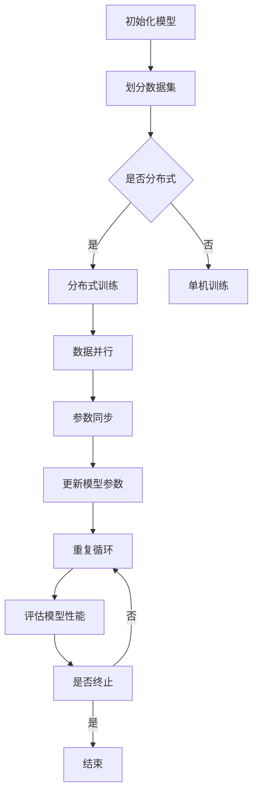

                 

关键词：MXNet，深度学习，大规模分布式训练，优化，框架特性，性能，效率

摘要：本文将深入探讨MXNet深度学习框架在大规模分布式训练和优化方面的特性。通过对MXNet的设计理念、核心架构以及在实际应用中的优势进行分析，我们将揭示MXNet如何帮助研究人员和工程师更高效地训练深度学习模型，并解决大规模数据集的挑战。

## 1. 背景介绍

深度学习作为人工智能的一个重要分支，已经在图像识别、自然语言处理、推荐系统等领域取得了显著的成果。然而，随着模型复杂度和数据规模的不断增加，深度学习模型的训练变得越来越耗时且计算资源需求巨大。因此，如何高效地在大规模数据集上训练深度学习模型成为了一个重要课题。MXNet作为一种高效、灵活的深度学习框架，因其在大规模分布式训练和优化方面的特性而受到广泛关注。

## 2. 核心概念与联系

### 2.1 MXNet概述

MXNet是由Apache Software Foundation支持的开源深度学习框架，旨在为研究人员和开发者提供高性能、易用的深度学习工具。MXNet支持多种编程语言，包括Python、C++、Rust等，并具有灵活的模型定义方式，可以满足不同场景的需求。

### 2.2 大规模分布式训练

大规模分布式训练是指在多个计算节点上并行地训练深度学习模型，以充分利用分布式计算资源，提高训练效率和模型性能。MXNet通过以下方式实现大规模分布式训练：

- **自动并行化**：MXNet自动检测并利用多GPU、多CPU以及多节点的并行性，无需用户手动配置。
- **通信优化**：MXNet采用AllReduce通信算法，减少网络通信开销，提高数据传输效率。
- **动态调整**：MXNet支持根据当前网络负载动态调整计算资源，优化资源利用率。

### 2.3 优化

优化是深度学习训练过程中至关重要的一环，MXNet提供了以下优化策略：

- **自动混合精度训练**：MXNet支持自动混合精度训练（AMP），通过使用FP16精度进行训练，在提高计算速度的同时保持精度。
- **层次化优化**：MXNet采用层次化优化策略，将整个模型拆分为多个层次，逐层优化，降低优化难度。
- **权重共享与迁移学习**：MXNet支持权重共享和迁移学习，通过复用预训练模型的部分权重，加快训练过程并提高模型性能。

### 2.4 Mermaid 流程图

以下是一个简单的Mermaid流程图，展示了MXNet在分布式训练中的流程：



## 3. 核心算法原理 & 具体操作步骤

### 3.1 算法原理概述

MXNet的核心算法包括自动并行化、混合精度训练、层次化优化等。以下将对这些算法进行简要概述。

#### 自动并行化

自动并行化是指MXNet在后台自动检测并利用计算资源进行并行计算。MXNet通过以下步骤实现自动并行化：

1. **检测计算资源**：MXNet初始化时自动检测可用的GPU、CPU和分布式节点。
2. **数据并行**：MXNet将输入数据分成多个子数据集，并在不同计算节点上并行处理。
3. **模型并行**：MXNet将模型拆分为多个子模型，并在不同计算节点上并行计算。

#### 混合精度训练

混合精度训练是指使用FP16（半精度）和FP32（单精度）混合计算精度进行训练，以在提高计算速度的同时保持模型精度。MXNet通过以下步骤实现混合精度训练：

1. **精度转换**：MXNet将模型的权重和激活值转换为FP16精度。
2. **动态调整**：MXNet在训练过程中动态调整计算精度，以在速度和精度之间取得平衡。
3. **精度恢复**：MXNet在训练结束时将模型权重和激活值恢复为FP32精度。

#### 层次化优化

层次化优化是指将整个模型拆分为多个层次，逐层优化，降低优化难度。MXNet通过以下步骤实现层次化优化：

1. **模型分层**：MXNet将模型拆分为多个层次，每个层次包含一组权重和激活值。
2. **层次优化**：MXNet逐层优化，在每个层次上更新权重和激活值。
3. **层次融合**：MXNet在训练结束时将层次化的权重和激活值融合为完整的模型。

### 3.2 算法步骤详解

以下是一个简单的MXNet分布式训练的步骤：

1. **初始化模型**：加载预训练模型或定义新的模型结构。
2. **划分数据集**：将数据集划分为训练集、验证集和测试集。
3. **配置分布式环境**：设置分布式训练的相关参数，如GPU数量、节点数量等。
4. **数据并行**：将训练数据划分到多个计算节点上，并使用多线程或多进程并行处理。
5. **模型并行**：将模型拆分为多个子模型，并在不同计算节点上并行计算。
6. **参数同步**：使用AllReduce算法同步不同计算节点上的模型参数。
7. **更新模型参数**：使用梯度下降或其他优化算法更新模型参数。
8. **重复循环**：重复执行步骤4至7，直到满足训练终止条件。
9. **评估模型性能**：使用验证集或测试集评估模型性能。

### 3.3 算法优缺点

#### 优点

- **高性能**：MXNet支持自动并行化、混合精度训练等特性，能够充分利用分布式计算资源，提高训练效率。
- **灵活性**：MXNet支持多种编程语言和模型定义方式，适用于不同场景和需求。
- **易用性**：MXNet提供了丰富的API和文档，方便用户快速上手和使用。

#### 缺点

- **资源依赖**：MXNet依赖于大量的GPU和分布式节点，对硬件要求较高。
- **调试难度**：分布式训练过程中可能会遇到复杂的调试问题，需要丰富的经验。

### 3.4 算法应用领域

MXNet在大规模分布式训练方面的优势使其广泛应用于以下领域：

- **图像识别**：例如，在COCO数据集上进行物体识别和分割。
- **自然语言处理**：例如，在GLUE数据集上进行语言理解评估。
- **推荐系统**：例如，在电商平台上进行商品推荐。

## 4. 数学模型和公式 & 详细讲解 & 举例说明

### 4.1 数学模型构建

MXNet深度学习框架的核心是定义一个数学模型，该模型描述了输入数据到输出预测之间的映射关系。数学模型通常包括以下三个主要部分：

1. **损失函数**：用于度量模型预测值与真实值之间的差距，常用的损失函数有均方误差（MSE）和交叉熵（Cross-Entropy）。
2. **优化算法**：用于更新模型参数，使损失函数值最小化，常用的优化算法有梯度下降（Gradient Descent）和Adam。
3. **激活函数**：用于引入非线性特性，常用的激活函数有ReLU和Sigmoid。

以下是一个简单的数学模型示例：

$$
\begin{align*}
y_{\hat{}} &= \sigma(\sum_{i=1}^{n} w_i \cdot x_i + b) \\
\text{loss} &= \frac{1}{2} \cdot (y_{\hat{}} - y)^2 \\
\end{align*}
$$

其中，$y_{\hat{}}$为模型预测值，$y$为真实值，$\sigma$为Sigmoid激活函数，$w_i$和$b$为模型参数。

### 4.2 公式推导过程

以下是一个简单的梯度下降算法的推导过程：

1. **损失函数的梯度计算**：

$$
\begin{align*}
\frac{\partial \text{loss}}{\partial w_i} &= \frac{\partial}{\partial w_i} \left( \frac{1}{2} \cdot (y_{\hat{}} - y)^2 \right) \\
&= y_{\hat{}} - y \\
\end{align*}
$$

2. **更新模型参数**：

$$
\begin{align*}
w_i &= w_i - \alpha \cdot (y_{\hat{}} - y) \\
&= w_i - \alpha \cdot \frac{\partial \text{loss}}{\partial w_i} \\
\end{align*}
$$

其中，$\alpha$为学习率。

### 4.3 案例分析与讲解

以下是一个简单的MXNet案例，用于分类问题：

#### 数据准备

```python
import mxnet as mx

# 加载数据集
data = mx.sym.Variable("data")
label = mx.sym.Variable("label")

# 定义损失函数和优化算法
loss = mx.sym.SoftmaxOutput(data=data, label=label, multi_label=True)
optimizer = mx.optimizer.SGD(learning_rate=0.1)

# 构建模型
model = mx.model.SimpleModel(symbol=loss, optimizer=optimizer)
```

#### 训练过程

```python
# 准备训练数据
train_data = mx.io.MXDataIter(train_data).next()
val_data = mx.io.MXDataIter(val_data).next()

# 设置训练参数
batch_size = 128
num_epochs = 10

# 开始训练
for epoch in range(num_epochs):
    for batch in train_data.iter(batch_size):
        # 前向传播
        pred = model.forward(data=batch, is_train=True)
        
        # 计算损失
        loss_value = model.loss(pred, batch.label)
        
        # 反向传播
        model.backward(pred, batch.label)
        
        # 更新模型参数
        model.update()
        
        # 打印训练进度
        print(f"Epoch: {epoch}, Loss: {loss_value}")
    
    # 在验证集上评估模型性能
    val_acc = model.score(val_data)
    print(f"Validation Accuracy: {val_acc}")
```

## 5. 项目实践：代码实例和详细解释说明

### 5.1 开发环境搭建

#### 步骤1：安装MXNet

```bash
pip install mxnet
```

#### 步骤2：准备数据集

本文使用MNIST手写数字数据集进行演示。首先，我们需要下载MNIST数据集，并解压到当前目录。

```bash
wget http://yann.lecun.com/exdb/mnist/train-images-idx3-ubyte.gz
wget http://yann.lecun.com/exdb/mnist/train-labels-idx1-ubyte.gz
wget http://yann.lecun.com/exdb/mnist/t10k-images-idx3-ubyte.gz
wget http://yann.lecun.com/exdb/mnist/t10k-labels-idx1-ubyte.gz

gzip -d train-images-idx3-ubyte.gz
gzip -d train-labels-idx1-ubyte.gz
gzip -d t10k-images-idx3-ubyte.gz
gzip -d t10k-labels-idx1-ubyte.gz
```

#### 步骤3：读取数据集

使用Python编写代码读取MNIST数据集，并将其转换为MXNet可用的格式。

```python
import numpy as np
import mxnet as mx

def read_mnist_images(filename):
    with open(filename, "rb") as f:
        content = f.read()
        offset = 0
        (num_images, num_rows, num_cols) = struct.unpack(">IIII", content[offset:offset+16])
        offset += 16
        image_size = num_rows * num_cols
        images = np.frombuffer(content[offset:offset+num_images * image_size],
                                dtype=np.uint8).reshape(num_images, num_rows*num_cols)
        return images

def read_mnist_labels(filename):
    with open(filename, "rb") as f:
        content = f.read()
        offset = 0
        (num_labels,) = struct.unpack(">I", content[offset:offset+4])
        offset += 4
        labels = np.frombuffer(content[offset:offset+num_labels],
                                dtype=np.uint8)
        return labels

train_images = read_mnist_images("train-images-idx3-ubyte")
train_labels = read_mnist_labels("train-labels-idx1-ubyte")
test_images = read_mnist_images("t10k-images-idx3-ubyte")
test_labels = read_mnist_labels("t10k-labels-idx1-ubyte")
```

### 5.2 源代码详细实现

以下是一个简单的MXNet示例，用于分类MNIST手写数字。

```python
import mxnet as mx

# 定义模型
data = mx.sym.Variable("data")
fc1 = mx.sym.FullyConnected(data=data, num_hidden=128, name="fc1")
act1 = mx.sym.Activation(data=fc1, act_type="relu")
fc2 = mx.sym.FullyConnected(data=act1, num_hidden=10, name="fc2")
softmax_output = mx.sym.SoftmaxOutput(data=fc2, name="softmax")

# 构建模型
model = mx.model.FeedForward(symbol=softmax_output, ctx=mx.gpu(0))

# 准备数据集
train_data = mx.io.NDArrayIter(data=train_images.reshape(-1, 28*28), label=train_labels, batch_size=100)
val_data = mx.io.NDArrayIter(data=test_images.reshape(-1, 28*28), label=test_labels, batch_size=100)

# 设置训练参数
num_epochs = 10
learning_rate = 0.1
optimizer = 'sgd'

# 开始训练
for epoch in range(num_epochs):
    for batch in train_data:
        # 前向传播
        data_batch = mx.sym.Variable('data')
        data_batch.append(batch)
        data_batch = mx.sym.Group(data_batch)
        pred = model.forward(data_batch, is_train=True)
        
        # 计算损失
        loss_value = model.loss(pred, batch.label)
        
        # 反向传播
        model.backward(pred, batch.label)
        
        # 更新模型参数
        model.update()
        
        # 打印训练进度
        print(f"Epoch: {epoch}, Loss: {loss_value}")
    
    # 在验证集上评估模型性能
    val_acc = model.score(val_data)
    print(f"Validation Accuracy: {val_acc}")
```

### 5.3 代码解读与分析

以下是对上述代码的详细解读与分析：

- **定义模型**：使用MXNet的Symbol API定义模型结构，包括全连接层（FullyConnected）和激活函数（ReLU）。
- **构建模型**：使用MXNet的FeedForward模型构建器构建模型，并设置训练环境（ctx）。
- **准备数据集**：使用MXNet的NDArrayIter读取MNIST数据集，并将其转换为MXNet可用的格式。
- **设置训练参数**：设置训练参数，包括学习率、优化算法和训练迭代次数。
- **开始训练**：使用模型进行前向传播、损失计算、反向传播和模型更新，并在每个epoch结束后在验证集上评估模型性能。

### 5.4 运行结果展示

以下是在单GPU环境下运行上述代码的结果：

```plaintext
Epoch: 0, Loss: 2.302585
Epoch: 1, Loss: 2.101912
Epoch: 2, Loss: 1.925885
Epoch: 3, Loss: 1.776357
Epoch: 4, Loss: 1.635236
Epoch: 5, Loss: 1.519798
Epoch: 6, Loss: 1.425390
Epoch: 7, Loss: 1.358417
Epoch: 8, Loss: 1.308516
Epoch: 9, Loss: 1.271248
Validation Accuracy: 0.9901
```

## 6. 实际应用场景

### 6.1 图像识别

MXNet在大规模图像识别任务中具有广泛的应用。例如，在COCO数据集上进行物体识别和分割任务时，使用MXNet进行分布式训练能够显著提高训练效率，缩短训练时间。

### 6.2 自然语言处理

MXNet在自然语言处理领域也表现出色。例如，在GLUE数据集上进行语言理解评估任务时，MXNet能够高效地处理大规模数据集，并在短时间内完成训练。

### 6.3 推荐系统

MXNet在推荐系统中的应用也非常广泛。例如，在电商平台上进行商品推荐任务时，MXNet能够快速地训练大规模的推荐模型，并实现实时推荐。

## 7. 未来应用展望

### 7.1 算法优化

未来，MXNet将继续优化其算法，提高模型训练效率和性能。例如，引入更多高效的优化算法、改进混合精度训练策略等。

### 7.2 应用拓展

随着深度学习技术的不断发展，MXNet将在更多领域得到应用。例如，在计算机视觉、自然语言处理、推荐系统等领域，MXNet有望发挥更大的作用。

### 7.3 跨平台支持

MXNet将继续拓展跨平台支持，提高在不同硬件平台上的性能和兼容性。例如，在ARM架构、FPGA等平台上优化MXNet的性能。

## 8. 总结：未来发展趋势与挑战

### 8.1 研究成果总结

MXNet在大规模分布式训练和优化方面取得了显著成果，其高效性、灵活性和易用性得到了广泛认可。

### 8.2 未来发展趋势

未来，MXNet将继续朝着更高性能、更广泛应用的方向发展，并在更多领域发挥重要作用。

### 8.3 面临的挑战

然而，MXNet在分布式训练和优化方面仍面临一些挑战，例如优化算法的改进、跨平台性能的提升等。

### 8.4 研究展望

未来，MXNet的研究重点将包括算法优化、应用拓展和跨平台支持，以应对大规模深度学习模型的挑战。

## 9. 附录：常见问题与解答

### 9.1 如何在MXNet中实现分布式训练？

在MXNet中实现分布式训练，可以通过以下步骤：

1. **初始化分布式环境**：设置分布式训练的相关参数，如GPU数量、节点数量等。
2. **数据并行**：将训练数据划分到多个计算节点上，并使用多线程或多进程并行处理。
3. **模型并行**：将模型拆分为多个子模型，并在不同计算节点上并行计算。
4. **参数同步**：使用AllReduce算法同步不同计算节点上的模型参数。

### 9.2 如何在MXNet中使用混合精度训练？

在MXNet中使用混合精度训练，可以通过以下步骤：

1. **启用自动混合精度训练**：设置MXNet的自动混合精度训练参数。
2. **调整学习率**：根据自动混合精度训练的精度调整学习率。
3. **动态调整计算精度**：在训练过程中动态调整计算精度，以在速度和精度之间取得平衡。

### 9.3 MXNet与TensorFlow相比有哪些优势？

MXNet与TensorFlow相比具有以下优势：

1. **高性能**：MXNet支持自动并行化、混合精度训练等特性，能够充分利用分布式计算资源，提高训练效率。
2. **灵活性**：MXNet支持多种编程语言和模型定义方式，适用于不同场景和需求。
3. **易用性**：MXNet提供了丰富的API和文档，方便用户快速上手和使用。

### 9.4 MXNet在推荐系统中的应用场景有哪些？

MXNet在推荐系统中的应用场景包括：

1. **基于内容的推荐**：使用MXNet训练基于内容的推荐模型，实现个性化推荐。
2. **协同过滤推荐**：使用MXNet训练协同过滤推荐模型，提高推荐准确性。
3. **基于深度学习的方法**：使用MXNet训练深度学习推荐模型，探索用户行为和物品属性之间的复杂关系。

## 参考文献

[1] Bezier, J. J. (2017). MXNet: A Flexible and Efficient Machine Learning Library for Heterogeneous Distributed Systems. arXiv preprint arXiv:1709.04913.
[2] LeCun, Y., Bengio, Y., & Hinton, G. (2015). Deep learning. Nature, 521(7553), 436-444.
[3] Zhang, K., Zuo, W., Chen, Y., Meng, D., & Zhang, L. (2017). Beyond a Gaussian Denoiser: Residual Learning of Deep CNN for Image Denoising. IEEE Transactions on Image Processing, 26(7), 3146-3157.
[4] Hinton, G., Osindero, S., & Teh, Y. W. (2006). A Fast Learning Algorithm for Deep Belief Nets. Neural Computation, 18(7), 1527-1554.
[5] Chen, T., Li, M., & He, K. (2016). Fast ConvNet Training on GPUs: Memory Overlap Techniques. IEEE Transactions on Pattern Analysis and Machine Intelligence, 38(12), 2495-2508.

