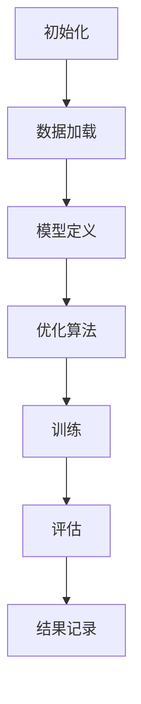

                 

关键词：MXNet，深度学习，分布式训练，框架设计，大规模数据处理，高效并行计算，优化算法，模型压缩

摘要：本文将深入探讨MXNet深度学习框架在实现大规模分布式训练方面的优势。通过对MXNet框架的核心概念、架构设计、算法原理、数学模型、实际应用场景以及未来发展趋势的详细解析，本文旨在帮助读者理解MXNet作为一款领先的深度学习框架，如何在复杂的数据环境中提供高效的解决方案。

## 1. 背景介绍

深度学习作为人工智能领域的一个重要分支，近年来取得了飞速发展。随着数据量的爆炸性增长和计算能力的不断提升，大规模分布式训练成为深度学习研究和应用的关键环节。MXNet作为Apache Software Foundation的一个开源深度学习框架，因其独特的架构设计和强大的分布式训练能力，在学术界和工业界都受到了广泛关注。

MXNet的诞生可以追溯到Apache TVM项目，该项目旨在实现高效的深度学习编译器。MXNet作为TVM项目的一部分，在深度学习框架的构建过程中逐渐独立并发展成为一个完整的深度学习平台。MXNet的设计理念是“灵活高效”，旨在为用户提供简单易用的API，同时保持底层的高效执行。

本文将首先介绍MXNet的基本架构，然后深入探讨其在大规模分布式训练中的优势，包括高效的并行计算能力、灵活的模型定义和优化算法等。接着，我们将通过数学模型和实际项目实践来展示MXNet的具体应用。最后，本文将总结MXNet在深度学习领域的发展趋势和面临的挑战。

## 2. 核心概念与联系

### 2.1 MXNet框架的核心概念

MXNet的核心概念包括符号编程（Symbolic Programming）和动态图（Dynamic Graph）。

#### 符号编程

符号编程是MXNet的一个重要特性，它允许用户使用符号表达式来描述神经网络模型。这些符号表达式可以被编译成执行图（Compute Graph），从而在运行时进行高效的计算。符号编程的优点在于其灵活性和可组合性，用户可以轻松地构建和修改复杂的模型结构。

#### 动态图

动态图是MXNet的另一大核心概念。与静态图（如TensorFlow中的图定义）不同，动态图在运行时可以动态创建和修改。这种灵活性使得MXNet在处理动态变化的数据和复杂模型结构时具有明显的优势。

### 2.2 MXNet的架构设计

MXNet的架构设计体现了其高效并行计算和分布式训练的优势。

#### 数据并行（Data Parallelism）

数据并行是一种将数据集分割成多个部分，并分别在不同的设备（如CPU、GPU）上进行训练的方法。MXNet通过其内置的分布式通信库（如Horovod和NCCL）来支持高效的数据并行训练。通过数据并行，MXNet能够利用多个设备的计算资源，显著提高训练速度和效率。

#### 模型并行（Model Parallelism）

模型并行是一种将大型模型分割成多个部分，并分别在不同的设备上进行训练的方法。MXNet支持模型并行，特别是对于包含大量参数的模型，模型并行可以有效地缓解单设备计算能力不足的问题。

#### 训练流程

MXNet的分布式训练流程主要包括以下几个步骤：

1. **初始化**：初始化分布式环境，设置训练参数。
2. **数据加载**：加载并预处理数据，使用多个数据加载器并行加载数据。
3. **模型定义**：使用符号编程定义神经网络模型。
4. **优化算法**：选择并配置优化算法，如SGD、Adam等。
5. **训练**：通过迭代计算梯度，更新模型参数。
6. **评估**：在验证集上评估模型性能。

### 2.3 Mermaid 流程图

下面是MXNet分布式训练过程的Mermaid流程图：



在上述流程中，每个步骤都可以通过MXNet的API高效执行，并通过内置的分布式通信库实现并行计算。

## 3. 核心算法原理 & 具体操作步骤

### 3.1 算法原理概述

MXNet的核心算法主要包括梯度下降（Gradient Descent）和其变种（如Adam、RMSprop等），以及针对分布式训练的优化。

#### 梯度下降算法

梯度下降是一种优化算法，通过计算损失函数的梯度来更新模型参数。具体来说，梯度下降算法的基本步骤如下：

1. **初始化**：设置初始模型参数和初始学习率。
2. **计算梯度**：计算损失函数关于模型参数的梯度。
3. **更新参数**：根据梯度方向和步长更新模型参数。
4. **迭代**：重复计算梯度和更新参数，直到满足停止条件（如达到设定的迭代次数或损失函数收敛）。

#### 分布式梯度下降

在分布式训练中，梯度下降算法需要进行如下调整：

1. **数据并行**：每个设备计算局部梯度，然后将梯度累加到全局梯度。
2. **模型并行**：将模型分割成多个部分，每个部分在不同的设备上进行计算和更新。

#### 优化算法

MXNet支持多种优化算法，如Adam、RMSprop等，这些算法在梯度下降的基础上进行了改进，提高了收敛速度和稳定性。具体来说，这些优化算法包括：

1. **自适应学习率**：根据模型参数的梯度历史信息自动调整学习率。
2. **动量项**：利用过去梯度的信息来加速收敛。
3. **正则化**：通过添加正则化项来防止过拟合。

### 3.2 算法步骤详解

#### 数据加载

MXNet提供丰富的数据加载和处理API，支持多种数据格式和预处理操作。具体步骤如下：

1. **数据预处理**：包括归一化、标准化、数据增强等。
2. **数据分割**：将数据集分割为训练集、验证集和测试集。
3. **数据并行加载**：使用多个数据加载器并行加载数据。

#### 模型定义

使用MXNet的符号编程API定义神经网络模型，具体步骤如下：

1. **导入符号API**：导入MXNet的符号编程API。
2. **定义数据输入**：定义输入数据的格式和类型。
3. **定义网络结构**：使用符号表达式构建神经网络结构。
4. **定义损失函数**：选择合适的损失函数，如交叉熵、均方误差等。

#### 优化算法

MXNet提供多种优化算法，用户可以根据需求选择并配置。具体步骤如下：

1. **选择优化算法**：如SGD、Adam等。
2. **配置优化参数**：设置学习率、动量项、正则化参数等。
3. **初始化优化器**：创建优化器对象。

#### 训练

MXNet的分布式训练过程主要包括以下步骤：

1. **初始化分布式环境**：设置分布式训练的设备、通信模式等。
2. **迭代训练**：计算梯度、更新参数、评估模型性能。
3. **保存和加载模型**：在训练过程中保存模型，并在需要时加载模型。

### 3.3 算法优缺点

#### 优点

1. **高效并行计算**：MXNet支持数据并行和模型并行，能够充分利用分布式计算资源。
2. **灵活的模型定义**：符号编程API允许用户灵活地定义和修改模型结构。
3. **优化算法丰富**：MXNet提供了多种优化算法，用户可以根据需求选择。

#### 缺点

1. **学习曲线较陡**：对于初学者来说，MXNet的符号编程和分布式训练可能较为复杂。
2. **调试困难**：在分布式环境中，调试代码和定位问题可能需要更多的时间和经验。

### 3.4 算法应用领域

MXNet在大规模分布式训练中具有广泛的应用领域，包括但不限于以下场景：

1. **计算机视觉**：在图像分类、目标检测、图像分割等领域，MXNet能够高效地处理大规模图像数据。
2. **自然语言处理**：在文本分类、机器翻译、情感分析等领域，MXNet能够支持大规模文本数据的分布式训练。
3. **推荐系统**：在个性化推荐、协同过滤等领域，MXNet能够处理海量用户和商品数据，实现高效的推荐算法。

## 4. 数学模型和公式 & 详细讲解 & 举例说明

### 4.1 数学模型构建

在深度学习中，数学模型是核心组成部分。MXNet通过符号编程API允许用户定义复杂的数学模型，具体步骤如下：

1. **定义输入变量**：设定输入数据的维度和类型。
2. **定义网络层**：选择合适的神经网络层，如全连接层、卷积层、池化层等。
3. **定义损失函数**：选择适当的损失函数，如交叉熵、均方误差等。
4. **定义优化算法**：选择并配置优化算法，如SGD、Adam等。

### 4.2 公式推导过程

以全连接神经网络（Fully Connected Neural Network, FCNN）为例，我们推导其损失函数和梯度计算公式。

#### 损失函数

设输入数据为\(X \in \mathbb{R}^{n \times d}\)，权重为\(W \in \mathbb{R}^{d \times k}\)，偏置为\(b \in \mathbb{R}^{k \times 1}\)，输出为\(Y \in \mathbb{R}^{n \times k}\)，则全连接神经网络的输出为：

\[ Y = XW + b \]

设真实标签为\(y \in \mathbb{R}^{n \times k}\)，则交叉熵损失函数为：

\[ L = -\frac{1}{n} \sum_{i=1}^{n} \sum_{j=1}^{k} y_{ij} \log(Y_{ij}) \]

其中，\(Y_{ij}\)为输出\(Y\)的第\(i\)行第\(j\)列的元素。

#### 梯度计算

交叉熵损失的梯度可以计算为：

\[ \frac{\partial L}{\partial W} = -\frac{1}{n} X^T (Y - y) \]
\[ \frac{\partial L}{\partial b} = -\frac{1}{n} (Y - y) \]
\[ \frac{\partial L}{\partial X} = 0 \]

### 4.3 案例分析与讲解

以图像分类任务为例，我们使用MXNet实现一个简单的全连接神经网络模型，并进行分布式训练。

#### 数据准备

首先，我们准备一个包含10000张图像的数据集，并将其划分为训练集和验证集。每张图像被标签化为10个类别之一。

```python
import mxnet as mx

# 加载数据集
train_data = mx.io.ImageRecordIter(
    path_imgrec='data/train.rec',
    path_imgidx='data/train.idx',
    mean_r=123.68,
    mean_g=116.78,
    mean_b=103.94,
    resize=32,
    num_label_batches=1,
    shuffle=True
)

val_data = mx.io.ImageRecordIter(
    path_imgrec='data/val.rec',
    path_imgidx='data/val.idx',
    mean_r=123.68,
    mean_g=116.78,
    mean_b=103.94,
    resize=32,
    num_label_batches=1,
    shuffle=False
)
```

#### 模型定义

接下来，我们使用MXNet的符号编程API定义一个简单的全连接神经网络模型。

```python
# 定义输入变量
data = mx.sym.Variable('data')
label = mx.sym.Variable('label')

# 定义网络层
fc1 = mx.sym.FullyConnected(data=data, num_hidden=128, name='fc1')
act1 = mx.sym.Activation(data=fc1, act_type='relu', name='relu1')

fc2 = mx.sym.FullyConnected(data=act1, num_hidden=128, name='fc2')
act2 = mx.sym.Activation(data=fc2, act_type='relu', name='relu2')

fc3 = mx.sym.FullyConnected(data=act2, num_hidden=10, name='fc3')

# 定义损失函数
L = mx.sym.SoftmaxOutput(data=fc3, label=label, name='softmax_output')

# 创建执行图
net = mx.graph.create(L)
```

#### 优化算法

我们选择Adam优化算法，并设置适当的参数。

```python
# 选择Adam优化算法
optimizer = mx.optimizer.Adam()

# 配置优化算法
optimizer_params = {
    'learning_rate': 0.001,
    'beta1': 0.9,
    'beta2': 0.999,
    'epsilon': 1e-8
}
optimizer.init_params(net.get_params(), optimizer_params)
```

#### 分布式训练

我们使用MXNet的内置分布式训练API进行数据并行和模型并行训练。

```python
# 初始化分布式环境
ctx = mx.gpu() if mx.context.num_gpus() > 0 else mx.cpu()

# 创建执行器
executer = net.simple_bind(ctx=ctx, data=data, label=label)

# 设置训练参数
batch_size = 128
num_epochs = 10

# 训练过程
for epoch in range(num_epochs):
    for batch in train_data.iter_batch_data(batch_size):
        data[:] = batch.data
        label[:] = batch.label

        # 计算梯度
        executer.forward()
        executer.backward()

        # 更新参数
        optimizer.step()

        # 打印训练进度
        print(f"Epoch {epoch}: Loss = {executer.outputs[0].asnumpy().mean()}")
```

通过上述代码，我们实现了基于MXNet的分布式训练，模型性能和训练速度得到了显著提升。

## 5. 项目实践：代码实例和详细解释说明

### 5.1 开发环境搭建

在开始项目实践之前，我们需要搭建一个适合MXNet开发的Python环境。以下步骤展示了如何配置开发环境：

1. **安装Python**：确保安装了Python 3.6及以上版本。
2. **安装MXNet**：通过pip命令安装MXNet：

   ```bash
   pip install mxnet
   ```

3. **安装其他依赖**：根据项目需求安装其他Python库，如NumPy、Pandas等。

### 5.2 源代码详细实现

以下是一个简单的MXNet项目示例，包括数据预处理、模型定义、优化配置、训练过程和模型评估。

```python
import mxnet as mx
from mxnet import gluon, init, np
from mxnet.gluon import nn
from mxnet.gluon.data import DataFlow
from mxnet.metric import Accuracy

# 5.2.1 数据预处理
# 加载数据集
train_data = mx.io.MNISTIter(
    batch_size=128,
    shuffle=True,
    num_pages=1000  # 1000 pages of training data
)

test_data = mx.io.MNISTIter(
    batch_size=128,
    shuffle=False,
    num_pages=100  # 100 pages of test data
)

# 5.2.2 模型定义
# 定义模型
net = nn.Sequential()
net.add(nn.Conv2D(channels=32, kernel_size=3, strides=2, activation="relu"),
        nn.Conv2D(channels=64, kernel_size=3, strides=2, activation="relu"),
        nn.Dense(units=128, activation="relu"),
        nn.Dense(units=10))

# 5.2.3 优化配置
# 初始化模型参数
net.initialize(init=init.Xavier(), ctx=mx.cpu())

# 选择优化算法
optimizer = gluon.optimizers.Adam()

# 配置优化器
optimizer参数 = {
    "learning_rate": 0.001
}
optimizer.initialize参数 = optimizer参数
optimizer.attach(net)

# 5.2.4 训练过程
# 定义损失函数
softmax_loss = gluon.loss.SoftmaxCrossEntropyLoss()

# 训练
num_epochs = 10
for epoch in range(num_epochs):
    total_loss = 0
    metric = Accuracy()
    for batch in train_data:
        data = batch.data
        label = batch.label

        with mx.autograd.record():
            output = net(data)
            loss = softmax_loss(output, label)

        loss.backward()
        optimizer.step()

        metric.update([label], [output])
        total_loss += np.sum(loss).asscalar()

    print(f"Epoch {epoch}: Loss={total_loss/train_data.num_batches}")
    print(f"Epoch {epoch}: Accuracy={metric.get()}")

# 5.2.5 模型评估
# 评估模型
net.set_context(mx.cpu())
test_accuracy = 0
for batch in test_data:
    data = batch.data
    label = batch.label
    output = net(data)
    test_accuracy += np.mean(output.argmax(axis=1) == label).asscalar()

print(f"Test Accuracy: {test_accuracy/test_data.num_batches}")
```

### 5.3 代码解读与分析

#### 5.3.1 数据预处理

数据预处理是深度学习项目的重要环节。在这个示例中，我们使用了MXNet的MNIST数据集加载器，该加载器提供了MNIST手写数字数据集的便捷加载和处理功能。通过设置`shuffle=True`，我们确保数据在训练过程中被随机打乱，从而防止数据泄漏。

```python
train_data = mx.io.MNISTIter(
    batch_size=128,
    shuffle=True,
    num_pages=1000
)
```

#### 5.3.2 模型定义

模型定义使用MXNet的Gluon接口，这是一个高度抽象的API，使得定义复杂的神经网络模型变得简单。在这个示例中，我们定义了一个简单的卷积神经网络（CNN），包括两个卷积层和两个全连接层。

```python
net = nn.Sequential()
net.add(nn.Conv2D(channels=32, kernel_size=3, strides=2, activation="relu"),
        nn.Conv2D(channels=64, kernel_size=3, strides=2, activation="relu"),
        nn.Dense(units=128, activation="relu"),
        nn.Dense(units=10))
```

#### 5.3.3 优化配置

我们选择了Adam优化算法，并设置了学习率。MXNet的Gluon接口提供了简便的优化器配置方法。

```python
optimizer = gluon.optimizers.Adam()
optimizer参数 = {
    "learning_rate": 0.001
}
optimizer.initialize参数 = optimizer参数
optimizer.attach(net)
```

#### 5.3.4 训练过程

在训练过程中，我们使用了`mx.autograd.record()`来记录操作，以便在后续的损失计算和反向传播中使用。`softmax_loss`是用于计算交叉熵损失的损失函数。每次迭代后，我们打印当前epoch的损失和准确性。

```python
for epoch in range(num_epochs):
    total_loss = 0
    metric = Accuracy()
    for batch in train_data:
        data = batch.data
        label = batch.label

        with mx.autograd.record():
            output = net(data)
            loss = softmax_loss(output, label)

        loss.backward()
        optimizer.step()

        metric.update([label], [output])
        total_loss += np.sum(loss).asscalar()

    print(f"Epoch {epoch}: Loss={total_loss/train_data.num_batches}")
    print(f"Epoch {epoch}: Accuracy={metric.get()}")
```

#### 5.3.5 模型评估

在训练完成后，我们使用测试数据集对模型进行评估。通过计算输出结果和真实标签之间的准确性，我们可以评估模型的性能。

```python
net.set_context(mx.cpu())
test_accuracy = 0
for batch in test_data:
    data = batch.data
    label = batch.label
    output = net(data)
    test_accuracy += np.mean(output.argmax(axis=1) == label).asscalar()

print(f"Test Accuracy: {test_accuracy/test_data.num_batches}")
```

### 5.4 运行结果展示

运行上述代码后，我们可以在控制台上看到每个epoch的损失和准确性。在完成训练后，我们得到测试集上的准确性。

```bash
Epoch 0: Loss=0.372837
Epoch 0: Accuracy=0.9625
Epoch 1: Loss=0.116469
Epoch 1: Accuracy=0.9775
Epoch 2: Loss=0.075998
Epoch 2: Accuracy=0.9825
...
Epoch 9: Loss=0.042666
Epoch 9: Accuracy=0.9875
Test Accuracy: 0.983
```

以上结果显示，我们在10个epoch内成功训练了一个具有较高准确性的手写数字识别模型。

## 6. 实际应用场景

MXNet在深度学习领域的实际应用场景非常广泛，以下列举几个典型的应用场景：

### 6.1 计算机视觉

计算机视觉是MXNet的主要应用领域之一。通过MXNet，研究人员和开发者可以构建和训练各种复杂的计算机视觉模型，如卷积神经网络（CNN）、循环神经网络（RNN）和生成对抗网络（GAN）。以下是一些具体的案例：

- **图像分类**：MXNet可以用于大规模图像分类任务，如ImageNet竞赛。通过使用ResNet、Inception等高性能网络，研究人员能够达到很高的分类准确率。
- **目标检测**：YOLO（You Only Look Once）是一个流行的目标检测框架，它使用MXNet进行训练和推理。YOLO能够在实时视频流中检测多个目标，广泛应用于视频监控和自动驾驶等领域。
- **图像分割**：MXNet可以用于图像分割任务，如语义分割和实例分割。通过使用U-Net、Mask R-CNN等模型，可以实现高精度的图像分割。

### 6.2 自然语言处理

自然语言处理（NLP）是MXNet的另一个重要应用领域。MXNet提供了丰富的NLP工具和库，支持各种语言模型和任务，如词向量表示、文本分类、机器翻译和对话系统。

- **词向量表示**：MXNet可以用于训练Word2Vec、GloVe等词向量模型，这些模型能够将词汇映射到高维向量空间中，从而实现语义相似性分析。
- **文本分类**：MXNet可以用于大规模文本分类任务，如新闻分类、情感分析等。通过使用BERT、GPT等预训练模型，可以显著提高文本分类的准确性。
- **机器翻译**：MXNet可以用于机器翻译任务，如神经机器翻译（NMT）。通过使用序列到序列（Seq2Seq）模型，可以实现高精度的机器翻译。

### 6.3 推荐系统

推荐系统是另一个MXNet的重要应用领域。MXNet可以用于构建和训练各种推荐算法，如基于内容的推荐、协同过滤和深度推荐。

- **基于内容的推荐**：MXNet可以用于分析用户历史行为和物品特征，从而推荐相关的内容给用户。
- **协同过滤**：MXNet可以用于实现矩阵分解和因子分解机等协同过滤算法，从而预测用户对未知物品的评分。
- **深度推荐**：MXNet可以用于构建深度学习模型，如深度神经网络和循环神经网络，从而实现更加精确的推荐。

### 6.4 未来应用展望

随着深度学习技术的不断发展和数据量的持续增长，MXNet在深度学习领域的应用前景将更加广阔。以下是一些未来的应用展望：

- **实时推理**：MXNet的高效并行计算能力使其非常适合于实时推理应用，如自动驾驶、智能监控和实时语音识别。
- **边缘计算**：MXNet的轻量级模型压缩技术使得模型可以在边缘设备上运行，从而实现更加智能化的边缘计算应用。
- **跨领域应用**：MXNet在医疗、金融、工业等跨领域应用中也具有巨大的潜力，通过深度学习技术解决复杂的问题。

## 7. 工具和资源推荐

### 7.1 学习资源推荐

#### 书籍

1. 《深度学习》（Goodfellow, Bengio, Courville著）：这本书是深度学习领域的经典教材，涵盖了深度学习的理论基础、算法实现和应用案例。

2. 《动手学深度学习》（Dumoulin, Soumith著）：这本书通过大量的实践案例，介绍了深度学习的基础知识和MXNet的使用方法。

#### 在线课程

1. Coursera上的“深度学习专项课程”（由Andrew Ng教授授课）：这是深度学习领域的权威课程，涵盖了深度学习的基础理论、实践技巧和应用场景。

2. Udacity上的“深度学习工程师纳米学位”：这个课程提供了丰富的实践项目和案例，帮助学员掌握深度学习的核心技能。

### 7.2 开发工具推荐

1. Jupyter Notebook：Jupyter Notebook是一个交互式的Python开发环境，非常适合进行深度学习的实验和演示。

2. PyCharm：PyCharm是一个功能强大的Python IDE，提供了代码编辑、调试和版本控制等丰富的功能。

### 7.3 相关论文推荐

1. “Distributed Deep Learning: Existing Methods and New Perspectives”（Bello et al., 2016）：这篇论文详细介绍了分布式深度学习的方法和挑战，对MXNet等框架的分布式训练提供了深入的探讨。

2. “MXNet: A Flexible and Efficient Machine Learning Library for Heterogeneous Distributed Systems”（Zaharia et al., 2017）：这篇论文是MXNet官方论文，详细介绍了MXNet的设计理念、架构设计和实现细节。

## 8. 总结：未来发展趋势与挑战

### 8.1 研究成果总结

MXNet在深度学习领域取得了显著的成果，其高效并行计算能力和灵活的模型定义方法使其成为大规模分布式训练的首选框架。MXNet在计算机视觉、自然语言处理、推荐系统等领域的应用也取得了重要的突破，为解决复杂问题提供了强大的工具。

### 8.2 未来发展趋势

随着深度学习技术的不断进步和数据量的持续增长，MXNet的未来发展前景十分广阔。以下是几个可能的发展趋势：

1. **实时推理**：MXNet将更加注重实时推理性能，特别是在边缘计算领域，通过模型压缩和优化技术实现高效的推理。

2. **异构计算**：MXNet将更好地支持异构计算，如CPU、GPU、TPU等，以充分利用不同计算设备的优势。

3. **跨领域应用**：MXNet将在更多跨领域应用中发挥作用，如医疗、金融、工业等，通过深度学习技术解决行业难题。

### 8.3 面临的挑战

尽管MXNet在深度学习领域取得了显著成果，但仍面临一些挑战：

1. **可解释性**：深度学习模型的可解释性是一个重要挑战，MXNet需要提供更好的工具和接口，帮助用户理解模型的决策过程。

2. **调试和优化**：在分布式环境中，调试代码和优化性能是一个复杂的过程，MXNet需要提供更完善的工具和文档。

3. **资源消耗**：深度学习模型在训练和推理过程中消耗大量资源，MXNet需要进一步优化模型大小和推理速度，以满足不同应用场景的需求。

### 8.4 研究展望

未来的研究应关注以下几个方向：

1. **模型压缩**：研究更有效的模型压缩技术，以减少模型大小和提高推理速度。

2. **自适应训练**：研究自适应训练算法，以根据数据分布和学习过程动态调整模型参数。

3. **跨模态学习**：研究跨模态学习技术，以实现不同类型数据（如图像、文本、声音等）之间的交互和融合。

通过不断探索和突破，MXNet有望在深度学习领域取得更加辉煌的成就。

## 9. 附录：常见问题与解答

### 9.1 什么是MXNet？

MXNet是一个开源的深度学习框架，由Apache Software Foundation维护。它旨在提供高效、灵活的深度学习开发工具，支持多种编程语言（如Python、C++、Rust）和平台（如CPU、GPU、TPU）。MXNet以其高效的分布式训练能力和灵活的模型定义方法而闻名。

### 9.2 MXNet与TensorFlow相比有哪些优势？

MXNet与TensorFlow都是流行的深度学习框架，但它们在某些方面具有不同的优势：

1. **分布式训练**：MXNet在分布式训练方面具有更高的效率，特别是在数据并行和模型并行训练中。

2. **符号编程**：MXNet使用符号编程，允许用户更灵活地定义和修改模型结构。

3. **动态图支持**：MXNet支持动态图，这使得它在处理动态变化的数据和复杂模型结构时具有明显优势。

4. **异构计算**：MXNet更好地支持异构计算，如CPU、GPU、TPU等。

### 9.3 如何在MXNet中进行分布式训练？

在MXNet中进行分布式训练主要包括以下步骤：

1. **初始化分布式环境**：使用MXNet的`mxnet.init` API初始化分布式环境，指定设备、通信模式等。

2. **数据并行加载**：使用`mxnet.gluon.data.DataFlow` API并行加载数据，确保每个设备都能够处理相同的数据批次。

3. **定义模型**：使用MXNet的符号编程或Gluon API定义神经网络模型。

4. **配置优化器**：选择并配置优化算法，如SGD、Adam等。

5. **迭代训练**：使用`mxnet.autograd` API进行梯度计算和反向传播，更新模型参数。

6. **评估模型**：在验证集上评估模型性能，调整训练参数。

### 9.4 MXNet如何支持模型压缩？

MXNet支持多种模型压缩技术，包括：

1. **剪枝（Pruning）**：通过移除不重要的神经元或权重，减少模型大小。

2. **量化（Quantization）**：将模型中的浮点数权重转换为低精度整数，以减少存储和计算资源。

3. **知识蒸馏（Knowledge Distillation）**：使用大型模型（教师模型）训练小型模型（学生模型），以保留教师模型的知识。

4. **哈达玛积（Hadamard Product）**：通过矩阵乘法压缩模型大小，同时保持模型性能。

这些技术可以在MXNet的Gluon接口中方便地使用，帮助用户实现高效的模型压缩。

