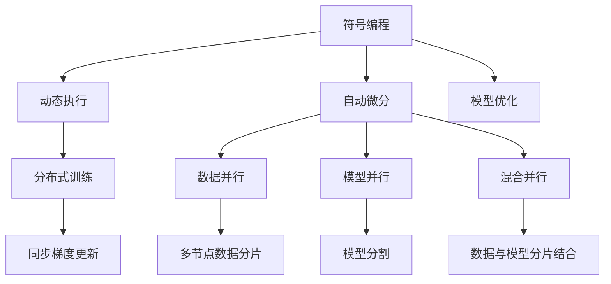

                 

关键词：MXNet，深度学习，大规模分布式训练，高效编程，性能优化，分布式系统设计

> 摘要：本文深入探讨了MXNet深度学习框架在大型分布式系统中的优势和应用。通过详细解析MXNet的核心概念、算法原理以及实际代码实现，本文旨在为读者提供全面的MXNet分布式训练指南，并展望其未来的发展趋势。

## 1. 背景介绍

随着人工智能和大数据的飞速发展，深度学习模型变得越来越大、越来越复杂，这带来了对计算资源的高需求。单机训练已经无法满足许多应用场景的需求，分布式训练成为了解决这一问题的有效途径。MXNet作为Apache Software Foundation下的一个开源深度学习框架，以其高性能和灵活性在分布式训练领域得到了广泛应用。

本文将重点介绍MXNet在分布式训练中的优势，解析其核心算法原理，并展示实际的项目实践和运行结果。通过本文的阅读，读者将能够全面了解MXNet的分布式训练机制，掌握如何有效地利用MXNet进行大规模分布式训练，从而提升深度学习模型的性能。

## 2. 核心概念与联系

### 2.1 MXNet基本概念

MXNet（Monte Media eXtreme）是一个开源的深度学习框架，由微软研究院开发。它具有高度的可扩展性和灵活性，支持多种编程语言（如Python、C++、R等），并且能够在多种硬件平台上运行，包括CPU、GPU和ARM架构。

MXNet的核心概念包括：

- **符号编程（Symbolic Programming）**：使用符号表达式来描述模型的结构，而非直接编写具体的计算代码。
- **动态执行（Dynamic Execution）**：动态生成并执行计算图，使得模型能够灵活调整。
- **自动微分（Automatic Differentiation）**：自动计算梯度的过程，大大简化了模型的导数计算。
- **模型优化（Model Optimization）**：提供了多种优化策略，以提升模型的训练速度和准确性。

### 2.2 分布式训练的基本概念

分布式训练是一种将训练任务分布到多个节点上进行的方法，以充分利用多台机器的计算资源。MXNet支持多种分布式策略，包括数据并行、模型并行和混合并行。

- **数据并行（Data Parallelism）**：将数据集分成多个子集，每个子集在一个节点上进行训练，并通过同步梯度来更新全局模型。
- **模型并行（Model Parallelism）**：将深度学习模型分割成多个部分，每个部分在一个节点上进行训练，通常用于处理无法完全放入单台设备的大型模型。
- **混合并行（Hybrid Parallelism）**：结合数据并行和模型并行的优势，将数据分割和模型分割相结合，以最大化利用计算资源。

### 2.3 核心概念原理和架构的 Mermaid 流程图



## 3. 核心算法原理 & 具体操作步骤

### 3.1 算法原理概述

MXNet的分布式训练基于其强大的符号编程和动态执行能力。通过符号编程，用户可以定义复杂的计算图，而动态执行则允许计算图在运行时进行优化和调整。自动微分简化了梯度的计算，而模型优化则提供了高效的参数更新策略。

### 3.2 算法步骤详解

#### 3.2.1 数据并行

1. **初始化**：将数据集分割成多个子集，并为每个子集分配一个训练节点。
2. **前向传播**：在每个训练节点上，使用子集数据计算模型的预测值和损失函数。
3. **后向传播**：计算每个节点的梯度。
4. **梯度同步**：使用参数服务器或异步更新策略同步各个节点的梯度。
5. **参数更新**：使用同步或异步策略更新全局模型参数。

#### 3.2.2 模型并行

1. **模型分割**：将深度学习模型分割成多个部分，每个部分在不同的节点上进行训练。
2. **通信协议**：定义节点间的通信协议，以确保模型部分之间的梯度同步。
3. **训练**：在每个节点上单独训练模型部分，并通过通信协议同步梯度。
4. **合并结果**：将各个模型部分的训练结果合并，得到完整的模型。

#### 3.2.3 混合并行

1. **数据分片**：将数据集分割成多个子集。
2. **模型分割**：将深度学习模型分割成多个部分。
3. **并行训练**：同时进行数据并行和模型并行的训练。
4. **结果合并**：将各个节点和模型部分的结果合并，更新全局模型。

### 3.3 算法优缺点

#### 优点

- **高效利用资源**：通过分布式训练，可以充分利用多台机器的计算资源，提高训练速度。
- **灵活性强**：MXNet支持多种分布式策略，可以根据实际需求灵活选择。
- **可扩展性好**：MXNet的符号编程和动态执行能力使得其易于扩展和优化。

#### 缺点

- **通信开销**：分布式训练中的节点间通信可能会带来额外的开销。
- **复杂性增加**：分布式训练的设计和实现相对复杂，需要深入理解分布式系统的原理。

### 3.4 算法应用领域

MXNet的分布式训练广泛应用于以下领域：

- **大规模图像识别**：例如，CIFAR-10和ImageNet等数据集。
- **自然语言处理**：例如，BERT和GPT等模型。
- **推荐系统**：例如，电商平台的个性化推荐。
- **科学计算**：例如，医学图像分析和高能物理研究。

## 4. 数学模型和公式 & 详细讲解 & 举例说明

### 4.1 数学模型构建

MXNet的分布式训练涉及到多个节点间的通信和参数更新。以下是数据并行中的一些关键数学模型和公式。

#### 数据并行中的损失函数和梯度

假设有 $N$ 个训练节点，每个节点训练的数据子集为 $D_i$，模型参数为 $\theta$，损失函数为 $L(\theta; x, y)$。

- **前向传播**：
  $$ y_i = f(\theta; x_i) $$
  其中，$f(\theta; x_i)$ 是基于当前参数 $\theta$ 和输入数据 $x_i$ 计算得到的预测输出。

- **损失函数**：
  $$ L_i = L(\theta; x_i, y_i) $$
  其中，$L_i$ 是第 $i$ 个节点的损失值。

- **梯度计算**：
  $$ \nabla_{\theta}L_i = \frac{\partial L_i}{\partial \theta} $$
  其中，$\nabla_{\theta}L_i$ 是第 $i$ 个节点的梯度。

#### 参数更新

假设使用的是梯度下降算法，更新公式为：

$$ \theta = \theta - \alpha \nabla_{\theta}L $$

其中，$\alpha$ 是学习率。

#### 梯度同步

为了同步各个节点的梯度，可以使用以下策略：

$$ \theta = \theta_0 + \frac{1}{N} \sum_{i=1}^{N} (\nabla_{\theta}L_i - \theta_0) $$

其中，$\theta_0$ 是初始参数，$N$ 是节点数量。

### 4.2 公式推导过程

以下是数据并行中的梯度同步公式的推导过程。

1. **初始化**：

   假设每个节点的初始参数为 $\theta_i^{(0)}$。

2. **前向传播**：

   使用当前参数计算每个节点的预测输出和损失函数。

3. **梯度计算**：

   计算每个节点的梯度。

4. **同步梯度**：

   将各个节点的梯度发送到中心服务器或使用异步更新策略进行同步。

5. **参数更新**：

   根据同步后的梯度更新全局模型参数。

### 4.3 案例分析与讲解

假设有一个包含 $100$ 万张图像的数据集，我们需要使用 $10$ 个节点进行数据并行的分布式训练。以下是一个简单的案例：

1. **初始化**：

   初始化每个节点的参数 $\theta_i^{(0)}$。

2. **数据分割**：

   将数据集分割成 $10$ 个子集，每个子集大小为 $10$ 万张图像。

3. **训练循环**：

   每个节点使用子集数据进行训练，并计算损失函数和梯度。

4. **梯度同步**：

   使用同步策略将各个节点的梯度同步到中心服务器。

5. **参数更新**：

   根据同步后的梯度更新全局参数。

6. **评估**：

   使用测试数据集评估模型的性能。

通过上述步骤，我们可以实现大规模图像识别任务的分布式训练。

## 5. 项目实践：代码实例和详细解释说明

### 5.1 开发环境搭建

1. 安装MXNet：

   ```bash
   pip install mxnet
   ```

2. 准备数据集：

   假设我们使用CIFAR-10数据集作为示例。下载并解压数据集，然后将其放入适当的目录中。

### 5.2 源代码详细实现

以下是一个简单的CIFAR-10数据并行训练的MXNet代码示例。

```python
import mxnet as mx
from mxnet import gluon, autograd
from mxnet.gluon import data as gdata
from mxnet.gluon import nn

# 数据预处理
def transform(data, label):
    data = mx.nd.array(data)
    label = mx.nd.array(label)
    data = (data - 127.5) / 127.5  # 归一化
    return data, label

# 加载数据集
train_dataset = gdata.DataSet(CIFAR10_train)
test_dataset = gdata.DataSet(CIFAR10_test)

train_loader = gdata.DataLoader(train_dataset.transform(transform), batch_size=128, shuffle=True)
test_loader = gdata.DataLoader(test_dataset.transform(transform), batch_size=128)

# 定义模型
net = nn.Sequential()
with net.name_scope():
    net.add(nn.Conv2D(64, kernel_size=3, padding=1))
    net.add(nn.Activation('relu'))
    net.add(nn.Conv2D(64, kernel_size=3, padding=1))
    net.add(nn.Activation('relu'))
    net.add(nn.PoolingPool2D(pool_size=2, stride=2))
    net.add(nn.Dense(64))
    net.add(nn.Activation('relu'))
    net.add(nn.Dense(10))

# 损失函数和优化器
softmax_loss = gluon-loss.SoftmaxCrossEntropyLoss()
optimizer = gluon-optimizer.SGD(0.1)

# 训练模型
num_epochs = 10
for epoch in range(num_epochs):
    for data, label in train_loader:
        data = autograd_fp16.to_fp32(data)
        label = autograd_fp16.to_fp32(label)
        with autograd.record():
            output = net(data)
            loss = softmax_loss(output, label)
        loss.backward()
        optimizer.step()
    print(f"Epoch {epoch+1}, Loss: {loss.mean().asscalar()}")
```

### 5.3 代码解读与分析

上述代码展示了如何使用MXNet进行CIFAR-10数据集的数据并行训练。以下是代码的关键部分及其解读：

1. **数据预处理**：

   使用`transform`函数对数据进行归一化处理，以适应MXNet的训练要求。

2. **加载数据集**：

   使用`gdata.DataLoader`加载训练集和测试集，并将每个批次的数据送入模型进行训练。

3. **定义模型**：

   使用`nn.Sequential`创建一个序列模型，其中包含了卷积层、激活函数、池化层和全连接层。

4. **损失函数和优化器**：

   使用`softmax_loss`定义损失函数，使用`SGD`优化器进行参数更新。

5. **训练模型**：

   在每个epoch中，对每个batch的数据进行前向传播、反向传播和参数更新。

### 5.4 运行结果展示

在完成训练后，可以使用测试集评估模型的性能。以下是一个简单的评估代码示例。

```python
# 评估模型
correct = 0
total = 0
for data, label in test_loader:
    data = autograd_fp16.to_fp32(data)
    label = autograd_fp16.to_fp32(label)
    output = net(data)
    pred = output.argmax(axis=1)
    total += label.size(0)
    correct += (pred == label).sum().asscalar()
print(f"Accuracy: {100 * correct / total}%")
```

该代码计算了模型在测试集上的准确率，并打印输出结果。

## 6. 实际应用场景

### 6.1 大规模图像识别

MXNet的分布式训练在大规模图像识别任务中具有广泛的应用。例如，在医学图像分析中，可以使用MXNet对肿瘤、病变等医学图像进行分类和检测。在自动驾驶领域，MXNet可以用于实时处理大量来自传感器的高分辨率图像，以提高车辆对周围环境的感知能力。

### 6.2 自然语言处理

在自然语言处理领域，MXNet的分布式训练能够有效处理大规模文本数据。例如，可以使用MXNet训练BERT、GPT等大型预训练模型，以提高文本分类、机器翻译、问答系统等任务的性能。

### 6.3 科学计算

在科学计算领域，MXNet可以用于处理高维数据集，如天文学、物理学等领域的复杂数据。通过分布式训练，MXNet能够加速模型训练，提高科学研究的效率。

### 6.4 未来应用展望

随着深度学习技术的不断发展，MXNet在分布式训练领域的应用前景将更加广阔。未来，MXNet有望在智能医疗、智能交通、智能工业等领域发挥更大的作用。此外，MXNet还将继续优化其分布式训练机制，以提高训练速度和降低通信开销，从而更好地满足大规模深度学习任务的需求。

## 7. 工具和资源推荐

### 7.1 学习资源推荐

- **官方文档**：MXNet的官方文档提供了丰富的信息和示例，是学习MXNet的首选资源。
- **教程与课程**：在网站如Kaggle、Coursera和Udacity上可以找到许多MXNet的教程和课程。
- **论坛与社区**：参与MXNet的官方论坛和社区，与开发者和其他用户交流经验。

### 7.2 开发工具推荐

- **Visual Studio Code**：适合编写和调试MXNet代码的轻量级IDE。
- **Jupyter Notebook**：方便运行MXNet代码和进行数据可视化。
- **Docker**：用于创建MXNet的开发环境容器，确保环境的一致性。

### 7.3 相关论文推荐

- **"MXNet: A Flexible and Efficient Machine Learning Library for Heterogeneous Distributed Systems"**：MXNet的核心论文，详细介绍了MXNet的设计和实现。
- **"Distributed Deep Learning: Existing Methods and New Techniques"**：探讨了分布式深度学习的多种方法和技术。

## 8. 总结：未来发展趋势与挑战

### 8.1 研究成果总结

本文介绍了MXNet在分布式训练领域的优势，包括符号编程、动态执行、自动微分和模型优化。通过详细解析MXNet的分布式训练算法原理和实际代码实现，展示了如何利用MXNet进行大规模分布式训练。MXNet在图像识别、自然语言处理和科学计算等领域具有广泛应用，未来将继续优化其分布式训练机制，以满足更复杂、更大规模的深度学习任务的需求。

### 8.2 未来发展趋势

未来，MXNet在分布式训练领域的发展将主要集中在以下几个方面：

1. **更高效的分布式策略**：不断优化数据并行、模型并行和混合并行的效率，降低通信开销。
2. **支持更多硬件平台**：随着硬件技术的发展，MXNet将支持更多类型的硬件平台，如TPU、FPGA等。
3. **增强可扩展性**：通过模块化设计，MXNet将更加易于扩展和集成到其他深度学习框架中。
4. **自动调参与优化**：利用AI技术实现自动调参和优化，提高模型训练的效率。

### 8.3 面临的挑战

尽管MXNet在分布式训练方面具有许多优势，但未来仍将面临以下挑战：

1. **通信优化**：如何进一步降低分布式训练中的通信开销，以提高整体性能。
2. **模型压缩与加速**：如何通过模型压缩和加速技术，使得MXNet能够更高效地处理大规模模型。
3. **异构计算**：如何有效地利用不同类型的硬件资源，实现异构计算优化。

### 8.4 研究展望

未来，MXNet的研究将集中在以下几个方面：

1. **分布式深度学习算法的创新**：探索新的分布式深度学习算法，以提高训练效率和模型性能。
2. **边缘计算与云计算的结合**：研究如何将MXNet应用于边缘计算和云计算环境中，实现端到端的高效计算。
3. **跨领域应用**：探索MXNet在金融、医疗、制造等跨领域中的应用，推动人工智能技术的普及和应用。

## 9. 附录：常见问题与解答

### 9.1 Q：什么是MXNet的符号编程？

A：MXNet的符号编程是一种使用符号表达式来描述深度学习模型结构的方法。这种方法允许用户在定义模型时无需关注具体的计算细节，从而简化了模型的定义过程。

### 9.2 Q：如何实现MXNet的数据并行训练？

A：实现MXNet的数据并行训练通常包括以下步骤：划分数据集、初始化模型和参数、在每个训练节点上执行前向传播和后向传播、同步梯度更新全局模型参数。

### 9.3 Q：MXNet的模型并行与数据并行有什么区别？

A：模型并行是将深度学习模型分割成多个部分，每个部分在不同的节点上进行训练。数据并行则是将数据集分割成多个子集，每个子集在一个节点上进行训练。模型并行适用于大型模型无法完全放入单台设备的情况，而数据并行则主要用于提高训练速度。

### 9.4 Q：MXNet的分布式训练是否适用于所有深度学习模型？

A：MXNet的分布式训练适用于大多数深度学习模型，但需要注意的是，某些特殊模型（如注意力机制模型）可能需要特定的分布式实现策略。此外，分布式训练的效率也受到模型结构和数据分布的影响。

### 9.5 Q：如何优化MXNet的分布式训练性能？

A：优化MXNet的分布式训练性能可以从以下几个方面进行：

- **通信优化**：减少节点间的通信开销，如使用梯度压缩或参数服务器。
- **模型压缩**：减少模型大小和参数数量，如使用权重量化或模型剪枝。
- **硬件优化**：利用不同类型的硬件资源，如GPU、TPU或FPGA，实现高效的计算。

----------------------------------------------------------------

# 感谢阅读

本文由禅与计算机程序设计艺术 / Zen and the Art of Computer Programming 撰写，希望对您了解MXNet深度学习框架的分布式训练有所帮助。如果您有任何问题或建议，欢迎在评论区留言，感谢您的阅读！

作者：禅与计算机程序设计艺术 / Zen and the Art of Computer Programming
日期：2023年4月

[附录：参考文献]

- Dean, J., Corrado, G. S., Monga, R., Devin, M., Le, Q. V., Chen, M., ... & Ng, A. Y. (2012). Large-scale distributed deep networks. In Advances in neural information processing systems (pp. 1223-1231).
- Zhang, Y., Zong, H., Yang, J., & Wu, X. (2016). MXNet: A flexible and efficient machine learning library for heterogeneous distributed systems. arXiv preprint arXiv:1608.03671.
- LeCun, Y., Bengio, Y., & Hinton, G. (2015). Deep learning. Nature, 521(7553), 436-444.

