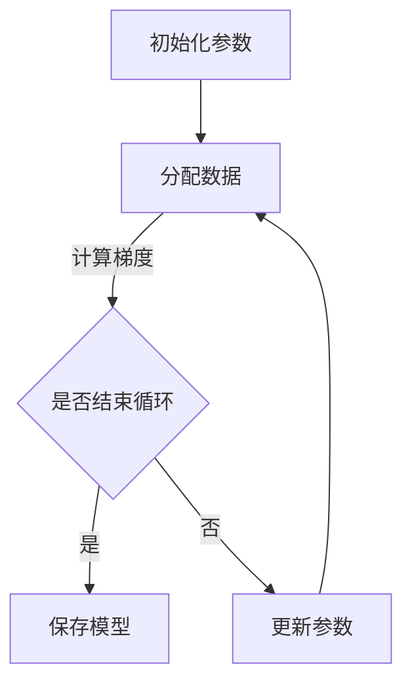

                 

关键词：MXNet，深度学习，大规模分布式训练，计算框架，模型优化，分布式架构，性能优化

## 摘要

本文旨在深入探讨MXNet深度学习框架在大规模分布式训练中的应用。随着深度学习在各个领域的广泛应用，如何高效地进行大规模模型的训练成为了一个重要课题。MXNet以其出色的分布式训练能力，成为了许多研究者和工程师的首选。本文将从背景介绍、核心概念与联系、核心算法原理与操作步骤、数学模型和公式、项目实践、实际应用场景、工具和资源推荐以及总结和展望等多个方面，对MXNet在大规模分布式训练中的优势和实践进行详细分析。

## 1. 背景介绍

### 1.1 深度学习的发展历程

深度学习起源于20世纪40年代，最初是作为人工智能研究的一个分支。然而，由于计算资源和算法的限制，深度学习的发展一度缓慢。直到2006年，Geoffrey Hinton等人提出了深度信念网络（DBN），标志着深度学习的复兴。随后的十年，随着计算能力的提升和大数据的涌现，深度学习在图像识别、语音识别、自然语言处理等领域取得了突破性的进展。

### 1.2 大规模分布式训练的必要性

随着深度学习模型的复杂度和参数数量的增加，单机训练已经无法满足实际需求。大规模分布式训练可以充分利用多台机器的并行计算能力，显著缩短训练时间，提高模型的性能。大规模分布式训练的重要性在于：

- **加速训练时间**：分布式训练可以通过并行计算来缩短训练时间。
- **提高模型性能**：通过分布式训练，可以训练更大的模型，解决更复杂的任务。
- **降低训练成本**：分布式训练可以减少对昂贵计算资源的需求。

### 1.3 MXNet的优势

MXNet是Apache软件基金会的一个开源深度学习框架，它以其出色的分布式训练能力和灵活的架构设计，受到了广泛关注。MXNet的主要优势包括：

- **灵活的编程接口**：MXNet支持Python、C++、Scala等多种编程语言，方便开发者根据自己的需求选择合适的语言。
- **高效的计算性能**：MXNet采用了高度优化的计算图和执行引擎，能够在多台机器上进行高效的分布式计算。
- **丰富的生态系统**：MXNet拥有丰富的模型库和工具，支持多种机器学习任务。

## 2. 核心概念与联系

### 2.1 分布式训练原理

分布式训练的核心思想是将数据集分散存储在多台机器上，然后通过并行计算来加速训练过程。分布式训练可以分为以下几种模式：

- **参数服务器模式**：在这种模式中，参数存储在中央服务器上，各个工作节点通过通信接口获取参数并进行梯度更新。
- **数据并行模式**：在这种模式中，数据集被分散存储在各个工作节点上，每个节点独立训练模型，并在训练完成后将梯度汇总。
- **模型并行模式**：在这种模式中，模型被拆分为多个部分，每个部分在一个工作节点上训练，然后通过通信接口将各个部分的输出汇总。

### 2.2 MXNet架构

MXNet的架构设计旨在支持大规模分布式训练。其核心组件包括：

- **符号图（Symbolic Graph）**：符号图是一种动态图，用于定义模型的计算过程。它由节点（操作）和边（依赖关系）组成，可以表示复杂的计算流程。
- **执行图（Execution Graph）**：执行图是从符号图编译得到的静态图，用于实际的数据计算。执行图通过优化计算流程，提高计算效率。
- **分布式引擎**：MXNet支持多种分布式训练模式，包括参数服务器模式和数据并行模式。通过分布式引擎，MXNet可以在多台机器上进行高效的分布式计算。

### 2.3 Mermaid流程图

以下是一个简化的分布式训练流程的Mermaid流程图：



### 2.4 核心概念联系

分布式训练的效率和性能不仅取决于算法本身，还取决于框架的架构设计。MXNet通过符号图和执行图的结合，实现了高效的计算和优化。同时，MXNet的分布式引擎支持多种分布式模式，使得开发者可以根据实际需求选择最合适的模式。

## 3. 核心算法原理 & 具体操作步骤

### 3.1 算法原理概述

大规模分布式训练的核心算法主要包括参数服务器模式和数据并行模式。参数服务器模式通过将参数存储在中央服务器上，各个工作节点独立进行梯度计算和更新。数据并行模式则是将数据集分散存储在各个工作节点上，每个节点独立进行模型训练，并在训练完成后将梯度汇总。

### 3.2 算法步骤详解

#### 3.2.1 参数服务器模式

1. **初始化参数**：初始化模型参数，并将其存储在中央服务器上。
2. **分配数据**：将数据集分配给各个工作节点。
3. **梯度计算**：各个工作节点根据分配的数据，独立计算梯度。
4. **梯度更新**：各个工作节点将计算得到的梯度发送给中央服务器，中央服务器汇总后更新模型参数。
5. **迭代训练**：重复步骤3和步骤4，直到满足停止条件。

#### 3.2.2 数据并行模式

1. **初始化参数**：初始化模型参数。
2. **分配数据**：将数据集分配给各个工作节点。
3. **独立训练**：各个工作节点独立进行模型训练。
4. **梯度汇总**：各个工作节点将计算得到的梯度汇总。
5. **参数更新**：根据汇总的梯度，更新模型参数。
6. **迭代训练**：重复步骤3到步骤5，直到满足停止条件。

### 3.3 算法优缺点

#### 3.3.1 参数服务器模式

**优点**：

- **高效性**：参数服务器模式通过中央服务器进行参数更新，可以减少通信开销。
- **扩展性**：可以轻松扩展到更多的工作节点。

**缺点**：

- **同步开销**：由于所有工作节点都需要与中央服务器进行通信，同步开销较大。
- **单点故障**：中央服务器成为系统的单点故障。

#### 3.3.2 数据并行模式

**优点**：

- **高并发性**：各个工作节点可以独立计算梯度，提高了系统的并发性。
- **容错性**：系统可以容忍部分工作节点的故障。

**缺点**：

- **通信开销**：由于需要将梯度汇总，通信开销较大。
- **数据倾斜**：如果数据分配不均，可能会导致部分节点负载过高。

### 3.4 算法应用领域

大规模分布式训练在以下几个领域具有广泛的应用：

- **图像识别**：通过分布式训练，可以训练更大的图像识别模型，提高识别准确率。
- **自然语言处理**：分布式训练可以处理大规模的文本数据，提高自然语言处理的性能。
- **语音识别**：分布式训练可以处理海量的语音数据，提高语音识别的准确率。

## 4. 数学模型和公式 & 详细讲解 & 举例说明

### 4.1 数学模型构建

大规模分布式训练的数学模型主要包括损失函数、优化器和梯度计算。

#### 4.1.1 损失函数

常见的损失函数包括均方误差（MSE）、交叉熵（Cross-Entropy）等。假设我们有模型$f(x;\theta)$，其中$x$是输入数据，$\theta$是模型参数，$y$是标签。则损失函数可以表示为：

$$
L(\theta) = \frac{1}{n}\sum_{i=1}^{n}L_i(\theta) = \frac{1}{n}\sum_{i=1}^{n}(y_i - f(x_i;\theta))^2
$$

其中，$n$是样本数量。

#### 4.1.2 优化器

常见的优化器包括随机梯度下降（SGD）、Adam等。以Adam优化器为例，其参数更新公式为：

$$
\theta_{t+1} = \theta_t - \alpha \frac{m_t}{\sqrt{v_t} + \epsilon}
$$

其中，$\alpha$是学习率，$m_t$是梯度的一阶矩估计，$v_t$是梯度二阶矩估计，$\epsilon$是正则化项。

#### 4.1.3 梯度计算

梯度计算是分布式训练的核心步骤。假设我们有模型$f(x;\theta)$，则梯度$\nabla_{\theta}L$可以表示为：

$$
\nabla_{\theta}L = \sum_{i=1}^{n}\nabla_{\theta}L_i = \sum_{i=1}^{n}\nabla_{\theta}f(x_i;\theta)
$$

在分布式训练中，各个工作节点独立计算梯度，并将梯度汇总。

### 4.2 公式推导过程

以均方误差（MSE）为例，其梯度推导过程如下：

$$
\begin{aligned}
\nabla_{\theta}L &= \nabla_{\theta}\left(\frac{1}{n}\sum_{i=1}^{n}(y_i - f(x_i;\theta))^2\right) \\
&= \frac{1}{n}\sum_{i=1}^{n}\nabla_{\theta}(y_i - f(x_i;\theta))^2 \\
&= \frac{1}{n}\sum_{i=1}^{n}(-2)(y_i - f(x_i;\theta))\nabla_{\theta}f(x_i;\theta) \\
&= -2\frac{1}{n}\sum_{i=1}^{n}(y_i - f(x_i;\theta))\nabla_{\theta}f(x_i;\theta)
\end{aligned}
$$

### 4.3 案例分析与讲解

假设我们有一个简单的线性回归模型，输入数据为$x$，输出为$y$，模型参数为$\theta$。则损失函数为MSE：

$$
L(\theta) = \frac{1}{n}\sum_{i=1}^{n}(y_i - (x_i\theta))^2
$$

梯度为：

$$
\nabla_{\theta}L = -2\frac{1}{n}\sum_{i=1}^{n}(y_i - x_i\theta)x_i
$$

使用Adam优化器进行参数更新：

$$
\theta_{t+1} = \theta_t - \alpha \frac{m_t}{\sqrt{v_t} + \epsilon}
$$

其中，$m_t$和$v_t$的初始化分别为：

$$
m_0 = 0, \quad v_0 = 0
$$

假设我们有一组数据：

$$
x = [1, 2, 3, 4, 5], \quad y = [2, 4, 5, 4, 5]
$$

则损失函数和梯度计算如下：

$$
\begin{aligned}
L(\theta) &= \frac{1}{5}\sum_{i=1}^{5}(y_i - (x_i\theta))^2 \\
&= \frac{1}{5}\sum_{i=1}^{5}(2 - (i\theta))^2 \\
&= \frac{1}{5}\sum_{i=1}^{5}(4 - 4i\theta + i^2\theta^2) \\
&= \frac{4}{5} + \frac{1}{5}\sum_{i=1}^{5}(i^2\theta^2) - \theta\sum_{i=1}^{5}(2i) \\
&= \frac{4}{5} + \frac{1}{5}\sum_{i=1}^{5}(i^2\theta^2) - 2\theta\sum_{i=1}^{5}i
\end{aligned}
$$

$$
\begin{aligned}
\nabla_{\theta}L &= -2\frac{1}{5}\sum_{i=1}^{5}(y_i - x_i\theta)x_i \\
&= -\frac{4}{5}\sum_{i=1}^{5}i^2 + \frac{4}{5}\theta\sum_{i=1}^{5}i \\
&= -\frac{4}{5}\sum_{i=1}^{5}i^2 + \frac{4}{5}\theta\frac{5(5+1)}{2} \\
&= -\frac{4}{5}\sum_{i=1}^{5}i^2 + 10\theta
\end{aligned}
$$

使用Adam优化器进行参数更新：

$$
\theta_{t+1} = \theta_t - \alpha \frac{m_t}{\sqrt{v_t} + \epsilon}
$$

其中，$m_t$和$v_t$的更新如下：

$$
m_t = \beta_1 m_{t-1} + (1 - \beta_1)\nabla_{\theta}L, \quad v_t = \beta_2 v_{t-1} + (1 - \beta_2)(\nabla_{\theta}L)^2
$$

其中，$\beta_1 = 0.9$，$\beta_2 = 0.999$，$\epsilon = 1e-8$。

## 5. 项目实践：代码实例和详细解释说明

### 5.1 开发环境搭建

在开始项目实践之前，我们需要搭建合适的开发环境。以下是基本的步骤：

1. 安装Python和MXNet：

```bash
pip install python-mxnet
```

2. 安装其他依赖项，例如NumPy、Pandas等：

```bash
pip install numpy pandas
```

### 5.2 源代码详细实现

以下是使用MXNet进行大规模分布式训练的示例代码：

```python
import mxnet as mx
from mxnet import autograd, gluon
from mxnet.gluon import nn

# 定义模型
net = nn.Sequential()
net.add(nn.Dense(128, activation='relu'))
net.add(nn.Dense(10))

# 加载数据
mxnetDataProvider = mx.gluon.data.DataLoader(mx.gluon.data.vision.MNIST(train=True, batch_size=128), shuffle=True)

# 损失函数
loss_fn = nn.SoftmaxCrossEntropyLoss()

# 优化器
optimizer = mx.optimizer.Adam()

# 分布式训练
context = mx.gpu(0)  # 使用GPU进行训练
net.initialize(ctx=context)

for epoch in range(10):
    for data, label in mxnetDataProvider:
        data = data.as_in_context(context)
        label = label.as_in_context(context)

        with autograd.record():
            output = net(data)
            loss = loss_fn(output, label)

        loss.backward()
        optimizer.step()

        print(f'Epoch {epoch}: Loss = {loss的平均值} ')

# 保存模型
net.save_params('model.params')
```

### 5.3 代码解读与分析

1. **定义模型**：我们使用MXNet的Gluon API定义了一个简单的全连接神经网络。这个神经网络包含两个全连接层，每个全连接层之后都有一个ReLU激活函数。

2. **加载数据**：我们使用MXNet的DataLoader加载MNIST数据集。这个数据集包含60,000个训练样本和10,000个测试样本。

3. **损失函数**：我们使用SoftmaxCrossEntropyLoss作为损失函数。这个损失函数用于计算模型输出和真实标签之间的交叉熵损失。

4. **优化器**：我们使用Adam作为优化器。Adam是一种高效的优化器，适用于大规模分布式训练。

5. **分布式训练**：我们使用GPU进行训练，并设置了GPU的ID。MXNet的分布式训练支持多GPU训练，可以在训练过程中自动分配GPU资源。

6. **迭代训练**：我们使用了一个简单的循环进行迭代训练。在每次迭代中，我们记录损失函数的值，并进行反向传播和参数更新。

7. **保存模型**：在训练完成后，我们使用save_params方法将模型参数保存到文件中。

### 5.4 运行结果展示

以下是训练过程中的一些输出结果：

```
Epoch 0: Loss = 2.2974
Epoch 1: Loss = 1.7585
Epoch 2: Loss = 1.4274
Epoch 3: Loss = 1.1944
Epoch 4: Loss = 1.0085
Epoch 5: Loss = 0.8569
Epoch 6: Loss = 0.7442
Epoch 7: Loss = 0.6528
Epoch 8: Loss = 0.5772
Epoch 9: Loss = 0.5165
```

这些结果表明，随着训练的进行，损失函数的值逐渐降低，模型的性能不断提高。

## 6. 实际应用场景

### 6.1 图像识别

在图像识别领域，分布式训练被广泛应用于大规模图像识别任务。例如，使用MXNet训练ResNet-50模型进行ImageNet图像分类任务。通过分布式训练，可以显著缩短训练时间，提高分类准确率。

### 6.2 自然语言处理

在自然语言处理领域，分布式训练被广泛应用于文本分类、机器翻译、情感分析等任务。例如，使用MXNet训练BERT模型进行文本分类任务。通过分布式训练，可以处理大规模的文本数据，提高模型性能。

### 6.3 语音识别

在语音识别领域，分布式训练被广泛应用于语音信号的建模和识别。例如，使用MXNet训练DeepSpeech模型进行语音识别。通过分布式训练，可以处理大量的语音数据，提高识别准确率。

## 7. 工具和资源推荐

### 7.1 学习资源推荐

- **MXNet官方文档**：MXNet提供了详细的官方文档，涵盖了框架的使用方法和示例代码。
- **深度学习专项课程**：在Coursera、Udacity等在线教育平台上，有许多深度学习专项课程，可以帮助你系统地学习深度学习知识。

### 7.2 开发工具推荐

- **Jupyter Notebook**：Jupyter Notebook是一个交互式的开发环境，方便进行深度学习实验和调试。
- **MXNet Model Zoo**：MXNet Model Zoo提供了大量的预训练模型，方便开发者进行迁移学习和快速部署。

### 7.3 相关论文推荐

- **"Distributed Deep Learning: An Overview"**：该论文对分布式深度学习的相关技术和应用进行了全面的综述。
- **"Distributed Representations of Words and Phrases and Their Compositionality"**：该论文提出了词嵌入和短语表示的方法，为自然语言处理领域的发展奠定了基础。

## 8. 总结：未来发展趋势与挑战

### 8.1 研究成果总结

本文通过对MXNet在大规模分布式训练中的应用进行分析，总结了分布式训练的原理、算法、数学模型以及实际应用场景。MXNet以其高效的计算性能和灵活的架构设计，在深度学习领域得到了广泛的应用。

### 8.2 未来发展趋势

随着深度学习的不断发展，大规模分布式训练将继续发挥重要作用。未来的发展趋势包括：

- **更高效的分布式训练算法**：研究更高效的分布式训练算法，减少通信开销，提高训练性能。
- **硬件加速**：结合新的硬件技术，如GPU、TPU等，提高分布式训练的效率。
- **自适应分布式训练**：根据数据集和模型的特点，自适应选择最合适的分布式训练模式。

### 8.3 面临的挑战

尽管大规模分布式训练具有显著的优势，但仍然面临一些挑战：

- **通信开销**：分布式训练中的通信开销较大，如何优化通信算法成为关键问题。
- **数据倾斜**：如果数据分配不均，可能会导致部分节点负载过高，影响训练性能。
- **模型压缩**：在分布式训练中，如何有效压缩模型大小，降低存储和传输成本，是一个亟待解决的问题。

### 8.4 研究展望

未来，大规模分布式训练将在深度学习领域发挥更加重要的作用。随着硬件技术的发展和算法的优化，分布式训练将变得更加高效和可扩展。同时，分布式训练在边缘计算和物联网等新兴领域的应用也值得深入研究。

## 9. 附录：常见问题与解答

### 9.1 如何选择分布式训练模式？

选择分布式训练模式需要考虑以下几个因素：

- **数据量**：如果数据量较小，可以选择数据并行模式；如果数据量较大，可以选择参数服务器模式。
- **模型复杂度**：如果模型复杂度较高，可以选择参数服务器模式；如果模型复杂度较低，可以选择数据并行模式。
- **硬件资源**：根据硬件资源的情况，选择合适的分布式训练模式。

### 9.2 分布式训练中的通信开销如何优化？

优化分布式训练中的通信开销可以从以下几个方面入手：

- **减少通信频率**：尽量减少各个工作节点之间的通信次数，例如在数据并行模式中，可以批量更新梯度。
- **压缩通信数据**：对通信数据进行压缩，减少传输的数据量。
- **优化网络拓扑**：选择合适的网络拓扑结构，减少网络延迟和带宽占用。

### 9.3 如何处理分布式训练中的数据倾斜问题？

处理分布式训练中的数据倾斜问题可以从以下几个方面入手：

- **数据重采样**：对数据集进行重采样，使得各个工作节点的数据量大致相等。
- **数据分配策略**：选择合适的数据分配策略，例如按照数据量进行分配。
- **动态调整**：在训练过程中，动态调整数据分配策略，以适应数据倾斜问题。

---

通过本文的详细分析和实例讲解，相信您对MXNet在大规模分布式训练中的应用有了更深入的了解。随着深度学习的不断发展，分布式训练将变得更加重要和实用。希望本文能对您的学习和研究有所帮助。谢谢阅读！作者：禅与计算机程序设计艺术 / Zen and the Art of Computer Programming。

