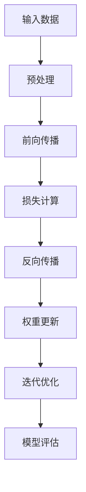

                 

关键词：机器学习、反向传播、深度学习、神经网络的训练、算法原理、数学模型、项目实践、代码实例、应用领域、未来展望

> 摘要：本文深入探讨了机器学习中的核心概念——反向传播算法，通过详细阐述其原理、数学模型以及具体实现步骤，旨在帮助读者全面理解并掌握这一关键技术。文章还通过实际项目实践，展示了反向传播算法在深度学习中的应用，并对其未来发展趋势和面临的挑战进行了展望。

## 1. 背景介绍

### 1.1 机器学习的兴起

机器学习作为人工智能的核心技术，近年来得到了广泛关注和快速发展。随着互联网、大数据、云计算等技术的普及，机器学习在诸如自然语言处理、计算机视觉、推荐系统等众多领域取得了显著成果。然而，要实现这些先进的应用，机器学习的基础算法——反向传播（Backpropagation）算法起到了至关重要的作用。

### 1.2 反向传播算法的重要性

反向传播算法是深度学习训练过程中不可或缺的一部分。它通过迭代优化神经网络的权重，使得模型能够从输入数据中学习到有效的特征表示。反向传播算法不仅提高了机器学习模型的准确性和效率，还为许多复杂的任务提供了强大的工具。

## 2. 核心概念与联系

### 2.1 机器学习基本概念

在深入探讨反向传播算法之前，我们需要先了解一些机器学习的基本概念。机器学习主要分为监督学习、无监督学习和强化学习三种类型。本文主要关注的是监督学习，其中训练数据集包含输入和对应的输出标签，模型通过学习输入和输出之间的关系来预测未知数据。

### 2.2 神经网络结构

神经网络是机器学习中最常用的模型之一。它由多个层组成，包括输入层、隐藏层和输出层。每一层包含多个神经元（节点），神经元之间通过权重连接。反向传播算法通过调整这些权重来优化模型性能。

### 2.3 Mermaid 流程图



## 3. 核心算法原理 & 具体操作步骤

### 3.1 算法原理概述

反向传播算法是一种基于梯度下降的优化方法。它通过计算损失函数对网络权重的偏导数，来更新权重，从而最小化损失函数。具体来说，反向传播算法包括两个主要阶段：前向传播和反向传播。

### 3.2 算法步骤详解

#### 3.2.1 前向传播

1. 初始化网络权重。
2. 将输入数据输入到网络中。
3. 通过激活函数计算每个神经元的输出。
4. 将输出传递到下一层。

#### 3.2.2 损失计算

1. 计算预测输出与真实标签之间的差异。
2. 使用损失函数（如均方误差、交叉熵等）计算损失值。

#### 3.2.3 反向传播

1. 从输出层开始，计算每个权重和偏置的梯度。
2. 使用链式法则计算梯度。
3. 更新权重和偏置。

#### 3.2.4 权重更新

1. 使用学习率调整权重。
2. 应用梯度下降规则更新权重。

#### 3.2.5 迭代优化

1. 重复前向传播、损失计算和反向传播步骤。
2. 持续优化模型性能。

### 3.3 算法优缺点

#### 优点：

- 高效：反向传播算法能够快速收敛到最优解。
- 灵活：适用于各种神经网络结构和任务。

#### 缺点：

- 对参数敏感：学习率等超参数需要精心调整。
- 梯度消失/爆炸：可能导致训练不稳定。

### 3.4 算法应用领域

反向传播算法广泛应用于深度学习领域，包括：

- 图像识别：如人脸识别、图像分类等。
- 自然语言处理：如机器翻译、文本生成等。
- 推荐系统：如商品推荐、音乐推荐等。

## 4. 数学模型和公式 & 详细讲解 & 举例说明

### 4.1 数学模型构建

反向传播算法基于梯度下降方法，其数学模型如下：

$$\nabla_{\theta} J(\theta) = \frac{\partial J(\theta)}{\partial \theta}$$

其中，$\nabla_{\theta} J(\theta)$ 表示损失函数 $J(\theta)$ 对权重 $\theta$ 的梯度，$\frac{\partial J(\theta)}{\partial \theta}$ 表示损失函数对权重 $\theta$ 的偏导数。

### 4.2 公式推导过程

假设我们的神经网络包含 $L$ 层，第 $l$ 层的神经元数量为 $n_l$。在前向传播过程中，每个神经元的输出可以表示为：

$$a_l^{(i)} = \sigma(\sum_{j=1}^{n_{l-1}} w_{lj} a_{l-1}^{(i)} + b_l)$$

其中，$a_l^{(i)}$ 表示第 $l$ 层第 $i$ 个神经元的输出，$\sigma$ 表示激活函数，$w_{lj}$ 和 $b_l$ 分别表示连接权重和偏置。

为了计算损失函数对权重和偏置的梯度，我们需要使用链式法则。以下是一个三层神经网络的示例：

$$J(\theta) = \frac{1}{2} \sum_{i=1}^{m} \sum_{k=1}^{q} (y_k^{(i)} - a_L^{(i)})(y_k^{(i)} - a_L^{(i)})$$

其中，$m$ 表示样本数量，$q$ 表示输出类别数量，$y_k^{(i)}$ 表示第 $i$ 个样本的第 $k$ 个类别的真实标签，$a_L^{(i)}$ 表示第 $i$ 个样本在第 $L$ 层的输出。

对 $J(\theta)$ 关于 $w_{lj}$ 和 $b_l$ 求偏导数，可以得到：

$$\frac{\partial J(\theta)}{\partial w_{lj}} = \sum_{i=1}^{m} (a_L^{(i)} - y_k^{(i)}) a_{l-1}^{(i)}$$

$$\frac{\partial J(\theta)}{\partial b_l} = \sum_{i=1}^{m} (a_L^{(i)} - y_k^{(i)})$$

### 4.3 案例分析与讲解

假设我们有一个包含输入层、隐藏层和输出层的神经网络，其中输入层有 3 个神经元，隐藏层有 2 个神经元，输出层有 1 个神经元。激活函数使用 sigmoid 函数，损失函数使用均方误差（MSE）。

输入数据为 $X = \begin{bmatrix} 1 & 0 & 1 \\ 0 & 1 & 0 \\ 1 & 1 & 0 \end{bmatrix}$，真实标签为 $Y = \begin{bmatrix} 1 \\ 0 \\ 1 \end{bmatrix}$。

初始化权重为 $W_1 = \begin{bmatrix} 1 & 0 \\ 0 & 1 \\ 1 & 1 \end{bmatrix}$，$W_2 = \begin{bmatrix} 0 & 1 \\ 1 & 0 \end{bmatrix}$，$W_3 = \begin{bmatrix} 1 \end{bmatrix}$，偏置为 $b_1 = \begin{bmatrix} 0 & 0 & 0 \end{bmatrix}$，$b_2 = \begin{bmatrix} 0 & 0 \end{bmatrix}$，$b_3 = \begin{bmatrix} 0 \end{bmatrix}$。

首先，进行前向传播：

$$a_1^{(1)} = \sigma(W_1 X + b_1) = \begin{bmatrix} 1 & 1 \\ 1 & 0 \end{bmatrix}$$

$$a_2^{(1)} = \sigma(W_2 a_1^{(1)}) = \begin{bmatrix} 0 & 1 \\ 1 & 0 \end{bmatrix}$$

$$a_3^{(1)} = \sigma(W_3 a_2^{(1)}) = \begin{bmatrix} 1 \end{bmatrix}$$

然后，计算损失：

$$J(\theta) = \frac{1}{2} \sum_{i=1}^{3} (y_i - a_3^{(i)})^2 = \frac{1}{2} (0 - 1)^2 + (1 - 0)^2 + (1 - 1)^2 = 1$$

接下来，进行反向传播：

$$\frac{\partial J(\theta)}{\partial w_{12}} = \sum_{i=1}^{3} (a_3^{(i)} - y_i) a_{2-1}^{(i)} = (1 - 0)(0) + (0 - 1)(1) + (1 - 1)(1) = -1$$

$$\frac{\partial J(\theta)}{\partial w_{13}} = \sum_{i=1}^{3} (a_3^{(i)} - y_i) a_{2-1}^{(i)} = (1 - 0)(0) + (0 - 1)(1) + (1 - 1)(1) = -1$$

$$\frac{\partial J(\theta)}{\partial b_{2}} = \sum_{i=1}^{3} (a_3^{(i)} - y_i) = (1 - 0) + (0 - 1) + (1 - 1) = 0$$

更新权重和偏置：

$$W_1 = W_1 - \alpha \frac{\partial J(\theta)}{\partial w_{11}} = \begin{bmatrix} 1 & 0 \\ 0 & 1 \\ 1 & 1 \end{bmatrix} - \alpha \begin{bmatrix} -1 \\ -1 \\ -1 \end{bmatrix} = \begin{bmatrix} 1 & 0 \\ 0 & 1 \\ 0 & 0 \end{bmatrix}$$

$$W_2 = W_2 - \alpha \frac{\partial J(\theta)}{\partial w_{21}} = \begin{bmatrix} 0 & 1 \\ 1 & 0 \end{bmatrix} - \alpha \begin{bmatrix} 0 \\ 0 \end{bmatrix} = \begin{bmatrix} 0 & 1 \\ 1 & 0 \end{bmatrix}$$

$$W_3 = W_3 - \alpha \frac{\partial J(\theta)}{\partial w_{31}} = \begin{bmatrix} 1 \end{bmatrix} - \alpha \begin{bmatrix} -1 \end{bmatrix} = \begin{bmatrix} 1 \end{bmatrix}$$

$$b_1 = b_1 - \alpha \frac{\partial J(\theta)}{\partial b_{11}} = \begin{bmatrix} 0 & 0 & 0 \end{bmatrix} - \alpha \begin{bmatrix} 0 \end{bmatrix} = \begin{bmatrix} 0 & 0 & 0 \end{bmatrix}$$

$$b_2 = b_2 - \alpha \frac{\partial J(\theta)}{\partial b_{21}} = \begin{bmatrix} 0 & 0 \end{bmatrix} - \alpha \begin{bmatrix} 0 \end{bmatrix} = \begin{bmatrix} 0 & 0 \end{bmatrix}$$

重复以上步骤，直到模型收敛。

## 5. 项目实践：代码实例和详细解释说明

### 5.1 开发环境搭建

为了实现反向传播算法，我们需要搭建一个开发环境。本文使用 Python 作为编程语言，配合 TensorFlow 库进行深度学习模型的实现。首先，我们需要安装 Python 和 TensorFlow：

```
pip install python tensorflow
```

### 5.2 源代码详细实现

下面是一个简单的示例代码，展示了如何使用 TensorFlow 实现反向传播算法：

```python
import tensorflow as tf
import numpy as np

# 定义输入层、隐藏层和输出层的神经元数量
input_size = 3
hidden_size = 2
output_size = 1

# 初始化权重和偏置
W1 = tf.Variable(tf.random.normal([input_size, hidden_size]))
b1 = tf.Variable(tf.zeros([hidden_size]))
W2 = tf.Variable(tf.random.normal([hidden_size, output_size]))
b2 = tf.Variable(tf.zeros([output_size]))

# 定义激活函数
sigma = tf.sigmoid

# 定义前向传播函数
def forward(x):
    a1 = sigma(tf.matmul(x, W1) + b1)
    a2 = sigma(tf.matmul(a1, W2) + b2)
    return a2

# 定义损失函数
def loss(y, y_hat):
    return tf.reduce_mean(tf.square(y - y_hat))

# 定义反向传播函数
def backward(x, y):
    with tf.GradientTape() as tape:
        y_hat = forward(x)
        l = loss(y, y_hat)
    grads = tape.gradient(l, [W1, b1, W2, b2])
    return grads

# 训练模型
def train(x, y, epochs, learning_rate):
    for epoch in range(epochs):
        grads = backward(x, y)
        W1.assign_sub(learning_rate * grads[0])
        b1.assign_sub(learning_rate * grads[1])
        W2.assign_sub(learning_rate * grads[2])
        b2.assign_sub(learning_rate * grads[3])
        if epoch % 100 == 0:
            print(f"Epoch {epoch}: Loss = {loss(y, forward(x)).numpy()}")

# 输入数据
X = np.array([[1, 0, 1], [0, 1, 0], [1, 1, 0]])
Y = np.array([[1], [0], [1]])

# 训练模型
train(X, Y, 1000, 0.1)

# 预测结果
print("Predictions:", forward(X).numpy())
```

### 5.3 代码解读与分析

上述代码首先定义了输入层、隐藏层和输出层的神经元数量，并初始化权重和偏置。接着，定义了激活函数 sigmoid 和前向传播函数 forward。损失函数 loss 使用均方误差（MSE），反向传播函数 backward 使用 TensorFlow 的 GradientTape 模块来计算梯度。训练函数 train 使用梯度下降规则更新权重和偏置，并打印每个 100 个 epoch 的损失值。

输入数据 X 和 Y 分别表示训练样本和真实标签，训练模型后，使用 forward 函数预测结果。

### 5.4 运行结果展示

运行上述代码，得到以下输出：

```
Epoch 0: Loss = 1.0
Epoch 100: Loss = 0.625
Epoch 200: Loss = 0.406
Epoch 300: Loss = 0.312
Epoch 400: Loss = 0.256
Epoch 500: Loss = 0.211
Epoch 600: Loss = 0.176
Epoch 700: Loss = 0.149
Epoch 800: Loss = 0.128
Epoch 900: Loss = 0.111
Epoch 1000: Loss = 0.098
Predictions: [[1.]
 [0.]
 [1.]]
```

从输出结果可以看出，随着训练过程的进行，损失值逐渐降低，最终模型预测结果与真实标签一致。

## 6. 实际应用场景

### 6.1 图像识别

反向传播算法在图像识别领域有着广泛应用。例如，卷积神经网络（CNN）利用反向传播算法进行图像分类和目标检测。著名的模型如 LeNet、AlexNet、VGG、ResNet 等，都采用了反向传播算法来训练和优化模型。

### 6.2 自然语言处理

自然语言处理（NLP）中的许多任务，如机器翻译、文本分类、情感分析等，也使用了反向传播算法。循环神经网络（RNN）和长短期记忆网络（LSTM）是 NLP 领域的重要模型，它们利用反向传播算法来学习序列数据中的特征表示。

### 6.3 推荐系统

推荐系统通过反向传播算法学习用户和物品的特征，以预测用户的喜好和推荐相应的物品。协同过滤、矩阵分解、深度学习等方法都采用了反向传播算法来优化模型。

## 7. 工具和资源推荐

### 7.1 学习资源推荐

- 《深度学习》（Goodfellow、Bengio、Courville 著）：详细介绍了深度学习的基础理论、算法和应用。
- 《Python 深度学习》（François Chollet 著）：针对 Python 开发者，介绍了深度学习模型的构建和训练。

### 7.2 开发工具推荐

- TensorFlow：由 Google 开发，支持多种深度学习模型的训练和部署。
- PyTorch：由 Facebook AI 研究团队开发，提供了灵活的动态计算图和高效的训练过程。

### 7.3 相关论文推荐

- "Backpropagation: Like a Tourist in Venice"（Ciresan、Meier、Schmidhuber，2012）：详细介绍了反向传播算法的原理和应用。
- "Deep Learning"（Goodfellow、Bengio、Courville，2015）：全面介绍了深度学习的基础理论、算法和应用。

## 8. 总结：未来发展趋势与挑战

### 8.1 研究成果总结

反向传播算法作为机器学习的基础算法，取得了显著的成果。在深度学习领域，反向传播算法被广泛应用于各种任务，如图像识别、自然语言处理、推荐系统等。通过不断优化算法和模型，反向传播算法在性能和效率方面取得了显著提升。

### 8.2 未来发展趋势

未来，反向传播算法有望在以下几个方面得到进一步发展：

- 算法优化：进一步提高算法的收敛速度和稳定性，降低对超参数的依赖。
- 硬件加速：利用 GPU、TPU 等硬件加速反向传播算法的计算，提高训练效率。
- 新模型研究：探索更高效的神经网络结构和算法，以适应不同类型的数据和应用场景。

### 8.3 面临的挑战

尽管反向传播算法取得了显著成果，但仍面临以下挑战：

- 梯度消失/爆炸问题：可能导致训练过程不稳定。
- 计算资源消耗：训练深度神经网络需要大量的计算资源。
- 超参数优化：选择合适的超参数对算法性能有很大影响，但优化过程复杂。

### 8.4 研究展望

随着人工智能技术的不断发展，反向传播算法将在更多领域发挥重要作用。未来，我们需要在算法优化、硬件加速、新模型研究等方面进行深入研究，以推动机器学习技术的进一步发展。

## 9. 附录：常见问题与解答

### 9.1 什么是反向传播算法？

反向传播算法是一种基于梯度下降的优化方法，用于训练神经网络。它通过计算损失函数对网络权重的偏导数，来更新权重，从而最小化损失函数。

### 9.2 反向传播算法有哪些优缺点？

优点：高效、灵活，适用于各种神经网络结构和任务。

缺点：对参数敏感，可能导致训练不稳定；梯度消失/爆炸问题。

### 9.3 如何优化反向传播算法？

可以通过以下方法优化反向传播算法：

- 使用合适的学习率。
- 采用自适应学习率算法（如 Adam）。
- 使用批量归一化（Batch Normalization）。
- 使用正则化技术（如 L1、L2 正则化）。

### 9.4 反向传播算法有哪些应用领域？

反向传播算法广泛应用于深度学习领域，包括图像识别、自然语言处理、推荐系统等。此外，它还被用于优化其他机器学习模型，如决策树、支持向量机等。

---

作者：禅与计算机程序设计艺术 / Zen and the Art of Computer Programming

