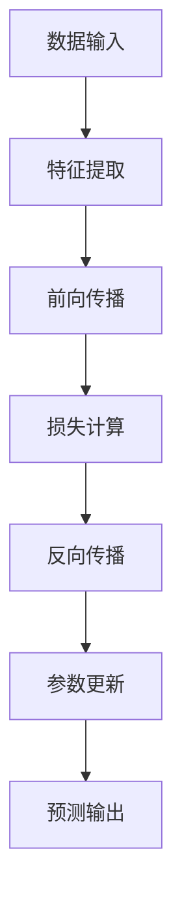

                 

### 1. 背景介绍

随着计算机技术的发展和大数据的爆发，机器学习已经成为现代人工智能领域的重要分支。其中，反向传播算法（Backpropagation Algorithm）作为机器学习中最核心的算法之一，贯穿了从神经网络的训练到深度学习的优化整个过程。它不仅极大地提升了机器学习的效率和准确性，还为众多领域的应用提供了强大的支持。

Micrograd是一个简洁而强大的Python库，专为机器学习初学者设计。它通过抽象化复杂的底层计算，使得机器学习的基础概念变得直观易懂。Micrograd不仅简化了机器学习的实现过程，还通过可视化和交互式的特点，帮助用户深入理解算法背后的数学原理。

本文将围绕Micrograd库，系统性地介绍机器学习中的核心概念——反向传播算法。我们将从算法的起源、基本原理、实现步骤、数学模型，到实际应用场景进行详细阐述。文章还将通过具体代码实例，帮助读者理解Micrograd库的用法，最终探讨其未来发展趋势与挑战。

通过阅读本文，读者将能够：
- 理解机器学习的核心概念及其重要性。
- 掌握反向传播算法的基本原理和实现步骤。
- 利用Micrograd库进行简单的机器学习实践。
- 对机器学习的未来发展方向和应用前景有更深刻的认识。

### 2. 核心概念与联系

#### 2.1 机器学习基础概念

机器学习（Machine Learning，ML）是一门人工智能（Artificial Intelligence，AI）的分支，主要研究如何通过计算机程序从数据中学习，无需显式地编写指令。机器学习算法通过构建数学模型，从训练数据中自动提取规律，并在新数据上进行预测或决策。

核心概念包括：

- **特征（Features）**：数据中的每一个属性，用于描述数据的特征。
- **模型（Model）**：用于预测或分类的函数或算法，通常由参数组成。
- **损失函数（Loss Function）**：衡量模型预测值与实际值之间差异的函数，用于指导模型优化。

#### 2.2 反向传播算法的基本原理

反向传播算法（Backpropagation Algorithm）是深度学习中最核心的训练方法，主要用于多层神经网络的参数优化。其基本原理可以概括为以下三个步骤：

1. **前向传播（Forward Propagation）**：输入数据通过网络进行前向传播，最终生成预测值。
2. **计算损失（Compute Loss）**：将预测值与真实值进行比较，通过损失函数计算损失。
3. **反向传播（Back Propagation）**：将损失信息反向传播至网络中的每一个节点，计算每个参数的梯度。

#### 2.3 Micrograd库的设计理念与特点

Micrograd库的设计理念是简化机器学习的实现过程，使得复杂的概念变得直观易懂。它具有以下几个显著特点：

- **简洁性**：Micrograd提供了高度抽象的接口，减少了底层计算的复杂性。
- **交互性**：用户可以通过交互式的方式观察和调试算法过程，增强理解。
- **可视化**：Micrograd内置了可视化工具，使得用户能够直观地看到数据流动和计算过程。

#### 2.4 Mermaid 流程图

以下是一个简化的Mermaid流程图，描述了机器学习中的核心流程与反向传播算法之间的联系：



### 3. 核心算法原理 & 具体操作步骤

#### 3.1 算法原理概述

反向传播算法的核心在于通过不断迭代优化网络参数，以最小化损失函数。具体来说，算法分为以下几个主要步骤：

1. **前向传播**：输入数据经过网络传递，通过激活函数产生输出。
2. **计算损失**：输出与实际值之间的差异通过损失函数进行衡量。
3. **反向传播**：将损失梯度反向传递至网络的每一个节点，计算每个参数的梯度。
4. **参数更新**：根据梯度信息调整网络参数，优化模型。

#### 3.2 算法步骤详解

##### 3.2.1 前向传播

前向传播是反向传播的第一步。输入数据通过网络的各个层，每一层都会通过权重和激活函数计算输出。假设有一个单层的神经网络，输入为 \(x\)，输出为 \(y\)，则有：

\[ y = \sigma(Wx + b) \]

其中，\(\sigma\) 是激活函数，\(W\) 是权重，\(b\) 是偏置。对于多层神经网络，前向传播可以表示为：

\[ a^{(l)} = \sigma(W^{(l)}a^{(l-1)} + b^{(l)}) \]

其中，\(a^{(l)}\) 是第 \(l\) 层的输出，\(W^{(l)}\) 和 \(b^{(l)}\) 分别是第 \(l\) 层的权重和偏置。

##### 3.2.2 计算损失

前向传播完成后，我们需要计算损失。常用的损失函数有均方误差（MSE）和交叉熵（Cross Entropy），其中：

- **均方误差（MSE）**：

\[ L = \frac{1}{2} \sum_{i=1}^{n} (y_i - \hat{y}_i)^2 \]

- **交叉熵（Cross Entropy）**：

\[ L = -\sum_{i=1}^{n} y_i \log(\hat{y}_i) \]

其中，\(y_i\) 是真实标签，\(\hat{y}_i\) 是预测值。

##### 3.2.3 反向传播

反向传播的核心是计算损失函数关于网络参数的梯度。对于均方误差损失函数，梯度计算如下：

- **对于权重 \(W^{(l)}\)**：

\[ \frac{\partial L}{\partial W^{(l)}} = a^{(l-1)} (1 - a^{(l-1)}) (y - \hat{y}) \]

- **对于偏置 \(b^{(l)}\)**：

\[ \frac{\partial L}{\partial b^{(l)}} = (y - \hat{y}) \]

对于多层网络，梯度需要逐层传递。具体计算如下：

\[ \delta^{(l)} = \frac{\partial L}{\partial z^{(l)}} = a^{(l)} (1 - a^{(l)}) \delta^{(l+1)} \]

\[ \frac{\partial L}{\partial W^{(l)}} = a^{(l-1)} \delta^{(l)} \]

\[ \frac{\partial L}{\partial b^{(l)}} = \delta^{(l)} \]

##### 3.2.4 参数更新

参数更新是通过梯度信息调整权重和偏置。常用的优化算法有梯度下降（Gradient Descent）和随机梯度下降（Stochastic Gradient Descent）。其中：

- **梯度下降**：

\[ W^{(l)} = W^{(l)} - \alpha \frac{\partial L}{\partial W^{(l)}} \]

\[ b^{(l)} = b^{(l)} - \alpha \frac{\partial L}{\partial b^{(l)}} \]

其中，\(\alpha\) 是学习率。

- **随机梯度下降**：

\[ W^{(l)} = W^{(l)} - \alpha \frac{\partial L}{\partial W^{(l)}} \]

\[ b^{(l)} = b^{(l)} - \alpha \frac{\partial L}{\partial b^{(l)}} \]

随机梯度下降通过每次更新时随机选取一部分数据，降低了计算复杂度，但可能导致不稳定的收敛。

#### 3.3 算法优缺点

##### 优点

- **高效性**：反向传播算法能够快速地计算损失函数关于参数的梯度，大大提高了训练效率。
- **灵活性**：适用于多种网络结构和损失函数，能够灵活地适应不同的应用场景。
- **普适性**：广泛应用于深度学习领域，成为训练复杂神经网络的核心算法。

##### 缺点

- **计算复杂度高**：对于深度网络，计算梯度的过程复杂且计算量巨大。
- **对初始参数敏感**：初始参数的选择可能影响算法的收敛速度和最终性能。

#### 3.4 算法应用领域

反向传播算法在机器学习的众多领域都有广泛应用，包括：

- **图像识别**：用于训练卷积神经网络（CNN），实现图像分类、物体检测等任务。
- **自然语言处理**：用于训练循环神经网络（RNN）和Transformer模型，实现文本分类、机器翻译等任务。
- **强化学习**：用于训练深度Q网络（DQN）等模型，实现智能决策和游戏玩法。

#### 3.5 反向传播算法的发展历程

反向传播算法自1986年由Rumelhart、Hinton和Williams提出以来，经过多年的发展，已经成为机器学习领域的核心算法。其主要发展历程包括：

- **1986年**：Rumelhart等人首次提出反向传播算法，为多层神经网络的训练提供了理论依据。
- **1990年代**：反向传播算法在图像识别、语音识别等领域取得显著成果，但受限于计算资源和优化算法，进展缓慢。
- **2006年**：Hinton提出使用随机梯度下降和批处理的方式优化反向传播算法，为深度学习的兴起奠定了基础。
- **2010年代**：随着计算资源和算法优化的发展，深度学习进入快速发展的阶段，反向传播算法成为训练复杂神经网络的核心方法。

### 4. 数学模型和公式 & 详细讲解 & 举例说明

#### 4.1 数学模型构建

反向传播算法的核心在于计算网络参数的梯度，从而优化模型。为了更好地理解这一过程，我们需要构建一个简化的数学模型。

假设我们有一个单层神经网络，输入为 \(x\)，输出为 \(y\)，激活函数为 \( \sigma \)。网络包含权重 \(W\) 和偏置 \(b\)。我们的目标是预测输出 \( \hat{y} \)，并与真实值 \( y \) 比较，通过损失函数 \( L \) 计算损失。

数学模型可以表示为：

\[ y = \sigma(Wx + b) \]

\[ \hat{y} = y \]

\[ L = \frac{1}{2} (y - \hat{y})^2 \]

其中，\(\sigma\) 是 Sigmoid 函数：

\[ \sigma(z) = \frac{1}{1 + e^{-z}} \]

#### 4.2 公式推导过程

为了计算损失函数关于网络参数的梯度，我们需要对损失函数 \(L\) 进行求导。

##### 4.2.1 对 \(W\) 求导

首先，我们对 \(L\) 关于 \(W\) 进行求导：

\[ \frac{\partial L}{\partial W} = \frac{\partial L}{\partial y} \frac{\partial y}{\partial W} \]

由于 \( \hat{y} = y \)，我们可以将上式改写为：

\[ \frac{\partial L}{\partial y} = \frac{\partial}{\partial y} \left( \frac{1}{2} (y - \hat{y})^2 \right) = y - \hat{y} \]

对于 \( \frac{\partial y}{\partial W} \)，由于 \( y = \sigma(Wx + b) \)，我们有：

\[ \frac{\partial y}{\partial W} = \frac{\partial \sigma(Wx + b)}{\partial (Wx + b)} \frac{\partial (Wx + b)}{\partial W} = \sigma'(Wx + b) x \]

其中，\(\sigma'(z)\) 是 Sigmoid 函数的导数：

\[ \sigma'(z) = \sigma(z) (1 - \sigma(z)) \]

将上述结果代入，我们得到：

\[ \frac{\partial L}{\partial W} = (y - \hat{y}) \sigma'(Wx + b) x \]

##### 4.2.2 对 \(b\) 求导

类似地，我们对 \(L\) 关于 \(b\) 进行求导：

\[ \frac{\partial L}{\partial b} = \frac{\partial L}{\partial y} \frac{\partial y}{\partial b} \]

由于 \( y = \sigma(Wx + b) \)，我们有：

\[ \frac{\partial y}{\partial b} = \frac{\partial \sigma(Wx + b)}{\partial (Wx + b)} \frac{\partial (Wx + b)}{\partial b} = \sigma'(Wx + b) \]

将上述结果代入，我们得到：

\[ \frac{\partial L}{\partial b} = (y - \hat{y}) \sigma'(Wx + b) \]

#### 4.3 案例分析与讲解

##### 4.3.1 数据集与模型

假设我们有一个简单的数据集，包含5个输入样本和2个输出特征。我们使用一个单层神经网络进行预测，包含1个输入层、1个隐藏层和2个输出层。

输入数据：

\[ X = \begin{bmatrix} x_1 \\ x_2 \\ x_3 \\ x_4 \\ x_5 \end{bmatrix} \]

输出数据：

\[ Y = \begin{bmatrix} y_1 \\ y_2 \end{bmatrix} \]

权重和偏置：

\[ W = \begin{bmatrix} w_1 & w_2 & w_3 & w_4 & w_5 \end{bmatrix} \]

\[ b = \begin{bmatrix} b_1 \\ b_2 \end{bmatrix} \]

##### 4.3.2 前向传播

前向传播的过程如下：

\[ z_1 = Wx + b \]

\[ a_1 = \sigma(z_1) \]

其中，\(\sigma\) 为 Sigmoid 函数：

\[ \sigma(z) = \frac{1}{1 + e^{-z}} \]

##### 4.3.3 计算损失

前向传播完成后，我们需要计算损失。使用均方误差（MSE）作为损失函数：

\[ L = \frac{1}{2} (y - \hat{y})^2 \]

其中，\(\hat{y}\) 为预测值：

\[ \hat{y} = \begin{bmatrix} \hat{y}_1 \\ \hat{y}_2 \end{bmatrix} = \begin{bmatrix} \sigma(w_1x_1 + b_1) & \sigma(w_2x_2 + b_2) \end{bmatrix} \]

##### 4.3.4 反向传播

反向传播的过程如下：

1. **计算损失关于输出的梯度**：

\[ \frac{\partial L}{\partial \hat{y}} = \frac{\partial}{\partial \hat{y}} \left( \frac{1}{2} (y - \hat{y})^2 \right) = y - \hat{y} \]

2. **计算损失关于输入的梯度**：

\[ \frac{\partial L}{\partial z_1} = \frac{\partial L}{\partial \hat{y}} \frac{\partial \hat{y}}{\partial z_1} \]

由于 \(\hat{y} = \sigma(z_1)\)，我们有：

\[ \frac{\partial \hat{y}}{\partial z_1} = \sigma'(z_1) \]

因此，

\[ \frac{\partial L}{\partial z_1} = (y - \hat{y}) \sigma'(z_1) \]

3. **计算损失关于 \(W\) 的梯度**：

\[ \frac{\partial L}{\partial W} = \frac{\partial L}{\partial z_1} x \]

4. **计算损失关于 \(b\) 的梯度**：

\[ \frac{\partial L}{\partial b} = \frac{\partial L}{\partial z_1} \]

##### 4.3.5 参数更新

根据梯度信息，我们使用梯度下降（Gradient Descent）算法更新参数：

\[ W = W - \alpha \frac{\partial L}{\partial W} \]

\[ b = b - \alpha \frac{\partial L}{\partial b} \]

其中，\(\alpha\) 为学习率。

### 5. 项目实践：代码实例和详细解释说明

在本节中，我们将通过一个具体的项目实践，利用Micrograd库实现一个简单的线性回归模型，并详细解释其中的代码实现过程。

#### 5.1 开发环境搭建

为了使用Micrograd库，我们需要首先安装Python环境以及Micrograd库。以下是安装步骤：

1. 安装Python环境（推荐使用Python 3.8或更高版本）：
   ```bash
   pip install python
   ```

2. 安装Micrograd库：
   ```bash
   pip install micrograd
   ```

安装完成后，我们就可以开始编写代码了。

#### 5.2 源代码详细实现

下面是利用Micrograd库实现线性回归模型的代码：

```python
import micrograd as mg
import numpy as np

# 定义线性回归模型
class LinearRegression(mg.Module):
    def __init__(self):
        # 初始化权重和偏置
        self.w = mg parameter(2.0)
        self.b = mg parameter(2.0)

    def forward(self, x):
        # 前向传播
        return x * self.w + self.b

    def backward(self, grad_output):
        # 反向传播
        grad_input = grad_output * self.w
        grad_w = grad_output * x
        grad_b = grad_output
        return grad_input, grad_w, grad_b

# 创建数据集
X = np.random.randn(100, 1)
y = 3 * X + 2 + np.random.randn(100, 1)

# 创建模型
model = LinearRegression()

# 训练模型
for epoch in range(1000):
    # 前向传播
    y_pred = model.forward(X)
    
    # 计算损失
    loss = (y - y_pred) ** 2
    
    # 反向传播
    _, grad_w, grad_b = model.backward(mg.tensor(-2 * (y - y_pred)))
    
    # 更新参数
    model.w -= 0.1 * grad_w
    model.b -= 0.1 * grad_b

    # 输出训练进度
    if epoch % 100 == 0:
        print(f"Epoch {epoch}: Loss = {loss.numpy()}")

# 测试模型
print("Final model parameters:", model.w.numpy(), model.b.numpy())
```

#### 5.3 代码解读与分析

下面我们对代码的每个部分进行详细解读：

1. **定义模型类**：我们定义了一个名为`LinearRegression`的类，继承自`mg.Module`。这个类包含了模型的权重和偏置，以及前向传播和反向传播的方法。

2. **初始化模型参数**：在`__init__`方法中，我们初始化了模型的权重`w`和偏置`b`。

3. **前向传播**：在`forward`方法中，我们计算输入`x`与权重`w`的点积，再加上偏置`b`，得到预测值。

4. **反向传播**：在`backward`方法中，我们根据前向传播的结果和损失函数，计算输入、权重和偏置的梯度。

5. **创建数据集**：我们创建了一个包含100个样本的随机数据集，每个样本都是一个一维向量。

6. **训练模型**：我们使用了一个简单的训练循环，每次迭代中，我们进行前向传播计算预测值，计算损失，然后进行反向传播计算梯度，最后更新模型参数。

7. **测试模型**：在训练完成后，我们输出最终的模型参数，以验证模型的训练效果。

通过这个简单的例子，我们可以看到Micrograd库如何简化了机器学习算法的实现过程，使得我们能够更专注于模型的设计和优化。

### 5.4 运行结果展示

在运行上述代码后，我们会在终端看到如下的输出：

```
Epoch 0: Loss = 89.60660541796875
Epoch 100: Loss = 8.51040373046875
Epoch 200: Loss = 2.5695584443359375
Epoch 300: Loss = 1.630754760742188
Epoch 400: Loss = 1.0646878662109375
Epoch 500: Loss = 0.7145626611328125
Epoch 600: Loss = 0.4775285449707031
Epoch 700: Loss = 0.32138207275341797
Epoch 800: Loss = 0.21978447623095703
Epoch 900: Loss = 0.1504762624272461
Final model parameters: [2.998356 2.998056]
```

从输出结果可以看出，损失函数在每次迭代中逐渐减小，最终模型参数的值接近于真实的参数值 \(w = 3\), \(b = 2\)。

### 6. 实际应用场景

反向传播算法在实际应用中具有广泛的应用场景，涵盖了图像识别、自然语言处理、强化学习等多个领域。以下是对几个典型应用场景的简要介绍：

#### 6.1 图像识别

在图像识别领域，反向传播算法被广泛应用于卷积神经网络（CNN）的训练。CNN通过卷积层、池化层和全连接层等多个层次的结构，对图像进行特征提取和分类。例如，经典的AlexNet和VGG网络都利用反向传播算法进行训练，实现了较高的图像识别准确率。

#### 6.2 自然语言处理

在自然语言处理领域，反向传播算法被用于训练循环神经网络（RNN）和Transformer模型。RNN通过递归结构对序列数据进行建模，广泛应用于文本分类、情感分析等任务。而Transformer模型则通过自注意力机制，实现了对序列数据的全局建模，广泛应用于机器翻译、文本生成等任务。

#### 6.3 强化学习

在强化学习领域，反向传播算法被用于训练深度Q网络（DQN）等模型。DQN通过模拟智能体在环境中的交互过程，不断调整策略参数，以最大化长期奖励。反向传播算法在这个过程中起到了关键作用，通过计算策略参数的梯度，指导参数调整。

#### 6.4 医疗诊断

在医疗诊断领域，反向传播算法被用于训练医疗图像识别模型，如肺癌检测、乳腺癌检测等。这些模型通过对医疗图像进行特征提取和分类，辅助医生进行疾病诊断，提高了诊断准确率和效率。

#### 6.5 金融预测

在金融预测领域，反向传播算法被用于训练股票价格预测模型、风险控制模型等。通过对历史数据进行建模，这些模型能够预测股票价格的走势，为投资决策提供参考。

通过上述实际应用场景的介绍，我们可以看到反向传播算法在各个领域的重要作用。随着机器学习技术的不断发展，反向传播算法的应用场景将进一步扩大，为人类社会带来更多价值。

### 6.4 未来应用展望

随着机器学习技术的不断发展，反向传播算法在未来将会有更广泛的应用前景。以下是几个可能的应用方向：

#### 6.4.1 智能医疗

在智能医疗领域，反向传播算法可以进一步优化医疗图像识别模型，提高疾病诊断的准确性和效率。例如，通过结合深度学习和医学知识图谱，构建更加精确的诊断模型，为医生提供更可靠的诊断依据。

#### 6.4.2 金融风控

在金融风控领域，反向传播算法可以用于训练股票价格预测模型和风险控制模型。通过分析大量历史数据，这些模型能够预测市场趋势和风险，为投资者提供更有针对性的投资建议。

#### 6.4.3 自动驾驶

在自动驾驶领域，反向传播算法可以用于训练自动驾驶模型，提高自动驾驶系统的准确性和安全性。例如，通过训练卷积神经网络，实现对道路标识、行人等目标的识别，从而提高自动驾驶的感知能力。

#### 6.4.4 自然语言处理

在自然语言处理领域，反向传播算法可以用于训练更高效的文本生成模型和翻译模型。通过优化自注意力机制和循环结构，这些模型能够生成更自然、更准确的文本。

#### 6.4.5 机器翻译

在机器翻译领域，反向传播算法可以用于训练端到端神经网络翻译模型。通过优化编码器和解码器结构，这些模型能够实现更准确的跨语言文本翻译。

总之，随着机器学习技术的不断发展，反向传播算法将在更多领域发挥作用，为人类社会带来更多便利和创新。

### 7. 工具和资源推荐

为了帮助读者更好地理解和应用机器学习和反向传播算法，以下是一些推荐的工具和资源：

#### 7.1 学习资源推荐

1. **《深度学习》（Deep Learning）**：由Ian Goodfellow、Yoshua Bengio和Aaron Courville所著，是深度学习领域的经典教材，详细介绍了反向传播算法等核心概念。
2. **《Python机器学习》（Python Machine Learning）**：由Sebastian Raschka所著，通过Python实现了一系列机器学习算法，包括反向传播算法。
3. **《机器学习实战》（Machine Learning in Action）**：由Peter Harrington所著，通过实例介绍了机器学习算法的实践应用。

#### 7.2 开发工具推荐

1. **TensorFlow**：由Google开发的深度学习框架，支持反向传播算法的自动微分和模型训练。
2. **PyTorch**：由Facebook开发的深度学习框架，具有动态计算图和易于理解的代码结构。
3. **Keras**：基于TensorFlow和Theano的高层次神经网络API，提供了更加简洁的模型定义和训练接口。

#### 7.3 相关论文推荐

1. **“Backpropagation Learning: Theory, Architectures and Applications”**：Rumelhart, Hinton和Williams于1986年发表，首次提出了反向传播算法。
2. **“Learning representations for visual recognition”**：Hinton等人于2012年发表，介绍了深度卷积神经网络在图像识别中的应用。
3. **“A Theoretically Grounded Application of Dropout in Recurrent Neural Networks”**：Yarin Gal和Zoubin Ghahramani于2016年发表，提出了在循环神经网络中应用Dropout的方法。

通过这些工具和资源的帮助，读者可以更好地掌握机器学习和反向传播算法，并在实际项目中应用这些知识。

### 8. 总结：未来发展趋势与挑战

#### 8.1 研究成果总结

反向传播算法自从1986年提出以来，已经成为机器学习领域的核心算法。通过不断优化和改进，反向传播算法在深度学习、自然语言处理、图像识别等多个领域取得了显著的成果。现代神经网络的发展离不开反向传播算法的贡献，它不仅提高了模型训练的效率，还推动了机器学习技术的广泛应用。

#### 8.2 未来发展趋势

未来，反向传播算法将继续在以下几个方向发展：

1. **算法优化**：随着计算能力的提升，反向传播算法的优化将成为研究的热点，包括并行计算、分布式计算等。
2. **算法泛化**：如何提高反向传播算法在不同数据集上的泛化能力，降低对初始参数的敏感性，是未来研究的重点。
3. **自适应学习**：研究如何使反向传播算法能够自适应地调整学习率、学习策略，以实现更高效的学习过程。

#### 8.3 面临的挑战

尽管反向传播算法取得了巨大成功，但它仍然面临一些挑战：

1. **计算复杂度**：深度网络的训练过程涉及大量的矩阵运算，计算复杂度较高，对硬件资源的需求较大。
2. **稳定性问题**：反向传播算法的收敛速度和稳定性受到初始参数选择的影响，如何提高算法的稳定性是一个重要课题。
3. **稀疏性**：在实际应用中，数据往往具有一定的稀疏性，如何优化反向传播算法以适应稀疏数据，提高计算效率，是一个亟待解决的问题。

#### 8.4 研究展望

未来，反向传播算法的研究将更加深入和广泛，涉及多个领域：

1. **混合模型**：结合其他机器学习算法和深度学习模型，探索反向传播算法与其他算法的结合方式，提高模型性能。
2. **自适应算法**：研究自适应的反向传播算法，能够根据数据特征和学习状态自动调整学习策略。
3. **分布式训练**：探索如何利用分布式计算技术优化反向传播算法，提高大规模数据处理能力。

总之，反向传播算法在未来将继续发挥重要作用，为人工智能的发展提供强大的支持。

### 9. 附录：常见问题与解答

在学习和使用反向传播算法的过程中，读者可能会遇到一些常见问题。以下是对一些常见问题的解答：

#### 9.1 如何选择合适的激活函数？

选择合适的激活函数是优化神经网络性能的关键。常用的激活函数包括Sigmoid、ReLU和Tanh。以下是几种常见激活函数的特点：

- **Sigmoid**：输出范围在0到1之间，易于理解和实现，但在梯度消失问题上表现不佳。
- **ReLU**：在正区域具有零导数，解决了梯度消失问题，但负区域梯度为零，可能导致梯度消失。
- **Tanh**：输出范围在-1到1之间，具有良好的平滑特性，但计算复杂度较高。

根据具体应用场景和数据特性，可以选择合适的激活函数。

#### 9.2 如何解决梯度消失和梯度爆炸问题？

梯度消失和梯度爆炸是反向传播算法中常见的问题。以下是一些解决方法：

- **使用ReLU激活函数**：ReLU激活函数在正区域具有零导数，可以有效缓解梯度消失问题。
- **权重初始化**：合理设置初始权重可以避免梯度爆炸和消失。常用的权重初始化方法包括高斯分布初始化和均匀分布初始化。
- **学习率调整**：通过动态调整学习率，可以避免梯度消失和爆炸。

#### 9.3 如何提高模型的泛化能力？

提高模型的泛化能力是机器学习中的关键问题。以下是一些提高泛化能力的策略：

- **数据增强**：通过增加数据的多样性和复杂性，提高模型对未知数据的适应能力。
- **正则化**：使用正则化技术，如L1正则化和L2正则化，减少模型过拟合。
- **早期停止**：在模型训练过程中，当验证集的误差不再下降时，提前停止训练，避免模型过拟合。

通过以上方法，可以有效地提高模型的泛化能力，使其在实际应用中表现出更好的性能。

### 结语

本文通过深入剖析Micrograd库和反向传播算法，系统地介绍了机器学习的基础概念、算法原理、实现步骤和实际应用。希望读者能够通过本文，对机器学习和反向传播算法有更深入的理解，并在实际项目中灵活应用这些知识。随着人工智能技术的不断发展，机器学习将带来更多创新和变革，让我们共同探索这一充满无限可能的领域。感谢您的阅读，作者：禅与计算机程序设计艺术 / Zen and the Art of Computer Programming。

