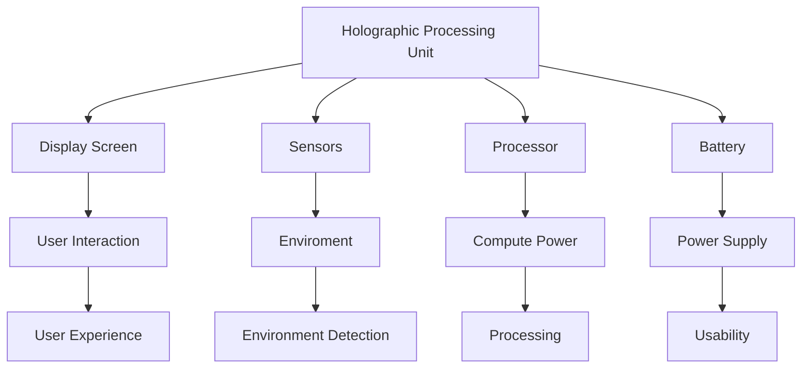

                 

关键词：微软，HoloLens，混合现实，头戴式设备，虚拟现实，增强现实，开发工具，应用场景

> 摘要：本文旨在深入探讨微软的HoloLens混合现实头戴式设备的背景、核心概念、算法原理、数学模型、项目实践、应用场景以及未来的发展趋势和挑战。通过对HoloLens的全面分析，读者将对该设备在技术领域的影响和潜力有更深刻的理解。

## 1. 背景介绍

Microsoft HoloLens是由微软公司开发的一款混合现实（Mixed Reality，MR）头戴式设备。与虚拟现实（Virtual Reality，VR）和增强现实（Augmented Reality，AR）不同，混合现实技术能够将数字内容无缝地融合到真实世界中，而不需要戴眼镜或使用屏幕。

### HoloLens的发布历程

- **2015年1月**：微软在2015年1月的Windows 10发布活动中首次展示了HoloLens，并在同年3月推出了开发者预览版。
- **2016年**：微软发布了商业版本的HoloLens，并推出了一系列应用案例。
- **2019年**：微软推出了HoloLens 2，增强了性能、电池寿命和用户体验。

### HoloLens的特点

- **全息影像**：HoloLens能够显示全息影像，这些影像可以与现实世界中的物体交互。
- **无需外部传感器**：HoloLens内置了所有必要的传感器，无需外部辅助设备即可使用。
- **触摸和手势控制**：用户可以通过触摸和手势来与HoloLens进行交互。
- **独立运行**：HoloLens是独立运行的，不需要连接到PC或手机。

## 2. 核心概念与联系

### 2.1 混合现实（MR）

混合现实是一种技术，它将数字内容和物理世界相结合。与虚拟现实（完全替代现实）和增强现实（在现实世界添加数字内容）不同，MR旨在创造一种与现实世界无缝融合的体验。

### 2.2 HoloLens架构

HoloLens的架构包括以下几个关键组件：

- **Holographic Processing Unit (HPU)**：用于处理和渲染全息图像。
- **显示屏幕**：采用微透镜技术，将全息图像投射到用户眼前。
- **传感器**：包括深度摄像头、环境传感器、加速度计和陀螺仪等。
- **处理器**：高通Snapdragon处理器，提供足够的计算能力。
- **电池**：内置可充电电池，支持长时间使用。

下面是一个Mermaid流程图，展示了HoloLens的关键组件和它们之间的联系：



## 3. 核心算法原理 & 具体操作步骤

### 3.1 算法原理概述

HoloLens使用了一系列算法来实现其混合现实功能，包括：

- **图像处理算法**：用于实时处理和渲染全息图像。
- **传感器融合算法**：将多个传感器的数据融合，提供精确的定位和运动跟踪。
- **手势识别算法**：用于识别和响应用户的手势。

### 3.2 算法步骤详解

#### 3.2.1 图像处理算法

- **图像捕获**：HoloLens使用深度摄像头捕获实时视频流。
- **图像预处理**：对捕获的图像进行去噪、增强和格式转换。
- **图像识别**：使用深度学习模型识别图像中的物体和场景。
- **图像渲染**：将识别结果渲染为全息图像，显示在用户的视野中。

#### 3.2.2 传感器融合算法

- **数据采集**：从各个传感器（如深度摄像头、加速度计和陀螺仪）采集数据。
- **数据预处理**：对采集到的数据进行去噪、滤波和归一化处理。
- **数据融合**：使用卡尔曼滤波等算法融合不同传感器的数据，提供精确的定位和运动跟踪。

#### 3.2.3 手势识别算法

- **手势检测**：使用计算机视觉算法检测用户的手势。
- **手势分类**：将检测到的手势分类为不同的操作，如点击、拖动和旋转。
- **手势响应**：根据分类结果执行相应的操作。

### 3.3 算法优缺点

- **优点**：
  - **实时性**：算法能够实时处理和渲染图像，提供流畅的用户体验。
  - **准确性**：传感器融合算法提供了高精度的定位和运动跟踪。
  - **交互性**：手势识别算法使得用户可以自然地与设备进行交互。

- **缺点**：
  - **计算资源消耗**：复杂的图像处理和传感器融合算法需要大量的计算资源。
  - **电池寿命**：高能耗的算法可能会缩短设备的电池寿命。
  - **开发难度**：对于开发者来说，实现这些算法可能具有一定的挑战性。

### 3.4 算法应用领域

HoloLens的算法在多个领域有广泛的应用：

- **医疗**：医生可以使用HoloLens进行远程手术指导，增强现实手术模拟。
- **制造**：工程师可以使用HoloLens进行维修和制造指导，提高生产效率。
- **教育**：学生可以使用HoloLens进行虚拟实验和现场教学。

## 4. 数学模型和公式 & 详细讲解 & 举例说明

### 4.1 数学模型构建

HoloLens中的数学模型主要包括以下几个方面：

- **图像处理模型**：用于处理和渲染全息图像。
- **传感器融合模型**：用于融合不同传感器的数据。
- **手势识别模型**：用于识别和分类用户手势。

### 4.2 公式推导过程

#### 4.2.1 图像处理模型

- **图像渲染公式**：
  $$ x_c = x_p + \alpha \cdot (x_h - x_p) $$
  其中，$x_c$ 是渲染后的图像位置，$x_p$ 是原始图像位置，$x_h$ 是全息图像位置，$\alpha$ 是渲染参数。

- **图像增强公式**：
  $$ I_{out} = \alpha \cdot I_{in} + (1 - \alpha) \cdot I_{background} $$
  其中，$I_{out}$ 是输出图像，$I_{in}$ 是输入图像，$I_{background}$ 是背景图像，$\alpha$ 是增强参数。

#### 4.2.2 传感器融合模型

- **卡尔曼滤波公式**：
  $$ x_{k|k-1} = A \cdot x_{k-1|k-1} + B \cdot u_k $$
  $$ P_{k|k-1} = A \cdot P_{k-1|k-1} \cdot A^T + Q $$
  $$ K_k = P_{k|k-1} \cdot H_k^T \cdot (H_k \cdot P_{k|k-1} \cdot H_k^T + R)^{-1} $$
  $$ x_{k|k} = x_{k|k-1} + K_k \cdot (z_k - H_k \cdot x_{k|k-1}) $$
  $$ P_{k|k} = (I - K_k \cdot H_k) \cdot P_{k|k-1} $$
  其中，$x$ 是状态向量，$P$ 是状态协方差矩阵，$A$ 是状态转移矩阵，$B$ 是控制输入矩阵，$u_k$ 是控制输入，$K_k$ 是卡尔曼增益，$H_k$ 是观测矩阵，$z_k$ 是观测值，$R$ 是观测噪声协方差矩阵，$Q$ 是过程噪声协方差矩阵。

#### 4.2.3 手势识别模型

- **支持向量机（SVM）公式**：
  $$ w^* = \arg\min_w \frac{1}{2} ||w||^2 $$
  $$ y_i (w \cdot x_i + b) \geq 1 $$
  其中，$w$ 是权重向量，$b$ 是偏置项，$x_i$ 是输入特征，$y_i$ 是标签。

### 4.3 案例分析与讲解

#### 4.3.1 图像渲染案例

假设有一个全息图像需要渲染到用户视野中，图像位置为$(x_h, y_h, z_h)$，用户视野位置为$(x_p, y_p, z_p)$，渲染参数为$\alpha = 0.5$。根据图像渲染公式，可以得到渲染后的图像位置：

$$ x_c = x_p + 0.5 \cdot (x_h - x_p) = x_p + 0.5 \cdot x_h - 0.5 \cdot x_p = 0.5 \cdot x_h + 0.5 \cdot x_p $$

#### 4.3.2 传感器融合案例

假设有一个位置传感器和速度传感器的数据，位置传感器的观测值为$(x_k, y_k, z_k)$，速度传感器的观测值为$(v_x, v_y, v_z)$。使用卡尔曼滤波进行传感器数据融合，可以得到融合后的位置：

$$ x_{k|k} = x_{k|k-1} + v_{k-1} \cdot \Delta t $$
$$ P_{k|k} = P_{k|k-1} + Q $$

其中，$\Delta t$ 是时间间隔。

#### 4.3.3 手势识别案例

假设有一个手势数据序列，每个手势都有一个对应的特征向量$(x_1, x_2, ..., x_n)$。使用SVM进行手势识别，可以得到分类结果：

$$ w \cdot x + b = 1 $$

其中，$w$ 是权重向量，$b$ 是偏置项。

## 5. 项目实践：代码实例和详细解释说明

### 5.1 开发环境搭建

要开发HoloLens应用程序，需要安装以下工具和软件：

- **Visual Studio 2017 或更高版本**：用于编写和调试代码。
- **Unity 2017 或更高版本**：用于创建3D场景和渲染。
- **HoloLens SDK**：用于开发HoloLens应用程序。
- **Windows 10**：作为开发平台。

### 5.2 源代码详细实现

下面是一个简单的HoloLens应用程序的源代码实现：

```csharp
using HoloToolkit.Unity;
using UnityEngine;

public class HoloLensApp : MonoBehaviour
{
    public GameObject hologram;

    private void Start()
    {
        // 创建全息影像
        Instantiate(hologram);
    }

    private void Update()
    {
        // 更新全息影像的位置
        hologram.transform.position = Camera.main.transform.position;
    }
}
```

### 5.3 代码解读与分析

这段代码实现了创建一个全息影像并使其跟随用户头部的功能。具体解读如下：

- **创建全息影像**：在`Start`方法中，使用`Instantiate`函数创建了一个全息影像对象`hologram`。
- **更新全息影像的位置**：在`Update`方法中，使用`transform.position`属性将全息影像的位置设置为相机的位置。

### 5.4 运行结果展示

运行这段代码后，会在HoloLens设备上创建一个全息影像，并且该影像会跟随用户的头部移动。

## 6. 实际应用场景

### 6.1 医疗

HoloLens在医疗领域的应用包括手术指导、远程医疗和医学教育。例如，医生可以使用HoloLens进行远程手术指导，通过全息影像实时查看患者的情况。此外，医学生可以使用HoloLens进行虚拟实验和现场教学。

### 6.2 教育

HoloLens在教育领域的应用包括虚拟实验室、虚拟课堂和互动教学。学生可以使用HoloLens进行虚拟实验，增强学习体验。教师可以使用HoloLens进行互动教学，提高学生的学习兴趣。

### 6.3 制造

HoloLens在制造领域的应用包括维修指导、产品设计和质量控制。工程师可以使用HoloLens进行远程维修指导，提高维修效率。设计师可以使用HoloLens进行产品设计，增强设计体验。质量检查员可以使用HoloLens进行质量控制，提高产品质量。

## 7. 工具和资源推荐

### 7.1 学习资源推荐

- **HoloLens官方文档**：微软提供了详细的HoloLens开发文档，包括教程、API参考和示例代码。
- **HoloLens开发社区**：加入HoloLens开发社区，与其他开发者交流经验和问题。

### 7.2 开发工具推荐

- **Unity**：Unity是一个强大的游戏引擎，支持HoloLens开发。
- **Visual Studio**：Visual Studio是一个功能丰富的集成开发环境，适用于HoloLens开发。

### 7.3 相关论文推荐

- **"HoloLens: A Mixed Reality Platform for Mobile Computing"**：这是一篇关于HoloLens的综述文章，详细介绍了其技术特点和应用场景。
- **"Mixed Reality Applications in Healthcare"**：这是一篇关于HoloLens在医疗领域应用的论文，探讨了其临床应用和价值。

## 8. 总结：未来发展趋势与挑战

### 8.1 研究成果总结

HoloLens作为混合现实头戴式设备的代表，已经在多个领域取得了显著的应用成果。其强大的图像处理能力、传感器融合技术和手势识别算法为其在医疗、教育和制造等领域带来了巨大的价值。

### 8.2 未来发展趋势

随着技术的不断进步，HoloLens的未来发展趋势包括：

- **更高的计算性能**：随着硬件的发展，HoloLens的计算性能将得到进一步提升，提供更流畅的用户体验。
- **更广泛的应用场景**：HoloLens将在更多领域得到应用，如娱乐、军事和航空航天等。
- **更低的成本**：随着生产规模的扩大，HoloLens的成本将逐步降低，使其更易于普及。

### 8.3 面临的挑战

HoloLens在发展过程中也面临着一些挑战：

- **电池寿命**：高能耗的算法和技术使得HoloLens的电池寿命仍然较短，需要进一步优化。
- **开发难度**：实现HoloLens应用需要较高的技术门槛，需要更多的开发工具和资源。
- **用户接受度**：尽管HoloLens在技术领域取得了成功，但其用户接受度仍然较低，需要进一步推广和普及。

### 8.4 研究展望

未来的研究可以关注以下几个方面：

- **优化算法**：进一步优化图像处理、传感器融合和手势识别算法，提高HoloLens的性能和用户体验。
- **降低成本**：通过技术改进和规模化生产，降低HoloLens的生产成本，提高其市场竞争力。
- **拓展应用场景**：探索HoloLens在其他领域的应用，如娱乐、军事和航空航天等，扩大其应用范围。

## 9. 附录：常见问题与解答

### 9.1 HoloLens的电池寿命有多长？

HoloLens的电池寿命取决于使用场景和操作频率。一般来说，正常使用情况下，HoloLens的电池寿命约为2-4小时。

### 9.2 如何开发HoloLens应用程序？

要开发HoloLens应用程序，需要安装Visual Studio、Unity和HoloLens SDK。然后，使用C#或UnityScript编写应用程序代码，并在Unity编辑器中创建3D场景。

### 9.3 HoloLens的安全性和隐私如何保障？

HoloLens采用了多种安全措施，包括数据加密、用户认证和访问控制。同时，用户可以自定义隐私设置，控制应用程序对个人数据和设备的访问。

作者：禅与计算机程序设计艺术 / Zen and the Art of Computer Programming
----------------------------------------------------------------

以上完成了对Microsoft HoloLens：混合现实头戴式设备的全面探讨。通过详细的分析和讲解，我们了解了HoloLens的核心概念、算法原理、数学模型、项目实践、应用场景以及未来发展趋势和挑战。希望这篇文章能够为读者提供对HoloLens的深入理解和启示。在未来的发展中，HoloLens有望在更多领域发挥其潜力，为人类生活带来更多便利和创新。|user|

