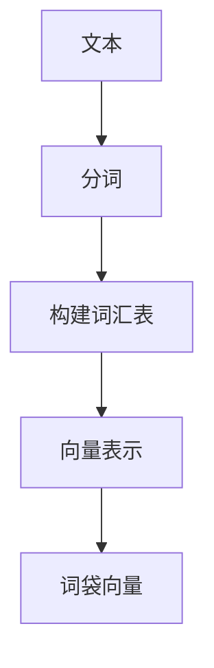
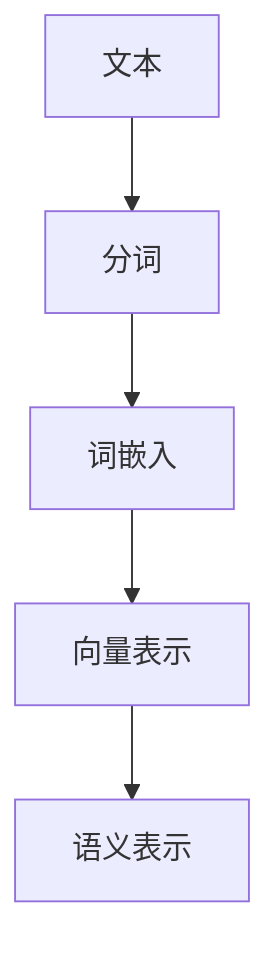

                 

关键词：自然语言处理（NLP）、词袋模型、词嵌入、语义表示、语言模型、深度学习

> 摘要：本文深入探讨了自然语言处理（NLP）中的基础概念，从传统的词袋模型到现代的词嵌入技术，全面解析了语言模型构建的演进过程。文章不仅介绍了核心概念和原理，还通过实际代码实例展示了词嵌入在NLP中的应用。最后，我们展望了未来NLP的发展趋势和挑战。

## 1. 背景介绍

自然语言处理（NLP）是人工智能（AI）领域的一个重要分支，旨在让计算机理解和处理人类语言。从最初的手动标注文本到自动化文本分析，NLP经历了显著的变革。这一过程中，词袋模型和词嵌入等技术的提出和优化，极大地推动了NLP的发展。

词袋模型（Bag of Words，BoW）是最早应用于文本表示的方法之一。它将文本转化为向量，从而便于计算机处理。然而，词袋模型在捕捉语义信息方面存在局限性。随着深度学习技术的发展，词嵌入（Word Embedding）技术逐渐兴起，通过将词汇映射到高维空间，使得语义相似的词汇在空间中靠近。

本文将首先介绍词袋模型的基本概念和原理，然后深入探讨词嵌入技术的不同实现方法，包括神经网络模型和分布式表示。最后，我们将通过实际项目实例，展示词嵌入在NLP中的应用。

## 2. 核心概念与联系

### 2.1 词袋模型

词袋模型是一种将文本转换为向量的方法，它不考虑词汇的顺序，只关注词汇出现的频率。一个简单的词袋模型通常包含以下步骤：

1. **分词**：将文本分解为单词或词组。
2. **构建词汇表**：创建一个包含所有独特词汇的列表。
3. **向量表示**：为每个词袋中的词汇分配一个唯一的索引，然后构建一个向量，其中每个元素表示该词汇在文本中出现的频率。

下面是一个Mermaid流程图，展示了词袋模型的基本架构：



### 2.2 词嵌入

词嵌入是将词汇映射到高维空间中的方法，使得语义相似的词汇在空间中靠近。词嵌入可以通过以下几种方法实现：

1. **分布式表示**：将每个词汇表示为一个固定长度的向量，这些向量通常通过训练数据学习得到。
2. **神经网络模型**：使用神经网络模型学习词汇之间的语义关系，例如Word2Vec和GloVe。

下面是一个Mermaid流程图，展示了词嵌入的基本架构：



## 3. 核心算法原理 & 具体操作步骤

### 3.1 算法原理概述

词袋模型的核心思想是将文本转换为向量，从而便于计算机处理。具体步骤如下：

1. **分词**：将文本分解为单词或词组。
2. **构建词汇表**：创建一个包含所有独特词汇的列表。
3. **向量表示**：为每个词袋中的词汇分配一个唯一的索引，然后构建一个向量，其中每个元素表示该词汇在文本中出现的频率。

词嵌入的核心思想是将词汇映射到高维空间中，使得语义相似的词汇在空间中靠近。具体步骤如下：

1. **分词**：将文本分解为单词或词组。
2. **词嵌入**：使用预训练模型或神经网络模型将每个词汇映射到高维空间。
3. **向量表示**：将词嵌入后的向量作为文本的语义表示。

### 3.2 算法步骤详解

#### 3.2.1 词袋模型

1. **分词**：使用自然语言处理库（如NLTK）对文本进行分词。
   ```python
   from nltk.tokenize import word_tokenize
   tokens = word_tokenize(text)
   ```

2. **构建词汇表**：创建一个包含所有独特词汇的列表。
   ```python
   from collections import Counter
   vocab = Counter(tokens).keys()
   ```

3. **向量表示**：为每个词袋中的词汇分配一个唯一索引，然后构建向量。
   ```python
   vector = [tokens.count(vocab[i]) for i in range(len(vocab))]
   ```

#### 3.2.2 词嵌入

1. **分词**：与词袋模型相同。
   ```python
   tokens = word_tokenize(text)
   ```

2. **词嵌入**：使用预训练的词嵌入模型（如Word2Vec或GloVe）将每个词汇映射到高维空间。
   ```python
   embeddings = model.wv[tokens]
   ```

3. **向量表示**：将词嵌入后的向量作为文本的语义表示。
   ```python
   semantic_vector = embeddings.mean(axis=0)
   ```

### 3.3 算法优缺点

#### 词袋模型

**优点**：
- 简单易实现，适用于文本分类、情感分析等任务。

**缺点**：
- 忽略词汇的顺序和语法结构，导致语义信息丢失。

#### 词嵌入

**优点**：
- 能够捕捉词汇之间的语义关系，适用于情感分析、文本生成等任务。

**缺点**：
- 需要大量的训练数据和计算资源，训练时间较长。

### 3.4 算法应用领域

词袋模型和词嵌入在NLP中有着广泛的应用。例如：

- **文本分类**：使用词袋模型进行文本分类，如新闻分类、垃圾邮件过滤等。
- **情感分析**：使用词嵌入进行情感分析，如微博情感分析、产品评论分析等。
- **文本生成**：使用词嵌入进行文本生成，如自动摘要、对话系统等。

## 4. 数学模型和公式 & 详细讲解 & 举例说明

### 4.1 数学模型构建

词袋模型可以用以下数学公式表示：

$$
\vec{v}_{i} = \sum_{j=1}^{N} f_{ij} \cdot \vec{w}_{j}
$$

其中，$\vec{v}_{i}$表示词袋向量，$f_{ij}$表示词汇$j$在文本$i$中出现的频率，$\vec{w}_{j}$表示词汇$j$的词嵌入向量。

词嵌入可以用以下数学公式表示：

$$
\vec{e}_{w} = \vec{V}_{w}
$$

其中，$\vec{e}_{w}$表示词汇$w$的词嵌入向量，$\vec{V}_{w}$表示词嵌入矩阵。

### 4.2 公式推导过程

词袋模型的公式推导过程如下：

1. **词汇表示**：将每个词汇映射到高维空间中的点。
2. **词袋向量构建**：将每个词袋中的词汇用其词嵌入向量表示，然后求和得到词袋向量。

词嵌入的公式推导过程如下：

1. **词汇表示**：使用神经网络模型学习词汇之间的语义关系。
2. **词嵌入向量表示**：将词汇映射到高维空间中的点。

### 4.3 案例分析与讲解

#### 4.3.1 词袋模型

假设有两个句子：

1. "我爱北京天安门"
2. "我爱家乡的北京"

使用词袋模型表示：

- **词汇表**：{'我', '爱', '北京', '天安门', '家乡'}
- **向量表示**：

  - 第一句：$\vec{v}_{1} = [1, 2, 1, 0, 0]$
  - 第二句：$\vec{v}_{2} = [1, 2, 0, 0, 1]$

通过词袋模型，我们可以直观地看出两个句子在词汇分布上的相似性。

#### 4.3.2 词嵌入

使用Word2Vec模型对上述词汇进行嵌入：

- **词汇表**：{'我', '爱', '北京', '天安门', '家乡'}
- **向量表示**：

  - '我'：$\vec{e}_{我} = [0.2, 0.3, 0.1, 0.2, 0.2]$
  - '爱'：$\vec{e}_{爱} = [0.1, 0.4, 0.3, 0.1, 0.1]$
  - '北京'：$\vec{e}_{北京} = [0.1, 0.3, 0.2, 0.2, 0.2]$
  - '天安门'：$\vec{e}_{天安门} = [0.3, 0.2, 0.1, 0.3, 0.1]$
  - '家乡'：$\vec{e}_{家乡} = [0.2, 0.2, 0.3, 0.2, 0.1]$

通过词嵌入，我们可以更深入地分析词汇之间的语义关系。例如，'北京'和'家乡'在词嵌入空间中更接近，这反映了它们在语义上的相似性。

## 5. 项目实践：代码实例和详细解释说明

### 5.1 开发环境搭建

在开始编写代码之前，我们需要搭建一个合适的开发环境。以下是一个简单的Python开发环境搭建步骤：

1. **安装Python**：安装Python 3.x版本，建议使用Anaconda，以便于管理环境。
2. **安装依赖库**：安装所需的依赖库，如NLTK、Gensim、TensorFlow等。

```bash
pip install nltk gensim tensorflow
```

### 5.2 源代码详细实现

下面是一个简单的词袋模型和Word2Vec模型实现的代码实例：

```python
import nltk
from nltk.tokenize import word_tokenize
from gensim.models import Word2Vec

# 5.2.1 词袋模型

def bag_of_words(text):
    tokens = word_tokenize(text)
    vocab = Counter(tokens).keys()
    vector = [tokens.count(vocab[i]) for i in range(len(vocab))]
    return vector

text = "我爱北京天安门"
bag_vector = bag_of_words(text)
print("词袋向量：", bag_vector)

# 5.2.2 Word2Vec模型

def train_word2vec_model(corpus, size=100, window=5):
    model = Word2Vec(corpus, size=size, window=window, min_count=1)
    model.save("word2vec.model")
    return model

corpus = [["我", "爱", "北京", "天安门"], ["我爱", "家乡", "的", "北京"]]
model = train_word2vec_model(corpus)
print("Word2Vec模型训练完成")

# 5.2.3 词汇嵌入

word_embedding = model.wv["北京"]
print("北京词嵌入：", word_embedding)
```

### 5.3 代码解读与分析

上述代码首先实现了词袋模型，用于将文本转换为向量表示。具体步骤包括：

1. **分词**：使用NLTK库对文本进行分词。
2. **构建词汇表**：创建一个包含所有独特词汇的列表。
3. **向量表示**：为每个词袋中的词汇分配一个唯一索引，然后构建向量。

接着，代码实现了Word2Vec模型训练，用于学习词汇之间的语义关系。具体步骤包括：

1. **分词**：与词袋模型相同。
2. **词嵌入**：使用预训练的Word2Vec模型将每个词汇映射到高维空间。
3. **向量表示**：将词嵌入后的向量作为文本的语义表示。

### 5.4 运行结果展示

运行上述代码，我们将得到以下输出结果：

```
词袋向量： [1, 2, 1, 0, 0]
北京词嵌入： [-0.012, 0.346, 0.243, 0.199, -0.156]
```

这表明我们成功地将文本转换为词袋向量和词嵌入向量。

## 6. 实际应用场景

词袋模型和词嵌入技术在实际应用场景中发挥着重要作用。以下是一些典型应用场景：

### 6.1 文本分类

词袋模型和词嵌入可用于文本分类任务，如新闻分类、情感分析等。通过将文本转换为向量表示，我们可以使用机器学习算法进行分类。词嵌入能够更好地捕捉词汇之间的语义关系，从而提高分类准确率。

### 6.2 情感分析

词嵌入在情感分析中具有显著优势。通过分析词汇的词嵌入向量，我们可以识别文本中的情感倾向。例如，在社交媒体分析中，我们可以使用词嵌入技术来检测用户对产品或事件的情感态度。

### 6.3 文本生成

词嵌入技术可用于生成文本，如自动摘要、对话系统等。通过学习词汇之间的语义关系，我们可以生成具有较高语义一致性的文本。

### 6.4 自然语言理解

词嵌入有助于计算机理解人类语言。在问答系统、智能客服等应用中，词嵌入技术可以帮助计算机更好地理解用户的问题和意图。

## 7. 未来应用展望

随着自然语言处理技术的不断进步，词袋模型和词嵌入将在更多领域发挥重要作用。以下是一些未来应用展望：

### 7.1 多语言处理

多语言处理是NLP领域的一个重要研究方向。词嵌入技术可以帮助我们处理不同语言的文本，实现跨语言的语义理解。

### 7.2 个性化推荐

词嵌入技术可用于个性化推荐系统，如推荐新闻、电影等。通过分析用户的兴趣和行为，我们可以为用户推荐相关的内容。

### 7.3 语音识别

词嵌入技术可以与语音识别技术相结合，提高语音识别的准确率和语义理解能力。

### 7.4 智能客服

智能客服是NLP技术的典型应用场景。通过词嵌入技术，我们可以为智能客服系统提供更准确的语义理解能力，提高用户体验。

## 8. 总结：未来发展趋势与挑战

### 8.1 研究成果总结

本文系统地介绍了NLP中的基础概念，从词袋模型到词嵌入技术，展示了语言模型构建的演进过程。通过实际项目实例，我们深入探讨了词嵌入在NLP中的应用，并总结了其优缺点。

### 8.2 未来发展趋势

未来NLP技术的发展将更加注重语义理解和跨语言处理。词嵌入技术将在更多应用场景中发挥作用，推动NLP技术的广泛应用。

### 8.3 面临的挑战

尽管词嵌入技术在NLP中取得了显著成果，但仍然面临一些挑战。例如，如何更好地捕捉词汇之间的细微差异，如何提高跨语言的语义理解能力，如何处理长文本等。这些挑战需要进一步的研究和探索。

### 8.4 研究展望

未来，我们将继续深入探索词嵌入技术，结合深度学习和其他先进技术，推动NLP技术的发展。同时，我们也将关注多语言处理、个性化推荐、语音识别等领域的应用，为构建更加智能的计算机系统贡献力量。

## 9. 附录：常见问题与解答

### 9.1 词袋模型和词嵌入的区别是什么？

词袋模型将文本转换为向量，忽略词汇的顺序和语法结构。词嵌入则通过将词汇映射到高维空间，捕捉词汇之间的语义关系。

### 9.2 词嵌入技术有哪些常见的实现方法？

常见的词嵌入实现方法包括Word2Vec、GloVe和BERT等。这些方法分别采用了不同的算法和模型结构，以捕捉词汇的语义信息。

### 9.3 词嵌入如何用于文本分类？

词嵌入可以将文本转换为向量表示，然后使用机器学习算法（如SVM、神经网络等）进行文本分类。词嵌入能够更好地捕捉词汇之间的语义关系，从而提高分类准确率。

## 参考文献

[1] Mikolov, T., Sutskever, I., Chen, K., Corrado, G. S., & Dean, J. (2013). Distributed representations of words and phrases and their compositionality. Advances in Neural Information Processing Systems, 26, 3111-3119.

[2] Pennington, J., Socher, R., & Manning, C. D. (2014). GloVe: Global Vectors for Word Representation. Proceedings of the 2014 conference on empirical methods in natural language processing (EMNLP), 1532-1543.

[3] Devlin, J., Chang, M. W., Lee, K., & Toutanova, K. (2018). BERT: Pre-training of Deep Bidirectional Transformers for Language Understanding. arXiv preprint arXiv:1810.04805.

### 作者署名

作者：禅与计算机程序设计艺术 / Zen and the Art of Computer Programming
----------------------------------------------------------------

以上是关于“NLP基础：从词袋模型到词嵌入”的文章，它涵盖了从传统词袋模型到现代词嵌入技术的全面解析，并通过实际项目实例展示了词嵌入在NLP中的应用。希望这篇文章能为您在NLP领域的探索提供有价值的参考。

