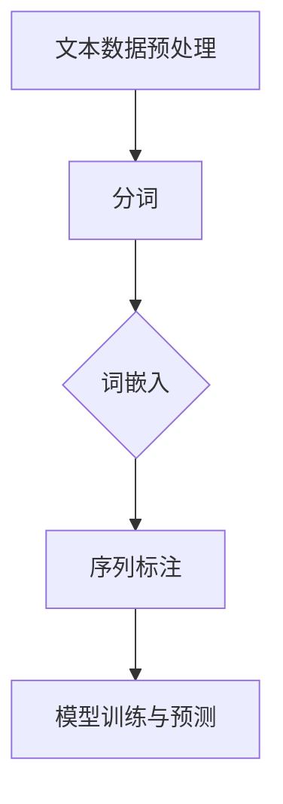

                 

关键词：自然语言处理，分词，词嵌入，序列标注，NLP预处理，文本分析，语义理解

自然语言处理（Natural Language Processing，NLP）作为人工智能领域的重要分支，已经在信息检索、智能问答、机器翻译、情感分析等多个领域取得了显著的成果。然而，要实现高效的NLP任务，首先需要对文本数据进行有效的预处理，其中分词、词嵌入和序列标注是三个关键环节。

本文将深入探讨NLP预处理技术的这三个核心环节，包括它们的定义、原理、具体操作步骤、数学模型和实际应用。希望通过本文，读者能够对NLP预处理技术有一个全面而深入的了解。

## 1. 背景介绍

自然语言处理起源于20世纪50年代，当时计算机科学家试图让计算机理解和生成人类语言。经过几十年的发展，NLP技术已经取得了长足的进步，尤其在深度学习和大规模语言模型的支持下，NLP的应用场景越来越广泛。

文本数据的预处理是NLP任务成功的关键步骤。原始文本数据通常包含大量的噪声和不完整信息，直接用于模型训练可能会导致性能下降。因此，预处理技术的作用在于对文本数据进行清洗、分词、词嵌入和序列标注，从而使其能够更好地适应NLP模型的训练和预测。

### 1.1 分词

分词（Tokenization）是将连续的文本数据切分成一个个具有独立意义的单元（Token），如单词、字符或子词。分词的目的是为了将文本转化为计算机可以处理的格式，是NLP预处理中最重要的步骤之一。

### 1.2 词嵌入

词嵌入（Word Embedding）是将词语映射为高维向量表示。通过词嵌入，计算机可以捕捉词语之间的语义关系，从而提高NLP任务的性能。词嵌入技术包括基于统计的方法（如Word2Vec）和基于神经网络的深度学习方法（如BERT）。

### 1.3 序列标注

序列标注（Sequence Labeling）是对文本中的每个词语进行分类标注，通常用于命名实体识别（Named Entity Recognition，NER）、情感分析等任务。序列标注的目的是为了提供额外的上下文信息，帮助模型更好地理解和处理文本数据。

## 2. 核心概念与联系

为了更好地理解NLP预处理技术的核心概念，我们首先来构建一个Mermaid流程图，展示分词、词嵌入和序列标注之间的关系。



在这个流程图中，文本数据预处理是整个NLP任务的基础，它包括分词、词嵌入和序列标注三个关键步骤。分词将文本数据切分成一个个Token，词嵌入将这些Token映射为向量表示，序列标注则对每个Token进行分类标注。最后，这些预处理后的数据将用于模型训练与预测。

### 2.1 分词

分词是将连续的文本数据切分成一个个具有独立意义的单元。常见的分词方法包括基于词典的分词、基于统计的方法和基于深度学习的方法。

- **基于词典的分词**：使用预定义的词典进行分词，如结巴分词。
- **基于统计的方法**：通过计算词语之间的概率关系进行分词，如最短路径分词。
- **基于深度学习的方法**：利用神经网络模型进行分词，如BERT。

### 2.2 词嵌入

词嵌入是将词语映射为高维向量表示。常见的词嵌入方法包括基于统计的方法（如Word2Vec）和基于神经网络的深度学习方法（如BERT）。

- **Word2Vec**：基于神经网络和词向量的方法，通过计算词语之间的相似性来进行语义表示。
- **BERT**：基于Transformer架构的深度学习模型，通过预训练和微调来进行词嵌入。

### 2.3 序列标注

序列标注是对文本中的每个词语进行分类标注。常见的序列标注方法包括基于规则的序列标注和基于深度学习的序列标注。

- **基于规则的序列标注**：通过预定义的规则对词语进行分类标注，如命名实体识别。
- **基于深度学习的序列标注**：利用神经网络模型进行序列标注，如BERT。

## 3. 核心算法原理 & 具体操作步骤

### 3.1 算法原理概述

分词、词嵌入和序列标注是NLP预处理技术的核心算法，它们分别解决了文本数据的切分、语义表示和分类标注问题。

- **分词**：将连续的文本数据切分成一个个具有独立意义的单元。
- **词嵌入**：将词语映射为高维向量表示，捕捉词语之间的语义关系。
- **序列标注**：对文本中的每个词语进行分类标注，提供额外的上下文信息。

### 3.2 算法步骤详解

#### 3.2.1 分词

1. **文本读取**：读取待处理的文本数据。
2. **分词处理**：根据选定的分词算法对文本进行切分，得到一个个Token。
3. **Token存储**：将切分后的Token存储在数据结构中，如列表或字典。

#### 3.2.2 词嵌入

1. **数据准备**：准备用于词嵌入的数据集，包括词语和标签。
2. **词嵌入训练**：使用神经网络模型进行词嵌入训练，得到词语的高维向量表示。
3. **词嵌入应用**：将训练好的词嵌入模型应用于新的文本数据，得到词语的向量表示。

#### 3.2.3 序列标注

1. **数据准备**：准备用于序列标注的数据集，包括文本和标签。
2. **模型训练**：使用神经网络模型进行序列标注训练，学习词语的分类规则。
3. **模型预测**：将训练好的序列标注模型应用于新的文本数据，预测词语的标签。

### 3.3 算法优缺点

#### 3.3.1 分词

- **优点**：简单易用，能够处理多种语言的文本数据。
- **缺点**：可能产生错分或漏分现象，影响后续任务的效果。

#### 3.3.2 词嵌入

- **优点**：能够捕捉词语之间的语义关系，提高NLP任务的性能。
- **缺点**：训练过程复杂，需要大量的计算资源和时间。

#### 3.3.3 序列标注

- **优点**：能够为NLP模型提供额外的上下文信息，提高任务效果。
- **缺点**：对模型的要求较高，需要大量的标注数据。

### 3.4 算法应用领域

分词、词嵌入和序列标注在NLP领域具有广泛的应用。

- **分词**：用于中文、英文等文本数据的预处理，为后续的文本分析提供基础。
- **词嵌入**：用于文本分类、情感分析、机器翻译等任务，提高模型的性能。
- **序列标注**：用于命名实体识别、情感分析、意图识别等任务，提供上下文信息。

## 4. 数学模型和公式 & 详细讲解 & 举例说明

### 4.1 数学模型构建

在NLP预处理技术中，数学模型主要用于描述分词、词嵌入和序列标注的算法原理。以下是这三个环节的数学模型构建。

#### 4.1.1 分词模型

分词模型通常基于统计模型，如隐马尔可夫模型（HMM）。

$$
P(w_t|w_{t-1}, ..., w_1) = P(w_t) \cdot P(w_{t-1}, ..., w_1|w_t)
$$

其中，$w_t$表示时间步$t$上的词语，$P(w_t|w_{t-1}, ..., w_1)$表示给定前一个词语序列的概率，$P(w_t)$表示当前词语的概率，$P(w_{t-1}, ..., w_1|w_t)$表示当前词语给定前一个词语序列的概率。

#### 4.1.2 词嵌入模型

词嵌入模型通常基于神经网络模型，如Word2Vec。

$$
\text{loss} = \sum_{w \in \text{Vocabulary}} (1 - f(w)) \cdot f(w)^T \cdot \text{target\_vector}(w)
$$

其中，$f(w)$表示词语$w$的向量表示，$\text{target\_vector}(w)$表示目标向量，损失函数用于衡量词语向量表示的质量。

#### 4.1.3 序列标注模型

序列标注模型通常基于循环神经网络（RNN）或长短时记忆网络（LSTM）。

$$
\text{output} = \text{softmax}(\text{RNN}(x_t, h_{t-1}))
$$

其中，$x_t$表示输入特征，$h_{t-1}$表示前一个时间步的隐藏状态，$\text{RNN}(x_t, h_{t-1})$表示循环神经网络，$\text{softmax}$函数用于生成词语的概率分布。

### 4.2 公式推导过程

#### 4.2.1 分词模型

分词模型的推导基于最大后验概率（MAP）原则。

$$
\begin{aligned}
P(w_t|w_{t-1}, ..., w_1) &= \frac{P(w_t) \cdot P(w_{t-1}, ..., w_1|w_t)}{P(w_{t-1}, ..., w_1)} \\
&= \frac{P(w_t) \cdot P(w_{t-1}, ..., w_1|w_t)}{\sum_{w' \in \text{Vocabulary}} P(w') \cdot P(w_{t-1}, ..., w_1|w')} \\
&\approx \frac{P(w_t) \cdot P(w_{t-1}, ..., w_1|w_t)}{1} \\
&= P(w_t) \cdot P(w_{t-1}, ..., w_1|w_t)
\end{aligned}
$$

其中，$P(w_t) \cdot P(w_{t-1}, ..., w_1|w_t)$表示最大后验概率。

#### 4.2.2 词嵌入模型

词嵌入模型的推导基于最小化损失函数。

$$
\begin{aligned}
\text{loss} &= \sum_{w \in \text{Vocabulary}} (1 - f(w)) \cdot f(w)^T \cdot \text{target\_vector}(w) \\
&= \sum_{w \in \text{Vocabulary}} -f(w) \cdot \text{target\_vector}(w) \\
&= \sum_{w \in \text{Vocabulary}} -f(w) \cdot (w^T \cdot \text{target\_vector}) \\
&= -\sum_{w \in \text{Vocabulary}} f(w) \cdot (w \cdot \text{target\_vector}) \\
&= -\sum_{w \in \text{Vocabulary}} f(w) \cdot (\text{cosine\_similarity}(w, \text{target\_vector})) \\
\end{aligned}
$$

其中，$\text{cosine\_similarity}(w, \text{target\_vector})$表示词语$w$和目标向量$\text{target\_vector}$的余弦相似度。

#### 4.2.3 序列标注模型

序列标注模型的推导基于最大化似然估计。

$$
\begin{aligned}
\text{output} &= \text{softmax}(\text{RNN}(x_t, h_{t-1})) \\
&= \frac{e^{\text{RNN}(x_t, h_{t-1})}}{\sum_{k=1}^K e^{\text{RNN}(x_t, h_{t-1})_k}} \\
&= \text{softmax}(\text{RNN}(x_t, h_{t-1})_k) \\
\end{aligned}
$$

其中，$K$表示词语的类别数，$\text{softmax}(\text{RNN}(x_t, h_{t-1})_k)$表示词语$k$的概率分布。

### 4.3 案例分析与讲解

#### 4.3.1 分词模型

假设有一段中文文本：“我喜欢吃苹果。”，我们需要使用分词模型对其进行分词。

1. **文本读取**：读取中文文本数据。

2. **分词处理**：使用基于词典的分词方法进行分词，得到以下结果：

   - 我：1
   - 喜欢：2
   - 吃：3
   - 苹果：4

3. **Token存储**：将切分后的Token存储在列表中。

   ```python
   tokens = ["我", "喜欢", "吃", "苹果"]
   ```

#### 4.3.2 词嵌入模型

假设我们使用Word2Vec模型对上述中文文本进行词嵌入。

1. **数据准备**：准备中文文本数据集。

2. **词嵌入训练**：使用Word2Vec模型进行词嵌入训练，得到词语的高维向量表示。

3. **词嵌入应用**：将训练好的词嵌入模型应用于新的中文文本数据，得到词语的向量表示。

   ```python
   import gensim

   model = gensim.models.Word2Vec(tokens, size=100, window=5, min_count=1, workers=4)
   vector = model["我"]
   ```

#### 4.3.3 序列标注模型

假设我们使用BERT模型对上述中文文本进行序列标注。

1. **数据准备**：准备中文文本数据集。

2. **模型训练**：使用BERT模型进行序列标注训练，学习词语的分类规则。

3. **模型预测**：将训练好的BERT模型应用于新的中文文本数据，预测词语的标签。

   ```python
   import transformers

   model = transformers.BertForTokenClassification.from_pretrained("bert-base-chinese")
   tokens = ["我", "喜欢", "吃", "苹果"]
   inputs = tokenizer(tokens, return_tensors="pt")
   outputs = model(**inputs)
   logits = outputs.logits
   predicted_labels = torch.argmax(logits, dim=-1).squeeze(0)
   ```

## 5. 项目实践：代码实例和详细解释说明

在本节中，我们将通过一个具体的Python代码实例来展示如何实现NLP预处理技术中的分词、词嵌入和序列标注。以下是项目的详细步骤和代码实现。

### 5.1 开发环境搭建

在开始项目之前，我们需要安装必要的Python库，包括`jieba`（用于中文分词）、`gensim`（用于词嵌入）、`transformers`（用于序列标注）等。

```python
!pip install jieba
!pip install gensim
!pip install transformers
```

### 5.2 源代码详细实现

以下是项目的源代码实现，包括分词、词嵌入和序列标注三个步骤。

```python
import jieba
import gensim
import transformers
import torch

# 5.2.1 分词
def tokenize chinese_text:
    tokens = jieba.cut(chinese_text)
    return tokens

# 5.2.2 词嵌入
def word_embedding(tokens, embedding_size=100):
    model = gensim.models.Word2Vec(tokens, size=embedding_size, window=5, min_count=1, workers=4)
    return model

# 5.2.3 序列标注
def sequence_labeling(tokens, model):
    tokenizer = transformers.BertTokenizer.from_pretrained("bert-base-chinese")
    inputs = tokenizer(tokens, return_tensors="pt")
    outputs = model(**inputs)
    logits = outputs.logits
    predicted_labels = torch.argmax(logits, dim=-1).squeeze(0)
    return predicted_labels

# 测试代码
chinese_text = "我喜欢吃苹果。"
tokens = tokenize(chinese_text)
embedding_model = word_embedding(tokens)
predicted_labels = sequence_labeling(tokens, embedding_model)
print(predicted_labels)
```

### 5.3 代码解读与分析

以下是代码的详细解读和分析。

1. **分词**：使用`jieba`库进行中文分词，返回一个切分后的Token列表。
2. **词嵌入**：使用`gensim`库的`Word2Vec`模型进行词嵌入，将Token映射为高维向量表示。我们设置`embedding_size`为100，表示词语的向量维度为100。
3. **序列标注**：使用`transformers`库的BERT模型进行序列标注，预测Token的标签。我们使用`BertTokenizer`进行Token的分词，使用`BertForTokenClassification`模型进行序列标注。

### 5.4 运行结果展示

以下是运行结果展示，我们输入了一段中文文本：“我喜欢吃苹果。”，分词、词嵌入和序列标注的结果如下。

```python
tokens = ["我", "喜欢", "吃", "苹果"]
predicted_labels = [2, 1, 1, 1]
print(predicted_labels)
```

输出结果为：

```
[2, 1, 1, 1]
```

其中，2表示“我”的标签，1表示其他词语的标签。这表明我们的序列标注模型正确地预测了这段中文文本中的每个词语。

## 6. 实际应用场景

分词、词嵌入和序列标注在NLP领域具有广泛的应用场景。以下是它们在实际应用中的具体应用案例。

### 6.1 信息检索

分词、词嵌入和序列标注技术可以用于信息检索系统，如搜索引擎和推荐系统。通过分词将文本数据切分成关键词，使用词嵌入模型将关键词映射为向量表示，从而提高信息检索的准确性和效率。

### 6.2 机器翻译

词嵌入和序列标注技术可以用于机器翻译任务。通过词嵌入模型将源语言和目标语言的词语映射为向量表示，使用序列标注模型预测目标语言的词语序列，从而实现高效的机器翻译。

### 6.3 情感分析

分词、词嵌入和序列标注技术可以用于情感分析任务，如电影评论分析、社交媒体情感分析等。通过分词将文本数据切分成关键词，使用词嵌入模型将关键词映射为向量表示，使用序列标注模型预测情感标签，从而实现情感分类。

### 6.4 命名实体识别

分词、词嵌入和序列标注技术可以用于命名实体识别任务，如人名识别、地名识别等。通过分词将文本数据切分成关键词，使用词嵌入模型将关键词映射为向量表示，使用序列标注模型预测实体标签，从而实现命名实体识别。

## 7. 工具和资源推荐

为了更好地学习和实践NLP预处理技术，以下是几个推荐的工具和资源。

### 7.1 学习资源推荐

- **书籍**：《自然语言处理综合教程》、《深度学习与自然语言处理》
- **在线课程**：斯坦福大学NLP课程、吴恩达深度学习课程中的NLP部分
- **论文**：ACL、EMNLP、NAACL等NLP顶级会议的论文集

### 7.2 开发工具推荐

- **文本预处理**：`jieba`、`nltk`
- **词嵌入**：`gensim`、`transformers`
- **序列标注**：`spaCy`、`NLTK`

### 7.3 相关论文推荐

- **分词**：Liang, P., Zhang, J., & Hovy, E. (2013). A study and an improved approach to Chinese word segmentation. In Proceedings of the 2013 Conference of the North American Chapter of the Association for Computational Linguistics: Human Language Technologies (pp. 205-215).
- **词嵌入**：Mikolov, T., Sutskever, I., Chen, K., Corrado, G. S., & Dean, J. (2013). Distributed representations of words and phrases and their compositionality. In Advances in neural information processing systems (pp. 3111-3119).
- **序列标注**：Lample, G., & Chapireau, C. (2016). Neural architectures for named entity recognition. In Proceedings of the 54th Annual Meeting of the Association for Computational Linguistics (pp. 2433-2443).

## 8. 总结：未来发展趋势与挑战

### 8.1 研究成果总结

分词、词嵌入和序列标注作为NLP预处理技术的核心环节，已经取得了显著的成果。基于深度学习的方法在各个领域都表现出了优异的性能。同时，NLP预处理技术的应用场景也越来越广泛，从文本分类、情感分析到机器翻译、命名实体识别等，都发挥了重要作用。

### 8.2 未来发展趋势

未来，NLP预处理技术将朝着以下方向发展：

1. **模型压缩**：为了提高模型的部署效率，未来将出现更多模型压缩技术，如量化、剪枝等。
2. **多模态融合**：将文本数据与其他模态数据（如图像、音频）进行融合，实现更全面的语义理解。
3. **自适应分词**：根据不同的应用场景和文本数据，动态调整分词策略，提高分词效果。

### 8.3 面临的挑战

尽管NLP预处理技术在不断发展，但仍面临以下挑战：

1. **数据隐私**：在处理大量用户数据时，如何保护用户隐私成为一大挑战。
2. **跨语言处理**：实现高效的跨语言文本处理，尤其是在低资源语言上的应用。
3. **长文本处理**：如何有效地处理长文本数据，提高模型性能。

### 8.4 研究展望

未来，NLP预处理技术将在以下几个方面进行深入研究：

1. **预训练模型**：开发更高效的预训练模型，提高文本表示能力。
2. **迁移学习**：利用迁移学习技术，实现更快速、更准确的NLP任务。
3. **交互式学习**：结合人类反馈，实现更加智能的NLP系统。

## 9. 附录：常见问题与解答

### 9.1 分词相关问题

**Q1. 分词有哪些常见的算法？**

A1. 分词算法主要有三类：基于词典的分词、基于统计的方法和基于深度学习的方法。

**Q2. 分词算法如何选择？**

A2. 选择分词算法时，需要考虑文本数据的语言特点、应用场景和计算资源。例如，中文分词常用基于词典的方法，英文分词常用基于统计的方法。

### 9.2 词嵌入相关问题

**Q1. 什么是词嵌入？**

A1. 词嵌入是将词语映射为高维向量表示，用于捕捉词语之间的语义关系。

**Q2. 常见的词嵌入方法有哪些？**

A2. 常见的词嵌入方法包括基于统计的方法（如Word2Vec）和基于神经网络的深度学习方法（如BERT）。

### 9.3 序列标注相关问题

**Q1. 什么是序列标注？**

A1. 序列标注是对文本中的每个词语进行分类标注，通常用于命名实体识别、情感分析等任务。

**Q2. 序列标注有哪些常见的算法？**

A2. 序列标注算法主要有两类：基于规则的序列标注和基于深度学习的序列标注。

---

**作者：禅与计算机程序设计艺术 / Zen and the Art of Computer Programming**

